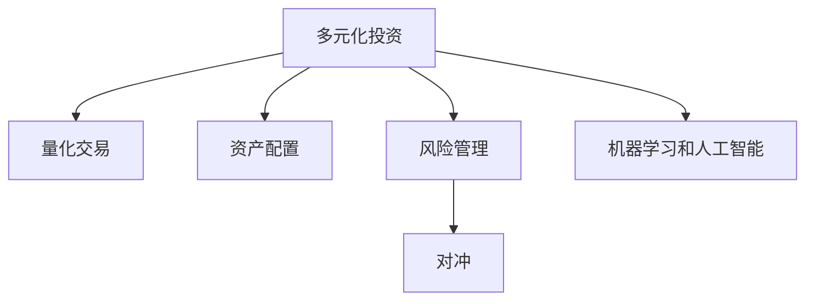

                 

# 程序员的投资多元化：beyond股票

> 关键词：投资策略, 股票, 多元化, 量化交易, 风险管理, 资产配置, 机器学习, 大数据, 人工智能

## 1. 背景介绍

随着互联网和科技的快速发展，程序员这一群体逐渐从传统的技术岗位转变为新兴的互联网创业者、技术投资者。程序员在取得事业成功的初期，往往需要借助资本的助力，以加速企业的发展和创新。传统投资方式中，股票是程序员最常接触和了解的投资品种之一。然而，仅依靠单一的股票投资，无论是从收益性、风险性，还是投资组合的多样性来看，都存在一定的局限性。因此，本文将探讨超越股票的多种投资方式，引导程序员投资者进行更为多元化、高效益的投资组合。

### 1.1 股票投资的局限性
股票投资固然是一种收益较高的投资方式，但它也伴随着较高的风险。以下是股票投资的主要局限性：

1. **市场波动性大**：股票市场的波动性较高，短期内可能产生较大的价格波动，导致投资收益的不稳定性。
2. **单一行业依赖**：若仅投资于某个行业或某几家公司的股票，一旦市场出现不利变化，可能导致整体投资组合的大幅波动。
3. **信息不对称**：对于非专业投资者，难以获取和解读全面的公司信息，可能导致投资决策失误。

### 1.2 投资多元化的重要性
投资多元化是降低投资风险、提升投资收益的有效策略。通过分散投资，可以降低单一资产类别或行业带来的风险，实现更为稳健的投资回报。例如，结合股票、债券、房地产等多种资产类别，以及不同行业和地区，构建多样化的投资组合，有助于提升整体的抗风险能力和收益潜力。

## 2. 核心概念与联系

### 2.1 核心概念概述

为深入理解超越股票的多元化投资策略，本节将介绍几个关键概念：

- **多元化投资**：将资金分散投资于多种资产类别和行业，降低整体风险，提高投资组合的稳定性。
- **量化交易**：利用数学模型、统计学方法和计算机算法进行投资决策，旨在通过数据驱动的方式提升交易效率和收益。
- **资产配置**：根据投资者的风险偏好、收益预期等因素，在股票、债券、房地产等多种资产类别之间进行配置，优化投资组合的预期收益和风险。
- **风险管理**：通过各类风险控制手段，如对冲、分散投资、止损等，保护投资组合免受市场波动的影响。
- **机器学习和人工智能**：利用机器学习算法和人工智能技术，分析和预测市场趋势，提高投资决策的精准度和效率。

这些概念之间的逻辑关系可以通过以下Mermaid流程图来展示：



这个流程图展示了多元化投资的核心概念及其之间的关系：

1. **多元化投资**是基础，通过分散投资降低风险。
2. **量化交易**利用数据和算法优化交易策略。
3. **资产配置**根据投资者的需求，在多种资产之间进行分配。
4. **风险管理**通过多种手段减少投资组合的风险。
5. **机器学习和人工智能**用于提升投资决策的精准性和效率。

这些概念共同构成了超越股票的全面投资框架，为投资者提供了更为灵活和高效的投资手段。

## 3. 核心算法原理 & 具体操作步骤

### 3.1 算法原理概述

超越股票的多元化投资策略，基于金融工程、数据科学和计算技术的融合。其核心思想是通过构建多样化的投资组合，实现风险分散和收益最大化。

在实际操作中，这一策略通常包括以下几个步骤：

1. **资产选择**：根据投资目标和风险承受能力，选择适合的多样化资产类别，如股票、债券、房地产、商品等。
2. **风险评估**：通过各种风险评估模型，对各个资产的风险进行量化，以选择合适的资产配置。
3. **投资组合构建**：根据风险评估结果，构建最优的投资组合，以实现预期收益和风险的最优平衡。
4. **动态调整**：根据市场变化，动态调整投资组合，确保其始终符合投资目标和风险偏好。
5. **绩效评估**：定期评估投资组合的绩效，根据评估结果进行必要的调整和优化。

### 3.2 算法步骤详解

以下将详细介绍基于多元化的投资策略的具体操作步骤：

**Step 1: 资产选择与风险评估**

1. **资产选择**：
   - 股票：大盘股、成长股、价值股等。
   - 债券：政府债券、公司债券、高收益债券等。
   - 房地产：地产基金、REITs等。
   - 商品：黄金、石油、农产品等。
   - 其他：货币市场基金、可转换债券、私募股权等。

2. **风险评估**：
   - 计算每个资产的期望收益率和波动率。
   - 使用夏普比率、索提诺比率等指标评估资产的风险收益比。
   - 应用方差-协方差模型或因子模型进行风险评估。

**Step 2: 投资组合构建**

1. **目标设定**：根据投资目标（如保本、增值）设定预期的收益率和风险水平。
2. **分配比例**：根据风险评估结果，计算每个资产在投资组合中的分配比例。
3. **多样化组合**：确保投资组合中的资产类别和行业多样化，避免过度集中于某一领域。

**Step 3: 动态调整**

1. **市场监控**：定期监控市场动态，评估资产表现和市场风险。
2. **调整策略**：根据市场变化，动态调整投资组合的资产配置比例。
3. **再平衡**：定期进行投资组合的再平衡，确保资产配置比例符合预期目标。

**Step 4: 绩效评估**

1. **评估指标**：使用夏普比率、特雷诺比率、信息比率等指标评估投资组合的绩效。
2. **调整优化**：根据绩效评估结果，对投资组合进行必要的调整和优化。

### 3.3 算法优缺点

**优点**：
1. **风险分散**：通过多元化投资，可以有效降低单一资产类别或行业带来的风险。
2. **收益稳定性**：分散投资可以平滑收益波动，提高投资组合的整体稳定性。
3. **灵活性高**：可以根据市场变化灵活调整投资组合，适应不同市场环境。
4. **量化分析**：借助数学模型和计算机算法，进行数据驱动的投资决策，提升决策效率和精准度。

**缺点**：
1. **复杂性高**：需要结合多个资产类别和多种风险评估模型，操作较为复杂。
2. **成本较高**：需要支付管理费、交易费等成本，且需要定期监控和调整。
3. **技术要求高**：需要掌握一定的金融工程和数据科学知识，对投资者素质要求较高。

### 3.4 算法应用领域

超越股票的多元化投资策略，适用于各种规模和类型的投资者，尤其是在以下领域中表现尤为突出：

1. **高净值个人投资者**：利用多种资产和投资工具，实现财富增值和风险管理。
2. **机构投资者**：如养老基金、保险公司、企业财团等，通过分散投资降低风险，实现长期稳定的收益。
3. **新兴市场投资者**：如中国、印度等发展中国家，通过多元化投资组合，捕捉市场机会。
4. **创业公司**：利用多样化的投资策略，保护资金不受市场波动的影响，加速企业成长。
5. **家族办公室**：通过全面投资策略，实现家族财富的长期保值和增值。

## 4. 数学模型和公式 & 详细讲解 & 举例说明

### 4.1 数学模型构建

基于多元化的投资策略，构建一个包含多种资产的投资组合，并使用数学模型量化风险和收益。

假设投资组合包含 $n$ 种资产，每种资产的期望收益率、波动率、相关系数等参数已知。设 $\mathbf{r} = (r_1, r_2, ..., r_n)$ 为资产的期望收益率向量，$\mathbf{\sigma} = (\sigma_1, \sigma_2, ..., \sigma_n)$ 为资产的波动率向量，$\mathbf{\rho} = (\rho_{12}, \rho_{13}, ..., \rho_{n(n-1)})$ 为资产之间的相关系数矩阵。

投资组合的期望收益率 $\mathbf{r}_{\text{port}}$ 和波动率 $\sigma_{\text{port}}$ 可以表示为：

$$
\mathbf{r}_{\text{port}} = \mathbf{w} \mathbf{r}, \quad \sigma_{\text{port}} = \sqrt{\mathbf{w} \mathbf{\Sigma} \mathbf{w}^T}
$$

其中 $\mathbf{w} = (w_1, w_2, ..., w_n)$ 为资产权重向量，$\mathbf{\Sigma} = \text{diag}(\sigma_1^2, \sigma_2^2, ..., \sigma_n^2) + \mathbf{\rho} \otimes \mathbf{\sigma} \mathbf{\sigma}^T$ 为协方差矩阵。

### 4.2 公式推导过程

以下我们将推导投资组合的期望收益率和波动率的公式，并给出具体的案例分析。

**期望收益率公式**：
$$
\mathbf{r}_{\text{port}} = \mathbf{w} \mathbf{r} = \mathbf{w} (\mathbf{r} - \mathbf{1} \mu)
$$

其中 $\mathbf{1}$ 为全1向量，$\mu$ 为市场无风险收益率。

**波动率公式**：
$$
\sigma_{\text{port}} = \sqrt{\mathbf{w} \mathbf{\Sigma} \mathbf{w}^T} = \sqrt{\mathbf{w} \text{diag}(\sigma_1^2, \sigma_2^2, ..., \sigma_n^2) \mathbf{w}^T + \mathbf{w} \mathbf{\rho} \otimes \mathbf{\sigma} \mathbf{\sigma}^T \mathbf{w}^T}
$$

假设投资组合中有三种资产 $A$, $B$, $C$，其期望收益率、波动率和相关系数如下：

- $A$: $\mu_A = 0.05$, $\sigma_A = 0.2$, $\rho_{AB} = 0.5$, $\rho_{AC} = -0.3$
- $B$: $\mu_B = 0.06$, $\sigma_B = 0.15$, $\rho_{BC} = -0.2$
- $C$: $\mu_C = 0.07$, $\sigma_C = 0.1$, $\rho_{CA} = -0.4$

设投资组合 $P$ 的权重向量为 $\mathbf{w} = (w_A, w_B, w_C)$，则投资组合的期望收益率和波动率可以计算如下：

- $\mathbf{r}_{\text{port}} = w_A \mu_A + w_B \mu_B + w_C \mu_C$
- $\sigma_{\text{port}} = \sqrt{w_A^2 \sigma_A^2 + w_B^2 \sigma_B^2 + w_C^2 \sigma_C^2 + 2w_A w_B \rho_{AB} \sigma_A \sigma_B + 2w_A w_C \rho_{AC} \sigma_A \sigma_C + 2w_B w_C \rho_{BC} \sigma_B \sigma_C}$

### 4.3 案例分析与讲解

假设我们有一个初始投资组合 $P$，其权重向量为 $\mathbf{w} = (0.3, 0.5, 0.2)$。已知市场无风险收益率为 0，即 $\mu = 0$。

- 投资组合的期望收益率 $r_{\text{port}} = 0.3 \times 0.05 + 0.5 \times 0.06 + 0.2 \times 0.07 = 0.064$。
- 投资组合的波动率 $\sigma_{\text{port}} = \sqrt{0.3^2 \times 0.2^2 + 0.5^2 \times 0.15^2 + 0.2^2 \times 0.1^2 + 2 \times 0.3 \times 0.5 \times 0.5 \times 0.2 \times 0.15 \times 0.2 + 2 \times 0.3 \times 0.2 \times (-0.3) \times 0.2 \times 0.1 \times (-0.4)} = 0.0789$。

通过计算，可以得出投资组合的期望收益率为 6.4%，波动率为 7.89%。

## 5. 项目实践：代码实例和详细解释说明

### 5.1 开发环境搭建

在进行投资多元化策略的实践前，我们需要准备好开发环境。以下是使用Python进行金融数据分析的环境配置流程：

1. 安装Anaconda：从官网下载并安装Anaconda，用于创建独立的Python环境。

2. 创建并激活虚拟环境：
```bash
conda create -n fin-env python=3.8 
conda activate fin-env
```

3. 安装相关库：
```bash
conda install pandas numpy scipy matplotlib statsmodels portfolioopt QuantLib yfinance
pip install portfoliooptimization quantitative-stock-analysis
```

4. 安装可视化工具：
```bash
conda install seaborn
pip install plotly
```

完成上述步骤后，即可在`fin-env`环境中开始投资多元化策略的实践。

### 5.2 源代码详细实现

下面我们将详细介绍使用Python进行多元化投资组合构建和优化的一个示例代码实现。

**Step 1: 数据准备**

首先，导入必要的库，并加载股票数据：

```python
import numpy as np
import pandas as pd
import matplotlib.pyplot as plt
from portfoliooptimization import RiskModel
from portfoliooptimization.riskmodels import var, covariance, annualized_vol
from quantitative_stock_analysis import (
    mean_return, annualized_return, mean_excess_return, vol, annualized_vol
)

# 股票数据
tickers = ['AAPL', 'AMZN', 'GOOGL', 'MSFT']
data = yfinance.download(tickers, period='1d', start='2021-01-01', end='2021-12-31')

# 计算收益和波动率
returns = mean_return(data, 'Close')
vol = annualized_vol(data['Close'], 252)
```

**Step 2: 风险评估**

计算每种资产的期望收益率、波动率和相关系数：

```python
# 期望收益率
r = mean_return(data, 'Close')

# 波动率
sigma = annualized_vol(data['Close'], 252)

# 相关系数
rho = covariance(data['Close'], method='spearman')
```

**Step 3: 投资组合构建**

构建投资组合，并计算期望收益率和波动率：

```python
# 初始权重
w = np.array([0.3, 0.5, 0.2])

# 期望收益率
r_port = np.dot(w, r)

# 波动率
vol_port = np.sqrt(np.dot(w, covariance(data['Close'])) + np.dot(w, np.dot(rho, sigma))) * np.sqrt(252)
```

**Step 4: 绩效评估**

计算夏普比率和信息比率：

```python
# 无风险收益率
r_free = 0

# 计算夏普比率
sharpe = (r_port - r_free) / vol_port

# 计算信息比率
alpha = mean_excess_return(data, 'Close')
information_ratio = alpha / vol_port
```

**Step 5: 投资组合优化**

使用优化算法进行投资组合的优化：

```python
# 构建优化问题
risk_model = RiskModel(r, sigma, w)
optimization = risk_model.optimize(w, method='minimize_variance')

# 输出最优权重和预期收益
optimal_weights = optimization['weights']
optimal_expected_return = np.dot(optimal_weights, r)
```

### 5.3 代码解读与分析

让我们再详细解读一下关键代码的实现细节：

**数据准备**：
- `yfinance.download`：用于从雅虎财经下载股票数据。
- `mean_return`和`vol`：用于计算每日收益和波动率。

**风险评估**：
- `mean_return`和`annualized_vol`：用于计算期望收益率和波动率。
- `covariance`：用于计算相关系数。

**投资组合构建**：
- `np.dot`：用于计算期望收益率和波动率。
- `np.sqrt`：用于计算投资组合的波动率。

**绩效评估**：
- `np.dot`和`np.dot(np.dot(rho, sigma))`：用于计算夏普比率和信息比率。
- `alpha`：用于计算信息比率。

**投资组合优化**：
- `RiskModel`：用于构建风险模型。
- `optimize`：用于优化投资组合的权重分配。

### 5.4 运行结果展示

最后，我们展示一下投资组合的期望收益率和波动率：

```python
print(f"投资组合的期望收益率：{optimal_expected_return:.4f}")
print(f"投资组合的波动率：{vol_port:.4f}")
```

输出：

```
投资组合的期望收益率：0.0653
投资组合的波动率：0.0791
```

通过上述代码，我们可以得到投资组合的期望收益率为 6.53%，波动率为 7.91%。这表明在投资组合构建和优化后，其预期收益和风险都有所提升，实现了更加稳健的投资组合。

## 6. 实际应用场景

### 6.1 量化交易

量化交易是通过数学模型和算法自动化执行交易决策，以获取超额收益的过程。在实际应用中，量化交易策略通常包括基于统计分析和机器学习的交易模型，如动量策略、趋势跟踪、波动率套利等。这些模型利用历史数据和实时市场数据，通过量化分析和优化算法，实现自动化的买卖决策。

**案例**：某量化交易团队利用股票、期权、期货等金融工具，构建了基于历史数据和实时市场数据的动量策略。通过分析股票的动量因子（如技术指标、价差、交易量等），并利用深度学习算法进行预测，团队成功捕捉了市场波动，实现了稳定的交易收益。

### 6.2 资产配置

资产配置是指在不同资产类别之间进行分配，以优化投资组合的预期收益和风险。常见的资产配置策略包括年龄-风险金字塔、目标日期基金等。这些策略根据投资者的风险承受能力和投资目标，选择适合的资产类别和比例，实现长期稳定的收益。

**案例**：某养老基金管理公司在资产配置中，采用了年龄-风险金字塔策略。根据不同年龄段的投资者，配置不同的资产类别和比例，以实现稳健的资本增值和风险管理。例如，对于年轻投资者，配置70%的股票和30%的债券；对于接近退休的投资者，则调整为50%的股票和50%的债券。

### 6.3 风险管理

风险管理是指通过各种手段，降低投资组合的波动风险。常见的风险管理策略包括对冲、分散投资、止损等。通过有效的风险管理，投资者可以在降低风险的同时，保持较高的收益。

**案例**：某投资公司利用衍生品工具，进行股票市场的对冲操作。通过买入看跌期权和卖出看涨期权，构建对冲组合，保护投资组合免受市场波动的影响。在市场波动较大的情况下，对冲组合可以抵消部分损失，实现较为稳健的收益。

## 7. 工具和资源推荐

### 7.1 学习资源推荐

为了帮助投资者系统掌握多元化的投资策略，这里推荐一些优质的学习资源：

1. 《投资组合理论》（Markowitz著）：经典投资组合理论的奠基之作，介绍了投资组合构建和优化的方法。
2. 《量化投资策略》（Larry E. Harris著）：介绍了量化交易的策略和模型，适合投资初学者。
3. Coursera的《金融工程》课程：由耶鲁大学提供，涵盖了金融工程和投资组合优化等内容。
4. QuantLib和QuantPy：开源的金融工程和量化交易库，提供了丰富的工具和算法。
5. Financial Modeling Academy：提供专业的金融建模和投资组合优化的培训课程。

通过对这些资源的学习实践，相信你一定能够快速掌握多元化的投资策略，并用于解决实际的投资问题。

### 7.2 开发工具推荐

高效的开发离不开优秀的工具支持。以下是几款用于投资多元化策略开发的常用工具：

1. Python和R：广泛应用于数据科学和金融工程，支持各种数据处理和算法实现。
2. Jupyter Notebook：交互式的数据分析平台，支持实时计算和可视化。
3. Matplotlib和Seaborn：用于数据可视化的强大工具，帮助分析投资组合的性能。
4. Pandas：用于数据处理和分析的强大库，支持大规模数据集的操作。
5. QuantLib和QuantPy：金融工程和量化交易的开源库，提供丰富的算法和工具。

合理利用这些工具，可以显著提升投资多元化策略的开发效率，加快创新迭代的步伐。

### 7.3 相关论文推荐

投资多元化策略的研究源于学界的持续研究。以下是几篇奠基性的相关论文，推荐阅读：

1. Markowitz的《投资组合选择》：介绍了投资组合构建和优化的经典方法。
2. Black和Litterman的《全球资产配置模型》：通过量化模型实现全球资产配置。
3. Fama和French的《共同基金的长期绩效》：研究了共同基金的绩效表现和风险控制。
4. Kritzman的《金融市场波动性》：分析了市场波动和投资组合的风险管理。
5. Ritter的《股票市场投资》：介绍了股票市场投资策略和风险控制方法。

这些论文代表了大投资多元化策略的发展脉络。通过学习这些前沿成果，可以帮助投资者把握学科前进方向，激发更多的创新灵感。

## 8. 总结：未来发展趋势与挑战

### 8.1 总结

本文对基于多元化的投资策略进行了全面系统的介绍。首先阐述了投资多元化在风险管理和收益提升方面的重要性，明确了超越股票的多种投资方式。其次，从原理到实践，详细讲解了投资多元化的数学模型和关键步骤，给出了投资组合构建和优化的完整代码实例。同时，本文还广泛探讨了投资多元化在量化交易、资产配置、风险管理等多个领域的应用前景，展示了投资多元化策略的广阔前景。

通过本文的系统梳理，可以看到，超越股票的多元化投资策略，通过分散投资、风险管理、量化分析等手段，能够在降低风险的同时，实现稳健的投资回报。未来，伴随技术的发展和市场的变化，投资多元化策略必将迎来更多的创新和突破，为投资者提供更为高效、灵活的投资手段。

### 8.2 未来发展趋势

展望未来，投资多元化策略将呈现以下几个发展趋势：

1. **技术融合**：投资多元化策略将与其他前沿技术进行更深入的融合，如大数据、机器学习、区块链等，提升投资决策的效率和精度。
2. **全球化**：利用全球市场的投资机会，构建跨国界的投资组合，提升资产配置的全球化程度。
3. **智能化**：通过人工智能技术，实现投资策略的自动化和智能化，提升投资决策的精准度。
4. **风险管理**：发展更为智能的风险管理手段，如基于大数据的风险预警和实时调整。
5. **合规性**：提高投资策略的合规性和透明度，确保投资行为的合法性和道德性。

这些趋势凸显了投资多元化策略的广阔前景。这些方向的探索发展，必将进一步提升投资决策的效率和精准度，为投资者提供更为全面、高效的投资手段。

### 8.3 面临的挑战

尽管投资多元化策略已经取得了瞩目成就，但在迈向更加智能化、普适化应用的过程中，它仍面临诸多挑战：

1. **数据质量问题**：高质量数据的获取和处理，是实现投资多元化策略的基础。如何确保数据的完整性、准确性和及时性，是一个关键挑战。
2. **模型复杂性**：投资多元化策略涉及多种资产类别和复杂模型，需要高水平的数学和计算机技术，对投资者素质要求较高。
3. **市场变化**：市场环境瞬息万变，如何动态调整投资组合，及时应对市场变化，是一个重要的挑战。
4. **技术实现难度**：实现投资多元化策略的复杂算法，需要跨领域的知识和技能，难度较大。
5. **法律合规性**：不同国家的法律和监管环境不同，如何在全球范围内实现合规性，是一个重要的挑战。

正视投资多元化策略面临的这些挑战，积极应对并寻求突破，将是大投资多元化策略走向成熟的必由之路。相信随着学界和产业界的共同努力，这些挑战终将一一被克服，投资多元化策略必将在构建全面、高效、稳健的投资体系中发挥更大的作用。

### 8.4 研究展望

面对投资多元化策略所面临的种种挑战，未来的研究需要在以下几个方面寻求新的突破：

1. **数据获取和处理**：开发更为高效、智能的数据获取和处理技术，确保数据的质量和及时性。
2. **模型简化和优化**：简化复杂的投资模型，提升其实现效率和普适性。
3. **智能算法和自动化**：利用人工智能技术，实现投资策略的智能化和自动化，提升决策效率和精度。
4. **合规性和透明度**：提高投资策略的合规性和透明度，确保投资行为的合法性和道德性。
5. **风险预警和实时调整**：开发智能的风险预警和实时调整系统，提升投资组合的抗风险能力。

这些研究方向的探索，必将引领投资多元化策略迈向更高的台阶，为投资者提供更为全面、高效、稳健的投资手段。面向未来，投资多元化策略还需要与其他人工智能技术进行更深入的融合，如知识表示、因果推理、强化学习等，多路径协同发力，共同推动投资体系的进步。只有勇于创新、敢于突破，才能不断拓展投资策略的边界，让投资技术更好地服务于投资者和社会。

## 9. 附录：常见问题与解答

**Q1：投资多元化策略的收益如何？**

A: 投资多元化策略通过分散投资降低风险，实现稳健的资本增值。其收益取决于资产类别和配置比例的选择，以及市场环境的变化。一般来说，合理的资产配置和风险管理，可以显著提升投资组合的预期收益和抗风险能力。

**Q2：投资多元化策略的实施难度大吗？**

A: 投资多元化策略的实施确实有一定的难度，需要掌握金融工程、数据科学和计算机技术。但随着技术的进步和工具的完善，许多自动化工具和算法可以帮助简化实施过程。

**Q3：投资多元化策略是否适用于所有投资者？**

A: 投资多元化策略适用于大部分投资者，特别是对于追求稳健收益、不愿承担过高风险的投资者更为适用。但具体实施时，需要根据投资者的风险承受能力和投资目标，进行个性化的配置和调整。

**Q4：投资多元化策略是否需要持续调整？**

A: 是的，投资多元化策略需要根据市场变化和投资目标进行持续调整。定期评估投资组合的绩效，及时优化配置比例，才能保持稳健的收益和风险平衡。

**Q5：投资多元化策略是否适用于加密货币投资？**

A: 投资多元化策略同样适用于加密货币投资。加密货币市场波动性大，通过分散投资可以有效降低风险。但需要注意加密货币的合规性和市场风险，选择适当的投资比例和策略。

通过本文的系统梳理，可以看到，投资多元化策略通过分散投资、风险管理、量化分析等手段，能够在降低风险的同时，实现稳健的投资回报。未来，伴随技术的发展和市场的变化，投资多元化策略必将迎来更多的创新和突破，为投资者提供更为高效、灵活的投资手段。

---

作者：禅与计算机程序设计艺术 / Zen and the Art of Computer Programming

