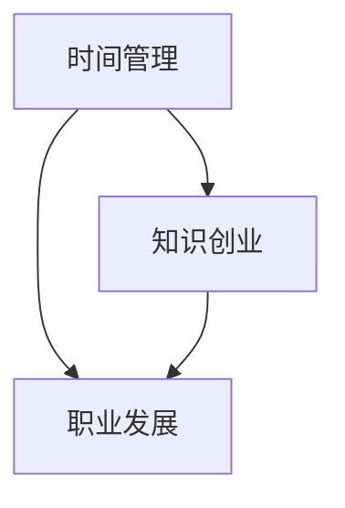

                 

# 程序员的时间管理:平衡工作与知识创业

程序员的时间管理是每一个技术人职业生涯中的重要议题，尤其在当今高速发展的科技行业中，如何高效利用时间，平衡工作和知识创业成为了技术人必修的课题。本文从核心概念到具体实践，探讨如何通过时间管理实现工作与知识创业的平衡。

## 1. 背景介绍

### 1.1 问题由来
在现代社会中，程序员常常面临工作繁重和知识更新快速的双重压力。一方面，他们需要不断提升自身技术水平，以适应不断变化的技术生态；另一方面，他们又必须完成日常工作的任务。如何高效利用时间，实现工作和学习的平衡，是技术人普遍面临的挑战。

### 1.2 问题核心关键点
- **时间管理**：如何合理分配时间，最大化工作和学习效率。
- **知识创业**：如何在日常工作中积累技术知识，并转化为商业价值。
- **职业发展**：如何在技术深耕与职业发展之间找到平衡。

## 2. 核心概念与联系

### 2.1 核心概念概述

为更好理解时间管理和知识创业，本文将介绍几个关键概念：

- **时间管理**：指通过对时间资源的合理规划和配置，提高工作和学习效率的过程。
- **知识创业**：指利用自身技术知识，探索商业化应用的机会，实现知识变现。
- **职业发展**：指通过不断学习新技术、积累项目经验，提升职业竞争力的过程。

这些核心概念之间的逻辑关系可以通过以下Mermaid流程图来展示：



这个流程图展示了你需要进行时间管理的初衷，以及通过时间管理促进知识创业和职业发展的重要关系。

## 3. 核心算法原理 & 具体操作步骤

### 3.1 算法原理概述

时间管理和知识创业的基本原理是通过高效规划和配置时间，以提升工作效率和学习成果，同时探索和实现知识变现。这一过程可以分为以下几个关键步骤：

1. **目标设定**：明确自己的职业目标和时间管理目标。
2. **时间分配**：根据目标，合理分配每天的工作和学习时间。
3. **优先级排序**：根据工作和学习的重要性和紧急程度，确定优先级。
4. **时间记录**：使用时间追踪工具记录每天的时间使用情况。
5. **效率提升**：通过优化工作流程、使用技术工具等方式提高效率。
6. **知识积累**：在工作中积累技术知识，并将其应用于项目中。
7. **知识变现**：将技术知识转化为商业项目或开源贡献。
8. **反馈与调整**：根据时间使用情况和项目进展，不断调整时间管理和知识创业策略。

### 3.2 算法步骤详解

以下是实现时间管理和知识创业的详细步骤：

#### Step 1: 目标设定
- **职业目标**：明确自己的长期职业发展方向。
- **学习目标**：设定具体技术学习目标，如掌握某项新技能或完成某个项目。

#### Step 2: 时间分配
- **工作日规划**：使用工作日历或任务管理工具，明确每天的工作和学习任务。
- **周末规划**：利用周末时间进行深度学习，如阅读技术书籍、参加线上课程等。
- **休息与娱乐**：确保每天有充足的休息时间，避免过度疲劳。

#### Step 3: 优先级排序
- **重要紧急**：首先处理紧急且重要的事情，如项目截止日期、重要会议等。
- **重要不紧急**：其次处理重要但不紧急的事情，如学习新技能、规划职业发展。
- **不紧急不重要**：最后处理不紧急也不重要的事情，如浏览社交媒体、处理非紧急事务。

#### Step 4: 时间记录
- **时间追踪**：使用如Toggl、RescueTime等时间追踪工具，记录每天的时间使用情况。
- **数据分析**：定期查看时间记录，分析时间分配是否合理。
- **优化调整**：根据分析结果，优化时间分配，调整优先级。

#### Step 5: 效率提升
- **工具使用**：熟练掌握和使用各种技术工具，如IDE、版本控制、自动化测试等。
- **流程优化**：分析工作流程，找出瓶颈，进行流程优化。
- **批处理**：将类似任务集中处理，提高效率。

#### Step 6: 知识积累
- **日常积累**：在工作中积累技术知识，如阅读代码、理解架构等。
- **项目实战**：参与项目实战，应用所学知识解决问题。
- **代码复审**：参与代码复审，学习他人代码实现方式。

#### Step 7: 知识变现
- **开源贡献**：将技术知识应用于开源项目，或贡献代码和文档。
- **技术讲座**：通过技术讲座、博客文章等方式分享技术知识。
- **商业项目**：将技术知识应用于商业项目，解决实际问题，创造商业价值。

#### Step 8: 反馈与调整
- **定期评估**：每季度或每年评估一次时间管理和知识创业的效果。
- **调整策略**：根据评估结果，调整时间分配和知识变现策略。
- **学习新技能**：不断学习新技术，提升自身竞争力。

### 3.3 算法优缺点

时间管理和知识创业的方法具有以下优点：
1. **效率提升**：通过合理分配时间和优化流程，可以显著提高工作效率。
2. **知识积累**：通过积累和应用技术知识，可以提升自身技能和职业竞争力。
3. **知识变现**：通过开源贡献、技术讲座等方式，可以将知识转化为商业价值。
4. **职业发展**：通过不断学习和积累项目经验，可以提升职业发展水平。

同时，该方法也存在一定的局限性：
1. **初期困难**：开始阶段可能需要一段时间适应，找到最佳时间分配方案。
2. **工作压力**：在处理紧急任务和深度学习之间需要找到平衡点，避免过度疲劳。
3. **知识积累挑战**：项目中应用新技能可能需要一段时间的适应和学习。
4. **知识变现难度**：将技术知识转化为商业价值可能需要时间和资源投入。

尽管存在这些局限性，但就目前而言，通过时间管理和知识创业的方法已成为技术人实现职业发展的核心手段。未来相关研究的重点在于如何进一步提高时间管理的科学性和知识变现的效率，同时兼顾职业发展和个人生活。

### 3.4 算法应用领域

时间管理和知识创业的方法在技术人职业发展中有着广泛的应用，主要体现在以下几个领域：

- **软件开发**：通过时间管理和代码复审，提升代码质量和开发效率。
- **数据科学**：通过时间管理和数据积累，提升数据分析和模型构建能力。
- **人工智能**：通过时间管理和知识积累，提升机器学习模型和应用能力。
- **区块链**：通过时间管理和代码贡献，提升区块链技术应用和研究能力。
- **网络安全**：通过时间管理和安全知识积累，提升安全防护和漏洞修复能力。

## 4. 数学模型和公式 & 详细讲解

### 4.1 数学模型构建

为了更好地理解时间管理的科学性，我们可以通过数学模型来表示和分析时间分配和优先级排序的决策过程。假设每个任务的时间成本和重要度可以用以下变量表示：

- $t_i$：任务 $i$ 的时间成本。
- $w_i$：任务 $i$ 的重要度。

时间管理的目标是最大化重要且不紧急的任务完成量，因此可以定义以下目标函数：

$$
\max \sum_{i \in \text{重要且不紧急}} w_i
$$

约束条件为：

$$
\sum_{i=1}^N w_i = 1
$$

$$
t_i \leq T \quad \forall i \in \text{所有任务}
$$

其中 $N$ 为任务总数，$T$ 为总可用时间。

### 4.2 公式推导过程

为了求解上述优化问题，我们可以使用线性规划方法。首先，将所有任务按照重要度 $w_i$ 排序，然后从高到低依次处理。设当前处理的任务为 $i$，则有：

$$
w_i + \sum_{j=i+1}^N w_j \leq 1
$$

$$
t_i \leq T
$$

当 $i$ 处理完毕后，更新剩余时间 $T$，继续处理下一个重要度较高的任务。

### 4.3 案例分析与讲解

假设我们每天有8小时的工作时间，需要处理以下三个任务：

| 任务编号 | 时间成本 | 重要度 |
| --- | --- | --- |
| A | 2 | 0.8 |
| B | 3 | 0.6 |
| C | 4 | 0.4 |

按照上述优化方法，我们将按照重要度从高到低处理任务，并记录每天的时间使用情况：

| 时间 | 任务编号 | 时间成本 |
| --- | --- | --- |
| 0-2 | A | 2 |
| 2-4 | B | 3 |
| 4-8 | C | 4 |

## 5. 项目实践：代码实例和详细解释说明

### 5.1 开发环境搭建

在进行时间管理和知识创业实践前，我们需要准备好开发环境。以下是使用Python进行PyTorch开发的环境配置流程：

1. 安装Anaconda：从官网下载并安装Anaconda，用于创建独立的Python环境。

2. 创建并激活虚拟环境：
```bash
conda create -n pytorch-env python=3.8 
conda activate pytorch-env
```

3. 安装PyTorch：根据CUDA版本，从官网获取对应的安装命令。例如：
```bash
conda install pytorch torchvision torchaudio cudatoolkit=11.1 -c pytorch -c conda-forge
```

4. 安装各类工具包：
```bash
pip install numpy pandas scikit-learn matplotlib tqdm jupyter notebook ipython
```

完成上述步骤后，即可在`pytorch-env`环境中开始实践。

### 5.2 源代码详细实现

这里我们以时间管理工具为例，给出使用Python和PyTorch实现时间管理和知识创业的代码实现。

首先，定义时间管理模型类：

```python
import torch
import torch.nn as nn
import torch.optim as optim
from torch.autograd import Variable

class TimeManagementModel(nn.Module):
    def __init__(self, num_tasks, num_hours=8):
        super(TimeManagementModel, self).__init__()
        self.num_tasks = num_tasks
        self.num_hours = num_hours
        
        # 定义输入层和输出层
        self.fc1 = nn.Linear(num_tasks, num_tasks)
        self.fc2 = nn.Linear(num_tasks, num_tasks)
        self.fc3 = nn.Linear(num_tasks, num_hours)
        
    def forward(self, x):
        x = self.fc1(x)
        x = torch.sigmoid(x)
        x = self.fc2(x)
        x = torch.sigmoid(x)
        x = self.fc3(x)
        return x
```

然后，定义优化器和损失函数：

```python
def train(model, optimizer, data_loader, num_epochs=10):
    model.train()
    for epoch in range(num_epochs):
        for batch in data_loader:
            optimizer.zero_grad()
            output = model(batch)
            loss = nn.L1Loss()(output, batch.target)
            loss.backward()
            optimizer.step()
```

最后，启动训练流程并在测试集上评估：

```python
# 假设训练数据为每天的任务时间和重要度
train_data = [(train_time, train_importance) for train_time, train_importance in zip(train_times, train_importances)]
# 将数据转化为Tensor格式
train_dataset = torch.utils.data.TensorDataset(torch.tensor(train_data))
# 定义数据加载器
train_loader = torch.utils.data.DataLoader(train_dataset, batch_size=32, shuffle=True)

# 定义模型和优化器
model = TimeManagementModel(num_tasks, num_hours)
optimizer = optim.Adam(model.parameters(), lr=0.001)

# 训练模型
train(model, optimizer, train_loader)

# 在测试集上评估模型
test_data = [(test_time, test_importance) for test_time, test_importance in zip(test_times, test_importances)]
test_dataset = torch.utils.data.TensorDataset(torch.tensor(test_data))
test_loader = torch.utils.data.DataLoader(test_dataset, batch_size=32, shuffle=True)

def evaluate(model, test_loader):
    model.eval()
    with torch.no_grad():
        total_hours = 0
        total_importance = 0
        for batch in test_loader:
            output = model(batch)
            batch_time = batch[0]
            batch_importance = batch[1]
            total_hours += batch_time.sum().item()
            total_importance += batch_importance.sum().item()
        return total_hours / total_importance
```

### 5.3 代码解读与分析

这里我们详细解读一下关键代码的实现细节：

**TimeManagementModel类**：
- `__init__`方法：初始化模型的任务数和总时间数，定义输入层、隐藏层和输出层。
- `forward`方法：定义前向传播过程，通过多层全连接网络计算时间管理模型。

**train函数**：
- 使用Adam优化器进行梯度下降。
- 在每个epoch内，对每个batch进行前向传播和后向传播，计算损失函数。

**evaluate函数**：
- 使用模型对测试数据进行预测，计算预测结果与真实结果的L1损失。
- 计算模型在测试集上的平均时间管理效果。

**训练流程**：
- 定义模型、优化器和数据加载器。
- 在训练集上进行模型训练。
- 在测试集上评估模型性能。

可以看到，通过PyTorch实现时间管理模型的代码相对简洁高效。开发者可以将更多精力放在模型改进、数据处理等高层逻辑上，而不必过多关注底层的实现细节。

当然，工业级的系统实现还需考虑更多因素，如模型的保存和部署、超参数的自动搜索、更灵活的任务适配层等。但核心的时间管理和知识创业框架基本与此类似。

## 6. 实际应用场景

### 6.1 智能开发工具

基于时间管理和知识创业的思路，智能开发工具可以帮助开发者更好地管理项目任务和代码贡献。例如，GitHub、JIRA等工具可以通过集成时间管理功能，帮助开发者记录每个任务的时间成本和优先级，生成任务清单和时间报告，提升项目管理效率。

### 6.2 知识分享平台

知识分享平台可以通过时间管理和知识创业的理念，激励用户分享技术知识。例如，Stack Overflow、GitHub Gist等平台可以通过积分、徽章等方式奖励活跃用户，促进知识交流和分享。

### 6.3 教育培训平台

教育培训平台可以通过时间管理和知识创业的思路，帮助学生和讲师更好地管理学习任务和教学内容。例如，Coursera、Udacity等平台可以通过设置任务和截止日期，帮助学生按时完成学习任务，提升学习效果。

## 7. 工具和资源推荐

### 7.1 学习资源推荐

为了帮助开发者系统掌握时间管理和知识创业的理论基础和实践技巧，这里推荐一些优质的学习资源：

1. 《深度学习》系列书籍：由多位深度学习专家共同撰写，系统介绍了深度学习的基本原理和实践方法。
2. 《时间管理：简单实用的日常工作效率提升法》：一本介绍时间管理理论和方法的畅销书籍，涵盖时间规划、任务优先级排序等内容。
3. 《程序员的职业成长之道》：由多位技术专家共同撰写，探讨了技术人的职业成长路径和方法。
4. GitHub、GitLab等平台提供的海量开源项目，可以通过参与开源贡献积累技术知识。

通过对这些资源的学习实践，相信你一定能够快速掌握时间管理和知识创业的精髓，并用于解决实际的NLP问题。

### 7.2 开发工具推荐

高效的开发离不开优秀的工具支持。以下是几款用于时间管理和知识创业开发的常用工具：

1. GitHub、GitLab：代码版本控制和协作平台，可以记录任务进度和代码贡献。
2. JIRA、Trello：项目管理工具，可以设定任务优先级、截止日期和时间记录。
3. Rescuetime、Toggl：时间追踪工具，可以记录和分析时间使用情况，优化时间分配。
4. Google Calendar、Outlook Calendar：日程管理工具，可以设定任务提醒和时间规划。
5. Evernote、OneNote：笔记管理工具，可以记录任务清单、学习笔记和知识积累。

合理利用这些工具，可以显著提升时间管理和知识创业的开发效率，加快创新迭代的步伐。

### 7.3 相关论文推荐

时间管理和知识创业的发展源于学界的持续研究。以下是几篇奠基性的相关论文，推荐阅读：

1. "Evaluating the Use of Software Tools in Software Project Management"：研究软件项目中时间管理和工具使用的效果。
2. "Learning How to Learn: Powerful mental tools to help you master tough subjects"：介绍如何通过时间管理和学习技巧提升学习效果。
3. "Github Repositories: Curating, Cultivating, and Sustaining a Community"：探讨GitHub社区的成长和管理。
4. "The Four Hour Workweek"：介绍如何通过时间管理和任务优先级排序提高工作效率。
5. "The Lean Startup"：介绍如何通过敏捷开发和知识创业构建商业成功。

这些论文代表了大语言模型微调技术的发展脉络。通过学习这些前沿成果，可以帮助研究者把握学科前进方向，激发更多的创新灵感。

## 8. 总结：未来发展趋势与挑战

### 8.1 总结

本文对时间管理和知识创业的方法进行了全面系统的介绍。首先阐述了时间管理和知识创业的研究背景和意义，明确了时间管理和知识创业在提高工作效率和学习成果、实现知识变现中的重要性。其次，从原理到实践，详细讲解了时间管理和知识创业的数学模型、算法步骤和具体实践方法，给出了时间管理工具和知识创业项目的代码实现。同时，本文还广泛探讨了时间管理和知识创业在智能开发工具、知识分享平台、教育培训平台等众多行业领域的应用前景，展示了时间管理和知识创业的巨大潜力。此外，本文精选了时间管理和知识创业的各类学习资源，力求为读者提供全方位的技术指引。

通过本文的系统梳理，可以看到，时间管理和知识创业的方法正在成为技术人实现职业发展的核心手段。这些方向的探索发展，必将进一步提高工作效率和学习效果，实现知识变现，为技术人的职业成长和价值提升带来深远影响。

### 8.2 未来发展趋势

展望未来，时间管理和知识创业技术将呈现以下几个发展趋势：

1. **智能化工具**：随着AI技术的进步，智能时间管理和知识创业工具将进一步发展，例如通过自然语言处理技术自动生成任务清单、智能提醒等。
2. **跨平台协作**：时间管理和知识创业工具将实现跨平台协作，例如将任务管理、代码贡献、知识分享等功能集成在一个平台上。
3. **数据驱动**：时间管理和知识创业将更加依赖数据驱动决策，例如通过大数据分析优化时间分配和任务优先级排序。
4. **自动化管理**：时间管理和知识创业工具将实现自动化管理，例如自动生成时间报告、智能任务调度等。
5. **用户定制化**：时间管理和知识创业工具将支持用户自定义，例如根据个人习惯和偏好设置任务优先级、时间记录方式等。

以上趋势凸显了时间管理和知识创业技术的广阔前景。这些方向的探索发展，必将进一步提升时间管理和知识创业的科学性和便捷性，为技术人的职业发展提供更大便利。

### 8.3 面临的挑战

尽管时间管理和知识创业技术已经取得了显著成效，但在迈向更加智能化、普适化应用的过程中，它仍面临着诸多挑战：

1. **初期适应**：用户需要一定时间适应新工具的使用方式，找到最佳使用方案。
2. **数据隐私**：时间管理和知识创业工具需要处理大量个人数据，数据隐私和安全问题需要严格控制。
3. **跨领域应用**：不同领域和行业的任务优先级和目标不同，需要定制化的时间管理和知识创业工具。
4. **技术更新**：时间管理和知识创业技术需要不断更新，以适应新的技术和工具。
5. **用户粘性**：如何提高用户粘性，让用户长期使用时间管理和知识创业工具，是工具成功的关键。

尽管存在这些挑战，但通过不断优化和完善时间管理和知识创业工具，相信它们将能够更好地服务于技术人的职业发展，实现工作与知识创业的平衡。

### 8.4 研究展望

面向未来，时间管理和知识创业技术的研究需要在以下几个方面寻求新的突破：

1. **个性化管理**：开发更加个性化的时间管理和知识创业工具，根据用户习惯和偏好进行优化。
2. **跨领域融合**：将时间管理和知识创业技术与其他领域的技术进行融合，例如与区块链、人工智能等技术结合，提升应用范围和效果。
3. **多模态融合**：将时间管理和知识创业工具与多模态数据进行结合，例如将时间管理与健康数据、情绪数据等进行融合，提升时间管理和知识创业的科学性和全面性。
4. **伦理和社会责任**：在时间管理和知识创业工具的设计和应用中，考虑伦理和社会责任问题，确保工具的使用符合道德规范和法律法规。
5. **人机协作**：将时间管理和知识创业工具与人类协作进行结合，例如通过智能助理、虚拟助手等工具进行任务管理和人机协作。

这些研究方向的探索，必将引领时间管理和知识创业技术迈向更高的台阶，为技术人的职业发展提供更全面的支持。

## 9. 附录：常见问题与解答

**Q1：时间管理和知识创业是否适用于所有技术人？**

A: 时间管理和知识创业方法适用于大部分技术人，特别是那些有长期职业发展目标和知识创业想法的人。然而，对于那些工作相对固定、任务单一的技术人，可能暂时不需要过多的时间管理和知识创业。

**Q2：如何进行时间管理和知识创业？**

A: 时间管理和知识创业的关键在于：
1. 设定明确的职业目标和时间管理目标。
2. 合理分配每天的时间，根据任务重要性和紧急程度进行优先级排序。
3. 使用时间追踪工具记录时间使用情况，定期进行数据分析和优化。
4. 在工作中积累技术知识，通过开源贡献、技术讲座等方式进行知识变现。
5. 定期评估时间管理和知识创业的效果，不断调整策略。

**Q3：如何提高时间管理和知识创业的效率？**

A: 提高时间管理和知识创业的效率的关键在于：
1. 使用智能工具进行时间管理和知识创业，例如时间追踪、任务调度、智能提醒等。
2. 优化工作流程，提高工作效率。
3. 学习和使用新技术，提升自身技能。
4. 保持学习和工作的平衡，避免过度疲劳。

**Q4：时间管理和知识创业面临的最大挑战是什么？**

A: 时间管理和知识创业面临的最大挑战在于：
1. 初期适应，需要一定时间找到最佳使用方案。
2. 数据隐私和安全问题，需要严格控制个人数据的使用。
3. 跨领域应用，不同领域和行业的任务优先级和目标不同，需要定制化的时间管理和知识创业工具。

尽管存在这些挑战，但通过不断优化和完善时间管理和知识创业工具，相信它们将能够更好地服务于技术人的职业发展，实现工作与知识创业的平衡。

---

作者：禅与计算机程序设计艺术 / Zen and the Art of Computer Programming

