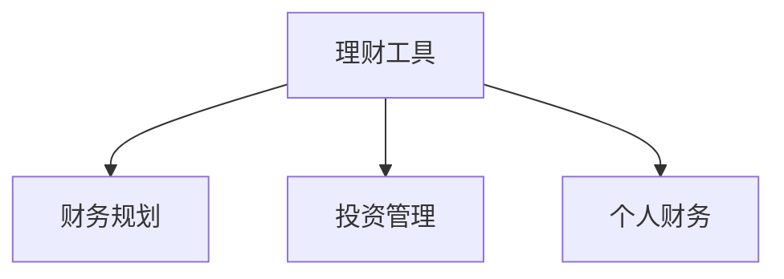

                 

# 程序员的理财工具箱：软件推荐

> 关键词：理财工具, 财务规划, 软件推荐, 投资管理, 个人财务

## 1. 背景介绍

随着现代社会的快速发展，个人理财已经成为越来越多人的重要课题。对于程序员群体而言，除了日常工作之外，如何合理规划和管理个人财务，使自己的收入能够有效增值，是提升生活质量、实现财务自由的重要途径。在这一背景下，各种理财软件应运而生，为程序员提供了便利的财务管理工具。本文将介绍几款优秀的理财软件，帮助程序员轻松管理个人财务，实现财富增值。

## 2. 核心概念与联系

### 2.1 核心概念概述

为更好地理解程序员理财工具箱中的软件推荐，本节将介绍几个密切相关的核心概念：

- **理财工具**：指帮助个人进行财务规划、投资管理、预算控制等财务管理工作的软件或应用。常见的理财工具包括记账软件、预算规划软件、投资管理软件等。
- **财务规划**：指根据个人收入、支出、投资等财务状况，制定长期财务目标并制定相应的财务计划。
- **投资管理**：指通过投资股票、基金、债券等金融工具，实现财富增值。
- **个人财务**：指个人或家庭的收入、支出、资产、负债等财务状况的综合管理。

这些核心概念之间的逻辑关系可以通过以下Mermaid流程图来展示：



这个流程图展示了一个理财工具如何帮助用户进行财务规划、投资管理以及综合管理个人财务的流程。

## 3. 核心算法原理 & 具体操作步骤
### 3.1 算法原理概述

基于理财软件的财务规划和投资管理过程，本质上是一种基于数学模型的优化问题。其核心思想是：根据用户的财务状况（如收入、支出、资产、负债等），制定最优的财务规划方案和投资策略，使得用户的资产在未来某个时间点达到最大化。

形式化地，假设用户的初始资产为 $A_0$，月收入为 $I$，月支出为 $C$，投资回报率为 $r$，则经过 $n$ 个月的规划后，用户的总资产为：

$$
A_n = A_0 + \sum_{i=1}^n (I - C) (1 + r)^i
$$

理财工具的目标是最大化用户总资产 $A_n$，即找到最优的投资策略 $r$ 和资金分配方式。

### 3.2 算法步骤详解

基于理财工具的优化目标，理财软件通常采用以下步骤：

**Step 1: 数据收集与处理**
- 收集用户的初始资产、月收入、月支出等基础财务数据。
- 处理数据，去除异常值，确保数据的准确性和完整性。

**Step 2: 制定财务规划**
- 根据用户的目标（如购房、留学、退休等），制定相应的财务规划。
- 确定每月的资金分配比例，保证必要的生活开支，同时进行必要的储蓄和投资。

**Step 3: 投资管理**
- 选择适合用户风险承受能力的投资组合。
- 根据市场情况，实时调整投资组合，优化收益和风险。

**Step 4: 实时监控与反馈**
- 实时监控用户财务状况，调整预算和投资策略。
- 根据市场变化，及时调整投资组合，确保最优收益。

**Step 5: 风险管理**
- 对可能出现的财务风险进行评估和规避。
- 采用保险、分散投资等手段，降低投资风险。

### 3.3 算法优缺点

基于理财软件的财务规划和投资管理方法具有以下优点：
1. **自动化管理**：理财软件能够自动化处理大量数据，减少人工操作，提高效率。
2. **科学规划**：通过数学模型，制定科学合理的财务规划和投资策略，避免主观判断错误。
3. **实时监控**：实时监控用户财务状况，及时调整策略，确保财务目标的实现。

同时，该方法也存在一定的局限性：
1. **依赖模型准确性**：理财软件的优化效果很大程度上依赖于数学模型的准确性和适用性，模型偏差可能影响投资收益。
2. **市场变化风险**：理财软件的优化策略是基于历史数据的，无法完全适应市场变化，存在风险。
3. **用户依赖性**：用户需依赖理财软件进行财务规划，如果软件故障或数据不准确，可能影响财务决策。

### 3.4 算法应用领域

理财软件广泛应用于个人和家庭财务管理、企业财务管理等领域，以下是几个典型的应用场景：

- **个人理财**：帮助个人规划收入、支出、储蓄、投资等，实现财务自由。
- **家庭财务管理**：帮助家庭统一管理收入、支出、债务等，提升财务透明度。
- **企业财务管理**：帮助企业制定财务计划、优化资产配置、控制成本等，提升企业盈利能力。
- **投资管理**：帮助投资者选择投资标的、管理投资组合，优化收益和风险。

除了上述这些经典应用外，理财软件还被创新性地应用到更多场景中，如财务健康评估、金融风险评估、税务筹划等，为财务管理带来了新的解决方案。

## 4. 数学模型和公式 & 详细讲解 & 举例说明

### 4.1 数学模型构建

理财软件的数学模型通常包括以下几个关键组成部分：

- **现金流模型**：描述用户收入、支出、储蓄、投资等现金流的流向和变化。
- **资产配置模型**：根据用户的风险偏好和投资目标，制定最优的资产配置方案。
- **收益与风险模型**：评估不同投资标的的风险与收益，优化投资组合。

### 4.2 公式推导过程

以现金流模型为例，假设用户的月收入为 $I$，月支出为 $C$，储蓄率为 $S$，投资回报率为 $r$，则每月的现金流变化量为：

$$
\Delta C = I - C - S
$$

经过 $n$ 个月的规划后，用户的总储蓄为：

$$
A_n = A_0 + \sum_{i=1}^n \Delta C (1 + r)^i
$$

其中，$(1 + r)^i$ 表示投资回报在 $i$ 个月后的复利增长。

理财软件的目标是最大化用户总储蓄 $A_n$，即找到最优的储蓄率和投资回报率。这可以通过求解以下最优化问题来实现：

$$
\max_{S,r} A_n = A_0 + \sum_{i=1}^n (I - C - S) (1 + r)^i
$$

根据一阶优化条件，可以解得最优的储蓄率 $S^*$ 和投资回报率 $r^*$：

$$
S^* = \frac{I - C}{(1 + r^*)^n}
$$

$$
r^* = \max_{r} \frac{A_n}{A_0} = \left( \frac{A_n}{A_0} \right)^{\frac{1}{n}} - 1
$$

### 4.3 案例分析与讲解

假设用户小明每月收入为 $I=5000$ 元，月支出为 $C=3000$ 元，储蓄率为 $S=0.2$，投资回报率为 $r=0.1$，规划期限为 $n=5$ 年，即 $n=60$ 个月。则根据上述模型，可以计算得到小明的总储蓄：

$$
A_n = 0 + \sum_{i=1}^{60} (5000 - 3000 - 1000) (1 + 0.1)^i = 600 \times \left( \frac{1.1^{60}}{1.1 - 1} \right) \approx 600 \times 24.52 = 14712
$$

其中，1000 元为小明的储蓄，4000 元为投资。

## 5. 项目实践：代码实例和详细解释说明
### 5.1 开发环境搭建

在进行理财软件实践前，我们需要准备好开发环境。以下是使用Python进行理财软件开发的常见环境配置流程：

1. 安装Python：从官网下载并安装Python，建议选择稳定版本，如Python 3.8。
2. 安装必要的库：使用pip安装Pandas、NumPy、Matplotlib等数据分析和可视化库。
3. 安装理财软件框架：如Personal Finance API，用于与银行、券商等第三方金融服务进行数据交互。

完成上述步骤后，即可在Python环境中进行理财软件的开发。

### 5.2 源代码详细实现

以下是一个使用Python开发的简化理财软件示例，实现基本的财务规划和投资管理功能。

```python
import pandas as pd
import numpy as np
import matplotlib.pyplot as plt

# 数据准备
data = pd.read_csv('finance_data.csv')
data = data.dropna()

# 数据处理
data['income'] = data['income'].astype(float)
data['spend'] = data['spend'].astype(float)
data['savings'] = data['savings'].astype(float)
data['investment'] = data['investment'].astype(float)

# 计算月储蓄和投资回报
data['monthly_savings'] = data['income'] - data['spend'] - data['savings']
data['investment_growth'] = np.cumprod(1 + data['investment'] / 100)

# 财务规划
def financial_planning(income, spend, savings_rate, investment_rate, months):
    monthly_savings = (income - spend - savings_rate * income) * (1 + investment_rate)**months
    total_savings = np.sum(monthly_savings)
    return total_savings

# 投资管理
def investment_management(monthly_savings, investment_rate, months):
    investment_growth = np.cumprod(1 + investment_rate)**months
    total_investment = monthly_savings * np.sum(investment_growth)
    return total_investment

# 测试
income = 5000
spend = 3000
savings_rate = 0.2
investment_rate = 0.1
months = 60

total_savings = financial_planning(income, spend, savings_rate, investment_rate, months)
total_investment = investment_management(total_savings, investment_rate, months)

# 结果展示
plt.plot(data['monthly_savings'], label='Monthly Savings')
plt.plot(data['investment_growth'], label='Investment Growth')
plt.xlabel('Months')
plt.ylabel('Amount')
plt.title('Financial Planning and Investment Management')
plt.legend()
plt.show()

print(f'Total Savings: {total_savings:.2f}')
print(f'Total Investment: {total_investment:.2f}')
```

### 5.3 代码解读与分析

让我们再详细解读一下关键代码的实现细节：

**财务规划函数**：
- `financial_planning`函数计算用户经过一定期限后的总储蓄，公式为：
$$
A_n = A_0 + \sum_{i=1}^n (I - C - S) (1 + r)^i
$$

**投资管理函数**：
- `investment_management`函数计算用户在一定期限后的总投资，公式为：
$$
A_n = \sum_{i=1}^n \Delta C (1 + r)^i
$$

**测试部分**：
- 使用假设数据测试上述两个函数，并绘制月储蓄和投资增长的折线图，展示理财软件的基本功能。

可以看到，理财软件的代码实现相对简洁，但涵盖了财务规划和投资管理的基本流程。

## 6. 实际应用场景
### 6.1 个人理财

基于理财软件的财务规划和投资管理，个人用户可以轻松管理个人财务，实现财富增值。具体应用如下：

- **预算控制**：通过理财软件记录每一笔收入和支出，自动生成预算报告，帮助用户控制开支，实现节流。
- **投资管理**：根据用户风险偏好和投资目标，理财软件推荐合适的投资组合，优化收益和风险。
- **财务健康评估**：定期评估用户的财务健康状况，发现潜在风险，及时调整投资策略。

### 6.2 企业财务管理

对于企业用户，理财软件可以提供更为复杂和全面的财务管理解决方案，具体应用如下：

- **财务预测**：根据企业历史数据和市场情况，理财软件预测企业未来的财务状况，帮助企业制定财务规划。
- **资产优化**：通过优化资产配置，提高企业资金使用效率，降低财务成本。
- **风险管理**：实时监控企业的财务状况，评估风险，采取措施规避风险。

### 6.3 未来应用展望

随着理财软件的不断发展和应用，未来将呈现以下几个发展趋势：

1. **智能投资**：利用机器学习和人工智能技术，优化投资策略，提升投资收益。
2. **多币种管理**：支持多种货币汇率实时更新，提供多币种财务规划和投资管理服务。
3. **区块链技术应用**：利用区块链技术进行资产安全管理和交易，提高交易透明度和安全性。
4. **物联网接入**：通过物联网设备收集用户财务数据，实现更加精准的财务分析和投资建议。
5. **社交金融**：利用社交网络的数据，进行更加个性化的财务规划和投资管理。

这些趋势将进一步提升理财软件的智能化和个性化水平，为个人和企业用户提供更加便捷和高效的服务。

## 7. 工具和资源推荐
### 7.1 学习资源推荐

为了帮助程序员系统掌握理财软件的开发，这里推荐一些优质的学习资源：

1. **《Python for Finance》**：由Yves Hilpisch著，系统介绍了使用Python进行财务分析和投资管理的方法和技巧。
2. **Coursera《Financial Engineering and Risk Management》课程**：由耶鲁大学提供，涵盖金融工程和风险管理的基础知识。
3. **Kaggle金融数据竞赛**：参与金融数据竞赛，通过实际数据项目提升金融数据分析能力。
4. **GitHub理财软件项目**：搜索GitHub上的理财软件开源项目，学习开源代码，了解实战案例。
5. **FinTech博客和论坛**：如FinTech Boy，提供最新金融科技动态和交流平台。

通过对这些资源的学习实践，相信你一定能够快速掌握理财软件的开发方法，并将其应用到实际财务管理中。

### 7.2 开发工具推荐

高效的理财软件开发离不开优秀的工具支持。以下是几款用于理财软件开发的常用工具：

1. **PyCharm**：一款流行的Python IDE，提供丰富的代码编辑和调试功能。
2. **Visual Studio Code**：一款轻量级的代码编辑器，支持Python和多语言开发。
3. **Jupyter Notebook**：一款交互式的编程环境，适合进行数据可视化和分析。
4. **Git**：版本控制系统，用于团队协作和代码版本控制。
5. **Docker**：容器化工具，便于应用程序打包和部署。

合理利用这些工具，可以显著提升理财软件开发的效率，加快创新迭代的步伐。

### 7.3 相关论文推荐

理财软件的开发和应用源于学界的持续研究。以下是几篇奠基性的相关论文，推荐阅读：

1. **《Investment Returns of Universal and Portfolio Equities》**：由Markowitz著，介绍了现代投资组合理论的基础，经典之作。
2. **《Algorithmic Trading: Technologies, Strategies, and Systems》**：由Andersen、Almgren、Chakravarty著，涵盖算法交易的多种策略和系统。
3. **《A Practical Guide to Risk Management》**：由Marshall、Yoerg著，系统介绍了风险管理的各种技术和方法。
4. **《Machine Learning and Financial Modeling》**：由Isidro、Vallisneri著，利用机器学习技术进行金融建模的实用指南。
5. **《High-Frequency Trading: A Practical Guide to Algorithmic Strategies and Trading Systems》**：由Foucault、Gome、Romero著，介绍高频交易的策略和系统。

这些论文代表了大数据和人工智能在金融领域的应用方向，对于理财软件的开发和应用具有重要的参考价值。

## 8. 总结：未来发展趋势与挑战
### 8.1 研究成果总结

本文对基于理财软件的财务规划和投资管理方法进行了全面系统的介绍。首先阐述了理财软件的研究背景和意义，明确了理财软件在个人和企业财务管理中的重要价值。其次，从原理到实践，详细讲解了理财软件的基本算法和操作步骤，给出了理财软件开发的完整代码实例。同时，本文还探讨了理财软件在实际应用中的具体场景，展示了理财软件带来的便利和效果。

### 8.2 未来发展趋势

展望未来，理财软件的研发将呈现以下几个发展趋势：

1. **智能化提升**：利用机器学习和人工智能技术，提升理财软件的智能分析和决策能力。
2. **个性化定制**：根据用户的具体需求和风险偏好，提供定制化的财务规划和投资管理服务。
3. **跨平台支持**：支持多设备、多平台接入，提高用户的便利性和体验。
4. **数据驱动决策**：引入大数据分析技术，提供更加精准的财务预测和投资建议。
5. **区块链应用**：利用区块链技术进行资产管理和交易，提升安全性和透明度。
6. **社交金融整合**：利用社交网络数据，进行更加个性化的财务管理和投资建议。

这些趋势将进一步提升理财软件的智能化和个性化水平，为用户提供更加便捷和高效的服务。

### 8.3 面临的挑战

尽管理财软件已经取得了一定的成果，但在迈向更加智能化、个性化应用的过程中，它仍面临着诸多挑战：

1. **数据隐私保护**：理财软件需要收集和处理大量用户财务数据，如何保护用户隐私和数据安全是一个重要问题。
2. **算法透明性**：理财软件的决策过程和模型参数往往是黑盒，用户难以理解和信任。
3. **市场环境变化**：理财软件的投资策略基于历史数据，无法完全适应市场变化，存在风险。
4. **系统稳定性和可靠性**：理财软件需要处理大量数据和复杂计算，如何保证系统的稳定性和可靠性是一个挑战。
5. **用户教育和普及**：理财软件需要普及教育，帮助用户理解和应用，提高用户接受度。

### 8.4 研究展望

面对理财软件所面临的挑战，未来的研究需要在以下几个方面寻求新的突破：

1. **数据隐私保护技术**：研究如何通过加密和匿名化等技术，保护用户财务数据隐私。
2. **算法透明性和可解释性**：开发更加透明和可解释的算法模型，提高用户信任度。
3. **自适应投资策略**：研究如何根据市场环境实时调整投资策略，降低风险。
4. **分布式系统架构**：研究如何构建分布式系统架构，提升理财软件的处理能力和稳定性。
5. **用户教育和普及**：通过在线课程、科普文章等方式，普及理财软件知识，提高用户使用率。

这些研究方向将引领理财软件的研发进入新的阶段，为用户提供更加智能、个性化和可靠的服务。

## 9. 附录：常见问题与解答

**Q1：理财软件是否适用于所有用户？**

A: 理财软件适用于大部分用户，但需要根据个人财务状况和需求进行适当调整。例如，对于财务状况复杂的用户，可能需要提供更多自定义选项。

**Q2：理财软件如何处理多币种问题？**

A: 理财软件通常支持多币种管理和兑换，用户可以根据需要选择相应货币进行财务规划和投资。

**Q3：理财软件如何保护用户隐私？**

A: 理财软件需要遵循隐私保护法律法规，如GDPR等，采用加密、匿名化等技术保护用户隐私。

**Q4：理财软件的投资策略是否可靠？**

A: 理财软件的投资策略是基于历史数据的，无法完全适应市场变化。用户需要结合自身风险偏好和市场环境，进行综合判断和决策。

**Q5：理财软件是否适用于企业用户？**

A: 理财软件不仅适用于个人用户，也适用于企业用户。企业用户可以根据具体需求，进行财务预测、资产优化、风险管理等操作。

---

作者：禅与计算机程序设计艺术 / Zen and the Art of Computer Programming

