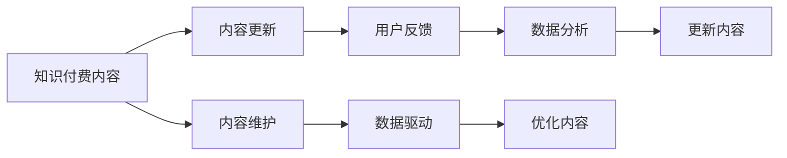

                 

# 程序员的知识付费内容更新与维护策略

在当今互联网时代，知识付费成为越来越多人的选择。程序员作为技术驱动的核心力量，其知识内容的更新与维护变得尤为重要。本文旨在探讨如何制定有效的知识付费内容更新与维护策略，帮助程序员在不断变化的技术环境中保持竞争力，并实现自我增值。

## 1. 背景介绍

### 1.1 知识付费的兴起
随着互联网技术的快速发展，知识付费平台的兴起为人们提供了便捷的学习渠道。通过付费订阅、课程购买等方式，用户可以获得高品质的学习内容，满足自身技术提升的需求。程序员作为技术领域的重要角色，其知识和技能更新迭代的速度非常快，持续更新知识内容成为其职业发展的关键。

### 1.2 程序员知识付费内容的现状
目前，程序员的知识付费内容主要集中在编程语言、框架技术、算法与数据结构、软件开发流程等方面。这些内容往往由经验丰富的开发者撰写，具有较高的参考价值。然而，由于技术更新迭代迅速，内容需要不断更新，以保持其时效性和实用性。

## 2. 核心概念与联系

### 2.1 核心概念概述
- **知识付费内容**：以在线课程、博客文章、视频教程等形式，提供给用户有价值的知识内容，以获取报酬。
- **内容更新**：根据技术发展，对原有知识内容进行修订、添加和删除，确保其保持最新的状态。
- **内容维护**：持续监控知识内容的使用情况，收集用户反馈，优化内容质量，确保其具有高度的实用性和准确性。
- **用户反馈**：用户在使用知识内容后，提供的使用体验和建议，用于指导内容更新和维护。
- **数据驱动**：利用数据分析工具，对知识内容的使用情况、用户行为进行分析，指导内容更新和优化。

### 2.2 核心概念原理和架构的 Mermaid 流程图



这个流程图展示了知识付费内容更新与维护的基本流程。首先，内容创作者提供高质量的初始内容。然后，通过用户反馈和数据驱动，不断更新和维护内容，以适应技术变化和用户需求。

## 3. 核心算法原理 & 具体操作步骤

### 3.1 算法原理概述
知识付费内容更新与维护的核心在于持续优化，确保内容的及时性和实用性。其算法原理主要基于以下三点：
1. **需求分析**：通过用户反馈和数据分析，识别内容更新和优化的需求。
2. **版本控制**：采用版本控制工具，如Git，管理内容的更新历史，确保内容的可追溯性。
3. **自动化发布**：使用CI/CD工具，自动化发布更新内容，提升发布效率和稳定性。

### 3.2 算法步骤详解

#### 3.2.1 需求分析
- **用户反馈收集**：通过在线问卷、评论区、社交媒体等渠道，收集用户对知识内容的反馈。
- **数据分析**：利用Google Analytics、Mixpanel等工具，分析内容的使用情况、用户行为等数据。
- **需求整理**：根据用户反馈和数据分析结果，整理内容更新的需求，形成需求文档。

#### 3.2.2 版本控制
- **版本管理**：使用Git等版本控制工具，管理知识内容的更新历史，确保每次更新都有记录。
- **分支管理**：建立不同的分支，如main、feature、bugfix等，分别用于主版本更新、新增功能、修复bug等。
- **代码审查**：实施代码审查流程，确保内容的更新质量。

#### 3.2.3 自动化发布
- **持续集成**：使用Jenkins、Travis CI等工具，自动化构建和测试更新内容。
- **持续部署**：采用CI/CD流程，自动化部署更新内容到服务器，确保发布的及时性和稳定性。

### 3.3 算法优缺点

#### 3.3.1 优点
- **高效更新**：通过自动化流程，快速响应用户反馈和数据分析结果，及时更新内容。
- **质量保证**：版本控制和代码审查流程，确保每次更新都是高质量的。
- **稳定性高**：自动化发布流程，提升发布的效率和稳定性。

#### 3.3.2 缺点
- **依赖工具**：依赖版本控制、自动化发布等工具，初期搭建成本较高。
- **人员投入**：需要专门的人员进行版本管理和自动化流程维护。
- **更新频率**：频繁的更新可能会导致用户对内容的信任度降低。

### 3.4 算法应用领域

知识付费内容更新与维护策略可以应用于各种技术博客、在线课程、技术社区等知识付费平台。无论是在线教程还是线下培训，这些策略都能够帮助内容创作者保持内容的活力，提升用户的学习体验。

## 4. 数学模型和公式 & 详细讲解 & 举例说明

### 4.1 数学模型构建
设知识付费内容更新与维护的周期为 $T$，用户反馈的频率为 $F$，数据分析的周期为 $A$，版本控制的历史记录为 $H$，自动化发布的效率为 $E$。模型如下：

$$
U(T, F, A, H, E) = \max(0, 1 - \frac{F}{T} - \frac{A}{T})
$$

其中 $U$ 为内容更新的质量，$T$ 为更新周期，$F$ 为用户反馈的频率，$A$ 为数据分析的周期，$H$ 为版本控制的历史记录，$E$ 为自动化发布的效率。

### 4.2 公式推导过程
1. **用户反馈频率**：$F$ 越高，内容更新的需求越明确，更新质量 $U$ 越高。
2. **数据分析周期**：$A$ 越短，内容更新的方向越准确，更新质量 $U$ 越高。
3. **版本控制历史记录**：$H$ 越长，内容更新的可追溯性越强，更新质量 $U$ 越高。
4. **自动化发布效率**：$E$ 越高，内容发布的及时性越好，更新质量 $U$ 越高。

### 4.3 案例分析与讲解
以一个在线编程教程为例：
- **需求分析**：通过在线问卷收集用户对编程语言的反馈，分析其使用情况，形成更新需求。
- **版本控制**：使用Git进行版本管理，建立不同分支，实施代码审查流程。
- **自动化发布**：使用Jenkins进行持续集成和持续部署，确保教程的及时更新。

通过这一流程，内容创作者能够快速响应用户需求，提供高质量的更新内容，保持教程的最新性和实用性。

## 5. 项目实践：代码实例和详细解释说明

### 5.1 开发环境搭建

首先，需要搭建Python开发环境。以下是在Linux系统下使用Anaconda安装Python和相关库的步骤：

```bash
# 安装Anaconda
wget https://repo.anaconda.com/miniconda/Miniconda3-latest-Linux-x86_64.sh
bash Miniconda3-latest-Linux-x86_64.sh
source ~/.bashrc

# 创建Python虚拟环境
conda create --name python-env python=3.8
conda activate python-env

# 安装相关库
pip install jupyterlab ipywidgets
```

### 5.2 源代码详细实现

以Jupyter Notebook为例，展示如何进行知识付费内容的更新与维护：

1. **需求分析**：
   - 收集用户反馈：
     ```python
     import pandas as pd
     feedback_df = pd.read_csv('user_feedback.csv')
     feedback_df.head()
     ```

   - 数据分析：
     ```python
     import matplotlib.pyplot as plt
     feedback_df['content'].value_counts().plot(kind='bar')
     plt.title('User Feedback Analysis')
     plt.xlabel('Content')
     plt.ylabel('Count')
     plt.show()
     ```

2. **版本控制**：
   - 使用Git进行版本管理：
     ```bash
     git clone https://github.com/user/content.git
     git checkout -b feature/1.0
     echo 'Updated content' >> content.md
     git add content.md
     git commit -m 'Add updated content'
     git push origin feature/1.0
     ```

3. **自动化发布**：
   - 使用Jenkins进行持续集成和部署：
     ```yaml
     # Jenkinsfile
     pipeline {
       agent any
       stages {
         stage('Build') {
           steps {
             sh 'python3 build.py'
           }
         }
         stage('Deploy') {
           steps {
             sh 'python3 deploy.py'
           }
         }
       }
     }
     ```

### 5.3 代码解读与分析

- **用户反馈收集**：使用Pandas库读取用户反馈数据，利用Matplotlib库进行可视化分析，识别内容更新的需求。
- **版本控制**：通过Git进行版本管理，利用Git的Branch、Commit、Push等命令，确保每次更新的记录和可追溯性。
- **自动化发布**：使用Jenkins进行持续集成和持续部署，确保教程的及时更新和稳定性。

### 5.4 运行结果展示

```bash
# 运行代码
jupyter lab
```

打开Jupyter Lab后，查看代码执行结果，分析用户反馈，进行版本管理，部署更新内容。

## 6. 实际应用场景

### 6.1 技术博客

技术博客是程序员知识共享的重要平台。通过定期的内容更新，博客可以保持其时效性和相关性，吸引更多的访问者。

### 6.2 在线课程

在线课程需要定期更新，以适应新的技术和市场需求。内容创作者可以利用知识付费内容更新与维护策略，保持课程的最新性和实用性。

### 6.3 技术社区

技术社区是程序员交流经验、分享知识的重要场所。通过及时的内容更新，社区可以保持活跃度，增强用户粘性。

## 7. 工具和资源推荐

### 7.1 学习资源推荐

- **在线课程**：Udacity的《软件开发者知识付费内容管理》课程，深入讲解知识付费内容更新与维护的各个环节。
- **书籍**：《内容运营之道：打造高转化率内容》，详细介绍了内容运营的各个方面，包括知识付费内容的管理和维护。
- **工具**：GitHub、Jenkins、JupyterLab等工具，为知识付费内容的更新与维护提供强有力的支持。

### 7.2 开发工具推荐

- **版本控制工具**：Git，用于管理内容更新历史和版本。
- **持续集成工具**：Jenkins，用于自动化构建和部署更新内容。
- **可视化分析工具**：Matplotlib，用于分析和展示用户反馈和数据分析结果。

### 7.3 相关论文推荐

- **知识付费内容的评价与优化**：《Knowledge Paying Attention: A Survey on Content Mining and Personalization in Paywall Social Media》，探讨了知识付费内容评价和优化的最新研究进展。
- **用户反馈驱动的内容更新**：《User Feedback Mining for Content Update: A Survey》，介绍了利用用户反馈进行内容更新的方法和工具。
- **版本控制与内容管理**：《Software Version Control and Content Management》，介绍了Git等版本控制工具在内容管理中的应用。

## 8. 总结：未来发展趋势与挑战

### 8.1 研究成果总结

本文详细探讨了知识付费内容更新与维护的策略，包括需求分析、版本控制、自动化发布等关键环节。通过系统化的策略，内容创作者可以保持知识内容的时效性和实用性，提升用户的学习体验。

### 8.2 未来发展趋势

- **AI驱动的内容更新**：利用AI技术进行用户反馈分析和内容生成，提升内容更新的效率和质量。
- **社交化内容管理**：通过社交媒体和社区平台，实时获取用户反馈，进行内容更新。
- **多渠道内容分发**：利用博客、视频、播客等多渠道分发内容，提升内容的覆盖面和用户粘性。

### 8.3 面临的挑战

- **技术变革迅速**：技术更新迭代快，知识内容需要不断更新，以保持其时效性。
- **用户需求多样**：用户需求各异，难以统一标准，进行有效的内容管理。
- **资源投入大**：内容更新和维护需要大量的时间和人力资源投入。

### 8.4 研究展望

- **内容自动生成**：利用自然语言处理技术，自动生成高质量的内容。
- **社区化内容管理**：建立社区平台，让用户参与内容管理和更新，提升用户粘性和满意度。
- **多模态内容展示**：结合文本、图片、视频等多模态内容展示，提升用户的学习体验。

## 9. 附录：常见问题与解答

**Q1: 如何进行知识付费内容的版本管理？**

A: 使用Git进行版本管理，建立不同的分支，实施代码审查流程。每次更新内容时，进行git add、commit、push等操作，确保更新历史的可追溯性。

**Q2: 如何利用用户反馈进行内容更新？**

A: 通过在线问卷、评论区、社交媒体等渠道，收集用户对知识内容的反馈。分析反馈数据，识别内容更新的需求，进行版本控制和自动化发布。

**Q3: 如何提升内容自动化的发布效率？**

A: 使用Jenkins等持续集成工具，自动构建和测试更新内容。配置自动化发布流程，确保内容的及时更新和稳定性。

**Q4: 如何进行内容的多渠道分发？**

A: 通过博客、视频、播客等多渠道分发内容，利用社交媒体平台进行推广，提升内容的覆盖面和用户粘性。

**Q5: 如何利用AI技术进行内容更新？**

A: 利用自然语言处理技术，自动生成高质量的内容。通过分析用户反馈和数据分析，利用AI技术生成内容更新建议，提升内容更新的效率和质量。

作者：禅与计算机程序设计艺术 / Zen and the Art of Computer Programming

