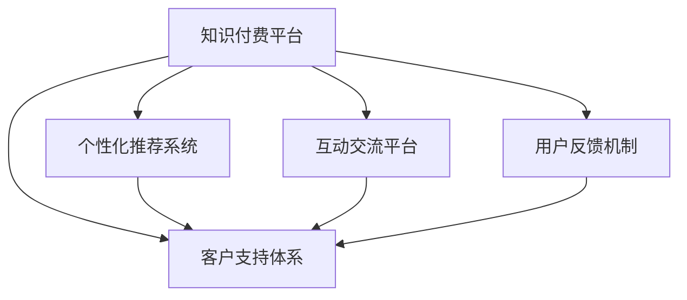

                 

# 程序员的知识付费客户支持体系构建

## 1. 背景介绍

### 1.1 问题由来
随着技术的发展和应用场景的不断扩展，程序员的知识付费市场正迎来高速增长。这不仅因为技术领域的不断更新迭代需要持续学习和技能提升，也是因为对技术深度和广度的需求日益增加。然而，程序员的个性化学习需求和海量知识内容之间存在着明显的鸿沟。如何构建高效、专业的知识付费客户支持体系，成为技术公司提升用户体验和竞争力的关键所在。

### 1.2 问题核心关键点
构建程序员的知识付费客户支持体系，关键在于设计一套系统化、专业化的解决方案，以确保用户能够便捷、高效地获取和利用知识资源。该体系的核心内容包括：
- **服务响应速度**：快速响应用户需求，提供即时服务。
- **内容质量保证**：提供高质量、多样化的知识资源，满足不同用户的需求。
- **个性化推荐**：根据用户的学习行为和偏好，推荐相关课程和资料。
- **互动交流机制**：建立专家与用户之间的互动机制，促进知识的共享和传播。
- **用户反馈机制**：收集用户反馈，持续优化服务质量。

### 1.3 问题研究意义
构建高效的知识付费客户支持体系，对于提升用户体验和公司竞争力具有重要意义：
- **提升用户满意度**：通过快速响应和个性化推荐，提升用户的学习体验和满意度。
- **增强用户粘性**：通过持续的互动和优化，增强用户对平台的依赖性，提升用户粘性。
- **促进知识传播**：通过建立专家与用户的交流机制，促进知识的共享和传播。
- **推动技术发展**：通过用户反馈和需求分析，推动技术产品的不断优化和创新。

## 2. 核心概念与联系

### 2.1 核心概念概述
为更好地理解程序员的知识付费客户支持体系构建，本节将介绍几个关键概念：

- **知识付费平台**：指通过在线付费形式提供高质量技术知识的学习平台。
- **客户支持体系**：指为满足用户需求而提供的一系列服务和机制，包括客服响应、内容推荐、专家互动等。
- **个性化推荐系统**：根据用户的历史行为和偏好，推荐相关课程和资料的系统。
- **互动交流平台**：提供一个专家和用户互动的平台，促进知识的共享和传播。
- **用户反馈机制**：通过问卷、评价等方式收集用户反馈，持续优化服务的系统。

这些核心概念之间的逻辑关系可以通过以下Mermaid流程图来展示：



这个流程图展示了知识付费平台与客户支持体系的联系，以及各核心概念之间的关系：

1. 知识付费平台是基础，提供高质量的技术知识。
2. 客户支持体系通过个性化推荐、专家互动、用户反馈等机制，提升用户体验。
3. 个性化推荐系统根据用户行为推荐内容。
4. 互动交流平台促进专家和用户之间的互动。
5. 用户反馈机制收集用户反馈，优化服务质量。

## 3. 核心算法原理 & 具体操作步骤
### 3.1 算法原理概述

构建程序员的知识付费客户支持体系，本质上是一个通过数据驱动优化服务过程的算法问题。其核心思想是：通过收集和分析用户行为数据，构建推荐模型和响应机制，以提升用户满意度和平台竞争力。

形式化地，假设用户的历史行为数据为 $D=\{(x_i,y_i)\}_{i=1}^N$，其中 $x_i$ 为用户行为特征，$y_i$ 为标签（如购买课程、浏览视频等）。知识付费平台的客户支持体系的目标是找到最优的推荐算法和响应机制 $\theta$，使得：

$$
\theta=\mathop{\arg\min}_{\theta} \mathcal{L}(D)
$$

其中 $\mathcal{L}$ 为损失函数，衡量推荐的准确性和用户满意度。常见的损失函数包括交叉熵损失、均方误差损失等。

通过梯度下降等优化算法，客户支持体系不断更新推荐算法和响应机制 $\theta$，最小化损失函数 $\mathcal{L}$，使得推荐的课程和资料满足用户需求，快速响应用户问题。

### 3.2 算法步骤详解

构建程序员的知识付费客户支持体系，一般包括以下几个关键步骤：

**Step 1: 数据收集与预处理**
- 收集用户行为数据，包括但不限于：访问页面、浏览时长、购买记录等。
- 对数据进行清洗、归一化、特征工程等预处理，确保数据的质量和一致性。

**Step 2: 推荐算法设计**
- 选择合适的推荐算法，如协同过滤、内容推荐、混合推荐等。
- 设计推荐系统架构，包括特征提取、相似度计算、排序等模块。
- 确定推荐模型，如基于矩阵分解、神经网络等模型。

**Step 3: 响应机制设计**
- 定义客户支持渠道，如在线客服、邮件、电话等。
- 设计响应流程，包括响应时间、问题分类、优先级等。
- 实现自动化响应机制，如智能问答系统、自动回复等。

**Step 4: 系统集成与优化**
- 将推荐算法和响应机制集成到知识付费平台中。
- 进行A/B测试，评估推荐效果和用户满意度。
- 根据测试结果，优化推荐算法和响应机制。

**Step 5: 监控与反馈**
- 实时监控推荐和响应系统的运行情况。
- 收集用户反馈，进行定量和定性分析。
- 根据反馈结果，持续优化推荐算法和响应机制。

以上是构建程序员的知识付费客户支持体系的一般流程。在实际应用中，还需要针对具体平台的特点，对推荐算法和响应机制进行优化设计，以进一步提升用户体验和满意度。

### 3.3 算法优缺点

构建程序员的知识付费客户支持体系，具有以下优点：
1. **提升用户体验**：通过个性化推荐和快速响应，提升用户的学习体验和满意度。
2. **增加用户粘性**：通过专家互动和个性化推荐，增强用户对平台的依赖性。
3. **推动知识传播**：建立专家与用户的交流机制，促进知识的共享和传播。
4. **优化资源利用**：通过用户反馈和需求分析，优化资源配置和服务质量。

同时，该方法也存在一定的局限性：
1. **数据依赖性高**：推荐和响应的效果很大程度上取决于用户行为数据的丰富性和质量。
2. **算法复杂度高**：推荐算法和响应机制的设计和优化需要较强的技术和资源投入。
3. **用户隐私风险**：大量用户行为数据的收集和使用可能带来隐私风险。

尽管存在这些局限性，但就目前而言，基于数据驱动的客户支持体系构建方法仍是最主流的选择。未来相关研究的重点在于如何进一步降低数据依赖，提高推荐算法的精准度和响应机制的自动化程度，同时兼顾用户隐私保护。

### 3.4 算法应用领域

基于数据驱动的知识付费客户支持体系构建方法，已在多个领域得到应用，例如：

- **在线教育**：通过个性化推荐和智能问答，提升学习效果和用户满意度。
- **软件开发**：提供课程推荐和问题解答，加速技术学习和开发进程。
- **IT支持服务**：建立专家与用户的互动机制，解决技术难题和提升服务质量。
- **技术社区**：提供内容推荐和互动交流，促进知识传播和社区活跃度。

除了上述这些经典领域外，基于知识付费客户支持体系的构建方法也在更多场景中得到应用，如企业培训、产品技术支持、IT运维等，为技术教育和知识传播带来了新的解决方案。随着数据驱动技术的发展和应用，相信知识付费客户支持体系将在更多领域发挥重要作用。

## 4. 数学模型和公式 & 详细讲解
### 4.1 数学模型构建

本节将使用数学语言对基于数据驱动的知识付费客户支持体系构建过程进行更加严格的刻画。

记用户行为数据为 $D=\{(x_i,y_i)\}_{i=1}^N$，其中 $x_i$ 为用户行为特征，$y_i$ 为标签。假设推荐算法为 $f(x)$，响应时间为 $t(x)$。知识付费平台的客户支持体系的目标是找到最优的推荐算法和响应机制 $\theta$，使得：

$$
\theta=\mathop{\arg\min}_{\theta} \mathcal{L}(f(x),y; t(x))
$$

其中 $\mathcal{L}$ 为损失函数，衡量推荐和响应效果。常见的损失函数包括交叉熵损失、均方误差损失等。

### 4.2 公式推导过程

以下我们以推荐系统为例，推导协同过滤算法的推荐公式及其梯度的计算公式。

假设推荐系统中有 $M$ 个物品和 $N$ 个用户，用户行为数据表示为矩阵 $R$，其中 $R_{i,j}$ 表示用户 $i$ 对物品 $j$ 的评分。协同过滤算法的目标是根据用户的历史评分数据，预测用户对其他物品的评分，即寻找最优的评分矩阵 $\hat{R}$。具体过程如下：

1. **矩阵分解**：将用户评分矩阵 $R$ 分解为两个低秩矩阵 $U$ 和 $V$，即 $R = UV^T$。

2. **预测评分**：根据分解后的矩阵 $U$ 和 $V$，预测用户对物品的评分 $\hat{R}_{i,j} = U_i \times V_j^T$。

3. **损失函数**：采用均方误差损失函数，衡量预测评分与真实评分的差异。

4. **梯度计算**：使用梯度下降算法更新矩阵 $U$ 和 $V$ 的参数。

5. **优化目标**：最小化损失函数，即：

$$
\min_{U,V} \frac{1}{N}\sum_{i=1}^N\sum_{j=1}^M (R_{i,j} - \hat{R}_{i,j})^2
$$

通过矩阵分解和梯度下降等算法，协同过滤算法能够准确预测用户对新物品的评分，实现个性化推荐。

## 5. 项目实践：代码实例和详细解释说明
### 5.1 开发环境搭建

在进行客户支持体系开发前，我们需要准备好开发环境。以下是使用Python进行PyTorch开发的环境配置流程：

1. 安装Anaconda：从官网下载并安装Anaconda，用于创建独立的Python环境。

2. 创建并激活虚拟环境：
```bash
conda create -n pytorch-env python=3.8 
conda activate pytorch-env
```

3. 安装PyTorch：根据CUDA版本，从官网获取对应的安装命令。例如：
```bash
conda install pytorch torchvision torchaudio cudatoolkit=11.1 -c pytorch -c conda-forge
```

4. 安装TensorFlow：
```bash
pip install tensorflow
```

5. 安装Keras：
```bash
pip install keras
```

6. 安装Flask：
```bash
pip install flask
```

完成上述步骤后，即可在`pytorch-env`环境中开始客户支持体系开发。

### 5.2 源代码详细实现

这里我们以在线教育平台为例，给出使用TensorFlow和Keras实现推荐系统的PyTorch代码实现。

首先，定义数据集和模型：

```python
from tensorflow.keras.layers import Input, Dense, Embedding, Dot, Flatten
from tensorflow.keras.models import Model
from tensorflow.keras.optimizers import Adam
import tensorflow as tf

# 定义数据集
def generate_data():
    # 生成随机用户行为数据
    pass

# 定义模型
def create_model():
    # 定义输入层
    user_input = Input(shape=(1,), name='user')
    item_input = Input(shape=(1,), name='item')
    
    # 定义嵌入层
    user_embedding = Embedding(10000, 10)(user_input)
    item_embedding = Embedding(10000, 10)(item_input)
    
    # 定义相似度计算层
    dot_product = Dot(axes=2)([user_embedding, item_embedding])
    
    # 定义输出层
    output = Dense(1, activation='sigmoid')(dot_product)
    
    # 定义模型
    model = Model(inputs=[user_input, item_input], outputs=output)
    
    # 定义损失函数和优化器
    model.compile(loss='binary_crossentropy', optimizer=Adam(lr=0.01))
    
    return model
```

然后，训练推荐模型：

```python
# 训练模型
model = create_model()
data = generate_data()
model.fit(data, epochs=10)
```

接着，实现推荐系统：

```python
# 实现推荐系统
def recommend(model, user_id, item_ids):
    # 预测用户对物品的评分
    scores = model.predict([[user_id], [item_ids]])
    # 对评分进行排序，推荐评分最高的物品
    top_items = item_ids[scores.argmax()]
    
    return top_items
```

最后，部署推荐系统到知识付费平台：

```python
from flask import Flask, request

app = Flask(__name__)

@app.route('/recommend', methods=['POST'])
def recommend_route():
    user_id = request.json['user_id']
    item_ids = request.json['item_ids']
    top_items = recommend(model, user_id, item_ids)
    return str(top_items)

if __name__ == '__main__':
    app.run()
```

以上就是使用PyTorch和TensorFlow实现推荐系统的完整代码实现。可以看到，利用深度学习框架，推荐系统的实现变得简单高效。开发者可以将更多精力放在数据处理和模型优化上，而不必过多关注底层的实现细节。

### 5.3 代码解读与分析

让我们再详细解读一下关键代码的实现细节：

**generate_data函数**：
- 生成随机用户行为数据，作为训练集。

**create_model函数**：
- 定义输入层，包括用户ID和物品ID。
- 定义嵌入层，将用户ID和物品ID映射为低维向量。
- 定义相似度计算层，计算用户和物品的相似度。
- 定义输出层，输出用户对物品的评分。
- 定义模型，将输入层、嵌入层、相似度计算层和输出层连接起来。
- 定义损失函数和优化器，编译模型。

**recommend函数**：
- 根据用户ID和物品ID，预测用户对物品的评分。
- 对评分进行排序，推荐评分最高的物品。

**recommend_route函数**：
- 从请求中获取用户ID和物品ID。
- 调用recommend函数进行推荐。
- 返回推荐结果。

**主函数**：
- 启动Flask服务器，监听/recommend路径的请求。

可以看到，通过这些函数和代码，我们构建了一个简单的推荐系统，并能够快速响应用户的推荐请求。当然，在工业级的系统实现中，还需要考虑更多因素，如用户隐私保护、数据存储、安全防护等。

## 6. 实际应用场景
### 6.1 在线教育

基于数据驱动的知识付费客户支持体系，在线教育平台可以显著提升学习效果和用户满意度。通过个性化推荐和智能问答，学生可以更快地找到适合自己的课程和学习资源，提升学习效率和效果。

在技术实现上，可以收集学生的学习行为数据，如观看视频时长、浏览笔记、参与讨论等，作为推荐模型的输入。微调推荐模型，使其能够根据学生的学习行为和偏好，推荐最相关的课程和资源。同时，建立智能问答系统，提供即时解答学生问题，加速学习进程。

### 6.2 软件开发

软件开发平台同样可以应用数据驱动的客户支持体系，帮助开发者加速技术学习和开发进程。通过个性化推荐和专家互动，开发者可以快速获取所需的技术文档、代码示例和最佳实践，解决技术难题，提升开发效率。

在技术实现上，可以收集开发者的学习行为数据，如查看文档、下载代码、参与讨论等，作为推荐模型的输入。推荐模型可以根据开发者的需求，推荐相关课程、文档和代码示例。同时，建立专家社区，提供专家互动和实时解答，加速技术学习和开发。

### 6.3 技术支持服务

技术支持服务领域同样可以应用数据驱动的客户支持体系，提升服务质量和用户满意度。通过个性化推荐和专家互动，用户可以更快地找到解决方案，解决技术难题。

在技术实现上，可以收集用户的技术支持和反馈数据，作为推荐模型的输入。推荐模型可以根据用户的需求和问题，推荐相关文档、示例和解决方案。同时，建立专家互动平台，提供专家实时解答和帮助，提升服务质量和用户满意度。

### 6.4 未来应用展望

随着数据驱动技术的发展和应用，基于客户支持体系构建方法将在更多领域得到应用，为技术教育和知识传播带来新的解决方案。

在智慧教育领域，基于客户支持体系的知识付费平台，可以提供个性化推荐和智能问答，提升学习效果和用户体验。

在软件开发领域，基于客户支持体系的平台，可以提供技术文档推荐、代码示例和专家互动，加速技术学习和开发进程。

在技术支持服务领域，基于客户支持体系的社区，可以提供个性化推荐和专家互动，提升服务质量和用户满意度。

此外，在企业培训、IT运维、IT咨询等众多领域，基于数据驱动的客户支持体系，也将发挥重要作用。随着技术的不断进步，相信数据驱动的客户支持体系将在更多领域得到应用，为技术教育和知识传播带来新的机遇。

## 7. 工具和资源推荐
### 7.1 学习资源推荐

为了帮助开发者系统掌握数据驱动的客户支持体系构建的理论基础和实践技巧，这里推荐一些优质的学习资源：

1. **《深度学习》书籍**：由斯坦福大学Andrew Ng教授撰写，全面介绍了深度学习的基本概念和算法，适合初学者和进阶学习者。

2. **《机器学习实战》书籍**：由Peter Harrington撰写，通过实际案例讲解机器学习的理论和实现方法，适合动手实践。

3. **Coursera《深度学习专项课程》**：由DeepLearning.ai开设的深度学习系列课程，涵盖深度学习的理论和实践，适合系统学习。

4. **Kaggle竞赛**：参加Kaggle数据科学竞赛，实践数据驱动的推荐和响应算法，提升实战能力。

5. **TensorFlow官方文档**：TensorFlow的官方文档，提供了详细的API文档和实战教程，适合快速上手TensorFlow。

6. **PyTorch官方文档**：PyTorch的官方文档，提供了丰富的模型库和实战教程，适合快速上手PyTorch。

通过对这些资源的学习实践，相信你一定能够快速掌握数据驱动的客户支持体系的构建方法，并用于解决实际的客户支持问题。

### 7.2 开发工具推荐

高效的开发离不开优秀的工具支持。以下是几款用于数据驱动客户支持体系构建的常用工具：

1. **TensorFlow**：由Google主导开发的深度学习框架，生产部署方便，适合大规模工程应用。

2. **PyTorch**：基于Python的开源深度学习框架，灵活动态的计算图，适合快速迭代研究。

3. **Keras**：由François Chollet开发的深度学习框架，简单易用，适合快速上手。

4. **Flask**：轻量级的Web框架，用于快速搭建推荐系统和响应系统。

5. **TensorBoard**：TensorFlow配套的可视化工具，实时监测模型训练状态，提供丰富的图表呈现方式。

6. **Weights & Biases**：模型训练的实验跟踪工具，记录和可视化模型训练过程中的各项指标，方便对比和调优。

合理利用这些工具，可以显著提升数据驱动客户支持体系的开发效率，加快创新迭代的步伐。

### 7.3 相关论文推荐

数据驱动的客户支持体系构建方法源于学界的持续研究。以下是几篇奠基性的相关论文，推荐阅读：

1. **《协同过滤推荐算法》**：提出了协同过滤推荐算法的基本原理和实现方法，奠定了推荐系统的基础。

2. **《深度学习中的推荐系统》**：介绍了深度学习在推荐系统中的应用，展示了推荐算法的最新进展。

3. **《基于用户行为数据的推荐系统》**：通过分析用户行为数据，设计推荐模型，提升推荐效果。

4. **《知识图谱在推荐系统中的应用》**：结合知识图谱和推荐算法，提升推荐系统的精度和效率。

这些论文代表了大数据驱动客户支持体系构建方法的发展脉络。通过学习这些前沿成果，可以帮助研究者把握学科前进方向，激发更多的创新灵感。

## 8. 总结：未来发展趋势与挑战

### 8.1 总结

本文对基于数据驱动的程序员知识付费客户支持体系构建方法进行了全面系统的介绍。首先阐述了知识付费客户支持体系的研究背景和意义，明确了构建高效、专业的客户支持体系的关键要素。其次，从原理到实践，详细讲解了推荐算法和响应机制的设计和优化过程，给出了系统开发的完整代码实例。同时，本文还广泛探讨了知识付费客户支持体系在多个领域的应用前景，展示了数据驱动技术的应用潜力。此外，本文精选了构建体系的各类学习资源，力求为开发者提供全方位的技术指引。

通过本文的系统梳理，可以看到，基于数据驱动的知识付费客户支持体系构建方法，正在成为程序员知识付费平台的重要技术范式，极大地提升用户体验和平台竞争力。未来，伴随数据驱动技术的发展和应用，基于客户支持体系的构建方法将在更多领域得到应用，为技术教育和知识传播带来新的机遇。

### 8.2 未来发展趋势

展望未来，基于数据驱动的客户支持体系构建方法将呈现以下几个发展趋势：

1. **推荐算法优化**：随着推荐系统应用场景的不断扩展，未来的推荐算法将更加复杂和多样化。深度学习、强化学习等方法将得到更广泛的应用。

2. **响应机制自动化**：通过智能问答、自动回复等技术，响应机制将更加高效和智能化。AI客服、智能助理等技术将得到更广泛的应用。

3. **多模态融合**：结合文本、图像、语音等多模态数据，提升推荐和响应的效果和用户体验。

4. **实时数据处理**：通过流式计算和大数据技术，实现实时数据处理和实时响应，提升服务质量和用户满意度。

5. **个性化推荐和响应的精准度**：通过深度学习、增强学习等方法，提升推荐和响应的精准度，满足用户的个性化需求。

6. **用户隐私保护**：通过数据加密、隐私保护技术，保障用户数据的安全性和隐私性。

以上趋势凸显了数据驱动客户支持体系构建技术的广阔前景。这些方向的探索发展，必将进一步提升推荐和响应的效果和用户体验，为技术教育和知识传播带来新的机遇。

### 8.3 面临的挑战

尽管数据驱动的客户支持体系构建方法已经取得了瞩目成就，但在迈向更加智能化、普适化应用的过程中，它仍面临诸多挑战：

1. **数据依赖性高**：推荐和响应的效果很大程度上取决于用户行为数据的丰富性和质量。如何获取高质量、大规模的用户行为数据，是未来的一大挑战。

2. **算法复杂度高**：推荐算法和响应机制的设计和优化需要较强的技术和资源投入。如何简化算法，降低资源消耗，是未来需要解决的问题。

3. **用户隐私风险**：大量用户行为数据的收集和使用可能带来隐私风险。如何保障用户隐私，是未来需要解决的重要问题。

4. **实时数据处理**：实时数据处理的性能瓶颈如何突破，是未来需要解决的重要问题。

5. **个性化推荐和响应的精准度**：如何提升推荐和响应的精准度，满足用户的个性化需求，是未来需要解决的重要问题。

6. **用户隐私保护**：如何保障用户数据的安全性和隐私性，是未来需要解决的重要问题。

正视这些挑战，积极应对并寻求突破，将是大数据驱动客户支持体系构建技术迈向成熟的必由之路。相信随着学界和产业界的共同努力，这些挑战终将一一被克服，数据驱动的客户支持体系必将在构建人机协同的智能时代中扮演越来越重要的角色。

### 8.4 研究展望

面对数据驱动客户支持体系构建所面临的种种挑战，未来的研究需要在以下几个方面寻求新的突破：

1. **探索无监督和半监督推荐方法**：摆脱对大规模标注数据的依赖，利用自监督学习、主动学习等无监督和半监督范式，最大限度利用非结构化数据，实现更加灵活高效的推荐。

2. **研究参数高效和计算高效的推荐范式**：开发更加参数高效的推荐方法，在固定大部分推荐参数的同时，只更新极少量的任务相关参数。同时优化推荐算法的计算图，减少前向传播和反向传播的资源消耗，实现更加轻量级、实时性的部署。

3. **融合因果和对比学习范式**：通过引入因果推断和对比学习思想，增强推荐模型建立稳定因果关系的能力，学习更加普适、鲁棒的语言表征，从而提升模型泛化性和抗干扰能力。

4. **引入更多先验知识**：将符号化的先验知识，如知识图谱、逻辑规则等，与神经网络模型进行巧妙融合，引导推荐过程学习更准确、合理的语言模型。同时加强不同模态数据的整合，实现视觉、语音等多模态信息与文本信息的协同建模。

5. **结合因果分析和博弈论工具**：将因果分析方法引入推荐模型，识别出推荐决策的关键特征，增强推荐输出解释的因果性和逻辑性。借助博弈论工具刻画用户和推荐系统之间的互动过程，主动探索并规避推荐模型的脆弱点，提高系统稳定性。

6. **纳入伦理道德约束**：在推荐算法和响应机制的目标中引入伦理导向的评估指标，过滤和惩罚有害的推荐内容，确保推荐系统符合人类价值观和伦理道德。

这些研究方向的探索，必将引领数据驱动客户支持体系构建技术迈向更高的台阶，为构建安全、可靠、可解释、可控的智能系统铺平道路。面向未来，数据驱动客户支持体系构建技术还需要与其他人工智能技术进行更深入的融合，如知识表示、因果推理、强化学习等，多路径协同发力，共同推动推荐系统的发展。

## 9. 附录：常见问题与解答

**Q1：数据驱动的客户支持体系构建需要哪些数据？**

A: 构建数据驱动的客户支持体系，需要以下几类数据：
- **用户行为数据**：包括用户访问页面、观看视频、下载资料、参与讨论等行为数据。
- **用户反馈数据**：包括用户评价、问答、问题反馈等数据。
- **内容标签数据**：包括课程、视频、文档等内容的标签数据。

这些数据可以用于训练推荐模型和优化响应机制，提升推荐效果和用户满意度。

**Q2：数据驱动的客户支持体系构建的算法有哪些？**

A: 数据驱动的客户支持体系构建涉及的算法包括：
- **协同过滤算法**：通过用户行为数据，推荐用户可能感兴趣的内容。
- **基于内容的推荐算法**：通过内容标签数据，推荐相关内容。
- **混合推荐算法**：结合协同过滤和基于内容的推荐算法，提升推荐效果。
- **深度学习推荐算法**：利用深度学习模型，提升推荐效果和精度。

这些算法可以用于构建个性化的推荐系统，满足用户的个性化需求。

**Q3：数据驱动的客户支持体系构建的响应机制有哪些？**

A: 数据驱动的客户支持体系构建涉及的响应机制包括：
- **智能问答系统**：通过NLP技术，实时解答用户问题。
- **自动回复系统**：根据用户问题，自动生成回复。
- **在线客服系统**：通过人工客服，实时解答用户问题。
- **邮件和电话支持**：通过邮件和电话，提供多渠道的响应服务。

这些响应机制可以用于提升用户满意度，增强用户对平台的依赖性。

**Q4：数据驱动的客户支持体系构建的模型评估方法有哪些？**

A: 数据驱动的客户支持体系构建涉及的模型评估方法包括：
- **均方误差（MSE）**：用于评估推荐模型的预测误差。
- **准确率（Accuracy）**：用于评估响应系统的正确率。
- **召回率（Recall）**：用于评估推荐模型的覆盖率。
- **F1分数（F1 Score）**：用于评估推荐模型的综合效果。

这些评估方法可以用于监控和优化推荐和响应系统的性能。

**Q5：数据驱动的客户支持体系构建的优化方法有哪些？**

A: 数据驱动的客户支持体系构建涉及的优化方法包括：
- **在线学习**：通过实时数据更新模型参数，提升推荐和响应效果。
- **超参数调优**：通过调参优化模型性能，提升推荐和响应效果。
- **特征工程**：通过特征选择和构造，提升推荐和响应效果。
- **模型融合**：通过模型融合，提升推荐和响应效果。

这些优化方法可以用于提升数据驱动客户支持体系的效果和性能。

**Q6：数据驱动的客户支持体系构建的隐私保护方法有哪些？**

A: 数据驱动的客户支持体系构建涉及的隐私保护方法包括：
- **数据匿名化**：通过数据匿名化技术，保护用户隐私。
- **差分隐私**：通过差分隐私技术，保护用户隐私。
- **数据加密**：通过数据加密技术，保护用户隐私。

这些隐私保护方法可以用于保障用户数据的安全性和隐私性。

通过这些问题的解答，相信你对数据驱动的程序员知识付费客户支持体系构建有了更全面的了解。随着技术的不断进步，基于数据驱动的客户支持体系构建方法将在更多领域得到应用，为技术教育和知识传播带来新的机遇。面向未来，数据驱动客户支持体系构建技术还需要与其他人工智能技术进行更深入的融合，共同推动推荐系统的发展。总之，数据驱动的客户支持体系构建需要全面考虑数据、算法、系统、隐私等多个方面，方能构建高效、安全、可靠的系统。

