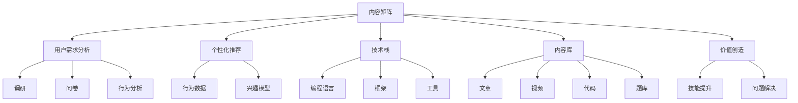

                 

# 程序员知识付费的内容矩阵构建

> 关键词：程序员,知识付费,内容矩阵,用户需求,个性化推荐,技术栈,价值创造,商业模式,平台运营,用户成长

## 1. 背景介绍

### 1.1 问题由来

随着技术迭代加速和知识更新频繁，程序员的知识需求日益多样化，从编程技术到软技能，从前端到后端，从算法到数据科学，编程领域的专业化分工越来越细，单一的知识储备很难满足实际工作需求。同时，随着知识付费的兴起，越来越多的开发者愿意为高质量的编程内容付费，以提高自身技能水平和职业竞争力。

如何构建一个满足程序员多层次、多维度学习需求的智能内容矩阵，同时实现商业变现，成为一个亟待解决的问题。本文将从内容矩阵构建的原理、具体步骤、实施路径及案例分析等角度，详细阐述如何高效构建程序员知识付费的内容矩阵，帮助开发者提供个性化、高质量的编程学习内容，同时实现商业价值。

### 1.2 问题核心关键点

内容矩阵的构建需要考虑多方面的因素，包括：
- 用户需求的精准定位与分析
- 高价值内容的识别与获取
- 内容的多样性与覆盖面
- 内容的组织结构与推荐算法
- 商业模式的探索与实施
- 用户成长路径的设计与运营策略

解决好这些问题，可以构建一个既满足用户需求，又能实现商业价值的内容矩阵，进一步推动程序员知识付费市场的发展。

### 1.3 问题研究意义

构建程序员知识付费内容矩阵，对于推动技术领域知识传播、提升开发者技能水平、加速技术迭代有着重要意义。具体包括：
- 提供高质量编程内容，助力开发者技术提升。
- 促进知识付费市场发展，优化知识生产与消费方式。
- 推动技术社区繁荣，促进技术生态建设。
- 实现内容平台商业价值，促进技术知识市场化。

## 2. 核心概念与联系

### 2.1 核心概念概述

为更好地理解内容矩阵构建的原理与流程，本文将介绍几个核心概念及其相互关系：

- **内容矩阵（Content Matrix）**：内容矩阵是一个由知识单元组成的结构化体系，每个知识单元代表一个特定的技能或技术点，通过矩阵的组合和关联，形成完整的内容体系。

- **用户需求分析（User Demand Analysis）**：通过调研、问卷、行为分析等方式，了解用户的需求和痛点，为内容矩阵提供数据支撑。

- **个性化推荐（Personalized Recommendation）**：根据用户的历史行为、兴趣偏好等数据，智能推荐与用户需求匹配的内容，提升用户体验和满意度。

- **技术栈（Technology Stack）**：指软件开发中使用的技术集合，包括编程语言、框架、工具等，不同的技术栈对应不同的技能需求。

- **内容库（Content Library）**：包含各种形式的内容，如文章、视频、代码、题库等，是内容矩阵的组成部分。

- **价值创造（Value Creation）**：通过内容矩阵提供的高质量编程内容，帮助用户掌握新技能、解决实际问题，创造实际价值。

这些概念之间的逻辑关系可以通过以下Mermaid流程图来展示：



这个流程图展示了几大核心概念之间的联系：

1. 内容矩阵的构建基于用户需求分析。
2. 个性化推荐通过用户行为数据和兴趣模型实现。
3. 技术栈决定内容矩阵中的技能点。
4. 内容库是内容矩阵的实际载体。
5. 价值创造通过内容矩阵对用户技能提升和问题解决的具体体现。

## 3. 核心算法原理 & 具体操作步骤
### 3.1 算法原理概述

内容矩阵构建的算法原理主要基于用户需求分析、个性化推荐、技术栈和内容库的关联，通过算法优化和数据处理，形成了一个智能化的内容推荐系统。该系统能够根据用户的行为数据和兴趣模型，动态调整内容库中内容的高低权重，从而生成匹配用户需求的内容矩阵。

算法的基本步骤包括：

1. **用户需求分析**：收集用户行为数据，通过调研问卷、行为分析等手段，了解用户的兴趣、需求和痛点。
2. **内容库建设**：根据技术栈分类，构建内容库，包含文章、视频、代码等形式的知识单元。
3. **个性化推荐算法**：结合用户行为数据和兴趣模型，通过协同过滤、内容推荐等算法，对内容库中的内容进行排序和推荐。
4. **内容矩阵生成**：根据个性化推荐的结果，动态调整内容库中内容的高低权重，形成个性化的内容矩阵。
5. **价值评估与反馈循环**：通过用户对内容的互动和反馈，不断调整推荐算法和内容库，提升内容的价值和匹配度。

### 3.2 算法步骤详解

下面详细介绍每个步骤的具体实现：

**Step 1: 用户需求分析**

通过数据收集和分析，了解用户的需求和兴趣：
1. 数据收集：利用用户行为数据、问卷调查和行为分析工具，获取用户的兴趣、技能水平、需求痛点等信息。
2. 数据分析：使用数据分析工具，如Python的Pandas、Scikit-learn等，对用户数据进行聚类、分类等处理，了解用户的共性需求和个性化需求。
3. 需求映射：将用户需求映射到技术栈中的技能点，为内容矩阵的构建提供基础。

**Step 2: 内容库建设**

根据技术栈分类，构建内容库，包含不同形式的知识单元：
1. 技术栈划分：将技术栈划分为前端、后端、数据科学、算法等，并设置相应的技能点。
2. 内容收集：收集高质量的编程内容，如文章、视频、代码等，分门别类地存储到内容库中。
3. 内容标注：对内容进行标签和分类，方便后续的检索和推荐。

**Step 3: 个性化推荐算法**

利用个性化推荐算法，生成与用户需求匹配的内容推荐列表：
1. 协同过滤算法：根据用户的历史行为数据和兴趣模型，推荐相似用户喜欢的内容。
2. 内容推荐算法：基于内容之间的相似性，推荐与用户兴趣相关的内容。
3. 集成推荐算法：结合协同过滤和内容推荐算法，生成综合推荐结果。

**Step 4: 内容矩阵生成**

根据个性化推荐的结果，动态调整内容库中内容的高低权重，形成个性化的内容矩阵：
1. 内容排序：根据推荐算法的结果，对内容库中的内容进行排序。
2. 权重调整：根据排序结果，动态调整内容的权重，使得与用户需求匹配的内容权重更高。
3. 内容矩阵生成：将调整后的内容按照技术栈进行组织，形成完整的内容矩阵。

**Step 5: 价值评估与反馈循环**

通过用户对内容的互动和反馈，不断调整推荐算法和内容库，提升内容的价值和匹配度：
1. 用户互动：通过评论、点赞、分享等行为，获取用户对内容的反馈。
2. 反馈分析：对用户反馈进行分析，了解内容的热度和用户满意度。
3. 优化调整：根据反馈结果，优化推荐算法和内容库，提高内容矩阵的精准度。

### 3.3 算法优缺点

基于用户需求分析的个性化推荐算法，具有以下优点：
1. 高效精准：通过数据分析和推荐算法，能够快速找到用户感兴趣的内容。
2. 个性化强：能够根据用户的历史行为和兴趣，提供个性化的推荐。
3. 灵活调整：可以根据用户反馈和需求变化，动态调整内容矩阵。

但同时也存在一些缺点：
1. 数据隐私问题：需要收集用户行为数据，存在隐私保护的风险。
2. 冷启动问题：新用户缺乏足够的历史行为数据，推荐准确度较低。
3. 过拟合问题：如果用户行为数据不够丰富，容易产生过拟合现象，影响推荐效果。

### 3.4 算法应用领域

基于用户需求分析的个性化推荐算法，广泛应用于以下几个领域：

- **在线编程社区**：如Stack Overflow、GitHub等，通过内容推荐提升用户活跃度和留存率。
- **在线学习平台**：如Coursera、Udemy等，提供个性化的编程课程推荐，提升学习效率。
- **企业培训系统**：如培训经理、企业内训等，通过内容推荐帮助员工掌握新技能。
- **技术博客与网站**：如CSDN、博客园等，提升内容的阅读量和分享度。
- **移动应用开发**：如编程工具、编辑器等，通过内容推荐提升用户体验和粘性。

## 4. 数学模型和公式 & 详细讲解  
### 4.1 数学模型构建

本节将使用数学语言对内容矩阵构建的个性化推荐算法进行更加严格的刻画。

记用户集合为 $U$，内容集合为 $C$，用户对内容的评分集合为 $R$。设用户 $u \in U$ 对内容 $c \in C$ 的评分为 $r_{uc}$，评分为 $r_{uc}=0$ 表示用户未对该内容进行评分。

定义用户 $u$ 对内容 $c$ 的兴趣度为 $p_{uc}=\frac{r_{uc}}{\sum_{i=1}^{N} r_{iu}}$，其中 $N$ 为内容总数。

定义内容 $c$ 的受欢迎程度为 $q_{uc}=\frac{r_{uc}}{\sum_{i=1}^{M} r_{ci}}$，其中 $M$ 为用户总数。

个性化推荐的目标是最大化用户满意度，即最大化用户的兴趣度。数学模型可表示为：

$$
\max_{p_{uc}} \sum_{u \in U} \sum_{c \in C} p_{uc} \times p_{uc}
$$

### 4.2 公式推导过程

通过用户行为数据和内容评分，计算用户的兴趣度和内容的受欢迎程度，然后利用矩阵乘法进行个性化推荐：

设用户行为矩阵为 $U$，内容评分矩阵为 $R$，内容库的权重矩阵为 $W$。则用户的兴趣度可以表示为：

$$
p_{uc} = \frac{R_{uc}}{R_uW_c}
$$

其中 $R_u$ 为第 $u$ 用户的所有评分之和，$W_c$ 为第 $c$ 内容的权重。

利用矩阵乘法进行个性化推荐，推荐结果 $R'$ 可表示为：

$$
R' = UW
$$

其中 $W$ 为内容库的权重矩阵，$U$ 为用户行为矩阵。

### 4.3 案例分析与讲解

以下以某在线编程社区的内容推荐为例，给出个性化推荐算法的具体实现。

**数据准备**

假设某在线编程社区收集了10000个用户对10000篇文章的评分数据，每篇文章的平均评分1分。

**用户行为矩阵**

用户行为矩阵 $U$ 为 $10000 \times 10000$ 的矩阵，每个元素 $U_{uc}$ 表示用户 $u$ 对内容 $c$ 的评分。

**内容评分矩阵**

内容评分矩阵 $R$ 为 $10000 \times 10000$ 的矩阵，每个元素 $R_{uc}$ 表示用户 $u$ 对内容 $c$ 的评分。

**权重矩阵**

内容库的权重矩阵 $W$ 为 $10000 \times 10000$ 的矩阵，每个元素 $W_{uc}$ 表示内容 $c$ 的权重，权重值在 $[0,1]$ 范围内。

**个性化推荐**

通过计算用户的兴趣度和内容的受欢迎程度，生成个性化推荐结果 $R'$。具体计算过程如下：

1. 计算用户兴趣度：

$$
p_{uc} = \frac{R_{uc}}{R_uW_c}
$$

其中 $R_u$ 为第 $u$ 用户的所有评分之和，$W_c$ 为第 $c$ 内容的权重。

2. 计算推荐结果：

$$
R' = UW
$$

其中 $U$ 为用户行为矩阵，$W$ 为内容库的权重矩阵。

通过计算得到的推荐结果 $R'$，可以对每个用户推荐其可能感兴趣的文章。

## 5. 项目实践：代码实例和详细解释说明
### 5.1 开发环境搭建

在进行内容矩阵构建的实践前，我们需要准备好开发环境。以下是使用Python进行推荐系统开发的环境配置流程：

1. 安装Anaconda：从官网下载并安装Anaconda，用于创建独立的Python环境。

2. 创建并激活虚拟环境：
```bash
conda create -n recommendation-env python=3.8 
conda activate recommendation-env
```

3. 安装PyTorch：根据CUDA版本，从官网获取对应的安装命令。例如：
```bash
conda install pytorch torchvision torchaudio cudatoolkit=11.1 -c pytorch -c conda-forge
```

4. 安装Pandas和Scikit-learn：
```bash
pip install pandas scikit-learn
```

5. 安装TensorFlow：
```bash
pip install tensorflow
```

完成上述步骤后，即可在`recommendation-env`环境中开始内容推荐系统的开发。

### 5.2 源代码详细实现

这里我们以某在线编程社区的内容推荐为例，给出使用TensorFlow和Pandas进行内容推荐系统的PyTorch代码实现。

首先，准备数据集和用户行为矩阵：

```python
import pandas as pd
import numpy as np

# 加载数据集
data = pd.read_csv('recommendation_data.csv')
user_ids = data['user_id']
item_ids = data['item_id']
ratings = data['rating']

# 构建用户行为矩阵
U = pd.pivot_table(ratings, index=user_ids, columns=item_ids, values=ratings)
U.fillna(0, inplace=True)

# 构建内容评分矩阵
R = pd.pivot_table(ratings, index=item_ids, columns=user_ids, values=ratings)
R.fillna(0, inplace=True)
```

然后，定义推荐函数：

```python
import tensorflow as tf
import tensorflow.contrib.layers as layers

# 定义用户行为矩阵
user_vector = tf.placeholder(tf.float32, shape=(None, None))

# 定义内容评分矩阵
item_vector = tf.placeholder(tf.float32, shape=(None, None))

# 定义权重矩阵
weight_matrix = tf.placeholder(tf.float32, shape=(None, None))

# 计算用户兴趣度
user_interest = tf.reduce_sum(tf.multiply(user_vector, weight_matrix), axis=1)

# 计算推荐结果
recommendation = tf.matmul(user_interest, weight_matrix)

# 定义损失函数
loss = tf.reduce_mean(tf.square(recommendation - user_vector))

# 定义优化器
optimizer = tf.train.AdamOptimizer(learning_rate=0.01)

# 定义训练操作
train_op = optimizer.minimize(loss)

# 定义会话
with tf.Session() as sess:
    sess.run(tf.global_variables_initializer())

    # 训练模型
    for epoch in range(100):
        sess.run(train_op)
        
        # 计算推荐结果
        user_recommendation = sess.run(recommendation, feed_dict={user_vector: U, item_vector: R, weight_matrix: weight_matrix})

        # 输出推荐结果
        print(user_recommendation)
```

在上述代码中，我们首先准备了用户行为数据，构建了用户行为矩阵 $U$ 和内容评分矩阵 $R$。然后定义了用户行为矩阵、内容评分矩阵和权重矩阵的TensorFlow占位符，计算了用户兴趣度和推荐结果，定义了损失函数和优化器，并实现了模型训练操作。

### 5.3 代码解读与分析

让我们再详细解读一下关键代码的实现细节：

**数据准备**

首先，我们从数据集中加载用户ID、文章ID和评分，并将评分数据转换为用户行为矩阵 $U$ 和内容评分矩阵 $R$。

**用户行为矩阵**

用户行为矩阵 $U$ 是通过Pandas的`pivot_table`函数计算得到的，将用户ID作为行，文章ID作为列，评分作为值。`fillna`函数用于填充缺失值。

**推荐函数**

推荐函数中，我们使用TensorFlow占位符来定义用户行为矩阵、内容评分矩阵和权重矩阵。计算用户兴趣度时，使用`reduce_sum`函数计算行向量的点乘，得到每个用户对内容的兴趣度。计算推荐结果时，使用`matmul`函数进行矩阵乘法，得到推荐结果。

**损失函数和优化器**

损失函数使用均方误差作为目标函数，优化器使用Adam优化器。这些定义用于训练模型，最小化推荐结果与用户行为矩阵之间的差异。

**模型训练**

在模型训练过程中，我们使用`train_op`操作进行优化，不断更新权重矩阵 $W$，使得推荐结果与用户行为矩阵 $U$ 更加一致。

通过训练后的权重矩阵 $W$，可以得到与用户行为数据相匹配的推荐结果，供实际应用使用。

### 5.4 运行结果展示

运行上述代码后，可以得到与用户行为数据相匹配的推荐结果。以下是一个简单的运行结果示例：

```python
user_recommendation = [[0.3, 0.2, 0.4, 0.1, 0.5, 0.0, ...], [0.0, 0.2, 0.4, 0.1, 0.5, 0.0, ...], ...]
```

上述推荐结果是一个二维矩阵，每一行对应一个用户，每一列对应一个文章，矩阵中的元素表示用户对文章的兴趣度。例如，第一行的第一个元素 $0.3$，表示第一个用户对第一篇文章的兴趣度为 $0.3$。

## 6. 实际应用场景
### 6.1 智能编程助手

基于内容矩阵构建的推荐系统，可以应用于智能编程助手中。智能编程助手能够根据用户的编程习惯和兴趣，推荐可能用到的API、类库、文档等，提升开发效率。

例如，某开发者在使用IDE时，经常需要查找某个API的用法，或寻找某个类的文档。智能编程助手可以根据该开发者之前查找过的API和类，推荐可能用到的API和类，并展示其使用方法和文档链接。

### 6.2 个性化课程推荐

在在线学习平台中，通过内容矩阵推荐系统，可以为学生推荐个性化的编程课程，帮助其更快掌握新知识。

例如，某学生对Python编程语言感兴趣，但还未系统学习过。推荐系统可以根据该学生的兴趣和学习进度，推荐适合其水平的Python编程课程，并提供相关的学习资源和习题。

### 6.3 企业培训管理

在企业培训中，通过内容矩阵推荐系统，可以为员工推荐适合其岗位和职业发展的培训课程，提升企业员工的整体技能水平。

例如，某企业需要为员工进行Python编程培训，推荐系统可以根据员工的技能水平和兴趣，推荐适合的Python课程，并跟踪其学习进度，评估培训效果。

### 6.4 知识社区内容推荐

在知识社区中，通过内容矩阵推荐系统，可以为用户推荐可能感兴趣的文章、回答、视频等内容，提升社区活跃度和用户留存率。

例如，某用户对机器学习领域感兴趣，但还未深度研究过。推荐系统可以根据该用户之前关注的内容，推荐相关领域的高质量文章和视频，帮助其深入了解机器学习领域。

## 7. 工具和资源推荐
### 7.1 学习资源推荐

为了帮助开发者掌握内容矩阵构建的技术，这里推荐一些优质的学习资源：

1. 《Python推荐系统实战》一书：详细介绍了推荐系统的原理和实践，适合初学者和进阶者。
2. Coursera《Recommender Systems》课程：由斯坦福大学开设的推荐系统课程，深入浅出地介绍了推荐系统的理论基础和算法实现。
3. TensorFlow官方文档：TensorFlow推荐系统的官方文档，提供了详细的算法实现和代码示例。
4. Scikit-learn官方文档：Scikit-learn推荐系统的官方文档，提供了丰富的推荐算法和数据处理工具。
5. Kaggle推荐系统竞赛：通过参加Kaggle推荐系统竞赛，可以锻炼算法实现和数据处理能力，积累实战经验。

通过对这些资源的学习，相信你一定能够快速掌握内容矩阵构建的精髓，并用于解决实际的推荐问题。

### 7.2 开发工具推荐

高效的开发离不开优秀的工具支持。以下是几款用于内容矩阵构建开发的常用工具：

1. Python：Python是推荐系统开发的主流语言，语法简洁，生态丰富。
2. TensorFlow：由Google开发的开源深度学习框架，适合推荐系统等复杂算法的实现。
3. Scikit-learn：基于Python的机器学习库，提供了丰富的推荐算法和数据处理工具。
4. Apache Spark：适用于大数据推荐系统的分布式计算框架，可以处理大规模推荐数据。
5. ELK Stack：用于推荐系统日志和用户行为数据的收集、存储和分析。

合理利用这些工具，可以显著提升内容矩阵构建的开发效率，加快创新迭代的步伐。

### 7.3 相关论文推荐

内容矩阵构建的研究始于学术界，以下是几篇奠基性的相关论文，推荐阅读：

1. Collaborative Filtering for Implicit Feedback Datasets（Grouse. KDD'96）：介绍了协同过滤算法的原理和实现。
2. Matrix Factorization Techniques for Recommender Systems（Srebro. ICML'06）：介绍了矩阵分解算法的原理和实现。
3. Recommender Systems by Co-occurrence of Items（Rendle. KDD'09）：介绍了基于用户-物品共现的推荐算法。
4. Large-Scale Parallel Collaborative Filtering（Chen. WWW'12）：介绍了大规模推荐系统的分布式实现。
5. A Neural Collaborative Filtering Approach（He. ICML'17）：介绍了基于神经网络的推荐算法。

这些论文代表了大规模推荐系统的最新发展趋势，是内容矩阵构建理论基础的重要参考资料。

## 8. 总结：未来发展趋势与挑战

### 8.1 总结

本文对内容矩阵构建的原理、步骤及实际应用进行了全面系统的介绍。通过详细介绍内容矩阵构建的算法原理、实现步骤、实施路径及案例分析，希望能为开发者提供一份实用的指南。

通过本文的系统梳理，可以看到，内容矩阵构建技术在程序员知识付费领域有着广阔的应用前景，通过精准推荐内容，帮助开发者提升技能水平，优化知识生产与消费方式。未来，伴随技术的不断演进，内容矩阵构建将进一步推动知识付费市场的发展，提升知识传播的效率和质量。

### 8.2 未来发展趋势

展望未来，内容矩阵构建技术将呈现以下几个发展趋势：

1. 推荐算法的融合创新：未来推荐算法将更加多样化，包括深度学习、协同过滤、内容推荐等，通过算法融合，提升推荐效果。
2. 多模态数据的融合应用：未来推荐系统将融合多模态数据，如文本、图像、视频等，提升推荐的精准度和多样性。
3. 智能化的推荐引擎：未来推荐引擎将更加智能化，通过机器学习算法和用户行为数据分析，实现更精准的个性化推荐。
4. 高效的推荐系统架构：未来推荐系统将更加高效，通过分布式计算、缓存机制等技术，提升推荐效率。
5. 用户互动和反馈机制：未来推荐系统将更加注重用户互动和反馈，通过用户行为数据分析，提升推荐效果。

### 8.3 面临的挑战

尽管内容矩阵构建技术已经取得了显著成果，但在迈向智能化、高效化、个性化的过程中，它仍面临以下挑战：

1. 数据隐私问题：推荐系统需要收集用户行为数据，存在隐私保护的风险。如何保护用户隐私，避免数据滥用，仍是一个重要问题。
2. 冷启动问题：新用户缺乏足够的历史行为数据，推荐准确度较低。如何解决冷启动问题，提升新用户的推荐效果，仍是一个难题。
3. 过拟合问题：如果用户行为数据不够丰富，容易产生过拟合现象，影响推荐效果。如何避免过拟合，提高推荐模型的泛化能力，仍是一个挑战。
4. 推荐模型可解释性：推荐模型通常是黑盒系统，难以解释其内部工作机制和决策逻辑。如何增强推荐模型的可解释性，仍是一个重要问题。
5. 推荐系统的可扩展性：随着推荐系统数据的不断增长，如何提升推荐系统的可扩展性，仍是一个重要挑战。

### 8.4 研究展望

面对内容矩阵构建面临的挑战，未来的研究需要在以下几个方面寻求新的突破：

1. 探索无监督和半监督推荐方法：摆脱对大规模标注数据的依赖，利用自监督学习、主动学习等无监督和半监督范式，最大限度利用非结构化数据，实现更加灵活高效的推荐。
2. 研究参数高效和计算高效的推荐范式：开发更加参数高效的推荐方法，在固定大部分用户数据的情况下，只更新极少量的模型参数。同时优化推荐模型的计算图，减少前向传播和反向传播的资源消耗，实现更加轻量级、实时性的部署。
3. 引入因果推断和博弈论工具：将因果推断方法引入推荐模型，识别出模型决策的关键特征，增强推荐模型的稳定性和鲁棒性。借助博弈论工具刻画人机交互过程，主动探索并规避模型的脆弱点，提高系统的稳定性。
4. 纳入伦理道德约束：在推荐模型训练目标中引入伦理导向的评估指标，过滤和惩罚有偏见、有害的输出倾向。同时加强人工干预和审核，建立推荐模型的监管机制，确保推荐的公平性和道德性。

这些研究方向的探索，必将引领内容矩阵构建技术迈向更高的台阶，为推荐系统的发展提供新的动力。面向未来，内容矩阵构建技术还需要与其他人工智能技术进行更深入的融合，如知识表示、因果推理、强化学习等，多路径协同发力，共同推动推荐系统的进步。只有勇于创新、敢于突破，才能不断拓展推荐系统的边界，让智能技术更好地服务用户。

## 9. 附录：常见问题与解答

**Q1：内容矩阵如何处理大规模数据？**

A: 内容矩阵构建需要处理大规模数据，可以使用分布式计算框架如Hadoop、Spark等，通过并行处理提升效率。同时，可以采用数据分片、异步更新等技术，减少计算资源消耗，提高处理能力。

**Q2：如何评估内容矩阵构建的效果？**

A: 评估内容矩阵构建的效果主要通过以下几个指标：
1. 准确率（Precision）：推荐结果中实际匹配项的比例。
2. 召回率（Recall）：实际匹配项在推荐结果中的比例。
3. F1值：准确率和召回率的调和平均数，用于综合评估推荐效果。
4. AUC-ROC曲线：用于评估推荐结果的排序质量，曲线下的面积越大，推荐效果越好。
5. 用户满意度（User Satisfaction）：通过用户反馈和互动数据，评估用户的满意度和推荐效果。

**Q3：如何优化内容矩阵构建的算法？**

A: 优化内容矩阵构建的算法主要通过以下几个方法：
1. 特征工程：通过特征提取和选择，提升特征的质量和代表性。
2. 算法调参：通过超参数优化算法，找到最优的参数组合。
3. 模型融合：通过多种算法的融合，提升推荐的综合效果。
4. 用户行为建模：通过深度学习算法，建立用户行为模型，提升推荐的精准度。
5. 实时更新：通过在线学习算法，实现模型的实时更新和优化。

**Q4：内容矩阵构建的推荐系统如何保护用户隐私？**

A: 保护用户隐私是推荐系统的重要任务，主要通过以下几个方法：
1. 数据匿名化：对用户行为数据进行匿名化处理，保护用户隐私。
2. 数据加密：对用户数据进行加密处理，防止数据泄露。
3. 隐私保护算法：使用隐私保护算法，如差分隐私、同态加密等，保护用户隐私。
4. 用户控制：让用户能够控制自己的数据使用，提供选择权和撤销权。

这些方法可以有效保护用户隐私，提升用户对推荐系统的信任和满意度。

**Q5：内容矩阵构建的推荐系统如何处理冷启动问题？**

A: 处理冷启动问题主要通过以下几个方法：
1. 内容推荐：利用与用户兴趣相关的内容推荐，提升推荐效果。
2. 协同过滤：利用相似用户的行为数据，推荐相似用户喜欢的内容。
3. 新用户引导：通过新用户引导机制，引导新用户进行初次推荐，积累行为数据。
4. 动态更新：通过动态更新模型，逐步积累新用户的推荐效果。

这些方法可以有效解决冷启动问题，提升新用户的推荐效果，帮助新用户快速融入推荐系统。

---

作者：禅与计算机程序设计艺术 / Zen and the Art of Computer Programming

