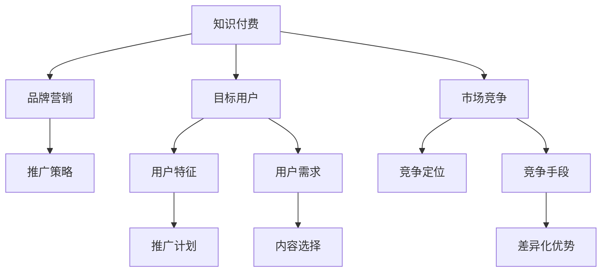

                 

# 程序员知识付费的品牌营销与推广策略

## 1. 背景介绍

随着知识付费的兴起，越来越多的开发者、教育机构和企业开始通过订阅服务、课程平台等方式，向程序员提供优质的知识和技能培训。知识付费不仅可以满足程序员终身学习的需要，还能带来丰厚的收益和市场份额。因此，如何高效地进行品牌营销和推广，成为知识付费平台和创作者共同关注的核心问题。

在本文中，我们将从品牌定位、目标用户、市场竞争、推广渠道等多个角度，深入探讨程序员知识付费的品牌营销与推广策略，并给出实际操作建议。通过全面的分析与实践，相信你能从中获得关于品牌建设与市场推广的深刻见解，并提升自身业务的市场竞争力。

## 2. 核心概念与联系

### 2.1 核心概念概述

- **知识付费**：基于互联网的订阅制知识服务模式，用户通过付费获取专业知识、技能、工具等，满足自身学习和提升需求。
- **品牌营销**：通过一系列有计划、有策略的市场活动，提升品牌知名度和用户黏性，实现市场占有率的提升。
- **推广策略**：采用何种手段和策略，通过各类媒体渠道，让更多人了解并使用知识付费平台或产品。
- **目标用户**：明确知识付费服务的目标受众，分析其特征和需求，制定精准的推广计划。
- **市场竞争**：了解竞争对手的品牌定位和营销手段，避免同质化竞争，找到差异化优势。

这些概念间的关系可以通过以下Mermaid流程图展示：



这个流程图描绘了知识付费的品牌营销与推广策略的核心概念及其相互关系，展示了从内容生产到市场推广的完整过程。

## 3. 核心算法原理 & 具体操作步骤
### 3.1 算法原理概述

品牌营销和推广的核心在于“价值传播”，即让目标用户认识并认可品牌的价值主张。从信息论的角度，这个过程可以表示为：

$$
\text{目标用户} \to \text{品牌信息} \to \text{品牌认知}
$$

其中，品牌信息包括品牌定位、产品特色、用户评价等多方面内容。通过有效的传播手段，将这些信息传达给目标用户，促使其形成对品牌的正面认知，从而完成品牌营销的闭环。

### 3.2 算法步骤详解

品牌营销与推广的步骤可以分为以下四个部分：

1. **品牌定位**：明确品牌的目标用户、核心价值和差异化优势，制定相应的品牌策略。
2. **内容生产**：制作高质量的内容，如视频课程、技术博客、专家访谈等，满足目标用户的学习和提升需求。
3. **渠道选择**：选择最适合的知识付费平台、社交媒体、技术论坛等，将内容传递给目标用户。
4. **效果评估**：通过数据分析和用户反馈，评估品牌营销的效果，持续优化推广策略。

### 3.3 算法优缺点

品牌营销与推广的优点包括：
- 可以快速吸引目标用户，提升品牌知名度和用户粘性。
- 有利于知识付费平台的差异化竞争，强化品牌特色。

缺点则包括：
- 需要大量的资金和人力投入，存在较高的风险。
- 内容质量和渠道选择直接影响推广效果，需要持续的监控和优化。

### 3.4 算法应用领域

品牌营销与推广策略不仅适用于知识付费平台，还可以广泛应用于企业品牌推广、教育机构招生、创业公司市场拓展等多个领域。尤其在程序员知识付费领域，准确的品牌定位和高效的内容传播，可以大幅提升平台的市场占有率和用户转化率。

## 4. 数学模型和公式 & 详细讲解 & 举例说明

### 4.1 数学模型构建

品牌营销与推广的核心目标是最大化用户对品牌的认知和认可。我们可以使用用户增长模型来描述这一过程，假设用户增长率为 $r$，每次推广带来的新用户数为 $n$，则品牌认知度 $C(t)$ 的递归公式可以表示为：

$$
C(t+1) = (1+r) \times C(t) + n
$$

其中，$t$ 表示时间，$C(t)$ 表示在第 $t$ 时间点的品牌认知度。

### 4.2 公式推导过程

为了更好地理解用户增长模型，我们可以假设 $r=0.1$，即每次推广能带来10%的新用户。初始品牌认知度 $C(0)=1$。当推广次数 $n=10$ 时，品牌认知度 $C(5)$ 可以计算为：

$$
C(5) = (1+0.1)^5 \times 1 + 10 = 3.79
$$

即经过5次推广后，品牌的认知度将提升至约3.79。

### 4.3 案例分析与讲解

假设某知识付费平台在一个月内，通过技术博客、视频课程、社交媒体等多种渠道进行推广，每次推广带来的新用户数为10，初始品牌认知度为1，则经过一个月后，平台的品牌认知度将达到：

$$
C(4) = (1+0.1)^4 \times 1 + 10 \times 4 = 10.59
$$

即在一个月内，通过持续的推广，品牌认知度将显著提升。

## 5. 项目实践：代码实例和详细解释说明
### 5.1 开发环境搭建

为了进行品牌营销与推广策略的实践，我们需要准备以下开发环境：

1. **服务器和数据库**：用于存储用户数据和推广记录，并进行数据分析。
2. **数据分析工具**：如Python的Pandas、NumPy、Matplotlib等，用于数据处理和可视化。
3. **推广工具**：如Google Ads、Facebook Ads等，用于在各种平台上投放广告。
4. **内容制作工具**：如Adobe Premiere Pro、After Effects、Hootsuite等，用于制作和发布视频、博客等内容。
5. **CRM系统**：用于管理用户信息，跟踪推广效果。

### 5.2 源代码详细实现

以下是一个简单的Python脚本，用于计算品牌认知度的增长：

```python
import numpy as np

def brand_awareness_growth(r, n, t):
    C = np.zeros(t+1)
    C[0] = 1
    for i in range(1, t+1):
        C[i] = (1+r) * C[i-1] + n
    return C

r = 0.1  # 每次推广带来的用户增长率
n = 10   # 每次推广带来的新用户数
t = 5    # 推广时间（月）

C = brand_awareness_growth(r, n, t)
print("品牌认知度增长：", C)
```

### 5.3 代码解读与分析

上述代码中，我们使用了NumPy库来计算品牌认知度的增长。具体来说，我们使用递归公式 $C(t+1) = (1+r) \times C(t) + n$ 来计算每个时间点上的品牌认知度。最终，我们打印出品牌认知度的增长情况。

## 6. 实际应用场景

### 6.1 知识付费平台的品牌营销

某知识付费平台通过分析其用户特征，发现其主要目标用户为初入职场的开发者，关注技术更新和职业发展。平台制定了以下品牌策略：

- **定位**：作为面向初入职场开发者的一站式技术学习平台，提供高质量的课程和实战经验。
- **内容**：主要制作与编程语言、软件开发、项目管理等相关的内容，并邀请行业专家进行技术分享。
- **渠道**：在GitHub、Stack Overflow等技术社区，以及在Bilibili、YouTube等视频平台进行推广。
- **效果评估**：通过数据分析，发现视频课程的点击率和用户留存率显著提升，从而调整推广策略。

### 6.2 教育机构的品牌推广

某教育机构通过品牌营销，成功吸引了大量编程课学员。其品牌策略包括：

- **定位**：作为面向中小学的编程教育品牌，提供有趣且实用的编程课程。
- **内容**：采用Scratch等可视化编程工具，制作有趣的游戏和应用，吸引孩子们的兴趣。
- **渠道**：在 parents 和K12 教育网站上投放广告，并利用口碑营销，进行线下活动推广。
- **效果评估**：通过学生和家长的反馈，发现课程的趣味性和实用性得到了广泛认可。

### 6.3 创业公司的市场拓展

某创业公司通过品牌营销，成功拓展了其开源工具的市场份额。其品牌策略包括：

- **定位**：作为开源社区的活跃贡献者，提供高质量的开源软件和工具。
- **内容**：发布技术博客和开源项目，介绍软件的功能和使用方法。
- **渠道**：在Github、Stack Overflow、GitLab等开源社区进行推广，并参与开源活动。
- **效果评估**：通过社区活跃度、开源项目的 stars 数和贡献者数量，评估品牌影响力。

## 7. 工具和资源推荐
### 7.1 学习资源推荐

为了掌握品牌营销与推广策略，以下是几本经典的书籍和课程推荐：

1. 《营销管理》（菲利普·科特勒）：经典的营销管理书籍，涵盖品牌定位、市场分析、推广策略等内容。
2. 《品牌创造价值》（菲利普·科特勒）：详细介绍品牌创建和管理的全过程。
3. 《数字营销全攻略》（德文·莫里斯）：涵盖数字营销的各个方面，包括SEO、内容营销、社交媒体等。
4. 《谷歌广告优化实战》（Tom Fisher）：详细介绍谷歌广告的投放和优化技巧。
5. 《数据科学家的营销指南》（Joachim Vanschoren）：数据驱动的营销策略，结合实际案例进行分析。
6. Coursera和Udemy等在线课程平台：提供大量的营销和推广相关课程，方便自学和深入理解。

### 7.2 开发工具推荐

在品牌营销与推广的实践中，以下是一些常用的工具和平台：

1. **Google Analytics**：用于网站流量和用户行为分析，评估推广效果。
2. **Adobe Analytics**：提供高级的数据分析功能，帮助优化推广策略。
3. **Hootsuite**：社交媒体管理工具，方便发布和管理内容。
4. **HubSpot**：集成了CRM、社交媒体、邮件营销等多种功能的营销平台。
5. **Google Ads**：强大的在线广告平台，覆盖多个搜索引擎和社交媒体。
6. **Facebook Ads Manager**：Facebook的广告管理工具，用于创建和管理广告。

### 7.3 相关论文推荐

以下是几篇关于品牌营销与推广策略的研究论文：

1. "Brand Equity: The Concepts and Tools of Brand Management" （菲利普·科特勒）：品牌价值管理的重要理论基础。
2. "The Role of Social Media in Branding and Marketing"（Kristina Galelo）：社交媒体对品牌推广的影响。
3. "Content Marketing and Branding: New Perspectives"（Laura Buckley）：内容营销和品牌推广的新方法。
4. "Digital Marketing Analytics and Optimization"（Joachim Vanschoren）：数据驱动的营销分析和优化方法。
5. "Brand Management in the Digital Age"（Mark A. Becker）：数字时代下的品牌管理策略。

## 8. 总结：未来发展趋势与挑战
### 8.1 总结

品牌营销与推广策略是大语言模型微调方法在程序员知识付费领域的应用延伸。本文系统介绍了品牌营销与推广的核心概念、算法原理和具体操作步骤，并通过实际案例展示了其应用效果。通过深入分析，可以发现，品牌营销与推广不仅需要精准的目标定位和优质的内容生产，还需要合适的渠道选择和持续的效果评估。这些因素共同作用，可以显著提升品牌知名度和市场份额。

通过本文的系统梳理，可以看到，品牌营销与推广策略已经成为程序员知识付费平台和创作者不可或缺的一部分。品牌建设不仅能带来市场认可，还能通过用户的口碑传播，进一步扩大品牌影响力。未来，随着技术的不断进步和市场环境的不断变化，品牌营销与推广策略必将不断演化，助力程序员知识付费平台实现更大的成功。

### 8.2 未来发展趋势

展望未来，品牌营销与推广策略将呈现以下几个发展趋势：

1. **数据驱动的精准推广**：通过大数据分析，精准定位目标用户，实现更高效的推广。
2. **多渠道融合**：将各种营销渠道整合，形成全方位的推广网络。
3. **用户参与的营销**：利用用户生成内容（UGC）和社区互动，提升用户粘性和参与度。
4. **个性化营销**：根据用户行为数据，进行个性化内容推送和推广，提高转化率。
5. **技术手段的创新**：利用AI和机器学习技术，优化推广策略，提升推广效果。
6. **社会责任的加强**：品牌营销不仅要追求商业利益，还需要承担社会责任，树立良好的企业形象。

这些趋势凸显了品牌营销与推广策略的广阔前景。未来的品牌建设需要更多技术手段的加持，才能更好地满足用户需求，提升市场竞争力。

### 8.3 面临的挑战

尽管品牌营销与推广策略在程序员知识付费领域取得了显著成效，但在实际操作中仍面临以下挑战：

1. **数据隐私和安全**：用户数据的安全和隐私保护是品牌推广中的重要问题，需要严格遵守相关法律法规。
2. **成本投入**：品牌营销与推广需要大量的资金投入，中小公司可能难以负担。
3. **内容质量**：高质量的内容制作和维护需要专业团队，对人力和资源要求较高。
4. **用户反馈**：如何及时获取用户反馈，并根据反馈调整推广策略，是一大挑战。
5. **市场竞争**：市场上已有大量的知识付费平台和课程，如何在激烈的市场竞争中脱颖而出，仍需持续努力。

### 8.4 研究展望

未来的品牌营销与推广策略需要在多个方面进行深入研究：

1. **数据隐私保护**：在推广过程中，需要严格遵守数据隐私保护法规，避免用户信息泄露。
2. **自动化推广**：利用AI技术，实现自动化的推广策略优化，降低人力成本。
3. **用户生成内容**：鼓励用户生成内容，提升平台的用户粘性和参与度。
4. **个性化推荐**：利用机器学习技术，实现个性化推荐，提高用户满意度。
5. **社会责任**：品牌推广不仅追求商业利益，还需要承担社会责任，树立良好形象。
6. **多渠道融合**：将线上线下渠道整合，形成全方位的推广网络。

这些研究方向的探索，必将引领品牌营销与推广策略迈向更高的台阶，为程序员知识付费平台和创作者带来更多的市场机遇。

## 9. 附录：常见问题与解答

**Q1：如何确定品牌定位？**

A: 品牌定位需要深入了解目标用户的需求和痛点，明确品牌在市场中的独特价值。可以通过市场调研、用户访谈、数据分析等方式，确定品牌定位。

**Q2：如何评估推广效果？**

A: 品牌营销与推广效果可以通过多种方式进行评估，如网站流量、用户留存率、广告点击率、社交媒体互动量等。使用Google Analytics、Adobe Analytics等工具，可以更全面地分析推广效果。

**Q3：如何优化推广策略？**

A: 推广策略的优化需要持续的监控和调整。可以通过A/B测试，对比不同推广策略的效果，选择最优方案。同时，结合数据分析和用户反馈，及时调整策略。

**Q4：如何选择推广渠道？**

A: 推广渠道的选择需要根据品牌定位和目标用户的特点，选择合适的平台和工具。例如，视频平台适合发布教学视频，社交媒体适合进行互动营销，技术社区适合发布开源项目。

**Q5：如何进行内容创作？**

A: 内容创作需要结合品牌定位和用户需求，制作高质量的内容。可以邀请行业专家进行技术分享，制作有趣的游戏和应用，吸引用户兴趣。

总之，品牌营销与推广策略是程序员知识付费平台和创作者不可或缺的一部分。通过深入理解和应用品牌营销策略，可以显著提升品牌知名度和用户粘性，从而实现更高的市场份额和商业利益。

