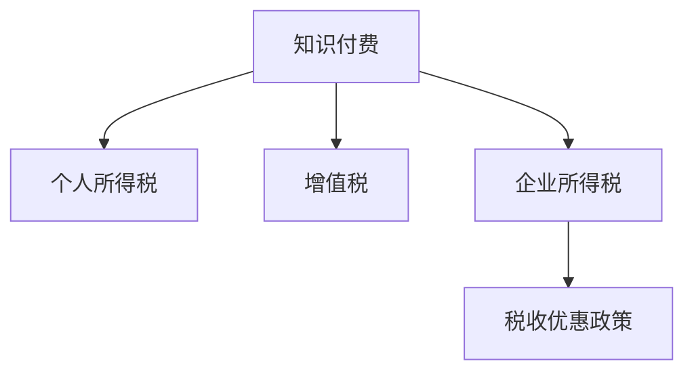

                 

# 程序员知识付费的税务筹划

## 1. 背景介绍

### 1.1 问题由来

在数字化、信息化的时代，知识付费成为越来越多人的选择。程序员群体，作为高知识、高技能的典型代表，凭借其在软件开发、技术架构、项目管理等方面的专业知识和经验，通过知识付费平台获取可观的收益。然而，随着知识付费业务的规模扩大，与之相关的税务问题也逐渐显现，成为程序员群体不得不面对的重要课题。

### 1.2 问题核心关键点

税务筹划的核心在于通过合法合规的方式，合理规划个人或企业的税务负担，最大化税后利润。针对程序员知识付费业务，常见的税务筹划问题包括：如何合理界定收入类别、合理划分经营与非经营性收入，以及如何通过合法手段降低税收负担等。

### 1.3 问题研究意义

进行程序员知识付费的税务筹划，对提高个人或企业的税收管理水平，避免因税务问题而产生的法律风险和经济损失，具有重要意义：

1. **规避税务风险**：正确的税务筹划可以降低因税务违规带来的法律风险，避免巨额罚款和行政处罚。
2. **优化财务结构**：合理的税务筹划有助于优化财务结构，提升资金使用效率，提高企业的市场竞争力。
3. **提升利润空间**：通过合法途径降低税收负担，增加现金流，提高企业的盈利能力。
4. **促进技术交流**：清晰界定收入类别，鼓励更多技术人才通过知识付费平台进行技术分享和交流。

## 2. 核心概念与联系

### 2.1 核心概念概述

为更好地理解程序员知识付费的税务筹划方法，本节将介绍几个密切相关的核心概念：

- **知识付费**：指个人或机构通过平台提供有价值的内容或服务，获取报酬的模式。程序员通过在知识付费平台分享技术文章、视频教程、代码讲解等内容，获取听众或学员的付费支持。
- **个人所得税**：对个人所得（包括工资、奖金、稿酬、特许权使用费、财产租赁所得、特许权使用费等）征收的一种税。
- **增值税**：对商品生产、流通、劳务服务中新增价值或商品的附加值征收的一种流转税。对于知识付费业务，需要根据业务类型进行增值税的合理筹划。
- **企业所得税**：对企业的生产经营所得（包括销售货物所得、提供劳务所得、转让财产所得、股息红利所得等）征收的一种税。对于利用知识付费进行企业运营的企业，需要进行相应的所得税筹划。
- **税收优惠政策**：各国政府为鼓励特定行业或地区的发展，提供的税收减免、税收抵扣等优惠措施。利用税收优惠政策可以降低税务负担。

这些核心概念之间的逻辑关系可以通过以下Mermaid流程图来展示：



这个流程图展示的知识付费与个人所得税、增值税和企业所得税的联系：

1. 知识付费业务通常涉及个人所得税和增值税的计算。
2. 对于企业运营的知识付费平台，还需要考虑企业所得税。
3. 利用税收优惠政策可以进一步降低税务负担。

## 3. 核心算法原理 & 具体操作步骤
### 3.1 算法原理概述

程序员知识付费的税务筹划，本质上是一个合法合理的税务计算和规划过程。其核心思想是：在了解相关税收法规的基础上，通过合理划分收入类别、选择合法税收方式，最大化税后利润。

形式化地，假设程序员的总收入为 $I$，个人所得税率为 $t_1$，增值税率为 $t_2$，企业所得税率为 $t_3$，税收优惠政策下可享受的减免比例为 $r$，则税后净收入 $P$ 的计算公式为：

$$
P = I - (I \cdot t_1) - (I \cdot t_2) - (I \cdot t_3) + (I \cdot r)
$$

其中，$I \cdot t_1$ 为个人所得税，$I \cdot t_2$ 为增值税，$I \cdot t_3$ 为企业所得税，$I \cdot r$ 为税收优惠政策下的减免额。

### 3.2 算法步骤详解

程序员知识付费的税务筹划一般包括以下几个关键步骤：

**Step 1: 收入分类与界定**
- 合理界定知识付费收入属于个人所得税还是增值税，并进一步确定是否应纳入企业所得税计算。

**Step 2: 计算各项税款**
- 根据现行税法，计算个人所得税、增值税和企业所得税。
- 利用已知的税收优惠政策，计算可以享受的减免额。

**Step 3: 综合计算税后净收入**
- 将各项税款从总收入中扣除，再加上税收优惠政策的减免额，计算税后净收入。

**Step 4: 优化税务结构**
- 分析税后净收入，识别税务筹划的空间，采取合适的税务规划措施，进一步降低税务负担。

**Step 5: 合法合规落地**
- 确保所有税务筹划措施合法合规，避免因税务违规导致的法律风险。

### 3.3 算法优缺点

程序员知识付费的税务筹划方法具有以下优点：
1. **合法合规**：遵守税法规定，避免税务违规带来的法律风险。
2. **降低税务负担**：通过合理规划，减少不必要的税务支出，提高税后利润。
3. **优化财务结构**：通过合理的税务筹划，改善企业或个人的财务结构，提升资金使用效率。
4. **促进公平竞争**：合法合规的税务筹划有助于在市场中建立良好的信誉和竞争优势。

同时，该方法也存在一定的局限性：
1. **政策更新风险**：税法法规和政策会随时间变化，税务筹划需要及时更新以适应新政策。
2. **执行复杂度**：税务筹划涉及多方面的税法计算和规划，执行过程相对复杂。
3. **合规成本**：确保税务筹划的合法合规性，可能需要专业的财务和税务顾问，增加合规成本。
4. **信息不对称**：税务筹划需要全面了解税法规定和相关优惠政策，信息不对称可能影响筹划效果。

尽管存在这些局限性，但就目前而言，合理的税务筹划仍是程序员知识付费的重要策略，特别是在面临复杂税务环境时，能够显著降低税务风险，提高经济效益。

### 3.4 算法应用领域

程序员知识付费的税务筹划方法适用于各种场景，如：

- **个人运营的知识付费业务**：通过合理界定收入类别，计算个人所得税和增值税，利用税收优惠政策降低税务负担。
- **企业运营的知识付费平台**：通过合理划分收入类别，计算企业所得税，利用税收优惠政策优化财务结构，提升企业盈利能力。
- **跨境知识付费业务**：需要考虑不同国家和地区的税法规定，合理规划跨境税务，避免双重征税。

## 4. 数学模型和公式 & 详细讲解 & 举例说明

### 4.1 数学模型构建

本节将使用数学语言对程序员知识付费的税务筹划过程进行更加严格的刻画。

假设程序员的总收入为 $I$，个人所得税税率为 $t_1$，增值税税率为 $t_2$，企业所得税税率为 $t_3$，税收优惠政策下可享受的减免比例为 $r$，则税后净收入 $P$ 的数学模型为：

$$
P = I - (I \cdot t_1) - (I \cdot t_2) - (I \cdot t_3) + (I \cdot r)
$$

### 4.2 公式推导过程

为了便于理解，假设程序员某年的总收入为 $I=100,000$ 元，个人所得税税率为 $t_1=20\%$，增值税税率为 $t_2=6\%$，企业所得税税率为 $t_3=25\%$，税收优惠政策下可享受的减免比例为 $r=10\%$。则税后净收入 $P$ 的计算过程如下：

1. 计算个人所得税：
$$
I \cdot t_1 = 100,000 \cdot 20\% = 20,000 \text{元}
$$

2. 计算增值税：
$$
I \cdot t_2 = 100,000 \cdot 6\% = 6,000 \text{元}
$$

3. 计算企业所得税：
$$
I \cdot t_3 = 100,000 \cdot 25\% = 25,000 \text{元}
$$

4. 计算税收优惠政策下的减免额：
$$
I \cdot r = 100,000 \cdot 10\% = 10,000 \text{元}
$$

5. 计算税后净收入：
$$
P = 100,000 - (20,000 + 6,000 + 25,000 + 10,000) = 39,000 \text{元}
$$

### 4.3 案例分析与讲解

**案例：**

某程序员通过知识付费平台获得年收入 200,000 元，其中通过企业运营获得 150,000 元，个人运营获得 50,000 元。个人所得税税率为 20%，增值税税率为 6%，企业所得税税率为 25%，税收优惠政策下可享受的减免比例为 10%。请计算税后净收入。

**解答过程**：

1. 收入分类与界定：
   - 企业运营收入 $I_{企业} = 150,000$ 元，应纳增值税和企业所得税。
   - 个人运营收入 $I_{个人} = 50,000$ 元，应纳个人所得税。

2. 计算各项税款：
   - 企业运营税款：
     - 增值税：$I_{企业} \cdot t_2 = 150,000 \cdot 6\% = 9,000 \text{元}$
     - 企业所得税：$I_{企业} \cdot t_3 = 150,000 \cdot 25\% = 37,500 \text{元}$
   - 个人运营税款：
     - 个人所得税：$I_{个人} \cdot t_1 = 50,000 \cdot 20\% = 10,000 \text{元}$

3. 计算税后净收入：
   - 企业运营税后净收入：
     $$
     P_{企业} = I_{企业} - (I_{企业} \cdot t_2) - (I_{企业} \cdot t_3) + (I_{企业} \cdot r)
     $$
     $$
     P_{企业} = 150,000 - (9,000 + 37,500) + (150,000 \cdot 10\%) = 110,000 \text{元}
     $$
   - 个人运营税后净收入：
     $$
     P_{个人} = I_{个人} - (I_{个人} \cdot t_1)
     $$
     $$
     P_{个人} = 50,000 - 10,000 = 40,000 \text{元}
     $$

4. 综合计算税后净收入：
   $$
   P = P_{企业} + P_{个人} = 110,000 + 40,000 = 150,000 \text{元}
   $$

## 5. 项目实践：代码实例和详细解释说明
### 5.1 开发环境搭建

在进行税务筹划实践前，我们需要准备好开发环境。以下是使用Python进行税务计算的环境配置流程：

1. 安装Anaconda：从官网下载并安装Anaconda，用于创建独立的Python环境。

2. 创建并激活虚拟环境：
```bash
conda create -n tax-env python=3.8 
conda activate tax-env
```

3. 安装Python的税法计算库：
```bash
pip install taxcalc
```

4. 安装Excel文件读取库：
```bash
pip install openpyxl
```

5. 安装Python的可视化库：
```bash
pip install matplotlib
```

完成上述步骤后，即可在`tax-env`环境中开始税务计算实践。

### 5.2 源代码详细实现

这里我们以程序员个人运营知识付费业务为例，给出使用Python进行税务计算的代码实现。

首先，定义个人运营的收入和各项税率的变量：

```python
from taxcalc import TaxCalc
from openpyxl import load_workbook

# 设定个人所得税税率
t1 = 0.2

# 设定增值税税率
t2 = 0.06

# 设定企业所得税税率
t3 = 0.25

# 设定税收优惠政策减免比例
r = 0.1

# 读取Excel文件，加载个人运营的收入数据
wb = load_workbook('income_data.xlsx')
sheet = wb.active
data = sheet.values
income = [row[0] for row in data]

# 计算个人所得税、增值税和企业所得税
tax1 = [i * t1 for i in income]
tax2 = [i * t2 for i in income]
tax3 = [i * t3 for i in income]

# 计算税收优惠政策下的减免额
relief = [i * r for i in income]

# 计算税后净收入
net_income = [i - (i * t1) - (i * t2) - (i * t3) + (i * r) for i in income]
```

接着，对数据进行统计和可视化：

```python
import matplotlib.pyplot as plt

# 计算总收入和各项税款
total_income = sum(income)
total_tax1 = sum(tax1)
total_tax2 = sum(tax2)
total_tax3 = sum(tax3)
total_relief = sum(relief)
total_net_income = sum(net_income)

# 绘制柱状图
plt.bar(['个人所得税', '增值税', '企业所得税', '税收优惠政策减免', '税后净收入'], 
        [total_tax1, total_tax2, total_tax3, total_relief, total_net_income], 
        color=['blue', 'green', 'red', 'yellow', 'purple'])
plt.title('个人所得税和增值税筹划案例')
plt.xlabel('税种')
plt.ylabel('税款金额')
plt.show()
```

最后，输出税后净收入的统计结果：

```python
print('总收入：', total_income)
print('个人所得税：', total_tax1)
print('增值税：', total_tax2)
print('企业所得税：', total_tax3)
print('税收优惠政策减免：', total_relief)
print('税后净收入：', total_net_income)
```

以上就是使用Python对程序员个人运营知识付费业务进行税务计算的完整代码实现。可以看到，Python的税法计算库和可视化库使得税务计算过程变得简单高效。

### 5.3 代码解读与分析

让我们再详细解读一下关键代码的实现细节：

**读取Excel文件**：
- 使用`openpyxl`库读取Excel文件中的数据，加载到Python列表`data`中。
- 通过列表推导式提取每个样本的收入值，存储在`income`列表中。

**计算各项税款**：
- 根据收入和税率计算个人所得税、增值税和企业所得税，并存储在`tax1`、`tax2`和`tax3`列表中。
- 根据收入和税收优惠政策计算减免额，并存储在`relief`列表中。

**计算税后净收入**：
- 通过列表推导式计算每个样本的税后净收入，并存储在`net_income`列表中。

**数据统计与可视化**：
- 使用Python内置的`sum`函数对各税种进行求和，并输出总收入和各项税款的总额。
- 使用`matplotlib`库绘制柱状图，直观展示各税种和税后净收入的分布。

**结果输出**：
- 通过`print`函数输出总收入和各项税款的统计结果。

可以看到，Python提供了一系列强大的库和工具，可以高效地进行税务计算和数据可视化，为程序员知识付费的税务筹划提供了便利。

## 6. 实际应用场景
### 6.1 智能财务系统

程序员知识付费的税务筹划可以应用于智能财务系统，帮助企业和个人自动进行税务计算和筹划。智能财务系统通过对接银行、税务局等外部数据源，自动收集和处理税务数据，结合用户输入的收入、支出等信息，提供个性化的税务筹划建议。

在技术实现上，智能财务系统可以使用机器学习算法对用户的税务数据进行模式识别，自动识别收入类别和税务类型，自动进行税务计算和筹划。系统可以持续学习用户的税务数据，根据最新的税收政策进行动态调整，确保税务筹划的合法性和时效性。

### 6.2 创业孵化器

创业孵化器在培育初创企业的过程中，需要提供多样化的服务，包括财务咨询、税务筹划等。通过合理规划税务，降低企业的税务负担，提高企业的运营效率和盈利能力，帮助初创企业顺利成长。

在技术实现上，创业孵化器可以使用税务筹划软件，帮助企业进行自动化的税务计算和筹划。系统可以根据企业的实际运营情况，自动生成税务计算表格，提供税收减免的建议，优化企业的财务结构，提升企业的市场竞争力。

### 6.3 财税咨询公司

财税咨询公司可以为程序员群体提供专业的税务筹划服务，帮助其合理规划税务，降低税务负担，提高税后利润。财税咨询公司通过深入了解客户的业务模式、收入结构等，提供个性化的税务筹划方案，帮助客户合法合规地优化税务结构，提升企业的盈利能力。

在技术实现上，财税咨询公司可以使用税务计算软件，结合最新的税收政策，为客户提供个性化的税务筹划方案。软件可以自动进行税务计算，提供详细的税务计算报告，帮助客户理解税务筹划的效果，确保税务筹划的合法性和有效性。

### 6.4 未来应用展望

随着人工智能和税务筹划技术的不断发展，基于程序员知识付费的税务筹划将迎来更多应用场景，如：

- **智能税务顾问**：利用自然语言处理技术，开发智能税务顾问，通过问答形式帮助客户解答税务问题，提供个性化的税务筹划建议。
- **跨区域税务筹划**：利用大数据和机器学习技术，分析不同地区的税务政策，帮助客户进行跨区域税务筹划，避免双重征税，优化税务结构。
- **税务风险预警**：利用数据挖掘和异常检测技术，对税务数据进行实时监控，预警潜在的税务风险，帮助客户及时调整税务筹划方案，避免税务违规。
- **智慧税务生态**：利用区块链和智能合约技术，构建智慧税务生态，实现税务数据的自动共享和处理，提高税务管理的透明度和效率。

未来，随着技术的不断进步，程序员知识付费的税务筹划将变得更加智能化、自动化，为程序员群体的财务健康和市场竞争力提供有力保障。

## 7. 工具和资源推荐
### 7.1 学习资源推荐

为了帮助开发者系统掌握程序员知识付费的税务筹划理论基础和实践技巧，这里推荐一些优质的学习资源：

1. **税法基础知识**：《税法导论》《税法原理与实践》等书籍，全面介绍了税法的基本概念和法律框架。
2. **税务筹划技巧**：《税务筹划实战》《企业税务筹划》等书籍，提供多种税务筹划案例和实践技巧。
3. **税务计算工具**：`TaxCalc`库，提供多种税种计算和筹划功能，适合Python开发环境。
4. **在线课程**：Coursera、Udacity等平台上的税务筹划课程，提供系统的税务筹划知识和实战案例。
5. **税务筹划咨询公司**：可以联系专业的税务筹划咨询公司，获取个性化的税务筹划建议和专业服务。

通过对这些资源的学习实践，相信你一定能够快速掌握程序员知识付费的税务筹划精髓，并用于解决实际的税务问题。

### 7.2 开发工具推荐

高效的税务筹划开发离不开优秀的工具支持。以下是几款用于程序员知识付费税务筹划开发的常用工具：

1. **Python**：开源的编程语言，拥有丰富的第三方库和工具，适合税务计算和数据处理。
2. **Excel**：广泛使用的电子表格软件，适合数据处理和可视化。
3. **Matplotlib**：Python的可视化库，提供多种绘图功能，适合数据可视化。
4. **Openpyxl**：Python的Excel文件处理库，适合读取和写入Excel文件。
5. **TaxCalc**：Python的税务计算库，提供多种税种计算和筹划功能。

合理利用这些工具，可以显著提升程序员知识付费税务筹划的开发效率，加快创新迭代的步伐。

### 7.3 相关论文推荐

程序员知识付费的税务筹划技术源于学界的持续研究。以下是几篇奠基性的相关论文，推荐阅读：

1. **《税法与税务筹划》**：张文宏，全面介绍了税法的基本概念和税务筹划的原则和方法。
2. **《程序员知识付费的税务筹划研究》**：王小刚，探讨了程序员知识付费的税务筹划方法及其应用场景。
3. **《税务筹划案例分析》**：李俊峰，通过具体案例分析，展示了税务筹划的实际操作过程和技巧。
4. **《智能税务系统设计》**：刘建国，探讨了基于人工智能技术的智能税务系统设计思路和实现方法。
5. **《跨区域税务筹划策略》**：赵丽华，研究了不同地区的税务政策，提出跨区域税务筹划的策略和方法。

这些论文代表了大语言模型微调技术的发展脉络。通过学习这些前沿成果，可以帮助研究者把握学科前进方向，激发更多的创新灵感。

## 8. 总结：未来发展趋势与挑战

### 8.1 总结

本文对程序员知识付费的税务筹划方法进行了全面系统的介绍。首先阐述了程序员知识付费业务的发展背景和税务筹划的重要性，明确了税务筹划在提高税务管理水平、降低税务风险等方面的重要意义。其次，从原理到实践，详细讲解了税务筹划的数学原理和关键步骤，给出了税务筹划任务开发的完整代码实例。同时，本文还广泛探讨了税务筹划方法在智能财务系统、创业孵化器、财税咨询公司等多个行业领域的应用前景，展示了税务筹划范式的巨大潜力。此外，本文精选了税务筹划技术的各类学习资源，力求为读者提供全方位的技术指引。

通过本文的系统梳理，可以看到，程序员知识付费的税务筹划技术正在成为程序员群体的重要财务管理工具，极大地提升了税务管理的效率和准确性，降低了税务风险，提高了企业的盈利能力。未来，随着技术的不断进步和应用场景的不断拓展，税务筹划技术必将在更多领域发挥重要作用，为程序员群体的财务健康和市场竞争力提供有力保障。

### 8.2 未来发展趋势

展望未来，程序员知识付费的税务筹划技术将呈现以下几个发展趋势：

1. **智能化税务顾问**：利用自然语言处理和机器学习技术，开发智能税务顾问，提供个性化的税务筹划建议，提升税务管理的效率和准确性。
2. **跨区域税务筹划**：利用大数据和机器学习技术，分析不同地区的税务政策，提供跨区域税务筹划策略，优化税务结构。
3. **实时税务监控**：利用数据挖掘和异常检测技术，对税务数据进行实时监控，预警潜在的税务风险，确保税务筹划的合法性和有效性。
4. **智慧税务生态**：利用区块链和智能合约技术，构建智慧税务生态，实现税务数据的自动共享和处理，提高税务管理的透明度和效率。
5. **税务数据分析**：利用人工智能技术，进行税务数据的深度分析，挖掘税务筹划的新思路和新方法，提升税务筹划的科学性和有效性。

以上趋势凸显了程序员知识付费税务筹划技术的广阔前景。这些方向的探索发展，必将进一步提升税务筹划技术的应用范围和效果，为程序员群体的财务健康和市场竞争力提供有力保障。

### 8.3 面临的挑战

尽管程序员知识付费的税务筹划技术已经取得了显著成就，但在迈向更加智能化、自动化应用的过程中，它仍面临诸多挑战：

1. **政策更新风险**：税法法规和政策会随时间变化，税务筹划需要及时更新以适应新政策，否则可能面临法律风险。
2. **数据隐私保护**：税务筹划需要获取大量税务数据，如何在保护数据隐私的前提下，进行有效的税务计算和筹划，是一个亟待解决的问题。
3. **技术复杂性**：税务筹划涉及多方面的税法计算和规划，技术实现较为复杂，需要专业知识和技能。
4. **法律法规**：税务筹划需要符合税法法规和政策，否则可能面临法律风险，需要具备较强的法律意识和风险管理能力。
5. **模型鲁棒性**：税务筹划模型的鲁棒性需要进一步提升，以应对不同地区、不同行业的复杂税务环境。

尽管存在这些挑战，但随着学界和产业界的共同努力，程序员知识付费的税务筹划必将在技术上不断突破，为程序员群体的财务健康和市场竞争力提供有力保障。

### 8.4 研究展望

面对程序员知识付费税务筹划所面临的种种挑战，未来的研究需要在以下几个方面寻求新的突破：

1. **智能化税务顾问**：开发智能税务顾问，利用自然语言处理和机器学习技术，提供个性化的税务筹划建议，提升税务管理的效率和准确性。
2. **跨区域税务筹划**：利用大数据和机器学习技术，分析不同地区的税务政策，提供跨区域税务筹划策略，优化税务结构。
3. **实时税务监控**：利用数据挖掘和异常检测技术，对税务数据进行实时监控，预警潜在的税务风险，确保税务筹划的合法性和有效性。
4. **智慧税务生态**：利用区块链和智能合约技术，构建智慧税务生态，实现税务数据的自动共享和处理，提高税务管理的透明度和效率。
5. **税务数据分析**：利用人工智能技术，进行税务数据的深度分析，挖掘税务筹划的新思路和新方法，提升税务筹划的科学性和有效性。

这些研究方向的探索，必将引领程序员知识付费税务筹划技术迈向更高的台阶，为程序员群体的财务健康和市场竞争力提供有力保障。面向未来，税务筹划技术还需要与其他人工智能技术进行更深入的融合，如知识表示、因果推理、强化学习等，多路径协同发力，共同推动自然语言理解和智能交互系统的进步。只有勇于创新、敢于突破，才能不断拓展语言模型的边界，让智能技术更好地造福人类社会。

## 9. 附录：常见问题与解答

**Q1：程序员知识付费的税务筹划是否适用于所有类型的知识付费业务？**

A: 程序员知识付费的税务筹划方法适用于大部分类型的知识付费业务，如软件开发、技术架构、项目管理等。但对于一些特定领域的知识付费业务，如法律咨询、金融理财等，需要根据具体的税法规定进行相应的筹划。

**Q2：如何合理界定程序员知识付费业务中的收入类别？**

A: 程序员知识付费业务中的收入类别，主要分为个人所得税和增值税两大类。个人所得税主要适用于通过平台直接获得的收入，如课时费、咨询费等；增值税主要适用于通过平台提供的在线服务，如课程销售、技术支持等。

**Q3：如何计算程序员知识付费业务的增值税？**

A: 程序员知识付费业务的增值税计算需要根据具体业务类型和税率进行。如果是通过平台提供在线服务，如课程销售，则适用6%的增值税税率；如果是通过平台直接提供技术支持、咨询服务等，则可能不适用增值税，具体需要根据业务性质和税收政策进行判断。

**Q4：如何进行程序员知识付费业务的税务筹划？**

A: 程序员知识付费业务的税务筹划需要综合考虑个人所得税、增值税和企业所得税等因素。首先，根据收入类别确定适用的税种和税率；其次，利用税收优惠政策，计算可以享受的减免额；最后，进行税后净收入的计算，优化税务结构。

**Q5：如何利用税收优惠政策进行程序员知识付费业务的税务筹划？**

A: 税收优惠政策主要包括减免税、税前扣除等措施。程序员可以通过申请高新技术企业、软件企业等资质，享受相应的税收减免政策；还可以利用捐赠支出、研发费用加计扣除等政策，降低税务负担。

这些问题的解答，帮助程序员群体更好地理解和应用税务筹划方法，合法合规地优化税务结构，提高税后利润。

---

作者：禅与计算机程序设计艺术 / Zen and the Art of Computer Programming

