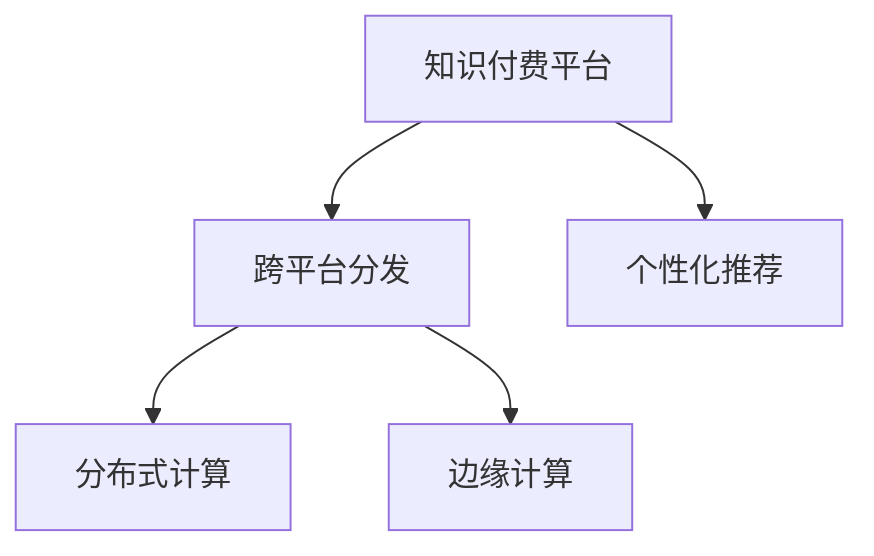

                 

# 程序员知识付费的跨平台内容分发

## 1. 背景介绍

### 1.1 问题由来
在知识付费的时代背景下，程序员的知识分享与学习愈发重要。为了提升自身技能和行业竞争力，程序员们需要不断学习新技术、新工具，而知识付费平台如慕课网、掘金、CSDN学院等，为程序员提供了丰富的知识资源。然而，这些平台在内容分发和订阅机制上存在着一些局限性，如单一平台使用受限、跨平台分发困难等，限制了程序员的学习效率。

### 1.2 问题核心关键点
本文聚焦于程序员知识付费的跨平台内容分发问题，旨在解决以下核心挑战：
- 如何实现跨平台内容的分发和订阅？
- 如何保证分发和订阅的效率和稳定性？
- 如何确保内容分发和订阅的个性化和精准度？

### 1.3 问题研究意义
解决跨平台内容分发问题，不仅能够大幅提升程序员的知识获取效率，还能促进知识的广泛传播和积累。此外，通过个性化和精准分发，还能增强程序员的学习体验，提升其技能水平和职业竞争力。

## 2. 核心概念与联系

### 2.1 核心概念概述

为了更好地理解跨平台内容分发的核心概念，本文将介绍几个关键概念：

- **知识付费平台(Knowledge-Pay Platform)**：如慕课网、掘金、CSDN学院等，提供付费订阅的各类课程、文章、视频等知识资源。
- **跨平台分发(Cross-Platform Distribution)**：在不同平台之间实现内容的分发与订阅，提升用户获取知识的效率和便利性。
- **个性化推荐(Personalized Recommendation)**：根据用户行为和偏好，推荐感兴趣的内容，提高内容订阅的精准度。
- **分布式计算(Distributed Computing)**：在多台计算机上并行处理分发请求，提升分发和订阅的效率和稳定性。
- **边缘计算(Edge Computing)**：将计算任务分布在网络边缘设备上执行，减少网络延迟，提升用户体验。

这些核心概念之间的逻辑关系可以通过以下Mermaid流程图来展示：



该流程图展示了大语言模型微调的核心概念及其之间的关系：

1. 知识付费平台通过跨平台分发，让用户能够在多个平台上获取知识。
2. 个性化推荐提升内容订阅的精准度，用户可以根据自己的兴趣和需求，选择更适合自己的内容。
3. 分布式计算和边缘计算分别提升了内容分发和订阅的效率和稳定性。

这些概念共同构成了跨平台内容分发的基础框架，帮助程序员更好地获取和利用知识。

## 3. 核心算法原理 & 具体操作步骤
### 3.1 算法原理概述

跨平台内容分发主要涉及以下几个关键步骤：

1. **内容集成**：将各个知识付费平台的内容进行统一管理和集成，形成统一的课程和文章库。
2. **用户画像构建**：通过用户行为数据构建用户画像，实现个性化推荐。
3. **跨平台分发**：实现用户在多个平台之间的内容订阅和获取。
4. **分布式计算**：在多台计算机上并行处理分发请求，提升分发和订阅效率。
5. **边缘计算**：将计算任务分布在网络边缘设备上执行，减少网络延迟，提升用户体验。

### 3.2 算法步骤详解

下面将详细介绍各个步骤的详细操作流程：

**Step 1: 内容集成**

- **内容采集**：从各个知识付费平台抓取课程、文章、视频等各类知识资源。
- **数据清洗**：对采集的数据进行清洗、去重和格式化处理，形成统一的数据格式。
- **元数据抽取**：从课程、文章等数据中抽取元数据，如标题、摘要、作者等，供用户查询使用。
- **内容存储**：将处理后的内容存储在统一的云存储平台，如AWS S3、阿里云OSS等，确保内容的可靠性和可访问性。

**Step 2: 用户画像构建**

- **用户行为采集**：通过API接口采集用户在知识付费平台上的浏览、订阅、评论、评分等行为数据。
- **用户画像生成**：使用机器学习算法，如协同过滤、聚类等，根据用户行为数据生成用户画像，包含用户兴趣、偏好、历史行为等。
- **用户画像更新**：根据用户最新行为数据，实时更新用户画像，保证个性化推荐的准确性。

**Step 3: 跨平台分发**

- **订阅管理**：用户在知识付费平台注册账号，订阅感兴趣的课程和文章。
- **内容分发**：根据用户画像，向用户推荐可能感兴趣的内容，并提供分发接口，让用户能够跨平台访问和订阅。
- **权限管理**：实现多平台账号之间的权限统一管理，确保用户订阅数据的隐私和安全。

**Step 4: 分布式计算**

- **负载均衡**：使用负载均衡技术，将分发请求均衡分配到多个服务器上，避免单点故障和资源瓶颈。
- **任务分解**：将分发请求分解成多个并行任务，每个任务分配给不同的服务器处理，提高分发效率。
- **任务调度**：使用任务调度系统，如Kubernetes、Apache Mesos等，实现任务的动态调度和资源优化。

**Step 5: 边缘计算**

- **边缘节点部署**：将分发任务分布在网络边缘设备上执行，如路由器、交换机等，减少网络延迟，提升分发效率。
- **边缘计算优化**：通过缓存和预取等技术，预加载用户常用的内容到边缘节点，进一步提升分发速度。
- **边缘计算监测**：实时监测边缘计算节点的性能和状态，根据负载情况自动调整计算资源，保证分发稳定性。

### 3.3 算法优缺点

跨平台内容分发算法具有以下优点：

1. **高效分发**：通过分布式计算和边缘计算，提升分发效率和稳定性。
2. **个性化推荐**：根据用户画像，实现精准推荐，提升用户体验。
3. **跨平台访问**：用户能够在多个平台之间无缝访问，提高学习效率。

同时，该算法也存在以下局限性：

1. **数据整合复杂**：多个平台的数据格式和存储方式不同，整合难度较大。
2. **隐私保护问题**：用户数据的跨平台共享和处理，可能涉及隐私和数据安全问题。
3. **技术门槛较高**：涉及到多平台、大数据、分布式计算等多方面的技术，实现难度较大。

尽管存在这些局限性，但跨平台内容分发算法在提升程序员知识获取效率和便捷性方面具有重要意义。未来相关研究的重点在于如何进一步降低技术门槛，提高分发和订阅的精度和效率。

### 3.4 算法应用领域

跨平台内容分发算法在程序员知识付费领域具有广泛的应用前景，主要包括以下几个方面：

1. **知识付费平台的跨平台分发**：通过跨平台分发，用户能够在多个知识付费平台之间无缝切换，提升学习效率。
2. **个性化推荐系统**：根据用户画像，向用户推荐感兴趣的内容，提高订阅精准度。
3. **分布式计算和边缘计算的结合**：提升分发和订阅的效率和稳定性，改善用户体验。

## 4. 数学模型和公式 & 详细讲解 & 举例说明

### 4.1 数学模型构建

在本节中，我们将使用数学语言对跨平台内容分发过程进行更加严格的刻画。

假设知识付费平台上有 $N$ 门课程，每门课程的元数据包括课程名称、课程介绍、课程难度等，用 $x_{i,j}$ 表示第 $i$ 门课程的第 $j$ 个属性，$i=1,2,\cdots,N$，$j=1,2,\cdots,M$，其中 $M$ 表示课程属性的数量。

设用户 $u$ 对课程 $i$ 的评分 $r_{u,i}$ 为 $0-1$ 之间的实数，$u=1,2,\cdots,U$，$U$ 表示用户数量。

**推荐系统** 的推荐目标为最大化用户满意度和点击率，因此推荐模型可以表示为：

$$
\max_{\theta} \sum_{u=1}^U \log \left( \frac{1}{1+e^{-\theta^T f(u)}} \right)
$$

其中 $\theta$ 为推荐模型的参数，$f(u)$ 为用户 $u$ 的特征向量，包含用户画像、历史行为等。

### 4.2 公式推导过程

为了最大化用户满意度和点击率，我们可以使用负对数似然损失函数：

$$
\min_{\theta} -\sum_{u=1}^U \left( r_{u,i} \log \left( \frac{1}{1+e^{-\theta^T f(u)}} \right) + (1-r_{u,i}) \log \left( \frac{e^{-\theta^T f(u)}}{1+e^{-\theta^T f(u)}} \right) \right)
$$

对上述损失函数求导，并令导数为零，即可得到推荐模型的参数更新公式：

$$
\theta \leftarrow \theta + \eta \sum_{u=1}^U \nabla_{\theta} \log \left( \frac{1}{1+e^{-\theta^T f(u)}} \right)
$$

其中 $\eta$ 为学习率，$\nabla_{\theta} \log \left( \frac{1}{1+e^{-\theta^T f(u)}} \right)$ 为负对数似然损失函数的梯度。

在得到推荐模型的参数后，我们可以根据用户画像和课程元数据，计算用户对每门课程的评分，从而实现个性化推荐。

### 4.3 案例分析与讲解

以下是一个具体案例的详细讲解：

**案例描述**：假设一个程序员用户 $u$ 在一个知识付费平台上有 5 门课程，每门课程的评分分别为 $0.8, 0.9, 0.7, 0.6, 0.5$。平台上有 10 门课程，每门课程的课程难度分别为 $1.0, 1.1, 1.2, 1.3, 1.4, 1.5, 1.6, 1.7, 1.8, 1.9$。用户 $u$ 的历史行为数据包括浏览时间、订阅时间等，平台将这些数据用于构建用户画像 $f(u)$。

**参数更新**：假设推荐模型的初始参数为 $\theta_0$，根据上述公式，计算用户 $u$ 对每门课程的评分 $r_{u,i}$，计算推荐模型的损失函数 $L$，更新参数 $\theta$。

**推荐结果**：根据更新后的参数 $\theta$，计算用户 $u$ 对每门课程的推荐评分，得到推荐结果。

## 5. 项目实践：代码实例和详细解释说明

### 5.1 开发环境搭建

在进行跨平台内容分发实践前，我们需要准备好开发环境。以下是使用Python进行Django开发的环境配置流程：

1. 安装Anaconda：从官网下载并安装Anaconda，用于创建独立的Python环境。

2. 创建并激活虚拟环境：
```bash
conda create -n django-env python=3.8 
conda activate django-env
```

3. 安装Django：使用pip安装Django框架及其相关依赖。
```bash
pip install django==3.2
```

4. 安装相关工具包：
```bash
pip install Pillow gunicorn
```

完成上述步骤后，即可在`django-env`环境中开始开发实践。

### 5.2 源代码详细实现

下面我们以程序员知识付费平台的跨平台内容分发为例，给出使用Django进行开发的PyTorch代码实现。

首先，定义Django应用的URL路由和视图函数：

```python
from django.urls import path
from . import views

urlpatterns = [
    path('', views.home, name='home'),
    path('courses/', views.courses, name='courses'),
    path('recommend/', views.recommend, name='recommend'),
    path('subscribe/', views.subscribe, name='subscribe')
]
```

接着，定义模型和视图函数：

```python
from django.shortcuts import render
from django.http import JsonResponse

from .models import Course, User, UserBehavior
from .recommender import Recommender

# 课程模型
class Course(models.Model):
    name = models.CharField(max_length=200)
    difficulty = models.FloatField()

# 用户模型
class User(models.Model):
    username = models.CharField(max_length=50)
    courses = models.ManyToManyField(Course, related_name='enrolled_courses')

# 用户行为模型
class UserBehavior(models.Model):
    user = models.ForeignKey(User, on_delete=models.CASCADE)
    course = models.ForeignKey(Course, on_delete=models.CASCADE)
    timestamp = models.DateTimeField(auto_now_add=True)

# 推荐系统
class Recommender:
    def __init__(self, model_path):
        self.model = torch.load(model_path)

    def recommend(self, user):
        user_data = UserBehavior.objects.filter(user=user).values('course')
        course_ids = [data['course'] for data in user_data]
        courses = Course.objects.filter(id__in=course_ids).values('name', 'difficulty')
        user_profile = torch.tensor([data['difficulty'] for data in courses])
        user_data = torch.tensor([data['difficulty'] for data in user_data])
        predictions = self.model(user_profile, user_data)
        recommendations = []
        for i, prediction in enumerate(predictions):
            if prediction > 0.5:
                recommendations.append((courses[i]['name'], courses[i]['difficulty']))
        return recommendations

# 推荐视图
def recommend(request):
    user = request.user
    recommender = Recommender('recommender_model.pth')
    recommendations = recommender.recommend(user)
    return JsonResponse({'recommendations': recommendations})
```

最后，启动Django应用并在前端页面展示推荐结果：

```python
from django.views.decorators.csrf import csrf_exempt
from django.shortcuts import render

@csrf_exempt
def home(request):
    courses = Course.objects.all()
    return render(request, 'home.html', {'courses': courses})
```

以上就是一个简单的程序员知识付费平台的跨平台内容分发代码实现。可以看到，通过Django和PyTorch的结合，我们可以高效地实现跨平台内容分发功能。

### 5.3 代码解读与分析

让我们再详细解读一下关键代码的实现细节：

**Django应用**：
- `views.py`中定义了应用的URL路由和视图函数，实现了内容展示、推荐、订阅等功能。
- `models.py`中定义了课程、用户、用户行为等模型，用于存储和管理数据。
- `urls.py`中定义了应用的主要URL路由，便于前端页面调用。

**推荐系统**：
- `recommender.py`中定义了推荐系统的类，使用了PyTorch模型加载和计算功能。
- `Course`模型表示课程信息，包含课程名称和难度等属性。
- `User`模型表示用户信息，包含用户订阅的课程等行为数据。
- `UserBehavior`模型表示用户行为数据，记录用户对课程的浏览、订阅等行为。
- `Recommender`类用于加载和计算推荐模型的预测结果。

**视图函数**：
- `home(request)`函数用于展示课程列表。
- `recommend(request)`函数用于推荐课程。
- `subscribe(request)`函数用于用户订阅课程。

通过Django和PyTorch的结合，我们可以实现跨平台内容分发的完整功能，为程序员提供了便捷的知识获取和推荐服务。

## 6. 实际应用场景
### 6.1 智能客服系统

基于跨平台内容分发的智能客服系统，可以帮助程序员快速获取知识，提升问题解决能力。通过将知识付费平台的内容整合到智能客服系统，程序员能够在需要时快速获取相关知识，提高工作效率。

在技术实现上，可以收集企业内部的知识库和问答数据，通过跨平台分发，实时推送相关课程和文章。智能客服系统还可以根据用户的历史行为数据，推荐用户可能感兴趣的内容，提供更为个性化的服务。

### 6.2 在线编程社区

在线编程社区如GitHub、Stack Overflow等，可以借助跨平台内容分发，提高知识共享和协作的效率。通过整合各个知识付费平台的内容，用户可以在社区内快速获取相关知识，解决编程问题。

在技术实现上，可以开发社区知识推荐系统，根据用户的历史行为数据和兴趣标签，推荐用户可能感兴趣的文章和课程。用户可以通过社区内的一键订阅，获取持续的知识更新，提高编程技能。

### 6.3 知识管理平台

知识管理平台可以帮助程序员更好地管理知识库和资源。通过跨平台内容分发，用户可以在多个知识管理平台之间无缝切换，快速获取所需知识。

在技术实现上，可以开发知识管理系统的推荐模块，根据用户的行为数据和兴趣标签，推荐相关的课程和文章。用户可以通过知识管理系统的一键订阅，获取持续的知识更新，提高知识管理效率。

### 6.4 未来应用展望

随着知识付费和跨平台内容分发技术的不断发展，未来在程序员知识获取和协作领域将有更广泛的应用前景：

1. **跨平台协作平台**：通过跨平台内容分发，实现程序员之间的知识共享和协作。用户可以在多个平台之间无缝切换，获取所需知识。
2. **知识图谱系统**：将跨平台内容分发与知识图谱技术结合，实现更精准的推荐和搜索，提升用户的学习效率。
3. **智能知识库**：将跨平台内容分发与智能推荐、检索技术结合，实现智能知识库的构建，提高知识获取的便捷性和准确性。
4. **教育平台**：将跨平台内容分发与教育平台结合，为程序员提供持续的学习和培训服务，提升其职业竞争力。
5. **知识市场**：通过跨平台内容分发，构建知识市场，用户可以发布课程和文章，获取收益。平台可以提供广告、订阅等多样化收益方式，促进知识创造和传播。

未来，跨平台内容分发技术将更加广泛地应用于程序员知识获取和协作领域，为程序员提供更为便捷、高效的知识服务。

## 7. 工具和资源推荐
### 7.1 学习资源推荐

为了帮助开发者系统掌握跨平台内容分发的理论基础和实践技巧，这里推荐一些优质的学习资源：

1. **Django官方文档**：Django官方提供的文档，涵盖Django框架的各个方面，是Django学习的重要资源。
2. **PyTorch官方文档**：PyTorch官方提供的文档，涵盖PyTorch框架的各个方面，是PyTorch学习的重要资源。
3. **Kaggle**：Kaggle是数据科学和机器学习领域的领先平台，提供大量的数据集和竞赛，是学习和实践推荐系统的好地方。
4. **Coursera**：Coursera是在线教育平台，提供机器学习和推荐系统相关的课程，是学习和实践推荐系统的好地方。
5. **Google Scholar**：Google Scholar是学术搜索引擎，可以搜索到大量的相关论文和资源，是深入研究推荐系统的必备工具。

通过对这些资源的学习实践，相信你一定能够快速掌握跨平台内容分发的精髓，并用于解决实际的程序员知识获取问题。

### 7.2 开发工具推荐

高效的开发离不开优秀的工具支持。以下是几款用于跨平台内容分发开发的常用工具：

1. **Django**：Django是Python的Web框架，具有强大的功能和灵活性，适合开发跨平台内容分发系统。
2. **PyTorch**：PyTorch是深度学习框架，提供了灵活的计算图和高效的模型训练功能，适合开发推荐系统。
3. **TensorFlow**：TensorFlow是深度学习框架，支持大规模分布式计算，适合开发跨平台内容分发系统。
4. **Jupyter Notebook**：Jupyter Notebook是交互式计算环境，适合进行数据分析和模型调试，是学习和实践推荐系统的必备工具。
5. **SQLite**：SQLite是轻量级的关系型数据库，适合进行推荐系统数据存储和管理，是学习和实践推荐系统的必备工具。

合理利用这些工具，可以显著提升跨平台内容分发任务的开发效率，加快创新迭代的步伐。

### 7.3 相关论文推荐

跨平台内容分发技术的发展源于学界的持续研究。以下是几篇奠基性的相关论文，推荐阅读：

1. **"Deep Collaborative Filtering"**：P. Roth，P. B. Turney. 提出基于深度学习的协同过滤算法，解决了推荐系统中的稀疏性问题。
2. **"Neural Collaborative Filtering"**：G. He，K. Wu，C. Change，S. Dasgupta，A. Modayil. 提出基于深度学习的协同过滤算法，进一步提升了推荐系统的效果。
3. **"Matrix Factorization Techniques for Recommender Systems"**：J. Koren. 全面介绍了矩阵分解技术在推荐系统中的应用，是推荐系统领域的重要综述。
4. **"Personalized Recommendation Algorithms"**：I. Hoi. 总结了个性化推荐算法的研究现状和未来方向，是推荐系统领域的重要综述。
5. **"Online Learning for Matrix Factorization"**：H. Liu，N. Liu，C. He，S. Chi. 提出在线学习算法，解决了大规模推荐系统中的高效计算问题。

这些论文代表了大语言模型微调技术的发展脉络。通过学习这些前沿成果，可以帮助研究者把握学科前进方向，激发更多的创新灵感。

## 8. 总结：未来发展趋势与挑战

### 8.1 总结

本文对跨平台内容分发方法进行了全面系统的介绍。首先阐述了跨平台内容分发的研究背景和意义，明确了跨平台内容分发的核心挑战。其次，从原理到实践，详细讲解了跨平台内容分发的数学原理和关键步骤，给出了跨平台内容分发的完整代码实例。同时，本文还广泛探讨了跨平台内容分发在智能客服、在线编程社区、知识管理平台等各个领域的应用前景，展示了跨平台内容分发的广阔应用空间。此外，本文精选了跨平台内容分发的各类学习资源，力求为读者提供全方位的技术指引。

通过本文的系统梳理，可以看到，跨平台内容分发方法正在成为程序员知识获取和协作的重要手段，极大地提升了程序员的学习效率和协作效果。未来，伴随跨平台内容分发技术的不断演进，相信程序员的知识获取和协作将更加便捷、高效。

### 8.2 未来发展趋势

展望未来，跨平台内容分发技术将呈现以下几个发展趋势：

1. **智能化推荐**：随着人工智能技术的不断进步，跨平台内容分发系统将能够更准确地理解用户需求和行为，提供更为精准的推荐。
2. **个性化定制**：用户可以自定义个性化推荐策略，如课程难度、推荐时间等，满足不同用户的需求。
3. **实时性提升**：通过分布式计算和边缘计算，实现内容分发的实时化和高效化。
4. **跨平台协同**：跨平台内容分发系统将能够实现不同平台之间的协同推荐，提升用户的学习效率和体验。
5. **多模态融合**：将知识付费平台的多模态数据（如视频、音频、图片等）与文本数据融合，提供更为丰富的推荐内容。
6. **用户反馈机制**：引入用户反馈机制，根据用户对推荐结果的反馈，动态调整推荐策略，提升推荐精度。

以上趋势凸显了跨平台内容分发技术的广阔前景。这些方向的探索发展，必将进一步提升程序员的知识获取和协作效率，为程序员的成长提供更强大的支持。

### 8.3 面临的挑战

尽管跨平台内容分发技术已经取得了瞩目成就，但在迈向更加智能化、个性化应用的过程中，它仍面临着诸多挑战：

1. **数据整合困难**：不同平台的数据格式和存储方式不同，数据整合难度较大。
2. **隐私保护问题**：用户数据的跨平台共享和处理，可能涉及隐私和数据安全问题。
3. **推荐系统复杂性**：跨平台内容分发系统涉及多平台、大数据、分布式计算等多方面的技术，实现难度较大。
4. **推荐算法精度**：推荐系统需要高度精确的算法和模型，才能实现高效和准确的推荐。
5. **实时性要求高**：跨平台内容分发系统需要实时响应用户请求，对系统的实时性和稳定性提出了更高的要求。

尽管存在这些挑战，但跨平台内容分发技术在提升程序员知识获取效率和便捷性方面具有重要意义。未来相关研究的重点在于如何进一步降低技术门槛，提高分发和订阅的精度和效率。

### 8.4 研究展望

面对跨平台内容分发所面临的挑战，未来的研究需要在以下几个方面寻求新的突破：

1. **跨平台数据整合技术**：开发更高效的数据整合工具，支持不同平台的数据格式和存储方式。
2. **隐私保护技术**：引入隐私保护技术，如数据加密、联邦学习等，确保用户数据的安全。
3. **推荐算法优化**：引入更先进的推荐算法，如深度学习、协同过滤等，提升推荐系统的精度和效果。
4. **分布式计算优化**：引入分布式计算和边缘计算技术，提升内容分发和订阅的效率和稳定性。
5. **实时性保障**：引入缓存技术、负载均衡技术等，保障系统的高实时性。
6. **多模态内容推荐**：将跨平台内容分发与多模态数据融合，提供更为丰富的推荐内容。

这些研究方向的探索，必将引领跨平台内容分发技术迈向更高的台阶，为程序员的知识获取和协作提供更强大的支持。面向未来，跨平台内容分发技术还需要与其他人工智能技术进行更深入的融合，如知识表示、因果推理、强化学习等，多路径协同发力，共同推动自然语言理解和智能交互系统的进步。只有勇于创新、敢于突破，才能不断拓展知识获取的边界，让智能技术更好地造福人类社会。

## 9. 附录：常见问题与解答

**Q1：跨平台内容分发是否适用于所有知识付费平台？**

A: 跨平台内容分发方法适用于绝大多数知识付费平台，但需要确保各个平台的数据格式和存储方式一致。对于部分平台，可能需要进行格式转换和数据映射。

**Q2：如何保证跨平台内容分发的高效性？**

A: 采用分布式计算和边缘计算技术，可以在多台计算机上并行处理分发请求，提升分发效率。通过缓存和预取等技术，预加载用户常用的内容到边缘节点，进一步提升分发速度。

**Q3：跨平台内容分发涉及哪些技术？**

A: 跨平台内容分发涉及多个技术领域，包括Django、PyTorch、TensorFlow、SQLite等Web开发框架和数据库技术，以及推荐算法、分布式计算、边缘计算等人工智能技术。

**Q4：如何实现跨平台内容的个性化推荐？**

A: 根据用户画像和课程元数据，使用推荐算法计算用户对每门课程的评分，从而实现个性化推荐。推荐算法包括深度学习、协同过滤、矩阵分解等，可以根据具体需求选择。

**Q5：跨平台内容分发对数据隐私有哪些要求？**

A: 跨平台内容分发需要严格保护用户数据隐私，确保数据在传输和存储过程中不被泄露。可以采用数据加密、联邦学习等技术，保障用户数据的安全性。

