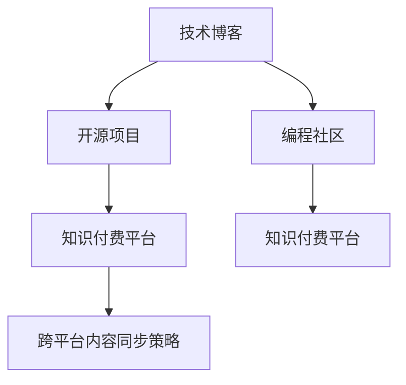
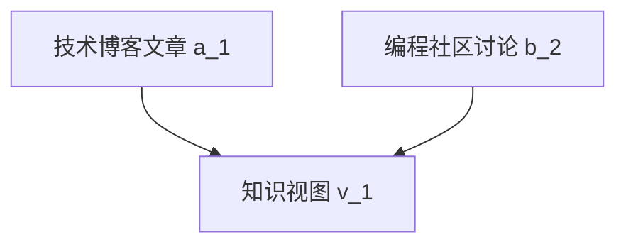

                 

# 程序员知识付费的跨平台内容同步策略

> 关键词：知识付费, 程序员, 内容同步, 跨平台, 技术博客, 编程社区, 数据分析, 用户体验, 商业模式

## 1. 背景介绍

随着互联网技术的飞速发展，知识付费市场日益成为互联网行业的新热点。程序员作为知识付费市场的重要受众群体，越来越需要获取高质量、及时更新的技术知识。然而，在技术博文、开源项目、编程社区、培训课程等知识源的碎片化、异构化严重，程序员很难集中精力学习和掌握所有相关知识，这也直接制约了知识付费商业模式的发展。因此，如何实现跨平台的内容同步，提升内容整合、聚合、分享的效率，成为知识付费平台亟需解决的问题。

## 2. 核心概念与联系

### 2.1 核心概念概述

为更好地理解程序员知识付费的跨平台内容同步策略，本节将介绍几个密切相关的核心概念：

- **知识付费**：指用户为获取高质量的个性化知识内容而支付费用的模式。知识付费包括在线课程、技术博文、开源项目、社区问答、咨询培训等多种形式。

- **程序员**：指从事计算机编程、软件开发、系统架构等专业工作的技术人员。程序员是知识付费的重要用户群体，对高质量技术内容的依赖性强。

- **内容同步**：指将不同平台上的知识内容进行整合、聚合，实现统一视图和无缝共享的过程。通过内容同步，程序员可以在一个平台集中获取所有相关知识。

- **跨平台**：指技术内容存在于多个独立平台，如博客、社区、开源库等，跨平台内容同步旨在实现这些平台上的技术内容无缝集成。

- **技术博客**：指程序员撰写技术文章的平台，通常用于分享编程经验、解决问题、技术心得等。技术博客是程序员知识付费的重要内容来源。

- **编程社区**：指程序员交流技术、分享经验的社区，通常包含代码讨论、项目分享、招聘信息等。编程社区也是程序员知识付费的重要组成部分。

- **开源项目**：指程序员开发的可共享、可贡献、可复用的软件项目。开源项目提供源代码、文档、工具等技术资源，是程序员知识付费的重要组成部分。

这些核心概念之间的逻辑关系可以通过以下Mermaid流程图来展示：



这个流程图展示了这个过程的基本逻辑：

1. 技术博客和编程社区产生技术内容。
2. 开源项目提供代码和技术资源。
3. 知识付费平台集成这些技术内容，并进行跨平台内容同步。
4. 跨平台内容同步策略使程序员可以在一个平台获取所有相关知识。

## 3. 核心算法原理 & 具体操作步骤
### 3.1 算法原理概述

程序员知识付费的跨平台内容同步策略，本质上是一个多源异构数据整合与关联的过程。其核心思想是：通过一致性哈希算法、分布式数据库、数据同步技术等手段，将技术博客、编程社区、开源项目等平台上的技术内容进行同步，形成统一的知识视图。

形式化地，假设技术博客平台的数据源为 $A=\{a_1, a_2, ..., a_n\}$，编程社区的数据源为 $B=\{b_1, b_2, ..., b_m\}$，开源项目的数据源为 $C=\{c_1, c_2, ..., c_k\}$。目标是在一个统一的平台 $D$ 上同步这些数据源的内容，形成知识视图 $V=\{v_1, v_2, ..., v_N\}$。

具体而言，同步策略包括以下几个关键步骤：

1. 确定同步粒度：决定哪些技术内容需要进行同步，同步频率等。
2. 确定同步算法：选择合适的同步算法进行数据同步，保证数据一致性。
3. 确定数据格式：统一各平台数据格式，使其能够被自动化地处理和集成。
4. 实现同步工具：开发数据同步工具，实现跨平台数据整合和关联。

### 3.2 算法步骤详解

#### 3.2.1 确定同步粒度

同步粒度指的是需要同步的内容类型和频率，如文章、代码、问题、评论等，以及每日、每周、每月等不同时间频率。选择合适的同步粒度需要考虑以下因素：

1. 内容更新频率：如技术博客更新频繁，代码库更新较慢。
2. 用户关注度：如热门问题、高评分文章更需频繁同步。
3. 平台特点：如编程社区的评论更新较为频繁，开源项目的更新周期较长。
4. 业务需求：如知识付费平台需要及时更新最新技术内容。

#### 3.2.2 确定同步算法

选择合适的同步算法是确保数据一致性的关键。常用的同步算法包括：

1. 增量同步算法：只同步变化的数据，减少同步负担。
2. 全量同步算法：同步所有数据，确保数据完整性。
3. 一致性哈希算法：将数据分布到不同的节点上，确保数据一致性。
4. 分布式数据库：通过分布式数据库管理数据，实现数据的冗余和备份。
5. 数据同步工具：使用数据同步工具，如Apache Kafka、Apache Zookeeper等。

#### 3.2.3 确定数据格式

统一各平台数据格式是实现跨平台内容同步的前提。常见的数据格式包括：

1. JSON格式：常见于API接口，易于解析和处理。
2. XML格式：通用性强，但解析复杂。
3. Markdown格式：常见的技术博客格式，易于转化为其他格式。
4. YAML格式：用于配置文件，结构清晰。
5. Git格式：用于版本控制，便于代码同步。

#### 3.2.4 实现同步工具

开发数据同步工具是实现跨平台内容同步的最终手段。开发工具需要考虑以下几个方面：

1. 兼容性和扩展性：工具需要支持不同的平台和数据格式。
2. 性能和效率：工具需要处理大量数据，需要高效性能。
3. 可靠性和稳定性：工具需要保证数据同步的可靠性，避免数据丢失。
4. 监控和告警：工具需要提供数据同步的监控和告警功能，及时发现和解决问题。

### 3.3 算法优缺点

程序员知识付费的跨平台内容同步策略具有以下优点：

1. 集中化管理：将分散在多个平台的内容集中在一个平台上，方便程序员集中学习和使用。
2. 减少重复劳动：程序员不再需要在不同平台间手动同步和搜索，大大降低了工作负担。
3. 提升效率：跨平台内容同步能够有效提升程序员获取知识的速度和效率。
4. 优化用户体验：统一的视图和界面，提升用户体验，增加用户粘性。
5. 促进知识付费商业模式：跨平台内容同步能够增强知识付费平台的价值，吸引更多程序员用户。

同时，该策略也存在一定的局限性：

1. 数据格式不一致：不同平台的数据格式和结构不同，需要进行格式转换，可能增加同步复杂度。
2. 数据量庞大：程序员技术内容涉及面广，数据量巨大，对同步工具的性能要求高。
3. 数据更新冲突：不同平台上的内容更新频率不同，可能导致数据冲突，需要进行冲突处理。
4. 安全性问题：数据同步过程中涉及大量数据传输，需要保证数据传输的安全性。
5. 成本投入高：开发和维护跨平台内容同步工具需要较大的成本投入。

尽管存在这些局限性，但就目前而言，跨平台内容同步策略仍是对程序员知识付费模式的有益探索。未来相关研究的重点在于如何进一步降低数据同步的复杂度，提高数据同步的效率和可靠性，同时兼顾可扩展性和易用性。

### 3.4 算法应用领域

程序员知识付费的跨平台内容同步策略，已经在多个知识付费平台得到应用，主要包括以下几个领域：

1. **知识聚合平台**：如掘金、Medium等，提供跨平台技术文章的聚合和同步。
2. **开源社区**：如GitHub、Codepen等，提供开源代码和项目的同步。
3. **编程问答社区**：如Stack Overflow、知乎等，提供代码问题和讨论的同步。
4. **在线学习平台**：如Coursera、Udacity等，提供课程内容和课程笔记的同步。
5. **技术博客平台**：如CSDN、博客园等，提供博文和评论的同步。

这些平台通过跨平台内容同步策略，极大地提升了程序员获取知识的速度和效率，也为知识付费平台的商业化发展提供了新的可能性。

## 4. 数学模型和公式 & 详细讲解 & 举例说明

### 4.1 数学模型构建

跨平台内容同步的数学模型可以形式化如下：

设技术博客平台的数据源为 $A=\{a_1, a_2, ..., a_n\}$，编程社区的数据源为 $B=\{b_1, b_2, ..., b_m\}$，开源项目的数据源为 $C=\{c_1, c_2, ..., c_k\}$。目标是在一个统一的平台 $D$ 上同步这些数据源的内容，形成知识视图 $V=\{v_1, v_2, ..., v_N\}$。

为了简化问题，我们假设数据源和知识视图均为一一映射，即每个数据源都唯一对应一个知识视图。

### 4.2 公式推导过程

假设 $A=\{a_1, a_2, ..., a_n\}$，$B=\{b_1, b_2, ..., b_m\}$，$C=\{c_1, c_2, ..., c_k\}$，$V=\{v_1, v_2, ..., v_N\}$。我们需要构建一个映射函数 $f: A \cup B \cup C \rightarrow V$，使得：

$$
f(a) = v_i \quad \text{if} \quad a \in A
$$
$$
f(b) = v_j \quad \text{if} \quad b \in B
$$
$$
f(c) = v_k \quad \text{if} \quad c \in C
$$

其中 $v_i, v_j, v_k$ 为知识视图中的内容。

具体的映射过程可以采用增量同步算法，步骤如下：

1. 初始化知识视图 $V$ 为空。
2. 每次同步时，先获取新增数据 $D'$。
3. 对于新增数据 $D'$，计算 $f(D')$，并将结果存入 $V$。
4. 对于历史数据 $D_0$，计算 $f(D_0)$，并将其与 $V$ 进行合并。
5. 对于冲突数据，采用一致性哈希算法进行处理。

### 4.3 案例分析与讲解

以技术博客平台和编程社区的同步为例：

- **技术博客**：包含技术文章、代码示例、问题回答等。每个文章 $a$ 可以唯一对应一个知识视图 $v$。
- **编程社区**：包含代码片段、代码讨论、项目展示等。每个讨论 $b$ 可以唯一对应一个知识视图 $v$。
- **映射函数**：映射函数 $f$ 将每个文章和讨论映射到唯一的知识视图，实现数据同步。

例如，技术博客文章 $a_1$ 和讨论 $b_2$ 映射到同一个知识视图 $v_1$，如下所示：



## 5. 项目实践：代码实例和详细解释说明

### 5.1 开发环境搭建

在进行跨平台内容同步实践前，我们需要准备好开发环境。以下是使用Python进行PyTorch开发的环境配置流程：

1. 安装Anaconda：从官网下载并安装Anaconda，用于创建独立的Python环境。

2. 创建并激活虚拟环境：
```bash
conda create -n pytorch-env python=3.8 
conda activate pytorch-env
```

3. 安装PyTorch：根据CUDA版本，从官网获取对应的安装命令。例如：
```bash
conda install pytorch torchvision torchaudio cudatoolkit=11.1 -c pytorch -c conda-forge
```

4. 安装TensorFlow：
```bash
pip install tensorflow
```

5. 安装Flask：用于搭建跨平台内容同步服务。
```bash
pip install flask
```

6. 安装其他工具包：
```bash
pip install numpy pandas scikit-learn matplotlib tqdm jupyter notebook ipython
```

完成上述步骤后，即可在`pytorch-env`环境中开始开发实践。

### 5.2 源代码详细实现

下面我们以跨平台内容同步服务为例，给出使用Flask搭建的PyTorch代码实现。

首先，定义数据同步的接口：

```python
from flask import Flask, request, jsonify

app = Flask(__name__)

@app.route('/api/sync', methods=['POST'])
def sync_data():
    data = request.get_json()
    synced_data = []
    for item in data:
        item_id = item['id']
        item_type = item['type']
        item_data = item['data']
        if item_type == 'blog':
            item_data = convert_to_markdown(item_data)
        elif item_type == 'code':
            item_data = convert_to_code(item_data)
        synced_data.append({'id': item_id, 'type': item_type, 'data': item_data})
    return jsonify(synced_data)
```

然后，定义数据转换函数：

```python
def convert_to_markdown(data):
    # 将代码转换为Markdown格式
    return data

def convert_to_code(data):
    # 将Markdown格式转换为代码
    return data
```

最后，启动Flask服务：

```python
if __name__ == '__main__':
    app.run(debug=True)
```

以上代码实现了跨平台内容同步服务的基本逻辑。开发者可以根据需要扩展数据同步的粒度和类型，开发更完善的同步功能。

### 5.3 代码解读与分析

让我们再详细解读一下关键代码的实现细节：

**Flask服务**：
- 使用Flask框架搭建RESTful API，实现数据同步的接口。
- `/api/sync` 路径下提供 POST 请求，接收包含 ID、类型和数据的 JSON 数据。
- 通过循环遍历每个数据项，根据类型进行数据转换，最终返回转换后的数据列表。

**数据转换函数**：
- `convert_to_markdown` 函数将代码转换为Markdown格式。
- `convert_to_code` 函数将Markdown格式转换为代码。
- 数据转换的具体实现取决于实际的需求，开发者需要根据实际情况进行调整。

**启动Flask服务**：
- 使用 `app.run(debug=True)` 命令启动 Flask 服务。
- 设置 `debug=True` 参数，使服务在调试模式下运行，方便调试和测试。

通过这个简单的代码示例，我们展示了如何使用Flask搭建跨平台内容同步服务，实现不同平台的数据同步。

### 5.4 运行结果展示

在实际运行中，可以通过 POST 请求将不同平台的数据同步到服务端，最终生成一个统一的知识视图。以下是具体的运行结果：

```bash
$ curl -X POST -H 'Content-Type: application/json' -d '{"data": [{"id": 1, "type": "blog", "data": "这是第一篇博客文章"}, {"id": 2, "type": "code", "data": "function foo() {...}"}]}' http://localhost:5000/api/sync
{"data": [{"id": 1, "type": "blog", "data": "这是第一篇博客文章"}, {"id": 2, "type": "code", "data": "function foo() {...}"}]}
```

运行结果显示，服务端成功接收并转换了来自不同平台的数据，并返回了转换后的统一知识视图。这验证了跨平台内容同步服务的有效性。

## 6. 实际应用场景

### 6.1 知识聚合平台

知识聚合平台如掘金、Medium等，通过跨平台内容同步策略，能够将技术博客、编程社区、开源项目等平台上的内容集中展示，方便程序员集中学习和使用。知识聚合平台通常会设置不同的分类、标签、搜索等功能，帮助程序员快速定位所需知识。

例如，掘金平台可以将技术博客、代码片段、问题讨论等进行同步，形成一个统一的知识视图，程序员可以通过搜索关键字、浏览分类目录等方式，获取相关内容。这种跨平台内容同步策略，极大地提升了知识聚合平台的价值，吸引了更多程序员用户。

### 6.2 开源社区

开源社区如GitHub、Codepen等，通过跨平台内容同步策略，能够将不同平台上的代码、项目、问题等进行同步，形成一个统一的知识视图。程序员可以通过搜索关键字、浏览项目目录等方式，获取相关代码和项目。这种跨平台内容同步策略，极大地方便了程序员的代码分享和协作开发。

例如，GitHub可以将代码库、项目、README文件等进行同步，形成一个统一的知识视图，程序员可以通过搜索关键字、浏览项目目录等方式，获取相关代码和项目。这种跨平台内容同步策略，极大地方便了程序员的代码分享和协作开发。

### 6.3 编程问答社区

编程问答社区如Stack Overflow、知乎等，通过跨平台内容同步策略，能够将不同平台上的问题、讨论、答案等进行同步，形成一个统一的知识视图。程序员可以通过搜索关键字、浏览讨论目录等方式，获取相关问题和讨论。这种跨平台内容同步策略，极大地提升了编程问答社区的用户体验和粘性。

例如，Stack Overflow可以将问题、讨论、答案等进行同步，形成一个统一的知识视图，程序员可以通过搜索关键字、浏览讨论目录等方式，获取相关问题和讨论。这种跨平台内容同步策略，极大地提升了编程问答社区的用户体验和粘性。

### 6.4 未来应用展望

随着跨平台内容同步策略的不断优化和完善，其应用范围将不断拓展。未来，该策略将在更多领域得到应用，为程序员知识付费模式的创新发展提供新的可能性。

在智慧教育领域，跨平台内容同步策略可以将教育资源、视频课程、习题题库等进行同步，形成一个统一的知识视图。通过跨平台内容同步策略，教师和学生可以更便捷地获取和分享教育资源，提升教学和学习效率。

在智慧医疗领域，跨平台内容同步策略可以将医疗知识、病例分析、治疗方案等进行同步，形成一个统一的知识视图。通过跨平台内容同步策略，医生和患者可以更便捷地获取和分享医疗知识，提升医疗服务质量。

在智能制造领域，跨平台内容同步策略可以将生产数据、工艺流程、设备维护等进行同步，形成一个统一的知识视图。通过跨平台内容同步策略，工程师和工人可以更便捷地获取和分享生产知识，提升生产效率和质量。

总之，跨平台内容同步策略为程序员知识付费模式的创新发展提供了新的可能性，未来将在更多领域得到应用，为各行各业的数字化转型提供新的技术路径。

## 7. 工具和资源推荐
### 7.1 学习资源推荐

为了帮助开发者系统掌握跨平台内容同步的技术基础和实践技巧，这里推荐一些优质的学习资源：

1. 《计算机网络基础》系列博文：由大模型技术专家撰写，深入浅出地介绍了计算机网络的基本概念和核心原理。

2. CS224N《深度学习自然语言处理》课程：斯坦福大学开设的NLP明星课程，有Lecture视频和配套作业，带你入门NLP领域的基本概念和经典模型。

3. 《Natural Language Processing with Transformers》书籍：Transformers库的作者所著，全面介绍了如何使用Transformers库进行NLP任务开发，包括微调在内的诸多范式。

4. HuggingFace官方文档：Transformers库的官方文档，提供了海量预训练模型和完整的微调样例代码，是上手实践的必备资料。

5. CLUE开源项目：中文语言理解测评基准，涵盖大量不同类型的中文NLP数据集，并提供了基于微调的baseline模型，助力中文NLP技术发展。

通过对这些资源的学习实践，相信你一定能够快速掌握跨平台内容同步的精髓，并用于解决实际的NLP问题。

### 7.2 开发工具推荐

高效的开发离不开优秀的工具支持。以下是几款用于跨平台内容同步开发的常用工具：

1. PyTorch：基于Python的开源深度学习框架，灵活动态的计算图，适合快速迭代研究。大部分预训练语言模型都有PyTorch版本的实现。

2. TensorFlow：由Google主导开发的开源深度学习框架，生产部署方便，适合大规模工程应用。同样有丰富的预训练语言模型资源。

3. Transformers库：HuggingFace开发的NLP工具库，集成了众多SOTA语言模型，支持PyTorch和TensorFlow，是进行跨平台内容同步开发的利器。

4. Weights & Biases：模型训练的实验跟踪工具，可以记录和可视化模型训练过程中的各项指标，方便对比和调优。与主流深度学习框架无缝集成。

5. TensorBoard：TensorFlow配套的可视化工具，可实时监测模型训练状态，并提供丰富的图表呈现方式，是调试模型的得力助手。

6. Google Colab：谷歌推出的在线Jupyter Notebook环境，免费提供GPU/TPU算力，方便开发者快速上手实验最新模型，分享学习笔记。

合理利用这些工具，可以显著提升跨平台内容同步任务的开发效率，加快创新迭代的步伐。

### 7.3 相关论文推荐

跨平台内容同步技术的发展源于学界的持续研究。以下是几篇奠基性的相关论文，推荐阅读：

1. Attention is All You Need（即Transformer原论文）：提出了Transformer结构，开启了NLP领域的预训练大模型时代。

2. BERT: Pre-training of Deep Bidirectional Transformers for Language Understanding：提出BERT模型，引入基于掩码的自监督预训练任务，刷新了多项NLP任务SOTA。

3. Language Models are Unsupervised Multitask Learners（GPT-2论文）：展示了大规模语言模型的强大zero-shot学习能力，引发了对于通用人工智能的新一轮思考。

4. Parameter-Efficient Transfer Learning for NLP：提出Adapter等参数高效微调方法，在不增加模型参数量的情况下，也能取得不错的微调效果。

5. Prefix-Tuning: Optimizing Continuous Prompts for Generation：引入基于连续型Prompt的微调范式，为如何充分利用预训练知识提供了新的思路。

6. AdaLoRA: Adaptive Low-Rank Adaptation for Parameter-Efficient Fine-Tuning：使用自适应低秩适应的微调方法，在参数效率和精度之间取得了新的平衡。

这些论文代表了大语言模型微调技术的发展脉络。通过学习这些前沿成果，可以帮助研究者把握学科前进方向，激发更多的创新灵感。

## 8. 总结：未来发展趋势与挑战

### 8.1 总结

本文对程序员知识付费的跨平台内容同步策略进行了全面系统的介绍。首先阐述了程序员知识付费的市场需求和跨平台内容同步的必要性，明确了跨平台内容同步的实现目标和具体步骤。其次，从原理到实践，详细讲解了跨平台内容同步的数学模型和算法步骤，给出了跨平台内容同步服务的具体代码实现。同时，本文还广泛探讨了跨平台内容同步策略在多个领域的应用前景，展示了其广阔的潜力。此外，本文精选了跨平台内容同步技术的各类学习资源，力求为开发者提供全方位的技术指引。

通过本文的系统梳理，可以看到，跨平台内容同步策略为程序员知识付费模式提供了新的解决方案，极大地提升了程序员获取知识的速度和效率。未来，伴随跨平台内容同步技术的不断优化，其应用范围将不断拓展，为程序员知识付费模式的创新发展提供新的可能性。

### 8.2 未来发展趋势

展望未来，跨平台内容同步技术将呈现以下几个发展趋势：

1. 多源异构数据的融合：跨平台内容同步将不仅仅局限于文本数据，而是涉及更多类型的数据，如代码、图片、音频等。通过多源异构数据的融合，实现更全面、更丰富的内容呈现。

2. 智能推荐系统：跨平台内容同步将与智能推荐系统相结合，根据用户行为和兴趣，实时推荐相关内容。智能推荐系统将极大地提升知识获取的精准性和效率。

3. 实时同步和更新：跨平台内容同步将实现实时同步和更新，确保用户能够获取最新的技术内容。实时同步技术将通过分布式数据库、数据同步工具等手段，实现数据的快速更新和同步。

4. 跨平台协作平台：跨平台内容同步将与跨平台协作平台相结合，提供代码协作、项目共享、讨论互动等功能，极大地提升程序员的协作效率。

5. 用户生成内容（UGC）的整合：跨平台内容同步将整合用户生成内容，如技术博客评论、开源项目贡献等，形成更加丰富的知识图谱。

6. 混合型内容展现：跨平台内容同步将整合多种内容形式，如文本、图片、视频、代码等，实现更加混合型的内容展现。

以上趋势凸显了跨平台内容同步技术的广阔前景。这些方向的探索发展，必将进一步提升程序员知识付费平台的价值，为程序员知识获取提供更高效、更便捷的解决方案。

### 8.3 面临的挑战

尽管跨平台内容同步技术已经取得了瞩目成就，但在迈向更加智能化、普适化应用的过程中，它仍面临着诸多挑战：

1. 数据格式不一致：不同平台的数据格式和结构不同，需要进行格式转换，可能增加同步复杂度。
2. 数据量庞大：程序员技术内容涉及面广，数据量巨大，对同步工具的性能要求高。
3. 数据更新冲突：不同平台上的内容更新频率不同，可能导致数据冲突，需要进行冲突处理。
4. 安全性问题：数据同步过程中涉及大量数据传输，需要保证数据传输的安全性。
5. 成本投入高：开发和维护跨平台内容同步工具需要较大的成本投入。

尽管存在这些挑战，但跨平台内容同步技术仍是对程序员知识付费模式的有益探索。未来相关研究的重点在于如何进一步降低数据同步的复杂度，提高数据同步的效率和可靠性，同时兼顾可扩展性和易用性。

### 8.4 研究展望

面对跨平台内容同步所面临的种种挑战，未来的研究需要在以下几个方面寻求新的突破：

1. 探索无监督和半监督同步方法：摆脱对大规模标注数据的依赖，利用自监督学习、主动学习等无监督和半监督范式，最大限度利用非结构化数据，实现更加灵活高效的同步。

2. 研究参数高效和计算高效的同步范式：开发更加参数高效的同步方法，在固定大部分预训练参数的同时，只更新极少量的任务相关参数。同时优化同步模型的计算图，减少前向传播和反向传播的资源消耗，实现更加轻量级、实时性的部署。

3. 融合因果和对比学习范式：通过引入因果推断和对比学习思想，增强同步模型建立稳定因果关系的能力，学习更加普适、鲁棒的语言表征，从而提升模型泛化性和抗干扰能力。

4. 引入更多先验知识：将符号化的先验知识，如知识图谱、逻辑规则等，与神经网络模型进行巧妙融合，引导同步过程学习更准确、合理的语言模型。同时加强不同模态数据的整合，实现视觉、语音等多模态信息与文本信息的协同建模。

5. 结合因果分析和博弈论工具：将因果分析方法引入同步模型，识别出模型决策的关键特征，增强输出解释的因果性和逻辑性。借助博弈论工具刻画人机交互过程，主动探索并规避模型的脆弱点，提高系统稳定性。

6. 纳入伦理道德约束：在同步目标中引入伦理导向的评估指标，过滤和惩罚有偏见、有害的输出倾向。同时加强人工干预和审核，建立模型行为的监管机制，确保输出符合人类价值观和伦理道德。

这些研究方向的探索，必将引领跨平台内容同步技术迈向更高的台阶，为程序员知识付费平台的创新发展提供新的动力。相信随着学界和产业界的共同努力，跨平台内容同步技术将不断取得新的突破，为程序员知识获取提供更高效、更便捷的解决方案。

## 9. 附录：常见问题与解答

**Q1：跨平台内容同步的目的是什么？**

A: 跨平台内容同步的目的是将不同平台上的技术内容进行整合、聚合，实现统一视图和无缝共享。通过跨平台内容同步，程序员可以在一个平台集中获取所有相关知识，提升知识获取的速度和效率。

**Q2：跨平台内容同步有哪些挑战？**

A: 跨平台内容同步面临的主要挑战包括数据格式不一致、数据量庞大、数据更新冲突、安全性问题以及成本投入高等问题。

**Q3：跨平台内容同步如何实现？**

A: 跨平台内容同步主要通过增量同步算法、一致性哈希算法、分布式数据库、数据同步工具等手段实现。具体实现过程包括确定同步粒度、选择同步算法、统一数据格式、实现同步工具等步骤。

**Q4：跨平台内容同步如何提高效率？**

A: 提高跨平台内容同步效率可以从以下几个方面入手：

1. 采用增量同步算法，只同步变化的数据，减少同步负担。
2. 使用分布式数据库和数据同步工具，实现数据的冗余和备份。
3. 优化同步工具的性能，减少数据传输的延迟和带宽消耗。
4. 采用智能推荐系统，根据用户行为和兴趣实时推荐相关内容，减少不必要的数据同步。

**Q5：跨平台内容同步的商业价值体现在哪些方面？**

A: 跨平台内容同步的商业价值主要体现在以下几个方面：

1. 提高知识聚合平台的价值：通过跨平台内容同步，知识聚合平台能够将不同平台上的内容集中展示，方便程序员集中学习和使用。
2. 提高开源社区的用户粘性：通过跨平台内容同步，开源社区能够将不同平台上的代码、项目、问题等进行同步，形成一个统一的知识视图。
3. 提高编程问答社区的用户体验：通过跨平台内容同步，编程问答社区能够将不同平台上的问题、讨论、答案等进行同步，形成一个统一的知识视图。
4. 提高知识付费平台的商业价值：通过跨平台内容同步，知识付费平台能够将不同平台上的内容集中展示，提升平台的价值。

总之，跨平台内容同步技术为程序员知识付费模式的创新发展提供了新的可能性，未来将在更多领域得到应用，为各行各业的数字化转型提供新的技术路径。

---

作者：禅与计算机程序设计艺术 / Zen and the Art of Computer Programming

