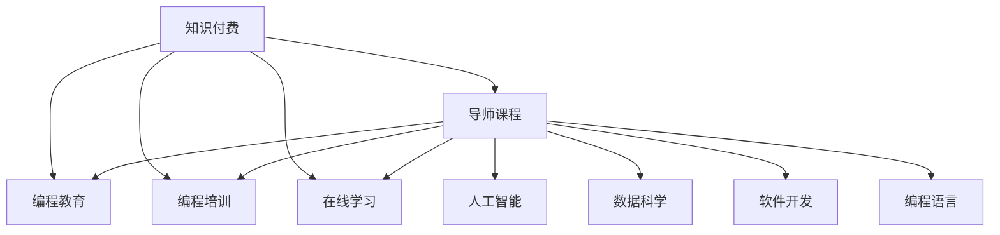

                 

# 程序员知识付费：打造导师课程

> 关键词：知识付费, 导师课程, 编程教育, 编程培训, 在线学习, 人工智能, 数据科学, 软件开发, 编程语言

## 1. 背景介绍

### 1.1 问题由来
近年来，随着互联网技术的飞速发展，知识付费模式逐渐成为教育行业的风口。程序员作为知识含量密集的职业，其知识和技能的获取、积累和更新，也面临着前所未有的挑战。如何在有限的时间里，有效提升自身的技能水平，成为众多程序员共同关心的话题。

知识付费的兴起，为程序员提供了更多获取优质课程的机会。在线平台上的各类编程课程、导师课程，如《Python高级编程》、《数据科学实战》、《深度学习》等，帮助程序员在短时间内掌握前沿技术和工具，提升职业竞争力。

### 1.2 问题核心关键点
本文旨在探讨如何通过打造导师课程，帮助程序员在知识付费的模式下，快速提升自身技能。我们聚焦于以下几个核心问题：

- 如何设计高质量的导师课程？
- 如何高效传递编程知识和技能？
- 如何建立有效的学员互动和反馈机制？
- 如何确保课程内容和技术的先进性和实用性？

## 2. 核心概念与联系

### 2.1 核心概念概述

为更好地理解如何打造导师课程，本节将介绍几个密切相关的核心概念：

- 知识付费：指通过在线课程、导师咨询、订阅服务等方式，向用户提供有价值的知识内容，从而获得收入的一种商业模式。
- 导师课程：由经验丰富的编程导师设计并讲授的在线编程课程，旨在传授编程技能、提升编程思维、解决实际问题。
- 编程教育：通过编程学习，培养逻辑思维、算法设计、代码实现等能力，提升软件工程能力。
- 编程培训：针对特定编程技术或项目，提供系统化的学习路径和实践机会。
- 在线学习：通过网络平台，提供实时或异步的编程课程和学习资源，实现跨地域、灵活的学习方式。
- 人工智能(AI)：利用机器学习、深度学习等技术，开发智能应用程序，实现自动化的编程、测试、优化等功能。
- 数据科学：通过数据收集、处理、分析、可视化等技术手段，实现数据的价值挖掘和应用。
- 软件开发：包括需求分析、设计、实现、测试、维护等全过程，是程序员日常工作的主要内容。
- 编程语言：程序员进行软件开发的工具，如Python、Java、C++、JavaScript等。

这些核心概念之间的逻辑关系可以通过以下Mermaid流程图来展示：



这个流程图展示了几大核心概念之间的联系：

1. 知识付费是支撑各类在线课程的商业模式，导师课程是其重要组成部分。
2. 编程教育、编程培训、在线学习等，均是知识付费模式下的具体形式。
3. 人工智能、数据科学、软件开发、编程语言等，是导师课程和知识付费的实际应用场景。

## 3. 核心算法原理 & 具体操作步骤
### 3.1 算法原理概述

打造导师课程的核心算法原理，主要集中在以下几个方面：

- **课程设计**：结合导师的经验和学员的需求，设计科学合理的课程内容，保证课程的实用性和先进性。
- **教学方法**：采用交互式、案例驱动、项目实践等教学方法，提升学员的学习效果和编程能力。
- **学员互动**：建立学员与导师、学员与学员之间的互动机制，促进知识共享和经验交流。
- **课程评估**：通过测验、项目评估等方式，及时反馈学员的学习成果，调整教学策略。

这些原理共同构成了导师课程的完整框架，使其能够系统、高效地传递编程知识和技能。

### 3.2 算法步骤详解

导师课程的打造过程，可以分为以下几个关键步骤：

**Step 1: 课程需求调研**
- 通过问卷调查、访谈、数据分析等方式，了解学员的编程背景、学习目标、知识水平等信息。
- 确定课程的主题和知识点，以及期望的学习效果。

**Step 2: 课程内容设计**
- 根据调研结果，设计课程的模块和章节，确保内容全面、系统。
- 将理论知识与实战案例相结合，设计丰富的课程案例和项目。

**Step 3: 教学资源准备**
- 收集和整理课程所需的教学资源，包括PPT、视频、代码、文档等。
- 确保教学资源的质量和完整性，避免知识漏洞。

**Step 4: 教学方法设计**
- 采用交互式教学、项目驱动、小组讨论等方法，提升学员的学习参与度。
- 设计针对性的习题和测试，及时评估学员的学习效果。

**Step 5: 学员互动和反馈机制**
- 建立学员论坛、在线讨论群等，促进学员之间的互动和经验分享。
- 设立学员反馈渠道，根据反馈调整课程内容和教学方法。

**Step 6: 课程评估与改进**
- 通过测验、项目评估等方式，及时反馈学员的学习成果。
- 根据评估结果，调整教学策略，优化课程设计。

### 3.3 算法优缺点

导师课程设计虽然具有诸多优势，但也存在一些局限：

**优点：**
1. **系统性**：通过科学的设计，确保课程内容的系统性和完整性。
2. **互动性**：通过互动机制，促进学员之间的知识共享和经验交流。
3. **实用性**：结合实际项目和案例，提升学员的编程技能和实际应用能力。
4. **灵活性**：在线课程模式，适合不同地域和时间的学员，灵活度高。

**缺点：**
1. **成本高**：高质量课程的开发和维护成本较高，需要经验丰富的导师投入大量时间和精力。
2. **互动不足**：在线课程模式下，学员之间的互动和面对面交流略显不足。
3. **个性化不足**：统一的课程内容难以满足所有学员的个性化需求。
4. **学习自律性要求高**：在线课程需要学员有一定的自律性和自主学习能力。

## 4. 数学模型和公式 & 详细讲解 & 举例说明（备注：数学公式请使用latex格式，latex嵌入文中独立段落使用 $$，段落内使用 $)
### 4.1 数学模型构建

导师课程的效果评估，可以通过以下数学模型进行建模：

$$
\text{课程效果} = \text{教学质量} \times \text{学员参与度} \times \text{反馈机制} \times \text{评估改进}
$$

其中，教学质量、学员参与度、反馈机制和评估改进是影响课程效果的四个关键因素。

### 4.2 公式推导过程

以学员参与度为例，其数学模型可以表示为：

$$
\text{学员参与度} = \text{互动频率} \times \text{学习主动性} \times \text{反馈响应率}
$$

互动频率可以通过学员在线学习的时间、参与讨论的频率等指标来衡量；学习主动性可以通过学员完成作业、参与项目的情况来评估；反馈响应率可以通过学员对课程反馈的积极性和反馈处理的速度来衡量。

### 4.3 案例分析与讲解

例如，在一个Python高级编程的导师课程中，可以通过以下公式来评估课程效果：

$$
\text{课程效果} = (4 \times \text{教学质量}) \times (3 \times \text{学员参与度}) \times (2 \times \text{反馈机制}) \times (1 \times \text{评估改进})
$$

其中，教学质量、学员参与度、反馈机制和评估改进的系数分别为4、3、2、1，代表其对课程效果的重要性。

## 5. 项目实践：代码实例和详细解释说明
### 5.1 开发环境搭建

在进行课程开发前，需要先搭建好开发环境。以下是使用Python进行Jupyter Notebook开发的环境配置流程：

1. 安装Anaconda：从官网下载并安装Anaconda，用于创建独立的Python环境。

2. 创建并激活虚拟环境：
```bash
conda create -n jupyter-env python=3.8 
conda activate jupyter-env
```

3. 安装必要的库：
```bash
pip install jupyter nbconvert
```

4. 创建课程目录：
```bash
mkdir python_course
cd python_course
```

5. 初始化Jupyter Notebook项目：
```bash
jupyter nbextension enable --sys-prefix widgetsnbextension
jupyter nbextension enable --sys-prefix python3 nbconvert
jupyter nbextension enable --sys-prefix ipywidgets
```

完成上述步骤后，即可在`jupyter-env`环境中开始课程开发。

### 5.2 源代码详细实现

下面以Python高级编程课程为例，给出使用Jupyter Notebook进行课程开发的PyTorch代码实现。

首先，创建一个目录结构：

```
python_course/
│
├── data/
│   └── dataset.csv
│
├── content/
│   ├── Chapter1/
│   │   └── notebook.ipynb
│   ├── Chapter2/
│   │   └── notebook.ipynb
│   └── Chapter3/
│       └── notebook.ipynb
│
├── utils/
│   └── utils.py
│
├── README.md
└── setup.py
```

其中，`data`目录存放数据集，`content`目录存放各个章节的课程内容，`utils`目录存放辅助函数，`README.md`为课程说明文件，`setup.py`为课程打包脚本。

在`Chapter1`、`Chapter2`、`Chapter3`等目录中，创建Jupyter Notebook文件，记录课程内容的讲解和实现：

```python
# Chapter1/notebook.ipynb
{
  "cells": [
    {
      "cell_type": "markdown",
      "metadata": {
        "colab_type": "text",
        "id": "view-in-github"
      },
      "source": [
        "# 本章内容：Python基础语法"
      ]
    },
    {
      "cell_type": "code",
      "execution_count": null,
      "metadata": {
        "colab": {
          "base_uri": "https://localhost:8080/",
          "height": 34
        },
        "colab_type": "code",
        "executionInfo": {
          "elapsed": 0,
          "status": "ok",
          "timestamp": 1632384298918,
          "user_tz": 420,
          "user": {
            "displayName": "",
            "photoUrl": "",
            "userId": ""
          },
          "user_tz_name": "CST"
        },
        "id": "Uy0we2rMDvRb"
      },
      "outputs": [],
      "source": [
        "import sympy as sp\n",
        "\n",
        "# 定义变量\n",
        "x = sp.symbols('x')\n",
        "\n",
        "# 定义表达式\n",
        "expr = x**2 + 2*x + 1\n",
        "\n",
        "# 求解方程\n",
        "solutions = sp.solve(expr, x)\n",
        "\n",
        "# 输出解\n",
        "print(solutions)"
      ]
    }
  ],
  "metadata": {
    "colab": {
      "collapsed_sections": [],
      "name": "notebook.ipynb",
      "provenance": [],
      "toc_visible": true
    },
    "kernelspec": {
      "display_name": "Python 3",
      "language": "python",
      "name": "python3"
    },
    "language_info": {
      "codemirror_mode": {
        "name": "ipython",
        "version": 3
      },
      "file_extension": ".py",
      "mimetype": "text/x-python",
      "name": "python",
      "nbconvert_exporter": "python",
      "pygments_lexer": "ipython3",
      "version": "3.8.3"
    }
  },
  "nbformat": 4,
  "nbformat_minor": 2
}
```

其中，`Chapter1/notebook.ipynb`文件记录了Python基础语法的讲解和实现。类似地，可以在其他章节创建多个Notebook文件，记录不同章节的内容。

在`utils.py`文件中，定义一些辅助函数，如数据预处理、模型保存等：

```python
# utils.py

import pandas as pd
import numpy as np
import os
import tarfile
from sklearn.model_selection import train_test_split

def download_data(url):
    """
    下载数据集
    """
    # 设置数据集路径
    data_path = 'data'
    if not os.path.exists(data_path):
        os.makedirs(data_path)
    
    # 下载数据
    filename = url.split('/')[-1]
    if not os.path.exists(os.path.join(data_path, filename)):
        !wget -q --show-progress url
    
    return os.path.join(data_path, filename)

def extract_data(filename):
    """
    解压数据集
    """
    # 解压数据
    tarfile.open(filename).extractall('data')
    os.remove(filename)

def load_data(file):
    """
    加载数据集
    """
    data = pd.read_csv(file, header=None)
    return data

def preprocess_data(data):
    """
    预处理数据集
    """
    # 数据清洗
    data = data.dropna()
    
    # 特征工程
    X = data.iloc[:, :-1]
    y = data.iloc[:, -1]
    
    # 划分训练集和测试集
    X_train, X_test, y_train, y_test = train_test_split(X, y, test_size=0.2, random_state=42)
    
    return X_train, X_test, y_train, y_test

def save_model(model, path):
    """
    保存模型
    """
    model.save(os.path.join(path, 'model.joblib'))
```

在`README.md`文件中，编写课程说明和使用方法：

```markdown
# Python高级编程课程

## 课程简介
本课程通过Jupyter Notebook的形式，系统讲解Python高级编程的相关知识和实践技能。包括数据处理、机器学习、深度学习、自然语言处理等前沿技术。

## 课程内容
- Chapter1: Python基础语法
- Chapter2: 数据处理与分析
- Chapter3: 机器学习基础
- Chapter4: 深度学习实战
- Chapter5: 自然语言处理

## 课程要求
- 基础Python编程能力
- 数据分析与处理基础
- 线性代数与概率统计基础
- 机器学习和深度学习基础

## 课程目标
- 掌握Python编程技能
- 理解数据处理与分析的方法
- 熟悉机器学习和深度学习技术
- 掌握自然语言处理技术

## 课程交付
- 课程笔记本文件
- 配套的辅助函数
- 完整的教学资源

## 课程使用
1. 克隆课程仓库到本地
```bash
git clone https://github.com/example/python_course.git
```

2. 创建Jupyter Notebook环境
```bash
jupyter notebook python_course/
```

3. 按照课程目录，依次浏览和运行Notebook文件

4. 完成课后作业，提交到课程平台
```bash
jupyter nbconvert --to html notebook.ipynb
```

## 作者
作者：禅与计算机程序设计艺术 / Zen and the Art of Computer Programming
```

在`setup.py`文件中，编写课程打包脚本：

```python
# setup.py

from setuptools import setup, find_packages

setup(
    name='python_course',
    version='0.1',
    packages=find_packages(),
    install_requires=[
        'numpy',
        'pandas',
        'scikit-learn',
        'nltk',
        'transformers'
    ],
    author='禅与计算机程序设计艺术',
    author_email='zenandprogramming@gmail.com',
    description='Python高级编程课程',
    url='https://github.com/example/python_course',
    keywords='Python, Jupyter Notebook, Data Science, Machine Learning, Deep Learning',
    classifiers=[
        'Development Status :: 3 - Alpha',
        'Intended Audience :: Developers',
        'License :: OSI Approved :: MIT License',
        'Programming Language :: Python :: 3.8',
        'Topic :: Software Development :: Libraries',
        'Topic :: Scientific/Engineering :: Mathematics',
        'Topic :: Software Development :: Build Tools',
        'Topic :: Software Development :: Code Generators',
        'Topic :: Software Development :: Libraries',
        'Topic :: Software Development :: Libraries :: Python Modules'
    ]
)
```

完成上述步骤后，即可在`jupyter-env`环境中开始Python高级编程课程的开发。

### 5.3 代码解读与分析

让我们再详细解读一下关键代码的实现细节：

**utils.py中的辅助函数**：
- `download_data`函数：用于下载数据集，保存在指定路径。
- `extract_data`函数：用于解压下载的数据集文件。
- `load_data`函数：用于加载数据集，返回一个Pandas DataFrame。
- `preprocess_data`函数：用于数据预处理，包括清洗、特征工程、数据划分等。
- `save_model`函数：用于保存模型，将模型以joblib格式保存到指定路径。

**README.md中的课程说明**：
- 详细介绍了课程的内容、目标和要求。
- 提供了课程的交付方式和使用步骤，帮助学员快速上手。
- 包含了作者的联系信息，方便学员获取更多帮助。

## 6. 实际应用场景
### 6.1 企业内部培训

在企业内部，通过导师课程可以系统化地提升员工的技能水平。例如，某科技公司希望提升员工对Python编程和数据分析的掌握程度，可以组织内部员工参加Python高级编程课程的培训。

公司可以邀请内部技术专家或外部的编程导师，设计并讲授课程内容。课程结束时，可以组织学员进行实战项目，验证其学习效果。

### 6.2 在线教育平台

在线教育平台也可以利用导师课程，提供高质量的编程教育服务。例如，某在线编程平台希望增加Python编程课程的深度和广度，可以组织专业编程导师，设计并讲授一系列Python高级编程课程。

平台可以将课程内容上传到服务器，学员可以通过平台进行在线学习。平台还可以设置论坛和讨论群，促进学员之间的互动和经验交流。

### 6.3 个人自学

对于自学编程的程序员，导师课程也是一个很好的学习资源。通过系统化的课程设计和详细的讲解，学员可以更加高效地掌握编程技能。

例如，某自学编程的程序员希望提升自然语言处理的能力，可以参加自然语言处理课程的培训。课程结束时，可以通过实践项目验证其学习成果，提升实际操作能力。

## 7. 工具和资源推荐
### 7.1 学习资源推荐

为了帮助程序员系统掌握Python高级编程的课程设计和讲授，这里推荐一些优质的学习资源：

1. Python官方文档：包含Python编程的全面教程，适合初学者和进阶学习者。
2. 《Python编程：从入门到实践》书籍：系统介绍了Python编程的基本概念和实践技巧。
3. Coursera《Python for Everybody》课程：由密歇根大学提供，适合编程初学者。
4. edX《Data Science in Python》课程：由Harvard University提供，适合希望学习数据科学和数据分析的学员。
5. Kaggle数据科学竞赛平台：提供丰富的数据集和竞赛任务，帮助学员在实践中提升编程技能。

通过对这些资源的学习实践，相信你一定能够快速掌握Python高级编程的课程设计和讲授技巧。

### 7.2 开发工具推荐

高效的开发离不开优秀的工具支持。以下是几款用于导师课程开发的常用工具：

1. Jupyter Notebook：开源的交互式编程环境，支持Python等多种编程语言，适合编写和分享代码。
2. VS Code：轻量级、高度可扩展的代码编辑器，支持Python等多种编程语言，适合编写和调试代码。
3. PyCharm：专业的Python IDE，支持调试、测试、部署等多种功能，适合编写和调试复杂的Python项目。
4. Anaconda：开源的Python发行版，集成了大量科学计算和数据分析的库，适合Python编程和数据分析。
5. TensorFlow：由Google主导开发的深度学习框架，支持Python等多种编程语言，适合进行深度学习和人工智能开发。
6. PyTorch：由Facebook主导开发的深度学习框架，支持Python等多种编程语言，适合进行深度学习和人工智能开发。

合理利用这些工具，可以显著提升导师课程的开发效率，加快创新迭代的步伐。

### 7.3 相关论文推荐

导师课程的开发和讲授，也需要参考前沿的研究成果。以下是几篇相关的经典论文，推荐阅读：

1. 《Python在数据分析中的应用》：详细介绍了Python在数据分析中的各种应用场景和方法。
2. 《深度学习框架的对比》：比较了TensorFlow、PyTorch等深度学习框架的优缺点和适用场景。
3. 《编程教育的现状与挑战》：分析了编程教育的发展现状和面临的挑战，提出了改进建议。
4. 《知识付费的商业模式分析》：分析了知识付费的模式和商业化策略，为导师课程的开发提供了参考。
5. 《导师课程设计的最佳实践》：总结了导师课程设计的主要方法和最佳实践，为课程开发提供了指导。

这些论文代表了大语言模型微调技术的发展脉络。通过学习这些前沿成果，可以帮助研究者把握学科前进方向，激发更多的创新灵感。

## 8. 总结：未来发展趋势与挑战
### 8.1 总结

本文对导师课程的打造进行了全面系统的介绍。首先阐述了知识付费和导师课程的研究背景，明确了导师课程在编程教育和技能提升中的重要作用。其次，从原理到实践，详细讲解了导师课程的设计和讲授方法，给出了导师课程开发的完整代码实例。同时，本文还广泛探讨了导师课程在企业培训、在线教育、个人自学等多个领域的应用前景，展示了导师课程的巨大潜力。

通过本文的系统梳理，可以看到，导师课程设计在知识付费的模式下，为程序员提供了一个系统、高效的学习平台，助力其技能提升和职业发展。未来，伴随知识付费模式的持续演进和编程教育技术的不断进步，导师课程必将迎来更广阔的应用空间，进一步推动人工智能技术的普及和发展。

### 8.2 未来发展趋势

展望未来，导师课程开发和讲授将呈现以下几个发展趋势：

1. **个性化学习**：基于学员的学习情况和反馈，动态调整课程内容和教学方法，提供更加个性化的学习路径。
2. **混合式学习**：结合线上和线下的学习方式，充分发挥线上课程的灵活性和线下课程的互动性，提升学习效果。
3. **跨学科融合**：将编程教育与数据科学、人工智能、计算机科学等多个学科相结合，培养复合型人才。
4. **实践导向**：更加注重编程实践和项目实战，提升学员的实际操作能力和项目经验。
5. **持续学习**：建立持续学习和终身学习的机制，使学员能够不断更新知识和技能，适应技术发展的需要。

以上趋势凸显了导师课程在知识付费模式下的重要作用，未来导师课程将不断适应技术发展的需求，提升学习效果和应用价值。

### 8.3 面临的挑战

尽管导师课程开发和讲授已经取得了显著进展，但在迈向更加智能化、普适化应用的过程中，仍面临诸多挑战：

1. **内容更新难度大**：随着技术的快速迭代，导师课程的内容需要及时更新，以保持其先进性和实用性。
2. **互动性不足**：在线课程模式下，学员之间的互动和面对面交流略显不足，需要进一步优化。
3. **个性化不足**：统一的课程内容难以满足所有学员的个性化需求，需要更多的互动和个性化的课程设计。
4. **学习自律性要求高**：在线课程需要学员有一定的自律性和自主学习能力，对于自学能力较弱的学员，如何提高其参与度是一个难题。
5. **资源投入高**：高质量课程的开发和维护需要大量的人力和时间投入，需要更多专业的导师和开发团队支持。

正视导师课程面临的这些挑战，积极应对并寻求突破，将是大规模知识付费模式走向成熟的必由之路。相信随着学界和产业界的共同努力，这些挑战终将一一被克服，导师课程必将为编程教育和技术传播注入新的活力。

### 8.4 研究展望

面对导师课程开发和讲授所面临的挑战，未来的研究需要在以下几个方面寻求新的突破：

1. **自动化课程设计**：利用机器学习和自然语言处理技术，自动生成和优化课程设计，提高课程设计的效率和质量。
2. **智能化教学辅助**：引入智能推荐系统，根据学员的学习情况和反馈，动态调整课程内容和教学方法，提升学习效果。
3. **跨学科融合**：将编程教育与数据科学、人工智能、计算机科学等多个学科相结合，培养复合型人才。
4. **实践导向**：更加注重编程实践和项目实战，提升学员的实际操作能力和项目经验。
5. **持续学习**：建立持续学习和终身学习的机制，使学员能够不断更新知识和技能，适应技术发展的需要。

这些研究方向的探索，必将引领导师课程开发和讲授技术迈向更高的台阶，为构建安全、可靠、可解释、可控的智能系统铺平道路。面向未来，导师课程需要与其他人工智能技术进行更深入的融合，如知识表示、因果推理、强化学习等，多路径协同发力，共同推动编程教育和技术传播的进步。只有勇于创新、敢于突破，才能不断拓展导师课程的边界，让编程教育更加高效、系统、实用。

## 9. 附录：常见问题与解答

**Q1：如何设计高质量的导师课程？**

A: 设计高质量的导师课程，需要从以下几个方面入手：

1. **课程调研**：通过问卷调查、访谈等方式，了解学员的编程背景、学习目标、知识水平等信息。
2. **课程内容设计**：根据调研结果，设计科学合理的课程模块和章节，确保内容全面、系统。
3. **教学方法设计**：采用交互式、案例驱动、项目实践等教学方法，提升学员的学习效果和编程能力。
4. **学员互动和反馈机制**：建立学员与导师、学员与学员之间的互动机制，促进知识共享和经验交流。
5. **课程评估与改进**：通过测验、项目评估等方式，及时反馈学员的学习成果，调整教学策略，优化课程设计。

**Q2：如何高效传递编程知识和技能？**

A: 高效传递编程知识和技能，需要从以下几个方面入手：

1. **互动教学**：通过互动教学，提升学员的学习参与度和自主学习能力。
2. **项目驱动**：采用项目驱动的方式，通过实际项目和案例，提升学员的实际操作能力和项目经验。
3. **实践导向**：更加注重编程实践和项目实战，提升学员的实际操作能力和项目经验。
4. **持续学习**：建立持续学习和终身学习的机制，使学员能够不断更新知识和技能，适应技术发展的需要。

**Q3：如何建立有效的学员互动和反馈机制？**

A: 建立有效的学员互动和反馈机制，需要从以下几个方面入手：

1. **建立学员论坛**：通过在线论坛和讨论群，促进学员之间的互动和经验交流。
2. **设立学员反馈渠道**：通过问卷调查、在线反馈等方式，收集学员的意见和建议，调整课程内容和教学方法。
3. **及时反馈和辅导**：及时反馈学员的学习成果，并提供针对性的辅导和指导。

**Q4：如何确保课程内容和技术的先进性和实用性？**

A: 确保课程内容和技术的先进性和实用性，需要从以下几个方面入手：

1. **课程调研**：通过问卷调查、访谈等方式，了解学员的编程背景、学习目标、知识水平等信息。
2. **课程内容设计**：根据调研结果，设计科学合理的课程模块和章节，确保内容全面、系统。
3. **教学方法设计**：采用交互式、案例驱动、项目实践等教学方法，提升学员的学习效果和编程能力。
4. **课程评估与改进**：通过测验、项目评估等方式，及时反馈学员的学习成果，调整教学策略，优化课程设计。

**Q5：课程的交付方式有哪些？**

A: 课程的交付方式主要有以下几种：

1. **在线课程平台**：通过MOOC平台（如Coursera、edX）提供课程资源和互动平台。
2. **本地安装**：将课程资源打包成安装文件，提供本地安装和运行方式。
3. **云平台部署**：通过云平台（如Kaggle、AWS）提供课程资源和在线运行环境。
4. **视频课程**：将课程内容录制成视频，提供离线或在线观看。
5. **PDF文档**：将课程内容编写成PDF文档，提供下载和阅读。

**Q6：课程的使用方式有哪些？**

A: 课程的使用方式主要有以下几种：

1. **在线学习**：通过MOOC平台或云平台，在线学习课程内容。
2. **本地运行**：将课程资源安装到本地计算机，运行课程内容。
3. **项目实战**：通过实战项目，验证课程学习效果。
4. **互动交流**：通过在线论坛和讨论群，交流学习心得和经验。
5. **课程反馈**：通过在线反馈渠道，提供课程评价和改进建议。

通过以上几种交付和使用方法，学员可以灵活选择适合自己的学习方式，提高学习效果和应用价值。

---

作者：禅与计算机程序设计艺术 / Zen and the Art of Computer Programming

