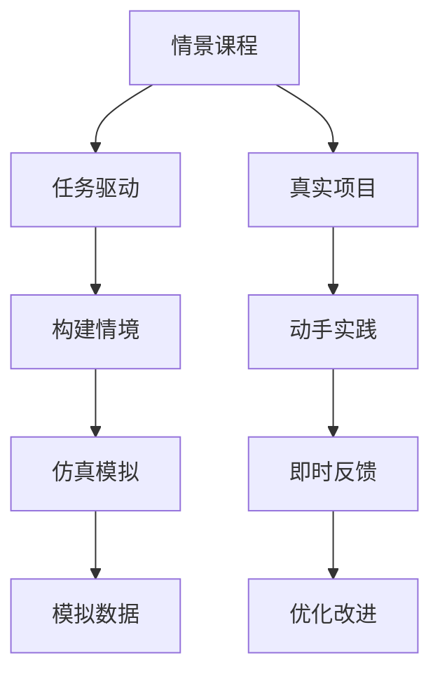

                 

# 程序员知识付费：打造情景课程

## 1. 背景介绍

随着知识付费行业的兴起，越来越多的程序员开始关注如何通过线上学习平台获取专业知识。传统的培训方式往往缺乏互动性、实践性，难以满足现代程序员的学习需求。情景课程作为一种新兴的学习方式，通过构建真实的工作场景，引导学员在情境中学习和思考，有效提升知识掌握和问题解决能力。本文将深入探讨情景课程的设计原则、实现方法及其在程序员知识付费领域的应用。

## 2. 核心概念与联系

### 2.1 核心概念概述

情景课程是指通过构建模拟的或真实的任务环境，让学员在解决实际问题中学习和掌握知识的一种课程形式。其核心理念是“做中学”(learning by doing)，强调在实际操作中获取反馈，从而深化理解和技能。

与传统的线性课程相比，情景课程具有以下特点：
- **情境性**：课程内容紧密贴合实际工作场景，学习目标明确。
- **互动性**：注重师生互动、同伴互动，增强学习参与度。
- **实践性**：通过项目实战，提供丰富的动手练习机会。
- **迭代性**：学习过程持续迭代，学员可以反复练习和优化解决方案。

### 2.2 核心概念原理和架构的 Mermaid 流程图



**节点说明**：
- `A`：情景课程
- `B`：任务驱动
- `C`：真实项目
- `D`：构建情境
- `E`：动手实践
- `F`：仿真模拟
- `G`：即时反馈
- `H`：模拟数据
- `I`：优化改进

**节点关系**：
- `A`通过`B`（任务驱动）引导学员学习。
- `C`（真实项目）和`D`（构建情境）共同构成课程内容。
- `E`（动手实践）和`F`（仿真模拟）提供实践和练习的机会。
- `G`（即时反馈）和`H`（模拟数据）帮助学员及时调整学习策略和解决方案。
- `I`（优化改进）使得学习过程持续迭代，深化学习效果。

## 3. 核心算法原理 & 具体操作步骤

### 3.1 算法原理概述

情景课程的设计和实现主要涉及以下算法原理：
- **任务分解与设计**：将复杂任务分解为若干子任务，设计成课程内容。
- **情境构建**：根据实际工作环境，构建模拟或真实情境。
- **项目实战**：设计实战项目，提供实际问题的解决机会。
- **即时反馈**：通过自动或手动方式提供及时反馈，帮助学员调整策略。
- **持续优化**：鼓励学员在解决实际问题中不断优化和改进解决方案。

### 3.2 算法步骤详解

**Step 1: 任务分解与设计**

1. 确定课程目标：明确课程希望学员掌握的知识和技能。
2. 分析任务要求：将复杂任务分解为若干子任务，分析每个子任务的具体要求。
3. 设计任务场景：根据子任务要求，设计相应的情境和问题，形成课程大纲。

**Step 2: 情境构建**

1. 调研工作环境：了解目标工作场景的业务流程、工具和技术栈。
2. 设计情境模拟：根据工作环境设计模拟或真实情境，为学员提供实际操作空间。
3. 提供实践资源：准备必要的工具、数据和文档，支持学员进行实践。

**Step 3: 项目实战**

1. 设计实战项目：选择合适的项目，设计具体任务和目标。
2. 提供实战指导：在实战过程中提供必要的指导和资源，帮助学员解决问题。
3. 组织实践活动：通过线上或线下的方式，组织学员进行项目实践。

**Step 4: 即时反馈**

1. 设计反馈机制：选择适当的反馈方式，如即时评估、同伴评审等。
2. 提供反馈信息：根据实践情况提供及时、具体的反馈信息，帮助学员改进。
3. 调整学习策略：根据反馈信息，帮助学员调整学习策略和方法。

**Step 5: 持续优化**

1. 鼓励学员改进：通过持续迭代，鼓励学员不断改进和优化解决方案。
2. 提供优化建议：为学员提供具体的优化建议，指导其改进学习效果。
3. 总结学习成果：在学习结束后，总结学员的学习成果和收获，形成反馈循环。

### 3.3 算法优缺点

情景课程相比传统课程具有以下优点：
- **高度情景性**：通过情境设计，增强学习与实际工作的联系。
- **互动性强**：注重师生互动、同伴互动，提高学习效果。
- **实践机会多**：提供丰富的项目实践机会，增强动手能力。
- **持续改进**：学习过程持续迭代，不断优化解决方案。

然而，情景课程也存在一些缺点：
- **设计复杂**：需要深入分析实际工作场景，设计合适的情境和任务。
- **资源需求高**：需要大量的实践资源和反馈资源，成本较高。
- **反馈滞后**：在实际项目中，反馈往往需要一定时间，影响学习效果。

### 3.4 算法应用领域

情景课程在程序员知识付费领域具有广泛的应用前景，主要体现在以下几个方面：

1. **技术培训**：针对新技术的培训课程，通过模拟项目，帮助学员快速掌握新技能。
2. **实战演练**：针对特定技术栈或框架的实战演练课程，通过项目实战，提升学员的实际应用能力。
3. **问题解决**：针对实际工作中的常见问题，设计情景课程，提供实践解决方案。
4. **项目管理**：针对项目管理方法论的培训，设计项目模拟，帮助学员提高项目管理能力。

## 4. 数学模型和公式 & 详细讲解 & 举例说明

### 4.1 数学模型构建

情景课程的数学模型可以描述为：
- **输入**：课程目标、任务分解、情境构建、项目实战、即时反馈、持续优化。
- **输出**：学员的学习效果、掌握的知识和技能。
- **约束**：课程时间、成本、资源。

**学习效果**：$E = f(T, P, C, R, F, O)$，其中：
- $T$：课程目标。
- $P$：任务分解。
- $C$：情境构建。
- $R$：项目实战。
- $F$：即时反馈。
- $O$：持续优化。

### 4.2 公式推导过程

以一个简单的任务分解和情境构建为例，推导情景课程的设计过程：

**任务分解**：
假设任务为“设计一个在线商城系统”，可以分解为以下子任务：
1. 需求分析：调研用户需求。
2. 系统架构设计：设计系统架构。
3. 数据库设计：设计数据库结构。
4. 前端开发：实现前端界面。
5. 后端开发：实现后端功能。
6. 测试与优化：进行系统测试和优化。

**情境构建**：
1. 调研用户需求：设计模拟的在线商城，提供用户反馈接口。
2. 设计系统架构：设计虚拟的系统环境，模拟用户端和服务器端。
3. 设计数据库结构：使用模拟数据库，支持学员进行数据库设计。
4. 实现前端界面：提供模拟的前端框架和工具，支持学员进行前端开发。
5. 实现后端功能：提供模拟的后端框架和工具，支持学员进行后端开发。
6. 测试与优化：提供模拟测试环境，支持学员进行测试和优化。

### 4.3 案例分析与讲解

**案例：电商系统开发**

1. **任务分解**：
   - 需求分析：调研用户需求，设计用户调查问卷。
   - 系统架构设计：设计系统的模块结构和数据流。
   - 数据库设计：设计数据库表结构，使用SQL。
   - 前端开发：实现商品展示、购物车、结算等功能。
   - 后端开发：实现订单处理、库存管理等功能。
   - 测试与优化：编写单元测试和集成测试，进行性能优化。

2. **情境构建**：
   - 模拟在线商城：使用虚拟用户和模拟服务器，提供用户反馈。
   - 虚拟开发环境：提供虚拟机和开发工具，支持学员进行开发。
   - 模拟数据库：使用虚拟数据库，支持学员进行数据库设计。
   - 前端框架：提供React等前端框架，支持学员实现功能。
   - 后端框架：提供Node.js等后端框架，支持学员实现功能。
   - 测试环境：提供测试用例和工具，支持学员进行测试。

3. **即时反馈**：
   - 即时评估：通过自动化工具（如Jest、Mocha等）提供即时代码质量评估。
   - 同伴评审：组织学员进行代码评审，提供具体的反馈信息。
   - 用户反馈：提供模拟用户反馈，帮助学员优化用户体验。

4. **持续优化**：
   - 迭代改进：鼓励学员根据反馈不断优化解决方案，进行迭代开发。
   - 优化建议：提供具体的优化建议，指导学员改进代码质量和性能。
   - 总结反思：在学习结束后，总结学员的学习成果和收获，形成反馈循环。

## 5. 项目实践：代码实例和详细解释说明

### 5.1 开发环境搭建

为了实现情景课程，需要搭建相应的开发环境。以下是一个基于Python和Jupyter Notebook的开发环境配置流程：

1. **安装Python**：
   - 下载并安装最新版本的Python。
   - 配置环境变量，确保Jupyter Notebook能够找到Python解释器。

2. **安装Jupyter Notebook**：
   - 通过Anaconda或Miniconda安装Jupyter Notebook。
   - 配置Jupyter Notebook的启动参数，支持在线协作。

3. **安装必要的库**：
   - 安装Jupyter扩展（如JupyterLab）。
   - 安装Python开发工具（如PyCharm、VS Code）。

4. **搭建实践环境**：
   - 准备虚拟开发环境（如Docker），支持学员进行实践。
   - 提供虚拟服务器（如Google Cloud、AWS等），支持学员进行测试和部署。

### 5.2 源代码详细实现

**示例代码：**

```python
# 导入必要的库
import jupyterlab
import jupyterlab_codeMirror
import jupyterlab_core
import jupyterlab_widgets
import jupyterlab_interactivity

# 初始化JupyterLab环境
jupyterlab.core JupyterLab("http://127.0.0.1:8888", display_name="My JupyterLab")

# 初始化CodeMirror
jupyterlab_codeMirror.CodeMirrorWidget()

# 初始化Core模块
jupyterlab_core.JupyterCore("http://127.0.0.1:8888", display_name="My JupyterCore")

# 初始化Widgets模块
jupyterlab_widgets.WidgetServer("http://127.0.0.1:8888", display_name="My Widgets")

# 初始化Interactivity模块
jupyterlab_interactivity.Interactivity("http://127.0.0.1:8888", display_name="My Interactivity")
```

**详细解释**：
- **导入库**：导入必要的库，包括JupyterLab环境、CodeMirror编辑器、Core模块、Widgets模块和Interactivity模块。
- **初始化JupyterLab环境**：通过配置JupyterLab环境的URL和显示名称，启动JupyterLab环境。
- **初始化CodeMirror**：通过配置CodeMirror编辑器，提供代码编辑功能。
- **初始化Core模块**：通过配置JupyterCore模块，提供基本的交互功能。
- **初始化Widgets模块**：通过配置Widgets模块，提供交互式界面和控件。
- **初始化Interactivity模块**：通过配置Interactivity模块，提供实时交互功能。

### 5.3 代码解读与分析

**代码解读**：
- **JupyterLab环境**：通过JupyterLab环境，学员可以在一个集成的开发环境中，方便地进行代码编写、执行和共享。
- **CodeMirror编辑器**：CodeMirror提供了一个高可定制的代码编辑器，支持语法高亮、自动补全等功能，提高开发效率。
- **Core模块**：Core模块提供基本的交互功能，如即时反馈、运行单元格等，支持学员进行交互式开发。
- **Widgets模块**：Widgets模块提供交互式界面和控件，如按钮、滑块、进度条等，增强用户体验。
- **Interactivity模块**：Interactivity模块提供实时交互功能，支持学员进行实时调试和测试。

**代码分析**：
- **导入库**：导入必要的库是必要的第一步，确保所有组件和工具都能正常工作。
- **初始化JupyterLab环境**：配置JupyterLab环境的URL和显示名称，确保学员可以访问和查看共享笔记本。
- **初始化CodeMirror**：配置CodeMirror编辑器，提供代码编辑和自动补全功能，提高开发效率。
- **初始化Core模块**：配置JupyterCore模块，提供基本的交互功能，支持学员进行即时反馈和调试。
- **初始化Widgets模块**：配置Widgets模块，提供交互式界面和控件，增强用户体验。
- **初始化Interactivity模块**：配置Interactivity模块，提供实时交互功能，支持学员进行实时调试和测试。

### 5.4 运行结果展示

**运行结果展示**：
- **JupyterLab界面**：
  - 显示共享笔记本的详细信息。
  - 提供代码编辑、运行和共享功能。
- **CodeMirror编辑器**：
  - 显示代码编辑器的界面，支持语法高亮和自动补全。
- **Core模块交互**：
  - 显示代码运行和即时反馈的界面。
- **Widgets模块控件**：
  - 显示交互式控件的界面，如按钮、滑块等。
- **Interactivity模块交互**：
  - 显示实时调试和测试的界面，支持学员进行实时调试和测试。

## 6. 实际应用场景

### 6.1 技术培训

情景课程在技术培训中的应用，可以有效地提升学员的技能和知识掌握能力。例如，一个Python进阶课程，可以设计为：
- **任务**：开发一个简单的电商系统。
- **情境**：模拟一个电商网站的用户，进行需求分析和设计。
- **项目**：实现电商系统的商品展示、购物车、结算等功能。
- **反馈**：通过代码评审和用户反馈，提供即时评估和改进建议。

### 6.2 实战演练

情景课程在实战演练中的应用，可以提升学员的实际应用能力。例如，一个全栈开发课程，可以设计为：
- **任务**：开发一个社交网络平台。
- **情境**：模拟一个社交网络平台的用户，进行需求分析和设计。
- **项目**：实现社交网络平台的用户注册、登录、发帖、评论等功能。
- **反馈**：通过代码评审和用户反馈，提供即时评估和改进建议。

### 6.3 问题解决

情景课程在问题解决中的应用，可以提升学员的实际问题解决能力。例如，一个算法优化课程，可以设计为：
- **任务**：优化一个高效的排序算法。
- **情境**：模拟一个数据处理工程师，面对海量数据需要进行排序。
- **项目**：实现一个高效的排序算法，解决实际数据排序问题。
- **反馈**：通过代码评审和用户反馈，提供即时评估和改进建议。

## 7. 工具和资源推荐

### 7.1 学习资源推荐

为了帮助开发者更好地掌握情景课程的设计和实现，这里推荐一些优质的学习资源：

1. **Coursera《Python for Data Science and Machine Learning》**：
   - 提供Python编程和数据科学的基础课程，涵盖代码编写、数据分析、机器学习等。

2. **edX《Design Thinking and the Lean Startup》**：
   - 提供设计思维和精益创业的方法论，帮助学员提升问题解决和产品设计能力。

3. **Udacity《Full Stack Web Developer》**：
   - 提供全栈开发的技能培训，涵盖前端、后端、数据库等技术栈。

4. **Kaggle《Machine Learning》**：
   - 提供机器学习的竞赛和项目实战，帮助学员提升实际应用能力。

5. **Medium《Designing UX/UI with Figma》**：
   - 提供UI/UX设计的方法和工具，帮助学员提升设计能力和用户体验。

### 7.2 开发工具推荐

为了提高情景课程的开发效率，以下推荐一些常用的开发工具：

1. **PyCharm**：
   - 提供强大的代码编辑、运行和调试功能，支持Python、Java、JavaScript等多种语言。

2. **Visual Studio Code**：
   - 提供高可定制的代码编辑器和插件支持，支持多种编程语言和框架。

3. **Jupyter Notebook**：
   - 提供集成的开发环境，支持代码编写、运行和共享，适合数据科学和机器学习项目。

4. **GitHub**：
   - 提供代码托管和协作平台，支持团队协作和版本控制，方便项目管理和分享。

5. **Trello**：
   - 提供任务管理和协作工具，帮助团队进行任务分配和进度跟踪。

### 7.3 相关论文推荐

情景课程的设计和实现涉及多学科知识，以下是一些相关领域的经典论文，推荐阅读：

1. **《Design Patterns: Elements of Reusable Object-Oriented Software》**：
   - 提供面向对象编程的设计模式，帮助学员提升代码设计和重用能力。

2. **《Agile Software Development, Principles, Patterns, and Practices》**：
   - 提供敏捷开发的方法论和实践，帮助学员提升团队协作和项目管理能力。

3. **《The Design of Everyday Things》**：
   - 提供产品设计和人机交互的方法论，帮助学员提升用户体验和设计能力。

4. **《Human-Computer Interaction》**：
   - 提供人机交互的原理和设计，帮助学员提升交互设计和用户体验能力。

5. **《The Lean Startup》**：
   - 提供精益创业的方法论和实践，帮助学员提升产品设计和市场验证能力。

这些论文代表了大语言模型微调技术的发展脉络，通过学习这些前沿成果，可以帮助研究者把握学科前进方向，激发更多的创新灵感。

## 8. 总结：未来发展趋势与挑战

### 8.1 总结

本文对情景课程的设计和实现进行了全面系统的介绍。首先阐述了情景课程的设计原则和实现方法，明确了情景课程在程序员知识付费领域的重要价值。其次，从原理到实践，详细讲解了情景课程的数学模型和操作步骤，给出了情景课程开发的完整代码实例。同时，本文还广泛探讨了情景课程在技术培训、实战演练、问题解决等多个行业领域的应用前景，展示了情景课程的广阔应用空间。此外，本文精选了情景课程的学习资源，力求为开发者提供全方位的技术指引。

通过本文的系统梳理，可以看到，情景课程正在成为程序员知识付费的重要形式，极大地提升了学习的互动性和实践性，有效满足了现代程序员的学习需求。未来，伴随情景课程的不断发展和优化，必将在更多领域得到应用，为NLP技术带来新的创新和突破。

### 8.2 未来发展趋势

展望未来，情景课程将呈现以下几个发展趋势：

1. **智能辅导系统**：引入人工智能技术，提供个性化的辅导和建议，增强学习效果。
2. **混合学习模式**：结合线上和线下的学习方式，提供更加灵活和丰富的学习体验。
3. **虚拟现实应用**：通过虚拟现实技术，构建沉浸式的学习环境，提升学习体验和效果。
4. **知识图谱应用**：结合知识图谱技术，提供更加结构化和系统化的学习内容。
5. **跨领域融合**：结合其他领域的知识和技术，提供跨领域的综合性学习课程。

以上趋势凸显了情景课程的广阔前景，这些方向的探索发展，必将进一步提升情景课程的学习效果和应用范围，为计算机科学和教育技术带来新的突破。

### 8.3 面临的挑战

尽管情景课程在程序员知识付费领域已经取得了显著成效，但在迈向更加智能化、普适化应用的过程中，仍面临诸多挑战：

1. **设计复杂性**：需要深入分析实际工作场景，设计合适的情境和任务，成本较高。
2. **资源需求高**：需要大量的实践资源和反馈资源，成本较高。
3. **反馈滞后**：在实际项目中，反馈往往需要一定时间，影响学习效果。
4. **技术门槛高**：需要较高的技术水平和设计能力，难度较大。
5. **用户体验差**：部分情景课程设计不够完善，用户体验不佳，影响学习效果。

### 8.4 研究展望

面对情景课程面临的这些挑战，未来的研究需要在以下几个方面寻求新的突破：

1. **简化设计过程**：开发更加简洁和易用的设计工具，降低情景课程的设计难度。
2. **优化资源管理**：引入资源优化技术，降低情景课程的资源需求。
3. **增强实时反馈**：通过自动化技术，提供更加实时和准确的反馈信息。
4. **提升用户体验**：结合虚拟现实技术，提供更加沉浸式的学习环境。
5. **拓展应用范围**：结合其他领域的知识和技术，提供跨领域的综合性学习课程。

这些研究方向的探索，必将引领情景课程走向更高的台阶，为计算机科学和教育技术带来新的突破，推动计算机科学在各行各业的落地应用。总之，情景课程需要开发者根据具体任务，不断迭代和优化课程设计，方能得到理想的效果。

---

作者：禅与计算机程序设计艺术 / Zen and the Art of Computer Programming

