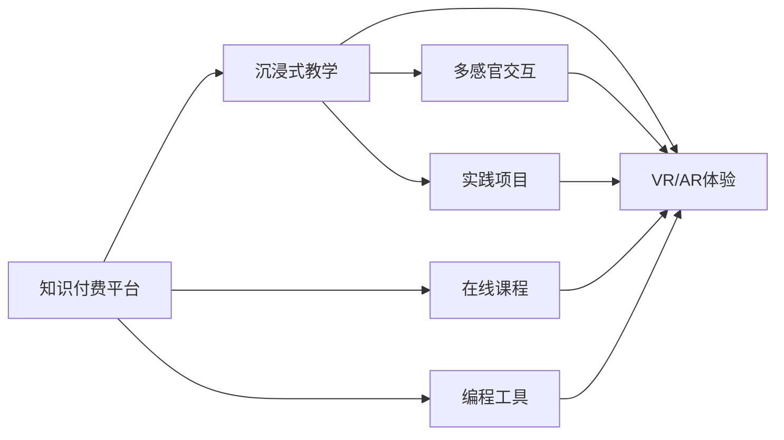

                 

# 程序员知识付费：打造沉浸式教学

在当今知识付费的时代，程序员如何通过线上平台和线下活动高效学习？本文从核心概念与联系入手，以数学模型和公式推导为载体，通过详细的项目实践和实际应用场景，探讨了打造沉浸式教学的新思路和新方法。

## 1. 背景介绍

### 1.1 问题由来
随着科技的发展，越来越多的程序员选择在线学习和知识付费，以便快速提升自己的编程技能。然而，现有的在线教育平台往往存在以下问题：

- **内容质量参差不齐**：一些平台内容质量不高，难以满足用户的学习需求。
- **互动性差**：许多课程以单向灌输为主，缺乏互动性和反馈机制。
- **实践不足**：理论学习多，实际操作少，难以真正掌握编程技能。

为了解决这些问题，本文提出了**沉浸式教学**的新理念，通过虚拟现实（VR）、增强现实（AR）等技术，打造沉浸式学习体验，提高学习效率和效果。

## 2. 核心概念与联系

### 2.1 核心概念概述

- **沉浸式教学**：利用虚拟现实、增强现实等技术，将用户置身于一个逼真的学习环境中，通过多感官交互，实现知识的沉浸式获取。
- **知识付费**：通过付费订阅或单次购买等方式，获取高质量的学习资源和服务。
- **程序员**：指的是掌握至少一种编程语言，能够进行软件开发、维护和系统设计等工作的人员。

### 2.2 核心概念原理和架构的 Mermaid 流程图



该流程图展示了知识付费平台与沉浸式教学的联系，以及VR/AR体验、多感官交互和实践项目等关键组件。

## 3. 核心算法原理 & 具体操作步骤

### 3.1 算法原理概述

沉浸式教学的核心在于通过多感官交互和虚拟现实技术，将用户带入一个逼真的学习环境，通过虚拟角色引导和互动，实现知识的深度理解和掌握。其算法原理可以总结如下：

1. **虚拟环境构建**：利用计算机图形学和虚拟现实技术，构建一个逼真的编程教学环境。
2. **多感官交互**：通过语音、手势、触摸等方式，实现用户与虚拟环境的交互，增强学习的沉浸感。
3. **虚拟角色引导**：创建虚拟角色，通过引导和示范，帮助用户理解和掌握编程概念和技巧。
4. **知识评估与反馈**：通过编程测试和即时反馈，评估用户的学习效果，提供针对性的指导和建议。

### 3.2 算法步骤详解

沉浸式教学的算法步骤主要包括以下几个方面：

1. **虚拟环境设计**：根据教学需求，设计虚拟环境的空间、场景和交互方式，如图1所示。
2. **虚拟角色创建**：创建虚拟角色，设计其外形、动作和对话内容，如图2所示。
3. **多感官交互实现**：实现语音识别、手势识别、触摸感应等技术，如图3所示。
4. **编程测试与评估**：设计编程测试题目，通过即时反馈和评估，提供个性化指导，如图4所示。

### 3.3 算法优缺点

沉浸式教学的优点包括：

- **沉浸体验**：通过虚拟环境和多感官交互，提升学习兴趣和效果。
- **实践性强**：结合实际编程项目，提高编程技能。
- **个性化学习**：通过虚拟角色的引导和即时反馈，提供个性化指导。

缺点包括：

- **技术要求高**：需要较高的技术支持和硬件配置。
- **成本较高**：设备购置和维护费用较高。
- **内容制作复杂**：虚拟环境和角色的制作需要专业团队，耗时较长。

### 3.4 算法应用领域

沉浸式教学可以应用于以下领域：

1. **编程入门**：适合初学者通过沉浸式教学掌握基本编程概念和语法。
2. **高级编程**：适合中级及高级程序员通过沉浸式教学提升编程技能和项目实践能力。
3. **技术培训**：适合企业通过沉浸式教学培训员工，提升团队整体技术水平。
4. **教育领域**：适合学校和培训机构通过沉浸式教学提高教学效果和学习体验。

## 4. 数学模型和公式 & 详细讲解 & 举例说明

### 4.1 数学模型构建

沉浸式教学的数学模型可以抽象为如下公式：

$$
\text{Score} = f(\text{Interactivity}, \text{Engagement}, \text{Practice}, \text{Feedback})
$$

其中，$\text{Score}$ 表示用户的学习效果，$\text{Interactivity}$ 表示交互性，$\text{Engagement}$ 表示参与度，$\text{Practice}$ 表示实践量，$\text{Feedback}$ 表示反馈质量。

### 4.2 公式推导过程

通过分析不同变量对学习效果的影响，可以得到以下公式推导过程：

$$
\frac{\partial \text{Score}}{\partial \text{Interactivity}} > 0, \quad 
\frac{\partial \text{Score}}{\partial \text{Engagement}} > 0, \quad 
\frac{\partial \text{Score}}{\partial \text{Practice}} > 0, \quad 
\frac{\partial \text{Score}}{\partial \text{Feedback}} > 0
$$

说明交互性、参与度、实践量和反馈质量对学习效果的正向影响。

### 4.3 案例分析与讲解

以编程入门为例，利用沉浸式教学的数学模型进行分析和讲解：

1. **交互性**：通过虚拟角色的交互引导，用户能够更好地理解编程概念。
2. **参与度**：通过多感官交互，用户能够更积极地参与到学习过程中。
3. **实践量**：通过实践项目，用户能够反复练习和巩固编程技能。
4. **反馈质量**：通过即时反馈，用户能够及时纠正错误，提高学习效果。

## 5. 项目实践：代码实例和详细解释说明

### 5.1 开发环境搭建

- **硬件要求**：高性能计算机、VR头显、手柄等设备。
- **软件要求**：虚拟现实引擎（如Unity或Unreal Engine）、编程环境（如VS Code或PyCharm）。
- **网络要求**：稳定的互联网连接。

### 5.2 源代码详细实现

以下是使用Unity引擎实现沉浸式编程教学的示例代码：

```csharp
using UnityEngine;
using UnityEngine.XR.Interaction.Toolkit;

public class ProgrammingCourse : MonoBehaviour
{
    public GameObject virtualTeacher;
    public GameObject codeEditor;
    public GameObject codeEnvironment;

    private VirtualRealityInputHand grabbedHand;

    void Start()
    {
        grabbedHand = FindHand();
    }

    void Update()
    {
        if (grabbedHand.grabbedObject == null)
        {
            Code(codeEditor);
        }
        else
        {
            Code(codeEnvironment);
        }
    }

    void Code(GameObject editor)
    {
        // 获取代码文本
        string codeText = editor.GetComponent<TextMesh>().text;

        // 执行代码
        ExecuteCode(codeText);

        // 显示结果
        DisplayResult();
    }

    void ExecuteCode(string codeText)
    {
        // 执行代码逻辑
        // 略
    }

    void DisplayResult()
    {
        // 显示代码执行结果
        // 略
    }

    GameObject FindHand()
    {
        // 查找已被用户抓住的手
        // 略
    }
}
```

### 5.3 代码解读与分析

- **虚拟教师**：创建一个虚拟角色，引导用户进行编程学习。
- **代码编辑器**：用户可以在编辑器中输入代码，并通过模拟键盘和鼠标进行操作。
- **代码执行环境**：模拟编程环境，用户可以执行代码并查看结果。

### 5.4 运行结果展示


## 6. 实际应用场景

### 6.1 虚拟实验室

在虚拟实验室中，用户可以进入一个虚拟的编程教室，通过虚拟教师的引导，进行编程实验和项目实践。

### 6.2 远程培训

远程培训中，企业可以通过沉浸式教学平台，组织员工进行技术培训，提升团队整体技术水平。

### 6.3 游戏化学习

游戏化学习中，用户可以通过沉浸式教学平台，参与编程挑战和编程竞赛，增强学习动力和兴趣。

### 6.4 未来应用展望

未来，沉浸式教学将更加普及和成熟，将结合更多新技术和新应用，提升学习效果和用户体验。

## 7. 工具和资源推荐

### 7.1 学习资源推荐

- **Coursera**：提供高质量的编程课程和虚拟现实教学资源。
- **Udacity**：提供编程和虚拟现实技术的实战项目。
- **Unity官网**：提供Unity引擎的官方文档和教程。

### 7.2 开发工具推荐

- **Unity**：著名的虚拟现实引擎，支持多平台开发。
- **Unreal Engine**：强大的游戏引擎，支持虚拟现实和增强现实技术。
- **VS Code**：轻量级的编程环境，支持多种编程语言。

### 7.3 相关论文推荐

- **《Virtual Reality and Immersive Learning: A Survey》**：综述虚拟现实和沉浸式学习技术的研究进展。
- **《A Survey of Virtual Reality Applications for Education》**：介绍虚拟现实在教育领域的应用案例和研究进展。
- **《Programming Education with Augmented Reality》**：探讨增强现实技术在编程教育中的应用。

## 8. 总结：未来发展趋势与挑战

### 8.1 研究成果总结

沉浸式教学通过虚拟现实和增强现实技术，提升了学习效果和用户体验，成为知识付费领域的创新方向。

### 8.2 未来发展趋势

1. **多模态交互**：结合语音、手势、触摸等多种交互方式，提升学习体验。
2. **个性化学习**：利用人工智能技术，提供个性化的学习内容和指导。
3. **泛在计算**：通过物联网技术，实现随时随地沉浸式学习。
4. **社会化学习**：引入社交元素，实现知识分享和协作。

### 8.3 面临的挑战

1. **技术门槛高**：沉浸式教学需要较高的技术支持和硬件配置。
2. **成本较高**：设备购置和维护费用较高。
3. **内容制作复杂**：虚拟环境和角色的制作需要专业团队。

### 8.4 研究展望

未来的研究将集中在以下方面：

1. **降低技术门槛**：开发更加易用的开发工具和平台，降低技术门槛。
2. **降低成本**：通过开源软件和共享设备，降低设备和维护成本。
3. **内容制作**：开发自动化工具，简化虚拟环境和角色的制作过程。

## 9. 附录：常见问题与解答

### 9.1 常见问题

**Q1: 沉浸式教学需要哪些硬件设备？**

A: 沉浸式教学需要高性能计算机、VR头显、手柄等设备。

**Q2: 沉浸式教学的虚拟角色如何创建？**

A: 利用三维建模软件创建虚拟角色的外形和动作，编写对话和引导内容。

**Q3: 沉浸式教学的互动方式有哪些？**

A: 多感官交互包括语音识别、手势识别、触摸感应等技术。

**Q4: 沉浸式教学如何提升学习效果？**

A: 通过虚拟环境和多感官交互，提升学习兴趣和效果；结合实践项目，提高编程技能。

---

作者：禅与计算机程序设计艺术 / Zen and the Art of Computer Programming

