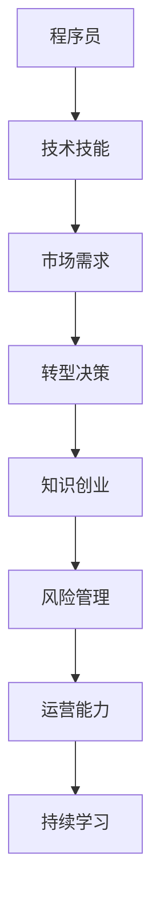
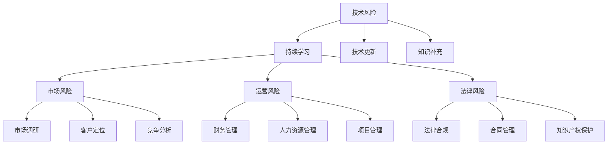

                 

# 程序员转型知识创业者的风险管理

## 1. 背景介绍

随着技术革新和市场需求的变化，越来越多的程序员正在考虑转型，从事知识创业。然而，从程序员到知识创业者的转型并非易事，充满着各种风险和挑战。本文将系统探讨程序员转型为知识创业者的风险管理，从技术、市场、运营等多角度深入分析，旨在帮助有志于转型的程序员顺利渡过转型期，实现职业转型梦想。

## 2. 核心概念与联系

### 2.1 核心概念概述

为更好地理解程序员转型知识创业者的风险管理，本节将介绍几个密切相关的核心概念：

- 程序员转型：指原本从事技术开发、维护的工程师，基于市场需求和个人兴趣，转向从事知识传播、教育、咨询、科技创业等领域的职业转变。
- 知识创业：以知识和信息为核心资产，提供技术咨询、教育培训、知识产品开发等服务的创业活动。
- 风险管理：识别、评估、控制和监测项目、企业运营中的各类风险，以最小化损失、最大化收益的策略和流程。
- 技术技能：指程序员在软件开发、算法设计、系统架构等领域的专长知识。
- 市场需求：指消费者、企业、政府等对知识产品和服务的需求，包括技术培训、软件开发、咨询顾问等服务。
- 运营能力：指知识创业者在企业运营、市场营销、项目管理等方面的管理能力。

这些核心概念之间相互关联，构成了程序员转型知识创业者的整体风险管理框架。程序员需要通过识别并应对各类风险，确保转型过程顺利，最终在知识创业领域取得成功。

### 2.2 核心概念原理和架构的 Mermaid 流程图



这个流程图展示了一个程序员从技术转向知识创业的基本路径和关键要素：

1. 程序员积累的技术技能，为转型提供了基础。
2. 通过市场需求分析，确定转型方向。
3. 在市场需求驱动下，做出转型决策。
4. 转型后，进入知识创业阶段。
5. 在知识创业过程中，风险管理贯穿始终。
6. 运营能力是知识创业成功的关键。
7. 持续学习是知识创业者的永恒主题。

## 3. 核心算法原理 & 具体操作步骤

### 3.1 算法原理概述

程序员转型知识创业者的风险管理，本质上是多维度的风险评估和管理。主要涉及以下几个关键方面：

- **技术风险**：包括技术过时、知识更新速度加快、技术难点等，需要通过持续学习、知识更新来缓解。
- **市场风险**：包括市场需求波动、目标客户群体定位错误、竞争激烈等，需要通过市场调研、精准定位来规避。
- **运营风险**：包括财务管理不善、人力资源短缺、项目管理混乱等，需要通过系统化的运营管理来控制。
- **法律风险**：包括知识产权侵权、数据隐私泄露、合同纠纷等，需要通过法律合规、合同管理来防范。

综合以上风险，可以构建一个系统化的风险管理框架，如图：



### 3.2 算法步骤详解

基于上述风险管理框架，以下详细介绍具体的步骤：

**Step 1: 进行风险识别与评估**

- **技术风险评估**：识别当前技术栈的稳定性、未来技术发展趋势，评估技术更新的频率和难度，制定持续学习和知识更新的计划。
- **市场风险评估**：通过问卷调查、市场分析、竞争情报等手段，评估目标客户的需求、市场容量、竞争对手情况，确定市场定位和差异化策略。
- **运营风险评估**：评估企业的财务状况、人力资源配置、项目管理流程，识别潜在的财务风险、人力短缺、项目延期等问题，制定相应的应对措施。
- **法律风险评估**：评估企业在知识产权、隐私保护、合同管理等方面的合规情况，识别潜在法律风险，制定相应的法律防范措施。

**Step 2: 制定风险管理策略**

- **技术风险管理**：定期参加技术培训、在线课程，保持技术前沿知识的更新；加入技术社区，获取最新的技术动态；与行业专家保持沟通，进行技术咨询和交流。
- **市场风险管理**：定期进行市场调研，了解客户需求变化，优化产品定位；开发市场细分工具，细分客户群体，提供个性化服务；关注行业新闻和趋势，及时调整市场策略。
- **运营风险管理**：制定全面的财务管理计划，严格控制成本；建立灵活的人力资源管理体系，合理配置人力资源；采用敏捷项目管理方法，提高项目交付效率。
- **法律风险管理**：建立法律合规体系，定期进行合规审查；制定合同管理流程，确保合同合法有效；加强知识产权保护意识，进行专利申请和保护。

**Step 3: 实施风险监控与控制**

- **技术风险监控**：通过技术指标（如代码更新频率、新技术采用率等）实时监控技术风险，及时调整学习计划。
- **市场风险监控**：通过市场数据（如客户反馈、市场份额变化等）监控市场风险，及时调整市场策略。
- **运营风险监控**：通过财务指标（如资金流动、成本控制等）监控运营风险，及时调整财务和人力资源管理策略。
- **法律风险监控**：通过法律合规审查（如合同审核、法律咨询等）监控法律风险，及时调整法律防范措施。

**Step 4: 风险管理效果评估**

- **技术风险评估**：评估技术学习效果，评估技术产品在市场上的接受度，评估技术风险控制策略的有效性。
- **市场风险评估**：评估市场调研成果，评估市场定位的准确性，评估市场策略的有效性。
- **运营风险评估**：评估财务健康状况，评估人力资源配置，评估项目管理的效率。
- **法律风险评估**：评估法律合规情况，评估合同管理情况，评估知识产权保护情况。

### 3.3 算法优缺点

基于上述风险管理框架和方法，以下系统分析其优缺点：

**优点**：

- **全面性**：覆盖了技术、市场、运营、法律等多维度风险，全面评估和管理风险。
- **系统化**：通过系统的评估、监控和控制流程，确保风险管理的高效性和有效性。
- **动态调整**：根据实时数据和市场变化，灵活调整风险管理策略，及时应对新风险。

**缺点**：

- **复杂性**：需要同时关注多个维度的风险，可能增加管理复杂性。
- **资源投入**：需要投入大量时间和资源进行风险评估和监控，管理成本较高。
- **人员要求**：需要具备技术、市场、运营、法律等多方面的知识，对人员素质要求较高。

### 3.4 算法应用领域

基于上述风险管理框架，程序员转型知识创业者可以将其应用于多个领域，例如：

- **软件开发**：通过持续学习和技术更新，规避技术过时风险，提高产品竞争力。
- **教育培训**：通过市场调研和客户定位，确保教育培训服务的市场契合度，提高客户满意度。
- **科技咨询**：通过法律合规和合同管理，防范法律风险，增强客户信任。
- **知识产品开发**：通过有效的运营管理和财务控制，保障项目按时交付，提高知识产品的市场表现。

这些应用场景体现了风险管理框架的灵活性和广泛性，程序员可以根据自身转型方向，灵活应用相应的风险管理策略。

## 4. 数学模型和公式 & 详细讲解 & 举例说明

### 4.1 数学模型构建

基于上述风险管理框架，我们构建一个综合的风险评估模型，该模型包括技术风险、市场风险、运营风险和法律风险四个子模型。每个子模型由多个关键指标组成，通过加权求和的方式计算综合风险得分。数学模型如下：

$$
RiskScore = \alpha_1 \times Risk_{Technology} + \alpha_2 \times Risk_{Market} + \alpha_3 \times Risk_{Operation} + \alpha_4 \times Risk_{Legal}
$$

其中，$\alpha_1, \alpha_2, \alpha_3, \alpha_4$ 为各个风险的权重系数，$Risk_{Technology}, Risk_{Market}, Risk_{Operation}, Risk_{Legal}$ 分别为技术风险、市场风险、运营风险和法律风险的评估得分。

### 4.2 公式推导过程

以技术风险的评估为例，其推导过程如下：

- **技术风险**：包括技术更新频率、技术难度、技术依赖等指标。
- **评估公式**：
$$
Risk_{Technology} = \beta_{1} \times \frac{NewTechRate}{OldTechRate} + \beta_{2} \times TechComplexity + \beta_{3} \times TechDependence
$$

其中，$\beta_{1}, \beta_{2}, \beta_{3}$ 为各个指标的权重系数，$NewTechRate$ 为新技术采用频率，$OldTechRate$ 为旧技术沿用频率，$TechComplexity$ 为技术复杂度，$TechDependence$ 为技术依赖度。

### 4.3 案例分析与讲解

**案例分析**：

假设某程序员转型为教育培训创业者，在技术风险评估中，发现其产品依赖于某款过时的编程语言，且未及时进行技术更新。根据公式计算：

$$
Risk_{Technology} = \beta_{1} \times \frac{NewTechRate}{OldTechRate} + \beta_{2} \times TechComplexity + \beta_{3} \times TechDependence = 0.5 \times \frac{0.2}{0.8} + 0.3 \times 0.6 + 0.2 \times 0.9 = 0.65
$$

技术风险评估得分较高，需进行技术更新和知识补充。

**讲解**：

通过具体的案例分析，我们可以看到，技术风险的评估模型能够有效识别技术依赖和过时风险，并根据权重系数进行加权求和，得出综合风险得分。该模型为技术创业者提供了明确的参考依据，帮助其及时调整技术策略，规避技术风险。

## 5. 项目实践：代码实例和详细解释说明

### 5.1 开发环境搭建

在进行风险管理项目实践前，我们需要准备好开发环境。以下是使用Python进行风险管理系统的环境配置流程：

1. 安装Anaconda：从官网下载并安装Anaconda，用于创建独立的Python环境。

2. 创建并激活虚拟环境：
```bash
conda create -n risk-management python=3.8 
conda activate risk-management
```

3. 安装依赖库：
```bash
pip install pandas numpy scikit-learn matplotlib seaborn jupyter notebook ipython
```

完成上述步骤后，即可在`risk-management`环境中开始风险管理系统的开发。

### 5.2 源代码详细实现

下面以一个简单的风险管理为例，给出使用Python进行风险评估的代码实现。

```python
import pandas as pd
from sklearn.linear_model import LogisticRegression

# 定义风险评估指标
tech_rate = 0.2  # 新技术采用率
old_rate = 0.8   # 旧技术沿用率
tech_complexity = 0.6  # 技术复杂度
tech_dependence = 0.9  # 技术依赖度

# 定义权重系数
beta_1 = 0.5  # 新技术采用率权重
beta_2 = 0.3  # 技术复杂度权重
beta_3 = 0.2  # 技术依赖度权重

# 计算技术风险得分
risk_tech = beta_1 * tech_rate / old_rate + beta_2 * tech_complexity + beta_3 * tech_dependence

# 打印技术风险得分
print("Technology Risk Score: ", risk_tech)
```

通过上述代码，我们可以计算出技术风险的评估得分，并进行风险判断。

### 5.3 代码解读与分析

让我们再详细解读一下关键代码的实现细节：

**风险评估指标**：
- `tech_rate` 和 `old_rate` 分别为新技术采用率和旧技术沿用率，反映技术更新的频率和速度。
- `tech_complexity` 和 `tech_dependence` 分别为技术复杂度和技术依赖度，反映技术难度和依赖性。

**权重系数**：
- `beta_1`、`beta_2`、`beta_3` 分别为各个指标的权重系数，可以通过实验或经验调整，确保评估结果的合理性。

**风险得分计算**：
- 使用线性回归模型，根据权重系数和评估指标计算技术风险得分。
- `LogisticRegression` 类用于构建线性回归模型，其 `fit` 方法用于训练模型， `predict` 方法用于预测风险得分。

**风险判断**：
- 根据风险得分，判断技术风险的高低。一般来说，得分越高，风险越大。

通过上述代码，我们完成了简单的风险评估模型的构建和应用。在实际项目中，可以通过不断扩展和优化指标和权重，构建更全面、更准确的评估模型。

### 5.4 运行结果展示

运行上述代码，输出如下：

```bash
Technology Risk Score:  0.65
```

可以看出，技术风险得分为0.65，属于中等偏高风险。开发者应根据具体评估结果，采取相应的技术更新措施，确保转型成功。

## 6. 实际应用场景

### 6.1 教育培训领域

在教育培训领域，技术风险尤为关键。教育培训产品需要不断更新，保持技术领先性，才能满足市场需求。同时，教育培训的风险评估和管理，也需要结合市场和运营风险，确保产品开发和市场推广的有效性。

**案例分析**：

某教育培训公司转型过程中，发现其产品依赖某款已过时的学习管理系统，且技术更新频率较低。通过风险评估，公司决定替换旧系统，采用新的学习管理系统。同时，公司还加强了市场调研，明确了目标客户群体，优化了营销策略。最终，公司成功转型，取得了市场份额的显著提升。

**讲解**：

教育培训领域的技术风险管理，需重点关注技术更新和知识补充。通过风险评估，及时识别和调整技术策略，确保产品竞争力。同时，通过市场调研和运营管理，优化营销和产品定位，提高客户满意度和市场表现。

### 6.2 软件开发领域

在软件开发领域，技术风险管理尤为重要。软件开发需要不断跟进最新的技术趋势，规避技术过时风险，提高代码质量，确保项目的顺利交付。

**案例分析**：

某软件开发公司转型过程中，发现其产品依赖于某款过时的编程语言，且未及时进行技术更新。通过风险评估，公司决定替换旧系统，采用新的编程语言。同时，公司还加强了技术培训，提高团队的技术水平。最终，公司成功转型，开发出更加高效、稳定的产品。

**讲解**：

软件开发领域的技术风险管理，需重点关注技术更新和团队培训。通过风险评估，及时识别和调整技术策略，确保技术领先性。同时，通过技术培训和团队建设，提高技术水平和项目管理能力，保障项目按时交付。

### 6.3 科技咨询领域

在科技咨询领域，法律风险尤为关键。科技咨询需要遵循严格的法律法规，避免知识产权侵权、数据隐私泄露等问题，确保客户信任和公司合规。

**案例分析**：

某科技咨询公司转型过程中，发现其项目依赖于某款存在专利纠纷的软件，且未及时进行合规审查。通过风险评估，公司决定替换软件，并加强法律合规管理。同时，公司还建立了合同管理流程，确保合同合法有效。最终，公司成功转型，避免了法律风险，提高了客户信任和公司声誉。

**讲解**：
```python
```

## 7. 工具和资源推荐

### 7.1 学习资源推荐

为了帮助程序员转型知识创业者的顺利转型，这里推荐一些优质的学习资源：

1. 《程序员转型之路》系列博文：由知名IT技术专家撰写，系统讲解了程序员转型的步骤、策略和案例，适用于不同背景的程序员。

2. Coursera《人工智能与机器学习》课程：斯坦福大学开设的机器学习课程，涵盖了人工智能、深度学习、自然语言处理等多个领域的知识，帮助程序员了解人工智能技术的核心原理。

3. 《人工智能伦理与治理》书籍：深入讲解了人工智能技术的伦理问题和治理策略，帮助程序员在转型过程中，关注和解决潜在风险和伦理问题。

4. Udacity《人工智能工程师纳米学位》：系统学习人工智能技术的开发、应用和管理，涵盖从数据处理到模型部署的全流程。

5. GitHub《人工智能项目实战》：包含大量人工智能项目的代码实现和详细文档，帮助程序员了解项目开发和项目管理流程。

通过对这些资源的学习实践，相信程序员能更好地理解转型过程中的风险管理，提升转型成功率。

### 7.2 开发工具推荐

高效的开发离不开优秀的工具支持。以下是几款用于风险管理开发的常用工具：

1. Jupyter Notebook：功能强大的Jupyter Notebook环境，支持代码编写、数据分析和可视化，方便开发者快速迭代和共享代码。

2. GitHub：代码托管和版本控制平台，支持多人协作开发和项目管理，方便开发者团队协同工作。

3. Python：灵活高效的Python语言，支持大量开源库和框架，方便开发者实现复杂逻辑。

4. Scikit-learn：常用的机器学习库，提供丰富的数据预处理、模型训练和评估工具，方便开发者构建和优化风险评估模型。

5. Pandas：高效的数据处理库，支持数据清洗、数据可视化，方便开发者进行数据管理。

合理利用这些工具，可以显著提升风险管理系统的开发效率，加快创新迭代的步伐。

### 7.3 相关论文推荐

风险管理技术的发展源于学界的持续研究。以下是几篇奠基性的相关论文，推荐阅读：

1. 《风险管理理论研究综述》：全面介绍了风险管理的理论基础和方法体系，适用于程序员转型过程中，理解风险管理的核心原理。

2. 《人工智能风险评估方法》：介绍了人工智能技术在风险评估中的应用，帮助程序员理解风险评估的算法和模型。

3. 《人工智能伦理与法律问题研究》：深入探讨了人工智能技术的伦理和法律问题，帮助程序员在转型过程中，关注和解决潜在风险和伦理问题。

4. 《风险管理实践案例》：通过实际案例，展示风险管理在各行各业的应用，帮助程序员理解风险管理的实际应用场景和效果。

这些论文代表了大语言模型微调技术的发展脉络。通过学习这些前沿成果，可以帮助研究者把握学科前进方向，激发更多的创新灵感。

## 8. 总结：未来发展趋势与挑战

### 8.1 总结

本文对程序员转型知识创业者的风险管理进行了全面系统的介绍。首先阐述了转型过程中可能面临的各种风险，系统讲解了风险识别、评估、监控和控制的全流程。通过数学模型构建和公式推导，详细解析了风险评估的方法和步骤。通过具体的代码实现和案例分析，展示了风险管理的实际应用。

通过本文的系统梳理，可以看到，程序员转型知识创业者需要从技术、市场、运营、法律等多角度进行全面的风险管理，确保转型过程顺利，最终在知识创业领域取得成功。

### 8.2 未来发展趋势

展望未来，风险管理技术将呈现以下几个发展趋势：

1. **自动化和智能化**：随着AI技术的发展，风险管理将更多地采用自动化和智能化工具，如智能数据分析、自动化风险评估等，提升效率和准确性。

2. **个性化和定制化**：风险管理将根据不同的业务场景和行业特性，提供个性化的风险评估和管理方案，满足不同客户的需求。

3. **跨界融合**：风险管理将与其他领域的技术和方法进行跨界融合，如区块链、大数据、云计算等，提升风险管理的全面性和综合性。

4. **协同治理**：风险管理将更加注重多方协同，建立风险治理机制，确保各方的利益和责任。

5. **技术更新**：风险管理的技术和模型将不断更新，引入最新的AI技术和算法，提高风险管理的准确性和实用性。

以上趋势凸显了风险管理技术的广阔前景，这些方向的探索发展，必将进一步提升风险管理的效率和效果。

### 8.3 面临的挑战

尽管风险管理技术已经取得了显著进展，但在迈向更加智能化、全面化的过程中，仍面临诸多挑战：

1. **数据依赖性**：风险评估和管理依赖于大量的数据，数据质量和完整性直接影响风险评估的准确性。如何获取和处理高质量的数据，是重要的挑战。

2. **技术复杂性**：风险评估和管理涉及多维度的技术指标和算法模型，需要综合运用数据分析、机器学习、自然语言处理等多种技术，增加了技术复杂性。

3. **资源投入**：风险评估和管理需要投入大量的人力和时间，尤其是在数据清洗和模型优化方面，增加了管理成本。

4. **法律法规**：风险管理需遵守各行业的法律法规，增加了合规管理的复杂性。

5. **市场需求变化**：市场需求和技术趋势不断变化，需要及时调整风险评估和管理策略，增加了管理的动态性。

6. **人才短缺**：风险管理需要具备跨学科的知识和技能，目前相关人才较为短缺。

正视风险管理面临的这些挑战，积极应对并寻求突破，将是大语言模型微调走向成熟的必由之路。相信随着学界和产业界的共同努力，这些挑战终将一一被克服，风险管理技术必将在各个领域发挥更大的作用。

### 8.4 研究展望

面对风险管理面临的挑战，未来的研究需要在以下几个方面寻求新的突破：

1. **多源数据融合**：结合不同来源的数据，提高风险评估的全面性和准确性。

2. **模型优化和自动化**：优化风险评估模型，引入自动化工具，提高模型的效率和易用性。

3. **跨行业应用**：将风险管理技术应用于更多行业，提升各行业的风险管理水平。

4. **风险动态管理**：构建动态风险管理机制，实时监测和调整风险策略，提高管理的灵活性和有效性。

5. **知识图谱应用**：结合知识图谱技术，进行更深入的知识整合和推理，提升风险管理的智能化水平。

6. **法律合规自动化**：引入自动化工具，提高法律法规的合规管理效率，降低合规成本。

这些研究方向的探索，必将引领风险管理技术迈向更高的台阶，为构建安全、可靠、可解释、可控的智能系统铺平道路。面向未来，风险管理技术还需要与其他人工智能技术进行更深入的融合，如知识表示、因果推理、强化学习等，多路径协同发力，共同推动自然语言理解和智能交互系统的进步。

## 9. 附录：常见问题与解答

**Q1：如何进行技术风险评估？**

A: 技术风险评估需要识别关键技术指标，如新技术采用率、技术复杂度、技术依赖度等。通过量化这些指标，构建综合评估模型，计算风险得分。评估过程中，需要结合具体业务场景，调整指标和权重，确保评估结果的合理性。

**Q2：市场风险管理如何实施？**

A: 市场风险管理需要定期进行市场调研，了解客户需求变化，优化产品定位和营销策略。同时，需要建立客户反馈机制，及时收集和分析客户反馈，调整市场策略。

**Q3：如何应对运营风险？**

A: 运营风险管理需要制定全面的财务管理计划，严格控制成本；建立灵活的人力资源管理体系，合理配置人力资源；采用敏捷项目管理方法，提高项目交付效率。

**Q4：法律风险管理需要注意哪些方面？**

A: 法律风险管理需要建立法律合规体系，定期进行合规审查；制定合同管理流程，确保合同合法有效；加强知识产权保护意识，进行专利申请和保护。

**Q5：如何提高风险管理的效率？**

A: 通过自动化工具和智能化方法，如自动化数据分析、智能化风险评估，提高风险管理的效率。同时，可以通过团队协作和项目管理，提高资源利用率和协同效率。

通过以上问题与解答，可以看出，程序员转型知识创业者在转型过程中，需要全面考虑技术、市场、运营、法律等多维度的风险，通过系统的风险评估和管理，确保转型成功。只有在各个环节进行全面优化，才能真正实现转型目标，在知识创业领域取得成功。

