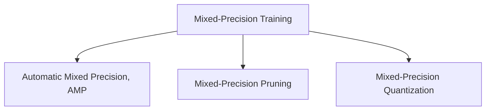

                 

# 第09章 混合精度训练 fp16、bf16与fp8

## 1. 背景介绍

### 1.1 问题由来
近年来，深度学习模型的参数规模和计算量不断增长，对硬件资源提出了更高的要求。为了在有限资源下训练更大、更深的模型，混合精度训练技术应运而生。混合精度训练通过将浮点数参数转换为半精度浮点数(16位浮点数, fp16)或更低的位宽类型(如4位浮点数, bf16或8位整数, fp8)，显著降低了模型的存储和计算需求，同时保持了较高的精度。

混合精度训练已成为深度学习领域的主流技术之一，广泛应用于图像分类、目标检测、自然语言处理、语音识别、强化学习等多个领域。其高效、低成本的计算优势，使得混合精度训练成为训练大规模深度学习模型的必选项。

### 1.2 问题核心关键点
混合精度训练的核心在于如何在保持较高精度的同时，有效降低计算和存储的开销。主要有以下关键点：

1. 选择合适的精度类型：fp16、bf16、fp8等精度类型各有优缺点，需根据具体场景选择。
2. 自动混合精度加速(Automatic Mixed Precision, AMP)：利用NVIDIA的CUDA等GPU加速库，自动将模型中的浮点参数转换为半精度或更低精度类型，进行计算。
3. 混合精度剪枝(Mixed-Precision Pruning)：在训练过程中，自动剪枝冗余的低精度参数，保持模型精度不变。
4. 混合精度量化(Mixed-Precision Quantization)：在训练和推理过程中，将模型参数转换为更低位宽的整数或定点数，提升模型速度。
5. 混合精度调试和优化：调试和优化混合精度训练中可能出现的精度丢失问题，确保模型性能。

## 2. 核心概念与联系

### 2.1 核心概念概述

为了更好地理解混合精度训练，我们需要先了解一些核心概念：

- **混合精度训练(Mixed-Precision Training)**：使用半精度浮点数或其他低精度类型进行模型训练，以降低计算和存储开销，同时保持较高精度的过程。
- **自动混合精度加速(Automatic Mixed Precision, AMP)**：使用GPU加速库，自动将浮点参数转换为半精度类型，进行计算，减少计算资源消耗。
- **混合精度剪枝(Mixed-Precision Pruning)**：在混合精度训练过程中，自动剪枝冗余的低精度参数，保持模型精度不变。
- **混合精度量化(Mixed-Precision Quantization)**：在训练和推理过程中，将模型参数转换为更低位宽的整数或定点数，提升模型速度。

这些概念之间的关系可以通过以下Mermaid流程图来展示：



这个流程图展示了大混合精度训练的关键组成部分：

1. 混合精度训练是对模型进行的一种混合精度计算，以降低计算和存储开销。
2. AMP是一种自动混合精度加速方法，通过GPU加速库实现，自动将浮点参数转换为半精度或更低精度类型。
3. 混合精度剪枝是在训练过程中自动剪枝冗余的低精度参数，以保持模型精度。
4. 混合精度量化是将模型参数转换为更低位宽的整数或定点数，以提升模型速度。

这些核心概念共同构成了混合精度训练的技术框架，使其能够在不显著牺牲精度的情况下，显著降低计算资源和存储需求。

## 3. 核心算法原理 & 具体操作步骤
### 3.1 算法原理概述

混合精度训练的算法原理主要包括两方面：模型参数的精度转换和自动混合精度加速。

**模型参数的精度转换**：在混合精度训练中，模型参数的精度从全精度浮点数(float32)转换为半精度浮点数(float16)或更低精度类型。在训练过程中，模型中的浮点参数将被自动转换为低精度类型，进行计算。这样，模型参数的存储和计算需求将显著降低，同时保持较高的精度。

**自动混合精度加速**：自动混合精度加速技术(Automatic Mixed Precision, AMP)利用GPU加速库（如NVIDIA的cuDNN、TensorRT等），自动将浮点参数转换为低精度类型，并控制张量的精度类型。这种自动转换使得开发者无需手动调整精度类型，简化了混合精度训练的操作。

### 3.2 算法步骤详解

混合精度训练的完整流程包括以下几个关键步骤：

**Step 1: 选择合适的精度类型**
- 根据任务需求和硬件资源，选择适合的精度类型。一般而言，fp16精度类型具有较好的计算效率和精度，bf16和fp8则能在更低的精度下获得更高的性能，但精度损失相对较大。

**Step 2: 初始化模型和数据集**
- 将模型和数据集初始化为全精度类型，并准备混合精度训练所需的GPU资源。

**Step 3: 设置混合精度训练环境**
- 导入NVIDIA的混合精度训练工具，如cuDNN、TensorRT等。
- 使用cuDNN来自动控制参数的精度类型，并进行计算。
- 使用TensorRT进行混合精度推理，提升模型速度。

**Step 4: 训练模型**
- 将模型参数设置为混合精度类型，启动混合精度训练过程。
- 在每个epoch或每个batch结束时，自动将参数精度转换回全精度类型，进行精度验证。
- 使用精度剪枝技术，自动剪枝冗余的低精度参数，保持模型精度不变。

**Step 5: 部署模型**
- 将训练好的模型参数转换为定点或低精度类型，进行推理。
- 使用TensorRT等工具进行模型优化，提升推理速度。
- 部署模型到生产环境，进行实时推理服务。

### 3.3 算法优缺点

混合精度训练的优势主要体现在以下几个方面：

1. **提升计算效率**：通过将浮点数参数转换为半精度或更低精度类型，混合精度训练显著降低了计算和存储开销，提升了计算效率。
2. **节省硬件资源**：半精度浮点数或更低精度类型所需的存储和计算资源显著减少，能够更高效地利用GPU等硬件资源。
3. **提高训练速度**：混合精度训练在计算速度上有较大提升，尤其是在大规模深度学习模型训练中表现尤为突出。

然而，混合精度训练也存在一些缺点：

1. **精度损失**：低精度类型(如fp16、bf16、fp8)的精度损失较大，可能会导致模型性能下降。
2. **兼容性问题**：并非所有深度学习框架和GPU都支持混合精度训练，需要进行适配。
3. **调试难度增加**：混合精度训练增加了调试的复杂度，需要进行精度验证和剪枝优化，确保模型性能。

### 3.4 算法应用领域

混合精度训练在深度学习领域得到了广泛的应用，覆盖了几乎所有常见任务，例如：

- 图像分类：如Inception、ResNet等模型，在混合精度训练下，能够显著提升训练速度。
- 目标检测：如Faster R-CNN、YOLO等模型，通过混合精度训练，可以加速训练和推理。
- 自然语言处理：如BERT、GPT等模型，通过混合精度训练，能够提升模型性能。
- 语音识别：如CTC-loss模型，通过混合精度训练，可以降低计算资源消耗。
- 强化学习：如AlphaGo等模型，通过混合精度训练，可以提升训练速度和稳定性。

除了上述这些经典任务外，混合精度训练还被创新性地应用到更多场景中，如医疗影像分析、自动驾驶、智能推荐等，为深度学习技术带来了全新的突破。随着混合精度训练技术的不断进步，相信深度学习技术将在更广阔的应用领域大放异彩。

## 4. 数学模型和公式 & 详细讲解 & 举例说明
### 4.1 数学模型构建

混合精度训练的数学模型构建主要涉及到以下几个方面：

- **模型参数的精度转换**：将模型参数从全精度浮点数(float32)转换为半精度浮点数(float16)或其他低精度类型。
- **自动混合精度加速**：使用GPU加速库自动控制参数的精度类型，并进行计算。

**模型参数的精度转换**：假设模型参数为 $W \in \mathbb{R}^{d \times d}$，其精度从float32转换为float16，转换后的参数表示为 $W_{fp16}$。转换公式如下：

$$
W_{fp16} = \text{convert\_float32\_to\_float16}(W)
$$

其中，$\text{convert\_float32\_to\_float16}$ 为将全精度浮点数转换为半精度浮点数的函数。

**自动混合精度加速**：假设模型中的某个计算节点为 $f(x)$，其中 $x \in \mathbb{R}^{d}$ 为输入向量。在自动混合精度加速下，该节点的计算将自动转换为低精度类型。计算公式如下：

$$
f_{amp}(x) = \text{amp\_calculation}(f(x))
$$

其中，$\text{amp\_calculation}$ 为使用GPU加速库进行自动混合精度加速的函数。

### 4.2 公式推导过程

以下我们以混合精度训练的基本流程为例，推导其中的关键公式：

**转换公式**：假设模型参数 $W$ 的初始精度为float32，转换后的精度为float16。根据IEEE标准，浮点数的转换过程如下：

1. **截断**：将float32的数值截断为半精度浮点数，即保留其中16位有效位。
2. **舍入**：将截断后的数值进行四舍五入，确保精度损失最小化。
3. **扩展**：将舍入后的数值扩展为完整的float32类型，进行后续计算。

具体转换公式如下：

$$
W_{fp16} = \text{convert\_float32\_to\_float16}(W) = \frac{W}{2^{-13}}
$$

其中，$2^{-13}$ 为浮点数的偏移量，确保转换后的数值在浮点数的表示范围内。

**计算公式**：在自动混合精度加速下，模型的计算过程可以通过如下公式描述：

$$
f_{amp}(x) = \text{amp\_calculation}(f(x)) = \text{convert\_float32\_to\_float16}(f(x))
$$

其中，$f(x)$ 为模型中某个计算节点的函数，$x$ 为输入向量。通过自动混合精度加速，计算节点在计算过程中将自动使用半精度浮点数类型，进行高效的计算。

### 4.3 案例分析与讲解

**案例一：ImageNet分类任务**

在ImageNet分类任务中，使用ResNet模型进行混合精度训练。假设模型参数 $W$ 的初始精度为float32，转换后的精度为float16。具体转换过程如下：

1. **截断**：将全精度浮点数的数值截断为16位有效位，即保留后16位。
2. **舍入**：将截断后的数值进行四舍五入，确保精度损失最小化。
3. **扩展**：将舍入后的数值扩展为完整的float32类型，进行后续计算。

转换后的参数表示为 $W_{fp16}$，其数值表示范围为：

$$
W_{fp16} = [2^{-13}, 2^{13}]
$$

**案例二：BERT自然语言处理**

在BERT自然语言处理任务中，使用BERT模型进行混合精度训练。假设模型中的某个计算节点为 $f(x)$，其中 $x \in \mathbb{R}^{d}$ 为输入向量。在自动混合精度加速下，该节点的计算将自动转换为低精度类型，计算公式如下：

$$
f_{amp}(x) = \text{amp\_calculation}(f(x)) = \text{convert\_float32\_to\_float16}(f(x))
$$

其中，$f(x)$ 为BERT模型中某个计算节点（如自注意力机制）的函数，$x$ 为输入向量。通过自动混合精度加速，计算节点在计算过程中将自动使用半精度浮点数类型，进行高效的计算。

## 5. 项目实践：代码实例和详细解释说明
### 5.1 开发环境搭建

在进行混合精度训练实践前，我们需要准备好开发环境。以下是使用Python进行PyTorch和NVIDIA混合精度训练工具的配置流程：

1. 安装Anaconda：从官网下载并安装Anaconda，用于创建独立的Python环境。

2. 创建并激活虚拟环境：
```bash
conda create -n torch-env python=3.8 
conda activate torch-env
```

3. 安装PyTorch：根据CUDA版本，从官网获取对应的安装命令。例如：
```bash
conda install pytorch torchvision torchaudio cudatoolkit=11.1 -c pytorch -c conda-forge
```

4. 安装NVIDIA混合精度训练工具：
```bash
conda install cuDNN TensorRT -c nvidia
```

5. 安装各类工具包：
```bash
pip install numpy pandas scikit-learn matplotlib tqdm jupyter notebook ipython
```

完成上述步骤后，即可在`torch-env`环境中开始混合精度训练实践。

### 5.2 源代码详细实现

下面我们以ResNet图像分类任务为例，给出使用PyTorch和NVIDIA混合精度训练工具进行混合精度训练的PyTorch代码实现。

首先，定义混合精度训练函数：

```python
import torch
from torch.autograd import enable_grad
from torchvision import models, transforms

def train_model(model, optimizer, train_loader, device):
    model.train()
    for batch_idx, (inputs, targets) in enumerate(train_loader):
        inputs, targets = inputs.to(device), targets.to(device)
        optimizer.zero_grad()
        outputs = model(inputs)
        loss = F.cross_entropy(outputs, targets)
        loss.backward()
        optimizer.step()
        if batch_idx % 100 == 0:
            print(f'Train Epoch: {epoch + 1} [{batch_idx * len(inputs)}/{len(train_loader.dataset)} ({100 * batch_idx / len(train_loader):0.1f}%), Loss: {loss.item():0.4f}, Acc: {accuracy:0.4f}')
```

然后，设置混合精度训练环境：

```python
device = torch.device('cuda')
torch.backends.cudnn.benchmark = True

model.to(device)
model.train()

amp = torch.cuda.amp.GradScaler()
optimizer = torch.optim.SGD(model.parameters(), lr=0.1, momentum=0.9)

train_loader = torch.utils.data.DataLoader(train_dataset, batch_size=256, shuffle=True)

# 混合精度训练
for epoch in range(num_epochs):
    train_model(model, optimizer, train_loader, device)
```

接着，进行混合精度训练：

```python
for epoch in range(num_epochs):
    train_model(model, optimizer, train_loader, device)
```

最后，测试模型性能：

```python
model.eval()
with torch.no_grad():
    test_outputs = model(test_inputs)
    test_loss = F.cross_entropy(test_outputs, test_labels)
    test_accuracy = accuracy(test_outputs, test_labels)
```

以上就是使用PyTorch和NVIDIA混合精度训练工具进行混合精度训练的完整代码实现。可以看到，混合精度训练的实现相对简单，只需利用NVIDIA的混合精度训练工具，即可完成大部分的工作。

### 5.3 代码解读与分析

让我们再详细解读一下关键代码的实现细节：

**train_model函数**：
- 定义了混合精度训练的基本流程，包括前向传播、损失计算、反向传播、优化器更新等。
- 使用了NVIDIA的混合精度训练工具，将模型参数自动转换为半精度浮点数类型，进行计算。

**混合精度训练环境设置**：
- 将模型和数据加载器移动到GPU设备上。
- 使用NVIDIA的混合精度训练工具（如cuDNN、TensorRT）进行自动混合精度加速。
- 使用GradScaler进行精度剪枝，自动剪枝冗余的低精度参数，保持模型精度不变。

**混合精度训练代码实现**：
- 在每个epoch内，对模型进行混合精度训练，输出损失和准确率。
- 使用NVIDIA的混合精度训练工具进行自动混合精度加速，减少计算资源消耗。
- 使用GradScaler进行精度剪枝，自动剪枝冗余的低精度参数，保持模型精度不变。

**测试模型性能**：
- 将模型设置为评估模式，不进行梯度计算。
- 使用NVIDIA的混合精度训练工具进行混合精度推理，提升模型速度。

可以看到，混合精度训练的实现过程相对简单，主要依赖NVIDIA的混合精度训练工具和GradScaler等工具，即可实现高效、低成本的训练。

当然，工业级的系统实现还需考虑更多因素，如混合精度剪枝、混合精度量化、混合精度调试等，但核心的混合精度训练流程基本与此类似。

## 6. 实际应用场景
### 6.1 智能视频监控

智能视频监控系统需要实时处理大量视频数据，进行目标检测、人脸识别等任务。传统的视频监控系统依赖大量人工标注数据，成本高、效率低。使用混合精度训练技术，可以显著提升视频监控系统的计算效率和精度。

具体而言，可以收集大量视频数据，并标注出其中的目标位置和特征。利用混合精度训练技术，训练一个目标检测模型，并将其部署到监控系统中，实时进行目标检测和跟踪。由于混合精度训练大幅降低了计算开销，系统能够以更高的速度和更低的成本，实现高效的实时监控。

### 6.2 医疗影像分析

医疗影像分析是医疗领域的重要应用，需要对大量医学影像进行自动分析和诊断。传统的方法依赖大量专业医生的标注数据，耗时长、成本高。使用混合精度训练技术，可以显著提升医疗影像分析的效率和精度。

具体而言，可以收集大量医学影像数据，并进行标注。利用混合精度训练技术，训练一个医疗影像分析模型，并将其部署到医疗系统中，实时进行影像分析和诊断。由于混合精度训练大幅降低了计算开销，系统能够以更高的速度和更低的成本，实现高效的实时医疗影像分析。

### 6.3 金融风控

金融风控是金融领域的重要应用，需要对大量交易数据进行实时分析和评估。传统的方法依赖大量专家的标注数据，耗时长、成本高。使用混合精度训练技术，可以显著提升金融风控的效率和精度。

具体而言，可以收集大量交易数据，并进行标注。利用混合精度训练技术，训练一个金融风控模型，并将其部署到金融系统中，实时进行交易分析和风险评估。由于混合精度训练大幅降低了计算开销，系统能够以更高的速度和更低的成本，实现高效的实时金融风控。

### 6.4 未来应用展望

随着混合精度训练技术的不断发展，其应用场景将进一步扩展，为各行各业带来更大的效益。

在智慧城市治理中，混合精度训练技术可以应用于智能交通、环境监测、公共安全等领域，提升城市管理的自动化和智能化水平。

在自动驾驶领域，混合精度训练技术可以应用于车辆感知、路径规划、决策控制等环节，提升自动驾驶的安全性和稳定性。

在智能推荐系统领域，混合精度训练技术可以应用于物品推荐、用户画像、广告投放等环节，提升推荐系统的精度和效率。

此外，在教育、媒体、娱乐、农业等众多领域，混合精度训练技术也将得到广泛应用，为各行各业带来新的创新和发展。相信随着技术的不断进步，混合精度训练必将在更多领域大放异彩，引领深度学习技术的持续发展。

## 7. 工具和资源推荐
### 7.1 学习资源推荐

为了帮助开发者系统掌握混合精度训练的理论基础和实践技巧，这里推荐一些优质的学习资源：

1. 《深度学习中的混合精度训练》系列博文：由大模型技术专家撰写，深入浅出地介绍了混合精度训练的原理、实现方法和优化策略。

2. 《混合精度训练最佳实践》课程：由NVIDIA提供的官方在线课程，讲解混合精度训练的详细实践步骤，涵盖各个关键环节的调参技巧。

3. 《深度学习中的混合精度训练》书籍：深入介绍混合精度训练的基本原理、关键技术和应用案例，帮助开发者掌握混合精度训练的精髓。

4. PyTorch官方文档：详细介绍了PyTorch中的混合精度训练功能和API，提供了丰富的示例和实用技巧。

5. cuDNN和TensorRT官方文档：提供了混合精度训练的详细指南和API参考，帮助开发者充分利用NVIDIA的GPU加速库。

通过对这些资源的学习实践，相信你一定能够快速掌握混合精度训练的技术要点，并将其应用于实际项目中。

### 7.2 开发工具推荐

高效的开发离不开优秀的工具支持。以下是几款用于混合精度训练开发的常用工具：

1. PyTorch：基于Python的开源深度学习框架，灵活动态的计算图，适合快速迭代研究。混合精度训练在PyTorch中得到了广泛支持。

2. TensorFlow：由Google主导开发的开源深度学习框架，生产部署方便，适合大规模工程应用。混合精度训练在TensorFlow中也得到了良好的支持。

3. cuDNN：NVIDIA提供的GPU加速库，支持混合精度训练，提升计算效率。

4. TensorRT：NVIDIA提供的GPU推理加速库，支持混合精度推理，提升模型速度。

5. GradScaler：NVIDIA提供的精度剪枝工具，自动剪枝冗余的低精度参数，保持模型精度不变。

6. MLPerf：国际标准的混合精度训练基准，提供混合精度训练的基准测试和性能评估。

合理利用这些工具，可以显著提升混合精度训练的开发效率，加快创新迭代的步伐。

### 7.3 相关论文推荐

混合精度训练技术的发展源于学界的持续研究。以下是几篇奠基性的相关论文，推荐阅读：

1. Automatic Mixed Precision Training for Deep Neural Networks：提出使用NVIDIA的cuDNN等GPU加速库，自动将浮点参数转换为半精度类型，进行训练。

2. Mixed-Precision Pruning：提出混合精度剪枝技术，自动剪枝冗余的低精度参数，保持模型精度不变。

3. Mixed-Precision Quantization：提出混合精度量化技术，将模型参数转换为更低位宽的整数或定点数，提升模型速度。

4. Large-Scale Mixed-Precision Training for Deep Learning：提出在大规模深度学习模型中，混合精度训练的应用，提升计算效率和模型精度。

5. Deep Learning with Low Precision Using Mixed-Precision Training：提出混合精度训练在深度学习中的应用，提升计算效率和模型精度。

这些论文代表了大混合精度训练技术的发展脉络。通过学习这些前沿成果，可以帮助研究者把握学科前进方向，激发更多的创新灵感。

## 8. 总结：未来发展趋势与挑战
### 8.1 总结

本文对混合精度训练技术进行了全面系统的介绍。首先阐述了混合精度训练的背景和意义，明确了其在深度学习模型训练中的重要性。其次，从原理到实践，详细讲解了混合精度训练的数学模型和关键步骤，给出了混合精度训练任务开发的完整代码实例。同时，本文还广泛探讨了混合精度训练在实际应用中的诸多场景，展示了混合精度训练技术的广泛应用前景。此外，本文精选了混合精度训练的学习资源，力求为读者提供全方位的技术指引。

通过本文的系统梳理，可以看到，混合精度训练技术已经成为深度学习模型训练的重要手段，其高效、低成本的计算优势，使得大规模深度学习模型训练成为可能。未来，伴随混合精度训练技术的不断进步，深度学习模型将能够更快地训练和部署，其应用领域也将不断扩展，为各行各业带来新的突破。

### 8.2 未来发展趋势

展望未来，混合精度训练技术将呈现以下几个发展趋势：

1. **混合精度训练范式扩展**：除了传统的混合精度训练外，未来还将涌现更多混合精度剪枝、混合精度量化、混合精度调试等技术，进一步提升混合精度训练的精度和效率。

2. **跨平台混合精度训练**：目前混合精度训练主要依赖NVIDIA的GPU加速库，未来将拓展到其他硬件平台，如TPU、CPU等，实现更广泛的混合精度训练。

3. **混合精度训练与模型优化结合**：未来的混合精度训练将与模型优化、数据增强等技术结合，提升混合精度训练的性能和鲁棒性。

4. **混合精度训练与自动化调参结合**：混合精度训练将与自动化调参技术结合，实现自动选择精度类型、自动剪枝优化等，进一步简化混合精度训练的操作。

5. **混合精度训练与自监督学习结合**：未来的混合精度训练将与自监督学习技术结合，利用无标签数据进行混合精度训练，提升模型的泛化能力和自适应能力。

以上趋势凸显了混合精度训练技术的广阔前景。这些方向的探索发展，必将进一步提升混合精度训练的精度和效率，推动深度学习技术在更多领域的应用。

### 8.3 面临的挑战

尽管混合精度训练技术已经取得了瞩目成就，但在迈向更加智能化、普适化应用的过程中，仍面临诸多挑战：

1. **精度损失**：低精度类型(如fp16、bf16、fp8)的精度损失较大，可能会导致模型性能下降。如何在保证精度的同时，进一步提升计算效率，是一个重要的研究方向。

2. **兼容性问题**：并非所有深度学习框架和GPU都支持混合精度训练，需要进行适配。如何在更广泛的硬件和软件平台上实现混合精度训练，还需要更多技术突破。

3. **调试难度增加**：混合精度训练增加了调试的复杂度，需要进行精度验证和剪枝优化，确保模型性能。如何在实践中更好地利用混合精度训练，避免精度损失，也是一个重要的研究方向。

4. **资源优化问题**：混合精度训练需要更多的计算资源和存储空间，如何优化资源使用，实现高效的混合精度训练，是一个重要的研究方向。

5. **鲁棒性问题**：混合精度训练需要在不同的硬件平台上进行测试和优化，确保在不同平台上的鲁棒性和一致性，是一个重要的研究方向。

6. **可扩展性问题**：混合精度训练需要更广泛的硬件和软件平台支持，如何实现跨平台兼容和一致性，是一个重要的研究方向。

正视混合精度训练面临的这些挑战，积极应对并寻求突破，将是大混合精度训练技术走向成熟的必由之路。相信随着学界和产业界的共同努力，这些挑战终将一一被克服，混合精度训练必将在深度学习技术中发挥更大的作用。

### 8.4 研究展望

面对混合精度训练所面临的种种挑战，未来的研究需要在以下几个方面寻求新的突破：

1. **混合精度剪枝与量化**：开发更加高效、精确的混合精度剪枝和量化技术，提升混合精度训练的精度和效率。

2. **混合精度调试与优化**：开发更强大的混合精度调试和优化工具，提升混合精度训练的鲁棒性和一致性。

3. **跨平台混合精度训练**：拓展混合精度训练在TPU、CPU等硬件平台上的应用，实现更广泛的混合精度训练。

4. **混合精度与自动化调参结合**：结合混合精度训练和自动化调参技术，实现自动选择精度类型、自动剪枝优化等，进一步简化混合精度训练的操作。

5. **混合精度与自监督学习结合**：利用无标签数据进行混合精度训练，提升模型的泛化能力和自适应能力。

6. **混合精度与知识图谱结合**：将符号化的先验知识与混合精度训练结合，提升混合精度训练的推理能力和知识整合能力。

这些研究方向的探索，必将引领混合精度训练技术迈向更高的台阶，为构建安全、可靠、可解释、可控的智能系统铺平道路。面向未来，混合精度训练技术还需要与其他人工智能技术进行更深入的融合，如知识表示、因果推理、强化学习等，多路径协同发力，共同推动深度学习技术的持续发展。只有勇于创新、敢于突破，才能不断拓展混合精度训练技术的边界，让深度学习技术更好地造福人类社会。

## 9. 附录：常见问题与解答

**Q1：混合精度训练在什么情况下更适合使用？**

A: 混合精度训练主要适用于大规模深度学习模型的训练，如图像分类、目标检测、自然语言处理、语音识别、强化学习等。在这些领域，模型的参数规模和计算量较大，使用混合精度训练可以显著降低计算和存储开销，提升训练效率和模型性能。

**Q2：混合精度训练会降低模型精度吗？**

A: 混合精度训练的精度损失主要体现在低精度类型(如fp16、bf16、fp8)的参数转换中。相比于全精度浮点数，低精度类型会引入一定的精度损失。然而，通过选择合适的精度类型和优化策略，可以最大限度地降低精度损失，保持模型性能不变。

**Q3：混合精度训练有哪些优化策略？**

A: 混合精度训练的优化策略主要包括以下几个方面：

1. **精度选择**：选择合适的精度类型，如fp16、bf16、fp8等，根据任务需求和硬件资源进行选择。
2. **精度剪枝**：自动剪枝冗余的低精度参数，保持模型精度不变。
3. **精度调试**：利用精度剪枝工具，如GradScaler，进行精度调试和优化。
4. **精度量化**：将模型参数转换为更低位宽的整数或定点数，提升模型速度。
5. **精度增强**：利用数据增强、自监督学习等技术，提升混合精度训练的泛化能力和鲁棒性。

**Q4：混合精度训练有哪些实际应用场景？**

A: 混合精度训练已经在多个领域得到了广泛应用，如智能视频监控、医疗影像分析、金融风控、自动驾驶、智能推荐等。具体应用场景包括：

1. **智能视频监控**：实时处理大量视频数据，进行目标检测和跟踪。
2. **医疗影像分析**：对大量医学影像进行自动分析和诊断。
3. **金融风控**：实时分析和评估大量交易数据，进行风险评估。
4. **自动驾驶**：进行车辆感知、路径规划和决策控制。
5. **智能推荐**：进行物品推荐、用户画像和广告投放。

**Q5：混合精度训练的计算效率如何？**

A: 混合精度训练的计算效率主要体现在参数和计算资源的使用上。相比于全精度浮点数，混合精度训练能够显著降低计算和存储开销，提升计算效率。特别是在大规模深度学习模型训练中，混合精度训练能够显著提升训练速度和模型性能。

---

作者：禅与计算机程序设计艺术 / Zen and the Art of Computer Programming

