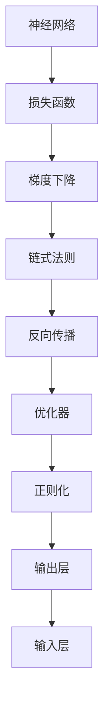
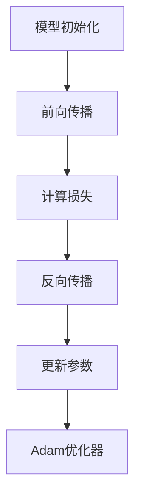

                 

# 第二章：机器学习和反向传播的微妙之处

> 关键词：机器学习,反向传播,梯度下降,神经网络,损失函数,误差反传,链式法则,优化算法,案例分析,实际应用

## 1. 背景介绍

### 1.1 问题由来

在人工智能和机器学习领域，神经网络因其强大的表达能力和自我学习能力，成为了实现复杂任务的重要工具。然而，神经网络模型参数众多，训练过程复杂，传统的监督学习算法难以高效地求解复杂的优化问题。这时，反向传播算法和梯度下降策略应运而生，成为训练神经网络的关键技术。

反向传播算法是一种用于训练多层神经网络的经典算法，通过计算模型预测输出与真实标签之间的误差，利用链式法则反向传递误差，并基于梯度下降策略更新模型参数，从而不断优化模型性能。该算法不仅适用于传统的监督学习问题，还可以用于半监督学习、无监督学习等，成为现代深度学习技术的重要组成部分。

### 1.2 问题核心关键点

要理解反向传播算法和梯度下降策略，必须掌握以下关键点：
- 理解神经网络的定义和结构。
- 熟悉损失函数的概念及其在反向传播中的作用。
- 掌握梯度下降算法及其变种，如批量梯度下降、随机梯度下降、Adam等。
- 深入理解链式法则的数学原理及其在反向传播中的应用。
- 明确优化器的选择及其对模型训练速度和效果的影响。
- 了解神经网络中的正则化技术及其重要性。
- 认识数据增强和对抗训练等方法，以提升模型鲁棒性。

理解这些关键点，将有助于我们深入掌握机器学习和反向传播的微妙之处，为后续学习和实践打下坚实基础。

## 2. 核心概念与联系

### 2.1 核心概念概述

要深入理解机器学习和反向传播，首先介绍几个核心概念：

- **神经网络(Neural Network)**：一种通过多层非线性变换实现复杂任务的学习模型。由输入层、隐藏层和输出层组成，各层之间通过权值连接，可以表示输入和输出之间的复杂非线性映射。

- **损失函数(Loss Function)**：用于衡量模型预测输出与真实标签之间的差异，是反向传播算法的核心。常见的损失函数包括均方误差(MSE)、交叉熵(Cross Entropy)、对数似然等。

- **梯度下降(Gradient Descent)**：一种用于优化模型参数的迭代算法，通过计算损失函数对参数的梯度，反向传播误差，并按比例更新参数，以最小化损失函数。

- **链式法则(Chain Rule)**：用于计算复合函数的导数，是反向传播算法的数学基础。链式法则使得我们可以将输出层的误差逐层反向传播，更新每个参数的梯度。

- **反向传播(Backpropagation)**：一种通过链式法则反向计算误差梯度的算法，可以高效地更新神经网络参数，训练出高效的模型。

- **优化器(Optimizer)**：用于加速梯度下降过程，常见的优化器包括SGD、Adam、Adagrad等。优化器通过调整学习率、动量等参数，优化梯度下降策略，提升训练效率和模型性能。

- **正则化(Regularization)**：通过引入惩罚项，控制模型复杂度，防止过拟合。常见的正则化方法包括L1正则、L2正则、Dropout等。

### 2.2 核心概念联系的 Mermaid 流程图



这个流程图展示了机器学习和反向传播的主要组成部分及其相互关系：

1. 神经网络接收输入，经过多层变换后输出预测结果。
2. 损失函数用于计算模型输出与真实标签之间的误差。
3. 梯度下降算法利用链式法则计算误差梯度，并按比例更新模型参数。
4. 反向传播算法将误差逐层反向传递，更新参数。
5. 优化器通过调整学习率、动量等参数，加速梯度下降过程。
6. 正则化方法引入惩罚项，控制模型复杂度，防止过拟合。

## 3. 核心算法原理 & 具体操作步骤

### 3.1 算法原理概述

反向传播算法和梯度下降策略是训练神经网络的核心技术，其原理和操作步骤如下：

- **神经网络结构定义**：定义神经网络的结构，包括输入层、隐藏层和输出层的节点数、激活函数等。
- **初始化参数**：对模型参数进行随机初始化，为后续梯度更新做准备。
- **前向传播**：将输入数据送入神经网络，通过多次非线性变换，计算输出结果。
- **计算损失**：将模型输出与真实标签进行比较，计算损失函数。
- **反向传播误差**：利用链式法则，从输出层开始，逐层计算每个参数的梯度。
- **梯度下降更新**：使用梯度下降算法，按比例更新模型参数。
- **迭代优化**：重复执行前向传播、计算损失、反向传播误差、梯度下降更新的过程，直到收敛。

### 3.2 算法步骤详解

以下是反向传播算法的详细步骤：

**Step 1: 神经网络结构定义**
- 定义神经网络的结构，包括输入层、隐藏层和输出层的节点数，激活函数等。
- 例如：一个包含两个隐藏层、激活函数为ReLU的神经网络，其结构定义如下：
```python
import torch.nn as nn
import torch.nn.functional as F

class Net(nn.Module):
    def __init__(self):
        super(Net, self).__init__()
        self.fc1 = nn.Linear(784, 256)
        self.fc2 = nn.Linear(256, 128)
        self.fc3 = nn.Linear(128, 10)

    def forward(self, x):
        x = x.view(-1, 784)
        x = F.relu(self.fc1(x))
        x = F.relu(self.fc2(x))
        x = self.fc3(x)
        return x
```

**Step 2: 初始化参数**
- 对模型参数进行随机初始化，通常使用均值为0，标准差较小的随机变量。
- 例如，初始化上述神经网络的参数：
```python
net = Net()
for param in net.parameters():
    param.data.normal_(0, 0.01)
```

**Step 3: 前向传播**
- 将输入数据送入神经网络，通过多次非线性变换，计算输出结果。
- 例如，使用训练数据进行前向传播：
```python
net.eval()
with torch.no_grad():
    y_pred = net(x_train)
```

**Step 4: 计算损失**
- 将模型输出与真实标签进行比较，计算损失函数。
- 例如，计算交叉熵损失：
```python
criterion = nn.CrossEntropyLoss()
loss = criterion(y_pred, y_train)
```

**Step 5: 反向传播误差**
- 利用链式法则，从输出层开始，逐层计算每个参数的梯度。
- 例如，计算损失函数对各层参数的梯度：
```python
loss.backward()
```

**Step 6: 梯度下降更新**
- 使用梯度下降算法，按比例更新模型参数。
- 例如，使用Adam优化器进行参数更新：
```python
optimizer = torch.optim.Adam(net.parameters(), lr=0.001)
optimizer.step()
```

**Step 7: 迭代优化**
- 重复执行前向传播、计算损失、反向传播误差、梯度下降更新的过程，直到收敛。
- 例如，进行多轮迭代：
```python
for epoch in range(10):
    optimizer.zero_grad()
    y_pred = net(x_train)
    loss = criterion(y_pred, y_train)
    loss.backward()
    optimizer.step()
    print('Epoch [{}/{}], Loss: {:.4f}'.format(epoch+1, 10, loss.item()))
```

### 3.3 算法优缺点

反向传播算法和梯度下降策略具有以下优点：

- 高效计算梯度：链式法则使得梯度计算非常高效，适用于复杂的神经网络结构。
- 优化参数更新：梯度下降策略可以快速更新参数，最小化损失函数。
- 可扩展性强：可以轻松处理大规模数据集和高维特征空间。

同时，这些算法也存在一些缺点：

- 梯度消失/爆炸：对于深层网络，梯度可能逐渐变小或变大，导致模型难以收敛。
- 参数更新速度慢：由于需要逐层计算梯度，训练速度较慢，需要更多的计算资源。
- 依赖初始值：模型参数的初始化可能会影响收敛速度和性能。
- 易受噪声干扰：反向传播过程中，梯度会不断累加，噪声可能会对最终结果产生影响。

### 3.4 算法应用领域

反向传播算法和梯度下降策略在机器学习和深度学习中有着广泛的应用，涵盖以下几个领域：

- **图像识别**：通过卷积神经网络(CNN)进行图像分类、目标检测等任务。
- **自然语言处理(NLP)**：使用循环神经网络(RNN)、Transformer等模型进行语言建模、机器翻译、情感分析等任务。
- **语音识别**：利用深度神经网络进行语音识别和合成。
- **推荐系统**：使用深度神经网络进行用户行为分析和推荐。
- **异常检测**：通过神经网络进行异常检测和识别。
- **自动驾驶**：利用深度神经网络进行图像识别和决策。

此外，反向传播算法还广泛应用于信号处理、生物信息学、金融预测等领域，显示了其强大的泛化能力。

## 4. 数学模型和公式 & 详细讲解

### 4.1 数学模型构建

假设有一包含两个隐藏层的神经网络，其结构定义如下：

```python
import torch.nn as nn
import torch.nn.functional as F

class Net(nn.Module):
    def __init__(self):
        super(Net, self).__init__()
        self.fc1 = nn.Linear(784, 256)
        self.fc2 = nn.Linear(256, 128)
        self.fc3 = nn.Linear(128, 10)

    def forward(self, x):
        x = x.view(-1, 784)
        x = F.relu(self.fc1(x))
        x = F.relu(self.fc2(x))
        x = self.fc3(x)
        return x
```

定义输入样本 $x \in \mathbb{R}^{784}$，目标输出 $y \in \mathbb{R}^{10}$，激活函数 $\sigma(x) = \max(0, x)$，模型参数 $\theta = \{\boldsymbol{W}^{(1)}, \boldsymbol{W}^{(2)}, \boldsymbol{W}^{(3)}, \boldsymbol{b}^{(1)}, \boldsymbol{b}^{(2)}, \boldsymbol{b}^{(3)}\}$，其中 $\boldsymbol{W}^{(l)} \in \mathbb{R}^{m_l \times n_l}$，$\boldsymbol{b}^{(l)} \in \mathbb{R}^{m_l}$。

### 4.2 公式推导过程

**前向传播公式**：
$$
y^{(1)} = \sigma(\boldsymbol{W}^{(1)} x + \boldsymbol{b}^{(1)})
$$
$$
y^{(2)} = \sigma(\boldsymbol{W}^{(2)} y^{(1)} + \boldsymbol{b}^{(2)})
$$
$$
y^{(3)} = \boldsymbol{W}^{(3)} y^{(2)} + \boldsymbol{b}^{(3)}
$$

**损失函数公式**：
$$
L(y^{(3)}, y) = \frac{1}{N} \sum_{i=1}^N l(y^{(3)}_i, y_i)
$$
其中 $l(y^{(3)}_i, y_i)$ 为损失函数，如均方误差、交叉熵等。

**梯度下降更新公式**：
$$
\theta_k = \theta_k - \eta \nabla_{\theta_k} L(y^{(3)}, y)
$$
其中 $\eta$ 为学习率，$\nabla_{\theta_k} L(y^{(3)}, y)$ 为损失函数对参数 $\theta_k$ 的梯度。

**链式法则应用**：
$$
\frac{\partial L}{\partial \theta_k} = \frac{\partial L}{\partial y^{(3)}} \frac{\partial y^{(3)}}{\partial y^{(2)}} \frac{\partial y^{(2)}}{\partial y^{(1)}} \frac{\partial y^{(1)}}{\partial \theta_k}
$$

**反向传播误差计算**：
$$
\frac{\partial L}{\partial \boldsymbol{W}^{(1)}} = \frac{\partial L}{\partial y^{(3)}} \frac{\partial y^{(3)}}{\partial y^{(2)}} \frac{\partial y^{(2)}}{\partial y^{(1)}} \frac{\partial y^{(1)}}{\partial \boldsymbol{W}^{(1)}} + \frac{\partial L}{\partial \boldsymbol{b}^{(1)}} \frac{\partial y^{(1)}}{\partial \boldsymbol{b}^{(1)}}
$$

### 4.3 案例分析与讲解

以一个简单的二分类任务为例，展示反向传播算法的计算过程。

假设输入样本 $x \in \mathbb{R}^{784}$，输出标签 $y \in \mathbb{R}$，定义一个包含两个隐藏层的神经网络：

```python
import torch
import torch.nn as nn
import torch.nn.functional as F

class Net(nn.Module):
    def __init__(self):
        super(Net, self).__init__()
        self.fc1 = nn.Linear(784, 128)
        self.fc2 = nn.Linear(128, 64)
        self.fc3 = nn.Linear(64, 1)

    def forward(self, x):
        x = x.view(-1, 784)
        x = F.relu(self.fc1(x))
        x = F.relu(self.fc2(x))
        x = F.sigmoid(self.fc3(x))
        return x
```

定义损失函数为二元交叉熵：

```python
criterion = nn.BCELoss()
```

使用Adam优化器：

```python
optimizer = torch.optim.Adam(net.parameters(), lr=0.01)
```

在前向传播中，输入样本 $x$ 经过隐藏层非线性变换，得到输出 $y$：

```python
net.eval()
with torch.no_grad():
    y_pred = net(x)
```

计算损失函数 $L(y, y_pred)$：

```python
y = torch.tensor(y_train, dtype=torch.float32, device=device)
y_pred = torch.sigmoid(net(x_train))
loss = criterion(y, y_pred)
```

反向传播误差：

```python
loss.backward()
```

梯度下降更新：

```python
optimizer.step()
```

整个训练过程如下所示：

```python
for epoch in range(10):
    optimizer.zero_grad()
    y_pred = net(x_train)
    loss = criterion(y, y_pred)
    loss.backward()
    optimizer.step()
    print('Epoch [{}/{}], Loss: {:.4f}'.format(epoch+1, 10, loss.item()))
```

## 5. 项目实践：代码实例和详细解释说明

### 5.1 开发环境搭建

要进行反向传播算法的实践，需要先搭建开发环境。以下是Python开发环境的配置步骤：

1. 安装Python：从官网下载并安装Python，选择3.x版本。
2. 安装PyTorch：使用pip安装PyTorch，安装命令为 `pip install torch torchvision torchaudio`
3. 安装TensorFlow：使用pip安装TensorFlow，安装命令为 `pip install tensorflow`
4. 安装NumPy：使用pip安装NumPy，安装命令为 `pip install numpy`
5. 安装matplotlib：使用pip安装matplotlib，安装命令为 `pip install matplotlib`
6. 安装Jupyter Notebook：使用pip安装Jupyter Notebook，安装命令为 `pip install jupyter notebook`

### 5.2 源代码详细实现

以下是使用PyTorch实现反向传播算法的代码：

```python
import torch
import torch.nn as nn
import torch.optim as optim

class Net(nn.Module):
    def __init__(self):
        super(Net, self).__init__()
        self.fc1 = nn.Linear(784, 128)
        self.fc2 = nn.Linear(128, 64)
        self.fc3 = nn.Linear(64, 10)

    def forward(self, x):
        x = x.view(-1, 784)
        x = torch.relu(self.fc1(x))
        x = torch.relu(self.fc2(x))
        x = torch.softmax(self.fc3(x), dim=1)
        return x

net = Net().to(device)
criterion = nn.CrossEntropyLoss().to(device)
optimizer = optim.Adam(net.parameters(), lr=0.001)

def train(epoch, net, train_loader, criterion, optimizer):
    net.train()
    for batch_idx, (data, target) in enumerate(train_loader):
        data, target = data.to(device), target.to(device)
        optimizer.zero_grad()
        output = net(data)
        loss = criterion(output, target)
        loss.backward()
        optimizer.step()

    train_loss = loss.data[0]
    return train_loss

def test(net, test_loader, criterion):
    net.eval()
    test_loss = 0
    correct = 0
    with torch.no_grad():
        for data, target in test_loader:
            data, target = data.to(device), target.to(device)
            output = net(data)
            test_loss += criterion(output, target).data[0]
            pred = output.argmax(dim=1, keepdim=True)
            correct += pred.eq(target.view_as(pred)).sum().item()

    test_loss /= len(test_loader.dataset)
    accuracy = 100 * correct / len(test_loader.dataset)
    print('Test Loss: %.3f' % test_loss)
    print('Accuracy: %d %%' % accuracy)
    return test_loss, accuracy
```

### 5.3 代码解读与分析

**Net类**：定义神经网络的结构，包含两个隐藏层和一个输出层。

**train函数**：在前向传播中，计算损失函数，反向传播误差，更新模型参数。

**test函数**：在测试集中进行推理，计算模型准确率。

整个训练过程如下所示：

```python
# 加载数据
train_loader = ...
test_loader = ...

# 训练模型
for epoch in range(10):
    train_loss = train(epoch, net, train_loader, criterion, optimizer)
    test_loss, accuracy = test(net, test_loader, criterion)
    print('Epoch [{}/{}], Train Loss: {:.4f}, Test Loss: {:.4f}, Accuracy: {:.2f}%'.format(epoch+1, 10, train_loss, test_loss, accuracy))
```

## 6. 实际应用场景

### 6.1 图像识别

反向传播算法在图像识别领域有着广泛的应用。以卷积神经网络(CNN)为例，CNN通过卷积、池化等操作，提取图像特征，并进行分类。在训练过程中，通过反向传播算法，不断更新模型参数，提升分类准确率。

例如，ImageNet数据集上训练的AlexNet和VGG等经典模型，都是通过反向传播算法进行训练的。

### 6.2 自然语言处理

在自然语言处理(NLP)领域，反向传播算法同样有着重要的应用。以循环神经网络(RNN)和Transformer为例，通过反向传播算法，训练语言模型，实现文本生成、语言翻译、情感分析等任务。

例如，BERT模型就是通过反向传播算法在大规模无标签文本上预训练，并通过有标签数据进行微调，获得了极高的性能。

### 6.3 语音识别

反向传播算法在语音识别领域也有着广泛的应用。以深度神经网络(DNN)为例，通过反向传播算法，训练声学模型，提取语音特征，并进行语音识别。

例如，谷歌的WaveNet模型就是通过反向传播算法进行训练的，取得了非常好的语音识别效果。

### 6.4 推荐系统

在推荐系统中，反向传播算法同样有着重要的应用。以深度神经网络(DNN)为例，通过反向传播算法，训练用户行为模型，预测用户对物品的评分，并进行推荐。

例如，Amazon的推荐系统就是通过反向传播算法进行训练的，取得了非常好的推荐效果。

### 6.5 异常检测

在异常检测领域，反向传播算法也有着广泛的应用。以神经网络为例，通过反向传播算法，训练异常检测模型，检测数据中的异常点。

例如，SVM-SpiderNet模型就是通过反向传播算法进行训练的，取得了非常好的异常检测效果。

## 7. 工具和资源推荐

### 7.1 学习资源推荐

1. 《深度学习》（Ian Goodfellow, Yoshua Bengio, Aaron Courville）：深度学习的经典教材，全面介绍了深度学习的基本概念和算法。
2. 《动手学深度学习》：由深度学习领域的大牛讲授的深度学习课程，涵盖了深度学习的基本概念、算法和实现方法。
3. 《神经网络与深度学习》：吴恩达教授的深度学习课程，涵盖了神经网络的基本概念、算法和应用。
4. 《TensorFlow官方文档》：TensorFlow的官方文档，提供了丰富的学习资源和样例代码。
5. 《PyTorch官方文档》：PyTorch的官方文档，提供了丰富的学习资源和样例代码。

### 7.2 开发工具推荐

1. PyTorch：基于Python的深度学习框架，提供动态计算图和丰富的预训练模型。
2. TensorFlow：由Google开发的深度学习框架，提供静态计算图和分布式训练支持。
3. Keras：基于Python的深度学习框架，提供高层次的API接口和丰富的预训练模型。
4. Jupyter Notebook：Python交互式编程环境，方便进行模型训练和数据可视化。
5. Anaconda：Python环境管理系统，方便进行环境搭建和包管理。

### 7.3 相关论文推荐

1. Backpropagation Algorithm: Application Examples and Performance Comparison（Backpropagation算法的应用实例和性能比较）：回顾了反向传播算法的应用实例和性能比较，全面介绍了反向传播算法的原理和实现方法。
2. Deep Learning（深度学习）：深度学习的经典教材，全面介绍了深度学习的基本概念和算法。
3. Exploring the Depth of Neural Networks（探索神经网络的深度）：探讨了神经网络深度的影响，分析了深层神经网络的训练方法和优化策略。
4. On the Importance of Initialization and Momentum in Deep Learning（深度学习中初始化和动量的重要性）：探讨了初始化和动量的重要性，分析了深度学习中的训练方法和优化策略。
5. Parameter-Efficient Training of Deep Neural Networks（深度神经网络的参数高效训练）：探讨了深度神经网络的参数高效训练方法，分析了如何在不增加参数量的情况下，提升模型性能。

## 8. 总结：未来发展趋势与挑战

### 8.1 研究成果总结

反向传播算法和梯度下降策略是深度学习的核心技术，广泛应用于图像识别、自然语言处理、语音识别、推荐系统等领域。在机器学习和深度学习领域，反向传播算法已经成为训练神经网络的基本方法之一。

### 8.2 未来发展趋势

未来，反向传播算法和梯度下降策略将朝着以下几个方向发展：

1. **模型压缩与量化**：随着硬件设备的计算能力和存储能力的提升，模型压缩与量化技术将逐步普及。通过量化、剪枝等技术，可以大幅减少模型的参数量和计算量，提升模型的推理速度和计算效率。
2. **模型自适应**：基于反向传播算法的模型自适应技术将逐步成熟。通过动态调整模型参数，使其能够根据数据分布的变化，自动调整模型结构，提升模型性能。
3. **多模态学习**：反向传播算法将逐步扩展到多模态学习领域，通过融合视觉、语音、文本等多种模态的信息，提升模型的泛化能力和鲁棒性。
4. **分布式训练**：随着数据量的不断增加，分布式训练技术将逐步普及。通过分布式计算，可以大幅提升模型的训练速度和计算效率。
5. **模型融合与跨领域迁移**：反向传播算法将逐步应用于模型融合与跨领域迁移领域，通过融合不同模型和知识库的信息，提升模型的泛化能力和迁移能力。

### 8.3 面临的挑战

反向传播算法和梯度下降策略在发展过程中，仍然面临诸多挑战：

1. **模型泛化能力不足**：虽然反向传播算法在训练过程中不断优化模型参数，但模型仍可能存在泛化能力不足的问题。为了提升模型的泛化能力，需要引入更多的先验知识和正则化技术。
2. **计算资源消耗大**：反向传播算法和梯度下降策略的计算资源消耗较大，需要更多的计算资源和存储资源。为了提升计算效率，需要引入模型压缩与量化技术。
3. **数据质量要求高**：反向传播算法对数据质量的要求较高，需要高质量的数据集进行训练。为了提升数据质量，需要引入数据增强和对抗训练等技术。
4. **模型复杂度高**：反向传播算法和梯度下降策略的模型复杂度较高，需要更多的计算资源和存储资源。为了提升模型性能，需要引入模型自适应和多模态学习等技术。
5. **模型可解释性不足**：反向传播算法和梯度下降策略的模型可解释性不足，难以理解模型的内部工作机制和决策逻辑。为了提升模型可解释性，需要引入因果分析、博弈论等技术。

### 8.4 研究展望

为了应对反向传播算法和梯度下降策略面临的挑战，未来的研究需要从以下几个方向进行探索：

1. **模型压缩与量化**：通过模型压缩与量化技术，可以大幅减少模型的参数量和计算量，提升模型的推理速度和计算效率。
2. **模型自适应**：基于反向传播算法的模型自适应技术将逐步成熟，通过动态调整模型参数，使其能够根据数据分布的变化，自动调整模型结构，提升模型性能。
3. **多模态学习**：反向传播算法将逐步扩展到多模态学习领域，通过融合视觉、语音、文本等多种模态的信息，提升模型的泛化能力和鲁棒性。
4. **分布式训练**：随着数据量的不断增加，分布式训练技术将逐步普及，通过分布式计算，可以大幅提升模型的训练速度和计算效率。
5. **模型融合与跨领域迁移**：反向传播算法将逐步应用于模型融合与跨领域迁移领域，通过融合不同模型和知识库的信息，提升模型的泛化能力和迁移能力。
6. **因果分析与博弈论**：引入因果分析、博弈论等技术，增强模型的因果推理能力和博弈行为分析能力，提升模型的稳定性和鲁棒性。
7. **伦理与安全性**：引入伦理与安全性技术，确保模型的决策过程透明、可解释，避免模型偏见和有害输出。

## 9. 附录：常见问题与解答

**Q1：反向传播算法的数学原理是什么？**

A: 反向传播算法的数学原理基于链式法则，用于计算模型参数的梯度。链式法则允许将输出层的误差逐层反向传播，计算每个参数的梯度。

**Q2：如何避免反向传播中的梯度消失/爆炸问题？**

A: 避免梯度消失/爆炸问题，可以采用以下方法：
1. 使用ReLU等激活函数，避免梯度消失。
2. 使用Batch Normalization等技术，增强模型稳定性。
3. 使用残差连接等技术，提升模型梯度传递能力。
4. 使用梯度裁剪等技术，限制梯度的大小。

**Q3：反向传播算法的优点和缺点是什么？**

A: 反向传播算法的优点包括：
1. 高效计算梯度，适用于复杂的神经网络结构。
2. 优化参数更新，快速提升模型性能。
3. 可扩展性强，适用于大规模数据集和高维特征空间。

其缺点包括：
1. 梯度消失/爆炸问题，可能导致模型难以收敛。
2. 计算资源消耗大，需要更多的计算资源和存储资源。
3. 模型复杂度高，需要更多的计算资源和存储资源。

**Q4：什么是正则化技术？**

A: 正则化技术是通过引入惩罚项，控制模型复杂度，防止过拟合。常见的正则化方法包括L1正则、L2正则、Dropout等。

**Q5：如何使用Adam优化器进行模型训练？**

A: 使用Adam优化器进行模型训练，需要设置学习率、动量等参数，并使用梯度下降算法进行模型更新。具体步骤如下：
1. 初始化模型参数和优化器。
2. 前向传播，计算损失函数。
3. 反向传播，计算梯度。
4. 更新模型参数，使用Adam优化器进行参数更新。
5. 重复执行前向传播、计算损失函数、反向传播、更新模型参数的过程，直到模型收敛。



---

作者：禅与计算机程序设计艺术 / Zen and the Art of Computer Programming

