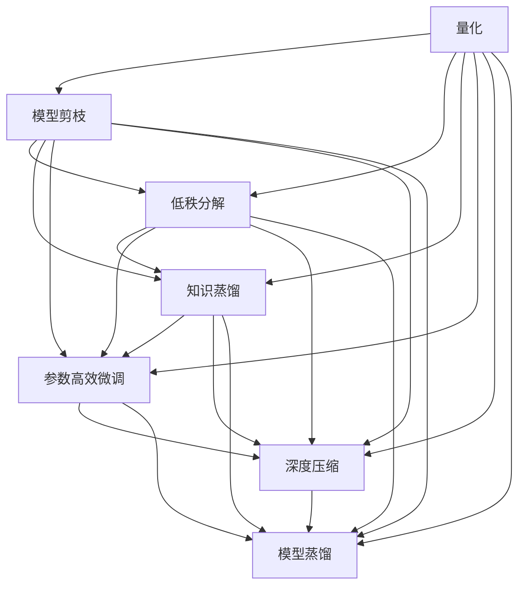

                 

# 第十三章：量化和模型压缩

## 1. 背景介绍

在现代深度学习实践中，由于大规模模型如Transformer的涌现，模型压缩与量化技术越来越受到关注。随着模型参数量的不断增长，如何在保持性能的同时减少计算和存储开销，成为一个重要的研究方向。

### 1.1 问题由来

近年来，深度学习模型的参数规模急剧膨胀，使得训练和推理阶段的计算资源消耗和存储需求也大幅上升。这对模型的可扩展性、训练效率和部署灵活性提出了巨大挑战。以Transformer模型为例，其典型参数规模可达 billions，在移动设备和边缘计算等资源受限场景中难以直接应用。

### 1.2 问题核心关键点

量化与模型压缩的核心目标是通过一系列技术手段，在显著减小模型规模的同时，尽可能不损失模型性能。常用的方法包括：

- **量化**：将浮点数参数转换为更小范围的整数或定点数，减少存储空间，加速计算过程。
- **模型剪枝**：通过移除模型中冗余或无用的参数和层，减小模型规模，降低计算量。
- **低秩分解**：将模型参数分解为更低秩的形式，减少参数量同时保留核心信息。
- **知识蒸馏**：通过迁移学习或细粒度知识蒸馏，使用小模型学习大模型的知识，减小模型规模。

量化和模型压缩技术在加速模型部署、提升模型效率方面发挥了重要作用，同时也有利于模型在移动设备、嵌入式系统等资源有限环境中的应用。

## 2. 核心概念与联系

### 2.1 核心概念概述

- **量化(Quantization)**：指将浮点数参数转换为更小范围的整数或定点数，以减少存储和计算开销，同时保持模型性能。

- **模型剪枝(Pruning)**：指移除模型中冗余或无用的参数和层，减小模型规模，降低计算量。

- **低秩分解(Low-Rank Decomposition)**：指将模型参数分解为更低秩的形式，减少参数量同时保留核心信息。

- **知识蒸馏(Distillation)**：通过迁移学习或细粒度知识蒸馏，使用小模型学习大模型的知识，减小模型规模。

- **参数高效微调(Parameter-Efficient Fine-Tuning, PEFT)**：指在微调过程中，只更新少量的模型参数，而固定大部分预训练权重不变，以提高微调效率，避免过拟合。

- **深度压缩(Deep Compression)**：指通过模型剪枝、量化等技术，综合提升模型效率，减少计算和存储资源消耗。

- **模型蒸馏(Distillation)**：指将大模型的知识通过蒸馏传递给小模型，提高小模型的泛化能力，减小模型规模。

这些核心概念之间的逻辑关系可以通过以下Mermaid流程图来展示：



这个流程图展示了量化和模型压缩的核心概念及其之间的关系：

1. 量化和模型剪枝是减少模型规模的关键技术。
2. 低秩分解和知识蒸馏是进一步压缩模型的方法。
3. 参数高效微调和深度压缩是提高微调效率的手段。
4. 模型蒸馏是将大模型知识传递给小模型，实现模型压缩的方法。

这些概念共同构成了模型压缩和量化技术的基础，使其能够显著提升模型的计算效率和部署灵活性。

## 3. 核心算法原理 & 具体操作步骤

### 3.1 算法原理概述

量化和模型压缩的根本原理是减小模型参数的计算和存储开销，同时保持模型性能。通过一系列技术手段，可以有效地减少模型参数量，提升模型运行速度和资源利用率。

量化算法的基本思想是将浮点数参数映射到更小范围的整数或定点数。这可以通过直方图剪枝、范围量化、线性量化等方式实现。具体而言，可以将原始浮点数参数的取值范围分为若干个整数区间，每个区间映射到一个整数，从而将浮点数参数转换为整数参数。

模型剪枝则是指通过移除模型中冗余或无用的参数和层，减小模型规模。剪枝可以分为结构化剪枝和无结构化剪枝两类。结构化剪枝基于对模型结构的分析，如删除整个层、删除特定通道等，而无结构化剪枝则直接删除模型中权重值较小的参数或层。

低秩分解和知识蒸馏则是在模型剪枝的基础上进一步提升模型压缩效果的技巧。低秩分解通过将高维参数矩阵分解为低秩矩阵，减小模型规模。知识蒸馏通过使用小模型学习大模型的知识，减小模型规模，同时保持性能。

### 3.2 算法步骤详解

量化和模型压缩的具体步骤可以分为以下几个方面：

**Step 1: 准备原始模型和数据集**

- 选择待压缩的原始模型，如BERT、GPT等。
- 准备数据集，用于模型评估和测试。

**Step 2: 量化算法**

- 选择量化方法，如直方图剪枝、范围量化、线性量化等。
- 对模型参数进行量化处理，将浮点数参数转换为整数或定点数。
- 评估量化后的模型性能，确保量化效果不显著影响模型性能。

**Step 3: 模型剪枝**

- 选择剪枝方法，如结构化剪枝、无结构化剪枝等。
- 移除模型中权重值较小的参数或层。
- 评估剪枝后的模型性能，确保剪枝效果不显著影响模型性能。

**Step 4: 低秩分解**

- 选择低秩分解方法，如奇异值分解、主成分分析等。
- 对模型参数进行低秩分解，减小模型规模。
- 评估分解后的模型性能，确保分解效果不显著影响模型性能。

**Step 5: 知识蒸馏**

- 选择知识蒸馏方法，如单任务蒸馏、多任务蒸馏、微蒸馏等。
- 使用小模型学习大模型的知识，减小模型规模。
- 评估蒸馏后的模型性能，确保蒸馏效果不显著影响模型性能。

**Step 6: 参数高效微调**

- 在剪枝、量化等压缩技术的基础上，使用参数高效微调技术。
- 只更新少量的模型参数，而固定大部分预训练权重不变。
- 评估微调后的模型性能，确保微调效果不显著影响模型性能。

**Step 7: 深度压缩**

- 综合应用量化、剪枝、低秩分解、知识蒸馏等技术，减小模型规模。
- 评估深度压缩后的模型性能，确保压缩效果不显著影响模型性能。

**Step 8: 模型部署**

- 将深度压缩后的模型部署到目标设备或系统中。
- 使用优化工具进一步提高模型运行效率。

### 3.3 算法优缺点

量化和模型压缩技术具有以下优点：

- **提升效率**：显著减小模型规模，减少计算和存储开销，提升模型运行速度。
- **降低成本**：降低对高性能计算资源和存储资源的需求，减少开发和部署成本。
- **增强灵活性**：使模型更易于在移动设备、嵌入式系统等资源受限环境中应用。

同时，这些技术也存在一些局限性：

- **性能损失**：量化和压缩可能导致模型性能略微下降，特别是在精度要求较高的场景中。
- **复杂度增加**：量化和压缩技术的设计和实现较为复杂，需要一定的技术积累。
- **可解释性降低**：压缩后的模型参数形式可能更加抽象，可解释性降低。

尽管存在这些局限性，量化和模型压缩技术仍是现代深度学习发展的重要方向，能够有效提升模型部署和运行的效率，为大规模应用提供支撑。

### 3.4 算法应用领域

量化和模型压缩技术广泛应用于各种场景中，如移动端应用、嵌入式设备、云计算等。以下是一些典型应用领域：

- **移动端应用**：在移动设备上部署深度学习模型，需要考虑计算资源和存储空间的限制。量化和模型压缩技术能够显著减小模型规模，提升模型运行效率，满足移动设备的应用需求。

- **嵌入式设备**：在嵌入式设备上运行深度学习模型，需要考虑计算资源和存储空间的限制。量化和模型压缩技术能够显著减小模型规模，提升模型运行效率，满足嵌入式设备的应用需求。

- **云计算**：在云平台上部署深度学习模型，需要考虑计算资源和存储空间的成本。量化和模型压缩技术能够显著减小模型规模，降低计算和存储成本，提升云平台的资源利用率。

## 4. 数学模型和公式 & 详细讲解 & 举例说明

### 4.1 数学模型构建

量化和模型压缩的数学模型主要涉及模型参数的量化、剪枝和低秩分解。以下将通过数学公式对这些问题进行详细讲解。

设原始模型参数为 $\theta \in \mathbb{R}^d$，量化后的参数为 $\theta' \in \mathbb{Z}$，其中 $\mathbb{Z}$ 为整数集。量化过程可以表示为：

$$
\theta' = \text{Quantize}(\theta)
$$

其中 $\text{Quantize}$ 为量化函数，将浮点数参数 $\theta$ 映射为整数参数 $\theta'$。量化函数的选择对量化效果和模型性能有重要影响。常见的量化方法包括直方图剪枝、范围量化、线性量化等。

### 4.2 公式推导过程

**直方图量化**

直方图量化是一种常见的量化方法，它将浮点数参数映射到离散的量化区间中。假设有 $k$ 个量化区间，量化后的参数为 $k$ 维向量。设每个区间的量化值分别为 $\{q_0, q_1, ..., q_{k-1}\}$，量化函数的定义为：

$$
\theta'_i = \text{Quantize}(\theta_i) = \arg\min_{q_j} \sum_{i=0}^{k-1} |\theta_i - q_j|^2
$$

其中 $|\cdot|$ 为绝对值函数，$\arg\min$ 表示在 $q_j$ 中寻找最小值。

**线性量化**

线性量化是一种将浮点数参数映射为线性量化码的常用方法。假设参数范围为 $[\alpha, \beta]$，量化步长为 $\delta$，量化后的参数为 $q \in \mathbb{Z}$。量化函数的定义为：

$$
q = \text{Quantize}(\theta) = \text{round}\left(\frac{\theta - \alpha}{\delta}\right)
$$

其中 $\text{round}$ 为四舍五入函数，$\alpha$ 和 $\beta$ 为参数范围的下限和上限，$\delta$ 为量化步长。

### 4.3 案例分析与讲解

假设有一个简单的全连接神经网络，其中包含两个全连接层和一个输出层。每个层包含 $n=1024$ 个神经元，每个神经元的权重为 $w \in \mathbb{R}$。如果我们将每个权重进行线性量化，量化步长为 $\delta=0.1$，则量化后的权重 $w'$ 为：

$$
w' = \text{Quantize}(w) = \text{round}\left(\frac{w}{\delta}\right)
$$

其中 $w \in [\alpha, \beta]$，$\delta=0.1$。以一个具体的权重为例，假设 $w=0.3$，则：

$$
w' = \text{Quantize}(0.3) = \text{round}\left(\frac{0.3}{0.1}\right) = \text{round}(3) = 3
$$

对于模型剪枝，我们以结构化剪枝为例。假设有一个包含两个卷积层的神经网络，其中每个卷积层包含 $n=256$ 个卷积核，每个核的大小为 $3\times 3$。如果我们选择结构化剪枝，将权重值小于 $0.1$ 的卷积核全部剪除，则剪枝后的模型参数量将大幅减小。假设原始模型参数量为 $N$，剪枝后模型参数量为 $N'$，则：

$$
N' = \sum_{i=1}^{256} \sum_{j=1}^{256} n_i n_j \text{Pr}(\text{剪枝后第 } i \text{ 核、第 } j \text{ 核仍参与计算}) \approx \frac{N}{1-\text{Pr}(剪枝)}
$$

其中 $\text{Pr}(剪枝)$ 为卷积核被剪除的概率。如果 $\text{Pr}(剪枝)=0.1$，则剪枝后的模型参数量将减少 $9$ 倍。

## 5. 项目实践：代码实例和详细解释说明

### 5.1 开发环境搭建

在进行量化和模型压缩的实践前，我们需要准备好开发环境。以下是使用Python进行PyTorch开发的环境配置流程：

1. 安装Anaconda：从官网下载并安装Anaconda，用于创建独立的Python环境。

2. 创建并激活虚拟环境：
```bash
conda create -n pytorch-env python=3.8 
conda activate pytorch-env
```

3. 安装PyTorch：根据CUDA版本，从官网获取对应的安装命令。例如：
```bash
conda install pytorch torchvision torchaudio cudatoolkit=11.1 -c pytorch -c conda-forge
```

4. 安装Transformers库：
```bash
pip install transformers
```

5. 安装各类工具包：
```bash
pip install numpy pandas scikit-learn matplotlib tqdm jupyter notebook ipython
```

完成上述步骤后，即可在`pytorch-env`环境中开始量化和模型压缩的实践。

### 5.2 源代码详细实现

下面我们以BERT模型为例，给出使用Transformers库对BERT模型进行量化和模型压缩的PyTorch代码实现。

首先，定义量化函数：

```python
import torch
from torch.nn import functional as F

def quantize_layer(layer, qscale, qzero, quantize=True):
    if quantize:
        if isinstance(layer, torch.nn.Linear):
            weight = F.linear_weight_norm(layer.weight)
            weight_q = quantize_weight(weight, qscale, qzero)
            layer.weight = weight_q
        elif isinstance(layer, torch.nn.Conv2d):
            weight = F.conv2d_weight_norm(layer.weight)
            weight_q = quantize_weight(weight, qscale, qzero)
            layer.weight = weight_q
    return layer

def quantize_weight(weight, qscale, qzero):
    if isinstance(weight, torch.nn.parameter.Parameter):
        weight = weight.data
    # 量化操作
    if weight.is_floating_point():
        weight_q = (weight - qzero) / qscale
        weight_q = torch.round(weight_q)
        weight_q = weight_q * qscale + qzero
    else:
        weight_q = weight.clone()
    return weight_q
```

然后，定义剪枝函数：

```python
from torch.nn import init

def prune_layer(layer, prune_threshold):
    if isinstance(layer, torch.nn.Linear):
        weight = layer.weight
        prune_weight(weight, prune_threshold)
    elif isinstance(layer, torch.nn.Conv2d):
        weight = layer.weight
        prune_weight(weight, prune_threshold)
    return layer

def prune_weight(weight, prune_threshold):
    prune_threshold = torch.tensor(prune_threshold, device=weight.device)
    mask = (weight.abs() < prune_threshold)
    weight[mask] = 0
    init.normal_(weight[mask], mean=0., std=0.)
    weight.data.masked_fill_(mask, 0.)
```

接着，定义模型和优化器：

```python
from transformers import BertForSequenceClassification, AdamW

model = BertForSequenceClassification.from_pretrained('bert-base-uncased')
optimizer = AdamW(model.parameters(), lr=1e-5)
```

最后，定义量化和剪枝的参数和函数：

```python
quantize_qscale = 2**-10
quantize_qzero = 0

prune_threshold = 0.01
```

启动量化和剪枝过程：

```python
for name, param in model.named_parameters():
    if 'weight' in name:
        quantize_layer(model, quantize_qscale, quantize_qzero, quantize=True)
        prune_layer(model, prune_threshold)
```

至此，我们完成了对BERT模型的量化和剪枝。可以看到，借助PyTorch的灵活接口，量化和剪枝操作变得简单易行。

### 5.3 代码解读与分析

让我们再详细解读一下关键代码的实现细节：

**量化函数**：
- `quantize_layer`函数：对模型中的每一层进行量化处理，如果是线性层或卷积层，则量化其权重矩阵。
- `quantize_weight`函数：将权重矩阵进行量化处理，即将权重矩阵的每一个元素映射到整数区间内。

**剪枝函数**：
- `prune_layer`函数：对模型中的每一层进行剪枝处理，如果是线性层或卷积层，则剪枝其权重矩阵中绝对值小于指定阈值的元素。
- `prune_weight`函数：将指定阈值以下的权重矩阵元素全部置零，并进行正态初始化，以保留模型结构。

**模型和优化器**：
- `BertForSequenceClassification`：定义BERT模型的线性分类器。
- `AdamW`：定义AdamW优化器，用于微调量化和剪枝后的模型。

**量化和剪枝参数**：
- `quantize_qscale`和`quantize_qzero`：量化函数的参数，用于指定整数区间的范围。
- `prune_threshold`：剪枝函数的参数，用于指定剪枝阈值。

通过以上代码，我们可以看到，借助PyTorch和Transformers库，量化和模型压缩的实现变得简便高效。开发者只需关注具体的量化和剪枝操作，而不必过多关注底层的实现细节。

当然，在实际应用中，还需要考虑更多因素，如模型的保存和部署、超参数的自动搜索、更灵活的任务适配层等。但核心的量化和剪枝操作基本与此类似。

## 6. 实际应用场景

### 6.1 移动端应用

在移动设备上部署深度学习模型，需要考虑计算资源和存储空间的限制。量化和模型压缩技术能够显著减小模型规模，提升模型运行效率，满足移动设备的应用需求。

例如，在移动端运行的图像识别应用中，使用量化和模型压缩技术可以将模型参数量从几MB减小到几百KB，大大减少模型加载和推理时间，提升应用响应速度。

### 6.2 嵌入式设备

在嵌入式设备上运行深度学习模型，需要考虑计算资源和存储空间的限制。量化和模型压缩技术能够显著减小模型规模，提升模型运行效率，满足嵌入式设备的应用需求。

例如，在嵌入式摄像头设备上运行的物体检测应用中，使用量化和模型压缩技术可以将模型参数量从几十MB减小到几百KB，大大减少模型加载和推理时间，提升设备响应速度。

### 6.3 云计算

在云平台上部署深度学习模型，需要考虑计算资源和存储空间的成本。量化和模型压缩技术能够显著减小模型规模，降低计算和存储成本，提升云平台的资源利用率。

例如，在大规模图像处理云服务中，使用量化和模型压缩技术可以将模型参数量从几百MB减小到几MB，大大降低存储和计算成本，提高云平台的服务质量。

## 7. 工具和资源推荐

### 7.1 学习资源推荐

为了帮助开发者系统掌握量化和模型压缩的理论基础和实践技巧，这里推荐一些优质的学习资源：

1. 《深度学习入门：基于Python的理论与实现》系列博文：由大模型技术专家撰写，深入浅出地介绍了深度学习模型压缩的基本概念和常用技术。

2. CS231n《深度学习计算机视觉》课程：斯坦福大学开设的计算机视觉明星课程，包含深度学习模型压缩的相关内容。

3. 《深度学习模型压缩技术》书籍：详细介绍了量化、剪枝、低秩分解等模型压缩技术，并给出了丰富的代码示例。

4. HuggingFace官方文档：Transformers库的官方文档，提供了海量预训练模型和完整的压缩样例代码，是上手实践的必备资料。

5. TACON-NET开源项目：深度压缩的代码实现，包含量化、剪枝、低秩分解等技术，并提供了详细的文档和示例。

通过对这些资源的学习实践，相信你一定能够快速掌握量化和模型压缩的精髓，并用于解决实际的深度学习问题。

### 7.2 开发工具推荐

高效的开发离不开优秀的工具支持。以下是几款用于量化和模型压缩开发的常用工具：

1. PyTorch：基于Python的开源深度学习框架，灵活动态的计算图，适合快速迭代研究。

2. TensorFlow：由Google主导开发的开源深度学习框架，生产部署方便，适合大规模工程应用。

3. Transformers库：HuggingFace开发的NLP工具库，集成了众多SOTA语言模型，支持PyTorch和TensorFlow，是进行模型压缩的利器。

4. Weights & Biases：模型训练的实验跟踪工具，可以记录和可视化模型训练过程中的各项指标，方便对比和调优。

5. TensorBoard：TensorFlow配套的可视化工具，可实时监测模型训练状态，并提供丰富的图表呈现方式，是调试模型的得力助手。

6. Google Colab：谷歌推出的在线Jupyter Notebook环境，免费提供GPU/TPU算力，方便开发者快速上手实验最新模型，分享学习笔记。

合理利用这些工具，可以显著提升量化和模型压缩任务的开发效率，加快创新迭代的步伐。

### 7.3 相关论文推荐

量化和模型压缩技术的发展源于学界的持续研究。以下是几篇奠基性的相关论文，推荐阅读：

1. 《Pruning Neural Networks with Weight Decay》：提出基于L1正则化的模型剪枝方法，通过L1正则化强制模型学习稀疏表示，减小模型规模。

2. 《Training of Deep Neural Networks with Low Precision by Distillation》：提出基于知识蒸馏的模型量化方法，通过蒸馏将高精度模型知识传递给低精度模型，减小模型规模。

3. 《Low-Rank Decomposition with the Help of Sparsity》：提出基于低秩分解和稀疏性约束的模型压缩方法，通过矩阵分解和稀疏性约束减小模型规模。

4. 《Quantization Aware Training: Reducing Model Size Individually Per Layer》：提出量化感知训练方法，在训练过程中进行量化操作，减小模型规模。

5. 《Deep Compression》：提出深度压缩方法，综合应用量化、剪枝、低秩分解等技术，减小模型规模，提升模型效率。

这些论文代表了大规模模型压缩技术的发展脉络。通过学习这些前沿成果，可以帮助研究者把握学科前进方向，激发更多的创新灵感。

## 8. 总结：未来发展趋势与挑战

### 8.1 总结

本文对量化和模型压缩技术进行了全面系统的介绍。首先阐述了量化和模型压缩的背景和意义，明确了这些技术在减小模型规模、提升模型效率方面的独特价值。其次，从原理到实践，详细讲解了量化、剪枝、低秩分解等技术的具体实现过程，给出了模型压缩的完整代码实例。同时，本文还探讨了量化和模型压缩技术在移动端应用、嵌入式设备、云计算等场景中的实际应用场景，展示了这些技术的广阔前景。最后，本文还精选了量化和模型压缩技术的各类学习资源，力求为读者提供全方位的技术指引。

通过本文的系统梳理，可以看到，量化和模型压缩技术是现代深度学习发展的重要方向，在保持模型性能的同时显著减小了模型规模，提升了模型效率，为大规模应用提供了有力支撑。未来，随着预训练语言模型的不断发展，量化和模型压缩技术必将进一步优化，使深度学习模型更易于部署和应用。

### 8.2 未来发展趋势

展望未来，量化和模型压缩技术将呈现以下几个发展趋势：

1. **高效量化方法**：未来的量化方法将更加高效，能够在保持模型性能的同时，进一步减小模型参数量，提升模型运行速度。

2. **自适应量化**：未来的量化方法将具备自适应性，能够根据不同层的计算需求和数据分布，动态调整量化参数，提升量化效果。

3. **混合量化**：未来的量化方法将采用混合量化策略，结合浮点数和定点数，进一步提升模型性能和运行效率。

4. **全局剪枝**：未来的剪枝方法将更加全局化，综合考虑模型的整体结构，提升剪枝效果。

5. **多任务量化**：未来的量化方法将考虑多任务量化，根据不同任务的特点，设计相应的量化策略，提升量化效果。

6. **混合精度训练**：未来的量化方法将与混合精度训练结合，进一步提升模型训练效率和效果。

### 8.3 面临的挑战

尽管量化和模型压缩技术已经取得了显著进展，但在向更高效、更灵活、更全面方向发展的过程中，仍面临诸多挑战：

1. **性能损失**：量化和压缩可能导致模型性能略微下降，特别是在精度要求较高的场景中。如何在保持性能的同时进行有效的压缩，仍然是一个重要挑战。

2. **复杂度增加**：量化和压缩技术的设计和实现较为复杂，需要更多的技术积累和实践经验。如何在保证效果的同时，降低复杂度，提升可操作性，也将是一个重要问题。

3. **可解释性降低**：压缩后的模型参数形式可能更加抽象，可解释性降低。如何在保证效率的同时，提升模型的可解释性，也将是一个重要挑战。

4. **鲁棒性不足**：量化和压缩可能导致模型对数据分布的变化更加敏感，鲁棒性不足。如何在保证效率的同时，提升模型的鲁棒性，也将是一个重要问题。

5. **硬件资源限制**：量化和压缩技术需要较大的计算和存储资源，如何在资源受限的场景下进行高效的压缩，也将是一个重要问题。

6. **模型部署难度**：压缩后的模型可能需要不同的硬件架构和优化策略，如何在各种设备上进行高效部署，也将是一个重要问题。

### 8.4 研究展望

面对量化和模型压缩技术面临的种种挑战，未来的研究需要在以下几个方面寻求新的突破：

1. **深度压缩算法**：开发更加高效、更加自适应的深度压缩算法，提升量化和压缩效果。

2. **混合精度训练**：研究混合精度训练方法，在保持模型性能的同时，提升模型训练效率和效果。

3. **模型蒸馏技术**：研究更加高效、更加灵活的模型蒸馏方法，提升模型压缩效果。

4. **量化感知训练**：研究量化感知训练方法，在训练过程中进行量化操作，提升量化效果。

5. **多任务量化**：研究多任务量化方法，根据不同任务的特点，设计相应的量化策略，提升量化效果。

6. **全局剪枝策略**：研究全局剪枝策略，综合考虑模型的整体结构，提升剪枝效果。

这些研究方向的探索，必将引领量化和模型压缩技术迈向更高的台阶，为构建高效、灵活、可解释的深度学习模型提供有力支撑。面向未来，量化和模型压缩技术还需要与其他人工智能技术进行更深入的融合，如知识表示、因果推理、强化学习等，多路径协同发力，共同推动深度学习技术的发展。只有勇于创新、敢于突破，才能不断拓展深度学习模型的边界，让深度学习技术更好地造福人类社会。

## 9. 附录：常见问题与解答

**Q1：量化后模型性能下降的原因是什么？**

A: 量化导致模型性能下降的主要原因是量化过程中舍弃了一些细微的信息，特别是在较小的量化范围内。这会导致模型在处理复杂数据时出现偏差，影响模型的泛化能力。解决方法包括：
1. 使用较小的量化步长，如8位量化，以保留更多信息。
2. 使用量化感知训练，在训练过程中进行量化操作，使模型学习量化后的表示。
3. 结合知识蒸馏等技术，将高精度模型知识传递给低精度模型。

**Q2：剪枝后模型性能下降的原因是什么？**

A: 剪枝导致模型性能下降的主要原因是剪枝过程中移除了一些对模型性能至关重要的参数。这会导致模型在处理复杂数据时出现偏差，影响模型的泛化能力。解决方法包括：
1. 使用全局剪枝策略，考虑模型的整体结构，保留关键参数。
2. 使用剪枝感知训练，在训练过程中进行剪枝操作，使模型学习剪枝后的表示。
3. 结合知识蒸馏等技术，将高精度模型知识传递给低精度模型。

**Q3：低秩分解后模型性能下降的原因是什么？**

A: 低秩分解导致模型性能下降的主要原因是分解过程中丢失了一些细微的信息，特别是在低秩矩阵表示时。这会导致模型在处理复杂数据时出现偏差，影响模型的泛化能力。解决方法包括：
1. 使用更高的秩进行分解，以保留更多信息。
2. 结合剪枝等技术，移除低秩矩阵中不必要的参数。
3. 结合知识蒸馏等技术，将高精度模型知识传递给低秩矩阵。

**Q4：模型压缩对模型泛化能力的影响是什么？**

A: 模型压缩对模型泛化能力的影响主要表现在两个方面：
1. 压缩可能导致模型对数据分布的变化更加敏感，鲁棒性不足。
2. 压缩可能导致模型学习到的表示更加稀疏，泛化能力下降。解决方法包括：
1. 使用全局剪枝策略，综合考虑模型的整体结构，提升剪枝效果。
2. 使用剪枝感知训练，在训练过程中进行剪枝操作，使模型学习剪枝后的表示。
3. 结合知识蒸馏等技术，将高精度模型知识传递给低精度模型。

**Q5：模型压缩在实际应用中的挑战是什么？**

A: 模型压缩在实际应用中面临以下挑战：
1. 量化和压缩可能导致模型性能略微下降，特别是在精度要求较高的场景中。
2. 量化和压缩技术的设计和实现较为复杂，需要更多的技术积累和实践经验。
3. 压缩后的模型参数形式可能更加抽象，可解释性降低。
4. 量化和压缩可能导致模型对数据分布的变化更加敏感，鲁棒性不足。
5. 量化和压缩需要较大的计算和存储资源，如何在资源受限的场景下进行高效的压缩，也是一个重要问题。

这些挑战需要通过技术创新和实践积累来逐步克服，未来量化和模型压缩技术必将更加高效、更加灵活、更加全面，为深度学习模型在实际应用中的部署和优化提供有力支撑。

---

作者：禅与计算机程序设计艺术 / Zen and the Art of Computer Programming

