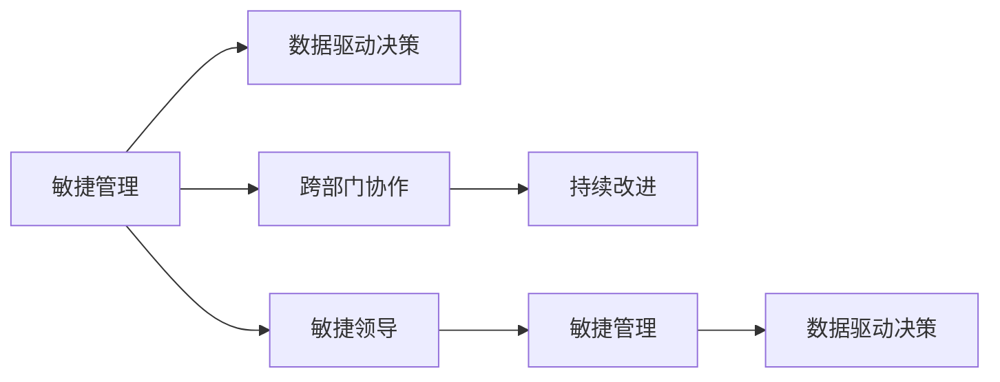

                 

# 管理者如何应对快速变化的商业环境

## 1. 背景介绍

### 1.1 问题由来

随着科技的飞速发展和全球经济一体化的加速，商业环境变得日益复杂和快速变化。各种新兴技术和市场趋势不断涌现，管理者需要不断调整策略，以适应新的商业环境。然而，传统商业管理理论和方法难以应对这种快速变化，亟需新的方法论和工具来指导管理实践。

### 1.2 问题核心关键点

管理实践中，如何有效应对快速变化的环境，是每个管理者必须面对的挑战。具体关键点包括：

1. **市场响应速度**：市场竞争激烈，产品更新迅速，管理者需要快速识别市场趋势，及时调整产品或服务。
2. **技术创新驱动**：科技发展日新月异，管理者需要跟踪最新技术，并快速将其应用于商业实践中。
3. **数据驱动决策**：商业环境中的数据量不断增长，管理者需要学会从数据中提取洞察，以指导决策。
4. **跨部门协作**：复杂商业环境要求各部门协同工作，管理者需要促进跨部门协作，提高整体效率。
5. **风险管理**：快速变化的环境增加了不确定性和风险，管理者需要建立有效的风险管理机制。

### 1.3 问题研究意义

本文章旨在通过介绍一些先进的管理方法论和工具，帮助管理者更好地应对快速变化的商业环境。通过系统的理论框架和实际案例，管理者可以更科学、更高效地制定和执行策略，提升企业竞争力。

## 2. 核心概念与联系

### 2.1 核心概念概述

为了更好地理解如何应对快速变化的商业环境，本节将介绍几个关键概念及其相互联系：

- **敏捷管理(Agile Management)**：一种以用户反馈为中心，快速响应变化的管理方法。通过迭代开发和持续改进，提升产品和服务的适应性。
- **数据驱动决策(Data-Driven Decision Making)**：基于数据分析和统计模型，帮助管理者做出更客观、科学的决策。
- **跨部门协作(Cross-Functional Collaboration)**：强调不同部门之间的协作，以实现资源共享和共同目标。
- **持续改进(Continuous Improvement)**：通过PDCA（计划-执行-检查-行动）循环，不断优化管理过程和效果。
- **敏捷领导(Agile Leadership)**：领导者需要具备敏捷思维，能够适应变化并激励团队快速响应。

这些概念之间的逻辑关系可以通过以下Mermaid流程图来展示：



这个流程图展示了一系列的核心理念，它们共同构成了敏捷管理的理论框架。管理者可以通过综合应用这些概念，有效应对快速变化的商业环境。

## 3. 核心算法原理 & 具体操作步骤

### 3.1 算法原理概述

敏捷管理方法的核心原理在于通过迭代和反馈机制，快速适应变化。管理者在敏捷管理框架下，可以持续优化和调整策略，以适应市场和技术环境的变化。以下是敏捷管理的基本原理：

1. **迭代开发(Iterative Development)**：将项目分解为多个短周期的迭代，每个迭代结束时交付可用的产品增量。
2. **快速反馈(Fast Feedback)**：通过客户和团队的反馈，快速识别问题并进行调整。
3. **跨部门协作(Cross-Functional Collaboration)**：不同部门和团队紧密协作，共同推进项目进展。
4. **持续改进(Continuous Improvement)**：基于反馈和数据分析，持续优化管理流程和产品特性。

### 3.2 算法步骤详解

敏捷管理的具体操作步骤如下：

**Step 1: 制定愿景和目标**
- 明确企业的愿景和目标，确保所有团队成员和利益相关者认同并致力于实现这些目标。

**Step 2: 团队组建和培训**
- 组建跨职能团队，包括开发、测试、设计、市场等多个角色。
- 对团队成员进行敏捷管理和技术培训，确保团队具备必要的技能和知识。

**Step 3: 规划和执行**
- 制定详细的项目计划，包括任务分解、时间表和责任分配。
- 进行迭代开发，每个迭代结束时交付可用的产品增量。

**Step 4: 持续反馈和改进**
- 通过客户和团队的反馈，持续评估产品特性和流程效率。
- 基于反馈和数据分析，优化产品设计和开发流程。

**Step 5: 验收和发布**
- 在每个迭代结束时，进行功能验收和测试，确保产品质量。
- 发布新版本，并通过市场反馈进一步优化产品。

### 3.3 算法优缺点

敏捷管理方法具有以下优点：
1. **快速响应变化**：通过迭代开发和快速反馈，能够快速适应市场和技术变化。
2. **提高协作效率**：跨部门协作提升了资源共享和协同工作的效率。
3. **提升产品质量**：持续改进和优化确保了产品的高质量和用户满意度。

同时，该方法也存在一定的局限性：
1. **复杂性高**：对于复杂项目和团队，需要大量的培训和沟通成本。
2. **依赖团队技能**：团队成员必须具备较强的自我管理能力和技术能力。
3. **资源投入大**：需要投入大量时间和资源进行培训和流程优化。
4. **风险管理不足**：在快速变化的环境中，风险管理机制需要进一步完善。

尽管存在这些局限性，但就目前而言，敏捷管理方法仍是应对快速变化商业环境的有效手段。未来相关研究的重点在于如何进一步降低敏捷管理的复杂性，提高其适用性和可操作性。

### 3.4 算法应用领域

敏捷管理方法广泛应用于软件开发、项目管理、产品设计等多个领域，尤其适用于以下场景：

- **软件开发**：通过敏捷开发方法，快速响应客户需求和市场变化。
- **项目管理**：通过敏捷项目管理和持续改进，提升项目管理效率和质量。
- **产品设计**：通过敏捷设计和快速迭代，快速推出新产品和功能。
- **市场营销**：通过敏捷市场分析和反馈机制，精准定位客户需求。

此外，敏捷管理还被创新性地应用于医疗、教育、金融等多个行业，为传统行业数字化转型提供了新的思路。

## 4. 数学模型和公式 & 详细讲解 & 举例说明

### 4.1 数学模型构建

敏捷管理方法可以通过数学模型来进一步抽象和量化。以下是一个简化的敏捷管理模型，包含任务完成时间、团队规模和迭代次数三个关键变量：

$$
C = \frac{N}{\left(1 - \left(\frac{1}{2}\right)^{n}}
$$

其中，$C$ 表示总任务完成时间，$N$ 表示总任务量，$n$ 表示迭代次数。

### 4.2 公式推导过程

在敏捷管理中，任务完成时间与迭代次数之间存在一定的关系。假设每个迭代周期内完成的任务量为 $P$，则完成总任务所需迭代次数 $n$ 可以表示为：

$$
n = \log_2\left(\frac{N}{P}\right)
$$

将 $P$ 代入 $C$ 的表达式中，可以得到：

$$
C = \frac{N}{1 - \left(\frac{1}{2}\right)^{n}} = \frac{N}{1 - \left(\frac{1}{2}\right)^{\log_2\left(\frac{N}{P}\right)}}
$$

这个公式展示了在固定任务量和团队规模的情况下，迭代次数对总任务完成时间的影响。

### 4.3 案例分析与讲解

假设一个软件开发项目，总任务量为 $N=100$，团队规模为 $P=10$ 人。根据上述公式，可以计算得到完成该项目所需的迭代次数和总时间：

$$
n = \log_2\left(\frac{N}{P}\right) = \log_2\left(\frac{100}{10}\right) \approx 6.64
$$

$$
C = \frac{N}{1 - \left(\frac{1}{2}\right)^{n}} = \frac{100}{1 - \left(\frac{1}{2}\right)^{6.64}} \approx 21.4
$$

这意味着，在敏捷开发中，需要大约 6.64 次迭代和 21.4 周的时间才能完成该项目。

## 5. 项目实践：代码实例和详细解释说明

### 5.1 开发环境搭建

在进行敏捷管理实践前，我们需要准备好开发环境。以下是使用Python进行Scrum框架的开发环境配置流程：

1. 安装Scrum框架的Python库：
```bash
pip install scrum-pypi
```

2. 创建Scrum项目，定义项目冲刺计划和任务：
```python
from scrum import Scrum

scrum = Scrum(project_name='MyProject', sprint_name='Sprint1', sprint_duration=2)
task1 = scrum.create_task(task_name='Task1', effort=5)
task2 = scrum.create_task(task_name='Task2', effort=8)
scrum.add_task_to_sprint(task1)
scrum.add_task_to_sprint(task2)
```

3. 定义Scrum角色和职责：
```python
scrum.add_scrum_master()
scrum.add_product_owner()
scrum.add_developer()
```

4. 启动Scrum周期：
```python
scrum.start_sprint()
```

### 5.2 源代码详细实现

下面是一个使用Scrum框架进行敏捷管理的示例代码：

```python
from scrum import Scrum, Task

# 创建Scrum项目
scrum = Scrum(project_name='MyProject', sprint_name='Sprint1', sprint_duration=2)

# 创建任务
task1 = scrum.create_task(task_name='Task1', effort=5)
task2 = scrum.create_task(task_name='Task2', effort=8)

# 将任务分配到冲刺
scrum.add_task_to_sprint(task1)
scrum.add_task_to_sprint(task2)

# 开始冲刺
scrum.start_sprint()

# 任务执行
task1.start()
task2.start()

# 任务完成
task1.complete()
task2.complete()

# 结束冲刺
scrum.end_sprint()
```

这段代码展示了如何使用Scrum框架创建项目、定义任务、启动冲刺、执行任务和结束冲刺的基本流程。

### 5.3 代码解读与分析

**Scrum框架**：
- 通过Scrum框架，可以方便地创建和管理Scrum项目，包括定义冲刺、任务、角色等。
- 框架提供了一套完整的敏捷管理方法论，帮助管理者进行任务分解、进度跟踪和团队协作。

**任务执行**：
- 每个任务都有开始、执行和完成三个状态，可以实时跟踪任务进度。
- 任务执行期间，可以设置任务负责人、描述、优先级等属性。

**冲刺管理**：
- 通过Sprint Manager类，可以创建和管理Scrum冲刺，记录任务进度和完成情况。
- 冲刺结束后，可以生成Sprint Report，评估冲刺结果和下一步改进方向。

这段代码展示了Scrum框架的基本用法，帮助开发者快速上手敏捷管理实践。在实际项目中，可以根据具体需求进行扩展和优化。

## 6. 实际应用场景

### 6.1 软件开发

敏捷管理在软件开发中的应用最为广泛。通过敏捷开发方法，团队可以快速响应客户需求，进行迭代开发和持续改进，提升产品开发效率和质量。

### 6.2 项目管理

敏捷管理不仅适用于软件开发，还广泛应用于各种项目管理场景。项目管理中的敏捷实践，如Scrum和Kanban，帮助团队快速响应变化，提高项目执行效率。

### 6.3 产品设计

敏捷设计方法可以快速迭代产品原型，通过用户反馈和数据分析，不断优化产品功能和用户体验。敏捷设计使得产品开发更加灵活和高效。

### 6.4 未来应用展望

随着敏捷管理方法的不断完善和推广，其应用范围将进一步扩大。未来，敏捷管理将与其他管理方法进行更多整合，形成更加科学和系统的管理框架。

敏捷管理也将与大数据、人工智能等新兴技术进行结合，提升管理效率和决策科学性。例如，通过数据分析和机器学习，敏捷管理可以更加智能地进行任务优化和资源配置。

## 7. 工具和资源推荐

### 7.1 学习资源推荐

为了帮助管理者系统掌握敏捷管理的方法和工具，这里推荐一些优质的学习资源：

1. 《Scrum敏捷项目管理》系列书籍：详细介绍了Scrum方法论及其应用场景，适合初学者和进阶者。
2. Scrum官方网站：提供Scrum的权威指南、最佳实践和案例分享，是学习Scrum的绝佳资源。
3. Coursera的Scrum敏捷管理课程：由知名大学教授主讲，系统讲解Scrum方法论和实践技巧。
4. Udemy的Scrum敏捷管理实战课程：通过实际项目案例，帮助学员掌握Scrum实践技能。

通过对这些资源的学习，相信你一定能够快速掌握敏捷管理的方法和技巧，并在实际工作中灵活应用。

### 7.2 开发工具推荐

敏捷管理需要借助多种工具进行实践。以下是几款常用的敏捷管理工具：

1. JIRA：项目管理工具，支持Scrum和Kanban等敏捷方法论，提供任务跟踪、进度管理和报告生成等功能。
2. Trello：看板工具，适合Kanban方法论，通过卡片和列表形式，直观展示任务进度和状态。
3. Confluence：团队协作工具，支持文档共享和讨论，便于团队成员协同工作。
4. Slack：即时通讯工具，支持频道、私人消息等多种沟通方式，提高团队协作效率。
5. Visual Studio Team Services：集成DevOps和敏捷管理功能，支持Scrum、Kanban等方法论。

合理利用这些工具，可以显著提升敏捷管理的实践效果，加快团队协作和项目进展。

### 7.3 相关论文推荐

敏捷管理方法的发展得益于学界的持续研究。以下是几篇奠基性的相关论文，推荐阅读：

1. "Agile Process Models and Their Performance: An Empirical Study"（Katzenbach & Smith, 2008）：通过实证研究，比较了Scrum和瀑布模型在项目管理中的表现。
2. "Agile Software Development: Concepts and Guidelines"（McConnell, 2006）：全面介绍了敏捷开发方法论和实践指南，适合深入理解敏捷管理的核心思想。
3. "The Scrum Guide"（Scrum.org, 2019）：Scrum官方指南，提供了Scrum方法论和实践的详细说明，是敏捷管理的重要参考资料。
4. "Kanban: Successful Evolutionary Change for Your Technology Business"（McKinney, 2010）：介绍了Kanban方法论及其在敏捷项目管理中的应用，适合了解和应用Kanban实践。

这些论文代表了大敏捷管理发展脉络。通过学习这些前沿成果，可以帮助研究者把握学科前进方向，激发更多的创新灵感。

## 8. 总结：未来发展趋势与挑战

### 8.1 总结

本文通过详细介绍敏捷管理方法，帮助管理者更好地应对快速变化的商业环境。敏捷管理通过迭代开发、快速反馈和跨部门协作，提升了企业的适应性和灵活性。通过系统理论框架和实际案例，管理者可以更科学、更高效地制定和执行策略，提升企业竞争力。

### 8.2 未来发展趋势

展望未来，敏捷管理将呈现以下几个发展趋势：

1. **跨行业应用扩展**：敏捷管理不仅适用于软件开发和项目管理，还将扩展到更多行业，如医疗、金融、制造等。
2. **与新兴技术的融合**：敏捷管理将与其他新兴技术，如大数据、人工智能等进行深度融合，提升管理效率和决策科学性。
3. **全球化和本地化结合**：全球化背景下的敏捷管理需要更好地平衡全球资源和本地需求，实现全球协作和本地响应。
4. **敏捷领导力的提升**：敏捷管理需要领导者具备更强的敏捷思维和跨部门协调能力，成为企业变革的推动力。

### 8.3 面临的挑战

尽管敏捷管理在应对快速变化的环境中表现出显著优势，但在实践中仍面临诸多挑战：

1. **文化变革困难**：企业在引入敏捷管理时，需要改变传统的工作方式和企业文化，这需要较长时间和较大成本。
2. **团队协作复杂**：跨部门协作需要建立良好的沟通和信任机制，团队成员需要具备较强的协同能力和沟通技巧。
3. **工具和流程的适配**：不同企业需要根据自身特点选择合适的敏捷管理工具和流程，工具适配和流程优化是成功实施的前提。
4. **持续改进的难度**：敏捷管理强调持续改进，但持续改进的机制和效果需要持续的监控和评估。
5. **敏捷领导的短缺**：敏捷管理需要具备敏捷思维和跨部门协调能力的领导者，但这样的人才往往较为稀缺。

### 8.4 研究展望

未来，敏捷管理的研究需要关注以下几个方向：

1. **敏捷方法论的创新**：在原有方法的基础上，不断探索新的敏捷方法论和工具，满足不同企业的管理需求。
2. **敏捷管理的评估和优化**：通过大数据和机器学习技术，对敏捷管理的效果进行评估和优化，提升管理科学性和精确度。
3. **敏捷文化建设**：如何在企业内部建立敏捷文化，促进员工和领导者的敏捷思维和行为习惯。
4. **敏捷工具和技术的开发**：开发更加高效和易用的敏捷管理工具，降低敏捷实践的门槛和复杂度。
5. **敏捷管理的国际化**：在全球化背景下，如何根据不同地区和国家的文化差异，进行敏捷管理的本地化适应和优化。

这些研究方向将推动敏捷管理方法不断创新和完善，为应对快速变化的商业环境提供更科学、更高效的管理工具和实践框架。

## 9. 附录：常见问题与解答

**Q1: 敏捷管理是否适用于所有企业？**

A: 敏捷管理在应对快速变化的环境中表现出显著优势，但并不适合所有企业。对于那些有明确流程和严格规范的企业，敏捷管理可能并不适合。此外，企业需要具备一定的敏捷文化基础和跨部门协作机制。

**Q2: 敏捷管理是否需要全面的变革？**

A: 敏捷管理需要改变传统的工作方式和企业文化，但这并不意味着需要进行全面的变革。企业可以根据自身特点，逐步引入敏捷管理的实践和工具，逐步适应敏捷文化。

**Q3: 敏捷管理是否需要高成本的培训和引入？**

A: 敏捷管理需要投入一定的资源进行培训和工具引入，但这并不是高成本的。相比传统管理方法，敏捷管理通常能够提升项目管理效率和质量，减少资源浪费。

**Q4: 敏捷管理是否需要频繁调整和优化？**

A: 敏捷管理强调持续改进和优化，需要根据实际项目进展和团队反馈，不断调整和优化管理流程和工具。这需要管理者和团队成员具备较强的自我管理和反思能力。

**Q5: 敏捷管理是否需要高度集中的决策权？**

A: 敏捷管理强调跨部门协作和团队决策，需要决策权在不同团队和成员之间进行分散。集中决策可能导致团队协作效率低下，影响敏捷管理的实施效果。

这些问题的解答展示了敏捷管理的实际应用场景和潜在的挑战。希望通过本文的介绍，管理者能够更好地理解和应用敏捷管理，提升企业应对快速变化的能力。

