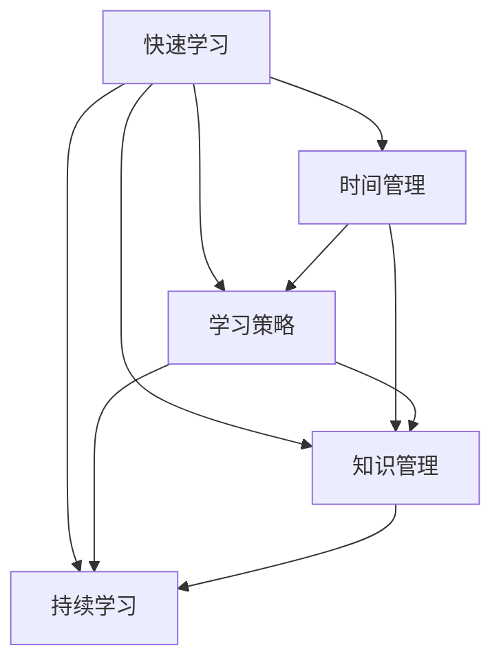

                 

# 管理者的快速学习能力培养

> 关键词：快速学习,管理者,技能提升,学习策略,知识管理,终身学习

## 1. 背景介绍

### 1.1 问题由来

在当今快速变化的商业环境中，管理者需要不断适应新的技术和市场趋势，以保持竞争力和组织持续发展。然而，繁重的工作压力和时间管理挑战往往限制了管理者深入学习和专业提升的机会。为了应对这一挑战，管理者的快速学习能力培养成为一项关键能力，需要系统化、科学化的策略和方法。

### 1.2 问题核心关键点

快速学习能力的关键在于，管理者如何在有限的时间内，高效地获取和应用新知识，提升自身和团队的表现。以下是几个核心关键点：

- **时间管理**：如何在繁忙的工作中找到时间进行学习。
- **学习效率**：如何快速理解新概念、掌握新技能。
- **知识管理**：如何组织和应用所学知识，以提升工作效果。
- **实践应用**：如何将新知识转化为实际工作的有效工具。
- **持续学习**：如何建立终身学习的习惯，保持知识更新。

### 1.3 问题研究意义

管理者快速学习能力培养具有重要意义，有助于：

1. **提升竞争力**：管理者掌握新技能，能更好地适应市场变化，提高决策质量和创新能力。
2. **激发团队活力**：管理者通过快速学习，树立学习榜样，促进团队的学习氛围。
3. **推动组织发展**：管理者持续学习，带动整个组织的知识更新和创新，增强整体竞争力。
4. **增强职业满意度**：管理者不断学习，提升自身能力，增强职业满足感和成就感。

## 2. 核心概念与联系

### 2.1 核心概念概述

为了系统化培养管理者的快速学习能力，本节介绍几个核心概念及其相互关系：

- **快速学习(Fast Learning)**：指在短时间内高效掌握新知识的过程。强调学习速度和学习效果。
- **时间管理(Time Management)**：通过合理规划时间，确保学习时间不被工作或其他事务挤占。
- **学习策略(Learning Strategy)**：包括选择合适的学习材料、工具和方法，以提高学习效率。
- **知识管理(Knowledge Management)**：将所学知识进行整理、存储、应用，提升学习效果和工作表现。
- **持续学习(Continuous Learning)**：建立终身学习的习惯，不断更新知识和技能，适应快速变化的环境。

这些概念通过以下Mermaid流程图表示它们之间的联系：



## 3. 核心算法原理 & 具体操作步骤

### 3.1 算法原理概述

快速学习能力培养的算法原理基于认知心理学和学习科学的研究成果。核心思想是通过系统化的学习策略和时间管理，优化学习过程，提高学习效率。核心步骤包括：

1. **目标设定**：明确学习目标和期望成果。
2. **时间规划**：合理安排学习时间，确保高效利用时间。
3. **选择策略**：根据学习目标选择最适合的学习方法和工具。
4. **执行学习**：实施学习计划，有效利用学习材料和工具。
5. **评估效果**：定期评估学习效果，调整学习策略。
6. **应用知识**：将所学知识应用到实际工作中，提升工作表现。
7. **持续迭代**：根据反馈不断优化学习方法和策略。

### 3.2 算法步骤详解

以下详细讲解快速学习能力培养的具体操作步骤：

**Step 1: 目标设定**
- 明确学习的目标，如掌握新技能、理解新概念、提高特定领域的知识水平。
- 设定具体、可衡量的目标，如在3个月内掌握Python编程，或通过某个专业认证考试。

**Step 2: 时间规划**
- 分析日常工作时间，找出可用于学习的时间段，如清晨、午休、周末。
- 制定详细的学习时间表，明确每日和每周的学习任务。
- 利用时间管理工具如日历、任务列表，提醒和记录学习时间。

**Step 3: 选择策略**
- 根据学习目标选择适合的策略，如在线课程、书籍、视频教程、培训班等。
- 选择高效的学习方法，如主动学习、番茄工作法、费曼技巧等。
- 选择适当的学习工具，如学习管理系统(LMS)、笔记应用、思维导图软件等。

**Step 4: 执行学习**
- 遵循时间表，按时进行学习，确保任务按时完成。
- 保持专注，避免分心，提高学习效率。
- 定期复习和巩固所学知识，防止遗忘。

**Step 5: 评估效果**
- 定期评估学习效果，如通过测试、项目实践、实际工作表现等进行评估。
- 根据评估结果调整学习策略和方法。

**Step 6: 应用知识**
- 将所学知识应用到实际工作中，如解决工作中的实际问题、改进工作流程等。
- 持续收集反馈，不断优化应用效果。

**Step 7: 持续迭代**
- 根据工作反馈和评估结果，不断调整学习策略和方法。
- 学习新技能或知识，保持持续学习的习惯。

### 3.3 算法优缺点

快速学习能力培养的算法具有以下优点：

1. **系统性**：通过明确的目标设定和时间规划，使学习过程更具条理性和可操作性。
2. **高效性**：通过选择合适的策略和方法，提高学习效率。
3. **实用性**：学习内容直接应用到实际工作中，提升工作表现。
4. **持续性**：通过不断的评估和调整，保持学习的持续性和效果。

同时，该方法也存在一些局限性：

1. **个体差异**：不同管理者的学习习惯和能力不同，需要个性化调整。
2. **资源限制**：时间、资金和工具等资源的限制可能影响学习效果。
3. **学习动力**：管理者需要自我驱动，保持持续学习的动力。
4. **工作干扰**：工作中的紧急任务和突发事件可能打乱学习计划。

尽管有这些局限性，但快速学习能力培养的算法仍是一种系统化、科学化的有效方法，值得广泛推广和应用。

### 3.4 算法应用领域

快速学习能力培养的算法可以广泛应用于各种管理情境，如：

- **领导力培训**：提升管理者的领导能力和决策质量。
- **团队建设**：通过领导者的快速学习，促进团队的知识共享和技能提升。
- **组织创新**：管理者持续学习新技术和新方法，推动组织创新。
- **危机管理**：管理者快速掌握新知识和技能，应对突发事件。
- **个人发展**：管理者通过快速学习，实现职业成长和转型。

## 4. 数学模型和公式 & 详细讲解 & 举例说明

### 4.1 数学模型构建

假设管理者的初始知识水平为 $K_0$，目标知识水平为 $K_T$，学习速率为 $R$，每日学习时间为 $T_d$，每周学习天数为 $N_w$，总学习时间为 $T_L$。则学习效果的数学模型为：

$$
K(T_L) = K_0 + R \times (T_d \times N_w \times T_L)
$$

其中 $R$ 代表学习效率系数，$T_d$ 和 $N_w$ 代表每日和每周的学习时间，$T_L$ 代表总学习时间。

### 4.2 公式推导过程

学习效率 $R$ 的计算公式为：

$$
R = \frac{K_T - K_0}{T_d \times N_w \times T_L}
$$

学习效率 $R$ 受到学习方法和工具的影响。例如，主动学习方法和高质量学习资源可以提高 $R$，而低效的学习策略和缺乏时间管理则会降低 $R$。

### 4.3 案例分析与讲解

以学习Python编程为例，设初始知识水平 $K_0=0$，目标知识水平 $K_T=1$（满分），学习速率为 $R=0.1$（每天掌握10%），每日学习时间为 $T_d=2$ 小时，每周学习天数为 $N_w=5$，总学习时间为 $T_L=12$ 周。则有：

$$
R = \frac{1 - 0}{2 \times 5 \times 12} = 0.1
$$

每日学习时间 $T_d=2$ 小时，每周学习天数 $N_w=5$，总学习时间 $T_L=12$ 周，则总学习时间为：

$$
T_L = 2 \times 5 \times 12 = 120 \text{小时}
$$

通过上述公式计算，在120小时的学习后，学习效果为：

$$
K(T_L) = 0 + 0.1 \times 120 = 12
$$

这说明管理者通过系统化的学习和时间管理，可以在12周内掌握Python编程，达到目标知识水平。

## 5. 项目实践：代码实例和详细解释说明

### 5.1 开发环境搭建

在进行快速学习能力培养的项目实践前，我们需要准备好开发环境。以下是使用Python进行快速学习能力培养的开发环境配置流程：

1. 安装Anaconda：从官网下载并安装Anaconda，用于创建独立的Python环境。
2. 创建并激活虚拟环境：
```bash
conda create -n learning-env python=3.8 
conda activate learning-env
```

3. 安装相关库：
```bash
pip install pandas matplotlib jupyter notebook
```

完成上述步骤后，即可在`learning-env`环境中开始项目实践。

### 5.2 源代码详细实现

下面以学习Python编程为例，展示使用Python进行快速学习能力培养的代码实现。

```python
import pandas as pd
import matplotlib.pyplot as plt

# 设定初始和目标知识水平
K_0 = 0
K_T = 1

# 设定学习速率为0.1，每天学习2小时，每周学习5天，总学习时间为12周
R = 0.1
T_d = 2  # 每天学习时间（小时）
N_w = 5  # 每周学习天数
T_L = 12  # 总学习时间（周）

# 计算学习效果
K_TL = K_0 + R * (T_d * N_w * T_L)
print(f"目标知识水平: {K_TL}")

# 计算学习效率
R_value = (K_T - K_0) / (T_d * N_w * T_L)
print(f"学习效率: {R_value}")

# 可视化学习效果
plt.plot(range(T_L), [K_0 + R * i * T_d * N_w for i in range(T_L+1)])
plt.xlabel('周数')
plt.ylabel('知识水平')
plt.title('学习效果随时间变化')
plt.show()
```

### 5.3 代码解读与分析

让我们再详细解读一下关键代码的实现细节：

**设定初始和目标知识水平**

```python
K_0 = 0
K_T = 1
```

设定初始知识水平为0，目标知识水平为1，代表完全掌握所学内容。

**计算学习效果**

```python
K_TL = K_0 + R * (T_d * N_w * T_L)
print(f"目标知识水平: {K_TL}")
```

通过公式计算学习效果，即目标知识水平。

**计算学习效率**

```python
R_value = (K_T - K_0) / (T_d * N_w * T_L)
print(f"学习效率: {R_value}")
```

通过公式计算学习效率，即每天掌握知识的比例。

**可视化学习效果**

```python
plt.plot(range(T_L), [K_0 + R * i * T_d * N_w for i in range(T_L+1)])
plt.xlabel('周数')
plt.ylabel('知识水平')
plt.title('学习效果随时间变化')
plt.show()
```

使用Matplotlib绘制学习效果随时间变化的曲线图，直观展示学习进度。

## 6. 实际应用场景

### 6.1 企业领导力培训

快速学习能力培养在企业领导力培训中具有重要应用。现代企业环境瞬息万变，管理者需要不断学习新技能和知识，以保持竞争力和组织持续发展。通过系统化的培训和学习策略，企业可以提高领导团队的整体能力，增强决策质量和创新能力。

### 6.2 团队技能提升

快速学习能力培养还可以用于团队的技能提升。通过鼓励团队成员进行持续学习，提升整体技能水平，增强团队协作和执行力。管理者可以通过在线课程、工作坊等方式，为团队提供学习和提升的平台。

### 6.3 组织创新

快速学习能力培养对于推动组织创新至关重要。管理者通过持续学习新技术和新方法，能够不断优化工作流程，推动组织创新，保持竞争力。

### 6.4 未来应用展望

未来，随着技术的发展和教育理念的进步，快速学习能力培养将进一步扩展到更多领域。例如：

- **远程教育**：利用在线学习平台，提供灵活、个性化的学习体验。
- **个性化学习**：通过数据分析，为每个学习者推荐最适合的学习资源和方法。
- **混合学习**：结合线上和线下学习，提高学习效果。
- **社会学习**：通过社区平台和社交网络，促进知识的共享和传播。

## 7. 工具和资源推荐

### 7.1 学习资源推荐

为了帮助管理者系统掌握快速学习能力培养的理论基础和实践技巧，这里推荐一些优质的学习资源：

1. **《快速学习能力培养指南》**：详细介绍快速学习能力培养的方法和策略，涵盖目标设定、时间管理、学习策略、知识管理等核心内容。
2. **Coursera《有效学习：学习技巧与实践》课程**：由知名教育专家讲授，系统讲解学习技巧和实践方法，提高学习效果。
3. **《深度学习快速入门》**：介绍深度学习的基本概念和快速学习方法，帮助管理者快速掌握新兴技术。
4. **TED演讲《如何成为快速学习者》**：著名教育学家分享快速学习的方法和技巧，提供实用的建议。
5. **博客《快速学习能力培养实践》**：分享实际应用中的快速学习能力培养经验，提供具体的案例和方法。

### 7.2 开发工具推荐

高效的开发离不开优秀的工具支持。以下是几款用于快速学习能力培养开发的常用工具：

1. **Trello**：项目管理工具，用于规划和跟踪学习进度。
2. **Notion**：笔记和知识管理工具，用于记录和整理学习资料。
3. **Anki**：闪卡工具，用于强化记忆和复习。
4. **Khan Academy**：在线学习平台，提供丰富的课程和学习资源。
5. **Duolingo**：语言学习应用，通过游戏化学习提高学习兴趣。

### 7.3 相关论文推荐

快速学习能力培养的研究源于学界的持续研究。以下是几篇奠基性的相关论文，推荐阅读：

1. **《快速学习能力培养的理论与实践》**：详细介绍快速学习能力培养的理论基础和方法。
2. **《时间管理和快速学习能力培养的实证研究》**：通过实证研究，分析时间管理对快速学习能力培养的影响。
3. **《自适应学习系统在快速学习能力培养中的应用》**：介绍自适应学习系统如何辅助管理者快速学习。
4. **《人工智能辅助下的快速学习能力培养》**：探讨人工智能技术在快速学习能力培养中的应用。
5. **《快速学习能力培养的策略与方法》**：介绍多种快速学习能力培养的策略和方法，提供实际应用案例。

## 8. 总结：未来发展趋势与挑战

### 8.1 总结

本文对快速学习能力培养的方法和策略进行了全面系统的介绍。首先阐述了快速学习能力培养的背景和意义，明确了快速学习能力培养在提高管理者竞争力和组织发展中的重要性。其次，从原理到实践，详细讲解了快速学习能力培养的数学模型、操作步骤和核心策略。最后，通过项目实践和实际应用场景，展示了快速学习能力培养的广泛应用和未来发展方向。

通过本文的系统梳理，可以看到，快速学习能力培养方法具有显著的效果和广泛的应用前景，能显著提升管理者的学习效率和知识水平，推动组织和团队的持续进步。

### 8.2 未来发展趋势

展望未来，快速学习能力培养技术将呈现以下几个发展趋势：

1. **智能化**：通过人工智能和机器学习技术，提供更加个性化和智能化的学习推荐。
2. **多样化**：结合多种学习资源和工具，提供更加灵活多样的学习方式。
3. **泛化性**：快速学习能力培养方法将在更多领域得到应用，推动知识管理和持续学习。
4. **实证研究**：更多基于实证研究的结果将指导快速学习能力培养的策略和方法。
5. **跨学科融合**：快速学习能力培养将与其他学科如心理学、教育学等进行深度融合，提升学习效果。

### 8.3 面临的挑战

尽管快速学习能力培养技术已经取得了显著成果，但在实践中仍面临一些挑战：

1. **个体差异**：不同管理者的学习习惯和能力不同，需要个性化的策略和方法。
2. **时间管理**：如何在繁忙的工作中合理安排学习时间，提高学习效率。
3. **知识管理**：如何有效整理和应用所学知识，防止知识遗忘。
4. **持续动力**：保持持续学习的动力，克服学习中的困难和挫折。
5. **资源限制**：学习资源和工具的获取和应用可能受到资源限制。

### 8.4 研究展望

未来，快速学习能力培养的研究需要在以下几个方面寻求新的突破：

1. **个性化学习路径**：通过数据分析，为每个学习者制定个性化的学习路径，提升学习效果。
2. **实时反馈机制**：建立实时反馈机制，及时调整学习策略和方法，提高学习效率。
3. **跨领域应用**：将快速学习能力培养方法应用于更多领域，推动跨学科知识和技能的整合。
4. **社会化学习**：利用社会网络和社区平台，促进知识的共享和传播，提升学习效果。
5. **技术融合**：将快速学习能力培养技术与新兴技术如区块链、物联网等进行深度融合，提升学习体验。

总之，快速学习能力培养技术正处于快速发展的阶段，未来将在更多领域得到广泛应用，为管理者和组织带来显著的效益。

## 9. 附录：常见问题与解答

**Q1：如何快速设定学习目标？**

A: 设定学习目标需要明确具体的、可衡量的成果。例如，掌握一门编程语言、通过某个认证考试、提升某个技能水平等。可以使用SMART原则（具体的Specific、可衡量的Measurable、可实现的Achievable、相关的Relevant、有时间限制的Time-bound）来设定目标。

**Q2：如何快速管理时间？**

A: 时间管理的关键在于规划和执行。可以使用时间管理工具如Trello、Notion等，制定详细的学习计划，明确每日和每周的任务。还可以采用番茄工作法、时间块等方法，提高学习效率。

**Q3：如何快速选择学习策略？**

A: 根据学习目标选择最适合的策略。可以参考其他学习者的方法，或寻求专业人士的建议。常用的学习策略包括主动学习、费曼技巧、间隔重复等。

**Q4：如何快速应用所学知识？**

A: 应用所学知识需要与实际工作结合。可以通过项目实践、模拟任务等方式，将所学知识应用到实际工作中，提升工作表现。

**Q5：如何快速持续学习？**

A: 持续学习需要建立学习习惯和自我驱动。可以设定固定的时间进行学习，不断更新学习材料，参加相关培训和活动，保持学习的持续性和动力。

---

作者：禅与计算机程序设计艺术 / Zen and the Art of Computer Programming

