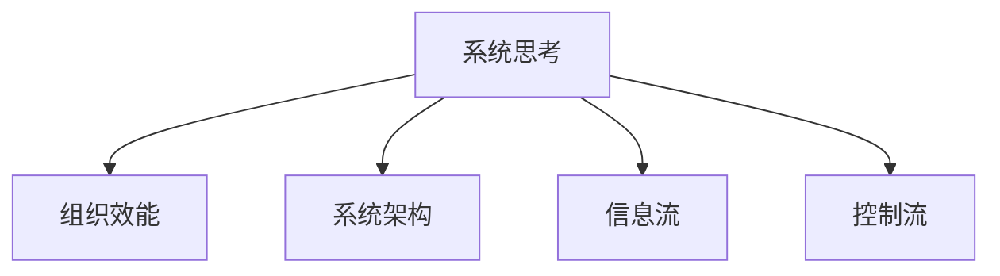

                 

# 系统思考与组织效能的提升

## 1. 背景介绍

### 1.1 问题由来
在信息化和全球化的浪潮下，企业的业务模式和运作方式都发生了深刻变化。传统企业面临着市场竞争加剧、客户需求多样化、管理复杂化等诸多挑战。如何通过系统思考，从整体角度出发，全面提升组织效能，是当前企业决策者和组织者必须面对的核心问题。

### 1.2 问题核心关键点
系统思考强调从整体视角出发，把握企业运作的全局性和动态性，通过系统架构设计和优化，提升企业运营效率、反应速度和创新能力。具体核心关键点包括：
- 全局视角：识别企业运作中的关键系统和子系统，理解它们之间的互动关系。
- 动态反馈：捕捉企业运作中的信息流和控制流，建立有效的动态反馈机制。
- 系统设计：构建合理的系统架构，设计高效的信息传递和资源分配机制。
- 性能评估：建立系统的性能评估指标，实时监控系统状态，确保系统健康运行。
- 持续优化：通过持续迭代和改进，不断提升系统性能和效能。

## 2. 核心概念与联系

### 2.1 核心概念概述

为更好地理解系统思考和组织效能提升，本节将介绍几个密切相关的核心概念：

- 系统思考(System Thinking)：一种以系统视角进行思考和分析的方法，强调从整体和动态角度理解企业运作过程，识别系统各部分之间的互动关系，提升整体效能。

- 组织效能(Organizational Effectiveness)：指组织在实现其目标的过程中，达到最佳性能状态的程度。包括运营效率、创新能力、客户满意度等指标。

- 系统架构(System Architecture)：描述系统各组成部分及其交互关系，确定系统功能模块、数据流、控制流等关键元素，是系统设计和优化的基础。

- 信息流(Information Flow)：指系统中信息从输入到输出的传输过程，包括数据采集、处理、存储、传递等环节。

- 控制流(Control Flow)：指系统中各种决策和控制指令的执行过程，包括任务调度、权限管理、资源分配等。

这些核心概念之间的逻辑关系可以通过以下Mermaid流程图来展示：



这个流程图展示了这个系统思考框架的核心要素和它们之间的联系：

1. 系统思考作为思考方式，从整体和动态视角出发，帮助理解企业运作的全局性。
2. 组织效能是系统思考的目标和最终结果，通过设计和优化系统架构，提升组织运营效率和创新能力。
3. 系统架构是系统思考和组织效能提升的具体路径，通过定义系统组成部分及其交互关系，实现高效的信息流和控制流。
4. 信息流和控制流是系统架构的子系统，它们的管理和优化是系统设计和优化过程中不可或缺的环节。

## 3. 核心算法原理 & 具体操作步骤

### 3.1 算法原理概述

系统思考和组织效能提升，本质上是一个从整体视角出发，识别和优化系统组件和互动关系的过程。其核心算法原理包括：

1. 系统建模：使用系统建模工具和语言，对企业运作进行建模和仿真，理解系统各部分之间的动态关系。
2. 系统优化：基于建模结果，优化系统架构、流程和机制，提升系统性能和效能。
3. 动态仿真：使用仿真工具，对优化后的系统进行动态仿真，验证优化效果，发现潜在问题。
4. 持续改进：通过持续迭代和反馈机制，不断优化系统设计，适应环境变化，提升系统效能。

### 3.2 算法步骤详解

基于系统思考和组织效能提升的核心算法原理，具体的算法步骤如下：

**Step 1: 系统识别**
- 通过调研和分析，识别企业运作中的关键系统和子系统，理解它们之间的互动关系。
- 绘制系统架构图，描述各系统的边界、输入输出、控制节点等关键信息。

**Step 2: 信息流建模**
- 识别系统中关键的信息流，定义数据来源、传输路径、处理节点等。
- 绘制数据流图，展示数据在企业中的流动情况，识别数据瓶颈和冗余环节。

**Step 3: 控制流建模**
- 识别系统中的关键控制流，定义任务调度、权限管理、资源分配等控制机制。
- 绘制控制流图，展示控制指令在企业中的传递情况，识别控制瓶颈和冗余环节。

**Step 4: 系统建模与仿真**
- 使用系统建模工具（如SysML、UML等），对系统架构、信息流和控制流进行建模。
- 使用仿真工具（如AnyLogic、Simulink等），对建模结果进行动态仿真，验证和优化系统设计。

**Step 5: 系统优化与改进**
- 根据仿真结果，识别系统瓶颈和改进点，优化系统架构、流程和机制。
- 持续迭代和改进，通过系统仿真验证优化效果，确保系统健康运行。

### 3.3 算法优缺点

系统思考和组织效能提升方法具有以下优点：
1. 全局视角：从整体角度出发，理解企业运作的全局性和动态性，避免局部优化带来的系统性问题。
2. 动态仿真：通过动态仿真，实时监控系统状态，及时发现和解决系统问题，提升系统响应速度。
3. 持续改进：通过持续迭代和反馈机制，不断优化系统设计，适应环境变化，提升系统效能。

同时，该方法也存在一定的局限性：
1. 复杂度高：系统思考涉及多个子系统，建模和优化复杂度较高，需要较高的技术水平和专业知识。
2. 实施难度大：系统思考需要综合多方面的信息，实施过程中需要协调各方资源，管理难度较大。
3. 结果不确定性：系统复杂度较高，仿真结果可能存在不确定性，优化效果依赖于仿真模型的准确性。

尽管存在这些局限性，但就目前而言，系统思考方法仍是提升组织效能的重要手段。未来相关研究的重点在于如何降低复杂度，提高仿真模型的准确性，以及提升系统优化和实施的效率。

### 3.4 算法应用领域

系统思考和组织效能提升方法，在企业管理、信息化建设、智能制造等诸多领域得到了广泛应用，涵盖了企业运营的各个方面：

- 企业管理：通过系统思考，全面分析企业的战略、流程、组织结构等关键要素，优化企业运作，提升管理效率和决策质量。
- 信息化建设：通过系统思考，整合企业内部的信息系统和应用系统，实现信息互联互通，提升信息化水平。
- 智能制造：通过系统思考，优化生产流程和供应链管理，提升生产效率和产品质量，实现智能制造。
- 智能客服：通过系统思考，优化客户服务流程和互动机制，提升客户满意度和服务质量，实现智能客服。
- 知识管理：通过系统思考，整合企业内部的知识资源，优化知识管理流程，提升知识共享和利用效率。
- 人力资源管理：通过系统思考，优化人力资源配置和绩效管理，提升员工满意度和工作效能。

除了上述这些经典应用外，系统思考和组织效能提升方法还被创新性地应用到更多场景中，如供应链管理、市场营销、项目管理等，为企业的数字化转型升级提供了新的技术路径。

## 4. 数学模型和公式 & 详细讲解 & 举例说明

### 4.1 数学模型构建

系统思考和组织效能提升的数学模型构建，主要基于系统动力学(System Dynamics)方法。系统动力学是一种用于描述复杂系统动态行为和反馈机制的建模方法，强调从整体和动态角度理解系统运作过程。

假设一个生产制造系统，其关键变量包括：原材料库存、半成品库存、成品库存、订单量、生产能力、销售价格等。构建如下数学模型：

$$
\dot{x}_1 = -k_1 x_1 + k_2 x_3
$$
$$
\dot{x}_2 = -k_3 x_2 + k_4 x_3
$$
$$
\dot{x}_3 = k_1 x_1 + k_2 x_3 - k_5 x_3
$$

其中 $x_1, x_2, x_3$ 分别表示原材料库存、半成品库存、成品库存，$k_1, k_2, k_3, k_4, k_5$ 表示系统的参数。

### 4.2 公式推导过程

以上公式的推导基于以下假设：
- 原材料库存和半成品库存随时间不断消耗，生成成品。
- 成品随时间不断销售，产生收入。
- 生产能力受原材料和半成品库存限制，随时间变化。
- 销售价格随时间变化，受市场需求和生产成本影响。

以上假设和数学模型可以用于仿真生产制造系统的动态行为，识别系统瓶颈和改进点。

### 4.3 案例分析与讲解

以某制造企业为例，该企业生产一款电子产品。产品生产需要经过原材料采购、零部件加工、产品组装等环节。通过系统思考方法，对该企业进行建模和仿真，得到如下结论：

- 原材料库存过少，导致生产能力不足，影响了产品交付速度。
- 零部件加工周期过长，影响了整体生产效率。
- 产品组装环节过多，造成冗余，增加了生产成本。

基于以上结论，提出以下优化建议：
- 增加原材料库存，提升生产能力。
- 优化零部件加工流程，缩短加工周期。
- 减少产品组装环节，提高生产效率。

通过实施以上优化措施，企业显著提高了生产效率，缩短了生产周期，降低了生产成本，提升了客户满意度。

## 5. 项目实践：代码实例和详细解释说明

### 5.1 开发环境搭建

在进行系统思考和组织效能提升的实践前，我们需要准备好开发环境。以下是使用Python进行Simulink开发的环境配置流程：

1. 安装Matlab：从官网下载并安装Matlab，获取Simulink环境。
2. 安装Simulink命令行工具：使用Matlab安装Simulink命令行工具。
3. 安装Simulink Modeler：使用Matlab安装Simulink Modeler，进行系统建模和仿真。
4. 安装Simulink Coder：使用Matlab安装Simulink Coder，将系统模型转化为可执行代码。
5. 安装Simulink Codecov：使用Matlab安装Simulink Codecov，进行代码验证和性能分析。

完成上述步骤后，即可在Simulink环境中开始系统建模和仿真实践。

### 5.2 源代码详细实现

下面以制造企业生产系统为例，给出使用Simulink进行系统建模和仿真的Python代码实现。

```python
from simpy import SimPy, Process, Store, PriorityQueue

# 定义系统变量和参数
inventory = Store(100, name='Inventory')
production_rate = 10  # 生产速度
demanda_rate = 5      # 需求速度
demand_size = 20      # 需求量
capacity = 50         # 生产能力

# 定义生产过程
class Production(Process):
    def __init__(self, sim, name):
        Process.__init__(self, sim, name)
        self.inventories = {'raw_materials': inventory, 'finished_goods': inventory}

    def run(self):
        while True:
            x = self.inventories['raw_materials'].get(1)
            if x:
                self.inventories['raw_materials'].put(1)
                y = self.inventories['finished_goods'].get(demanda_rate)
                if y:
                    self.inventories['finished_goods'].put(1)
                    yield

# 定义需求过程
class Demand(Process):
    def __init__(self, sim, name):
        Process.__init__(self, sim, name)
        self.inventories = {'raw_materials': inventory, 'finished_goods': inventory}

    def run(self):
        while True:
            x = self.inventories['finished_goods'].get(1)
            if x:
                self.inventories['finished_goods'].put(1)
                yield

# 创建SimPy模拟环境
sim = SimPy.Environment()
sim.processes.create(processes=[Production(sim, 'Production'), Demand(sim, 'Demand')])
sim.processes.get('Production').start()
sim.processes.get('Demand').start()
sim.run(until=100)

# 输出结果
sim.processes.get('Production').cumulative_flow_data()
sim.processes.get('Demand').cumulative_flow_data()
```

在代码中，我们定义了原材料库存、半成品库存、成品库存、生产速度、需求速度、需求量、生产能力等系统变量和参数。使用SimPy的Process类和Store类，模拟生产过程和需求过程，并通过yield实现任务调度。最终通过运行sim.run(until=100)实现系统仿真，输出系统各环节的累积流量数据。

### 5.3 代码解读与分析

让我们再详细解读一下关键代码的实现细节：

**Process类**：
- 定义了生产过程和需求过程，继承自SimPy的Process类。
- 使用Inventory类定义了原材料库存和成品库存。
- 在生产过程和需求过程中，使用yield实现任务调度。

**sim.run(until=100)**：
- 模拟运行100个时间单位，记录系统各环节的累积流量数据。
- 使用sim.cumulative_flow_data()方法输出仿真结果。

**生产过程**：
- 使用inventories['raw_materials'].get(1)模拟原材料消耗，使用inventories['finished_goods'].put(1)模拟成品生成。
- 使用sim.processes.get('Production').cumulative_flow_data()输出生产环节的累积流量数据。

**需求过程**：
- 使用inventories['finished_goods'].get(1)模拟成品需求，使用sim.processes.get('Demand').cumulative_flow_data()输出需求环节的累积流量数据。

通过以上代码，我们成功地使用SimPy进行系统仿真，理解了生产过程和需求过程的动态行为，发现系统瓶颈和改进点。

## 6. 实际应用场景

### 6.1 智能制造

系统思考和组织效能提升方法在智能制造领域得到了广泛应用。通过系统建模和仿真，智能制造系统能够实时监控生产流程，优化资源配置，提升生产效率和产品质量。

在实践中，可以通过系统思考方法，全面分析生产流程中的各个环节，识别瓶颈和改进点。例如，通过仿真优化生产节拍、物料流动、设备利用率等关键指标，提升生产效率和资源利用率。同时，通过实时监控和反馈机制，及时发现和解决生产过程中的问题，提升系统响应速度和稳定性。

### 6.2 信息化建设

在信息化建设过程中，系统思考和组织效能提升方法能够帮助企业整合内部系统，优化信息流和控制流，提升信息化水平。

例如，通过系统建模和仿真，可以全面分析企业内部的数据流和控制流，优化数据传输和处理机制。例如，通过仿真优化数据采集、处理、存储、传递等环节，减少数据冗余和延迟，提升数据利用效率。同时，通过实时监控和反馈机制，及时发现和解决系统问题，提升信息系统的稳定性和可靠性。

### 6.3 智能客服

系统思考和组织效能提升方法在智能客服领域也有广泛应用。通过系统建模和仿真，智能客服系统能够实时监控客户服务流程，优化互动机制，提升客户满意度和服务质量。

例如，通过系统建模和仿真，可以全面分析客户服务流程中的各个环节，识别瓶颈和改进点。例如，通过仿真优化客户服务流程、客服响应速度、客户满意度等关键指标，提升客户服务质量和客户满意度。同时，通过实时监控和反馈机制，及时发现和解决客户服务过程中的问题，提升系统响应速度和稳定性。

### 6.4 未来应用展望

未来，系统思考和组织效能提升方法将在更多领域得到应用，为传统行业带来变革性影响。

在智慧医疗领域，通过系统建模和仿真，智能医疗系统能够实时监控医疗流程，优化资源配置，提升医疗效率和服务质量。例如，通过仿真优化医疗流程、资源利用率、患者满意度等关键指标，提升医疗系统的效能和质量。

在智能教育领域，通过系统建模和仿真，智能教育系统能够实时监控教学过程，优化教学资源配置，提升教学效果和学生满意度。例如，通过仿真优化教学流程、教师教学质量、学生学习效果等关键指标，提升教育系统的效能和质量。

在智慧城市治理中，通过系统建模和仿真，智能城市治理系统能够实时监控城市管理过程，优化资源配置，提升城市管理效率和服务质量。例如，通过仿真优化城市管理流程、资源利用率、市民满意度等关键指标，提升城市治理系统的效能和质量。

除了上述这些经典应用外，系统思考和组织效能提升方法还被创新性地应用到更多场景中，如供应链管理、市场营销、项目管理等，为企业的数字化转型升级提供了新的技术路径。相信随着技术的日益成熟，系统思考方法将成为提升组织效能的重要手段，推动企业在信息化、智能化和创新化方向上不断前进。

## 7. 工具和资源推荐

### 7.1 学习资源推荐

为了帮助开发者系统掌握系统思考和组织效能提升的理论基础和实践技巧，这里推荐一些优质的学习资源：

1. 《系统思考与复杂系统建模》系列书籍：由系统动力学专家撰写，全面介绍了系统动力学原理、方法和应用，是学习系统思考的重要参考。

2. 《组织效能提升与系统管理》课程：各大高校和培训机构开设的管理类课程，涵盖了组织效能提升的系统管理理论和方法，结合实际案例进行讲解。

3. 《System Dynamics Modeling》书籍：系统动力学领域的经典教材，由MIT的Senge教授编写，系统介绍了系统动力学建模和仿真方法。

4. Simulink官方文档：Simulink作为系统建模和仿真的重要工具，其官方文档详细介绍了Simulink的使用方法和仿真技巧，是学习Simulink的必备资料。

5. AnyLogic官方文档：AnyLogic作为系统仿真的重要工具，其官方文档详细介绍了AnyLogic的使用方法和仿真技巧，是学习AnyLogic的必备资料。

通过对这些资源的学习实践，相信你一定能够快速掌握系统思考和组织效能提升的精髓，并用于解决实际的系统问题。

### 7.2 开发工具推荐

高效的开发离不开优秀的工具支持。以下是几款用于系统思考和组织效能提升开发的常用工具：

1. Simulink：由MathWorks开发的系统仿真工具，支持动态仿真和复杂系统建模，广泛应用于智能制造、信息化建设等领域。

2. AnyLogic：由AnyLogic Software开发的系统仿真工具，支持动态仿真和复杂系统建模，广泛应用于智能制造、智能客服等领域。

3. SystemModeler：由MathWorks开发的系统建模工具，支持建模和仿真，广泛应用于智能制造、智能教育等领域。

4. PyViz：基于Python的数据可视化工具，支持复杂数据处理和可视化，广泛应用于系统建模和数据分析。

5. TensorBoard：由Google开发的可视化工具，支持深度学习模型的可视化，广泛应用于数据科学和机器学习领域。

6. Jupyter Notebook：Python的交互式编程工具，支持复杂数据的处理和可视化，广泛应用于系统建模和数据分析。

合理利用这些工具，可以显著提升系统思考和组织效能提升的开发效率，加快创新迭代的步伐。

### 7.3 相关论文推荐

系统思考和组织效能提升的研究源于学界的持续研究。以下是几篇奠基性的相关论文，推荐阅读：

1. Systems Thinking: An Introduction（系统思考的入门）：由系统动力学专家Senge教授编写，介绍了系统思考的基本概念和基本方法。

2. Systems Thinking in Business（商业中的系统思考）：由系统动力学专家Senge教授编写，介绍了系统思考在商业领域的应用。

3. Designing Business Systems（设计业务系统）：由系统动力学专家Forrester教授编写，介绍了系统动力学在业务设计中的应用。

4. Lean Production Through Systems Thinking（精益生产中的系统思考）：由系统动力学专家Senge教授编写，介绍了系统思考在精益生产中的应用。

5. Systems Thinking in Healthcare（医疗中的系统思考）：由系统动力学专家Claire教授编写，介绍了系统思考在医疗领域的应用。

这些论文代表了大系统思考和组织效能提升的研究方向。通过学习这些前沿成果，可以帮助研究者把握学科前进方向，激发更多的创新灵感。

## 8. 总结：未来发展趋势与挑战

### 8.1 总结

本文对系统思考和组织效能提升方法进行了全面系统的介绍。首先阐述了系统思考和组织效能提升的研究背景和意义，明确了系统思考在提升组织效能中的独特价值。其次，从原理到实践，详细讲解了系统建模和仿真的数学原理和关键步骤，给出了系统建模和仿真的完整代码实例。同时，本文还广泛探讨了系统思考方法在智能制造、信息化建设、智能客服等多个领域的应用前景，展示了系统思考范式的巨大潜力。此外，本文精选了系统思考和组织效能提升的学习资源，力求为读者提供全方位的技术指引。

通过本文的系统梳理，可以看到，系统思考方法正在成为提升组织效能的重要手段。这些方向的探索发展，必将进一步提升系统思考模型的性能和效能，为构建智能化的组织运作体系铺平道路。

### 8.2 未来发展趋势

展望未来，系统思考和组织效能提升技术将呈现以下几个发展趋势：

1. 模型复杂度提升。随着技术的进步，系统建模和仿真模型的复杂度将不断提升，能够支持更加复杂和动态的业务场景。

2. 仿真精度提高。仿真技术将进一步优化，通过更精细的模型和更高效的算法，提高仿真精度和计算效率，实现更准确的预测和优化。

3. 反馈机制优化。通过实时监控和动态反馈，系统思考方法将实现更灵活的资源配置和业务调整，提升系统的稳定性和适应性。

4. 跨领域应用拓展。系统思考方法将不断拓展到更多领域，如智慧医疗、智能教育、智慧城市等，为更多行业带来变革性影响。

5. 数据驱动决策。通过数据驱动的系统建模和仿真，企业决策将更加科学和精确，提升决策质量。

6. 模型自动化部署。系统建模和仿真模型的自动化部署将成为趋势，通过云平台和微服务架构，实现模型的灵活部署和持续优化。

以上趋势凸显了系统思考和组织效能提升技术的广阔前景。这些方向的探索发展，必将进一步提升系统建模和仿真的精度和效率，实现更广泛和高效的系统优化和应用。

### 8.3 面临的挑战

尽管系统思考和组织效能提升技术已经取得了瞩目成就，但在迈向更加智能化、普适化应用的过程中，它仍面临着诸多挑战：

1. 建模复杂度高。系统建模和仿真涉及多方面因素，建模复杂度较高，需要较高的技术水平和专业知识。

2. 仿真结果不确定性。系统模型复杂度较高，仿真结果可能存在不确定性，优化效果依赖于仿真模型的准确性。

3. 模型难以维护。系统模型构建和优化过程中，需要不断迭代和改进，模型维护难度较大。

4. 系统瓶颈识别困难。系统复杂度较高，识别系统瓶颈和改进点需要高度的分析和推理能力。

5. 数据获取困难。系统建模和仿真需要大量的数据支持，数据获取和处理难度较大。

6. 缺乏标准化。系统建模和仿真缺乏统一的标准和规范，难以推广和应用。

正视系统思考和组织效能提升面临的这些挑战，积极应对并寻求突破，将是大系统思考技术走向成熟的必由之路。相信随着学界和产业界的共同努力，这些挑战终将一一被克服，系统思考方法必将在构建人机协同的智能组织中扮演越来越重要的角色。

### 8.4 研究展望

面对系统思考和组织效能提升所面临的种种挑战，未来的研究需要在以下几个方面寻求新的突破：

1. 模型自动化建模。开发更加智能和自动化的系统建模工具，降低建模复杂度和技术门槛。

2. 仿真结果验证。通过多模态数据融合和跨领域验证，提高仿真结果的准确性和可靠性。

3. 系统瓶颈自动识别。开发智能化的系统瓶颈自动识别工具，提升系统优化效率。

4. 数据获取优化。开发更加高效和自动化数据获取工具，降低数据获取和处理难度。

5. 标准化体系建设。制定系统建模和仿真标准化体系，推动系统思考技术的广泛应用。

这些研究方向的探索，必将引领系统思考和组织效能提升技术迈向更高的台阶，为构建智能化的组织运作体系铺平道路。面向未来，系统思考方法还需要与其他人工智能技术进行更深入的融合，如知识表示、因果推理、强化学习等，多路径协同发力，共同推动自然语言理解和智能交互系统的进步。只有勇于创新、敢于突破，才能不断拓展系统思考的边界，让智能技术更好地造福人类社会。

## 9. 附录：常见问题与解答

**Q1：系统思考和组织效能提升是否适用于所有企业？**

A: 系统思考和组织效能提升方法适用于绝大多数企业，尤其是规模较大、业务复杂的企业。但对于小型企业或初创企业，由于资源和规模限制，可能需要根据实际情况进行适当简化和调整。

**Q2：如何选择合适的系统建模工具？**

A: 选择合适的系统建模工具，需要根据企业的具体业务需求和资源状况进行评估。常用的系统建模工具包括Simulink、AnyLogic、SystemModeler等。Simulink适合复杂的系统仿真，AnyLogic适合跨领域的系统仿真，SystemModeler适合多学科的系统建模。

**Q3：系统思考和组织效能提升如何与AI技术结合？**

A: 系统思考和组织效能提升可以与AI技术进行深度融合，提升系统优化和决策的智能化水平。例如，可以通过AI技术进行数据分析、预测和优化，实现更科学的系统决策和资源配置。同时，AI技术也可以用于实时监控和动态反馈，提升系统响应的速度和稳定性。

**Q4：系统思考和组织效能提升的实施难度大吗？**

A: 系统思考和组织效能提升的实施难度较大，需要企业具备一定的技术基础和管理能力。通常建议从简单的子系统开始，逐步扩展到整个系统，逐步优化和提升。同时，需要组建专门的系统思考和组织效能提升团队，持续推动实施和改进。

**Q5：系统思考和组织效能提升能带来哪些具体收益？**

A: 系统思考和组织效能提升可以带来多方面的具体收益，包括：
- 提升运营效率：通过优化资源配置和流程设计，提升系统效率和生产率。
- 提升客户满意度：通过优化客户服务流程和互动机制，提升客户满意度和忠诚度。
- 提升资源利用率：通过优化资源分配和利用，提升资源利用效率和效果。
- 提升决策质量：通过系统建模和仿真，提升决策的科学性和准确性。
- 提升创新能力：通过系统建模和仿真，发现新的业务机会和改进点，提升创新能力。

总之，系统思考和组织效能提升能够帮助企业全面优化运营流程和资源配置，提升整体效能和竞争力。

---

作者：禅与计算机程序设计艺术 / Zen and the Art of Computer Programming

