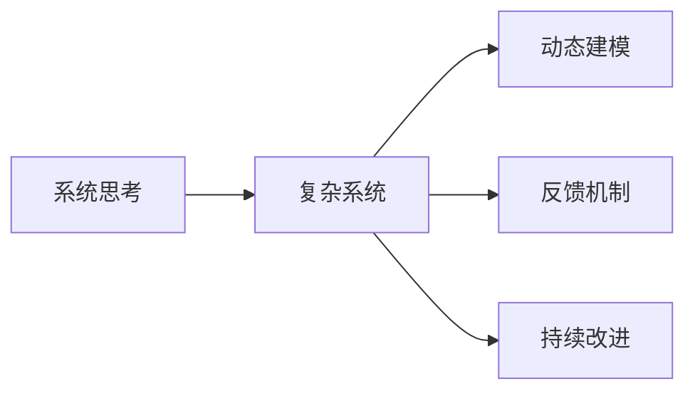
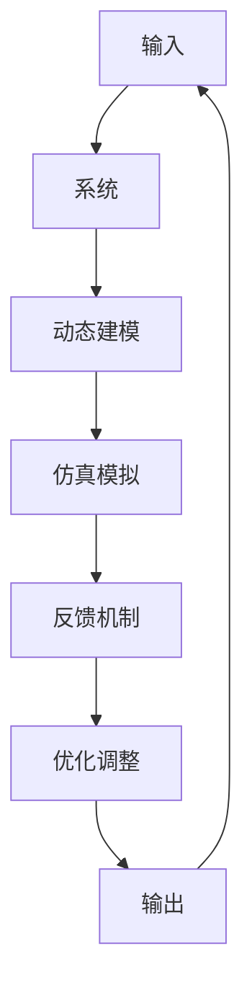

                 

# 系统思考在危机管理中的应用

> 关键词：系统思考, 危机管理, 复杂系统, 动态建模, 反馈机制, 持续改进

## 1. 背景介绍

在当今这个充满不确定性和复杂性的世界中，危机管理已成为组织和政府应对各种突发事件的必要能力。无论是自然灾害、公共卫生事件、网络攻击还是经济危机，有效的危机管理不仅能减轻损失，还能在危机后迅速恢复，甚至转危为机。系统思考作为一种强有力的工具，为危机管理提供了全新的视角和方法。

系统思考是一种研究复杂系统的方法论，它帮助人们理解系统各组成部分之间的相互作用和因果关系，从而识别出系统内部的动态变化和关键因素。在危机管理中，系统思考能够帮助管理者全面、动态地分析问题，制定更有效的应对策略。本文将深入探讨系统思考在危机管理中的应用，以及如何利用系统思考优化危机响应流程。

## 2. 核心概念与联系

### 2.1 核心概念概述

为更好地理解系统思考在危机管理中的应用，我们先介绍几个关键概念：

- **系统思考(System Thinking)**：一种全面、动态、整体的思考方式，强调系统各部分之间的相互作用和因果关系，以及系统整体与环境之间的关系。
- **复杂系统(Complex Systems)**：由大量相互关联的组件组成，具有自组织、自适应、自调节等特性的系统，如生态系统、经济系统、社会系统等。
- **动态建模(Dynamic Modeling)**：使用数学模型或仿真模型来描述和预测复杂系统的动态行为。
- **反馈机制(Feedback Mechanisms)**：系统内部的信息反馈和调节机制，用于维持系统的稳定性或实现特定的功能。
- **持续改进(Continuous Improvement)**：通过不断的观察、评估和调整，不断优化系统的性能和效率。

这些概念之间的逻辑关系可以通过以下Mermaid流程图来展示：



这个流程图展示了系统思考如何在复杂系统的各个环节中发挥作用，从动态建模到持续改进，形成一个闭环的优化过程。

### 2.2 核心概念原理和架构的 Mermaid 流程图



这个流程图展示了系统思考在危机管理中的整体架构：输入系统的初始数据，通过动态建模和仿真模拟得到系统的行为预测，再通过反馈机制和优化调整不断迭代，最终输出优化后的危机应对策略。

## 3. 核心算法原理 & 具体操作步骤

### 3.1 算法原理概述

系统思考在危机管理中的应用，主要基于以下原理：

1. **整体观**：将危机视为一个整体系统，识别出系统中的关键组成部分及其相互关系。
2. **动态观**：理解系统的动态变化过程，识别出系统中的不稳定因素和临界点。
3. **因果观**：明确系统中的因果关系，理解各个因素之间的相互影响。
4. **反馈观**：利用系统的反馈机制，及时调整和优化危机响应策略。
5. **持续改进观**：通过不断的观察、评估和调整，不断提升危机管理的水平。

### 3.2 算法步骤详解

基于系统思考的危机管理可以分为以下几个关键步骤：

**Step 1: 系统建模**
- 收集系统的输入数据，包括历史事件、环境因素、系统组成等。
- 使用系统动力学、系统仿真等方法，构建系统的动态模型。
- 确定系统的关键变量和参数，以及它们之间的因果关系。

**Step 2: 仿真模拟**
- 使用数学模型或仿真软件，对系统进行仿真模拟，预测系统的行为和趋势。
- 通过不同的输入参数组合，分析系统在不同情境下的行为表现。
- 评估系统的稳定性和临界点，识别出潜在的风险和危机触发点。

**Step 3: 反馈机制设计**
- 设计系统的反馈机制，确保系统能够在出现偏差时自动调整和校正。
- 利用仿真模拟结果，优化反馈机制的设计，提高系统的鲁棒性和适应性。
- 在仿真模拟中不断迭代反馈机制，确保其能够在实际应用中有效运作。

**Step 4: 持续改进**
- 根据仿真模拟结果和实际数据，不断优化系统的反馈机制和应对策略。
- 定期评估系统的性能和稳定性，识别出需要改进的环节。
- 通过不断的优化和调整，提升系统应对危机的能力。

### 3.3 算法优缺点

基于系统思考的危机管理具有以下优点：

1. **全面性**：系统思考能够全面地分析危机管理的各个环节，识别出系统内部的动态变化和关键因素。
2. **动态性**：通过动态建模和仿真模拟，系统思考能够实时预测和响应系统变化，提高危机的应对效率。
3. **因果清晰度**：系统思考能够明确系统中的因果关系，有助于制定更加精准的应对策略。
4. **鲁棒性**：通过反馈机制和持续改进，系统思考能够提高系统的鲁棒性和适应性，避免灾难性结果。

同时，该方法也存在一定的局限性：

1. **模型复杂性**：动态建模和仿真模拟的复杂性较高，需要专业知识和技术支持。
2. **数据需求高**：需要大量的高质量数据作为输入，收集和处理数据的成本较高。
3. **实施难度大**：在实际操作中，系统思考的应用需要跨部门协作，协调难度较大。
4. **需要专业知识**：系统思考的实施需要具备系统动力学、仿真建模等相关领域的专业知识。

尽管存在这些局限性，但就目前而言，系统思考仍是在复杂环境下进行危机管理的重要工具。未来相关研究的重点在于如何进一步简化模型，降低数据需求，提高实施效率，同时兼顾可解释性和鲁棒性等因素。

### 3.4 算法应用领域

系统思考在危机管理中的应用非常广泛，覆盖了几乎所有常见类型，例如：

- 自然灾害管理：如地震、洪水、飓风等，通过系统思考分析气象、地质、社会经济等各因素之间的相互作用，制定应对策略。
- 公共卫生事件：如传染病爆发、疫情扩散等，通过系统思考分析人群流动、医疗资源、信息传播等各环节，优化防控措施。
- 网络安全威胁：如黑客攻击、数据泄露等，通过系统思考分析攻击手段、网络架构、系统漏洞等各因素，制定防护方案。
- 经济金融危机：如金融危机、市场波动等，通过系统思考分析市场机制、政策调控、企业行为等各环节，制定救助措施。
- 社会治理问题：如群体性事件、社会动荡等，通过系统思考分析社会矛盾、群体心理、政策效果等各因素，制定治理策略。

除了上述这些经典应用外，系统思考还被创新性地应用到更多场景中，如城市应急响应、灾害预警、能源管理等，为危机管理提供了新的解决方案。随着系统思考方法的发展和普及，相信在更多领域能够更好地发挥其优势，提升危机管理的科学性和有效性。

## 4. 数学模型和公式 & 详细讲解 & 举例说明

### 4.1 数学模型构建

系统思考在危机管理中的数学模型构建，主要基于系统动力学(System Dynamics)和仿真建模(Simulation Modeling)的方法。

系统动力学是一种研究系统动态行为的工具，通过构建系统的因果关系图，使用微分方程组描述系统的动态变化。常用的系统动力学模型包括Stock and Flow模型、Holistic Feedback模型等。

仿真建模则使用软件工具（如AnyLogic、Simulink等），对系统进行模拟仿真，预测系统的行为和趋势。仿真建模可以分为连续仿真和离散仿真两种方式。

### 4.2 公式推导过程

以下以Stock and Flow模型为例，展示系统动力学的公式推导过程。

假设系统由两个变量$x$和$y$组成，其动态关系可以用微分方程组表示：

$$
\frac{dx}{dt} = ax + by
$$

$$
\frac{dy}{dt} = cx + dy + e
$$

其中$a$、$b$、$c$、$d$、$e$为系统参数，$x$和$y$为状态变量，$t$为时间。

通过对上述方程组进行解算，可以得到系统的稳态解和动态变化过程。在实际应用中，我们还需要使用仿真软件对系统进行模拟，观察不同参数组合下的系统行为，以及系统的稳定性、临界点等关键特性。

### 4.3 案例分析与讲解

以下以公共卫生事件管理为例，展示系统思考的应用。

假设某地区爆发了传染性疫情，系统动力学模型可以描述如下：

1. **输入**：人口规模、传染病传播速度、医疗资源、公共卫生政策等。
2. **状态变量**：确诊病例数、疑似病例数、重症病例数、死亡病例数等。
3. **动态方程**：
   - 确诊病例数：$\frac{dx}{dt} = k_1*I + k_2*S - k_3*x$（其中$k_1$为感染率，$k_2$为治愈率，$k_3$为死亡率）
   - 疑似病例数：$\frac{dy}{dt} = k_4*I - k_5*y$（其中$k_4$为检测率，$k_5$为确认率）
   - 重症病例数：$\frac{dz}{dt} = k_6*x - k_7*z$（其中$k_6$为重症转化率，$k_7$为治愈率）
   - 死亡病例数：$\frac{dw}{dt} = k_8*z$（其中$k_8$为死亡率）

使用仿真软件对这些方程进行求解和仿真，可以得到疫情在不同防控措施下的发展趋势，以及系统的临界点和关键参数。

## 5. 项目实践：代码实例和详细解释说明

### 5.1 开发环境搭建

在进行系统思考在危机管理中的应用时，我们需要准备好开发环境。以下是使用Python进行AnyLogic开发的环境配置流程：

1. 安装Anaconda：从官网下载并安装Anaconda，用于创建独立的Python环境。

2. 创建并激活虚拟环境：
```bash
conda create -n py-anylogic python=3.8 
conda activate py-anylogic
```

3. 安装AnyLogic：从官网下载并安装AnyLogic，安装过程中需要选择Python版本和安装路径。

4. 安装各类工具包：
```bash
pip install numpy pandas scikit-learn matplotlib tqdm jupyter notebook ipython
```

完成上述步骤后，即可在`py-anylogic`环境中开始项目实践。

### 5.2 源代码详细实现

这里以AnyLogic为例，展示如何构建一个简单的系统动力学模型。

首先，创建一个新的AnyLogic项目，并选择系统动力学模型。

在模型树中，添加人口模块和疫情传播模块：

```plaintext
人口模块：
- 人数：x
- 出生率：0.01
- 死亡率：0.01

疫情传播模块：
- 感染率：0.1
- 治愈率：0.05
- 重症转化率：0.1
- 死亡率：0.05
- 确诊病例：y
- 疑似病例：z
```

然后，在模型中添加仿真配置：

```plaintext
- 时间步长：1天
- 仿真运行时间：100天
- 数据输出：每日新增确诊、疑似、重症、死亡病例
```

最后，运行仿真，并使用Matplotlib对结果进行可视化：

```python
import matplotlib.pyplot as plt
import numpy as np

# 读取仿真数据
x = np.loadtxt('population.txt', delimiter=',')
y = np.loadtxt('infection.txt', delimiter=',')
z = np.loadtxt('suspected.txt', delimiter=',')
w = np.loadtxt('critical.txt', delimiter=',')
d = np.loadtxt('death.txt', delimiter=',')

# 绘制图表
plt.plot(x, label='人口')
plt.plot(y, label='确诊')
plt.plot(z, label='疑似')
plt.plot(w, label='重症')
plt.plot(d, label='死亡')
plt.legend()
plt.show()
```

这样就完成了一个简单的系统动力学模型的构建和仿真运行。通过不断调整参数和模型结构，可以得到更为精准的危机预测结果。

### 5.3 代码解读与分析

这里我们以一个具体的案例来详细解读代码实现：

**人口模块**：
- 添加一个“人数”模块，用于存储人口数量。
- 添加一个“出生率”模块，设定为0.01。
- 添加一个“死亡率”模块，设定为0.01。

**疫情传播模块**：
- 添加一个“感染率”模块，设定为0.1。
- 添加一个“治愈率”模块，设定为0.05。
- 添加一个“重症转化率”模块，设定为0.1。
- 添加一个“死亡率”模块，设定为0.05。
- 添加一个“确诊病例”模块，用于存储确诊病例数量。
- 添加一个“疑似病例”模块，用于存储疑似病例数量。
- 添加一个“重症病例”模块，用于存储重症病例数量。
- 添加一个“死亡病例”模块，用于存储死亡病例数量。

**仿真配置**：
- 设定时间步长为1天。
- 设定仿真运行时间为100天。
- 设定数据输出为每日新增确诊、疑似、重症、死亡病例。

通过这样的配置，AnyLogic会自动生成系统动力学模型，并运行仿真。在仿真结束后，使用Matplotlib对结果进行可视化，可以清晰地展示疫情的发展趋势。

当然，在实际操作中，需要根据具体问题进行详细的模型构建和仿真分析。系统思考的应用需要跨学科、跨部门的协作，通常需要多轮迭代才能得到理想的结果。

## 6. 实际应用场景

### 6.1 智能城市应急响应

智能城市应急响应系统通过系统思考，整合城市各环节的动态信息，构建全面的应急响应框架。系统思考能够帮助城市管理者全面理解城市运行和应急响应的各个环节，如交通、医疗、能源、通信等，实时监测和预测应急事件的发展趋势，及时调整应急响应策略。

例如，在自然灾害应急响应中，系统思考可以综合分析气象、地质、地理等各因素，构建动态的灾害预警系统。通过仿真模拟，预测灾害发生的概率和影响范围，提前进行风险评估和应急预案制定。

### 6.2 重大疫情监测与控制

重大疫情监测与控制系统通过系统思考，构建多维度的疫情监测和控制框架。系统思考能够帮助卫生健康部门全面理解疫情的传播途径和控制措施，实时监测和预测疫情的扩散趋势，及时调整防控策略。

例如，在疫情期间，系统思考可以构建多层次的疫情监测系统，综合分析人群流动、医疗资源、检测数据等各因素，构建疫情预测模型。通过仿真模拟，预测疫情的发展趋势，及时调整防控措施，如封锁、隔离、检测等，有效控制疫情的扩散。

### 6.3 金融市场风险管理

金融市场风险管理通过系统思考，构建全面的市场风险监测和控制框架。系统思考能够帮助金融机构全面理解市场运行和风险因素，实时监测和预测市场的波动趋势，及时调整风险控制策略。

例如，在系统思考的金融风险管理中，可以构建多维度的市场风险预测模型，综合分析市场机制、政策调控、企业行为等各因素，预测市场的波动趋势。通过仿真模拟，预测市场的风险水平，及时调整风险控制措施，如风险管理策略、资本准备、流动性管理等，有效控制市场风险。

### 6.4 未来应用展望

随着系统思考在危机管理中的应用不断深入，未来将呈现以下几个发展趋势：

1. **多模态数据融合**：系统思考将不仅仅是单一的数据分析工具，而是多模态数据融合的重要手段。未来将融合语音、图像、视频等多模态数据，构建更为全面的危机管理系统。
2. **智能决策支持**：系统思考将结合人工智能技术，构建智能决策支持系统，帮助管理者快速决策，提升应急响应的效率和精准性。
3. **实时动态监测**：通过实时数据采集和动态仿真模拟，系统思考将实现对危机的实时动态监测和预警，提升应急响应的及时性和有效性。
4. **自适应优化**：系统思考将结合自适应算法，实时优化应对策略，提升系统的鲁棒性和适应性。
5. **跨部门协同**：系统思考将结合跨部门协同工具，如区块链、大数据平台等，实现多部门协同作战，提升应急响应的协调性和高效性。

未来，系统思考将在更多领域得到应用，为危机管理提供更加全面、动态、智能的解决方案。

## 7. 工具和资源推荐

### 7.1 学习资源推荐

为了帮助开发者系统掌握系统思考在危机管理中的应用，这里推荐一些优质的学习资源：

1. 《系统思考在系统动力学中的应用》系列博文：由系统动力学专家撰写，深入浅出地介绍了系统思考的基本原理和应用案例。

2. 《系统动力学建模与仿真》课程：斯坦福大学开设的系统动力学课程，提供了丰富的理论知识和实践案例，适合初学者系统学习。

3. 《系统思考与复杂系统管理》书籍：系统思考领域的经典著作，详细介绍了系统思考在多个领域的应用，包括危机管理。

4. AnyLogic官方文档：AnyLogic的官方文档，提供了全面的模型构建和仿真分析指导，是使用系统动力学进行危机管理的重要参考。

5. Hugues Frasconi的博客：系统动力学领域的权威专家，提供大量系统动力学模型和仿真案例，适合深入学习。

通过对这些资源的学习实践，相信你一定能够全面掌握系统思考在危机管理中的应用，并用于解决实际的危机管理问题。

### 7.2 开发工具推荐

高效的开发离不开优秀的工具支持。以下是几款用于系统思考在危机管理中应用的常用工具：

1. AnyLogic：由AnyLogic公司开发的系统动力学建模与仿真软件，支持多维度的动态仿真分析。

2. MATLAB/Simulink：由MathWorks开发的仿真软件，支持多种数学模型和仿真分析。

3. Python+SimPy：基于Python的开源仿真工具，适合快速迭代和自动化仿真分析。

4. Gephi：开源网络分析工具，适合分析系统内部的网络结构和关系。

5. Tableau：数据可视化工具，适合对系统数据进行可视化分析。

合理利用这些工具，可以显著提升系统思考在危机管理中的应用效率，加速创新迭代的步伐。

### 7.3 相关论文推荐

系统思考在危机管理中的应用源于学界的持续研究。以下是几篇奠基性的相关论文，推荐阅读：

1. "Viable System Modeling in Disaster Management" by A. Tsoularis et al.：探讨了系统动力学在灾害管理中的应用，提出了基于系统动力学的灾害预警模型。

2. "Complex Systems Modeling for Public Health Emergency Management" by J. L. Stillman et al.：研究了系统思考在公共卫生应急管理中的应用，构建了基于系统动态学的疾病传播模型。

3. "Systems Thinking for Cybersecurity" by P. Sikharulidze et al.：探讨了系统思考在网络安全中的潜在应用，提出了基于系统动力学的威胁预测模型。

4. "Modeling Financial Risk with System Dynamics" by P. O. Johnson：研究了系统思考在金融风险管理中的应用，提出了基于系统动力学的市场风险预测模型。

5. "Real-time Agent-based Modeling for Disaster Management" by K. Saravanan et al.：研究了基于代理系统的系统思考在灾害管理中的应用，提出了实时动态仿真模拟模型。

这些论文代表了大系统思考在危机管理中的发展脉络。通过学习这些前沿成果，可以帮助研究者把握学科前进方向，激发更多的创新灵感。

## 8. 总结：未来发展趋势与挑战

### 8.1 研究成果总结

本文对系统思考在危机管理中的应用进行了全面系统的介绍。首先阐述了系统思考在危机管理中的基本原理和应用场景，明确了系统思考在复杂系统分析和管理中的独特价值。其次，从原理到实践，详细讲解了系统思考的数学模型和仿真模拟方法，给出了系统思考在危机管理中的应用案例和详细代码实现。同时，本文还广泛探讨了系统思考在智能城市应急响应、重大疫情监测与控制、金融市场风险管理等多个领域的应用前景，展示了系统思考的强大潜力。此外，本文精选了系统思考的相关学习资源，力求为读者提供全方位的技术指引。

通过本文的系统梳理，可以看到，系统思考在危机管理中的应用正成为一种重要的思维工具，为管理者提供了全面的系统分析视角。利用系统思考，可以全面理解危机管理的各个环节，构建动态的应对策略，提升应急响应的效率和精准性。未来，随着系统思考方法的发展和普及，相信在更多领域能够更好地发挥其优势，提升危机管理的科学性和有效性。

### 8.2 未来发展趋势

展望未来，系统思考在危机管理中的应用将呈现以下几个发展趋势：

1. **多模态数据融合**：系统思考将不仅仅是单一的数据分析工具，而是多模态数据融合的重要手段。未来将融合语音、图像、视频等多模态数据，构建更为全面的危机管理系统。
2. **智能决策支持**：系统思考将结合人工智能技术，构建智能决策支持系统，帮助管理者快速决策，提升应急响应的效率和精准性。
3. **实时动态监测**：通过实时数据采集和动态仿真模拟，系统思考将实现对危机的实时动态监测和预警，提升应急响应的及时性和有效性。
4. **自适应优化**：系统思考将结合自适应算法，实时优化应对策略，提升系统的鲁棒性和适应性。
5. **跨部门协同**：系统思考将结合跨部门协同工具，如区块链、大数据平台等，实现多部门协同作战，提升应急响应的协调性和高效性。

以上趋势凸显了系统思考在危机管理中的广阔前景。这些方向的探索发展，必将进一步提升危机管理的科学性和有效性。

### 8.3 面临的挑战

尽管系统思考在危机管理中的应用已经取得了显著进展，但在迈向更加智能化、普适化应用的过程中，仍面临诸多挑战：

1. **模型复杂性**：系统思考的动态建模和仿真模拟复杂性较高，需要专业知识和技术支持。
2. **数据需求高**：需要大量的高质量数据作为输入，收集和处理数据的成本较高。
3. **实施难度大**：在实际操作中，系统思考的应用需要跨部门协作，协调难度较大。
4. **需要专业知识**：系统思考的实施需要具备系统动力学、仿真建模等相关领域的专业知识。

尽管存在这些挑战，但系统思考作为危机管理的重要工具，其应用价值和研究意义不可忽视。未来需要进一步简化模型，降低数据需求，提高实施效率，同时兼顾可解释性和鲁棒性等因素。

### 8.4 研究展望

面对系统思考在危机管理中所面临的挑战，未来的研究需要在以下几个方面寻求新的突破：

1. **简化模型结构**：开发更加简洁易懂的系统动力学模型，降低实施难度，提高模型可解释性。
2. **降低数据需求**：探索基于小样本学习、半监督学习等方法，减少数据需求，提升数据处理效率。
3. **提高实施效率**：结合云计算、边缘计算等技术，提高模型部署和运行的效率，实现实时动态监测和优化。
4. **增强可解释性**：利用自然语言处理、知识图谱等技术，增强模型的可解释性，提高决策的可信度。
5. **提高鲁棒性**：研究系统思考与人工智能技术的结合，增强模型的鲁棒性和适应性，应对复杂的应急场景。
6. **跨部门协同**：开发跨部门协同平台，整合数据和资源，实现多部门协同作战，提升应急响应的协调性和效率。

这些研究方向的探索，必将引领系统思考在危机管理中走向更高的台阶，为构建安全、可靠、高效的应急响应系统铺平道路。面向未来，系统思考需要与其他人工智能技术进行更深入的融合，如知识表示、因果推理、强化学习等，多路径协同发力，共同推动应急响应的进步。

## 9. 附录：常见问题与解答

**Q1：系统思考在危机管理中的应用是否仅限于系统动力学？**

A: 系统思考在危机管理中的应用不仅限于系统动力学，还包括其他多种方法，如仿真建模、因果推断等。系统动力学是系统思考的一种重要工具，但其他方法同样能够帮助管理者全面理解系统动态变化。在实际操作中，可以根据具体问题选择合适的分析方法。

**Q2：系统思考是否适用于所有类型的危机管理？**

A: 系统思考在处理复杂系统时表现出色，但对于简单系统或静态系统，可能不如其他方法有效。系统思考适用于需要全面分析系统动态变化和各因素相互作用的场景，如自然灾害、公共卫生事件、金融市场等。对于简单的系统，可以考虑其他分析方法，如统计分析、因果推断等。

**Q3：系统思考是否需要跨部门协作？**

A: 系统思考在危机管理中需要跨部门协作，因为危机管理涉及多个环节和多个部门。跨部门协作有助于全面理解系统动态变化和各因素相互作用的复杂性，从而制定更为科学、合理的应急响应策略。

**Q4：系统思考在实际操作中如何提高效率？**

A: 提高系统思考在实际操作中的效率，可以从以下几个方面入手：
1. 使用自动化工具和软件，如AnyLogic、MATLAB等，提高建模和仿真的效率。
2. 引入多层次的反馈机制，实时监测和调整系统行为。
3. 采用分布式计算和云平台，提高数据处理和模型部署的效率。
4. 结合人工智能技术，如机器学习、深度学习等，提升系统思考的智能化水平。

**Q5：系统思考在实际操作中如何保证数据质量？**

A: 保证系统思考在实际操作中的数据质量，可以从以下几个方面入手：
1. 采用多来源数据融合技术，提高数据的全面性和准确性。
2. 使用数据清洗和预处理技术，去除噪声和异常值，提高数据的清洁度。
3. 引入数据验证和质量评估机制，定期检查和评估数据质量。
4. 采用分布式数据存储和管理技术，提高数据的安全性和可靠性。

通过这些措施，可以有效保证系统思考在实际操作中的数据质量，从而提升系统的准确性和可靠性。

---

作者：禅与计算机程序设计艺术 / Zen and the Art of Computer Programming

