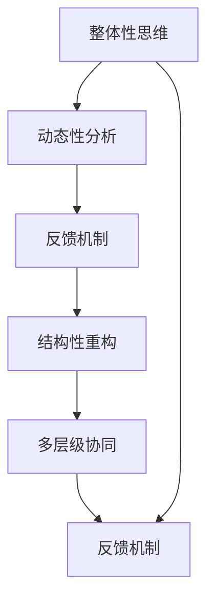

                 

# 系统思考在组织变革中的应用

系统思考是一种高级思维模式，它能够帮助我们全面、动态地分析问题，从整体上把握系统各个要素之间的相互作用，实现系统的最优运行。在组织变革中，系统思考具有重要应用，可以帮助企业从顶层设计和底层实施两方面进行深入的改革，实现业务持续改进、创新。本文将系统思考的概念、方法及其实践应用进行详细介绍，为企业的组织变革提供有益的参考。

## 1. 背景介绍

### 1.1 问题由来

在现代企业发展中，市场竞争日益激烈，业务环境快速变化，企业需要不断进行自我革新，才能保持竞争力。然而，组织变革的复杂性和多维性使其成为一项艰巨的任务，传统自上而下或自下而上的改革往往难以达成一致目标，最终导致改革失败或效果不显著。因此，采用系统思考的思维模式，全面理解组织变革的复杂性和多维度影响，有助于制定合理的变革策略，从而实现持续发展和创新。

### 1.2 问题核心关键点

系统思考在组织变革中应用的核心关键点主要包括：

- **整体性思维**：组织变革是一个复杂的整体系统，需要从整体出发，考虑各要素之间的相互作用，而非孤立地看待问题。
- **动态性分析**：组织环境是动态变化的，需要持续监测和适应外部变化，及时调整策略。
- **反馈机制**：组织变革过程中需要建立有效的反馈机制，以监控变革效果，及时调整实施方案。
- **结构性重构**：需要从结构层面进行优化，重构组织架构，提升运营效率和创新能力。
- **多层级协同**：变革策略需要多层级协同，上下级之间保持沟通，确保目标一致。

这些关键点共同构成了系统思考在组织变革中的基本框架，帮助企业从不同角度全面理解变革过程，制定科学的策略。

## 2. 核心概念与联系

### 2.1 核心概念概述

在系统思考中，有几个核心概念尤为重要：

- **系统**：系统是由相互关联的元素构成的整体，其结构和功能取决于各元素之间的关系。
- **反馈**：反馈是系统中的重要机制，通过信息传递来调整系统的状态和行为。
- **层级**：组织系统通常由多个层级组成，每个层级都有其独特的职责和目标。
- **复杂性**：组织系统具有复杂性，元素之间的关系复杂多样，需要通过系统思考来理解和处理。

这些概念在组织变革中的应用，可以帮助企业从宏观和微观层面全面把握变革方向和策略，实现系统的最优运行。

### 2.2 核心概念原理和架构的 Mermaid 流程图



此图展示了系统思考在组织变革中的整体框架，各环节互相影响，共同决定变革效果。

## 3. 核心算法原理 & 具体操作步骤

### 3.1 算法原理概述

系统思考在组织变革中的算法原理主要围绕系统动力学和反馈机制展开。系统动力学是研究系统结构和行为变化规律的方法，反馈机制则是通过信息传递调整系统行为的重要机制。在组织变革中，需要综合运用系统动力学和反馈机制，全面监测和调整变革过程，确保其顺利实施。

### 3.2 算法步骤详解

系统思考在组织变革中的具体操作步骤如下：

1. **系统建模**：建立组织系统的模型，识别各要素之间的关系，明确系统的输入和输出。
2. **设定目标**：根据组织目标，设定变革的明确目标，确保目标一致。
3. **动态分析**：对系统进行动态分析，识别关键节点和影响因素。
4. **建立反馈机制**：建立有效的反馈机制，监控变革过程，及时调整策略。
5. **结构重构**：根据分析结果，从结构层面进行优化，重构组织架构，提升运营效率和创新能力。
6. **多层级协同**：推动跨层级沟通，确保变革策略的一致性和执行力。
7. **持续优化**：持续监测变革效果，不断优化和调整策略，实现持续改进。

### 3.3 算法优缺点

系统思考在组织变革中的优势包括：

- **全面性**：能够从整体上把握组织变革的复杂性和多维度影响。
- **动态性**：能够持续监测和适应外部变化，及时调整策略。
- **系统性**：能够识别关键节点和影响因素，制定科学合理的变革策略。

然而，系统思考也存在以下缺点：

- **复杂性**：需要较高的专业知识和技能，对操作者要求较高。
- **实施难度**：需要时间和资源进行系统建模和分析，实施成本较高。
- **反馈滞后**：建立反馈机制需要时间，反馈信息可能滞后，影响决策。

### 3.4 算法应用领域

系统思考在组织变革中的应用领域包括：

- **业务流程优化**：通过系统思考，全面识别流程中的瓶颈和问题，进行优化。
- **组织架构调整**：系统思考能够帮助企业重新审视组织架构，实现结构优化。
- **战略制定**：从系统视角制定战略，确保各部分协同一致，提升企业竞争力。
- **企业文化建设**：系统思考能够帮助企业识别文化中的问题，进行有针对性的改进。
- **创新管理**：系统思考能够支持企业构建创新生态系统，提升创新能力。

## 4. 数学模型和公式 & 详细讲解 & 举例说明

### 4.1 数学模型构建

系统思考在组织变革中的数学模型构建，主要依赖于系统动力学方程和反馈控制理论。以一个简单的生产系统为例，假设系统包含生产、库存、需求三个要素，其数学模型可以表示为：

$$
\dot{S} = P - D - K(S - S_{\text{ref}})
$$

其中，$S$为库存水平，$P$为生产量，$D$为需求量，$K$为调节系数，$S_{\text{ref}}$为参考库存水平。

### 4.2 公式推导过程

以库存系统为例，其控制方程为：

$$
S_{n+1} = S_n + P_n - D_n
$$

其中，$S_n$为第$n$次库存量，$P_n$为第$n$次生产量，$D_n$为第$n$次需求量。

通过该方程，可以推导出库存系统的控制方程，进而构建系统的动态模型。

### 4.3 案例分析与讲解

某制造企业进行生产系统优化，使用系统思考分析系统动力学方程，发现库存和生产量之间的关系，调整生产计划，提升库存管理效率。

## 5. 项目实践：代码实例和详细解释说明

### 5.1 开发环境搭建

在系统思考的实现中，需要使用Python和Simulink等工具。以下是一个基本的Python开发环境搭建过程：

1. 安装Python：从官网下载Python，安装最新版本。
2. 安装Simulink：安装Simulink，并确保与Python兼容。
3. 安装相关库：安装numpy、scipy等库，支持系统动力学模型计算。

### 5.2 源代码详细实现

以库存系统为例，以下是Python代码实现：

```python
import numpy as np
from scipy.integrate import odeint

# 初始化变量
S = 0  # 初始库存
P = 100  # 生产量
D = 50  # 需求量
K = 0.1  # 调节系数
S_ref = 200  # 参考库存水平

# 定义系统动力学方程
def differential_equations(S, t):
    dot_S = P - D - K * (S - S_ref)
    return [dot_S]

# 求解微分方程
t = np.linspace(0, 100, 101)
S_values = odeint(differential_equations, S, t)

# 输出结果
print(S_values)
```

### 5.3 代码解读与分析

上述代码实现了库存系统的系统动力学模型，通过求解微分方程，模拟库存随时间的变化过程。代码中，使用了scipy库的odeint函数求解微分方程，模拟库存系统。

### 5.4 运行结果展示

运行代码后，可以输出库存随时间的变化结果，帮助企业了解库存系统行为。

## 6. 实际应用场景

### 6.1 企业战略制定

企业在进行战略制定时，可以运用系统思考，识别系统要素之间的关键影响关系，构建战略模型，制定科学合理的战略方案。例如，通过系统思考分析市场需求、竞争环境、资源配置等因素，制定公司整体战略，实现长期发展。

### 6.2 流程优化

在系统思考的指导下，企业能够全面识别业务流程中的瓶颈和问题，进行优化。例如，通过对供应链系统进行系统思考，识别物流、库存管理中的问题，优化流程，提升效率。

### 6.3 组织架构调整

系统思考可以帮助企业从整体层面审视组织架构，识别结构性问题，进行优化。例如，通过系统思考识别部门之间协同不足的问题，进行职能调整，提升组织效率。

### 6.4 未来应用展望

系统思考在组织变革中的应用前景广阔，未来在以下领域将有更广泛的应用：

- **智能制造**：通过系统思考优化生产流程，提升制造效率。
- **数字化转型**：帮助企业构建数字化平台，实现业务数字化。
- **企业治理**：运用系统思考优化企业治理结构，提升治理效果。
- **创新管理**：通过系统思考构建创新生态系统，推动企业持续创新。

## 7. 工具和资源推荐

### 7.1 学习资源推荐

- 《系统思考与组织变革》：介绍系统思考的基本概念和在组织变革中的应用。
- 《系统动力学与组织学习》：详细讲解系统动力学理论及其在组织中的应用。
- 《组织设计与变革管理》：系统介绍组织设计理论，提供变革管理工具。
- 《Python编程：从入门到实践》：入门级Python编程书籍，帮助初学者快速上手。
- 《系统动力学模型在实际应用中》：展示系统动力学模型在实际项目中的应用案例。

### 7.2 开发工具推荐

- Python：广泛用于数据分析、科学计算等，支持系统思考模型的构建和计算。
- Simulink：可视化建模工具，支持系统动力学方程的可视化建模和仿真。
- Microsoft Power BI：支持数据可视化和分析，帮助企业进行系统监测和反馈。

### 7.3 相关论文推荐

- 《系统思考与组织变革研究综述》：综述系统思考在组织变革中的研究进展。
- 《基于系统思考的企业变革管理》：介绍系统思考在企业变革中的应用策略。
- 《系统动力学在生产系统优化中的应用》：展示系统动力学在生产系统优化中的应用。
- 《智能制造系统设计中的系统思考》：介绍系统思考在智能制造系统设计中的应用。

## 8. 总结：未来发展趋势与挑战

### 8.1 研究成果总结

系统思考在组织变革中的应用，已经展现出强大的潜力和优势。通过系统思考，企业能够全面把握变革的复杂性和多维度影响，制定科学合理的变革策略，实现持续改进和创新。然而，系统思考的实施仍面临一些挑战，如高要求的操作者、高成本的实施、反馈滞后等问题。

### 8.2 未来发展趋势

系统思考在组织变革中的未来发展趋势包括：

- **技术化**：系统思考工具和技术将更加完善，支持更多类型的系统分析和优化。
- **可视化**：系统思考工具将更加可视化，便于企业理解和应用。
- **智能化**：通过机器学习等技术，提升系统思考的智能化水平，实现更高效的决策。
- **泛化性**：系统思考理论和方法将逐步普及，更多企业能够应用系统思考进行变革。

### 8.3 面临的挑战

系统思考在组织变革中的实施仍面临以下挑战：

- **复杂性**：系统思考需要较高的专业知识和技能，操作难度较大。
- **资源投入**：实施系统思考需要时间和资源进行系统建模和分析，成本较高。
- **反馈滞后**：建立反馈机制需要时间，反馈信息可能滞后，影响决策。

### 8.4 研究展望

未来在系统思考的应用研究中，需要进一步探索和优化：

- **多层次系统建模**：探索多层次系统建模方法，提高系统分析和优化的准确性。
- **跨领域应用**：将系统思考应用于更多领域，提升其泛化性。
- **自动化工具**：开发自动化工具，降低系统思考实施的难度和成本。
- **知识普及**：推广系统思考的理论和方法，提升企业应用能力。

## 9. 附录：常见问题与解答

**Q1: 什么是系统思考？**

A: 系统思考是一种全面、动态的思维方式，通过理解系统各要素之间的相互作用，实现系统的最优运行。

**Q2: 系统思考在组织变革中的应用有何优势？**

A: 系统思考在组织变革中的优势包括全面性、动态性和系统性，能够从整体和动态层面全面把握变革过程，制定科学合理的策略。

**Q3: 系统思考的实施难点有哪些？**

A: 系统思考的实施难点包括高要求的操作者、高成本的实施和反馈滞后等问题，需要企业进行系统化的思考和管理。

**Q4: 如何提高系统思考的实施效果？**

A: 提高系统思考的实施效果，需要提升操作者的专业水平，优化实施工具和方法，建立有效的反馈机制，及时调整策略。

**Q5: 未来在系统思考的研究中需要关注哪些方向？**

A: 未来在系统思考的研究中，需要关注多层次系统建模、跨领域应用、自动化工具开发和知识普及等方向，提升其应用效果和普及性。

---

作者：禅与计算机程序设计艺术 / Zen and the Art of Computer Programming

