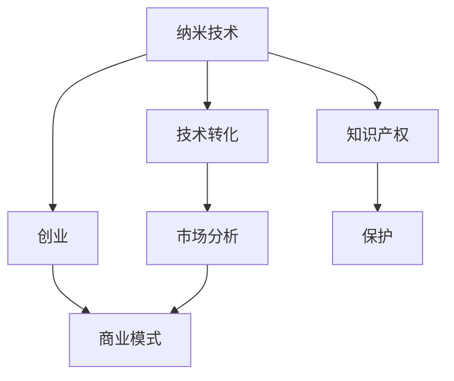

                 

# 纳米技术创业：微观世界的宏观应用

## 1. 背景介绍

### 1.1 问题由来

纳米技术（Nanotechnology）是21世纪科技革命的重要领域，它研究的是1-100纳米尺度下原子和分子的操纵和应用。这一领域的创新成果广泛应用于电子、医药、材料科学、环境保护等多个领域，带来了前所未有的技术突破和产业变革。随着纳米技术研究的不断深入，如何将其成果转化为实际应用，特别是如何实现商业化落地，成为了一个亟待解决的问题。

### 1.2 问题核心关键点

纳米技术创业的核心在于如何将科学研究转化为具有市场竞争力的产品或服务。这包括技术成熟度的评估、市场需求分析、商业模式设计、资金筹措、市场营销等多个环节。如何跨学科整合资源，形成创新产品，并在市场中脱颖而出，是纳米技术创业面临的主要挑战。

### 1.3 问题研究意义

纳米技术创业不仅能够加速科学研究转化为现实生产力，还能够促进经济增长、解决社会问题，提升人民生活质量。通过创新创业，可以有效利用科研机构的科研成果，加速新技术和新材料的应用，推动产业升级。

## 2. 核心概念与联系

### 2.1 核心概念概述

为更好地理解纳米技术创业，本节将介绍几个密切相关的核心概念：

- 纳米技术（Nanotechnology）：研究1-100纳米尺度下原子和分子的操纵和应用，包括纳米材料、纳米器件、纳米机器人等。
- 创业（Entrepreneurship）：将科研成果转化为商业化产品的过程，包括商业计划制定、市场调研、资金筹措、团队建设等。
- 技术转化（Technology Transfer）：将科研机构的科研成果转化为实际应用的技术和产品，涉及知识产权管理和知识产权保护。
- 市场分析（Market Analysis）：研究市场需求、竞争环境、消费者行为等，为产品开发和营销提供数据支持。
- 商业模式（Business Model）：描述企业如何创造价值、传递价值、获取价值的基本框架，包括价值主张、客户关系、渠道策略等。

这些核心概念之间的逻辑关系可以通过以下Mermaid流程图来展示：



这个流程图展示了大纳米技术创业的关键过程和联系：

1. 纳米技术研究出新成果。
2. 创业团队进行技术转化。
3. 分析市场需求，制定商业模式。
4. 知识产权保护。
5. 商业模式整合资源，推动产品上市。

这些核心概念共同构成了纳米技术创业的全过程，是实现科研价值转化的关键。

## 3. 核心算法原理 & 具体操作步骤

### 3.1 算法原理概述

纳米技术创业的算法原理可以归纳为以下几点：

1. **需求分析**：通过市场调研，确定目标市场的需求和潜在客户，评估市场需求规模和增长潜力。
2. **技术评估**：对现有科研成果进行技术成熟度评估，确定技术的可行性和竞争力。
3. **商业模型构建**：设计符合市场需求的商业模式，明确价值主张、客户关系和渠道策略。
4. **知识产权管理**：对科研成果进行知识产权登记和保护，确保创新成果不被非法侵占。
5. **产品开发与测试**：根据市场需求和商业模型，开发和测试新产品，确保产品质量和创新性。

### 3.2 算法步骤详解

纳米技术创业的算法步骤主要包括以下几个方面：

1. **市场调研与需求分析**：
   - 收集目标市场的数据和信息，包括市场规模、增长趋势、竞争格局等。
   - 分析消费者需求和行为，确定产品的市场定位和差异化策略。
   - 通过问卷调查、焦点小组、深度访谈等手段获取一手数据，形成市场分析报告。

2. **技术评估与选择**：
   - 对现有科研成果进行技术成熟度评估，包括技术可行性、创新性和商业潜力。
   - 选择符合市场需求和商业模式的技术路径，设计技术路线图。
   - 确定技术合作和知识产权保护策略，确保技术转化顺利进行。

3. **商业模型设计**：
   - 定义价值主张，即产品如何满足客户需求和解决痛点。
   - 设计客户关系管理策略，包括客户获取、维护和忠诚度提升。
   - 确定渠道策略，选择线上或线下销售模式，制定渠道拓展计划。

4. **产品开发与测试**：
   - 根据市场需求和技术路线图，进行产品开发和原型制作。
   - 开展测试和验证，评估产品性能、安全性和用户体验。
   - 根据测试结果，优化产品设计和功能，确保产品符合市场要求。

5. **市场营销与推广**：
   - 制定市场推广策略，包括广告、公关、内容营销等。
   - 选择目标客户群体，开展精准营销，提高市场渗透率。
   - 建立品牌形象，提升品牌知名度和美誉度。

### 3.3 算法优缺点

纳米技术创业的算法具有以下优点：

1. **资源整合能力强**：通过跨学科整合资源，将科学研究转化为商业应用。
2. **市场需求导向**：基于市场调研和需求分析，开发符合市场需求的产品。
3. **技术创新性高**：利用前沿科技成果，开发具有竞争力的新产品。
4. **商业模式灵活**：根据市场环境和产品特性，设计灵活的商业模式。

但同时也存在一些局限性：

1. **资金需求高**：技术研发和市场推广需要大量资金投入，创业初期面临资金压力。
2. **风险高**：市场变化快速，新产品推广和商业化存在不确定性。
3. **技术复杂**：纳米技术涉及多个学科，技术复杂度高，研发难度大。
4. **知识产权保护复杂**：涉及多个领域的知识产权问题，法律和政策环境复杂。

尽管存在这些局限性，纳米技术创业仍是大势所趋，未来的发展前景广阔。

### 3.4 算法应用领域

纳米技术创业在多个领域得到了广泛应用，例如：

1. **医疗健康**：利用纳米技术研发新型药物和医疗设备，如纳米粒子药物、生物传感器等。
2. **环境保护**：开发纳米材料用于废水处理、空气净化和土壤修复等环保技术。
3. **电子信息**：制造纳米电子器件，如纳米晶体管、纳米传感器等，提升电子设备的性能和功能。
4. **材料科学**：研究纳米材料的新特性和应用，如纳米复合材料、纳米涂层等。
5. **能源与环保**：利用纳米技术提升能源效率，开发环保材料和设备，如纳米催化材料、纳米能源电池等。

## 4. 数学模型和公式 & 详细讲解 & 举例说明

### 4.1 数学模型构建

纳米技术创业的数学模型可以表示为：

$$
\text{成功概率} = \text{技术成熟度} \times \text{市场需求} \times \text{商业模式创新性} \times \text{知识产权保护}
$$

其中，技术成熟度、市场需求、商业模式创新性和知识产权保护是影响创业成功的关键因素。

### 4.2 公式推导过程

根据上述公式，我们可以进一步推导出每个因素对成功概率的贡献度：

$$
\frac{\partial \text{成功概率}}{\partial \text{技术成熟度}} = \text{市场需求} \times \text{商业模式创新性} \times \text{知识产权保护}
$$

这意味着技术成熟度越高，创业成功的概率也越大。

### 4.3 案例分析与讲解

以纳米医药为例，分析技术成熟度、市场需求、商业模式创新性和知识产权保护对成功概率的影响：

1. **技术成熟度**：纳米医药的核心技术包括纳米粒子的制备和性能评估，目前已有多项研究成果，技术成熟度较高。
2. **市场需求**：近年来，癌症等重大疾病的发病率逐年上升，患者对新型抗肿瘤药物的需求不断增加，市场需求旺盛。
3. **商业模式创新性**：可以采用直销、线上线下结合等多种模式，并通过患者社群、医生合作等渠道推广，创新性较强。
4. **知识产权保护**：需要在国际上申请专利，确保知识产权不被侵犯，增强市场竞争力。

通过以上分析，可以看出纳米医药创业成功的概率较高。

## 5. 项目实践：代码实例和详细解释说明

### 5.1 开发环境搭建

在进行纳米技术创业的实践时，需要以下开发环境：

1. **编程语言**：Python是常用的纳米技术开发语言，具有丰富的库和工具支持。
2. **数据平台**：如Jupyter Notebook，支持交互式编程和数据可视化。
3. **数据库**：如MySQL或MongoDB，用于存储和管理市场调研和客户数据。
4. **模拟工具**：如Cadence、COMSOL等，用于仿真纳米器件和材料特性。

### 5.2 源代码详细实现

以纳米医药创业为例，给出使用Python进行市场调研和需求分析的代码实现。

```python
import pandas as pd
from sklearn.cluster import KMeans
from sklearn.decomposition import PCA

# 市场调研数据
data = pd.read_csv('market调研数据.csv')

# 数据预处理
data.dropna(inplace=True)
X = data.drop(['收入', '年龄'], axis=1)
y = data['收入']

# 聚类分析
kmeans = KMeans(n_clusters=3, random_state=42)
X_kmeans = kmeans.fit_predict(X)

# 主成分分析
pca = PCA(n_components=2)
X_pca = pca.fit_transform(X)

# 可视化
import matplotlib.pyplot as plt
plt.scatter(X_pca[:, 0], X_pca[:, 1], c=X_kmeans)
plt.xlabel('PC1')
plt.ylabel('PC2')
plt.title('市场需求分析')
plt.show()
```

### 5.3 代码解读与分析

**数据处理**：
- 使用pandas读取市场调研数据，并进行数据清洗，去除缺失值。
- 提取与收入相关的特征，作为聚类分析的输入。

**聚类分析**：
- 使用KMeans算法对市场进行聚类分析，将市场划分为多个细分市场。
- 可视化聚类结果，便于理解不同市场的特征和需求。

**主成分分析**：
- 使用PCA算法对市场特征进行降维，提取主要成分，便于数据分析。
- 可视化PCA结果，了解市场需求的主要影响因素。

### 5.4 运行结果展示

通过以上代码，可以生成聚类分析和主成分分析的结果图，直观展示市场细分的结果和主要影响因素。

## 6. 实际应用场景

### 6.1 医疗健康

纳米医药创业在医疗健康领域具有广阔的应用前景。例如，纳米粒子药物可以精确靶向肿瘤细胞，减少副作用，提高治疗效果。通过市场调研和需求分析，可以确定目标客户群体的需求，并设计合适的商业模式进行推广。

### 6.2 环境保护

纳米技术在环境保护领域也有巨大潜力。例如，纳米催化剂可以高效降解废水中的有机污染物，纳米吸附剂可以吸附重金属离子。通过对环境污染问题的分析，可以设计商业模型，提供环保咨询服务和技术解决方案。

### 6.3 能源与材料

纳米能源材料可以提升电池性能和太阳能转换效率，纳米复合材料可以增强材料的韧性和耐用性。通过能源和材料领域的市场调研，可以开发新产品，形成能源和材料产业集群。

### 6.4 未来应用展望

随着纳米技术的发展，未来将涌现更多创新应用。例如，纳米生物传感器可以实时监测健康状况，纳米智能材料可以实现自修复功能。纳米技术创业将不断推动科学技术和产业升级，带来更多的社会价值和经济效益。

## 7. 工具和资源推荐

### 7.1 学习资源推荐

为了帮助纳米技术创业者全面掌握相关知识，推荐以下学习资源：

1. **《纳米技术概论》**：介绍纳米技术的基本概念、发展历程和应用领域，适合入门学习。
2. **Coursera《纳米技术与材料科学》课程**：由斯坦福大学开设，涵盖纳米技术的基础理论和应用案例。
3. **《纳米技术创业指南》**：详细讲解纳米技术创业的各个环节，包括市场调研、技术转化、商业模式等。
4. **纳米技术创业交流社群**：如LinkedIn上的纳米技术创业小组，提供行业资讯和交流平台。

通过这些学习资源，可以全面了解纳米技术创业的各个环节，掌握相关技能。

### 7.2 开发工具推荐

纳米技术创业需要多种开发工具支持：

1. **Python编程语言**：简单易学，功能强大，适用于数据分析和算法开发。
2. **Jupyter Notebook**：交互式编程和数据可视化，支持多语言环境。
3. **MATLAB**：用于仿真和模拟，支持复杂的数学建模和数据分析。
4. **COMSOL Multiphysics**：用于纳米材料和器件的仿真分析，支持多物理场耦合。

### 7.3 相关论文推荐

纳米技术创业是一个跨学科的研究领域，推荐以下相关论文：

1. **Nature Communications《纳米技术与创业：未来的机遇与挑战》**：系统回顾了纳米技术创业的现状和未来发展方向。
2. **Science《纳米技术创业的创新策略》**：探讨了纳米技术创业的创新模式和策略，提供实用建议。
3. **IEEE Transactions on Nanotechnology《纳米技术创业的市场分析与商业模式设计》**：研究了市场调研和商业模式设计的方法和应用案例。

这些论文代表了大纳米技术创业的最新研究方向，值得深入学习和参考。

## 8. 总结：未来发展趋势与挑战

### 8.1 研究成果总结

本文对纳米技术创业的原理和实践进行了全面系统的介绍，重点关注了技术成熟度、市场需求、商业模式创新性和知识产权保护等因素。通过案例分析和代码实现，展示了纳米技术创业的实际应用场景和具体步骤。

### 8.2 未来发展趋势

展望未来，纳米技术创业将呈现以下几个发展趋势：

1. **技术创新加速**：随着纳米技术研究的深入，更多创新成果将涌现，推动市场应用。
2. **跨学科融合**：纳米技术创业将更多地与其他学科融合，形成跨学科的创新模式。
3. **全球化合作**：国际合作和开放创新将成为纳米技术创业的重要推动力。
4. **社会化应用**：纳米技术创业将更多地关注社会需求和环境问题，实现可持续发展。

### 8.3 面临的挑战

尽管纳米技术创业具有广阔前景，但仍面临诸多挑战：

1. **资金筹措困难**：纳米技术创业需要大量资金投入，创业初期面临资金短缺。
2. **技术风险高**：纳米技术研发具有高风险，产品转化和市场推广存在不确定性。
3. **知识产权复杂**：涉及多个领域的知识产权问题，法律和政策环境复杂。
4. **市场竞争激烈**：市场准入门槛低，存在大量竞争者，市场竞争激烈。

### 8.4 研究展望

未来，纳米技术创业需要在以下几个方面寻求新的突破：

1. **低成本制造**：开发低成本的纳米技术制造工艺，降低生产成本，增强市场竞争力。
2. **可持续发展**：关注环境和社会责任，实现可持续发展，提升社会价值。
3. **智能化应用**：结合人工智能和大数据分析，实现智能化应用，提高效率和效果。
4. **全球化视野**：拓宽国际视野，加强国际合作，实现全球化应用。

通过这些研究方向的探索，纳米技术创业必将在未来迎来新的突破和发展机遇。

## 9. 附录：常见问题与解答

**Q1：纳米技术创业的资金需求高，如何筹集资金？**

A: 可以通过天使投资、风投、政府基金、众筹等多种方式筹集资金。同时，可以利用创业比赛、技术展示会等平台吸引投资者的关注和投资。

**Q2：纳米技术创业的知识产权保护复杂，如何应对？**

A: 需要了解不同国家的知识产权法律和政策，选择合适的知识产权保护方式。可以申请专利、商标、版权等多重知识产权保护，确保技术创新成果的安全。

**Q3：纳米技术创业的技术风险高，如何降低风险？**

A: 可以通过市场调研和技术评估，明确技术可行性，选择技术成熟度高、市场需求大的项目。同时，开发多个技术方案，形成技术储备，降低风险。

**Q4：纳米技术创业的商业模式设计有哪些方法？**

A: 可以采用直销、线上线下结合、订阅服务等多种商业模式。根据市场环境和产品特性，选择最合适的商业模式，制定详细的商业计划。

**Q5：纳米技术创业的市场调研如何进行？**

A: 可以通过问卷调查、焦点小组、深度访谈等手段，收集目标市场的数据和信息，分析市场需求和消费者行为。同时，利用大数据和人工智能技术，进行数据分析和预测。

通过以上回答，可以看出纳米技术创业虽然面临诸多挑战，但通过合理的策略和工具，仍然可以克服困难，实现科技成果的商业化落地。

---

作者：禅与计算机程序设计艺术 / Zen and the Art of Computer Programming

