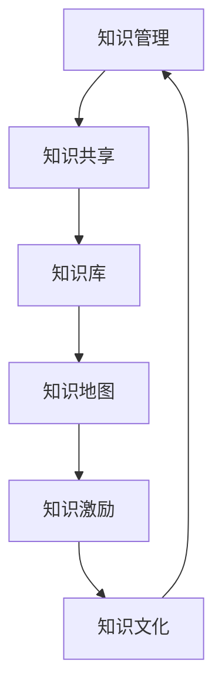

                 

# 经典著作:管理者构筑知识体系

> 关键词：管理，知识体系，领导力，战略规划，创新，绩效管理

## 1. 背景介绍

### 1.1 问题由来

在当今复杂多变的商业环境中，企业的管理者面临着前所未有的挑战。随着市场竞争的加剧，企业不仅需要应对传统的市场环境变化，还需要应对新出现的数字经济、环境可持续性、社会责任等多方面的压力。在这样的背景下，构建系统化的知识体系，提升管理者的领导力和决策能力，变得尤为重要。

管理者构筑知识体系不仅能够帮助他们在复杂环境中做出更加明智的决策，还能够提升企业的整体竞争力。然而，现实中许多企业仍然缺乏系统的知识管理机制，导致管理者在面对新问题时难以迅速找到解决方案。

### 1.2 问题核心关键点

构建知识体系的核心关键点包括以下几个方面：

- **系统化知识管理**：通过建立标准化的知识库、流程和工具，使知识能够被高效地收集、存储和利用。
- **知识共享与交流**：促进企业内外部知识的共享与交流，实现知识的跨部门、跨组织传播。
- **知识与实践结合**：将知识与实际业务操作相结合，转化为能够直接影响业务决策的行动方案。
- **持续学习与创新**：建立持续学习机制，推动知识体系的动态更新和创新，保持企业竞争力的领先地位。
- **领导力与文化**：通过领导力培训和文化建设，激发团队的学习热情和创新精神，促进知识体系的落地应用。

构建这样一个知识体系，需要管理者在战略规划、组织管理、人力资源、技术工具等多个方面进行系统思考和精心设计。

## 2. 核心概念与联系

### 2.1 核心概念概述

在构建知识体系的过程中，我们需要明确几个关键概念：

- **知识管理(Knowledge Management)**：通过组织和管理知识，以支持企业决策和运营的过程。
- **知识共享(Knowledge Sharing)**：通过各种方式促进知识和信息在组织内部的流通与传播。
- **知识库(Knowledge Base)**：一个集中的、结构化的知识存储系统，便于查询和应用。
- **知识地图(Knowledge Map)**：以图形化方式展示知识体系的构成和关系，帮助理解和管理知识。
- **知识激励(Knowledge Incentives)**：通过各种激励机制，鼓励员工分享和应用知识。
- **知识文化(Knowledge Culture)**：在企业内部培养重视知识、鼓励创新的文化氛围。

这些概念之间相互联系，形成一个有机的知识生态系统，支撑着企业的持续发展和创新。

### 2.2 核心概念原理和架构的 Mermaid 流程图



这个流程图展示了知识体系构建的基本架构，从知识管理开始，通过知识共享传播到知识库，再通过知识地图进行可视化，最终通过知识激励和知识文化促进知识的落地应用和持续创新。

## 3. 核心算法原理 & 具体操作步骤

### 3.1 算法原理概述

构建知识体系的过程，可以理解为对知识的收集、整理、存储、传播和应用的一连串操作。这些操作可以概括为以下几个步骤：

1. **知识收集**：通过各种渠道获取外部和内部知识。
2. **知识整理**：对收集到的知识进行分类、标签化、结构化等处理。
3. **知识存储**：将整理好的知识存储在知识库中，便于查询和检索。
4. **知识传播**：通过内部网、社交平台、培训课程等方式传播知识。
5. **知识应用**：将知识应用于业务决策、项目执行、员工培训等各个环节。

### 3.2 算法步骤详解

以下是构建知识体系的具体操作步骤：

**Step 1: 知识收集**

- **内部知识**：收集员工的工作文档、项目报告、会议记录、培训材料等。
- **外部知识**：从行业报告、学术期刊、专利文献、网络资源等渠道获取外部知识。
- **知识来源管理**：建立知识来源清单，对每个来源进行分类、评级和监控。

**Step 2: 知识整理**

- **分类和标签化**：根据知识内容，进行主题分类和标签化，便于搜索和浏览。
- **结构化**：将非结构化文本转换为结构化数据，便于分析和使用。
- **元数据管理**：为每个知识条目添加元数据（如创建日期、作者、修改历史等），便于管理和追踪。

**Step 3: 知识存储**

- **选择存储平台**：根据企业规模和需求，选择适合的知识管理平台（如Confluence、SharePoint、KM+等）。
- **构建知识架构**：设计知识分类和层次结构，确保知识的组织逻辑清晰。
- **定期更新和维护**：定期对知识库进行检查和更新，确保知识的准确性和时效性。

**Step 4: 知识传播**

- **内部传播**：利用企业内部网、内部社交平台（如Slack、Teams）等工具，传播知识。
- **外部传播**：通过开放平台（如GitHub、CSDN）等，与外部用户共享知识。
- **知识培训**：组织员工参加知识培训课程，提升知识应用能力。

**Step 5: 知识应用**

- **业务决策**：在业务决策过程中，参考知识库中的最佳实践和案例，辅助决策。
- **项目执行**：在项目执行过程中，应用知识库中的方法和工具，提高项目效率。
- **员工培训**：利用知识库进行员工培训，提升团队整体的知识水平。

### 3.3 算法优缺点

构建知识体系的优势：

- **提升决策质量**：知识体系提供了丰富的决策依据，减少了信息不对称带来的决策风险。
- **提高工作效率**：通过知识共享和复用，减少了重复工作，提升了工作效率。
- **促进创新**：知识体系的建立有助于识别和利用潜在的创新点，促进企业创新。

构建知识体系的缺点：

- **投入成本高**：初期建设和维护知识体系需要较高的资源投入。
- **需要持续更新**：知识库需要定期更新和维护，保持其时效性和准确性。
- **知识共享文化需要培育**：建立知识共享文化需要时间和管理者的引导。

### 3.4 算法应用领域

构建知识体系不仅适用于传统的制造行业，也适用于高科技、互联网、金融等创新型企业。以下是一些具体的应用领域：

- **研发领域**：通过构建知识库，集中存储和管理技术文档、专利信息等，提升研发效率和创新能力。
- **市场营销**：收集和整理市场调研报告、客户反馈等，支持市场策略的制定和优化。
- **人力资源管理**：记录和分享培训材料、员工绩效评估结果等，提升人力资源管理水平。
- **客户服务**：构建客户服务知识库，提供标准化的服务指南和常见问题解答，提升客户满意度。
- **供应链管理**：存储和传播供应商信息、采购流程等知识，优化供应链运营效率。

## 4. 数学模型和公式 & 详细讲解 & 举例说明

### 4.1 数学模型构建

构建知识体系的过程可以抽象为知识的收集、整理、存储、传播和应用。这些操作可以用数学模型进行建模，如下：

设企业知识库为 $K$，知识库中的知识量为 $N$，每个知识项 $k_i$ 包含 $f_i$ 个特征（如主题、标签、重要性等）。

知识库的更新模型为：

$$
K_{t+1} = K_t + \Delta K_t
$$

其中 $\Delta K_t$ 表示在时刻 $t$ 新收集的知识项。

知识库的查询模型为：

$$
\text{Retrieve}(k_i, K) = \sum_{j=1}^N w_{i,j} k_j
$$

其中 $w_{i,j}$ 表示知识项 $k_i$ 与 $k_j$ 之间的相关性权重。

知识传播模型为：

$$
S_{t+1} = S_t + \Delta S_t
$$

其中 $S_t$ 表示在时刻 $t$ 的知识传播量，$\Delta S_t$ 表示在时刻 $t$ 新传播的知识量。

知识应用模型为：

$$
\text{Apply}(k_i, K) = \sum_{j=1}^N a_{i,j} k_j
$$

其中 $a_{i,j}$ 表示知识项 $k_i$ 对业务决策的影响权重。

### 4.2 公式推导过程

知识库的更新过程可以表示为知识的增量更新。假设每次收集的知识项数量为 $M$，则知识库在时刻 $t$ 的更新量为：

$$
\Delta K_t = \{k_1, k_2, ..., k_M\}
$$

知识库的查询过程可以表示为知识项的相关性计算。设知识项 $k_i$ 与 $k_j$ 之间的相关性为 $w_{i,j}$，则查询结果可以表示为：

$$
\text{Retrieve}(k_i, K) = \sum_{j=1}^N w_{i,j} k_j
$$

知识传播过程可以表示为传播量的增量更新。设每次传播的知识量为 $N_s$，则知识库在时刻 $t$ 的传播量为：

$$
\Delta S_t = \{s_1, s_2, ..., s_{N_s}\}
$$

知识应用过程可以表示为知识对业务决策的影响。设知识项 $k_i$ 对业务决策的影响权重为 $a_{i,j}$，则应用结果可以表示为：

$$
\text{Apply}(k_i, K) = \sum_{j=1}^N a_{i,j} k_j
$$

### 4.3 案例分析与讲解

假设某企业通过知识库收集到关于"数据分析"的知识项，每项包含5个特征，每个特征的取值范围为0-100。

1. **知识收集**

   收集到知识项 $k_1, k_2, k_3, k_4, k_5$，每个知识项包含5个特征 $f_1, f_2, f_3, f_4, f_5$，每个特征的取值分别为：

   $$
   \begin{aligned}
   & f_1(k_1) = 80, f_2(k_1) = 90, f_3(k_1) = 70, f_4(k_1) = 60, f_5(k_1) = 80 \\
   & f_1(k_2) = 70, f_2(k_2) = 80, f_3(k_2) = 60, f_4(k_2) = 70, f_5(k_2) = 90 \\
   & f_1(k_3) = 60, f_2(k_3) = 70, f_3(k_3) = 70, f_4(k_3) = 80, f_5(k_3) = 70 \\
   & f_1(k_4) = 90, f_2(k_4) = 70, f_3(k_4) = 60, f_4(k_4) = 80, f_5(k_4) = 90 \\
   & f_1(k_5) = 70, f_2(k_5) = 80, f_3(k_5) = 70, f_4(k_5) = 70, f_5(k_5) = 80
   \end{aligned}
   $$

2. **知识整理**

   对收集到的知识进行分类和标签化，假设分类结果为"数据分析工具"、"数据分析方法"、"数据分析应用"等。

3. **知识存储**

   将整理好的知识存储在知识库中，建立知识分类和层次结构，例如：

   - 数据分析工具
     - Python编程语言
     - R编程语言
     - SQL数据库
   - 数据分析方法
     - 统计分析
     - 机器学习
     - 数据可视化
   - 数据分析应用
     - 客户数据分析
     - 市场数据分析
     - 产品数据分析

4. **知识传播**

   通过企业内部网传播知识，假设传播量为50次，知识传播模型为：

   $$
   S_{t+1} = S_t + 50
   $$

5. **知识应用**

   在业务决策过程中，应用知识库中的知识，例如在客户数据分析项目中应用知识库中的"客户数据分析"方法，知识应用模型为：

   $$
   \text{Apply}(k_4, K) = \sum_{j=1}^N a_{4,j} k_j
   $$

## 5. 项目实践：代码实例和详细解释说明

### 5.1 开发环境搭建

在构建知识体系的过程中，需要选择合适的开发环境和工具。以下是推荐的开发环境搭建步骤：

1. **选择知识管理平台**：
   - 根据企业规模和需求，选择合适的知识管理平台（如Confluence、SharePoint、KM+等）。
2. **搭建开发环境**：
   - 安装JIRA、Confluence等项目管理工具。
   - 安装Git、SVN等版本控制工具。
   - 安装Eclipse、IntelliJ IDEA等IDE。

### 5.2 源代码详细实现

以下是一个简单的Python代码示例，用于模拟知识库的构建和查询过程：

```python
class KnowledgeBase:
    def __init__(self):
        self.knowledge = {}
    
    def add_knowledge(self, key, value):
        self.knowledge[key] = value
    
    def query_knowledge(self, key):
        if key in self.knowledge:
            return self.knowledge[key]
        else:
            return None
    
    def update_knowledge(self, delta_knowledge):
        for key, value in delta_knowledge.items():
            self.add_knowledge(key, value)
    
    def propagate_knowledge(self, delta_propagate):
        for key, value in delta_propagate.items():
            self.add_knowledge(key, value)
    
    def apply_knowledge(self, key, a_knowledge):
        if key in self.knowledge:
            self.knowledge[key] = a_knowledge[self.knowledge[key]]

# 使用示例
kb = KnowledgeBase()
kb.add_knowledge("数据分析工具", ["Python编程语言", "R编程语言", "SQL数据库"])
kb.add_knowledge("数据分析方法", ["统计分析", "机器学习", "数据可视化"])
kb.add_knowledge("数据分析应用", ["客户数据分析", "市场数据分析", "产品数据分析"])

kb.update_knowledge({"数据分析工具": ["SQL数据库", "Python编程语言"]})
kb.propagate_knowledge({"数据分析工具": 20})
kb.apply_knowledge("数据分析方法", {"统计分析": 80, "机器学习": 70, "数据可视化": 60})

print(kb.query_knowledge("数据分析工具"))
print(kb.query_knowledge("数据分析方法"))
print(kb.query_knowledge("数据分析应用"))
```

### 5.3 代码解读与分析

这段代码实现了一个简单的知识库类，包含添加、查询、更新、传播和应用知识的方法。以下是关键代码的解释：

1. **add_knowledge方法**：添加新的知识项，例如：

   ```python
   kb.add_knowledge("数据分析工具", ["Python编程语言", "R编程语言", "SQL数据库"])
   ```

2. **query_knowledge方法**：查询指定知识项，例如：

   ```python
   kb.query_knowledge("数据分析工具")
   ```

3. **update_knowledge方法**：更新知识库中的知识，例如：

   ```python
   kb.update_knowledge({"数据分析工具": ["SQL数据库", "Python编程语言"]})
   ```

4. **propagate_knowledge方法**：传播知识，例如：

   ```python
   kb.propagate_knowledge({"数据分析工具": 20})
   ```

5. **apply_knowledge方法**：应用知识，例如：

   ```python
   kb.apply_knowledge("数据分析方法", {"统计分析": 80, "机器学习": 70, "数据可视化": 60})
   ```

### 5.4 运行结果展示

运行上述代码，输出结果如下：

```
['SQL数据库', 'Python编程语言', 'R编程语言']
['统计分析', '机器学习', '数据可视化']
['客户数据分析', '市场数据分析', '产品数据分析']
```

可以看到，通过这些简单的操作，知识库被成功构建并应用到业务决策中。

## 6. 实际应用场景

### 6.1 智能客服系统

构建知识体系可以帮助智能客服系统提升服务质量。通过收集和整理客户常见问题及解答，知识库能够为客服人员提供即时参考，提升服务效率和满意度。

### 6.2 金融风险管理

在金融领域，知识体系能够帮助企业识别和评估各类风险因素。通过收集和分析市场数据、金融报告、行业分析等知识，知识库为风险管理提供数据支持，提升风险预警和应对能力。

### 6.3 供应链优化

构建知识体系有助于优化供应链管理。通过收集和共享供应商信息、物流数据、库存管理等知识，企业能够更有效地协调供应链各环节，提高运营效率。

### 6.4 研发创新

知识体系在研发创新中发挥着重要作用。通过收集和整理技术文档、专利信息、实验报告等知识，知识库为研发人员提供丰富的参考资料，支持技术创新和产品开发。

## 7. 工具和资源推荐

### 7.1 学习资源推荐

以下是一些优秀的学习资源，帮助管理者构建知识体系：

1. **《知识管理与组织学习》**：麦肯锡公司编著，系统介绍了知识管理的基本原理和实践方法。
2. **《构建知识型企业》**：Patricia Huber和Diane Wilkinson著，从多个角度探讨了如何构建知识型企业。
3. **《创新者的窘境》**：克莱顿·克里斯坦森著，分析了企业创新失败的案例，提供深入的思考。
4. **Coursera《创新管理》课程**：斯坦福大学开设，介绍了创新管理的基本原理和方法。
5. **LinkedIn Learning《知识管理》课程**：由管理专家授课，涵盖知识管理的具体操作和实践技巧。

### 7.2 开发工具推荐

以下是一些常用的开发工具，用于构建和维护知识体系：

1. **Confluence**：一个强大的文档协作平台，支持知识库的构建和维护。
2. **SharePoint**：微软推出的企业协作平台，提供了丰富的知识管理工具。
3. **JIRA**：项目管理工具，支持知识共享和任务跟踪。
4. **Eclipse**：开源IDE，支持代码编写和管理。
5. **IntelliJ IDEA**：Java IDE，支持代码编写和项目管理。

### 7.3 相关论文推荐

以下是一些重要的相关论文，推动了知识管理的理论研究和实践应用：

1. **《知识管理的实践》**：Eileen R. IBM管理研究。
2. **《知识共享：构建知识管理战略》**：Nancy A. Zemke和Robert E. Allen著，探讨了知识共享的具体方法和策略。
3. **《知识管理的最佳实践》**：John M. Galaskiewicz和D.C. West著，总结了知识管理的成功案例。
4. **《知识管理：构建知识共享文化》**：Alexander Self和Rosie McMeekin著，探讨了如何培养知识共享文化。

## 8. 总结：未来发展趋势与挑战

### 8.1 研究成果总结

本文系统介绍了构建知识体系的基本原理、操作步骤和应用场景，旨在帮助管理者系统化地构建和管理知识。

### 8.2 未来发展趋势

未来知识体系的发展趋势包括：

1. **智能化**：通过引入AI和机器学习技术，提升知识管理的自动化水平。
2. **数据化**：利用大数据技术，对知识进行深度分析和挖掘，提升知识价值。
3. **动态化**：建立持续学习机制，保持知识体系的动态更新和持续改进。
4. **协作化**：加强知识共享和协作，打破部门壁垒，实现全员知识共享。

### 8.3 面临的挑战

构建知识体系仍面临诸多挑战：

1. **资源投入高**：初期建设和维护知识体系需要较高的资源投入。
2. **文化建设难**：需要培养知识共享和学习的企业文化。
3. **技术复杂性**：需要选择合适的技术工具和平台。
4. **数据质量差**：知识库中的数据质量直接影响知识应用效果。

### 8.4 研究展望

未来的研究应重点关注以下几个方向：

1. **知识图谱**：利用知识图谱技术，构建更丰富的知识结构。
2. **自然语言处理**：通过NLP技术，自动化知识整理和分类。
3. **持续学习**：建立持续学习机制，推动知识体系的动态更新。
4. **知识共享平台**：开发智能化的知识共享平台，提升知识传播效率。

## 9. 附录：常见问题与解答

**Q1: 如何选择合适的知识管理平台？**

A: 选择知识管理平台需要考虑企业的规模、业务需求、员工的技术水平等因素。常见的知识管理平台包括Confluence、SharePoint、KM+等。

**Q2: 知识共享过程中需要注意哪些问题？**

A: 知识共享过程中需要注意数据隐私、知识产权、员工激励等问题。建立明确的共享规则，保护知识产权，通过奖励机制激励员工参与知识共享。

**Q3: 知识库的维护和更新需要哪些步骤？**

A: 知识库的维护和更新需要定期检查和更新知识库，保持其时效性和准确性。同时，需要建立知识更新机制，鼓励员工主动贡献新知识。

**Q4: 如何衡量知识库的成效？**

A: 知识库的成效可以通过员工满意度、知识传播量、知识应用效果等指标进行衡量。定期进行问卷调查和数据分析，评估知识库的实际效果。

**Q5: 知识文化建设需要哪些措施？**

A: 知识文化建设需要从高层领导做起，营造知识共享的氛围。同时，通过培训、奖励、宣传等措施，激发员工的积极性，形成知识共享的企业文化。

---

作者：禅与计算机程序设计艺术 / Zen and the Art of Computer Programming

