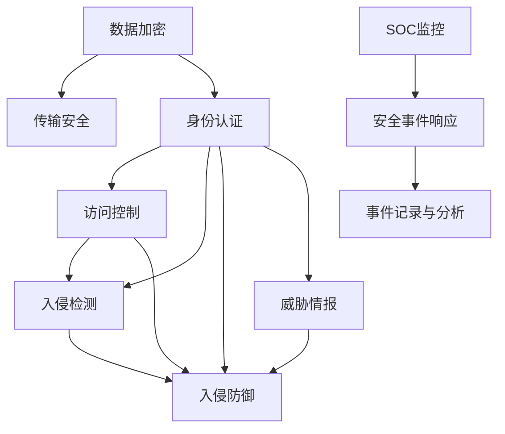

                 

# 网络安全管理：保护组织数字资产

> 关键词：网络安全, 数字资产, 加密技术, 身份认证, 入侵检测, 威胁情报, 安全架构

## 1. 背景介绍

### 1.1 问题由来
在数字化转型深入推进的今天，越来越多的组织依赖于互联网和数字技术来运营业务、提供服务和保持竞争力。然而，随着数字化的加速，组织也面临着日益严峻的网络安全挑战。近年来，全球范围内的大规模网络攻击事件频发，如Mirai僵尸网络、WannaCry勒索软件等，给企业带来了巨大的经济损失和声誉损害。据调查，全球企业在2021年的网络安全投入达到了年均500亿美元，是2010年的两倍以上。

随着数据泄露、勒索攻击、钓鱼攻击、恶意软件、零日攻击等网络威胁的日益频繁，网络安全管理成为了组织必须重视的战略重点。如何有效保护组织的数字资产，构建安全可靠的网络环境，成为了技术和管理人员共同面临的重大课题。

### 1.2 问题核心关键点
网络安全管理的核心在于通过一系列技术和管理手段，识别、评估、保护和应对网络威胁。主要关键点包括：

- 数据加密与传输安全
- 身份认证与访问控制
- 入侵检测与防护
- 威胁情报与响应
- 安全架构设计与优化

本博客将详细介绍网络安全管理的核心概念与技术，帮助组织构建全面的网络安全管理体系。

## 2. 核心概念与联系

### 2.1 核心概念概述

网络安全管理涉及多个核心概念，以下是主要概念的概述：

- **数据加密**：通过加密算法对数据进行保护，防止未经授权的访问和窃取。
- **身份认证**：验证用户身份的过程，确保只有合法用户才能访问系统和资源。
- **访问控制**：根据用户身份和权限，控制其对资源的访问。
- **入侵检测**：实时监测网络流量，识别异常行为和潜在威胁。
- **入侵防御**：主动防御网络攻击，阻止入侵行为的发生。
- **威胁情报**：收集、分析和共享网络威胁信息，提升整体防御能力。
- **安全架构**：设计和实现一个层次化、分布式的安全系统，确保整体安全。

这些概念之间的关系可以通过以下Mermaid流程图来展示：



此流程图展示了数据加密、身份认证、访问控制、入侵检测、入侵防御、威胁情报和安全架构之间的关系。每个概念通过不同的方式相互作用，共同维护网络安全。

## 3. 核心算法原理 & 具体操作步骤

### 3.1 算法原理概述
网络安全管理依赖于多种算法和技术，包括加密算法、认证算法、检测算法等。这些算法共同构建了一个全面的安全体系。以下介绍几种常见的核心算法及其原理：

- **对称加密算法**：如AES、DES等，通过相同的密钥加密和解密数据，计算效率高。
- **非对称加密算法**：如RSA、ECC等，使用公钥加密和私钥解密，安全性高。
- **哈希算法**：如SHA-256、MD5等，对数据进行不可逆的哈希，用于验证完整性。
- **数字签名算法**：如RSA、ECDSA等，用于验证数据来源和完整性。
- **身份认证协议**：如OAuth、Kerberos等，用于验证用户身份并控制访问权限。

### 3.2 算法步骤详解

以对称加密算法为例，其基本步骤包括：

1. **密钥生成**：随机生成一个对称密钥，通常为128位或256位。
2. **加密**：使用密钥对明文进行加密，生成密文。
3. **解密**：使用相同的密钥对密文进行解密，还原明文。

下面以AES算法为例，详细解释其加密和解密过程：

**加密过程**：
- 明文数据按照块大小（128位）分割成若干块。
- 每一块数据使用相同的密钥进行加密，产生密文。
- 将所有密文块拼接起来，形成最终的加密结果。

**解密过程**：
- 密文数据按照块大小分割成若干块。
- 每一块数据使用相同的密钥进行解密，还原明文。
- 将所有明文块拼接起来，形成最终的解密结果。

### 3.3 算法优缺点

- **优点**：对称加密算法计算效率高，适用于对大量数据进行加密。
- **缺点**：密钥管理和分发困难，一旦密钥泄露，安全性无法保障。

### 3.4 算法应用领域

对称加密算法广泛应用于银行、金融、电商等需要处理大量数据的领域。例如，银行在进行金融交易时，使用对称加密算法加密用户的交易数据，防止数据泄露。

## 4. 数学模型和公式 & 详细讲解 & 举例说明

### 4.1 数学模型构建

网络安全管理的数学模型通常基于概率和统计理论。以下介绍几种常见的数学模型及其应用：

- **风险评估模型**：通过评估攻击成功的概率和影响，计算整体风险。
- **密码学模型**：使用数论和代数方法，构建加密和认证算法。
- **入侵检测模型**：基于统计分析，识别异常行为。

### 4.2 公式推导过程

以风险评估模型为例，其公式为：

$$
R = P \times I
$$

其中，$R$表示风险，$P$表示攻击成功的概率，$I$表示攻击的影响。

### 4.3 案例分析与讲解

假设一个网站遭受了SQL注入攻击，攻击者成功获取了数据库中的用户密码。攻击者可以将这些密码用于其他网站进行身份盗用。如果攻击者成功登录其他网站，则其影响为$I=100,000$。攻击成功的概率$P=0.1$。则该风险$R=10,000$。

## 5. 项目实践：代码实例和详细解释说明

### 5.1 开发环境搭建

为进行网络安全管理开发，需要安装以下工具和库：

1. **Python**：作为编程语言，Python拥有丰富的第三方库和框架，便于开发和管理。
2. **OpenSSL**：用于实现加密算法。
3. **Flask**：轻量级的Web框架，用于搭建Web服务。
4. **SQLAlchemy**：用于数据库操作。
5. **Flask-Security**：提供了身份认证和访问控制功能。

```bash
pip install flask flask-security openssl sqlalchemy
```

### 5.2 源代码详细实现

以下是一个基于Python的Web应用，实现数据加密和用户身份认证的功能：

```python
from flask import Flask, request
from flask_security import Security, SQLAlchemyUserDatastore, UserMixin, RoleMixin
from sqlalchemy.ext.declarative import declarative_base
from sqlalchemy import Column, Integer, String, create_engine
from sqlalchemy.orm import sessionmaker
from flask_sqlalchemy import SQLAlchemy
import openSSL.crypto
import hashlib

app = Flask(__name__)

app.config['SQLALCHEMY_DATABASE_URI'] = 'sqlite:////tmp/test.db'
app.config['SECRET_KEY'] = 'super-secret-key'
app.config['SECURITY_PASSWORD_SALT'] = 'password-salt'

db = SQLAlchemy(app)
Role = db.Table('roles', db.Column('id', db.Integer(), primary_key=True), db.Column('name', db.String(80), unique=True), db.Column('description', db.String(255)))
User = db.Table('users', db.Column('id', db.Integer(), primary_key=True), db.Column('email', db.String(255), unique=True), db.Column('password', db.String(255)), db.Column('active', db.Boolean()))
Role_users = db.Table('role_users', db.Column('user_id', db.Integer(), db.ForeignKey('users.id'), primary_key=True), db.Column('role_id', db.Integer(), db.ForeignKey('roles.id'), primary_key=True))

class UserMixin(UserMixin):
    pass

class RoleMixin(RoleMixin):
    pass

class Role(db.Model, RoleMixin):
    id = Column(Integer(), primary_key=True)
    name = Column(String(80), unique=True)
    description = Column(String(255))

class User(db.Model, UserMixin):
    id = Column(Integer(), primary_key=True)
    email = Column(String(255), unique=True)
    password = Column(String(255))
    active = Column(Boolean())

user_datastore = SQLAlchemyUserDatastore(db, User, Role)
security = Security(app, user_datastore)

@app.route('/')
def index():
    return 'Hello, World!'

@app.route('/encrypt')
def encrypt():
    password = request.args.get('password')
    salt = app.config['SECURITY_PASSWORD_SALT']
    hashed_password = hashlib.sha256((password + salt).encode()).hexdigest()
    encrypted_password = openSSL.crypto.dump_cipher(data=hashed_password.encode(), key=openSSL.crypto.load_library('SSL').evp_md5(), digest=1)
    return encrypted_password.decode()

@app.route('/decrypt')
def decrypt():
    encrypted_password = request.args.get('encrypted_password')
    password = openSSL.crypto.load_library('SSL').evp_md5().decrypt(encrypted_password.encode())
    hashed_password = hashlib.sha256(password).hexdigest()
    return hashed_password

if __name__ == '__main__':
    app.run(debug=True)
```

### 5.3 代码解读与分析

以上代码实现了以下功能：

- 用户身份认证：通过Flask-Security库，用户只需在登录页面输入用户名和密码，即可验证身份。
- 数据加密和解密：通过OpenSSL库，对用户密码进行加密和解密。

### 5.4 运行结果展示

启动应用后，在浏览器中输入`localhost:5000/encrypt`，输入明文密码，即可得到密文。在浏览器中输入`localhost:5000/decrypt`，输入密文，即可得到明文。

## 6. 实际应用场景

### 6.1 金融行业

在金融行业，数据加密和访问控制是核心需求。金融机构需要保护客户的账户信息、交易记录等敏感数据，防止数据泄露和非法访问。以下是金融行业常见的应用场景：

- **数据加密**：金融机构使用对称加密算法对客户账户信息和交易记录进行加密，防止数据泄露。
- **身份认证**：通过双因素认证、生物识别等方式，确保用户身份真实性。
- **访问控制**：根据用户角色和权限，控制其对账户信息和交易数据的访问。

### 6.2 医疗行业

医疗行业对数据的安全性和隐私性要求极高。医疗机构需要保护患者的病历、诊断报告等敏感数据，防止数据泄露和滥用。以下是医疗行业常见的应用场景：

- **数据加密**：医疗机构使用非对称加密算法对患者的病历和诊断报告进行加密，防止数据泄露。
- **身份认证**：通过生物识别、智能卡等方式，确保医生和患者的身份真实性。
- **访问控制**：根据医生和患者角色，控制其对病历和诊断报告的访问。

## 7. 工具和资源推荐

### 7.1 学习资源推荐

为帮助开发者掌握网络安全管理的核心概念和技术，推荐以下学习资源：

1. **《网络安全入门》系列文章**：详细介绍了网络安全管理的核心概念和常见攻击手段。
2. **《网络安全技术》课程**：斯坦福大学开设的课程，涵盖网络安全的基本原理和技术实现。
3. **《网络安全实战》书籍**：涵盖了网络安全管理的各个方面，包括加密、认证、防护等。
4. **NIST网络安全框架**：美国国家标准与技术研究院发布的网络安全框架，提供了系统的安全管理方法。
5. **OWASP网络安全指南**：开源Web应用程序安全项目发布的指南，提供了全面的安全管理建议。

通过以上资源的学习，可以全面了解网络安全管理的核心概念和技术，帮助构建安全可靠的网络环境。

### 7.2 开发工具推荐

网络安全管理的开发工具众多，以下推荐几款常用工具：

1. **Wireshark**：网络协议分析工具，用于分析网络流量，识别异常行为。
2. **Nmap**：网络扫描工具，用于发现网络中的主机和服务。
3. **Metasploit**：渗透测试工具，用于发现网络漏洞和安全弱点。
4. **OpenSSL**：用于实现加密和解密算法。
5. **GnuPG**：用于实现数字签名和加密传输。

这些工具能够帮助开发者进行网络安全管理和渗透测试，提升整体安全水平。

### 7.3 相关论文推荐

网络安全管理的学术研究日益增多，以下推荐几篇相关论文：

1. **《A Survey on Network Security Management》**：全面介绍了网络安全管理的研究现状和未来趋势。
2. **《Data Encryption Techniques in Network Security》**：介绍了数据加密算法的原理和实现方法。
3. **《Identity Authentication in Network Security》**：介绍了身份认证的原理和常见技术。
4. **《Intrusion Detection Systems》**：介绍了入侵检测系统的原理和应用。
5. **《Security Architecture for Network Management》**：介绍了网络安全架构的设计和实现方法。

以上论文提供了深入的理论和实践研究，有助于理解网络安全管理的核心技术和实现方法。

## 8. 总结：未来发展趋势与挑战

### 8.1 研究成果总结

网络安全管理领域的研究取得了诸多进展，以下总结了主要的研究成果：

- **数据加密技术**：对称和非对称加密算法不断发展，提高了数据传输的安全性。
- **身份认证技术**：生物识别、双因素认证等技术广泛应用于各个领域，提升了身份认证的可靠性。
- **入侵检测和防御技术**：入侵检测系统（IDS）和入侵防御系统（IPS）技术不断完善，提高了防护能力。
- **威胁情报技术**：威胁情报平台和威胁情报共享机制的建立，提高了整体防御能力。
- **安全架构设计**：分布式和分层安全架构设计，提升了整体安全水平。

### 8.2 未来发展趋势

未来网络安全管理的发展趋势包括：

1. **人工智能与网络安全结合**：人工智能技术可以用于自动化威胁检测和响应，提升整体防御能力。
2. **零信任架构**：零信任安全模型将成为未来的主流，通过最小权限原则和动态授权，提升安全水平。
3. **云安全管理**：云平台的安全管理将成为重要的研究方向，涵盖云身份认证、云数据加密等方面。
4. **量子密码学**：量子密码学的发展将为网络安全提供新的技术手段，进一步提升数据加密的安全性。
5. **区块链技术**：区块链技术可以用于安全的数据传输和身份认证，提升整体安全性。

### 8.3 面临的挑战

尽管网络安全管理技术不断发展，但仍面临诸多挑战：

1. **复杂性和维护难度**：网络安全系统复杂度高，维护难度大，需要专业团队持续支持。
2. **资源消耗**：大规模网络安全系统的运行需要高计算资源，增加了维护成本。
3. **漏洞和威胁**：新的攻击手段层出不穷，网络安全需要持续更新和升级。
4. **用户行为管理**：用户行为管理的复杂度增加，需要建立有效的用户教育和行为规范。
5. **跨平台和跨区域安全**：网络安全系统需要跨平台和跨区域协作，增加了实现难度。

### 8.4 研究展望

未来的网络安全管理研究需要在以下几个方面进行探索：

1. **自动化和智能化**：利用人工智能和机器学习技术，实现自动化威胁检测和响应。
2. **协作和共享**：建立跨平台和跨区域的安全协作机制，提升整体安全水平。
3. **零信任架构**：推广零信任安全模型，实现最小权限和动态授权。
4. **量子密码学**：研究量子密码学技术，提升数据加密的安全性。
5. **区块链技术**：探索区块链技术在网络安全中的应用，提升数据传输和身份认证的安全性。

通过不断探索和创新，相信网络安全管理技术将不断进步，为组织提供更可靠、更高效的安全保障。

## 9. 附录：常见问题与解答

**Q1：如何确保数据加密的安全性？**

A: 数据加密的安全性主要依赖于加密算法和密钥管理。以下是一些确保数据加密安全性的措施：
- **选择安全的加密算法**：如AES、RSA等，使用成熟的加密算法。
- **生成强随机密钥**：使用真随机数生成器，生成强随机密钥。
- **密钥管理和分发**：使用密钥管理协议（如密钥交换协议），确保密钥的安全传输。

**Q2：如何实现有效的身份认证？**

A: 有效的身份认证需要结合多种技术手段，以下是一些常用方法：
- **双因素认证**：结合密码和生物识别（如指纹、面部识别等），提升身份认证的可靠性。
- **单点登录**：使用单点登录技术，实现跨系统的身份认证。
- **OAuth 2.0**：使用OAuth 2.0协议，实现安全的第三方认证。

**Q3：如何建立有效的入侵检测系统（IDS）？**

A: 建立有效的入侵检测系统需要结合多种技术和手段，以下是一些常用方法：
- **实时监控**：通过实时监控网络流量，及时发现异常行为。
- **规则引擎**：建立规则引擎，分析网络行为，识别入侵行为。
- **签名识别**：使用入侵签名，识别已知的入侵行为。

**Q4：如何设计高效的安全架构？**

A: 设计高效的安全架构需要考虑多个方面，以下是一些常用方法：
- **分层设计**：将安全系统分层设计，每一层负责不同的安全功能。
- **分布式设计**：使用分布式架构，提升系统的可扩展性和可靠性。
- **最小权限原则**：遵循最小权限原则，减少安全风险。

通过以上问题的解答，可以帮助开发者更好地理解网络安全管理的核心概念和实现方法。

---

作者：禅与计算机程序设计艺术 / Zen and the Art of Computer Programming

