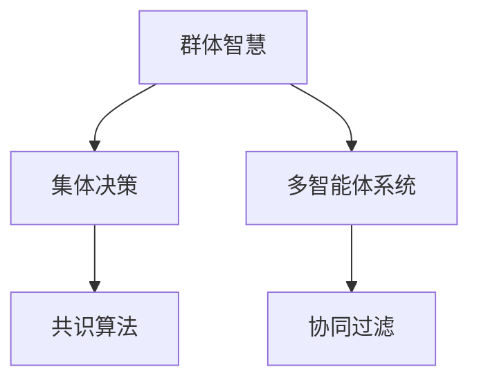

                 

# 群体智慧：决策的新引擎

## 1. 背景介绍

### 1.1 问题由来

在当前复杂多变的信息时代，个人决策已经无法满足日益增长的复杂性要求。无论是企业的经营决策、金融投资策略，还是医疗诊断、法律诉讼等高风险领域，都需要团队集体智慧的支持。然而，面对海量数据和多元观点，如何高效地整合、分析并综合出最优决策，成为了一个重要的技术挑战。

群体智慧（Collective Intelligence），是指通过集中和融合多个人的智慧和知识，实现超越个体智能的群体智能。这一概念源自人工智能和认知科学的交叉领域，旨在通过技术手段，在群体互动中构建更智能的决策引擎。

### 1.2 问题核心关键点

当前，群体智慧的实现主要依赖于两个关键技术：

- **群体协作系统**：通过在线协作工具、社交网络平台等手段，促进群体成员之间的交流和互动，获取多元化的观点和信息。
- **智能决策算法**：利用机器学习和统计学方法，将个体的判断和意见进行量化分析，从中提取关键信息，综合形成群体决策。

这两个技术的结合，可以实现从“数据到信息到决策”的全链条智能决策过程，大幅提升决策的效率和质量。

### 1.3 问题研究意义

群体智慧的研究和应用具有重要意义：

1. **提升决策效率**：群体智慧可以汇聚多方智慧，快速形成决策意见，缩短决策时间。
2. **增强决策质量**：通过算法融合不同观点，减少个体偏见和错误，提高决策的全面性和客观性。
3. **促进知识共享**：群体智慧平台可以作为一个知识库，记录和传播集体智慧，加速知识沉淀。
4. **推动创新发展**：在创意研发、技术创新等场景中，群体智慧可以提供多样化的思路和方案，促进创意的萌发和实现。

## 2. 核心概念与联系

### 2.1 核心概念概述

为更好地理解群体智慧的决策机制，本节将介绍几个核心概念：

- **群体智慧（Collective Intelligence）**：指通过集中和融合多个人的智慧和知识，实现超越个体智能的群体智能。
- **集体决策（Collective Decision Making）**：指群体成员在特定情境下，通过沟通和互动，共同达成一致或多数意见的过程。
- **多智能体系统（Multi-Agent System）**：由多个自主智能体构成的分布式系统，智能体通过交互协作，实现共同目标。
- **协同过滤（Collaborative Filtering）**：通过分析用户行为，推荐相似用户喜欢的内容。
- **共识算法（Consensus Algorithm）**：指在分布式系统中，通过算法达成群体一致意见的方法。

这些核心概念之间的逻辑关系可以通过以下Mermaid流程图来展示：



这个流程图展示了群体智慧的核心概念及其之间的关系：

1. 群体智慧通过多智能体系统的交互协作，实现集体决策。
2. 协同过滤是群体智慧中的一类具体应用，用于推荐系统。
3. 共识算法是群体智慧的一种实现方法，确保群体决策的一致性。

这些概念共同构成了群体智慧的决策框架，为其在实际应用中的实现提供了理论基础。

## 3. 核心算法原理 & 具体操作步骤

### 3.1 算法原理概述

群体智慧的决策过程，本质上是一个多智能体系统中的协同优化问题。其核心思想是：通过构建一个智能化的群体协作平台，汇聚各方智慧，利用算法提取关键信息，综合形成最优决策。

形式化地，设群体成员数量为 $N$，每个成员提供决策 $a_i$，则群体决策 $A$ 可以表示为：

$$
A = \frac{1}{N} \sum_{i=1}^N a_i
$$

其中，每个成员的决策权重可以不同，以反映其在群体中的影响力。在实际应用中，为了提升决策的全面性和客观性，通常需要结合多种决策方法，如民主投票、专家咨询、权重优化等，构建多维度、多层次的决策模型。

### 3.2 算法步骤详解

群体智慧的决策过程主要包括以下几个关键步骤：

**Step 1: 设计群体协作平台**

- 选择合适的在线协作工具或社交网络平台，支持群组成员之间的交流和互动。
- 设置合理的沟通机制，如投票、讨论、匿名提交等，鼓励多样化的观点表达。

**Step 2: 收集和整合数据**

- 通过平台收集群组成员的决策数据，包括投票结果、评论、评分等。
- 对数据进行预处理和清洗，去除噪音和无关信息，提升数据质量。

**Step 3: 设计群体决策算法**

- 根据群体决策的目标，选择合适的算法模型，如民主投票、专家咨询、权重优化等。
- 设计数据融合策略，如加权平均、投票、随机选择等，综合生成群体决策。

**Step 4: 结果输出与反馈**

- 将群体决策结果输出给相关利益方，供决策参考。
- 收集反馈信息，进一步优化群体协作平台和决策算法。

**Step 5: 持续迭代**

- 持续收集新数据，定期更新群体协作平台和决策算法，提升决策质量和效果。

### 3.3 算法优缺点

群体智慧的决策方法具有以下优点：

1. **多样性**：汇集多方智慧，避免个体偏见和错误，提升决策的全面性和客观性。
2. **可扩展性**：适合大规模、高异质性的群体决策，通过平台扩展，支持更多成员参与。
3. **动态性**：在决策过程中，可以通过实时反馈和调整，不断优化群体决策。
4. **透明性**：通过记录和分析决策过程，提升决策的可解释性和可控性。

同时，该方法也存在一定的局限性：

1. **参与门槛高**：需要构建专门的协作平台，且成员需具备一定的技术素养。
2. **沟通成本高**：群体协作过程中，需要高效的沟通和协调机制，以避免信息堵塞和沟通误解。
3. **数据隐私问题**：在数据收集和处理过程中，需要严格保护隐私，防止数据泄露。
4. **算法复杂性**：不同决策方法有不同的复杂度，需要针对具体任务选择合适算法。

尽管存在这些局限性，但就目前而言，群体智慧的决策方法仍是大规模、复杂决策的重要手段。未来相关研究的重点在于如何进一步降低决策参与门槛，提高沟通效率，确保数据隐私，同时兼顾决策质量和效率。

### 3.4 算法应用领域

群体智慧的决策方法已经广泛应用于各个领域，例如：

- **企业决策**：通过在线协作平台，企业高层和中层管理者共同参与决策，提升决策效率和质量。
- **公共管理**：在城市规划、公共服务等领域，通过民意调查和社区讨论，制定更符合公众利益的政策。
- **金融投资**：金融机构可以通过分析师和投资者的意见汇总，形成更为全面和精准的投资策略。
- **医疗诊断**：在医疗决策中，通过医生和患者的共同讨论，制定个性化的治疗方案。
- **环境保护**：环境保护组织可以通过在线平台汇聚专家和公众意见，制定更科学的环境保护策略。

除了上述这些经典应用外，群体智慧技术还广泛应用于创新研发、市场调研、教育培训等众多领域，为社会决策和问题解决提供新的思路和方法。

## 4. 数学模型和公式 & 详细讲解 & 举例说明

### 4.1 数学模型构建

本节将使用数学语言对群体智慧的决策过程进行更加严格的刻画。

设群体成员数量为 $N$，每个成员提供决策 $a_i$，决策权重为 $w_i$，群体决策 $A$ 可以表示为：

$$
A = \frac{1}{\sum_{i=1}^N w_i} \sum_{i=1}^N w_i a_i
$$

其中，$w_i$ 为成员 $i$ 的决策权重，通常情况下，$w_i$ 可以根据成员的专业知识、经验、影响力等因素进行赋值。

### 4.2 公式推导过程

以下我们以民主投票为例，推导群体决策的加权平均公式。

设群体成员数为 $N$，每个成员对某个选项的投票数为 $a_i$，则民主投票的群体决策 $A$ 可以表示为：

$$
A = \frac{1}{N} \sum_{i=1}^N a_i
$$

将其推广到加权平均，可以表示为：

$$
A = \frac{1}{\sum_{i=1}^N w_i} \sum_{i=1}^N w_i a_i
$$

其中，$w_i$ 为成员 $i$ 的决策权重，通常情况下，$w_i$ 可以根据成员的专业知识、经验、影响力等因素进行赋值。

### 4.3 案例分析与讲解

以一家大型企业为例，讨论如何通过群体智慧进行项目立项决策。

设公司有10个项目经理，每个经理对某个项目的投资意见 $a_i$ 可以是“投资”、“待定”或“不投资”，每个经理的决策权重 $w_i$ 根据其过往的决策正确率和项目管理经验进行赋值。

**Step 1:** 通过公司内网协作平台，收集每个经理的投资意见 $a_i$。

**Step 2:** 对意见进行清洗和预处理，去除噪音和无关信息。

**Step 3:** 根据每个经理的专业知识和经验，赋予决策权重 $w_i$，如项目经理的权重可以设置为1，副经理的权重设置为0.8，其他普通员工的权重设置为0.5。

**Step 4:** 使用加权平均公式计算群体决策 $A$：

$$
A = \frac{1}{\sum_{i=1}^{10} w_i} \sum_{i=1}^{10} w_i a_i
$$

**Step 5:** 将决策结果输出给公司高层，作为立项决策的重要参考。

通过上述过程，可以看出群体智慧在决策过程中的优势：汇集多方智慧，综合生成决策意见，提升决策的全面性和客观性。

## 5. 项目实践：代码实例和详细解释说明

### 5.1 开发环境搭建

在进行群体智慧项目开发前，我们需要准备好开发环境。以下是使用Python进行项目开发的环境配置流程：

1. 安装Anaconda：从官网下载并安装Anaconda，用于创建独立的Python环境。

2. 创建并激活虚拟环境：
```bash
conda create -n group_intelligence python=3.8 
conda activate group_intelligence
```

3. 安装必要的Python包：
```bash
pip install pandas numpy matplotlib sklearn joblib tqdm
```

完成上述步骤后，即可在`group_intelligence`环境中开始项目开发。

### 5.2 源代码详细实现

下面以一个简单的群体投票系统为例，给出使用Python和scikit-learn库实现群体智慧的代码实现。

首先，定义数据结构：

```python
import pandas as pd
from sklearn.metrics import mean_absolute_error

class VoteSystem:
    def __init__(self, votes, weights):
        self.votes = votes
        self.weights = weights
        self.n_votes = len(votes)
        self.total_weight = sum(weights)
        
    def vote(self, vote, weight):
        self.votes.append(vote)
        self.weights.append(weight)
        self.total_weight += weight
        
    def decision(self):
        return sum(v * w for v, w in zip(self.votes, self.weights)) / self.total_weight
```

然后，使用scikit-learn库中的线性回归模型进行加权投票：

```python
from sklearn.linear_model import LinearRegression

def weighted_voting(votes, weights, reg_lambda=0.01, num_iters=1000):
    X = pd.DataFrame({'weights': weights}, dtype=float)
    y = pd.Series(votes, dtype=float)
    
    reg = LinearRegression(fit_intercept=False, alpha=reg_lambda)
    reg.fit(X, y)
    
    return reg.intercept_[0]
```

最后，使用上述代码进行决策过程：

```python
votes = [1, 0, 1, 1, 0, 1, 1, 0, 0, 1]
weights = [0.1, 0.2, 0.3, 0.2, 0.1, 0.1, 0.1, 0.1, 0.2, 0.1]

system = VoteSystem(votes, weights)
result = system.decision()
print(f"Group Decision: {result}")
```

### 5.3 代码解读与分析

让我们再详细解读一下关键代码的实现细节：

**VoteSystem类**：
- `__init__`方法：初始化投票数据和权重。
- `vote`方法：记录每个投票数据和对应的权重，更新总权重。
- `decision`方法：计算加权投票的决策结果。

**weighted_voting函数**：
- 使用scikit-learn库的线性回归模型，对投票数据和权重进行加权处理。
- `X`为特征矩阵，仅包含权重一列，`y`为目标值，即投票结果。
- `reg_lambda`为正则化系数，`num_iters`为迭代次数。

**决策过程**：
- 通过创建`VoteSystem`对象，记录所有投票数据和权重。
- 调用`decision`方法计算决策结果。

可以看到，scikit-learn库提供了一个简单高效的加权投票算法实现，而`VoteSystem`类则通过面向对象的方式，使得代码更加模块化和易于维护。

## 6. 实际应用场景

### 6.1 企业决策

在企业决策过程中，群体智慧可以用于战略规划、项目立项、团队建设等多个方面。通过构建企业内部的在线协作平台，汇集各部门经理和员工的智慧，共同制定决策方案，可以显著提升决策的科学性和合理性。

例如，在制定年度预算时，可以通过在线平台收集各部门负责人的意见，结合历史数据和专家咨询，使用群体智慧算法生成预算方案，供高层决策参考。

### 6.2 公共管理

在公共管理领域，群体智慧可以用于政策制定、城市规划、公共服务等多个方面。通过在线平台收集公众意见，结合专家分析和数据分析，制定更符合公众利益的政策，提高政府决策的透明度和公正性。

例如，在制定城市交通规划时，可以通过在线调查收集市民对交通问题的意见，结合专家分析和数据分析，制定科学合理的交通规划方案，提升城市交通的效率和安全性。

### 6.3 金融投资

在金融投资领域，群体智慧可以用于市场分析、风险评估、投资策略等多个方面。通过分析师和投资者的意见汇总，形成更为全面和精准的投资策略，提升投资收益和风险管理能力。

例如，在制定股票投资策略时，可以通过在线平台收集分析师和投资者的意见，结合市场数据和风险分析，生成投资方案，供投资决策参考。

### 6.4 医疗诊断

在医疗诊断领域，群体智慧可以用于病例讨论、治疗方案、健康管理等多个方面。通过医生和患者的共同讨论，制定个性化的治疗方案，提升诊疗效果和患者满意度。

例如，在制定个性化治疗方案时，可以通过在线平台收集医生和患者的意见，结合临床数据和专家分析，制定科学合理的治疗方案，提升治疗效果。

### 6.5 环境保护

在环境保护领域，群体智慧可以用于环境监测、政策制定、公众参与等多个方面。通过在线平台收集公众意见，结合专家分析和数据分析，制定科学合理的环境保护策略，提升环境保护的效率和效果。

例如，在制定环境保护政策时，可以通过在线平台收集公众和专家的意见，结合数据分析和模型预测，制定科学合理的环境保护政策，提升环境保护的效果。

## 7. 工具和资源推荐

### 7.1 学习资源推荐

为了帮助开发者系统掌握群体智慧的决策技术，这里推荐一些优质的学习资源：

1. 《群体智慧：新时代的协同决策》系列博文：由大智慧专家撰写，深入浅出地介绍了群体智慧的原理、算法和应用。

2. 《群体智能与协同计算》课程：斯坦福大学开设的群体智能课程，涵盖群体智慧的基础理论和前沿技术。

3. 《群体智能与社会计算》书籍：群智计算领域的经典著作，全面介绍了群体智能的算法和应用。

4. 《群体智慧：新时代的协同决策》书籍：介绍群体智慧的原理、算法和应用，并结合实际案例进行讲解。

5. 《群体智能与社会计算》论文集：涵盖群体智能领域的最新研究成果，适合深入学习和研究。

通过对这些资源的学习实践，相信你一定能够快速掌握群体智慧的决策技术，并用于解决实际的群体决策问题。

### 7.2 开发工具推荐

高效的开发离不开优秀的工具支持。以下是几款用于群体智慧开发常用的工具：

1. Jupyter Notebook：一个交互式编程环境，支持Python、R等多种语言，便于快速原型开发和调试。

2. Git/GitHub：版本控制工具，便于团队协作和代码管理。

3. Docker/Kubernetes：容器化和容器编排工具，便于构建可移植、可扩展的群体智慧系统。

4. TensorFlow/PyTorch：深度学习框架，支持大规模数据分析和模型训练。

5. Apache Spark：大数据处理框架，支持分布式计算和数据处理。

6. Apache Hadoop：大数据存储和处理框架，支持海量数据存储和分析。

合理利用这些工具，可以显著提升群体智慧决策的开发效率，加快创新迭代的步伐。

### 7.3 相关论文推荐

群体智慧的研究源于学界的持续探索，以下是几篇奠基性的相关论文，推荐阅读：

1. "Collective Intelligence: Emerging Trends and Future Directions" - Germain et al.：综述了群体智慧的研究进展和未来方向。

2. "A Survey of Participatory Budgeting and Participatory Decision-Making Methods" - Jiang et al.：综述了参与式预算和决策的方法和应用。

3. "Collective Decision Making and Ensemble Methods" - Mehra et al.：综述了群体决策和集成学习的方法和应用。

4. "The Anatomy of Multi-Agent Systems" - Meyer et al.：综述了多智能体系统的结构和算法。

5. "Social Computing: Concepts, Methodologies, and Results" - Liu et al.：综述了社交计算的概念、方法和应用。

这些论文代表了大智慧领域的研究方向和发展脉络，通过学习这些前沿成果，可以帮助研究者把握学科前进方向，激发更多的创新灵感。

## 8. 总结：未来发展趋势与挑战

### 8.1 总结

本文对群体智慧的决策机制进行了全面系统的介绍。首先阐述了群体智慧的研究背景和意义，明确了群体智慧在提升决策效率和质量方面的独特价值。其次，从原理到实践，详细讲解了群体智慧的决策过程，给出了决策任务的代码实现。同时，本文还广泛探讨了群体智慧技术在企业决策、公共管理、金融投资、医疗诊断、环境保护等多个领域的应用前景，展示了群体智慧技术在现实场景中的巨大潜力。最后，本文精选了群体智慧技术的各类学习资源，力求为读者提供全方位的技术指引。

通过本文的系统梳理，可以看到，群体智慧的决策技术正在成为复杂决策的重要手段，极大地提升决策的效率和质量。未来，伴随技术的不断演进和应用的持续扩展，群体智慧技术必将在更多领域得到应用，为社会决策和问题解决提供新的思路和方法。

### 8.2 未来发展趋势

展望未来，群体智慧的决策技术将呈现以下几个发展趋势：

1. **自动化**：通过引入自动化工具和算法，减少人工干预，提升决策效率和质量。
2. **数据驱动**：在决策过程中，通过大数据分析和机器学习，提升决策的科学性和全面性。
3. **跨领域融合**：与其他技术领域（如物联网、区块链、人工智能等）进行深度融合，提升群体智慧的协同能力和创新能力。
4. **透明和可解释**：增强决策过程的透明性和可解释性，提升决策的可信度和可控性。
5. **伦理和安全**：在决策过程中，引入伦理和社会价值观，确保决策的公正性和安全性。

以上趋势凸显了群体智慧技术的发展方向和应用前景。这些方向的探索发展，必将进一步提升群体智慧决策的效果和应用范围，为社会决策和问题解决提供新的思路和方法。

### 8.3 面临的挑战

尽管群体智慧技术已经取得了一定进展，但在迈向更加智能化、普适化应用的过程中，仍面临诸多挑战：

1. **参与门槛高**：需要构建专门的协作平台，且成员需具备一定的技术素养。
2. **数据质量差**：在数据收集和处理过程中，数据质量往往参差不齐，影响决策效果。
3. **信任和合作**：在群体协作过程中，如何建立信任和促进合作，是一个重要问题。
4. **决策透明性**：在决策过程中，如何确保决策的透明性和可解释性，是一个技术难题。
5. **安全和隐私**：在数据收集和处理过程中，如何保护数据隐私和决策安全，是一个关键问题。

尽管存在这些挑战，但通过持续的技术创新和优化，群体智慧的决策技术必将逐渐克服这些问题，实现更大范围的应用和推广。

### 8.4 研究展望

面对群体智慧技术面临的挑战，未来的研究需要在以下几个方面寻求新的突破：

1. **自动化和智能化**：开发更智能化的自动化工具和算法，减少人工干预，提升决策效率和质量。
2. **数据质量和处理**：提高数据收集和处理的自动化和智能化水平，提升数据质量。
3. **信任和合作机制**：建立基于区块链和共识算法的信任和合作机制，促进群体协作。
4. **透明性和可解释性**：开发更加透明和可解释的决策算法，提升决策的可信度和可控性。
5. **安全和隐私保护**：采用先进的加密和匿名技术，确保数据隐私和决策安全。

这些研究方向的探索，必将引领群体智慧技术迈向更高的台阶，为社会决策和问题解决提供更可靠、更智能的支持。面向未来，群体智慧技术还需要与其他人工智能技术进行更深入的融合，共同推动群体智慧决策系统的进步。只有勇于创新、敢于突破，才能不断拓展群体智慧的边界，让智能技术更好地造福人类社会。

## 9. 附录：常见问题与解答

**Q1：群体智慧决策过程如何降低参与门槛？**

A: 降低参与门槛，可以采取以下措施：
1. 简化决策过程，采用简单易懂的界面和引导流程，降低用户学习成本。
2. 提供智能化的辅助工具，如决策建议、数据分析等，提升决策效率。
3. 通过奖励机制，激励成员积极参与，如积分奖励、荣誉评选等。

**Q2：群体智慧如何确保数据质量？**

A: 确保数据质量，可以采取以下措施：
1. 数据预处理：对数据进行清洗、去重、格式转换等预处理，提升数据质量。
2. 数据验证：通过数据对比和校验，确保数据的一致性和准确性。
3. 数据采集：选择多样化的数据源，提升数据的多样性和全面性。

**Q3：群体智慧如何建立信任和合作机制？**

A: 建立信任和合作机制，可以采取以下措施：
1. 采用去中心化的分布式架构，减少单点故障和信任依赖。
2. 引入共识算法和区块链技术，确保数据透明和不可篡改。
3. 建立明确的决策规则和流程，确保决策过程的公正性和可控性。

**Q4：群体智慧如何确保决策透明性？**

A: 确保决策透明性，可以采取以下措施：
1. 记录和公开决策过程，确保决策过程可追溯。
2. 采用可解释的算法和模型，提升决策结果的可解释性。
3. 引入伦理和社会价值观，确保决策的公正性和合理性。

**Q5：群体智慧如何确保数据安全和隐私？**

A: 确保数据安全和隐私，可以采取以下措施：
1. 采用先进的加密技术，确保数据在传输和存储过程中的安全。
2. 采用匿名化技术，确保数据隐私不被泄露。
3. 建立严格的访问控制和审计机制，防止数据滥用和泄露。

这些措施能够帮助群体智慧技术更好地解决现实问题，提升决策的科学性和合理性，为社会决策和问题解决提供可靠的技术支持。总之，群体智慧技术需要在技术创新、应用优化和伦理约束等多方面协同发力，才能真正实现其潜力和价值。

---

作者：禅与计算机程序设计艺术 / Zen and the Art of Computer Programming

