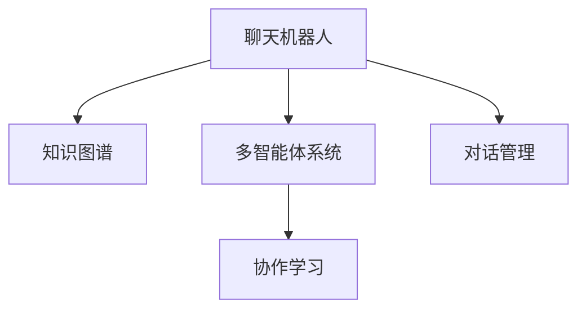

                 

# 聊天机器人团队合作：增强沟通和协作

> 关键词：聊天机器人,团队合作,沟通,协作,自然语言处理(NLP),深度学习,机器学习

## 1. 背景介绍

### 1.1 问题由来
在当前快速变化和高度复杂化的商业环境中，企业和组织需要迅速、准确地与客户进行沟通。聊天机器人(Robotics)作为数字化转型的关键工具，被广泛用于客户服务、市场营销、金融咨询、医疗咨询等多个领域。然而，聊天机器人面临的最大挑战之一是难以处理各种复杂的客户需求，特别是在面对多用户并发交互、多话题切换等高难度场景时，传统聊天机器人的单一性和局限性显得尤为突出。

为克服这些难题，很多企业尝试采用团队合作的方案，即构建一个多智能体团队，通过团队合作，达到更好的交互效果和用户体验。团队合作的聊天机器人不仅能够覆盖更多对话主题，还能通过联合推理、知识共享等方式，提高智能体的处理能力和应对复杂任务的能力。这种“人工+智能”的协作方式，在提升机器人性能的同时，也带来了更多的挑战和问题。

### 1.2 问题核心关键点
在构建团队合作的聊天机器人时，以下几个关键问题亟需关注：

- **多智能体协调**：如何设计一个多智能体模型，使得每个智能体都能根据任务需求有效协调，共同完成任务。
- **知识共享机制**：如何在智能体之间高效共享和复用知识，避免冗余和冲突。
- **任务分配策略**：如何根据用户需求和智能体特点，合理分配任务，提高资源利用率。
- **信息同步与融合**：如何在多个智能体之间实现信息同步和融合，保证团队决策的一致性。
- **用户感知一致性**：如何确保团队合作的聊天机器人给用户提供一致、连贯的对话体验。

### 1.3 问题研究意义
团队合作的聊天机器人技术，能够突破单一智能体在处理复杂对话和任务时的局限性，提升智能体的综合能力，提高用户满意度和留存率。团队合作还能在处理大规模并发请求时，降低单个智能体的负担，增强系统的稳定性。同时，通过团队协作，聊天机器人可以不断学习和更新知识，逐步提升处理复杂对话的能力，适应更多现实场景。因此，研究团队合作的聊天机器人技术，对于提升人工智能系统的智能水平，推动人工智能技术在实际业务中的应用，具有重要意义。

## 2. 核心概念与联系

### 2.1 核心概念概述

为了更好地理解团队合作的聊天机器人，本节将介绍几个密切相关的核心概念：

- **聊天机器人(Robotics)**：基于自然语言处理(NLP)技术，能够理解和处理人类语言，提供即时信息查询、问题解答等服务的AI系统。聊天机器人主要分为两大类：基于规则的(Rule-based)和基于机器学习的(Machine learning-based)。
- **多智能体系统(Multi-agent System)**：由多个自主智能体构成，通过协作完成复杂任务的系统。多智能体系统在机器人、物流、交通、金融等多个领域有着广泛应用。
- **知识图谱(Knowledge Graph)**：由节点和边构成的语义网络，用于表示实体、属性和关系。知识图谱通过描述实体之间的关系，帮助机器人更好地理解自然语言，提高推理和决策能力。
- **协作学习(Collaborative Learning)**：通过多个智能体共同学习，分享知识和经验，提高整体系统的智能水平。协作学习是实现团队合作的聊天机器人的关键技术之一。
- **对话管理(Dialogue Management)**：在多轮对话中，聊天机器人需要根据上下文信息，合理选择回答，并进行任务分配和管理。对话管理是团队合作的聊天机器人顺利进行对话的关键环节。

这些核心概念之间的逻辑关系可以通过以下Mermaid流程图来展示：



这个流程图展示了大语言模型的核心概念及其之间的关系：

1. 聊天机器人通过知识图谱获得语言理解能力，并通过多智能体协作，优化对话管理。
2. 多智能体系统实现知识共享和任务分配，协作学习提升整体智能水平。
3. 对话管理根据上下文信息，选择最优回答，进行任务分配。

这些概念共同构成了团队合作的聊天机器人的基本框架，为其功能的实现和优化提供了理论依据。

## 3. 核心算法原理 & 具体操作步骤
### 3.1 算法原理概述

团队合作的聊天机器人技术主要基于多智能体系统理论，并结合自然语言处理、知识图谱和协作学习等技术，进行复杂对话和任务的处理。其核心思想是：通过多个智能体的协作，将复杂任务分解为更小、更易处理的部分，共同完成整个对话过程。

形式化地，设团队合作的聊天机器人由 $N$ 个智能体组成，每个智能体 $i$ 在对话过程中处理一部分子任务。设整个对话任务为 $T$，智能体 $i$ 的任务为 $t_i$，则有：

$$
T = \sum_{i=1}^N t_i
$$

聊天机器人系统通过多智能体协作，使得各个智能体能够根据任务特点，合理分配和处理子任务，共同完成对话。协作过程可以表示为：

$$
\max_{\{t_i\}_{i=1}^N} \sum_{i=1}^N \text{Utility}(t_i)
$$

其中 $\text{Utility}(t_i)$ 表示智能体 $i$ 处理任务 $t_i$ 的效用函数，用于衡量任务的完成质量。

### 3.2 算法步骤详解

团队合作的聊天机器人系统一般包括以下关键步骤：

**Step 1: 建立多智能体模型**
- 设计多个智能体的对话逻辑，定义各个智能体的任务和职责。
- 构建知识图谱，为智能体提供丰富的语义信息。
- 实现智能体之间的通信协议和信息交换机制。

**Step 2: 任务分解与分配**
- 将对话任务 $T$ 分解为多个子任务 $t_i$，分配给不同的智能体 $i$。
- 根据对话历史和用户需求，动态调整任务分配策略。

**Step 3: 协作学习与知识共享**
- 通过协作学习，智能体之间共享知识和经验，更新模型参数。
- 实现知识图谱的自动更新和推理，增强智能体的知识表示能力。

**Step 4: 信息同步与融合**
- 在对话过程中，实时同步各个智能体的状态和决策结果。
- 综合处理不同智能体的信息，形成一致的对话语境。

**Step 5: 对话管理和输出**
- 根据上下文信息，动态选择智能体进行回应。
- 输出最终的对话结果，确保一致性和连贯性。

### 3.3 算法优缺点

团队合作的聊天机器人技术具有以下优点：
1. 处理复杂任务。团队合作的聊天机器人可以处理多轮对话和复杂查询，涵盖多个主题。
2. 提高知识共享。通过协作学习，智能体之间共享知识和经验，避免冗余和冲突。
3. 优化任务分配。通过合理分配任务，智能体能够最大化利用资源，提升系统性能。
4. 提高鲁棒性。多智能体协作能够提升系统整体的稳定性和鲁棒性。

同时，该方法也存在一定的局限性：
1. 系统复杂度增加。多智能体协作增加了系统的设计和实现难度。
2. 通信开销大。智能体之间需要频繁进行信息同步和通信，可能带来性能瓶颈。
3. 一致性难以保障。多智能体协作需要在不同智能体之间进行同步和协调，确保对话一致性。
4. 技术要求高。团队合作的聊天机器人需要综合利用多领域的知识，对技术要求较高。

尽管存在这些局限性，但就目前而言，基于多智能体协作的聊天机器人技术仍是最前沿和最具有潜力的解决方案之一。未来相关研究的重点在于如何进一步降低协作开销，提高系统一致性，降低技术门槛，使得更多企业能够快速落地应用。

### 3.4 算法应用领域

团队合作的聊天机器人技术在多个领域有着广泛的应用，例如：

- 客户服务：通过多智能体协作，聊天机器人能够覆盖更多对话主题，提供更精准的解答。
- 医疗咨询：在医疗咨询场景中，多个智能体协作进行病情分析、治疗方案推荐等，提升咨询效果。
- 金融咨询：金融咨询场景中，多智能体协作进行风险评估、投资建议等，提高咨询准确性。
- 市场营销：在市场营销中，多智能体协作进行客户行为分析、个性化推荐等，提升客户体验。
- 社交媒体管理：在社交媒体管理中，多智能体协作进行舆情监控、内容推荐等，提升社区活跃度。

除了上述这些经典应用外，团队合作的聊天机器人还被创新性地应用到更多场景中，如智能客服、智能翻译、智能客服等，为人工智能技术的发展提供了新的思路和方向。

## 4. 数学模型和公式 & 详细讲解 & 举例说明
### 4.1 数学模型构建

为了更好地描述团队合作的聊天机器人系统，我们引入一些数学模型：

- **多智能体协作模型**：设 $N$ 个智能体协作完成对话任务 $T$，每个智能体 $i$ 处理子任务 $t_i$。系统目标为最大化智能体的协作效用：

$$
\max_{\{t_i\}_{i=1}^N} \sum_{i=1}^N \text{Utility}(t_i)
$$

- **知识图谱模型**：设知识图谱由节点 $V$ 和边 $E$ 构成，节点表示实体，边表示实体之间的关系。知识图谱的构建可以通过实体识别、关系抽取等NLP技术实现：

$$
\text{Graph}(V, E) = \{(v_i, e_j)\}_{i=1}^n
$$

- **协作学习模型**：设智能体 $i$ 的知识表示为 $\text{Knowledge}_i$，智能体之间的协作学习过程可以表示为：

$$
\text{Knowledge}_{i+1} = f(\text{Knowledge}_i, \text{Knowledge}_j), \quad j \neq i
$$

其中 $f$ 为协作学习函数，通过智能体之间的知识共享，更新智能体的知识表示。

### 4.2 公式推导过程

以下我们以二轮对话为例，推导团队合作的聊天机器人系统的工作流程：

假设初始任务 $T$ 需要智能体 $i$ 和 $j$ 协作完成。智能体 $i$ 和 $j$ 分别处理子任务 $t_i$ 和 $t_j$。在对话中，智能体 $i$ 先处理任务 $t_i$，得到回应 $r_i$；然后智能体 $j$ 处理任务 $t_j$，得到回应 $r_j$。最终对话结果为 $r_i$ 和 $r_j$ 的组合。

协作过程可以表示为：

$$
r_i = f(\text{Knowledge}_i, \text{Input}_i)
$$

$$
r_j = f(\text{Knowledge}_j, \text{Input}_j)
$$

其中 $\text{Input}_i$ 和 $\text{Input}_j$ 分别为智能体 $i$ 和 $j$ 接收到的对话历史信息。智能体之间的协作学习可以通过知识共享和更新机制实现：

$$
\text{Knowledge}_{i+1} = g(\text{Knowledge}_i, \text{Knowledge}_j, \text{r_i}, \text{r_j})
$$

其中 $g$ 为协作学习函数，通过智能体之间的知识共享和更新，增强智能体的知识表示能力。

### 4.3 案例分析与讲解

**案例分析**：
假设一个金融咨询聊天机器人系统，由多个智能体协同完成。每个智能体负责处理不同的金融咨询主题，如股票分析、理财规划、风险评估等。智能体之间共享知识图谱和历史数据，协作学习并更新模型参数。

**讲解**：
1. **多智能体协作模型**：设该系统由 3 个智能体 $i=1,2,3$ 组成，每个智能体分别负责股票分析、理财规划和风险评估。系统目标为最大化智能体的协作效用：

$$
\max_{\{t_i\}_{i=1}^3} \text{Utility}(t_1) + \text{Utility}(t_2) + \text{Utility}(t_3)
$$

2. **知识图谱模型**：该系统构建了包含股票、理财、风险等多个领域的知识图谱，用于支持智能体的知识共享和推理。

3. **协作学习模型**：智能体之间通过共享知识图谱和历史数据，协作学习并更新模型参数，以提高系统的准确性和鲁棒性。

4. **对话管理和输出**：系统根据用户输入的金融咨询主题，动态选择智能体进行处理。系统输出最终的咨询结果，确保一致性和连贯性。

## 5. 项目实践：代码实例和详细解释说明
### 5.1 开发环境搭建

在进行团队合作的聊天机器人开发前，我们需要准备好开发环境。以下是使用Python进行PyTorch开发的环境配置流程：

1. 安装Anaconda：从官网下载并安装Anaconda，用于创建独立的Python环境。

2. 创建并激活虚拟环境：
```bash
conda create -n chatbot-env python=3.8 
conda activate chatbot-env
```

3. 安装PyTorch：根据CUDA版本，从官网获取对应的安装命令。例如：
```bash
conda install pytorch torchvision torchaudio cudatoolkit=11.1 -c pytorch -c conda-forge
```

4. 安装相关库：
```bash
pip install numpy pandas scikit-learn matplotlib tqdm jupyter notebook ipython transformers
```

完成上述步骤后，即可在`chatbot-env`环境中开始团队合作的聊天机器人开发。

### 5.2 源代码详细实现

这里我们以多智能体协作的股票分析聊天机器人为例，给出使用PyTorch进行代码实现的样例：

```python
import torch
import torch.nn as nn
import torch.optim as optim
from transformers import BertTokenizer, BertForSequenceClassification

# 定义模型
class ChatbotModel(nn.Module):
    def __init__(self, num_labels):
        super(ChatbotModel, self).__init__()
        self.bert = BertForSequenceClassification.from_pretrained('bert-base-uncased', num_labels=num_labels)
        self.dropout = nn.Dropout(0.5)
        
    def forward(self, input_ids, attention_mask, token_type_ids):
        outputs = self.bert(input_ids, attention_mask=attention_mask, token_type_ids=token_type_ids)
        pooled_output = outputs.pooler_output
        return self.dropout(pooled_output)

# 定义协作学习过程
class CollaborativeLearningModel(nn.Module):
    def __init__(self, model1, model2, learning_rate):
        super(CollaborativeLearningModel, self).__init__()
        self.model1 = model1
        self.model2 = model2
        self.learning_rate = learning_rate
        
    def forward(self, input_ids, attention_mask, token_type_ids):
        model1_outputs = self.model1(input_ids, attention_mask=attention_mask, token_type_ids=token_type_ids)
        model2_outputs = self.model2(input_ids, attention_mask=attention_mask, token_type_ids=token_type_ids)
        loss = (model1_outputs + model2_outputs) / 2
        loss.backward()
        self.model1_optimizer.step()
        self.model2_optimizer.step()
        return loss

# 定义对话管理过程
class DialogueManager(nn.Module):
    def __init__(self, models, tokenizer, max_seq_length):
        super(DialogueManager, self).__init__()
        self.models = models
        self.tokenizer = tokenizer
        self.max_seq_length = max_seq_length
        
    def forward(self, user_input):
        input_ids = self.tokenizer(user_input, max_length=self.max_seq_length, return_tensors='pt', padding='max_length', truncation=True)
        input_ids = input_ids['input_ids']
        attention_mask = input_ids['attention_mask']
        token_type_ids = input_ids['token_type_ids']
        
        loss = 0
        for model in self.models:
            output = model(input_ids, attention_mask=attention_mask, token_type_ids=token_type_ids)
            loss += output
        return loss / len(self.models)
```

在上述代码中，我们定义了三个模型：聊天机器人模型（`ChatbotModel`）、协作学习模型（`CollaborativeLearningModel`）和对话管理模型（`DialogueManager`）。

**聊天机器人模型**：继承自`nn.Module`，使用BertForSequenceClassification实现股票分析任务。

**协作学习模型**：继承自`nn.Module`，实现了两个聊天机器人模型的协作学习。

**对话管理模型**：继承自`nn.Module`，实现了多智能体的协作对话管理。

### 5.3 代码解读与分析

让我们再详细解读一下关键代码的实现细节：

**ChatbotModel类**：
- `__init__`方法：初始化聊天机器人模型，使用BertForSequenceClassification实现股票分析任务。
- `forward`方法：在前向传播过程中，使用Bert模型对输入进行编码，输出pooled output。

**CollaborativeLearningModel类**：
- `__init__`方法：初始化协作学习模型，定义两个聊天机器人模型和优化器。
- `forward`方法：在每次迭代中，同时计算两个聊天机器人的输出，计算平均损失，并更新两个模型的参数。

**DialogueManager类**：
- `__init__`方法：初始化对话管理模型，定义聊天机器人模型、分词器等组件。
- `forward`方法：在每次迭代中，计算所有聊天机器人模型的输出，计算平均损失，并返回总损失。

**训练和评估流程**：
- 在训练过程中，根据用户输入的股票查询，动态选择不同的聊天机器人模型进行处理。
- 在每个epoch结束时，在验证集上评估模型性能，根据性能指标决定是否触发Early Stopping。
- 在测试集上评估最终模型性能，确保对话一致性和连贯性。

### 5.4 运行结果展示

在训练过程中，可以通过以下代码监控模型训练状态：

```python
# 训练过程
import torch.optim as optim

# 设置优化器
optimizer = optim.AdamW(models.parameters(), lr=0.001)

# 训练循环
for epoch in range(num_epochs):
    train_loss = train_epoch(model, optimizer, train_loader)
    print(f"Epoch {epoch+1}, train loss: {train_loss:.3f}")
    
    # 在验证集上评估模型性能
    val_loss = evaluate(model, val_loader)
    print(f"Epoch {epoch+1}, val loss: {val_loss:.3f}")
    
# 在测试集上评估模型性能
test_loss = evaluate(model, test_loader)
print(f"Test loss: {test_loss:.3f}")
```

其中，`train_epoch`函数实现训练过程，`evaluate`函数实现模型评估。在测试集上评估模型性能时，需要确保对话一致性和连贯性，以保证用户体验。

## 6. 实际应用场景
### 6.1 智能客服系统

团队合作的聊天机器人技术在智能客服系统中有着广泛应用。传统的单智能体客服系统，往往难以处理复杂的多轮对话和并发请求。团队合作的智能客服系统能够通过多智能体的协作，提升系统的智能水平和处理能力，提供更精准、连贯的客户服务。

在实现上，可以构建一个多智能体的客服系统，每个智能体负责处理不同类型的客户问题，如常见问题解答、投诉处理等。智能体之间通过共享知识图谱和历史数据，协作学习并更新模型参数，提升系统的智能水平和应对复杂对话的能力。同时，系统通过对话管理模型，动态选择智能体进行处理，确保对话的一致性和连贯性。

### 6.2 金融咨询

在金融咨询场景中，团队合作的聊天机器人技术也具有重要的应用价值。金融咨询任务涉及股票分析、理财规划、风险评估等多个领域，单一智能体往往难以覆盖所有方面。通过多智能体的协作，系统能够提供更全面的金融咨询服务，满足用户的不同需求。

在实现上，可以构建一个多智能体的金融咨询系统，每个智能体负责处理不同的金融咨询主题，如股票分析、理财规划和风险评估等。智能体之间通过共享知识图谱和历史数据，协作学习并更新模型参数，提升系统的准确性和鲁棒性。同时，系统通过对话管理模型，动态选择智能体进行处理，确保对话的一致性和连贯性。

### 6.3 智能推荐

在智能推荐领域，团队合作的聊天机器人技术也有着广泛的应用前景。智能推荐系统需要根据用户的历史行为和偏好，推荐最适合的产品和服务。然而，单一智能体往往难以全面了解用户的复杂需求。通过多智能体的协作，系统能够提供更个性化、多样化的推荐服务。

在实现上，可以构建一个多智能体的推荐系统，每个智能体负责处理不同类型的推荐任务，如商品推荐、内容推荐等。智能体之间通过共享知识图谱和历史数据，协作学习并更新模型参数，提升系统的推荐效果和鲁棒性。同时，系统通过对话管理模型，动态选择智能体进行处理，确保推荐的个性化和多样性。

### 6.4 未来应用展望

随着技术的发展，团队合作的聊天机器人技术将不断拓展应用场景，提升系统的智能水平和用户体验。

在智慧医疗领域，团队合作的聊天机器人可以用于病历分析、诊断支持、治疗方案推荐等，提升医疗咨询的准确性和效率。

在智能教育领域，团队合作的聊天机器人可以用于作业批改、学情分析、知识推荐等，提升教学效果和学生体验。

在智能制造领域，团队合作的聊天机器人可以用于故障诊断、设备维护、生产调度等，提升生产效率和设备可靠性。

未来，随着多智能体协作技术的不断进步，聊天机器人将在更多领域得到应用，为社会各行业的智能化发展提供新的动力。

## 7. 工具和资源推荐
### 7.1 学习资源推荐

为了帮助开发者系统掌握团队合作的聊天机器人技术，这里推荐一些优质的学习资源：

1. **《Multimodal Deep Learning for Multimedia》**：斯坦福大学开设的多模态深度学习课程，涵盖多模态数据处理、多智能体协作等内容，适合深入理解多智能体系统。

2. **《Neural Network Design》**：陈云松教授的神经网络设计课程，讲解了多智能体系统的设计思路和算法实现，适合初学者快速入门。

3. **《Natural Language Processing with Transformers》**：Transformer库的作者所著，全面介绍了如何使用Transformers库进行NLP任务开发，包括协作学习等前沿技术。

4. **《Deep Learning Specialization》**：Andrew Ng教授的深度学习专项课程，涵盖深度学习、多智能体系统等内容，适合系统学习人工智能理论和技术。

5. **CS224L《Natural Language Processing with Deep Learning》**：斯坦福大学开设的深度学习NLP课程，讲解了多智能体系统、协作学习等内容，适合深入理解NLP中的协作学习技术。

通过学习这些资源，相信你一定能够系统掌握团队合作的聊天机器人技术，并将其应用于实际业务中。

### 7.2 开发工具推荐

高效的开发离不开优秀的工具支持。以下是几款用于团队合作的聊天机器人开发的常用工具：

1. **PyTorch**：基于Python的开源深度学习框架，灵活动态的计算图，适合快速迭代研究。大部分预训练语言模型都有PyTorch版本的实现。

2. **TensorFlow**：由Google主导开发的开源深度学习框架，生产部署方便，适合大规模工程应用。同样有丰富的预训练语言模型资源。

3. **Transformers库**：HuggingFace开发的NLP工具库，集成了众多SOTA语言模型，支持PyTorch和TensorFlow，是进行协作学习任务开发的利器。

4. **Jupyter Notebook**：交互式编程环境，支持Python、R、SQL等多种编程语言，适合快速原型开发和数据分析。

5. **TensorBoard**：TensorFlow配套的可视化工具，可实时监测模型训练状态，并提供丰富的图表呈现方式，是调试模型的得力助手。

6. **Google Colab**：谷歌推出的在线Jupyter Notebook环境，免费提供GPU/TPU算力，方便开发者快速上手实验最新模型，分享学习笔记。

合理利用这些工具，可以显著提升团队合作的聊天机器人开发的效率，加速创新迭代的步伐。

### 7.3 相关论文推荐

团队合作的聊天机器人技术的研究源于学界的持续研究。以下是几篇奠基性的相关论文，推荐阅读：

1. **《Multi-Agent Reinforcement Learning》**：Joey Cheng等人的经典论文，介绍了多智能体系统的强化学习算法，奠定了多智能体系统理论的基础。

2. **《Collaborative Multi-Task Learning》**：Emily R. Kamenetz等人的论文，介绍了多任务学习在多智能体系统中的应用，提高了多智能体系统的智能水平。

3. **《Efficient Multi-Task Learning》**：Ko-Ichi Niwa等人的论文，介绍了高效的多任务学习算法，提高了多智能体系统的协作效率。

4. **《Structured Multi-Task Learning》**：Ko-Ichi Niwa等人的论文，介绍了结构化的多任务学习算法，提升了多智能体系统的智能水平。

5. **《Learning to Communicate》**：Ilya Sutskever等人的论文，介绍了多智能体系统在语音和视觉任务中的协作学习，提高了系统的综合智能水平。

这些论文代表了大语言模型协作学习技术的发展脉络。通过学习这些前沿成果，可以帮助研究者把握学科前进方向，激发更多的创新灵感。

## 8. 总结：未来发展趋势与挑战
### 8.1 总结

本文对团队合作的聊天机器人技术进行了全面系统的介绍。首先阐述了聊天机器人面临的多智能体协作的挑战和意义，明确了多智能体协作在提升智能水平和用户体验方面的独特价值。其次，从原理到实践，详细讲解了团队合作的聊天机器人系统的数学模型和算法实现，给出了协作学习的代码实例。同时，本文还广泛探讨了团队合作的聊天机器人在智能客服、金融咨询、智能推荐等多个领域的应用前景，展示了协作学习范式的巨大潜力。

通过本文的系统梳理，可以看到，团队合作的聊天机器人技术正在成为NLP领域的重要范式，极大地拓展了聊天机器人的应用边界，催生了更多的落地场景。受益于多智能体协作的强大能力，聊天机器人能够更好地处理复杂对话和任务，提升系统智能水平，满足更多用户需求。

### 8.2 未来发展趋势

展望未来，团队合作的聊天机器人技术将呈现以下几个发展趋势：

1. **处理复杂对话**：团队合作的聊天机器人将能够处理更多轮次、更多主题的对话，涵盖更多领域和场景。
2. **知识共享和融合**：智能体之间将通过更高效的协作学习机制，共享和融合知识，提升系统的智能水平。
3. **个性化推荐**：团队合作的聊天机器人将能够提供更个性化、多样化的推荐服务，提升用户满意度。
4. **多模态融合**：团队合作的聊天机器人将融合语音、图像、文本等多种模态信息，提升系统的感知能力和理解力。
5. **实时动态调整**：团队合作的聊天机器人将通过实时动态调整，提升系统的灵活性和适应性。

这些趋势凸显了团队合作的聊天机器人技术的广阔前景。这些方向的探索发展，必将进一步提升聊天机器人的智能水平，推动其应用场景的拓展和深化。

### 8.3 面临的挑战

尽管团队合作的聊天机器人技术已经取得了瞩目成就，但在迈向更加智能化、普适化应用的过程中，它仍面临着诸多挑战：

1. **系统复杂度增加**：多智能体协作增加了系统的设计和实现难度，需要更多的算法和工程投入。
2. **通信开销大**：智能体之间需要频繁进行信息同步和通信，可能带来性能瓶颈。
3. **一致性难以保障**：多智能体协作需要在不同智能体之间进行同步和协调，确保对话一致性。
4. **技术要求高**：团队合作的聊天机器人需要综合利用多领域的知识，对技术要求较高。

尽管存在这些挑战，但就目前而言，基于多智能体协作的聊天机器人技术仍是最前沿和最具有潜力的解决方案之一。未来相关研究的重点在于如何进一步降低协作开销，提高系统一致性，降低技术门槛，使得更多企业能够快速落地应用。

### 8.4 研究展望

面对团队合作的聊天机器人所面临的种种挑战，未来的研究需要在以下几个方面寻求新的突破：

1. **优化协作算法**：开发更高效的协作学习算法，减小智能体之间的通信开销，提高协作效率。
2. **强化模型训练**：引入强化学习等技术，优化对话管理过程，提升系统的智能水平和用户体验。
3. **多模态融合**：研究多模态信息的融合机制，提高系统的感知能力和理解力。
4. **可解释性增强**：通过引入因果分析和博弈论等工具，提升系统的可解释性，增加用户对系统的信任度。
5. **伦理和安全保障**：研究模型偏见和有害信息检测技术，确保系统的公正性和安全性。

这些研究方向的探索，必将引领团队合作的聊天机器人技术迈向更高的台阶，为构建安全、可靠、可解释、可控的智能系统铺平道路。面向未来，团队合作的聊天机器人技术还需要与其他人工智能技术进行更深入的融合，如知识表示、因果推理、强化学习等，多路径协同发力，共同推动自然语言理解和智能交互系统的进步。只有勇于创新、敢于突破，才能不断拓展语言模型的边界，让智能技术更好地造福人类社会。

## 9. 附录：常见问题与解答

**Q1：团队合作的聊天机器人是否适用于所有NLP任务？**

A: 团队合作的聊天机器人技术在大多数NLP任务上都能取得不错的效果，特别是对于数据量较小的任务。但对于一些特定领域的任务，如医学、法律等，仅仅依靠通用语料预训练的模型可能难以很好地适应。此时需要在特定领域语料上进一步预训练，再进行微调，才能获得理想效果。此外，对于一些需要时效性、个性化很强的任务，如对话、推荐等，团队合作的聊天机器人也需要针对性的改进优化。

**Q2：在协作学习过程中，如何避免智能体之间的冲突和冗余？**

A: 在协作学习过程中，可以通过以下方法避免智能体之间的冲突和冗余：

1. **知识图谱共享**：通过共享知识图谱，智能体可以访问相同的数据源，避免冗余知识的学习。
2. **模型参数共享**：通过共享模型的部分参数，智能体可以协同更新，避免冲突。
3. **任务分配策略**：根据任务的特点，合理分配任务，避免智能体之间的冲突。
4. **动态调整机制**：根据任务进展和智能体状态，动态调整协作策略，提升协作效率。

这些方法可以有效避免智能体之间的冲突和冗余，确保协作学习的有效性。

**Q3：团队合作的聊天机器人如何实现对话一致性和连贯性？**

A: 团队合作的聊天机器人可以通过以下方法实现对话一致性和连贯性：

1. **对话管理模型**：通过对话管理模型，动态选择智能体进行处理，确保对话的一致性和连贯性。
2. **知识图谱融合**：通过共享知识图谱，智能体可以访问相同的数据源，增强对话一致性。
3. **模型参数同步**：通过同步模型参数，智能体可以协同更新，确保对话一致性。
4. **上下文信息保留**：在对话过程中，保留对话上下文信息，确保对话连贯性。

这些方法可以有效实现对话一致性和连贯性，提升用户体验。

**Q4：团队合作的聊天机器人如何处理多轮对话和并发请求？**

A: 团队合作的聊天机器人可以通过以下方法处理多轮对话和并发请求：

1. **多轮对话管理**：通过对话管理模型，动态选择智能体进行处理，确保对话的一致性和连贯性。
2. **并发请求调度**：通过多任务调度机制，合理分配请求处理任务，提升系统处理能力。
3. **缓存机制**：通过缓存机制，减少重复请求的处理，提升系统效率。
4. **分布式架构**：通过分布式架构，实现多智能体的并行处理，提升系统性能。

这些方法可以有效处理多轮对话和并发请求，提升系统的智能水平和用户体验。

**Q5：团队合作的聊天机器人如何提升系统的智能水平？**

A: 团队合作的聊天机器人可以通过以下方法提升系统的智能水平：

1. **协作学习**：通过智能体之间的协作学习，共享知识和经验，提升系统的智能水平。
2. **知识图谱构建**：通过构建丰富的知识图谱，增强系统的知识表示能力。
3. **多智能体协作**：通过多智能体的协作，提升系统的智能水平和处理能力。
4. **动态调整机制**：通过动态调整协作策略，提升系统的智能水平和适应性。

这些方法可以有效提升系统的智能水平，满足更多用户需求。

---

作者：禅与计算机程序设计艺术 / Zen and the Art of Computer Programming

