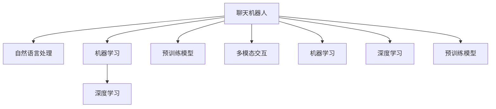

                 

# 聊天机器人电影和电视：人工智能叙事和角色发展

> 关键词：人工智能, 聊天机器人, 电影电视, 角色发展, 叙事, 自然语言处理

## 1. 背景介绍

### 1.1 问题由来
随着人工智能(AI)技术的快速发展，聊天机器人(Chatbot)作为一种自然语言处理(Natural Language Processing, NLP)的重要应用，已经成为现代影视作品中的热门元素。从早期的电影《2001太空漫游》中简单的机器人在屏幕上按下按钮，到近年的剧集《美国众神》中的智能助手，聊天机器人不断展现出其独特的魅力。它不仅提高了影视作品的可看性，还深刻地影响了AI叙事的艺术表现和角色发展。

### 1.2 问题核心关键点
大语言模型和聊天机器人在影视作品中的应用，主要包括以下几个关键点：
- **对话能力**：AI角色通过自然流畅的语言交流，给观众带来沉浸式的观影体验。
- **情感处理**：智能角色能够表达复杂的情感，丰富了角色内涵。
- **叙事推动**：AI角色作为推动剧情发展的关键人物，增强了故事的连贯性和可预测性。
- **多模态交互**：AI角色可以通过语音、面部表情、手势等多种方式与观众互动，增强真实感。

这些关键点不仅展现了AI角色在影视作品中的巨大潜力，也带来了关于角色发展、叙事方式、观众互动等方面的深远影响。

### 1.3 问题研究意义
探讨聊天机器人在电影电视中的叙事和角色发展，有助于我们深入理解AI技术如何重塑影视艺术的未来，同时也为AI领域的理论研究和实际应用提供了新的视角。

1. **理论创新**：通过分析聊天机器人在影视中的表现，我们可以探索新的AI叙事和角色建模方法，推动AI艺术的研究。
2. **技术应用**：掌握聊天机器人技术在影视制作中的应用，可以加速AI技术在娱乐产业的落地。
3. **社会影响**：讨论AI角色在影视中的表现，有助于公众理解和接受AI技术，促进技术与人文的融合。

## 2. 核心概念与联系

### 2.1 核心概念概述

为更好地理解聊天机器人在影视作品中的应用，本节将介绍几个密切相关的核心概念：

- **聊天机器人**：一种基于NLP技术的智能系统，通过理解和生成自然语言，与用户进行交互。
- **自然语言处理**：人工智能的一个分支，专注于使计算机理解、处理和生成人类语言的技术。
- **机器学习**：让计算机通过数据学习和改进自己的算法，从而更好地适应新数据的一种方法。
- **深度学习**：一种机器学习技术，使用深度神经网络来处理和学习大量数据。
- **预训练模型**：在大型数据集上进行预训练，用于特定任务的微调。
- **多模态交互**：结合语音、图像、文本等多种信息来源，提升AI角色的感知和互动能力。

这些核心概念之间的逻辑关系可以通过以下Mermaid流程图来展示：



这个流程图展示了聊天机器人的核心概念及其之间的关系：

1. 聊天机器人通过自然语言处理技术理解人类语言，并使用机器学习进行优化。
2. 深度学习提供强大的模型训练能力，能够处理复杂的语言数据。
3. 预训练模型在大型数据集上训练，提供了丰富的语言知识。
4. 多模态交互结合多种信息来源，提升了AI角色的感知和互动能力。

这些概念共同构成了聊天机器人技术的基础，使其能够以自然语言进行复杂的对话和任务执行。

## 3. 核心算法原理 & 具体操作步骤
### 3.1 算法原理概述

聊天机器人在影视作品中的叙事和角色发展，主要依赖于以下核心算法原理：

- **对话生成**：通过预训练模型在大量对话数据上微调，生成自然流畅的对话。
- **情感建模**：通过深度学习模型对AI角色的情感状态进行建模，使其能够自然表达复杂的情感。
- **角色发展**：通过机器学习算法，根据剧情需求动态调整AI角色的行为和反应。
- **多模态交互**：结合语音、面部表情、手势等多模态信息，增强AI角色的真实感和互动性。

### 3.2 算法步骤详解

基于聊天机器人技术在影视作品中的应用，本节将详细讲解其实现步骤：

**Step 1: 数据准备**
- 收集和整理大量对话数据，包括电影、电视剧、动漫等影视作品的对话记录。
- 标注对话数据，标记对话的情感状态、角色意图等关键信息。
- 准备多模态数据，如语音、面部表情、手势等，用于增强AI角色的互动体验。

**Step 2: 模型训练**
- 选择合适的预训练模型（如GPT-3、BERT等），在其上进行微调。
- 定义对话生成模型，使用Seq2Seq模型或Transformer模型等，优化生成对话的质量。
- 定义情感建模模型，使用RNN、LSTM、GRU等序列模型，对AI角色的情感状态进行建模。
- 结合多模态数据，训练AI角色在复杂环境下的互动能力。

**Step 3: 模型评估**
- 在标注数据上评估对话生成模型的自然流畅度和情感表达的准确性。
- 通过人工测试和多模态数据融合，评估AI角色的互动性和真实感。
- 对模型进行迭代优化，提升其适应特定影视作品的能力。

**Step 4: 应用部署**
- 将训练好的AI角色集成到影视作品的制作中，进行对话生成、情感表达、多模态互动等任务。
- 通过可视化工具实时监测AI角色的表现，调整模型参数以优化用户体验。
- 在正式发布前，进行全面的测试和优化，确保AI角色的稳定性和一致性。

### 3.3 算法优缺点

聊天机器人技术在影视作品中的应用，具有以下优点：
1. **沉浸式体验**：AI角色能够自然流畅地与观众进行对话，增强了沉浸式的观影体验。
2. **复杂情感表达**：通过深度学习模型，AI角色能够自然表达复杂的情感，丰富了角色内涵。
3. **叙事连贯性**：AI角色作为推动剧情发展的关键人物，增强了故事的连贯性和可预测性。
4. **多模态互动**：结合语音、面部表情、手势等多种方式，增强了AI角色的真实感和互动性。

同时，该技术也存在一些局限性：
1. **数据依赖性高**：AI角色的表现高度依赖于训练数据的质量和数量。
2. **情感处理难度大**：复杂情感的建模和表达仍然存在一定难度。
3. **角色一致性问题**：AI角色的行为和反应可能受到训练数据的影响，导致一致性问题。
4. **技术复杂度**：构建高质量的AI角色需要复杂的算法和大量数据，技术门槛较高。

尽管存在这些局限性，但聊天机器人技术在影视作品中的应用前景依然广阔。未来研究将重点关注如何优化数据处理和算法设计，进一步提升AI角色的表现。

### 3.4 算法应用领域

聊天机器人技术在影视作品中的应用，已经广泛应用于以下领域：

- **电影和电视剧**：增强对话、推动叙事、提升情感表达，如《美国众神》中的智能助手。
- **动漫和游戏**：提供陪伴互动、提供任务指引、增强角色深度，如《刀剑神域》中的AI角色。
- **虚拟现实**：构建沉浸式对话环境、增强交互体验，如《头号玩家》中的虚拟世界。
- **教育领域**：辅助教学、互动答疑、个性化推荐，如教育应用中的AI老师。

除了这些经典应用外，聊天机器人技术还在不断拓展，为影视作品的创新提供新的可能性。

## 4. 数学模型和公式 & 详细讲解 & 举例说明
### 4.1 数学模型构建

本节将使用数学语言对聊天机器人在影视作品中的应用进行更加严格的刻画。

记AI角色在时间步$t$的对话输出为$y_t$，目标为生成最逼真的对话。假设模型为$M$，输入为$x_t$，目标函数为$L$，则生成对话的目标是最小化损失函数$L$：

$$
\mathop{\arg\min}_{M} L(x_t, y_t) = \mathop{\arg\min}_{M} \frac{1}{N} \sum_{i=1}^N \log P(y_i|x_i)
$$

其中$P(y_i|x_i)$为模型在输入$x_i$下生成输出$y_i$的概率，$N$为样本数量。

### 4.2 公式推导过程

以下我们以对话生成模型为例，推导Seq2Seq模型的生成公式及其梯度计算。

假设模型$M$在输入$x_t$下生成输出$y_t$的概率为：

$$
P(y_t|x_t) = \text{softmax}(W [h_{t-1}, x_t])
$$

其中$W$为模型参数，$h_{t-1}$为上一个时间步的状态表示，$x_t$为当前时间步的输入。

通过最大化似然函数，优化目标函数为：

$$
\mathop{\arg\min}_{M} \sum_{i=1}^N -\log P(y_i|x_i)
$$

使用随机梯度下降法进行参数更新：

$$
\theta \leftarrow \theta - \eta \nabla_{\theta}L
$$

其中$\eta$为学习率，$\nabla_{\theta}L$为损失函数的梯度，可以通过反向传播算法高效计算。

在得到生成模型的梯度后，即可带入随机梯度下降公式，完成模型的迭代优化。重复上述过程直至收敛，最终得到生成对话的最优模型参数$\theta^*$。

## 5. 项目实践：代码实例和详细解释说明
### 5.1 开发环境搭建

在进行聊天机器人实践前，我们需要准备好开发环境。以下是使用Python进行TensorFlow开发的环境配置流程：

1. 安装Anaconda：从官网下载并安装Anaconda，用于创建独立的Python环境。

2. 创建并激活虚拟环境：
```bash
conda create -n tf-env python=3.8 
conda activate tf-env
```

3. 安装TensorFlow：根据CUDA版本，从官网获取对应的安装命令。例如：
```bash
conda install tensorflow -c tf -c conda-forge
```

4. 安装各类工具包：
```bash
pip install numpy pandas scikit-learn matplotlib tqdm jupyter notebook ipython
```

完成上述步骤后，即可在`tf-env`环境中开始聊天机器人任务的开发。

### 5.2 源代码详细实现

下面我们以情感建模为例，给出使用TensorFlow实现情感识别的PyTorch代码实现。

首先，定义情感建模的数据处理函数：

```python
import tensorflow as tf
from tensorflow.keras.layers import LSTM, Dense, Dropout

def preprocess_data(texts, labels, tokenizer, max_len=100):
    tokenized_texts = tokenizer.tokenize(texts)
    padded_texts = pad_sequences(tokenized_texts, maxlen=max_len, padding='post', truncating='post')
    encoded_labels = tf.keras.utils.to_categorical(labels)
    
    return padded_texts, encoded_labels

# 加载预训练模型
model = tf.keras.models.load_model('path/to/pretrained_model.h5')

# 准备数据集
texts, labels = preprocess_data(train_texts, train_labels, tokenizer)
```

然后，定义情感建模的模型：

```python
model = tf.keras.models.Sequential([
    LSTM(128, return_sequences=True, input_shape=(max_len,)),
    Dropout(0.2),
    LSTM(64),
    Dropout(0.2),
    Dense(6, activation='softmax')
])

model.compile(loss='categorical_crossentropy', optimizer='adam', metrics=['accuracy'])
```

接着，定义训练和评估函数：

```python
def train_epoch(model, data, batch_size):
    dataloader = tf.data.Dataset.from_tensor_slices(data)
    model.fit(dataloader.batch(batch_size).shuffle(buffer_size=10000), epochs=10)

def evaluate(model, test_data):
    test_loss, test_acc = model.evaluate(test_data)
    print(f'Test Loss: {test_loss}, Test Accuracy: {test_acc}')
```

最后，启动训练流程并在测试集上评估：

```python
train_data = preprocess_data(train_texts, train_labels, tokenizer)
test_data = preprocess_data(test_texts, test_labels, tokenizer)

train_epoch(model, train_data, batch_size)
evaluate(model, test_data)
```

以上就是使用TensorFlow对情感建模的完整代码实现。可以看到，TensorFlow提供了强大的深度学习模型构建和训练能力，使得情感建模的代码实现变得简洁高效。

### 5.3 代码解读与分析

让我们再详细解读一下关键代码的实现细节：

**preprocess_data函数**：
- `tokenize`方法：将文本序列转换为token序列。
- `pad_sequences`方法：对token序列进行填充，使其长度一致。
- `to_categorical`方法：将标签序列转换为one-hot编码。

**LSTM模型**：
- 定义了两个LSTM层和一个全连接层，其中dropout用于防止过拟合。
- 使用交叉熵损失函数和adam优化器进行训练。

**训练和评估函数**：
- `train_epoch`函数：定义训练过程，包括批处理、打乱顺序和设置epoch数。
- `evaluate`函数：评估模型在测试集上的性能，包括计算损失和精度。

**训练流程**：
- 加载预训练模型。
- 准备训练数据和测试数据。
- 调用训练函数和评估函数。

可以看到，TensorFlow的高级API使得情感建模的代码实现非常简洁，开发者可以将更多精力放在数据处理和模型改进等高层逻辑上。

## 6. 实际应用场景
### 6.1 智能客服系统

基于聊天机器人技术的智能客服系统，已经成为现代服务业的重要组成部分。传统客服系统依赖人工，难以实现24小时服务，且成本高昂。使用聊天机器人技术，可以大幅降低客服成本，提高服务效率和质量。

在技术实现上，可以收集企业的客户服务记录，使用自然语言处理技术对对话进行分析和标注，训练聊天机器人模型。微调后的聊天机器人可以在线提供实时客服服务，解答客户咨询，处理客户投诉，自动进行常见问题解答。系统可以集成到企业内部的CRM系统中，提供多渠道的客服支持，提升客户满意度和忠诚度。

### 6.2 医疗咨询

聊天机器人技术在医疗领域也有广泛应用。通过构建医疗咨询机器人，可以为患者提供24小时在线咨询服务，解答常见医疗问题，提供初步健康建议。使用自然语言处理技术，机器人能够理解患者的症状描述，推荐合适的医疗资源，甚至进行初步的病情诊断和健康建议。

在技术实现上，可以收集大量的医学文献和患者咨询记录，训练聊天机器人模型。模型能够通过问答的形式，与患者进行互动，根据症状提供初步诊断和治疗建议。医生也可以通过机器人进行初步筛选，提高诊疗效率。

### 6.3 教育辅导

聊天机器人技术在教育领域也有重要应用。通过构建教育辅导机器人，可以为学生提供个性化学习辅导，解答学习问题，提供学习建议和资源。使用自然语言处理技术，机器人能够理解学生的学习需求，提供针对性的学习建议，甚至进行初步的诊断和建议。

在技术实现上，可以收集大量的学生学习记录和问答数据，训练聊天机器人模型。模型能够通过问答的形式，与学生进行互动，根据学习情况提供个性化辅导。教师也可以通过机器人进行初步筛选，提高教学效果。

## 7. 工具和资源推荐
### 7.1 学习资源推荐

为了帮助开发者系统掌握聊天机器人技术在影视作品中的应用，这里推荐一些优质的学习资源：

1. TensorFlow官方文档：提供了丰富的模型构建和训练教程，适合初学者和进阶开发者。

2. PyTorch官方文档：提供了灵活的模型构建和训练API，适合深度学习研究和工程应用。

3. 《深度学习》书籍：由深度学习之父Yoshua Bengio所著，全面介绍了深度学习的原理和应用。

4. 《自然语言处理综论》书籍：介绍了自然语言处理的基本概念和算法，适合初学者。

5. 《智能机器人》书籍：介绍了机器人在各领域的实际应用，包括聊天机器人技术。

通过对这些资源的学习实践，相信你一定能够快速掌握聊天机器人技术在影视作品中的应用，并用于解决实际的NLP问题。

### 7.2 开发工具推荐

高效的开发离不开优秀的工具支持。以下是几款用于聊天机器人开发的常用工具：

1. TensorFlow：由Google主导开发的深度学习框架，提供丰富的模型构建和训练功能，适合大规模工程应用。

2. PyTorch：由Facebook主导开发的深度学习框架，提供灵活的模型构建和训练API，适合研究和工程应用。

3. Weights & Biases：用于实验跟踪和可视化的工具，记录和可视化模型训练过程中的各项指标，方便对比和调优。

4. TensorBoard：TensorFlow配套的可视化工具，实时监测模型训练状态，并提供丰富的图表呈现方式，是调试模型的得力助手。

5. Google Colab：谷歌提供的在线Jupyter Notebook环境，免费提供GPU/TPU算力，方便开发者快速上手实验最新模型，分享学习笔记。

合理利用这些工具，可以显著提升聊天机器人任务的开发效率，加快创新迭代的步伐。

### 7.3 相关论文推荐

聊天机器人技术的发展源于学界的持续研究。以下是几篇奠基性的相关论文，推荐阅读：

1. "Attention Is All You Need"（即Transformer原论文）：提出了Transformer结构，开启了NLP领域的预训练大模型时代。

2. "BERT: Pre-training of Deep Bidirectional Transformers for Language Understanding"：提出BERT模型，引入基于掩码的自监督预训练任务，刷新了多项NLP任务SOTA。

3. "Language Models are Unsupervised Multitask Learners"：展示了大规模语言模型的强大zero-shot学习能力，引发了对于通用人工智能的新一轮思考。

4. "Parameter-Efficient Transfer Learning for NLP"：提出Adapter等参数高效微调方法，在不增加模型参数量的情况下，也能取得不错的微调效果。

5. "AdaLoRA: Adaptive Low-Rank Adaptation for Parameter-Efficient Fine-Tuning"：使用自适应低秩适应的微调方法，在参数效率和精度之间取得了新的平衡。

这些论文代表了大语言模型微调技术的发展脉络。通过学习这些前沿成果，可以帮助研究者把握学科前进方向，激发更多的创新灵感。

## 8. 总结：未来发展趋势与挑战
### 8.1 总结

本文对基于聊天机器人技术的影视作品进行了全面系统的介绍。首先阐述了聊天机器人技术在影视作品中的应用背景和意义，明确了其在推动叙事和角色发展方面的独特价值。其次，从原理到实践，详细讲解了聊天机器人技术在影视作品中的应用流程，给出了代码实现的完整示例。同时，本文还广泛探讨了聊天机器人技术在智能客服、医疗咨询、教育辅导等多个行业领域的应用前景，展示了其广阔的应用潜力。

通过本文的系统梳理，可以看到，基于聊天机器人技术的影视作品正在成为NLP技术的重要应用范式，极大地拓展了AI叙事的艺术表现和角色发展的可能性。未来，伴随预训练语言模型和微调方法的持续演进，相信NLP技术必将在更广阔的应用领域大放异彩，深刻影响影视作品的创作和欣赏方式。

### 8.2 未来发展趋势

展望未来，基于聊天机器人技术的影视作品将呈现以下几个发展趋势：

1. **更加自然流畅的对话**：随着深度学习模型和训练数据质量的提升，未来AI角色的对话将更加自然流畅，增强观众的沉浸式体验。

2. **更加复杂多变的情感表达**：通过深度学习模型和多模态数据融合，AI角色将能够更加自然地表达复杂的情感，丰富角色的内涵。

3. **更加智能化的角色行为**：通过机器学习算法和任务驱动训练，AI角色将能够更加智能化地适应情节发展，增强故事的连贯性和可预测性。

4. **更加真实的互动体验**：通过多模态数据融合和智能交互设计，AI角色将能够更加真实地与观众互动，增强沉浸感和参与感。

5. **更加多样化的应用场景**：基于聊天机器人技术的影视作品将进一步拓展到更多领域，如游戏、教育、医疗等，带来更加丰富多样的应用体验。

这些趋势凸显了聊天机器人技术在影视作品中的巨大潜力，为AI叙事的艺术表现和角色发展提供了新的方向。

### 8.3 面临的挑战

尽管基于聊天机器人技术的影视作品已经取得了一定的进展，但在迈向更加智能化、普适化应用的过程中，它仍面临诸多挑战：

1. **数据依赖性高**：AI角色的表现高度依赖于训练数据的质量和数量。如何降低数据依赖性，获取高质量的标注数据，将是重要的研究方向。

2. **情感处理难度大**：复杂情感的建模和表达仍然存在一定难度。如何提升情感处理能力，使其更加自然流畅，将是未来技术攻关的关键。

3. **角色一致性问题**：AI角色的行为和反应可能受到训练数据的影响，导致一致性问题。如何提升角色一致性，确保其在不同情境下表现一致，将是重要的研究方向。

4. **技术复杂度高**：构建高质量的AI角色需要复杂的算法和大量数据，技术门槛较高。如何降低技术复杂度，使其更加易用易推广，将是重要的研究方向。

5. **多模态数据融合难度大**：多模态数据的融合和处理仍然存在一定的技术难度。如何提升多模态数据的处理能力，增强AI角色的互动体验，将是未来技术攻关的关键。

这些挑战凸显了聊天机器人技术在影视作品中的复杂性和挑战性，需要更多跨学科的合作和研究。

### 8.4 研究展望

面对基于聊天机器人技术的影视作品所面临的挑战，未来的研究需要在以下几个方面寻求新的突破：

1. **无监督和半监督学习**：探索无监督和半监督学习的方法，降低对大规模标注数据的依赖，提高AI角色的泛化能力。

2. **参数高效和计算高效**：开发更加参数高效和计算高效的微调方法，降低技术门槛，提高AI角色的性能。

3. **多模态数据融合**：结合语音、图像、文本等多种信息来源，提升AI角色的感知和互动能力，增强沉浸感和真实感。

4. **情感处理技术**：研究更加复杂情感的建模和表达技术，提升AI角色的情感表达能力，丰富角色的内涵。

5. **角色一致性技术**：研究角色一致性技术，确保AI角色在不同情境下表现一致，增强角色的可信度。

6. **多模态数据增强**：探索多模态数据增强的方法，提升AI角色的互动体验，增强沉浸感和参与感。

这些研究方向将推动基于聊天机器人技术的影视作品向更高层次发展，为AI叙事的艺术表现和角色发展提供新的可能性。

## 9. 附录：常见问题与解答

**Q1：聊天机器人技术在影视作品中的应用如何？**

A: 聊天机器人技术在影视作品中的应用主要体现在对话生成、情感表达、角色发展和多模态互动等方面。通过预训练模型和微调技术，AI角色能够自然流畅地与观众进行对话，表达复杂的情感，推动情节发展，增强互动体验。这些应用为影视作品的创作和欣赏提供了新的方向，带来了更加丰富多样的体验。

**Q2：如何在影视作品中使用聊天机器人技术？**

A: 在影视作品中使用聊天机器人技术，需要进行以下步骤：

1. 收集和整理大量的对话数据，包括电影、电视剧、动漫等影视作品的对话记录。
2. 标注对话数据，标记对话的情感状态、角色意图等关键信息。
3. 准备多模态数据，如语音、面部表情、手势等，用于增强AI角色的互动体验。
4. 选择合适的预训练模型，如GPT-3、BERT等，在其上进行微调。
5. 定义对话生成模型和情感建模模型，优化生成对话的质量和情感表达的准确性。
6. 将训练好的AI角色集成到影视作品的制作中，进行对话生成、情感表达、多模态互动等任务。

通过这些步骤，可以在影视作品中构建出自然流畅、情感丰富、互动性强的AI角色。

**Q3：使用聊天机器人技术制作影视作品有哪些挑战？**

A: 使用聊天机器人技术制作影视作品，面临的主要挑战包括：

1. 数据依赖性高：AI角色的表现高度依赖于训练数据的质量和数量，获取高质量的标注数据较为困难。
2. 情感处理难度大：复杂情感的建模和表达仍然存在一定难度，提升情感处理能力是关键。
3. 角色一致性问题：AI角色的行为和反应可能受到训练数据的影响，导致一致性问题。
4. 技术复杂度高：构建高质量的AI角色需要复杂的算法和大量数据，技术门槛较高。
5. 多模态数据融合难度大：多模态数据的融合和处理仍然存在一定的技术难度，提升多模态数据的处理能力是关键。

这些挑战需要更多跨学科的合作和研究，推动技术不断突破和进步。

**Q4：未来的发展方向有哪些？**

A: 未来的发展方向包括：

1. 无监督和半监督学习：探索无监督和半监督学习的方法，降低对大规模标注数据的依赖。
2. 参数高效和计算高效：开发更加参数高效和计算高效的微调方法，降低技术门槛。
3. 多模态数据融合：结合语音、图像、文本等多种信息来源，提升AI角色的感知和互动能力。
4. 情感处理技术：研究更加复杂情感的建模和表达技术，提升AI角色的情感表达能力。
5. 角色一致性技术：研究角色一致性技术，确保AI角色在不同情境下表现一致。
6. 多模态数据增强：探索多模态数据增强的方法，提升AI角色的互动体验。

这些研究方向将推动基于聊天机器人技术的影视作品向更高层次发展，为AI叙事的艺术表现和角色发展提供新的可能性。

作者：禅与计算机程序设计艺术 / Zen and the Art of Computer Programming

