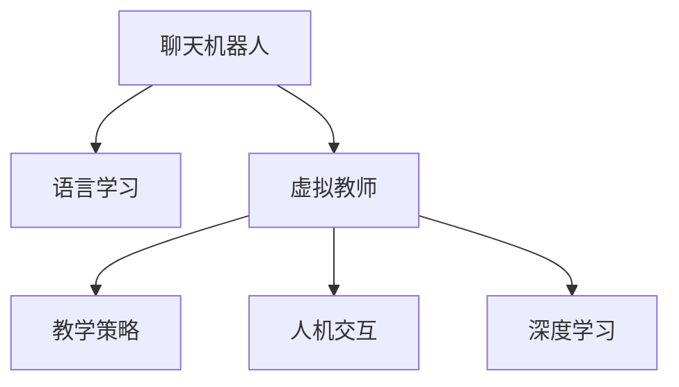

                 

# 聊天机器人语言学习：虚拟教师

> 关键词：聊天机器人,语言学习,虚拟教师,教学策略,自适应学习,人机交互,深度学习

## 1. 背景介绍

### 1.1 问题由来
随着人工智能技术的飞速发展，聊天机器人已经成为了智能应用的重要组成部分。它们可以模拟人类对话，解答用户问题，提供个性化服务。然而，构建一个能够真正理解人类语言、提供高质量回答的聊天机器人，仍然是一个复杂的挑战。如何使聊天机器人能够持续地学习新知识，并根据用户反馈不断改进，成为了一个亟待解决的问题。

### 1.2 问题核心关键点
聊天机器人的语言学习通常依赖于机器翻译、情感分析、意图识别等技术。但是，这些技术往往需要在大量标注数据上进行预训练，才能达到较高的准确率。然而，标注数据获取的成本高昂且耗时，限制了聊天机器人的规模化和普及化。

此外，聊天机器人的个性化服务能力也受到了限制。由于用户需求的多样性和复杂性，聊天机器人难以灵活地适应用户的多样化需求。如何使聊天机器人能够适应不同类型的用户，提升个性化服务的水平，是一个重要的研究方向。

## 2. 核心概念与联系

### 2.1 核心概念概述

为更好地理解聊天机器人语言学习的技术，本节将介绍几个密切相关的核心概念：

- 聊天机器人：能够模拟人类对话，解答用户问题，提供个性化服务的智能应用。
- 语言学习：聊天机器人通过与用户互动，不断学习新的语言表达和知识，提升理解和生成能力。
- 虚拟教师：基于自然语言处理技术的虚拟教师，能够根据用户需求，提供个性化的教学和答疑服务。
- 教学策略：虚拟教师使用的教学方法和策略，如自适应学习、个性化推荐等。
- 人机交互：虚拟教师与用户之间的交互方式，如问答对话、文本输入、语音交互等。
- 深度学习：聊天机器人采用的核心技术，利用神经网络模型进行自然语言处理和理解。

这些核心概念之间的逻辑关系可以通过以下Mermaid流程图来展示：



这个流程图展示出聊天机器人、语言学习、虚拟教师、教学策略、人机交互和深度学习之间的密切联系：

1. 聊天机器人通过与用户互动，不断学习新的语言表达和知识，提升理解和生成能力。
2. 虚拟教师作为聊天机器人的重要组成部分，基于教学策略和深度学习技术，提供个性化的教学和答疑服务。
3. 深度学习技术是聊天机器人语言学习的基础，利用神经网络模型进行自然语言处理和理解。
4. 人机交互方式直接影响用户的学习体验和满意度，需要通过多模态输入和输出方式进行优化。
5. 教学策略是虚拟教师的关键，需要结合用户需求和反馈，不断调整和优化教学方案。

## 3. 核心算法原理 & 具体操作步骤
### 3.1 算法原理概述

聊天机器人语言学习的核心算法基于深度学习，通过神经网络模型进行自然语言处理和理解。以下是深度学习在聊天机器人语言学习中应用的主要步骤：

1. **数据预处理**：将用户输入的自然语言文本转化为模型可以处理的向量表示，例如使用word embedding将文本转化为高维向量。

2. **模型训练**：通过反向传播算法，使用标注数据训练神经网络模型，使其能够预测正确的用户意图和上下文信息。

3. **模型推理**：使用训练好的模型，对用户输入的文本进行推理，输出最可能的回答或下一步操作。

4. **反馈机制**：通过与用户交互，收集用户反馈，更新模型的参数和策略，提升其性能。

### 3.2 算法步骤详解

基于深度学习的聊天机器人语言学习，主要包括以下关键步骤：

**Step 1: 数据收集与预处理**
- 收集大量的用户对话数据，清洗数据，去除噪声和无效信息。
- 将对话数据进行分词、去停用词、词性标注等预处理，转化为模型可以处理的向量表示。

**Step 2: 模型选择与设计**
- 选择合适的深度学习模型，如Seq2Seq、Transformer等，用于处理自然语言。
- 设计合适的损失函数和优化器，如交叉熵损失、Adam优化器等，用于训练模型。

**Step 3: 模型训练与验证**
- 将预处理后的数据划分为训练集和验证集，使用训练集数据训练模型。
- 在验证集上评估模型性能，调整模型参数和策略，确保模型泛化能力。

**Step 4: 模型推理与优化**
- 使用训练好的模型，对用户输入进行推理，输出回答或下一步操作。
- 收集用户反馈，通过在线学习算法（如FTRL）更新模型参数，提升模型性能。

**Step 5: 用户交互与反馈**
- 将模型部署到实际应用场景，进行用户交互。
- 收集用户反馈，优化模型，提升用户体验和满意度。

### 3.3 算法优缺点

基于深度学习的聊天机器人语言学习具有以下优点：
1. 能够处理复杂的自然语言表达，提升聊天机器人对人类语言的理解能力。
2. 能够自适应学习和优化，不断提升聊天机器人的性能。
3. 支持多模态人机交互，如文本、语音、图像等。
4. 支持大规模训练和部署，能够应对大量用户需求。

同时，该方法也存在一些局限性：
1. 对标注数据的依赖性较大，需要大量高质量标注数据进行训练。
2. 模型复杂度高，对计算资源和存储要求较高。
3. 模型的泛化能力受到数据分布的影响，容易产生偏差。
4. 模型的解释性较差，难以理解和调试。

尽管存在这些局限性，但深度学习仍然是聊天机器人语言学习的主流技术，其优秀的性能和灵活性使其在实际应用中具有广泛的前景。

### 3.4 算法应用领域

基于深度学习的聊天机器人语言学习技术，已经在多个领域得到应用，例如：

- 教育：聊天机器人可以作为虚拟教师，提供个性化的学习辅导和答疑服务。
- 医疗：聊天机器人可以辅助医生进行疾病咨询和初步诊断。
- 客服：聊天机器人可以提供24小时在线客服，解答用户问题。
- 金融：聊天机器人可以提供金融咨询和理财建议。
- 电商：聊天机器人可以提供商品推荐和客户服务。

除了上述这些经典应用外，聊天机器人语言学习还在更多场景中得到创新性应用，如情感分析、用户行为分析、智能推荐等，为各行各业带来了新的业务价值。

## 4. 数学模型和公式 & 详细讲解  
### 4.1 数学模型构建

在聊天机器人语言学习中，常用的深度学习模型包括循环神经网络（RNN）、卷积神经网络（CNN）、Transformer等。这里以Transformer模型为例，介绍其数学模型构建过程。

假设输入序列为 $\mathbf{x}=(x_1,x_2,\cdots,x_T)$，输出序列为 $\mathbf{y}=(y_1,y_2,\cdots,y_T)$。使用Transformer模型进行语言学习的数学模型可以表示为：

$$
\mathbf{y} = \text{Decoder}(\text{Encoder}(\mathbf{x}, \mathbf{W}_{\text{in}}, \mathbf{W}_{\text{out}}))
$$

其中，$\text{Encoder}$ 和 $\text{Decoder}$ 分别是编码器和解码器，$\mathbf{W}_{\text{in}}$ 和 $\mathbf{W}_{\text{out}}$ 是输入和输出的线性投影矩阵。Transformer模型的核心是自注意力机制，其公式为：

$$
\text{Attention}(Q,K,V) = \text{softmax}(\frac{QK^T}{\sqrt{d_k}})
$$

其中，$Q$、$K$ 和 $V$ 分别是查询、键和值矩阵，$d_k$ 是维度。

### 4.2 公式推导过程

在Transformer模型中，自注意力机制的推导过程如下：

1. 对输入序列 $\mathbf{x}$ 进行线性投影，得到查询、键和值矩阵：
   $$
   Q = \mathbf{W}_{\text{in}}\mathbf{x}, \quad K = \mathbf{W}_{\text{in}}\mathbf{x}, \quad V = \mathbf{W}_{\text{in}}\mathbf{x}
   $$

2. 计算查询和键的相似度矩阵：
   $$
   \text{Attention}(Q,K,V) = \text{softmax}(\frac{QK^T}{\sqrt{d_k}})
   $$

3. 通过自注意力机制计算注意力权重：
   $$
   \mathbf{A} = \text{Attention}(Q,K,V)
   $$

4. 计算加权和：
   $$
   \text{Self-Attention}(Q,K,V) = \mathbf{V}A
   $$

5. 将自注意力结果与前一层隐藏状态进行加权求和：
   $$
   \mathbf{H} = \text{LayerNorm}(\mathbf{x} + \text{Self-Attention}(Q,K,V))
   $$

6. 经过多层叠加和残差连接，最终输出预测结果：
   $$
   \mathbf{y} = \text{Decoder}(\text{Encoder}(\mathbf{x}, \mathbf{W}_{\text{in}}, \mathbf{W}_{\text{out}}))
   $$

以上公式展示了Transformer模型在自注意力机制中的核心推导过程。通过自注意力机制，模型能够捕捉输入序列中的全局依赖关系，提升了对自然语言的处理能力。

### 4.3 案例分析与讲解

以情感分析为例，展示如何基于Transformer模型进行聊天机器人语言学习：

1. **数据收集与预处理**
   - 收集大量的情感标注数据，如IMDb电影评论、Twitter用户评论等。
   - 对数据进行分词、去停用词、词性标注等预处理，转化为向量表示。

2. **模型选择与设计**
   - 选择Transformer模型作为情感分析的深度学习模型。
   - 设计交叉熵损失函数和Adam优化器，用于训练模型。

3. **模型训练与验证**
   - 使用训练集数据训练模型，在验证集上评估模型性能。
   - 调整模型参数和策略，确保模型泛化能力。

4. **模型推理与优化**
   - 将训练好的模型部署到实际应用场景，对用户输入进行情感分析。
   - 收集用户反馈，通过在线学习算法（如FTRL）更新模型参数，提升模型性能。

5. **用户交互与反馈**
   - 将模型部署到聊天机器人中，进行用户交互。
   - 收集用户反馈，优化模型，提升用户体验和满意度。

通过以上步骤，可以构建一个基于深度学习的情感分析聊天机器人，帮助用户进行情感表达和情绪调节。

## 5. 项目实践：代码实例和详细解释说明
### 5.1 开发环境搭建

在进行聊天机器人语言学习项目实践前，我们需要准备好开发环境。以下是使用Python进行TensorFlow开发的环境配置流程：

1. 安装Anaconda：从官网下载并安装Anaconda，用于创建独立的Python环境。

2. 创建并激活虚拟环境：
```bash
conda create -n tf-env python=3.8 
conda activate tf-env
```

3. 安装TensorFlow：根据CUDA版本，从官网获取对应的安装命令。例如：
```bash
pip install tensorflow
```

4. 安装各类工具包：
```bash
pip install numpy pandas scikit-learn matplotlib tqdm jupyter notebook ipython
```

完成上述步骤后，即可在`tf-env`环境中开始项目实践。

### 5.2 源代码详细实现

下面以基于Transformer的情感分析聊天机器人为例，给出TensorFlow的代码实现。

首先，定义情感分析的数据处理函数：

```python
import tensorflow as tf
from tensorflow.keras.preprocessing.text import Tokenizer
from tensorflow.keras.preprocessing.sequence import pad_sequences

def preprocess_data(texts, labels):
    tokenizer = Tokenizer(num_words=10000, oov_token="<OOV>")
    tokenizer.fit_on_texts(texts)
    sequences = tokenizer.texts_to_sequences(texts)
    padded_sequences = pad_sequences(sequences, maxlen=100, padding='post')
    labels = tf.keras.utils.to_categorical(labels, num_classes=2)
    return padded_sequences, labels
```

然后，定义Transformer模型：

```python
from tensorflow.keras.layers import Input, Dense, Embedding, LSTM
from tensorflow.keras.models import Model

def build_transformer(input_shape, num_classes):
    input_layer = Input(shape=input_shape)
    embedding_layer = Embedding(input_dim=10000, output_dim=128, input_length=100)(input_layer)
    lstm_layer = LSTM(128)(embedding_layer)
    dense_layer = Dense(num_classes, activation='softmax')(lstm_layer)
    model = Model(inputs=input_layer, outputs=dense_layer)
    return model
```

接着，定义训练和评估函数：

```python
from tensorflow.keras.optimizers import Adam
from tensorflow.keras.callbacks import EarlyStopping

def train_model(model, data, batch_size, epochs, validation_data):
    model.compile(optimizer=Adam(learning_rate=0.001), loss='categorical_crossentropy', metrics=['accuracy'])
    early_stopping = EarlyStopping(monitor='val_loss', patience=3)
    model.fit(x=data[0], y=data[1], batch_size=batch_size, epochs=epochs, validation_data=(validation_data[0], validation_data[1]), callbacks=[early_stopping])

def evaluate_model(model, test_data):
    test_loss, test_acc = model.evaluate(x=test_data[0], y=test_data[1])
    print(f'Test Loss: {test_loss}, Test Accuracy: {test_acc}')
```

最后，启动训练流程并在测试集上评估：

```python
epochs = 20
batch_size = 128

# 加载数据
train_data = preprocess_data(train_texts, train_labels)
dev_data = preprocess_data(dev_texts, dev_labels)
test_data = preprocess_data(test_texts, test_labels)

# 构建模型
model = build_transformer(input_shape=(100, 100), num_classes=2)

# 训练模型
train_model(model, train_data, batch_size, epochs, validation_data=dev_data)

# 评估模型
evaluate_model(model, test_data)
```

以上就是使用TensorFlow进行情感分析聊天机器人开发的完整代码实现。可以看到，通过TensorFlow的高级API，构建深度学习模型变得简单高效。

### 5.3 代码解读与分析

让我们再详细解读一下关键代码的实现细节：

**preprocess_data函数**：
- 使用Keras的Tokenizer对文本进行分词、去停用词和向量化处理。
- 使用pad_sequences对序列进行填充，确保所有样本长度一致。
- 使用to_categorical将标签转化为独热编码。

**build_transformer函数**：
- 定义Transformer模型的基本结构，包括嵌入层、LSTM层和全连接层。
- 使用Model封装输入层和输出层，形成完整的模型。

**train_model函数**：
- 使用Adam优化器和交叉熵损失函数编译模型。
- 使用EarlyStopping回调函数防止过拟合。
- 在训练集上训练模型，并在验证集上评估性能。

**evaluate_model函数**：
- 在测试集上评估模型的性能，输出损失和准确率。

通过以上代码实现，可以构建一个基于Transformer的情感分析聊天机器人，并通过简单的训练和评估流程，验证模型的性能。

## 6. 实际应用场景
### 6.1 教育

在教育领域，聊天机器人可以作为一种虚拟教师，提供个性化的学习辅导和答疑服务。学生可以通过聊天机器人提出学习问题，获取即时的解答和建议。

虚拟教师可以根据学生的学习情况，动态调整教学策略，提供个性化的学习计划和资源推荐。通过在线学习算法，虚拟教师可以不断优化教学内容，提升学生的学习效果。

### 6.2 医疗

在医疗领域，聊天机器人可以辅助医生进行疾病咨询和初步诊断。患者可以通过聊天机器人咨询健康问题，获取专业的医疗建议和指导。

虚拟教师可以根据患者的症状，推荐相应的医学知识和治疗方案。通过持续学习和反馈机制，虚拟教师可以不断提升诊断准确率和建议质量，帮助医生减轻工作负担，提高医疗服务水平。

### 6.3 客服

在客服领域，聊天机器人可以提供24小时在线客服，解答用户问题。企业可以通过聊天机器人处理大量的客户咨询，提升客户服务效率。

虚拟教师可以根据用户的历史记录和当前需求，提供个性化的客服方案。通过在线学习算法，虚拟教师可以不断优化客服策略，提升用户体验和满意度。

### 6.4 金融

在金融领域，聊天机器人可以提供金融咨询和理财建议。用户可以通过聊天机器人查询金融信息，获取个性化的投资建议和风险评估。

虚拟教师可以根据用户的财务状况和风险偏好，推荐相应的金融产品和服务。通过在线学习算法，虚拟教师可以不断优化理财建议，提升用户的财务规划效果。

### 6.5 电商

在电商领域，聊天机器人可以提供商品推荐和客户服务。用户可以通过聊天机器人查询商品信息，获取个性化的购物建议。

虚拟教师可以根据用户的购买历史和偏好，推荐相应的商品和服务。通过在线学习算法，虚拟教师可以不断优化推荐策略，提升用户的购物体验和满意度。

## 7. 工具和资源推荐
### 7.1 学习资源推荐

为了帮助开发者系统掌握聊天机器人语言学习的理论基础和实践技巧，这里推荐一些优质的学习资源：

1. 《Deep Learning with Python》书籍：由Francois Chollet所著，全面介绍了深度学习的基本概念和TensorFlow的使用方法。

2. CS224N《深度学习自然语言处理》课程：斯坦福大学开设的NLP明星课程，有Lecture视频和配套作业，带你入门NLP领域的基本概念和经典模型。

3. TensorFlow官方文档：TensorFlow的官方文档，提供了丰富的深度学习资源和样例代码，是TensorFlow学习的必备资料。

4. HuggingFace官方文档：HuggingFace提供的自然语言处理工具库，集成了多个预训练语言模型，是进行自然语言处理开发的利器。

5. Weights & Biases：模型训练的实验跟踪工具，可以记录和可视化模型训练过程中的各项指标，方便对比和调优。

6. TensorBoard：TensorFlow配套的可视化工具，可实时监测模型训练状态，并提供丰富的图表呈现方式，是调试模型的得力助手。

通过对这些资源的学习实践，相信你一定能够快速掌握聊天机器人语言学习的精髓，并用于解决实际的NLP问题。

### 7.2 开发工具推荐

高效的开发离不开优秀的工具支持。以下是几款用于聊天机器人语言学习开发的常用工具：

1. TensorFlow：基于Python的开源深度学习框架，灵活动态的计算图，适合快速迭代研究。TensorFlow提供了丰富的自然语言处理API，方便构建聊天机器人。

2. Keras：基于TensorFlow的高层次API，简化了模型的构建和训练过程。Keras的高级API可以显著降低模型开发的复杂度。

3. PyTorch：基于Python的开源深度学习框架，支持动态计算图，灵活性高。PyTorch的动态计算图和GPU加速能力使其在实时应用中表现优异。

4. Weights & Biases：模型训练的实验跟踪工具，可以记录和可视化模型训练过程中的各项指标，方便对比和调优。

5. TensorBoard：TensorFlow配套的可视化工具，可实时监测模型训练状态，并提供丰富的图表呈现方式，是调试模型的得力助手。

6. Jupyter Notebook：交互式编程环境，方便开发者进行代码调试和数据可视化。

合理利用这些工具，可以显著提升聊天机器人语言学习的开发效率，加快创新迭代的步伐。

### 7.3 相关论文推荐

聊天机器人语言学习的发展源于学界的持续研究。以下是几篇奠基性的相关论文，推荐阅读：

1. Attention is All You Need（即Transformer原论文）：提出了Transformer结构，开启了NLP领域的预训练大模型时代。

2. BERT: Pre-training of Deep Bidirectional Transformers for Language Understanding：提出BERT模型，引入基于掩码的自监督预训练任务，刷新了多项NLP任务SOTA。

3. Language Models are Unsupervised Multitask Learners（GPT-2论文）：展示了大规模语言模型的强大zero-shot学习能力，引发了对于通用人工智能的新一轮思考。

4. Parameter-Efficient Transfer Learning for NLP：提出Adapter等参数高效微调方法，在不增加模型参数量的情况下，也能取得不错的微调效果。

5. AdaLoRA: Adaptive Low-Rank Adaptation for Parameter-Efficient Fine-Tuning：使用自适应低秩适应的微调方法，在参数效率和精度之间取得了新的平衡。

这些论文代表了大语言模型微调技术的发展脉络。通过学习这些前沿成果，可以帮助研究者把握学科前进方向，激发更多的创新灵感。

## 8. 总结：未来发展趋势与挑战

### 8.1 总结

本文对基于深度学习的聊天机器人语言学习技术进行了全面系统的介绍。首先阐述了聊天机器人的语言学习技术，明确了聊天机器人在教育、医疗、客服、金融、电商等多个领域的应用价值。其次，从原理到实践，详细讲解了深度学习在聊天机器人语言学习中的核心步骤，给出了TensorFlow的代码实现。同时，本文还广泛探讨了聊天机器人语言学习在多个行业领域的应用前景，展示了深度学习技术的巨大潜力。

通过本文的系统梳理，可以看到，基于深度学习的聊天机器人语言学习技术正在成为NLP领域的重要范式，极大地拓展了聊天机器人的应用边界，催生了更多的落地场景。得益于深度学习模型的优秀性能和灵活性，聊天机器人语言学习有望在未来得到更广泛的应用和深入的探索。

### 8.2 未来发展趋势

展望未来，聊天机器人语言学习技术将呈现以下几个发展趋势：

1. 模型规模持续增大。随着算力成本的下降和数据规模的扩张，预训练语言模型的参数量还将持续增长。超大规模语言模型蕴含的丰富语言知识，有望支撑更加复杂多变的聊天机器人语言学习。

2. 多模态人机交互技术的发展。随着多模态人机交互技术的发展，聊天机器人语言学习将支持更多的交互方式，如语音、图像、视频等。多模态信息的融合，将显著提升聊天机器人对现实世界的理解和建模能力。

3. 知识增强与推理能力提升。未来的聊天机器人将能够更好地融合外部知识库和逻辑推理能力，提升其智能水平和决策能力。

4. 自适应学习与个性化推荐。基于自适应学习算法，聊天机器人将能够动态调整教学策略，提供个性化的服务方案。

5. 多任务学习与联合训练。未来的聊天机器人将能够同时处理多个任务，提升其多任务处理能力和泛化能力。

6. 跨领域迁移与知识迁移。聊天机器人语言学习将能够更好地跨领域迁移和知识迁移，提升其在新领域的表现。

以上趋势凸显了聊天机器人语言学习技术的广阔前景。这些方向的探索发展，必将进一步提升聊天机器人的性能和应用范围，为人类生产生活带来深远影响。

### 8.3 面临的挑战

尽管聊天机器人语言学习技术已经取得了显著进展，但在迈向更加智能化、普适化应用的过程中，仍面临诸多挑战：

1. 数据获取与标注成本高昂。尽管数据标注成本有所降低，但对于长尾应用场景，获取高质量标注数据仍然成本较高。如何进一步降低数据获取和标注成本，将是一大难题。

2. 模型的泛化能力受限。当前聊天机器人语言学习模型面对域外数据时，泛化性能往往大打折扣。如何提高模型的泛化能力，避免灾难性遗忘，还需要更多理论和实践的积累。

3. 模型的鲁棒性与安全性不足。聊天机器人语言学习模型容易受到噪声、攻击等影响，模型的鲁棒性和安全性需要进一步提升。

4. 模型的解释性与透明度有待加强。当前聊天机器人语言学习模型往往缺乏可解释性，难以理解和调试。如何提高模型的透明度和可解释性，将是重要的研究课题。

5. 模型的知识迁移能力有限。当前的聊天机器人语言学习模型难以灵活吸收和运用更广泛的先验知识。如何让模型更好地进行知识迁移，形成更全面的知识体系，还需要进一步的研究。

这些挑战需要在未来的研究中不断克服，只有解决好这些问题，聊天机器人语言学习技术才能真正实现其巨大的应用潜力。

### 8.4 研究展望

面对聊天机器人语言学习所面临的挑战，未来的研究需要在以下几个方面寻求新的突破：

1. 探索无监督和半监督学习范式。摆脱对大规模标注数据的依赖，利用自监督学习、主动学习等无监督和半监督范式，最大限度利用非结构化数据，实现更加灵活高效的聊天机器人语言学习。

2. 研究参数高效与计算高效的微调范式。开发更加参数高效的微调方法，在固定大部分预训练参数的同时，只更新极少量的任务相关参数。同时优化微调模型的计算图，减少前向传播和反向传播的资源消耗，实现更加轻量级、实时性的部署。

3. 引入因果推理与知识图谱。通过引入因果推理和知识图谱，增强聊天机器人语言学习的稳定性和决策能力。

4. 融合多模态信息与专家知识。将符号化的先验知识，如知识图谱、逻辑规则等，与神经网络模型进行巧妙融合，引导聊天机器人语言学习过程学习更准确、合理的语言模型。

5. 结合逻辑推理与知识表示。将逻辑推理方法引入聊天机器人语言学习，增强模型的知识推理能力，提升其决策的逻辑性和可靠性。

6. 加强伦理道德与社会责任。在聊天机器人语言学习中引入伦理导向的评估指标，过滤和惩罚有害的输出倾向。同时加强人工干预和审核，建立模型行为的监管机制，确保输出符合人类价值观和伦理道德。

这些研究方向的探索，必将引领聊天机器人语言学习技术迈向更高的台阶，为构建安全、可靠、可解释、可控的智能系统铺平道路。面向未来，聊天机器人语言学习技术还需要与其他人工智能技术进行更深入的融合，如知识表示、因果推理、强化学习等，多路径协同发力，共同推动自然语言理解和智能交互系统的进步。只有勇于创新、敢于突破，才能不断拓展语言模型的边界，让智能技术更好地造福人类社会。

## 9. 附录：常见问题与解答

**Q1：什么是虚拟教师？**

A: 虚拟教师是一种基于自然语言处理技术的智能教师，能够通过与学生的交互，提供个性化的学习辅导和答疑服务。虚拟教师可以根据学生的学习情况，动态调整教学策略，提供个性化的学习计划和资源推荐。

**Q2：虚拟教师与传统教师有何不同？**

A: 虚拟教师与传统教师的最大不同在于其基于自然语言处理技术，能够自动处理和理解学生的输入，提供即时的反馈和建议。虚拟教师可以24小时在线，不受时间和地点的限制，能够提供连续不断的学习支持。同时，虚拟教师可以通过在线学习算法不断优化教学内容，提升学习效果。

**Q3：虚拟教师的学习策略有哪些？**

A: 虚拟教师的学习策略主要包括自适应学习、个性化推荐、情感分析等。自适应学习可以根据学生的学习情况，动态调整教学策略，提供个性化的学习方案。个性化推荐可以基于学生的兴趣和需求，推荐相应的学习资源和练习题。情感分析可以识别学生的情感状态，提供相应的情感支持和心理辅导。

**Q4：虚拟教师的评估指标有哪些？**

A: 虚拟教师的评估指标主要包括学习效果、用户体验、学习效率等。学习效果评估可以通过学生的学习成果和成绩来衡量。用户体验评估可以通过学生的满意度调查和反馈来衡量。学习效率评估可以通过学生的学习时间、完成作业的时间等来衡量。

**Q5：虚拟教师的挑战有哪些？**

A: 虚拟教师的挑战主要包括数据获取与标注成本高昂、模型的泛化能力受限、模型的鲁棒性与安全性不足、模型的解释性与透明度有待加强等。虚拟教师需要处理海量非结构化数据，获取高质量标注数据成本较高。同时，虚拟教师模型面对域外数据时，泛化性能往往大打折扣。模型的鲁棒性和安全性也需要进一步提升，避免有害信息的传播。模型的可解释性也需要进一步加强，提高透明度和可解释性。

通过以上常见问题的解答，可以帮助读者更好地理解虚拟教师的概念和应用。虚拟教师作为一种基于自然语言处理技术的智能教师，其发展前景广阔，有望在教育、医疗、客服、金融、电商等多个领域得到广泛应用。

---

作者：禅与计算机程序设计艺术 / Zen and the Art of Computer Programming

