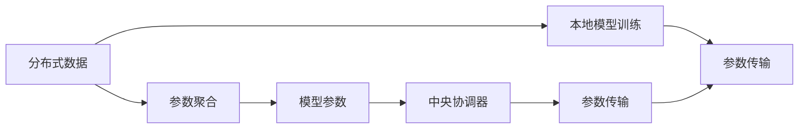

                 

# 联邦学习：隐私保护下的分布式机器学习

## 1. 背景介绍

### 1.1 问题由来

在当今数字化时代，数据已经成为一种宝贵的资产。然而，随着数据量的大幅增长，数据隐私保护变得越来越重要。一方面，大量数据存储在分布式网络中，跨组织共享和协作的难度增加；另一方面，数据隐私泄露的风险不断提升。如何在保护数据隐私的前提下，充分利用分布式计算资源，优化机器学习模型的训练效果，成为当前数据密集型应用亟需解决的问题。

针对上述问题，联邦学习（Federated Learning, FL）应运而生。联邦学习是一种新兴的分布式机器学习方法，可以在不共享原始数据的情况下，通过各参与方共享模型参数更新信息，实现模型训练。该方法能够有效保护数据隐私，同时充分利用分布式计算资源，被广泛应用于智能手机、智慧医疗、金融风控等领域。

### 1.2 问题核心关键点

联邦学习的核心在于分布式环境下的模型训练过程，即在不共享原始数据的前提下，通过各参与方协同工作，实现模型的全局优化。其核心原理和步骤包括以下几点：

1. **分布式数据集**：数据存储在不同参与方的本地设备上，无法直接共享。
2. **本地模型更新**：各参与方在自己的数据集上训练模型，并得到本地更新参数。
3. **聚合更新参数**：各参与方将本地更新参数发送至中央协调器（Coordinator），中央协调器进行参数聚合，得到全局更新参数。
4. **参数传输**：中央协调器将全局更新参数分发给各参与方，用于下一次模型训练。
5. **重复迭代**：上述过程重复进行，直至模型收敛。

### 1.3 问题研究意义

联邦学习的提出，是为了解决数据隐私保护与分布式机器学习之间的矛盾。其研究意义主要体现在以下几个方面：

1. **隐私保护**：联邦学习通过本地训练和参数聚合的方式，避免了原始数据的共享和传输，从而有效保护数据隐私。
2. **分布式协同**：联邦学习能够充分利用分布式计算资源，提高模型训练效率，同时实现多方的协同工作。
3. **高效优化**：联邦学习通过多轮迭代的参数聚合，能够在各参与方之间分布优化，实现全局模型的最优解。
4. **可扩展性强**：联邦学习能够适应大规模分布式环境，支持海量数据的高效训练。

联邦学习的这些优点，使其在数据隐私保护、分布式计算等场景下具有重要的应用价值。随着技术不断成熟，联邦学习必将成为机器学习领域的一个重要分支，推动数据密集型应用的进一步发展。

## 2. 核心概念与联系

### 2.1 核心概念概述

联邦学习包括多个核心概念，这些概念共同构成了联邦学习的完整框架。以下是联邦学习的主要核心概念及其相互联系：

1. **分布式数据**：各参与方拥有的数据集分布在本地设备上，无法直接共享。
2. **本地模型训练**：在本地数据集上进行模型训练，得到本地模型参数。
3. **参数聚合**：将各参与方的本地模型参数进行聚合，得到全局模型参数。
4. **参数传输**：将全局模型参数发送回各参与方，进行下一轮训练。
5. **模型参数**：表示模型中的可训练参数，通过各参与方本地训练和参数聚合得到。
6. **中央协调器**：负责接收各参与方的本地更新参数，进行参数聚合和分发。

这些概念之间的关系可以通过以下Mermaid流程图进行展示：



## 3. 核心算法原理 & 具体操作步骤
### 3.1 算法原理概述

联邦学习的核心算法原理可以概括为：在分布式环境中，通过各参与方本地训练和参数聚合的方式，实现全局模型参数的优化。其基本流程如下：

1. **数据分布**：各参与方将本地数据集分割为训练集和验证集。
2. **本地训练**：各参与方在自己的训练集上训练模型，并得到本地更新参数。
3. **参数聚合**：各参与方将本地更新参数发送至中央协调器，中央协调器进行参数聚合，得到全局更新参数。
4. **参数传输**：中央协调器将全局更新参数分发给各参与方，用于下一次模型训练。
5. **重复迭代**：上述过程重复进行，直至模型收敛。

联邦学习的算法流程可以描述为以下伪代码：

```python
# 初始化模型参数
theta = initialize_theta()

# 初始化全局模型参数
global_theta = theta

# 迭代训练过程
for round in range(num_rounds):
    # 各参与方本地训练
    local_theta = train_model_local(round, global_theta)

    # 参数聚合
    global_theta = aggregate_local_updates(local_theta)

    # 参数传输
    send_global_theta()

    # 重复迭代
```

### 3.2 算法步骤详解

联邦学习的具体步骤如下：

1. **数据划分**：
   - 将数据集划分为训练集和验证集，训练集用于本地模型训练，验证集用于模型验证。
   - 各参与方的数据集分布在本地设备上，无法直接共享。

2. **本地训练**：
   - 各参与方在自己的本地数据集上进行模型训练，得到本地模型参数。
   - 本地模型训练可以使用任何常见的机器学习算法，如SGD、Adam等。

3. **参数聚合**：
   - 各参与方将自己的本地模型参数发送到中央协调器。
   - 中央协调器对各参与方的本地更新参数进行聚合，得到全局模型参数。
   - 参数聚合的方法包括联邦平均（FedAvg）、FedProx等。

4. **参数传输**：
   - 中央协调器将全局模型参数分发给各参与方。
   - 各参与方使用全局模型参数更新自己的模型参数。

5. **重复迭代**：
   - 重复上述过程，直至模型收敛。

### 3.3 算法优缺点

联邦学习具有以下优点：

1. **隐私保护**：通过本地训练和参数聚合的方式，联邦学习避免了原始数据的共享和传输，有效保护数据隐私。
2. **分布式协同**：联邦学习能够充分利用分布式计算资源，提高模型训练效率，同时实现多方的协同工作。
3. **高效优化**：联邦学习通过多轮迭代的参数聚合，能够在各参与方之间分布优化，实现全局模型的最优解。

联邦学习也存在以下缺点：

1. **通信开销大**：参数传输和聚合的过程需要大量通信开销，导致系统效率较低。
2. **收敛速度慢**：由于本地训练和参数聚合的交替进行，联邦学习可能需要更多迭代次数才能收敛。
3. **模型一致性问题**：各参与方的本地数据分布可能存在差异，导致模型参数不一致。

### 3.4 算法应用领域

联邦学习在以下领域具有广泛的应用前景：

1. **智慧医疗**：联邦学习可用于多方合作共享医疗数据，实现个性化医疗和精准治疗。
2. **金融风控**：联邦学习可用于多方协同进行信用评估和风险管理，保护客户隐私同时提高风控效果。
3. **物联网设备**：联邦学习可用于设备间的数据共享和协同优化，提升设备性能和能效。
4. **智能交通**：联邦学习可用于多方协同优化交通流量和路网规划，提升城市交通管理水平。
5. **社交媒体分析**：联邦学习可用于多方合作进行数据分析，保护用户隐私同时提供准确的用户行为分析。

## 4. 数学模型和公式 & 详细讲解 & 举例说明

### 4.1 数学模型构建

联邦学习的数学模型可以通过分布式优化算法来描述。设模型参数为 $\theta$，各参与方的本地数据集为 $D_i$，其中 $i$ 表示参与方的编号。各参与方本地训练得到的模型参数为 $\theta_i$，全局模型参数为 $\theta^*$。联邦学习的目标是通过各参与方的本地训练和参数聚合，最小化全局损失函数 $\mathcal{L}(\theta^*)$。

### 4.2 公式推导过程

以联邦平均（FedAvg）算法为例，其目标是最小化全局损失函数：

$$
\min_{\theta} \mathcal{L}(\theta) = \mathbb{E}_{x \sim D} [f(x; \theta)] 
$$

其中 $f(x; \theta)$ 表示模型在数据 $x$ 上的损失函数。联邦平均算法的更新公式为：

$$
\theta_{t+1} = \frac{1}{n} \sum_{i=1}^n \theta_i
$$

其中 $n$ 为参与方数量。在每次迭代中，各参与方将自己的模型参数 $\theta_i$ 发送至中央协调器，中央协调器进行参数聚合，得到全局模型参数 $\theta_{t+1}$，再将其分发给各参与方，用于下一次迭代。

### 4.3 案例分析与讲解

假设一个联邦学习系统中有三个参与方 $i=1,2,3$，每个参与方的数据集为 $D_1, D_2, D_3$。每个参与方使用联邦平均算法进行模型训练。假设每个数据点 $x$ 的损失函数为 $f(x; \theta)$，全局损失函数为 $\mathcal{L}(\theta)$。假设每个参与方本地训练得到的模型参数为 $\theta_i$，全局模型参数为 $\theta^*$。

联邦平均算法的具体步骤如下：

1. 每个参与方在自己的数据集上进行模型训练，得到本地模型参数 $\theta_i$。
2. 每个参与方将自己的模型参数 $\theta_i$ 发送至中央协调器。
3. 中央协调器对各参与方的本地更新参数进行聚合，得到全局模型参数 $\theta^*$。
4. 中央协调器将全局模型参数 $\theta^*$ 分发给各参与方，用于下一次模型训练。

假设第一轮迭代结束后，全局模型参数 $\theta^*$ 和每个参与方的模型参数 $\theta_i$ 分别为：

$$
\theta^* = \frac{1}{3} (\theta_1 + \theta_2 + \theta_3)
$$

$$
\theta_1 = \theta_0 - \eta \nabla_{\theta_0} f(x_1; \theta_0)
$$

$$
\theta_2 = \theta_0 - \eta \nabla_{\theta_0} f(x_2; \theta_0)
$$

$$
\theta_3 = \theta_0 - \eta \nabla_{\theta_0} f(x_3; \theta_0)
$$

其中 $\eta$ 为学习率，$x_1, x_2, x_3$ 为各参与方数据集中的样本点。

在第二轮迭代中，各参与方将新的全局模型参数 $\theta^*$ 作为初始化参数，进行本地训练，得到新的本地模型参数 $\theta_i$。中央协调器将新的全局模型参数 $\theta^*$ 分发给各参与方，用于下一次迭代。

## 5. 项目实践：代码实例和详细解释说明
### 5.1 开发环境搭建

在进行联邦学习项目实践前，我们需要准备好开发环境。以下是使用Python进行FedAdam框架开发的环境配置流程：

1. 安装Anaconda：从官网下载并安装Anaconda，用于创建独立的Python环境。

2. 创建并激活虚拟环境：
```bash
conda create -n federated_learning python=3.8 
conda activate federated_learning
```

3. 安装FedAdam库：
```bash
pip install fedadam
```

4. 安装各类工具包：
```bash
pip install numpy pandas scikit-learn torch torchvision transformers
```

完成上述步骤后，即可在`federated_learning`环境中开始联邦学习实践。

### 5.2 源代码详细实现

下面我们以联邦平均（FedAvg）算法为例，给出使用FedAdam框架进行联邦学习的PyTorch代码实现。

```python
import torch
import torch.nn as nn
from fedadam import FedAdam

# 定义模型
class FedModel(nn.Module):
    def __init__(self):
        super(FedModel, self).__init__()
        self.fc = nn.Linear(784, 10)

    def forward(self, x):
        x = x.view(-1, 784)
        x = self.fc(x)
        return x

# 定义本地训练函数
def train_local_model(local_model, local_data_loader):
    model = local_model.to(device)
    optimizer = FedAdam(model.parameters(), lr=0.001)
    for epoch in range(10):
        for data, label in local_data_loader:
            data, label = data.to(device), label.to(device)
            optimizer.zero_grad()
            output = model(data)
            loss = nn.CrossEntropyLoss()(output, label)
            loss.backward()
            optimizer.step()
    return model.state_dict()

# 定义联邦平均函数
def fed_avg(model_dicts, num_aggregate):
    for param in model_dicts[0].values():
        if param in model_dicts[1]:
            for i in range(1, num_aggregate):
                param.copy_(model_dicts[i][param])
        else:
            param.zero_()
    return model_dicts[0]

# 定义测试函数
def test_global_model(global_model, test_data_loader):
    model = global_model.to(device)
    with torch.no_grad():
        correct = 0
        total = 0
        for data, label in test_data_loader:
            data, label = data.to(device), label.to(device)
            output = model(data)
            _, predicted = torch.max(output.data, 1)
            total += label.size(0)
            correct += (predicted == label).sum().item()
    accuracy = correct / total * 100
    print(f"Global Model Accuracy: {accuracy:.2f}%")

# 初始化模型和数据
device = torch.device('cuda' if torch.cuda.is_available() else 'cpu')
local_models = [FedModel().to(device) for _ in range(3)]
local_data_loaders = [torch.utils.data.DataLoader(torchvision.datasets.MNIST(i, train=True, download=True, transform=torchvision.transforms.ToTensor(), target_transform=None) for i in range(3)]
local_model_states = [train_local_model(model, local_data_loader) for model, local_data_loader in zip(local_models, local_data_loaders)]
global_model = FedModel().to(device)
test_data_loader = torch.utils.data.DataLoader(torchvision.datasets.MNIST(0, train=False, download=True, transform=torchvision.transforms.ToTensor(), target_transform=None))

# 迭代联邦平均
for i in range(5):
    local_model_states = [train_local_model(model, local_data_loader) for model, local_data_loader in zip(local_models, local_data_loaders)]
    global_model.load_state_dict(fed_avg(local_model_states, num_aggregate=3))
    test_global_model(global_model, test_data_loader)
```

### 5.3 代码解读与分析

让我们再详细解读一下关键代码的实现细节：

**FedModel类**：
- 定义一个简单的全连接神经网络模型，用于联邦学习实验。

**train_local_model函数**：
- 在本地数据集上训练模型，并返回本地模型参数。
- 定义模型和优化器，对数据进行前向传播和反向传播，更新模型参数。

**fed_avg函数**：
- 对各参与方的本地模型参数进行聚合，得到全局模型参数。
- 将全局模型参数分发给各参与方。

**test_global_model函数**：
- 在测试数据集上测试全局模型，输出全局模型精度。

**联邦学习流程**：
- 初始化多个本地模型，并在本地数据集上进行本地训练，得到本地模型参数。
- 对各参与方的本地模型参数进行聚合，得到全局模型参数。
- 在测试数据集上测试全局模型，输出全局模型精度。

## 6. 实际应用场景
### 6.1 智慧医疗

联邦学习在智慧医疗领域具有广泛的应用前景。医疗数据具有高度敏感性，需要在保护患者隐私的前提下进行数据分析和模型训练。通过联邦学习，各医疗机构可以在本地共享病历数据，训练统一的诊断模型，提升诊断效果，实现个性化治疗。

具体而言，各医疗机构将本地病历数据存储在本地设备上，通过联邦学习进行模型训练和参数聚合，实现全局模型的优化。模型可以用于疾病诊断、症状预测、药物研发等领域，显著提升医疗服务的质量和效率。

### 6.2 金融风控

金融风控需要处理大量用户数据，涉及用户的信用记录、交易记录等敏感信息。联邦学习可以在保护用户隐私的前提下，进行风险评估和信用管理。

具体而言，金融机构可以联合银行业务数据，通过联邦学习训练统一的信用评估模型。模型可以用于用户信用评估、风险预警、欺诈检测等领域，提升风险管理的精度和效率，保障金融稳定。

### 6.3 智能交通

智能交通系统需要处理大量的交通数据，涉及车辆、行人、路况等各方面的信息。通过联邦学习，交通管理中心可以在保护数据隐私的前提下，进行交通流量分析和路网优化。

具体而言，交通管理中心可以联合各城市交通数据，通过联邦学习训练交通流量预测模型。模型可以用于交通流量预测、路网优化、智能导航等领域，提升城市交通管理水平，保障交通安全。

## 7. 工具和资源推荐
### 7.1 学习资源推荐

为了帮助开发者系统掌握联邦学习的理论基础和实践技巧，这里推荐一些优质的学习资源：

1. 《Federated Learning: Concepts and Applications》书籍：由联邦学习领域的权威专家撰写，全面介绍了联邦学习的概念、算法和应用场景。

2. 《 federated-learning》课程：由深度学习领域知名专家开设的联邦学习课程，涵盖了联邦学习的原理、算法和实际应用。

3. 《 federated-learning-and-hf-federated》博客：一个关于联邦学习和HuggingFace联邦学习框架的博客，详细介绍了联邦学习的理论基础和实践技巧。

4. Arxiv论文库：收集了大量关于联邦学习的最新研究成果，是获取联邦学习前沿资讯的好去处。

通过这些学习资源，相信你一定能够快速掌握联邦学习的精髓，并用于解决实际的机器学习问题。
### 7.2 开发工具推荐

高效的开发离不开优秀的工具支持。以下是几款用于联邦学习开发的常用工具：

1. PyTorch：基于Python的开源深度学习框架，灵活动态的计算图，适合快速迭代研究。大多数联邦学习框架都基于PyTorch实现。

2. TensorFlow：由Google主导开发的开源深度学习框架，生产部署方便，适合大规模工程应用。同样有丰富的联邦学习资源。

3. FedAdam：由Google开发的联邦学习框架，支持多种优化算法，适合联邦学习研究和使用。

4. Weights & Biases：模型训练的实验跟踪工具，可以记录和可视化模型训练过程中的各项指标，方便对比和调优。

5. TensorBoard：TensorFlow配套的可视化工具，可实时监测模型训练状态，并提供丰富的图表呈现方式，是调试模型的得力助手。

合理利用这些工具，可以显著提升联邦学习任务的开发效率，加快创新迭代的步伐。

### 7.3 相关论文推荐

联邦学习的研究源于学界的持续研究。以下是几篇奠基性的相关论文，推荐阅读：

1. Communication-Efficient Learning of Deep Neural Networks from Decentralized Data (Alistarh et al., 2017)：提出FedAvg算法，为联邦学习提供了基本的框架。

2. Federated Learning: Concept and Applications (Mcmahan et al., 2017)：详细介绍了联邦学习的概念、算法和应用场景，奠定了联邦学习的基础。

3. Model-Agnostic Federated Learning for Knowledge Graph Embedding (Wang et al., 2021)：探讨了联邦学习在知识图谱嵌入中的应用，展示了联邦学习的多样性。

4. Federated Learning with Model-Aware Aggregation (Li et al., 2021)：提出了模型感知聚合方法，提高了联邦学习的模型一致性。

这些论文代表了大规模联邦学习的研究进展，通过学习这些前沿成果，可以帮助研究者把握学科前进方向，激发更多的创新灵感。

## 8. 总结：未来发展趋势与挑战
### 8.1 总结

本文对联邦学习的核心概念、算法原理和操作步骤进行了全面系统的介绍。首先阐述了联邦学习的研究背景和意义，明确了其在数据隐私保护和分布式机器学习之间的独特价值。其次，从原理到实践，详细讲解了联邦学习的数学模型和关键步骤，给出了联邦学习任务开发的完整代码实例。同时，本文还探讨了联邦学习在智慧医疗、金融风控、智能交通等领域的实际应用，展示了联邦学习技术的广泛前景。此外，本文精选了联邦学习的各类学习资源，力求为读者提供全方位的技术指引。

通过本文的系统梳理，可以看到，联邦学习正在成为机器学习领域的一个重要分支，极大地拓展了数据密集型应用的边界，催生了更多的落地场景。未来，伴随联邦学习方法的不断成熟，其在数据隐私保护、分布式计算等场景下将具有重要的应用价值。

### 8.2 未来发展趋势

展望未来，联邦学习将呈现以下几个发展趋势：

1. **模型一致性增强**：联邦学习面临模型参数不一致的问题，未来将通过引入模型感知聚合、对抗训练等方法，提高模型一致性。
2. **计算效率提升**：联邦学习中的参数传输和聚合过程，导致系统效率较低。未来将通过优化通信协议、模型压缩等技术，提高联邦学习计算效率。
3. **多领域协同**：联邦学习正在向多领域扩展，未来将进一步应用于工业制造、智能家居、社交媒体等领域。
4. **隐私保护增强**：随着联邦学习技术的发展，隐私保护手段将进一步丰富，如差分隐私、多方安全计算等，保护数据隐私的同时提升模型性能。
5. **联邦学习平台化**：联邦学习将逐渐从研究转向实际应用，未来将出现更多联邦学习平台，支持大规模联邦学习任务的开发和部署。

以上趋势凸显了联邦学习的广阔前景。这些方向的探索发展，必将进一步提升机器学习系统的性能和应用范围，为数据密集型应用带来新的突破。

### 8.3 面临的挑战

尽管联邦学习已经取得了诸多进展，但在迈向更加智能化、普适化应用的过程中，仍面临诸多挑战：

1. **模型一致性问题**：各参与方的本地数据分布可能存在差异，导致模型参数不一致。如何在不破坏隐私的前提下，提高模型一致性，是联邦学习的重要研究方向。
2. **计算开销大**：参数传输和聚合的过程需要大量通信开销，导致系统效率较低。如何优化通信协议和聚合算法，减少计算开销，是联邦学习的关键问题。
3. **隐私保护难度大**：联邦学习需要在保护数据隐私的前提下，进行模型训练和参数聚合。如何在保护隐私的同时，确保数据的安全性，是联邦学习的核心挑战。
4. **数据分布不均**：各参与方的数据分布可能存在较大差异，导致模型训练的公平性问题。如何消除数据分布不均的影响，是联邦学习需要解决的重要问题。
5. **系统可扩展性差**：联邦学习系统在大规模分布式环境下的可扩展性较差，导致系统性能不稳定。如何优化联邦学习算法和架构，提升系统的可扩展性，是联邦学习的关键挑战。

### 8.4 研究展望

面对联邦学习面临的这些挑战，未来的研究需要在以下几个方面寻求新的突破：

1. **模型一致性优化**：通过引入模型感知聚合、对抗训练等方法，提高模型一致性，减少参数差异。

2. **通信协议优化**：优化联邦学习中的参数传输和聚合协议，减少通信开销，提升联邦学习的计算效率。

3. **隐私保护强化**：结合差分隐私、多方安全计算等技术，增强数据隐私保护，确保数据安全性。

4. **数据分布均衡**：通过数据增强、迁移学习等方法，平衡各参与方的数据分布，提升模型训练的公平性。

5. **系统可扩展性增强**：优化联邦学习算法和架构，提高系统的可扩展性，支持大规模分布式环境下的联邦学习。

这些研究方向将推动联邦学习技术不断成熟，为数据密集型应用的落地提供更多可能性。面向未来，联邦学习将与其他人工智能技术进行更深入的融合，共同推动人工智能技术的发展。

## 9. 附录：常见问题与解答

**Q1：联邦学习与分布式机器学习有何区别？**

A: 联邦学习与分布式机器学习（Distributed Machine Learning, DML）相似，都是分布式环境下的机器学习任务。但两者的区别在于，DML是将数据分布式存储在多个计算节点上，然后通过节点间通信进行模型训练和参数更新。而联邦学习是通过各参与方本地训练和参数聚合的方式，在不共享原始数据的情况下，实现模型训练。因此，联邦学习更注重数据隐私保护，适用于对数据隐私有较高要求的应用场景。

**Q2：联邦学习在通信开销大的场景下是否适用？**

A: 联邦学习在通信开销大的场景下仍然适用，但需要对通信协议和参数聚合方法进行优化。具体措施包括：
1. 采用更高效的通信协议，如gRPC、HTTPS等，减少通信延迟。
2. 采用模型压缩技术，减少参数传输量和传输时间。
3. 引入差分隐私、多方安全计算等技术，减少通信开销的同时保护数据隐私。

**Q3：联邦学习在哪些场景下具有优势？**

A: 联邦学习在以下场景下具有优势：
1. 数据隐私保护要求高的场景，如医疗、金融、政府数据等领域。
2. 数据分布不均的场景，如多方合作共享数据，提升模型训练的公平性。
3. 分布式计算资源丰富的场景，如智能家居、智能交通等领域。

**Q4：联邦学习在实际应用中需要考虑哪些因素？**

A: 联邦学习在实际应用中需要考虑以下因素：
1. 数据隐私保护：通过本地训练和参数聚合的方式，确保数据隐私。
2. 系统效率：优化通信协议和参数聚合方法，减少计算开销。
3. 模型一致性：通过模型感知聚合等方法，提高模型一致性。
4. 数据分布均衡：通过数据增强、迁移学习等方法，平衡各参与方的数据分布。
5. 系统可扩展性：优化联邦学习算法和架构，支持大规模分布式环境下的联邦学习。

通过综合考虑以上因素，可以充分发挥联邦学习的优势，提升数据密集型应用的性能和效率。

**Q5：联邦学习与分布式深度学习框架有何区别？**

A: 联邦学习与分布式深度学习框架（如PyTorch、TensorFlow等）的区别在于，分布式深度学习框架是基于中心化的模型训练，所有数据存储在中央服务器上，各计算节点通过通信网络访问中央服务器，进行模型训练和参数更新。而联邦学习是分布式环境下的本地训练和参数聚合，各参与方在不共享原始数据的情况下，通过本地训练和参数聚合的方式，实现全局模型的优化。因此，联邦学习更注重数据隐私保护，适用于对数据隐私有较高要求的应用场景。

以上问题与解答，希望能为你提供更多关于联邦学习的理解。

