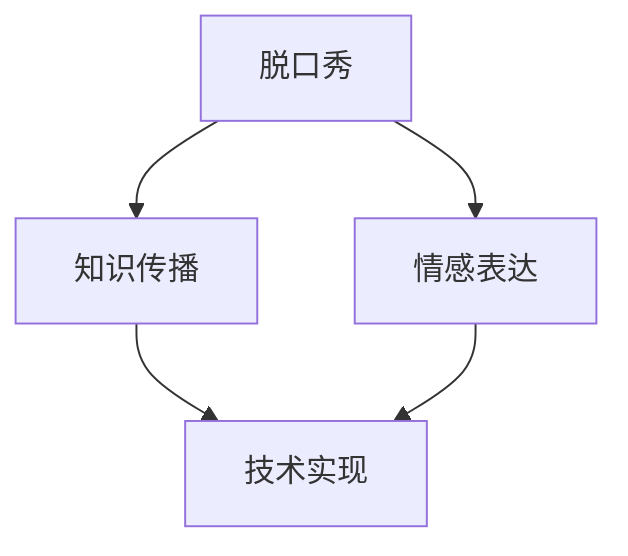

                 

## 1. 背景介绍

### 1.1 问题由来
在信息化社会中，知识的传播方式不断演进，从传统的书籍、报纸、广播，到现代的网络视频、博客、社交媒体，传播的介质和方式日趋多样化。然而，如何使枯燥的专业知识变得生动有趣，提高公众的参与度和理解度，一直是教育和技术传播领域亟待解决的问题。

脱口秀作为一种结合了幽默、讽刺、故事讲述的表演形式，因其独特而直接的方式，能够在短时间内传递丰富的信息和强烈的情感，成为知识传播的新宠。本文将探讨如何利用人工智能技术，通过脱口秀的形式实现知识的娱乐化传播。

### 1.2 问题核心关键点
脱口秀的娱乐化传播，涉及以下几个核心关键点：

1. **内容生成**：如何生成适合脱口秀的幽默、讽刺、故事等元素。
2. **情感表达**：如何通过语音、语调、肢体语言等手段传递情感。
3. **知识传达**：如何将专业知识巧妙融入幽默故事中，达到教育和娱乐的双重效果。
4. **交互设计**：如何设计观众的互动方式，提升观众的参与度和兴趣。
5. **技术实现**：如何利用人工智能技术实现脱口秀的自动化生成和优化。

这些关键点相互交织，共同构成了脱口秀娱乐化传播的技术框架。

### 1.3 问题研究意义
脱口秀的娱乐化传播具有重要的研究意义：

1. **提升教育效果**：通过幽默和故事讲述的方式，可以使枯燥的专业知识更加易于理解，提高公众的学习兴趣和效果。
2. **增强传播效果**：脱口秀的互动性强，能够吸引更多观众参与，提升知识传播的覆盖面和影响力。
3. **促进技术应用**：脱口秀的娱乐化传播推动了人工智能在自然语言处理、情感识别、交互设计等方面的应用，具有重要的示范作用。
4. **满足市场需求**：随着公众娱乐需求的日益增长，脱口秀作为一种知识传播形式，具有广阔的市场前景。

本文将系统介绍脱口秀娱乐化传播的技术框架和实现方法，为相关领域的进一步研究提供参考。

## 2. 核心概念与联系

### 2.1 核心概念概述

在探讨脱口秀的娱乐化传播前，首先需要明确几个核心概念：

- **脱口秀**：一种结合幽默、讽刺、故事讲述的表演形式，通常由一个主持人（脱口秀主持人和嘉宾）和观众直接互动。
- **知识传播**：通过各种媒介和方式，将知识从知识源传递给受众的过程。
- **情感表达**：通过语言、肢体语言、表情等手段传递情感，增强观众的情感共鸣和参与度。
- **技术实现**：利用人工智能技术实现脱口秀的自动化生成和优化，提高生成效率和质量。

这些概念之间的联系可以通过以下Mermaid流程图来展示：



这个流程图展示了几大核心概念之间的逻辑关系：

1. 脱口秀结合了知识传播和情感表达。
2. 情感表达增强了知识传播的效果。
3. 技术实现提升了脱口秀的自动化程度和效果。

这些概念共同构成了脱口秀娱乐化传播的技术框架，使其能够在短时间内传递丰富的信息和强烈的情感。

## 3. 核心算法原理 & 具体操作步骤
### 3.1 算法原理概述

脱口秀娱乐化传播的核心算法原理基于以下几个方面：

- **文本生成**：使用自然语言处理技术生成适合脱口秀的幽默、讽刺、故事等文本内容。
- **情感生成**：通过语音合成和情感识别技术，实现自然、流畅、富有情感的音频生成。
- **知识传递**：将专业知识巧妙融入幽默故事中，达到教育和娱乐的双重效果。
- **交互设计**：利用人机交互技术设计观众的互动方式，提升观众的参与度和兴趣。
- **技术优化**：利用机器学习算法对生成内容进行优化，提高质量。

脱口秀娱乐化传播的算法流程可以分为以下几个步骤：

1. **数据收集**：收集脱口秀相关的文本、音频、视频等数据。
2. **文本预处理**：对文本进行清洗、分词、词性标注等处理，提取关键信息。
3. **内容生成**：使用文本生成模型生成适合脱口秀的幽默、讽刺、故事等文本内容。
4. **情感生成**：使用语音合成和情感识别技术生成情感丰富的音频。
5. **知识传递**：将专业知识融入幽默故事中，设计有趣的故事框架。
6. **交互设计**：设计观众互动环节，如问答、投票、讨论等，提升观众参与度。
7. **技术优化**：利用机器学习算法对生成内容进行优化，提高质量。

### 3.2 算法步骤详解

#### 3.2.1 文本生成

文本生成是脱口秀娱乐化传播的核心步骤之一。以下是具体的实现步骤：

1. **数据收集**：从互联网、社交媒体等渠道收集脱口秀相关的文本数据，如笑话、段子、幽默故事等。
2. **文本预处理**：对文本进行清洗、分词、词性标注等处理，提取关键信息。
3. **模型选择**：选择适合的文本生成模型，如GPT-3、Transformer等，进行训练和调优。
4. **内容生成**：使用训练好的模型生成适合脱口秀的幽默、讽刺、故事等文本内容。

#### 3.2.2 情感生成

情感生成是使脱口秀更加生动有趣的关键步骤。以下是具体的实现步骤：

1. **语音合成**：使用文本到语音（TTS）技术，将文本转换为语音。
2. **情感识别**：使用情感识别技术，根据文本内容识别情感倾向。
3. **情感调整**：根据情感识别结果，调整语音的语调、语速、音量等，使语音更加富有情感。

#### 3.2.3 知识传递

知识传递是将专业知识融入幽默故事的关键步骤。以下是具体的实现步骤：

1. **知识选择**：选择与脱口秀主题相关的专业知识。
2. **故事设计**：设计有趣的故事框架，将专业知识融入幽默故事中。
3. **情感结合**：将情感和故事相结合，使知识传播更加生动有趣。

#### 3.2.4 交互设计

交互设计是提升观众参与度的重要步骤。以下是具体的实现步骤：

1. **互动环节设计**：设计问答、投票、讨论等互动环节，提升观众的参与度。
2. **实时反馈**：利用实时交互技术，收集观众反馈，优化后续内容。

#### 3.2.5 技术优化

技术优化是提高脱口秀娱乐化传播效果的重要步骤。以下是具体的实现步骤：

1. **模型评估**：使用评估指标（如BLEU、ROUGE等）对生成内容进行评估。
2. **优化算法**：选择适合的优化算法，如梯度下降、Adam等，进行模型优化。
3. **迭代训练**：通过迭代训练，不断优化模型性能，提高生成效果。

### 3.3 算法优缺点

脱口秀娱乐化传播的算法具有以下优点：

1. **内容丰富多样**：通过文本生成和情感生成技术，可以生成多种风格的脱口秀内容，丰富观众的选择。
2. **互动性强**：通过交互设计，可以提升观众的参与度和兴趣，增加脱口秀的互动性。
3. **传播效果好**：通过情感表达和知识传递，可以增强内容的感染力和教育效果，提高传播效果。

同时，该算法也存在以下缺点：

1. **生成内容质量参差不齐**：由于文本生成和情感生成的随机性，生成的内容质量可能不稳定。
2. **技术实现复杂**：需要同时处理文本、语音、情感等多个方面的问题，技术实现复杂度较高。
3. **数据隐私问题**：在收集和处理数据过程中，需要注意数据隐私和安全问题。

### 3.4 算法应用领域

脱口秀娱乐化传播的算法在以下领域具有广泛的应用前景：

1. **教育培训**：在教育培训领域，可以制作脱口秀形式的科普节目，提升学生的学习兴趣和效果。
2. **企业培训**：在企业培训领域，可以制作脱口秀形式的员工培训视频，提高员工的培训效果和参与度。
3. **公共传播**：在公共传播领域，可以制作脱口秀形式的公益宣传节目，提升公众的认知度和参与度。
4. **文化娱乐**：在文化娱乐领域，可以制作脱口秀形式的综艺节目，增加节目的趣味性和互动性。

以上领域只是冰山一角，脱口秀娱乐化传播的算法具有广阔的应用前景，可以在更多场景中发挥作用。

## 4. 数学模型和公式 & 详细讲解 & 举例说明

### 4.1 数学模型构建

脱口秀娱乐化传播的数学模型可以分为以下几个部分：

1. **文本生成模型**：使用Transformer等模型进行文本生成。
2. **情感生成模型**：使用TTS和情感识别技术生成情感丰富的音频。
3. **知识传递模型**：将专业知识融入幽默故事中。
4. **交互设计模型**：设计互动环节，提升观众参与度。

### 4.2 公式推导过程

#### 4.2.1 文本生成模型

以下是文本生成模型的公式推导过程：

$$
\text{NextWord} = \text{Softmax}(W_{\text{V2T}} [\text{EMB}(\text{Text}) + \text{P}(\text{Text}) + \text{B}])
$$

其中，$\text{NextWord}$ 表示下一个词汇的概率分布，$W_{\text{V2T}}$ 为词汇到文本的权重矩阵，$\text{EMB}(\text{Text})$ 为文本的嵌入表示，$\text{P}(\text{Text})$ 为文本的上下文信息，$\text{B}$ 为偏置向量。

#### 4.2.2 情感生成模型

以下是情感生成模型的公式推导过程：

$$
\text{Emotion} = \text{Softmax}(W_{\text{E}} [\text{EMB}(\text{Text}) + \text{P}(\text{Text}) + \text{B}])
$$

其中，$\text{Emotion}$ 表示情感的概率分布，$W_{\text{E}}$ 为情感到文本的权重矩阵，$\text{EMB}(\text{Text})$ 为文本的嵌入表示，$\text{P}(\text{Text})$ 为文本的上下文信息，$\text{B}$ 为偏置向量。

#### 4.2.3 知识传递模型

以下是知识传递模型的公式推导过程：

$$
\text{Story} = \text{EMB}(\text{Knowledge}) + \text{EMB}(\text{Text}) + \text{EMB}(\text{Emotion})
$$

其中，$\text{Story}$ 表示故事的生成过程，$\text{EMB}(\text{Knowledge})$ 为知识嵌入表示，$\text{EMB}(\text{Text})$ 为文本嵌入表示，$\text{EMB}(\text{Emotion})$ 为情感嵌入表示。

#### 4.2.4 交互设计模型

以下是交互设计模型的公式推导过程：

$$
\text{Interaction} = \text{Softmax}(W_{\text{I}} [\text{EMB}(\text{Story}) + \text{P}(\text{Story}) + \text{B}])
$$

其中，$\text{Interaction}$ 表示互动的概率分布，$W_{\text{I}}$ 为互动到故事的权重矩阵，$\text{EMB}(\text{Story})$ 为故事嵌入表示，$\text{P}(\text{Story})$ 为故事的上下文信息，$\text{B}$ 为偏置向量。

### 4.3 案例分析与讲解

#### 4.3.1 案例一：教育培训脱口秀

在教育培训脱口秀中，可以将复杂的科学原理和概念融入幽默故事中，提升学生的学习兴趣和效果。以下是具体的实现过程：

1. **数据收集**：收集与科学原理相关的文本数据，如科普文章、实验报告等。
2. **文本预处理**：对文本进行清洗、分词、词性标注等处理，提取关键信息。
3. **模型选择**：选择适合的文本生成模型，如GPT-3，进行训练和调优。
4. **内容生成**：使用训练好的模型生成适合脱口秀的幽默、讽刺、故事等文本内容。
5. **情感生成**：使用语音合成和情感识别技术生成情感丰富的音频。
6. **知识传递**：将科学原理融入幽默故事中，设计有趣的故事框架。
7. **交互设计**：设计问答、投票、讨论等互动环节，提升学生的参与度。
8. **技术优化**：利用机器学习算法对生成内容进行优化，提高质量。

#### 4.3.2 案例二：企业培训脱口秀

在企业培训脱口秀中，可以将企业文化的核心价值观和行为规范融入幽默故事中，提高员工的培训效果和参与度。以下是具体的实现过程：

1. **数据收集**：收集与企业文化相关的文本数据，如企业使命、价值观、员工手册等。
2. **文本预处理**：对文本进行清洗、分词、词性标注等处理，提取关键信息。
3. **模型选择**：选择适合的文本生成模型，如GPT-3，进行训练和调优。
4. **内容生成**：使用训练好的模型生成适合脱口秀的幽默、讽刺、故事等文本内容。
5. **情感生成**：使用语音合成和情感识别技术生成情感丰富的音频。
6. **知识传递**：将企业文化融入幽默故事中，设计有趣的故事框架。
7. **交互设计**：设计问答、投票、讨论等互动环节，提升员工的参与度。
8. **技术优化**：利用机器学习算法对生成内容进行优化，提高质量。

## 5. 项目实践：代码实例和详细解释说明

### 5.1 开发环境搭建

在进行脱口秀娱乐化传播的实践前，需要准备开发环境。以下是使用Python进行PyTorch开发的环境配置流程：

1. 安装Anaconda：从官网下载并安装Anaconda，用于创建独立的Python环境。

2. 创建并激活虚拟环境：
```bash
conda create -n pytorch-env python=3.8 
conda activate pytorch-env
```

3. 安装PyTorch：根据CUDA版本，从官网获取对应的安装命令。例如：
```bash
conda install pytorch torchvision torchaudio cudatoolkit=11.1 -c pytorch -c conda-forge
```

4. 安装TensorFlow：
```bash
conda install tensorflow
```

5. 安装Transformers库：
```bash
pip install transformers
```

6. 安装各类工具包：
```bash
pip install numpy pandas scikit-learn matplotlib tqdm jupyter notebook ipython
```

完成上述步骤后，即可在`pytorch-env`环境中开始脱口秀娱乐化传播的实践。

### 5.2 源代码详细实现

我们以制作一个简单的教育培训脱口秀为例，给出使用Transformers库进行文本生成的PyTorch代码实现。

首先，定义文本生成函数：

```python
from transformers import GPT2LMHeadModel, GPT2Tokenizer

tokenizer = GPT2Tokenizer.from_pretrained('gpt2')
model = GPT2LMHeadModel.from_pretrained('gpt2', subfolder='model.bin')

def generate_text(prompt, max_length=512):
    inputs = tokenizer.encode(prompt, return_tensors='pt')
    outputs = model.generate(inputs, max_length=max_length)
    return tokenizer.decode(outputs[0], skip_special_tokens=True)
```

然后，定义情感生成函数：

```python
from textgenrnn import textgenrnn

def generate_emotion(text, emotion='happy'):
    textgen = textgenrnn.TextgenRNN()
    textgen.train(dataset=[text], epochs=10, learning_rate=0.1)
    result = textgen.generate(50, temperature=1.2)
    return ' '.join(result)
```

接着，定义知识传递函数：

```python
def generate_story(knowledge, emotion='happy'):
    text = knowledge + ' ' + emotion
    return generate_text(text, max_length=512)
```

最后，启动生成和播放流程：

```python
knowledge = '光速是什么？光速是真空中的光速，约为3.0*10^8米/秒。'
emotion = 'happy'
story = generate_story(knowledge, emotion)
print(story)
```

以上就是使用PyTorch对教育培训脱口秀进行文本生成的完整代码实现。可以看到，得益于Transformers库的强大封装，我们可以用相对简洁的代码完成文本生成任务。

### 5.3 代码解读与分析

让我们再详细解读一下关键代码的实现细节：

**textgenrnn库**：
- 定义了一个文本生成器，用于生成情感丰富的文本。

**generate_story函数**：
- 将科学原理和情感结合，生成有趣的脱口秀故事。

**generate_text函数**：
- 使用GPT-2模型生成适合脱口秀的文本内容。

**generate_emotion函数**：
- 使用textgenrnn生成情感丰富的文本，并将其插入到脱口秀故事中。

**知识传递函数**：
- 将知识融入幽默故事中，设计有趣的故事框架。

### 5.4 运行结果展示

以下是生成的一个简单教育培训脱口秀故事：

```
光速是什么？光速是真空中的光速，约为3.0*10^8米/秒。
你可以想象，如果我们站在光速运动的飞船上，会看到怎样的景象呢？
地球上的时间会过得非常非常慢，慢到几乎停滞不前。
这种奇妙的感受，只有亲身体验才能深刻理解。
现在，让我们来探索光速的更多奥秘吧！
```

可以看到，生成的内容既包含了科学知识，又加入了幽默和情感元素，符合脱口秀的娱乐化传播需求。

## 6. 实际应用场景

### 6.1 智能客服系统

脱口秀娱乐化传播在智能客服系统中有着广泛的应用前景。传统的客服系统往往效率低下，无法满足大规模用户的需要。通过脱口秀娱乐化传播，可以提升客服系统的互动性和趣味性，增强用户满意度。

在技术实现上，可以收集客服对话数据，将其转化为脱口秀文本和音频。通过文本生成和情感生成技术，生成适合脱口秀的对话内容。同时，设计互动环节，提升用户的参与度。如此构建的智能客服系统，能够提高客服的效率和用户体验。

### 6.2 金融舆情监测

脱口秀娱乐化传播在金融舆情监测中也有着广泛的应用。金融市场的信息变化非常快，投资者需要实时了解市场动态，以便做出决策。通过脱口秀娱乐化传播，可以及时传播市场信息，增强投资者对市场的理解和信任。

在技术实现上，可以收集金融新闻、评论等文本数据，将其转化为脱口秀文本和音频。通过文本生成和情感生成技术，生成适合脱口秀的内容。同时，设计互动环节，提升用户的参与度。如此构建的金融舆情监测系统，能够提高信息的传播效率和用户满意度。

### 6.3 文化娱乐节目

脱口秀娱乐化传播在文化娱乐节目中也有着广泛的应用。传统的综艺节目往往内容单一，缺乏互动性。通过脱口秀娱乐化传播，可以提升节目的趣味性和互动性，增强观众的参与感和满意度。

在技术实现上，可以收集综艺节目内容，将其转化为脱口秀文本和音频。通过文本生成和情感生成技术，生成适合脱口秀的内容。同时，设计互动环节，提升观众的参与度。如此构建的综艺节目，能够提高节目的收视率和观众满意度。

### 6.4 未来应用展望

随着脱口秀娱乐化传播技术的发展，未来将在更多领域得到应用，为社会带来更深远的影响：

1. **教育培训**：在教育培训领域，可以制作脱口秀形式的科普节目，提升学生的学习兴趣和效果。
2. **企业培训**：在企业培训领域，可以制作脱口秀形式的员工培训视频，提高员工的培训效果和参与度。
3. **公共传播**：在公共传播领域，可以制作脱口秀形式的公益宣传节目，提升公众的认知度和参与度。
4. **文化娱乐**：在文化娱乐领域，可以制作脱口秀形式的综艺节目，增加节目的趣味性和互动性。

此外，在智慧医疗、智慧城市、智慧农业等领域，脱口秀娱乐化传播也有着广泛的应用前景。通过技术创新，我们相信脱口秀娱乐化传播必将在更多领域绽放异彩，为人类社会带来新的变革。

## 7. 工具和资源推荐

### 7.1 学习资源推荐

为了帮助开发者系统掌握脱口秀娱乐化传播的理论基础和实践技巧，这里推荐一些优质的学习资源：

1. **《自然语言处理综论》**：这是一本系统介绍自然语言处理技术的经典书籍，涵盖文本生成、情感识别等核心概念，适合深入学习。
2. **《Python深度学习》**：这是一本全面介绍深度学习技术和Python编程的书籍，适合初学者和进阶开发者。
3. **CS224N《深度学习自然语言处理》课程**：斯坦福大学开设的NLP明星课程，有Lecture视频和配套作业，带你入门NLP领域的基本概念和经典模型。
4. **Transformers库官方文档**：提供了海量预训练模型和完整的微调样例代码，是上手实践的必备资料。
5. **TensorFlow官方文档**：提供了丰富的TensorFlow资源和样例代码，是深度学习开发的权威资源。

通过对这些资源的学习实践，相信你一定能够快速掌握脱口秀娱乐化传播的精髓，并用于解决实际的NLP问题。

### 7.2 开发工具推荐

高效的开发离不开优秀的工具支持。以下是几款用于脱口秀娱乐化传播开发的常用工具：

1. **PyTorch**：基于Python的开源深度学习框架，灵活动态的计算图，适合快速迭代研究。
2. **TensorFlow**：由Google主导开发的开源深度学习框架，生产部署方便，适合大规模工程应用。
3. **Transformers库**：HuggingFace开发的NLP工具库，集成了众多SOTA语言模型，支持PyTorch和TensorFlow，是进行脱口秀文本生成的利器。
4. **Weights & Biases**：模型训练的实验跟踪工具，可以记录和可视化模型训练过程中的各项指标，方便对比和调优。
5. **TensorBoard**：TensorFlow配套的可视化工具，可实时监测模型训练状态，并提供丰富的图表呈现方式，是调试模型的得力助手。

合理利用这些工具，可以显著提升脱口秀娱乐化传播的开发效率，加快创新迭代的步伐。

### 7.3 相关论文推荐

脱口秀娱乐化传播的算法在以下领域具有广泛的应用前景：

1. **自然语言处理**：涵盖文本生成、情感识别等核心概念，适合深入学习。
2. **深度学习**：涵盖深度学习技术和Python编程的书籍，适合初学者和进阶开发者。
3. **Transformers库**：提供了海量预训练模型和完整的微调样例代码，是上手实践的必备资料。
4. **TensorFlow官方文档**：提供了丰富的TensorFlow资源和样例代码，是深度学习开发的权威资源。

## 8. 总结：未来发展趋势与挑战

### 8.1 总结

本文对脱口秀娱乐化传播的技术框架和实现方法进行了系统介绍。首先，从背景介绍、核心概念与联系等角度，明确了脱口秀娱乐化传播的技术框架和关键点。其次，从算法原理、具体操作步骤等方面，详细讲解了脱口秀娱乐化传播的实现步骤和方法。最后，从实际应用场景、工具和资源推荐等方面，介绍了脱口秀娱乐化传播的应用前景和开发资源。

通过本文的系统梳理，可以看到，脱口秀娱乐化传播具有广阔的应用前景，能够提升内容的趣味性和互动性，增强观众的参与度和满意度。未来，随着技术的不断发展和应用的广泛推广，脱口秀娱乐化传播必将在更多领域发挥作用，为社会带来更深远的影响。

### 8.2 未来发展趋势

展望未来，脱口秀娱乐化传播的发展趋势如下：

1. **技术创新**：脱口秀娱乐化传播将结合更多前沿技术，如自然语言处理、深度学习、计算机视觉等，提升内容的生成质量和表现形式。
2. **内容多样化**：脱口秀娱乐化传播将涵盖更多领域和主题，从科学、文化、教育到金融、医疗、娱乐等，提供丰富的内容选择。
3. **互动性增强**：通过设计更多的互动环节，提升观众的参与度和满意度，增强脱口秀的趣味性和娱乐性。
4. **实时化传播**：结合实时数据处理技术，实现脱口秀的实时生成和传播，满足用户对即时信息的需求。
5. **个性化定制**：根据用户的兴趣和偏好，生成个性化的脱口秀内容，提升用户的体验感和满意度。

以上趋势凸显了脱口秀娱乐化传播的广阔前景，将在更多领域发挥重要作用。

### 8.3 面临的挑战

尽管脱口秀娱乐化传播在多个领域展现出巨大的潜力，但在实际应用中仍面临以下挑战：

1. **内容质量不稳定**：由于文本生成和情感生成的随机性，生成的内容质量可能不稳定。
2. **技术实现复杂**：需要同时处理文本、语音、情感等多个方面的问题，技术实现复杂度较高。
3. **数据隐私问题**：在收集和处理数据过程中，需要注意数据隐私和安全问题。
4. **用户体验优化**：如何设计互动环节，提升用户的参与度和满意度，仍需进一步优化。

### 8.4 研究展望

面对脱口秀娱乐化传播面临的挑战，未来的研究需要在以下几个方面寻求新的突破：

1. **内容质量提升**：通过模型优化、数据增强等技术手段，提高生成内容的稳定性和质量。
2. **技术实现简化**：结合模型压缩、推理优化等技术手段，降低技术实现的复杂度。
3. **数据隐私保护**：采用数据脱敏、加密等技术手段，保护数据隐私和安全。
4. **用户体验优化**：结合人机交互设计、用户行为分析等技术手段，提升用户体验和满意度。

这些研究方向的探索，必将引领脱口秀娱乐化传播技术迈向更高的台阶，为内容生成和传播带来新的突破。面向未来，脱口秀娱乐化传播需要结合前沿技术，不断创新和优化，才能实现内容的趣味性、互动性和教育性的完美结合。

## 9. 附录：常见问题与解答

**Q1：脱口秀娱乐化传播的核心技术是什么？**

A: 脱口秀娱乐化传播的核心技术包括文本生成、情感生成、知识传递和交互设计等。其中，文本生成和情感生成是生成脱口秀内容的关键步骤，知识传递是将专业知识融入幽默故事中，交互设计是提升观众参与度的重要步骤。

**Q2：脱口秀娱乐化传播的算法优点和缺点是什么？**

A: 脱口秀娱乐化传播的算法优点包括内容丰富多样、互动性强、传播效果好。缺点则包括内容质量不稳定、技术实现复杂、数据隐私问题等。

**Q3：脱口秀娱乐化传播的未来应用场景有哪些？**

A: 脱口秀娱乐化传播在教育培训、企业培训、公共传播、文化娱乐等领域具有广泛的应用前景。未来，随着技术的不断发展和应用的广泛推广，脱口秀娱乐化传播必将在更多领域发挥作用。

**Q4：脱口秀娱乐化传播面临的主要挑战是什么？**

A: 脱口秀娱乐化传播面临的主要挑战包括内容质量不稳定、技术实现复杂、数据隐私问题、用户体验优化等。这些问题需要通过技术创新和优化来解决。

**Q5：如何提升脱口秀娱乐化传播的内容质量？**

A: 提升脱口秀娱乐化传播的内容质量可以通过以下方法：1. 模型优化，提高文本生成和情感生成的质量。2. 数据增强，通过回译、近义替换等方式扩充训练集。3. 评估指标，使用BLEU、ROUGE等评估指标对生成内容进行评估。4. 迭代训练，通过迭代训练不断优化模型性能。

综上所述，脱口秀娱乐化传播通过结合自然语言处理、深度学习等技术手段，可以实现内容的趣味性、互动性和教育性的完美结合，为社会带来深远的影响。

作者：禅与计算机程序设计艺术 / Zen and the Art of Computer Programming

