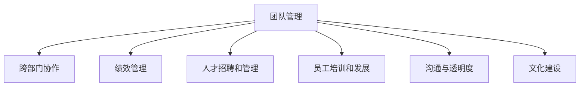

                 

# 自动化创业中的团队管理策略

> 关键词：自动化创业, 团队管理, 策略优化, 协同工作, 高效沟通

## 1. 背景介绍

在当今快速变化的商业环境中，自动化创业公司正以惊人的速度增长。这些公司利用先进的技术，如人工智能、大数据和自动化工具，来提供创新、高效和个性化的服务。然而，即使有了先进的技术，团队管理仍然是成功的关键。优秀的团队管理策略能够使团队更加高效、协作更加紧密，从而推动公司的成功。

### 1.1 问题由来

随着自动化技术的不断发展，许多创业公司已经开始采用各种自动化工具来提高运营效率和生产力。但是，仅仅依靠技术是不够的。自动化创业公司还需要有效地管理团队，以确保每个人都能够充分发挥自己的潜力，并保持团队的凝聚力和协作精神。

### 1.2 问题核心关键点

自动化创业公司的团队管理面临许多挑战，包括：
1. **跨部门协作**：如何打破部门间壁垒，实现信息共享和协作？
2. **绩效管理**：如何设定和衡量团队和个人的绩效指标？
3. **人才招聘和管理**：如何吸引和保留顶尖人才？
4. **员工培训和发展**：如何快速提升员工技能以适应自动化和新技术？
5. **沟通与透明度**：如何确保信息在团队内部清晰、及时地流通？
6. **文化建设**：如何建立一种鼓励创新、尊重多样性和包容性的企业文化？

## 2. 核心概念与联系

### 2.1 核心概念概述

为了更好地理解自动化创业中的团队管理策略，本节将介绍几个核心概念：

- **团队管理**：指在组织内部管理、协调和提升团队成员的合作能力和工作效率。
- **跨部门协作**：指不同部门之间的沟通、协调和合作，以实现共同目标。
- **绩效管理**：指设定、跟踪和评估团队和个人的绩效指标，以激励和改进团队表现。
- **人才招聘和管理**：指吸引、选拔、培训和保留人才，以确保团队的多样性和高效性。
- **员工培训和发展**：指提升员工技能和知识，以适应公司的技术发展和市场变化。
- **沟通与透明度**：指确保信息在团队内部的清晰、及时和透明地流通，以促进协作和决策。
- **文化建设**：指建立一种鼓励创新、尊重多样性和包容性的企业文化，以提升团队凝聚力和忠诚度。

这些核心概念之间的逻辑关系可以通过以下Mermaid流程图来展示：



这个流程图展示了一个自动化创业公司团队管理的关键环节，并表明这些环节相互影响，共同作用于团队的整体表现。

## 3. 核心算法原理 & 具体操作步骤

### 3.1 算法原理概述

自动化创业中的团队管理策略主要是基于以下理论和方法：

- **系统理论**：将团队视为一个系统，通过协调和优化各个组成部分来实现整体性能的提升。
- **管理学**：借鉴经典管理学理论和实践，如德鲁克的目标管理、泰勒的科学管理等。
- **数据科学**：利用数据分析和机器学习技术，优化团队管理和决策过程。

### 3.2 算法步骤详解

基于以上理论，自动化创业中的团队管理策略可以包括以下步骤：

1. **设定明确目标**：定义公司的长期和短期目标，确保团队成员对目标有清晰的理解和共识。
2. **建立跨部门协作机制**：通过项目管理工具、定期会议等方式，促进不同部门之间的沟通和协作。
3. **制定绩效管理流程**：设定关键绩效指标(KPIs)，定期评估团队和个人的表现，提供反馈和改进建议。
4. **实施人才招聘策略**：建立吸引和保留顶尖人才的机制，通过文化建设、职业发展路径等方式激励人才。
5. **推动员工培训和发展**：根据技术发展和市场需求，制定培训计划，提升员工技能。
6. **促进沟通与透明度**：使用协作工具、项目管理软件等，确保信息在团队内部的及时流通。
7. **营造企业文化**：通过定期的文化活动、员工手册等方式，建立一种鼓励创新、尊重多样性和包容性的企业文化。

### 3.3 算法优缺点

自动化创业中的团队管理策略具有以下优点：

1. **提升效率**：通过优化团队协作和管理流程，提高团队的效率和生产力。
2. **促进创新**：通过鼓励创新和多样化思维，激发团队的创造力。
3. **增强凝聚力**：通过建立正面的企业文化，增强团队的凝聚力和忠诚度。
4. **适应变化**：通过灵活的绩效管理和培训机制，使团队能够快速适应技术变化和市场变化。

同时，该策略也存在一些局限性：

1. **执行难度高**：实施全面的团队管理策略需要时间和资源投入。
2. **依赖团队成员**：管理策略的成功高度依赖于团队成员的积极参与和配合。
3. **文化差异**：不同文化背景的员工可能需要不同的管理策略。

### 3.4 算法应用领域

基于团队管理策略，自动化创业公司在各个领域都取得了显著成效，包括：

- **产品开发**：通过跨部门协作和明确的目标设定，推动产品快速迭代和市场响应。
- **客户服务**：通过员工培训和发展，提升客户服务质量，增强客户满意度。
- **市场营销**：通过数据驱动的绩效管理和沟通策略，优化营销活动，提高ROI。
- **运营管理**：通过流程优化和透明度提升，提高运营效率，降低成本。

## 4. 数学模型和公式 & 详细讲解

### 4.1 数学模型构建

团队管理策略的数学模型可以基于以下假设：
- 团队由 $n$ 个成员组成，每个成员的绩效为 $p_i$。
- 团队的总体绩效 $P$ 为所有成员绩效的加权和，权重为 $w_i$。

因此，可以构建以下数学模型：

$$ P = \sum_{i=1}^{n} w_i p_i $$

其中 $w_i$ 表示成员 $i$ 在团队中的贡献权重。

### 4.2 公式推导过程

为了最大化团队绩效 $P$，需要对 $w_i$ 进行优化。可以使用以下步骤进行推导：

1. **设定目标**：最大化 $P$，即：

   $$ \max_{w_i} P $$

2. **建立约束条件**：
   - 每个成员的权重和为1：$\sum_{i=1}^{n} w_i = 1$
   - 权重非负：$w_i \geq 0$
   - 权重与绩效成正比：$w_i = \frac{p_i}{\sum_{j=1}^{n} p_j}$

3. **求解**：根据上述约束条件，通过拉格朗日乘子法或单纯形法求解最优权重分配。

### 4.3 案例分析与讲解

假设一个自动化创业公司有3个部门，每个部门有不同数量的员工。每个部门的绩效如下：
- 部门A：10个员工，绩效总和为1000
- 部门B：8个员工，绩效总和为800
- 部门C：5个员工，绩效总和为500

设 $w_{A}$、$w_{B}$ 和 $w_{C}$ 分别表示部门A、B和C的贡献权重。根据模型，可以计算出最优权重分配：

$$ w_{A} = \frac{1000}{1000 + 800 + 500} = 0.4 $$
$$ w_{B} = \frac{800}{1000 + 800 + 500} = 0.3 $$
$$ w_{C} = \frac{500}{1000 + 800 + 500} = 0.3 $$

这意味着部门A的贡献权重最大，部门C次之，部门B最小。公司可以根据这些权重，制定相应的激励和资源分配策略，以最大化整体绩效。

## 5. 项目实践：代码实例和详细解释说明

### 5.1 开发环境搭建

要进行团队管理策略的实践，需要搭建一个开发环境。以下是一些常用的开发工具和库：

1. **Python**：作为编程语言，广泛用于数据科学和机器学习。
2. **Pandas**：用于数据处理和分析。
3. **NumPy**：用于数值计算和矩阵运算。
4. **Scikit-learn**：用于机器学习和统计分析。
5. **Matplotlib**：用于数据可视化。
6. **Jupyter Notebook**：用于交互式编程和数据展示。

### 5.2 源代码详细实现

下面是一个使用Python实现的简单示例代码，用于计算团队绩效和最优权重分配：

```python
import numpy as np
from scipy.optimize import linprog

# 设定部门绩效和人数
performance_A = 1000
num_people_A = 10
performance_B = 800
num_people_B = 8
performance_C = 500
num_people_C = 5

# 设定权重约束条件
constraints = [
    {'fun': lambda x: np.sum(x) - 1},
    {'fun': lambda x: x[0] - performance_A / (performance_A + performance_B + performance_C)},
    {'fun': lambda x: x[1] - performance_B / (performance_A + performance_B + performance_C)},
    {'fun': lambda x: x[2] - performance_C / (performance_A + performance_B + performance_C)}
]

# 求解最优权重分配
result = linprog(c=[1, 1, 1], A_ub=constraints[0], b_ub=1, bounds=(0, np.inf), method='simplex')
w = np.array(result.x)
P = np.sum(w * [performance_A, performance_B, performance_C])
print(f"最优权重分配: {w}")
print(f"团队绩效: {P}")
```

### 5.3 代码解读与分析

上述代码使用了SciPy库中的linprog函数，通过求解线性规划问题，计算出最优权重分配。以下是代码的详细解读：

- 首先设定了三个部门的绩效和人数。
- 然后设定了权重约束条件，包括总权重为1和每个部门权重的上限。
- 使用linprog函数求解最优权重分配，得到最优权重向量w。
- 最后计算团队绩效P，即所有部门绩效与对应权重的乘积之和。

## 6. 实际应用场景

### 6.1 产品开发

在产品开发中，团队管理策略可以显著提升项目的成功率和效率。通过明确的目标设定和跨部门协作，团队可以更加高效地推进产品迭代和市场响应。

**案例**：某自动化创业公司开发一款智能客服系统。公司组建了一个跨部门团队，包括产品开发、用户体验和市场推广等部门。团队通过定期的项目会议和项目管理工具，实现信息共享和协作，推动产品快速迭代。同时，公司定期评估团队和个人的绩效，提供反馈和激励，确保团队始终保持高绩效。

### 6.2 客户服务

客户服务是自动化创业公司的重要业务之一。通过团队管理策略，可以提高客户服务质量，增强客户满意度。

**案例**：一家电子商务公司使用自动化客服系统，通过员工培训和发展，提升客服人员的知识水平和技能。公司还定期评估客服团队和个人的绩效，及时提供改进建议，确保客户问题能够快速、准确地解决。

### 6.3 市场营销

市场营销活动需要高效的数据驱动和团队协作。通过团队管理策略，可以优化营销活动，提高ROI。

**案例**：一家科技公司使用数据分析工具，实时监控市场活动的效果和反馈。公司通过数据驱动的绩效管理，优化广告投放策略，提高广告点击率和转化率。同时，公司定期举办团队会议，确保信息在市场团队内部的及时流通，提升团队协作效率。

### 6.4 运营管理

运营管理是自动化创业公司的重要环节，需要高效的流程和团队协作。通过团队管理策略，可以提高运营效率，降低成本。

**案例**：一家物流公司使用自动化仓库管理系统，通过跨部门协作和明确的目标设定，提高仓储和配送的效率。公司定期评估运营团队的绩效，提供反馈和改进建议，确保运营流程的高效运行。

## 7. 工具和资源推荐

### 7.1 学习资源推荐

为了帮助自动化创业公司的团队管理者掌握团队管理策略，以下是一些推荐的资源：

1. **《高效团队管理的艺术》**：详细介绍了如何构建高效的团队，提升团队协作和绩效。
2. **《数据驱动的团队管理》**：探讨了如何通过数据分析和机器学习，优化团队管理和决策过程。
3. **《敏捷项目管理》**：介绍敏捷管理方法，提升团队的灵活性和适应性。
4. **《创新管理》**：讲解如何通过鼓励创新和多样化思维，激发团队的创造力。
5. **《企业文化建设》**：探讨如何建立一种鼓励创新、尊重多样性和包容性的企业文化，增强团队凝聚力和忠诚度。

### 7.2 开发工具推荐

自动化创业公司的团队管理策略可以借助多种工具实现：

1. **项目管理工具**：如Trello、JIRA、Asana等，用于任务分配、进度跟踪和协作管理。
2. **沟通工具**：如Slack、Microsoft Teams等，用于团队内部的即时沟通和信息共享。
3. **数据分析工具**：如Tableau、Power BI等，用于数据可视化和业务分析。
4. **文档协作工具**：如Confluence、Notion等，用于知识管理和文档共享。
5. **协作代码库**：如GitHub、GitLab等，用于版本控制和代码协作。

### 7.3 相关论文推荐

自动化创业公司的团队管理策略已经引起了广泛的研究关注，以下是一些相关论文：

1. **《团队动态管理：理论与实践》**：总结了团队动态管理的基本理论和实践方法。
2. **《跨部门协作：成功案例与最佳实践》**：介绍了跨部门协作的成功案例和最佳实践。
3. **《绩效管理：模型、算法和实践》**：探讨了绩效管理的理论、算法和实践方法。
4. **《人才招聘与管理：数据驱动的方法》**：讲解了如何利用数据科学优化人才招聘和管理。
5. **《员工培训与发展：创新与策略》**：介绍了员工培训和发展的最新趋势和策略。
6. **《沟通与透明度：如何构建高效团队》**：探讨了如何通过沟通与透明度提升团队效率。
7. **《企业文化建设：理论与实践》**：总结了企业文化建设的理论和实践经验。

## 8. 总结：未来发展趋势与挑战

### 8.1 总结

本文对自动化创业中的团队管理策略进行了全面系统的介绍。首先阐述了团队管理在自动化创业中的重要性，明确了团队管理策略在提升团队效率、促进创新和增强凝聚力方面的独特价值。其次，从原理到实践，详细讲解了团队管理策略的数学模型和实际操作步骤，给出了团队管理实践的完整代码实例。同时，本文还探讨了团队管理策略在实际应用中的各种场景，展示了其广泛的应用前景。

通过本文的系统梳理，可以看到，团队管理策略对于自动化创业公司的重要性不言而喻。这些策略不仅能够提升团队的效率和生产力，还能够增强团队的凝聚力和忠诚度，为公司的成功奠定坚实基础。

### 8.2 未来发展趋势

展望未来，自动化创业公司中的团队管理策略将呈现以下几个发展趋势：

1. **数据驱动的管理**：随着数据科学和机器学习技术的发展，团队管理将更加依赖数据驱动的决策。
2. **智能化的协作工具**：通过人工智能技术，优化团队协作流程，提高团队协作的效率和效果。
3. **跨地域协作**：随着远程工作的普及，团队管理策略将更多地关注跨地域协作和分布式团队的管理。
4. **个性化管理**：通过数据分析和个性化推荐，提供更适合团队成员的管理方案。
5. **可持续发展**：注重团队成员的工作与生活平衡，推动可持续发展。

### 8.3 面临的挑战

尽管团队管理策略在自动化创业公司中已经取得了显著成效，但在实施过程中仍面临一些挑战：

1. **文化差异**：不同文化背景的员工可能需要不同的管理策略。
2. **团队协作**：跨部门协作的复杂性和挑战性可能影响团队效率。
3. **绩效评估**：如何公平、公正地评估团队和个人的绩效，是一个需要深入探讨的问题。
4. **员工培训与发展**：快速变化的技术环境要求团队成员不断学习和提升技能。
5. **信息安全**：如何确保团队管理工具和数据的安全，防止信息泄露和滥用。

### 8.4 研究展望

为了应对这些挑战，未来的研究需要在以下几个方面进行深入探索：

1. **跨文化管理**：开发适用于多元文化背景的团队管理策略，促进跨文化团队的协作和融合。
2. **自动化协作工具**：利用人工智能技术优化团队协作流程，提高团队效率和效果。
3. **公平绩效评估**：研究更加公平、公正的绩效评估方法，确保团队成员的利益和贡献得到充分认可。
4. **终身学习与成长**：建立持续学习的机制，推动团队成员不断提升技能和知识。
5. **信息安全管理**：制定严格的信息安全措施，保障团队管理工具和数据的安全。

这些研究方向的研究突破，将使团队管理策略在自动化创业公司中更加高效、公正和可持续，从而更好地支持公司的创新和发展。

## 9. 附录：常见问题与解答

**Q1: 团队管理策略是否适用于所有类型的创业公司？**

A: 团队管理策略可以适用于各种类型的创业公司，但需要根据公司特点和员工需求进行适当调整。例如，对于技术驱动的公司，需要更多的跨部门协作和创新管理；对于传统行业公司，需要更多的绩效管理和规范流程。

**Q2: 如何衡量团队绩效？**

A: 团队绩效可以通过多种指标衡量，包括项目完成率、客户满意度、市场份额等。具体选择哪些指标，需要根据公司战略和业务目标进行综合考虑。

**Q3: 如何提高团队的跨部门协作？**

A: 提高跨部门协作的方法包括定期沟通、建立协作平台、制定共同目标等。公司可以通过项目管理工具、协作软件等方式，促进信息共享和协作。

**Q4: 如何吸引和保留顶尖人才？**

A: 吸引和保留顶尖人才需要提供有竞争力的薪酬和福利、职业发展路径、文化和价值观匹配等。公司可以通过招聘活动、员工培训、企业文化建设等方式吸引和留住人才。

**Q5: 如何确保信息在团队内部透明流通？**

A: 确保信息透明流通的方法包括定期的团队会议、项目管理工具、文档共享平台等。公司可以通过这些工具促进信息的及时共享和交流。

---

作者：禅与计算机程序设计艺术 / Zen and the Art of Computer Programming

