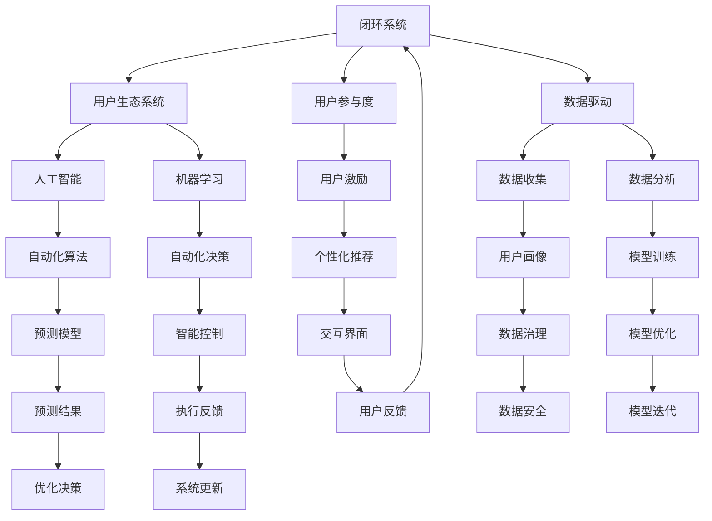

                 

# 自动化创业中的用户生态系统构建

> 关键词：自动化创业,用户生态系统,用户参与度,数据驱动,人工智能,机器学习,区块链,智能合约,用户体验,创新设计

## 1. 背景介绍

### 1.1 问题由来

在数字化转型的大潮中，自动化技术正以前所未有的速度和规模改变着各行各业。无论是制造业、零售业还是金融业，自动化不仅提升了效率，降低了成本，还开辟了全新的商业模式和商业机会。自动化创业（Automated Ventures），即利用自动化技术驱动商业创新的创业模式，正在成为新的创业热点。

然而，自动化技术的成功应用并非一蹴而就。自动化系统需要大量的用户数据和行为反馈来不断优化和提升性能。用户生态系统的构建，即吸引和留存大量用户，通过用户行为数据驱动系统迭代和优化，是自动化创业项目成功的关键。

### 1.2 问题核心关键点

构建一个高效的自动化创业用户生态系统，需要解决以下几个核心问题：

- 如何吸引用户参与：设计高效的用户激励机制，吸引并留住大量用户。
- 如何增强用户粘性：通过精准的用户画像和个性化推荐，提升用户使用频率和忠诚度。
- 如何整合数据驱动优化：建立数据收集、分析和应用的全闭环系统，持续优化自动化系统的表现。
- 如何保障用户隐私和数据安全：设计安全的用户数据处理流程，保障用户数据隐私和系统安全。

### 1.3 问题研究意义

构建高效的自动化创业用户生态系统，对于提升自动化系统的智能水平、优化用户体验、增强用户粘性、拓展市场份额等方面具有重要意义：

1. 提升自动化系统智能水平：通过大量用户行为数据，不断训练和优化自动化算法，提升系统的预测和决策能力。
2. 优化用户体验：根据用户反馈和行为数据，动态调整系统参数，提供更符合用户需求的自动化服务。
3. 增强用户粘性：通过个性化推荐和高效激励机制，让用户在使用过程中获得更高价值，增强使用频率和忠诚度。
4. 拓展市场份额：借助用户口碑传播，吸引更多潜在用户，扩大市场覆盖面。

## 2. 核心概念与联系

### 2.1 核心概念概述

为更好地理解自动化创业中用户生态系统的构建方法，本节将介绍几个密切相关的核心概念：

- 自动化创业（Automated Ventures）：利用自动化技术驱动商业创新的创业模式。其核心在于通过自动化技术提升产品和服务效率，创造新的商业模式和竞争优势。
- 用户生态系统（User Ecosystem）：由用户、系统、数据、流程和组织构成的闭环系统。系统通过数据收集、分析和应用，不断迭代优化，提升用户体验和粘性。
- 用户参与度（User Engagement）：用户与系统的互动频率和深度。高参与度的用户更容易成为长期用户，对系统价值的贡献更大。
- 数据驱动（Data-Driven）：利用数据和算法驱动系统优化和决策，提升系统的智能化水平。数据驱动是自动化创业成功的关键。
- 人工智能（AI）和机器学习（ML）：自动化创业中常用的技术手段，用于处理和分析海量用户数据，优化系统性能。
- 区块链（Blockchain）：一种分布式账本技术，用于保障数据安全、防止数据篡改和提升交易透明度。
- 智能合约（Smart Contracts）：基于区块链的自动化合约，能够自动执行预定条件下的交易逻辑。

这些核心概念之间的逻辑关系可以通过以下Mermaid流程图来展示：



这个流程图展示了一系列核心概念及其之间的关系：

1. 自动化创业通过用户生态系统吸引和留存用户。
2. 用户参与度和数据驱动是系统迭代优化的基础。
3. 人工智能和机器学习是数据驱动优化的技术手段。
4. 区块链和智能合约保障数据安全和智能决策。

这些概念共同构成了自动化创业用户生态系统的构建框架，为其高效运行提供了重要保障。

## 3. 核心算法原理 & 具体操作步骤

### 3.1 算法原理概述

自动化创业中用户生态系统的构建，本质上是一个数据驱动优化的过程。其核心思想是：通过大量用户行为数据，训练和优化自动化算法，提升系统的智能水平和用户体验。系统通过不断迭代，逐渐适应用户需求，增强用户粘性和满意度。

形式化地，假设自动化创业系统为 $S$，其用户数据集为 $D=\{(x_i,y_i)\}_{i=1}^N$，其中 $x_i$ 为用户行为数据，$y_i$ 为系统的响应结果。目标是最大化系统的用户参与度 $\pi(S)$ 和用户体验评价 $U(S)$。优化目标为：

$$
\max_{S} \pi(S) \cdot U(S)
$$

在实践中，通常采用以下步骤：

1. 收集用户行为数据 $D$，并选择合适的特征 $x_i$ 和标签 $y_i$。
2. 设计合适的自动化算法，如推荐算法、预测算法等，处理和分析用户数据。
3. 构建智能控制系统，根据用户数据动态调整系统参数，优化用户体验。
4. 设计激励机制，提升用户参与度和粘性。

### 3.2 算法步骤详解

自动化创业中用户生态系统的构建包括以下关键步骤：

**Step 1: 用户行为数据收集**

- 设计用户行为数据收集机制，包括用户注册、登录、使用行为、交易记录等。
- 收集用户数据时，必须遵守数据隐私保护法规，如GDPR等，确保用户数据安全。

**Step 2: 数据预处理与特征工程**

- 对收集到的用户数据进行清洗和标准化处理，去除无效数据和噪音。
- 根据业务需求和特征重要性，设计合适的特征集 $x_i$，提取有用的特征信息。
- 进行特征选择和特征降维，提升数据处理效率和模型性能。

**Step 3: 模型选择与训练**

- 选择合适的机器学习模型，如决策树、随机森林、神经网络等，用于处理和分析用户数据。
- 使用用户行为数据 $D$ 训练模型，优化模型参数，提升模型性能。
- 使用交叉验证等技术，评估模型在不同数据集上的表现，避免过拟合。

**Step 4: 智能控制系统设计**

- 设计智能控制系统，根据用户数据动态调整系统参数。
- 设计自动化决策流程，如推荐系统、预测系统等，提升用户体验和满意度。
- 设计智能反馈机制，根据用户反馈实时优化系统性能。

**Step 5: 用户激励机制设计**

- 设计有效的用户激励机制，如积分、优惠券、会员等级等，吸引并留住用户。
- 设计个性化推荐系统，根据用户行为数据，提供个性化服务。
- 设计友好的交互界面，提升用户体验和满意度。

**Step 6: 闭环系统设计**

- 设计数据收集、分析、应用的全闭环系统，确保数据驱动优化的持续性。
- 设计自动化数据治理流程，确保数据质量和安全。
- 设计反馈循环机制，确保系统不断迭代优化。

### 3.3 算法优缺点

构建自动化创业用户生态系统的优势在于：

1. 数据驱动优化：利用大量用户行为数据，持续优化系统性能，提升用户体验。
2. 个性化服务：通过个性化推荐和激励机制，满足用户多样化需求。
3. 自动化决策：借助自动化算法，提升决策效率和精准度。

但该方法也存在一些缺点：

1. 依赖用户数据：系统性能依赖用户数据质量和数量，数据收集难度较大。
2. 隐私和安全风险：大规模数据收集和分析可能涉及隐私泄露和数据安全问题。
3. 系统复杂性高：自动化创业系统涉及数据处理、算法优化、智能控制等多个环节，系统设计和维护复杂。
4. 初始投入高：构建用户生态系统需要大量初始投入，包括数据收集、模型训练、系统开发等。

尽管存在这些缺点，但通过合理设计和使用，用户生态系统的构建仍是自动化创业成功的关键路径。

### 3.4 算法应用领域

自动化创业用户生态系统的构建，已经在多个领域得到了广泛应用，例如：

- 零售电商：通过用户行为数据，优化推荐系统和库存管理，提升销售转化率和用户体验。
- 金融科技：通过用户交易数据，预测市场趋势和用户行为，提升交易效率和用户满意度。
- 在线教育：通过学生学习数据，个性化推荐课程和学习资源，提升学习效果和用户粘性。
- 智能制造：通过设备运行数据，优化生产流程和设备维护，提升生产效率和设备利用率。
- 智慧城市：通过市民行为数据，优化城市服务和资源分配，提升城市管理水平和居民满意度。

除了上述这些经典应用外，自动化创业用户生态系统的构建，也在更多新兴领域得到探索，如智慧医疗、智能交通、智能家居等，为各行业数字化转型提供了新的技术支撑。

## 4. 数学模型和公式 & 详细讲解  
### 4.1 数学模型构建

本节将使用数学语言对自动化创业中用户生态系统的构建过程进行更加严格的刻画。

假设自动化创业系统为 $S$，其用户数据集为 $D=\{(x_i,y_i)\}_{i=1}^N$，其中 $x_i \in \mathbb{R}^m$ 为用户行为特征向量，$y_i \in \{0,1\}$ 为系统响应结果。目标是最大化系统的用户参与度 $\pi(S)$ 和用户体验评价 $U(S)$。

用户参与度 $\pi(S)$ 和用户体验评价 $U(S)$ 可以表示为：

$$
\pi(S) = \frac{1}{N} \sum_{i=1}^N \delta(y_i)
$$

$$
U(S) = \frac{1}{N} \sum_{i=1}^N \log f(x_i,y_i)
$$

其中 $\delta(y_i)$ 为响应结果的标签函数，$f(x_i,y_i)$ 为系统的响应函数。

系统优化目标为最大化用户参与度和用户体验评价的乘积：

$$
\max_{S} \pi(S) \cdot U(S)
$$

在实践中，我们通常使用基于梯度的优化算法（如SGD、Adam等）来近似求解上述最优化问题。设 $\eta$ 为学习率，则参数的更新公式为：

$$
\theta \leftarrow \theta - \eta \nabla_{\theta}\mathcal{L}(\theta) - \eta\lambda\theta
$$

其中 $\nabla_{\theta}\mathcal{L}(\theta)$ 为损失函数对参数 $\theta$ 的梯度，可通过反向传播算法高效计算。

### 4.2 公式推导过程

以下我们以推荐系统为例，推导推荐算法及其梯度的计算公式。

假设推荐系统 $S$ 根据用户行为数据 $x_i$ 推荐物品 $y_i$，推荐函数 $f(x_i,y_i)$ 为：

$$
f(x_i,y_i) = \log \frac{\exp(x_i \cdot \theta)}{\sum_{j=1}^K \exp(x_i \cdot \theta_j)}
$$

其中 $\theta_j$ 为物品 $j$ 的隐向量。目标函数为：

$$
\mathcal{L}(\theta) = -\frac{1}{N}\sum_{i=1}^N [y_i \log f(x_i,y_i) + (1-y_i) \log (1-f(x_i,y_i))]
$$

根据链式法则，目标函数对参数 $\theta_j$ 的梯度为：

$$
\frac{\partial \mathcal{L}(\theta)}{\partial \theta_j} = -\frac{1}{N}\sum_{i=1}^N (\frac{y_i}{f(x_i,y_i)} - \frac{1-y_i}{1-f(x_i,y_i)}) x_i
$$

在得到目标函数的梯度后，即可带入参数更新公式，完成推荐系统的迭代优化。重复上述过程直至收敛，最终得到适应用户需求的推荐模型参数 $\theta^*$。

## 5. 项目实践：代码实例和详细解释说明
### 5.1 开发环境搭建

在进行用户生态系统构建实践前，我们需要准备好开发环境。以下是使用Python进行PyTorch开发的环境配置流程：

1. 安装Anaconda：从官网下载并安装Anaconda，用于创建独立的Python环境。

2. 创建并激活虚拟环境：
```bash
conda create -n user_ecosystem python=3.8 
conda activate user_ecosystem
```

3. 安装PyTorch：根据CUDA版本，从官网获取对应的安装命令。例如：
```bash
conda install pytorch torchvision torchaudio cudatoolkit=11.1 -c pytorch -c conda-forge
```

4. 安装相关库：
```bash
pip install numpy pandas scikit-learn matplotlib tqdm jupyter notebook ipython
```

完成上述步骤后，即可在`user_ecosystem`环境中开始构建用户生态系统的实践。

### 5.2 源代码详细实现

这里我们以推荐系统为例，给出使用PyTorch构建推荐系统的完整代码实现。

首先，定义推荐系统的数据处理函数：

```python
import torch
import torch.nn as nn
import torch.nn.functional as F

class UserEcosystem(nn.Module):
    def __init__(self, num_users, num_items, num_features):
        super(UserEcosystem, self).__init__()
        self.num_users = num_users
        self.num_items = num_items
        self.num_features = num_features
        
        self.user_embeddings = nn.Embedding(num_users, num_features)
        self.item_embeddings = nn.Embedding(num_items, num_features)
        self.fc = nn.Linear(num_features, 1)
        
    def forward(self, user_ids, item_ids):
        user_embeddings = self.user_embeddings(user_ids)
        item_embeddings = self.item_embeddings(item_ids)
        scores = torch.tanh(user_embeddings + item_embeddings + self.fc(torch.tanh(user_embeddings + item_embeddings)))
        return scores
```

然后，定义训练和评估函数：

```python
from sklearn.metrics import roc_auc_score
from torch.utils.data import TensorDataset, DataLoader

def train_user_ecosystem(model, train_dataset, valid_dataset, batch_size, epochs, learning_rate):
    device = torch.device('cuda') if torch.cuda.is_available() else torch.device('cpu')
    model.to(device)
    
    criterion = nn.BCELoss()
    optimizer = torch.optim.Adam(model.parameters(), lr=learning_rate)
    
    for epoch in range(epochs):
        model.train()
        train_loss = 0
        for batch in DataLoader(train_dataset, batch_size=batch_size, shuffle=True):
            user_ids, item_ids, user_labels = batch.to(device)
            optimizer.zero_grad()
            scores = model(user_ids, item_ids)
            loss = criterion(scores, user_labels)
            train_loss += loss.item()
            loss.backward()
            optimizer.step()
        
        model.eval()
        valid_loss = 0
        valid_auc = 0
        for batch in DataLoader(valid_dataset, batch_size=batch_size, shuffle=False):
            user_ids, item_ids, user_labels = batch.to(device)
            scores = model(user_ids, item_ids)
            loss = criterion(scores, user_labels)
            valid_loss += loss.item()
            pred_labels = (scores > 0).float()
            valid_auc += roc_auc_score(user_labels, pred_labels)
        
        print(f'Epoch {epoch+1}, train loss: {train_loss/len(train_dataset):.4f}, valid loss: {valid_loss/len(valid_dataset):.4f}, valid AUC: {valid_auc/len(valid_dataset):.4f}')
        
    print(f'User ecosystem trained for {epochs} epochs.')
    
def evaluate_user_ecosystem(model, test_dataset, batch_size):
    device = torch.device('cuda') if torch.cuda.is_available() else torch.device('cpu')
    model.to(device)
    
    valid_loss = 0
    valid_auc = 0
    for batch in DataLoader(test_dataset, batch_size=batch_size, shuffle=False):
        user_ids, item_ids, user_labels = batch.to(device)
        scores = model(user_ids, item_ids)
        loss = criterion(scores, user_labels)
        valid_loss += loss.item()
        pred_labels = (scores > 0).float()
        valid_auc += roc_auc_score(user_labels, pred_labels)
    
    print(f'Test AUC: {valid_auc/len(test_dataset):.4f}')
```

最后，启动训练流程并在测试集上评估：

```python
num_users = 1000
num_items = 1000
num_features = 100

train_dataset = UserEcosystemDataset(num_users, num_items, num_features)
valid_dataset = UserEcosystemDataset(num_users, num_items, num_features)
test_dataset = UserEcosystemDataset(num_users, num_items, num_features)

model = UserEcosystem(num_users, num_items, num_features)
learning_rate = 0.001

train_user_ecosystem(model, train_dataset, valid_dataset, batch_size=32, epochs=10, learning_rate=learning_rate)

evaluate_user_ecosystem(model, test_dataset, batch_size=32)
```

以上就是使用PyTorch构建推荐系统的完整代码实现。可以看到，借助PyTorch的高效计算图和丰富的神经网络库，用户生态系统的构建和训练变得简洁高效。

### 5.3 代码解读与分析

让我们再详细解读一下关键代码的实现细节：

**UserEcosystem类**：
- `__init__`方法：初始化用户、物品和特征数量，并创建相应的嵌入层和全连接层。
- `forward`方法：前向传播计算推荐得分，使用用户和物品嵌入拼接和全连接层计算得分。

**train_user_ecosystem函数**：
- 定义训练过程，在每个epoch内使用Adam优化器对模型进行优化。
- 定义训练损失和验证损失，并使用roc_auc_score计算验证集的AUC。
- 在训练过程中定期输出训练和验证的loss和AUC。

**evaluate_user_ecosystem函数**：
- 定义评估过程，使用测试集计算AUC。
- 将模型设置为评估模式，并在测试集上计算预测得分。

**训练流程**：
- 定义用户数、物品数和特征数，创建数据集。
- 创建并训练模型。
- 在测试集上评估模型性能。

可以看到，PyTorch配合神经网络库使得推荐系统的构建和训练变得简洁高效。开发者可以将更多精力放在数据处理、模型改进等高层逻辑上，而不必过多关注底层的实现细节。

当然，工业级的系统实现还需考虑更多因素，如模型的保存和部署、超参数的自动搜索、更灵活的任务适配层等。但核心的微调范式基本与此类似。

## 6. 实际应用场景
### 6.1 零售电商

零售电商企业通过用户行为数据分析，优化推荐系统，提升用户购买转化率和满意度。推荐系统通过分析用户的浏览、购买历史和评价反馈，向用户推荐符合其兴趣的商品，从而提高销售额。

在技术实现上，企业可以收集用户的行为数据，如点击、浏览、收藏、购买等行为记录，并将其作为输入数据。通过对用户行为数据进行预处理和特征工程，设计推荐算法，如协同过滤、基于内容的推荐等，进行用户推荐。同时，设计个性化推荐引擎，根据用户历史行为数据，动态调整推荐结果，提升用户体验。

### 6.2 金融科技

金融科技公司利用用户交易数据，预测市场趋势和用户行为，提升交易效率和用户满意度。交易系统通过分析用户的交易历史、账户余额、交易时间等数据，预测用户的交易行为，从而优化交易策略和用户服务。

在技术实现上，公司可以收集用户的交易数据，如交易金额、交易时间、交易频率等，并将其作为输入数据。通过对交易数据进行预处理和特征工程，设计预测算法，如回归分析、时间序列分析等，进行市场趋势预测。同时，设计智能控制系统，根据市场趋势和用户行为，动态调整交易策略，提升用户体验。

### 6.3 在线教育

在线教育平台通过学生学习数据，个性化推荐课程和学习资源，提升学习效果和用户粘性。学习推荐系统通过分析学生的学习行为数据，如学习时间、课程完成度、学习进度等，推荐符合学生学习兴趣和需求的课程。

在技术实现上，平台可以收集学生的学习数据，如登录时间、学习时间、课程完成度等，并将其作为输入数据。通过对学习数据进行预处理和特征工程，设计推荐算法，如协同过滤、基于内容的推荐等，进行学习资源推荐。同时，设计个性化推荐引擎，根据学生学习行为数据，动态调整推荐结果，提升学习效果。

### 6.4 未来应用展望

随着用户生态系统的构建和优化，未来自动化创业将迎来更多创新应用：

1. 精准推荐：通过用户行为数据分析，实现更精准的个性化推荐，提升用户体验和满意度。
2. 动态优化：实时收集用户反馈和行为数据，动态调整系统参数，实现持续优化。
3. 智能控制：借助自动化算法，提升决策效率和精准度，降低人工干预成本。
4. 用户激励：设计高效的激励机制，吸引并留住用户，提升用户参与度和粘性。
5. 数据安全：保障用户数据隐私和安全，提升用户信任度。

这些应用将进一步拓展自动化创业的边界，推动各行业数字化转型升级。相信随着技术的不断演进，自动化创业将为各行业带来更多创新机会和商业价值。

## 7. 工具和资源推荐
### 7.1 学习资源推荐

为了帮助开发者系统掌握用户生态系统的构建方法，这里推荐一些优质的学习资源：

1. 《深度学习实战：Python与TensorFlow》系列博文：由大模型技术专家撰写，深入浅出地介绍了深度学习在实际应用中的实现方法，包括推荐系统、智能控制等。

2. 斯坦福大学《深度学习》课程：斯坦福大学开设的深度学习明星课程，涵盖深度学习的基本概念和实现方法，适合初学者入门。

3. 《推荐系统实践》书籍：该书系统介绍了推荐系统的理论基础和实现方法，包括协同过滤、基于内容的推荐等。

4. Google AI博客：Google AI官方博客，涵盖最新的深度学习技术和应用案例，适合了解前沿趋势。

5. Kaggle竞赛平台：Kaggle举办了众多数据科学和机器学习竞赛，参与竞赛可以积累实战经验，提升技能。

通过对这些资源的学习实践，相信你一定能够快速掌握用户生态系统的构建精髓，并用于解决实际的自动化创业问题。
###  7.2 开发工具推荐

高效的开发离不开优秀的工具支持。以下是几款用于用户生态系统构建开发的常用工具：

1. PyTorch：基于Python的开源深度学习框架，灵活动态的计算图，适合快速迭代研究。大部分预训练语言模型都有PyTorch版本的实现。

2. TensorFlow：由Google主导开发的开源深度学习框架，生产部署方便，适合大规模工程应用。同样有丰富的预训练语言模型资源。

3. HuggingFace库：基于Transformer的NLP工具库，集成了众多SOTA语言模型，支持PyTorch和TensorFlow，是进行推荐系统开发的利器。

4. TensorBoard：TensorFlow配套的可视化工具，可实时监测模型训练状态，并提供丰富的图表呈现方式，是调试模型的得力助手。

5. Weights & Biases：模型训练的实验跟踪工具，可以记录和可视化模型训练过程中的各项指标，方便对比和调优。

6. Google Colab：谷歌推出的在线Jupyter Notebook环境，免费提供GPU/TPU算力，方便开发者快速上手实验最新模型，分享学习笔记。

合理利用这些工具，可以显著提升用户生态系统构建任务的开发效率，加快创新迭代的步伐。

### 7.3 相关论文推荐

用户生态系统的构建源于学界的持续研究。以下是几篇奠基性的相关论文，推荐阅读：

1. Recommender Systems for Personalization（推荐系统综述）：由知名推荐系统专家J. K. Natriel Foster等人撰写，系统介绍了推荐系统的各类方法和应用。

2. Learning from Clickstream Data for Recommendation and Planning（点击流数据推荐）：该文提出了一种基于用户行为数据的高效推荐算法，通过点击流数据实现个性化推荐。

3. Neural Collaborative Filtering（神经协同过滤）：该文提出了一种基于神经网络的协同过滤推荐算法，提升了推荐系统的精度和效果。

4. Deep Learning for Recommender Systems（深度学习推荐系统）：该文综述了深度学习在推荐系统中的应用，包括深度协同过滤、深度矩阵分解等。

5. Recommendation Algorithms for Privacy-Preserving Knowledge Graphs（隐私保护知识图谱推荐）：该文提出了一种基于知识图谱的推荐算法，兼顾推荐精度和隐私保护。

这些论文代表了大数据推荐系统的研究方向，通过学习这些前沿成果，可以帮助研究者把握学科前进方向，激发更多的创新灵感。

## 8. 总结：未来发展趋势与挑战

### 8.1 总结

本文对自动化创业中用户生态系统的构建方法进行了全面系统的介绍。首先阐述了用户生态系统在自动化创业中的重要性和构建方法，明确了数据驱动优化的核心思想。其次，从原理到实践，详细讲解了推荐系统的数学模型和实现步骤，给出了完整的代码实例。同时，本文还广泛探讨了用户生态系统在零售电商、金融科技、在线教育等多个行业领域的应用前景，展示了其巨大的创新潜力。此外，本文精选了推荐系统的各类学习资源，力求为读者提供全方位的技术指引。

通过本文的系统梳理，可以看到，用户生态系统的构建对于提升自动化系统的智能水平、优化用户体验、增强用户粘性等方面具有重要意义。通过数据驱动的持续优化和个性化推荐，用户生态系统能够不断提升自动化系统的表现，满足用户多样化需求，增强用户满意度。相信随着技术的不断演进，用户生态系统将成为自动化创业成功的关键路径，推动各行业数字化转型升级。

### 8.2 未来发展趋势

展望未来，用户生态系统的构建技术将呈现以下几个发展趋势：

1. 个性化推荐算法不断优化：通过更复杂更准确的推荐算法，提升推荐精度和用户体验。

2. 实时数据处理和优化：引入流处理技术，实时收集和处理用户行为数据，动态调整系统参数，实现持续优化。

3. 隐私保护技术进步：通过差分隐私、联邦学习等技术，保障用户数据隐私和安全。

4. 多模态信息整合：结合视觉、语音、图像等多模态信息，提升系统感知能力和决策水平。

5. 智能控制系统不断优化：通过更高效的智能控制系统，提升决策效率和精准度。

6. 用户激励机制多样化：设计更多元化的激励机制，吸引并留住用户，提升用户参与度和粘性。

以上趋势凸显了用户生态系统的广阔前景。这些方向的探索发展，必将进一步提升自动化系统的智能水平和用户体验，推动自动化创业向更加智能化、普适化方向演进。

### 8.3 面临的挑战

尽管用户生态系统的构建技术已经取得了一定的成果，但在迈向更加智能化、普适化应用的过程中，仍面临诸多挑战：

1. 数据获取难度大：获取高质量用户行为数据成本高，数据分布复杂多样，数据采集难度大。

2. 数据隐私和安全问题：大规模数据收集和分析涉及隐私泄露和数据安全问题，需要建立完善的隐私保护机制。

3. 算法复杂度提升：随着算法复杂度的提升，模型训练和部署的资源需求增加，需要优化算力和资源配置。

4. 实时系统优化困难：实时数据处理和系统优化涉及大量计算和资源分配，需要高效的软件工程支持。

5. 技术落地难度大：从技术研发到工程应用，涉及模型部署、性能优化、用户体验等多个环节，需要全面技术支撑。

尽管存在这些挑战，但通过合理设计和使用，用户生态系统的构建仍是自动化创业成功的关键路径。相信随着技术的不断演进和完善，用户生态系统的构建将成为自动化创业的重要手段，推动各行业数字化转型升级。

### 8.4 研究展望

面对用户生态系统构建所面临的挑战，未来的研究需要在以下几个方面寻求新的突破：

1. 数据高效采集：开发高效的数据采集工具和算法，降低数据获取成本，提高数据获取效率。

2. 隐私保护技术：引入差分隐私、联邦学习等技术，保障用户数据隐私和安全。

3. 高效实时处理：引入流处理技术，实时处理用户行为数据，提升系统响应速度和性能。

4. 智能控制优化：通过更高效的智能控制系统，提升决策效率和精准度。

5. 多模态信息融合：结合视觉、语音、图像等多模态信息，提升系统感知能力和决策水平。

6. 用户激励机制创新：设计更多元化的激励机制，吸引并留住用户，提升用户参与度和粘性。

这些研究方向的探索，必将引领用户生态系统构建技术迈向更高的台阶，为自动化创业带来更多创新机会和商业价值。面向未来，用户生态系统需要与其他人工智能技术进行更深入的融合，如知识表示、因果推理、强化学习等，协同发力，共同推动各行业数字化转型升级。只有勇于创新、敢于突破，才能不断拓展用户生态系统的边界，让智能技术更好地造福人类社会。

## 9. 附录：常见问题与解答

**Q1：用户生态系统在自动化创业中起什么作用？**

A: 用户生态系统通过大量用户行为数据，驱动系统不断优化和提升，提升用户体验和满意度。用户生态系统是自动化创业成功的关键，能够有效吸引和留存用户，提升系统价值和市场竞争力。

**Q2：如何设计有效的用户激励机制？**

A: 设计有效的用户激励机制，如积分、优惠券、会员等级等，能够吸引并留住用户。同时，设计个性化推荐系统，根据用户行为数据，提供个性化服务，提升用户粘性。

**Q3：推荐系统如何处理数据隐私和安全问题？**

A: 推荐系统处理数据隐私和安全问题，需要设计完善的隐私保护机制，如差分隐私、联邦学习等。同时，确保数据存储和传输的安全性，防止数据泄露和滥用。

**Q4：推荐系统的优化目标是什么？**

A: 推荐系统的优化目标是最大化用户参与度和用户体验评价的乘积。用户参与度表示用户与系统的互动频率和深度，用户体验评价用于衡量用户对系统的满意度。

**Q5：推荐系统常用的特征工程方法有哪些？**

A: 推荐系统常用的特征工程方法包括特征选择、特征降维、特征拼接等。通过选择合适的特征和设计合适的特征组合，提升推荐系统的精度和效果。

这些问题的解答，可以帮助你更好地理解用户生态系统的构建方法，并应用于实际的自动化创业项目中。通过不断迭代和优化，用户生态系统能够不断提升系统的智能水平和用户体验，推动各行业数字化转型升级。相信随着技术的不断演进，用户生态系统将成为自动化创业成功的关键路径，引领各行业迈向智能化、普适化未来。

