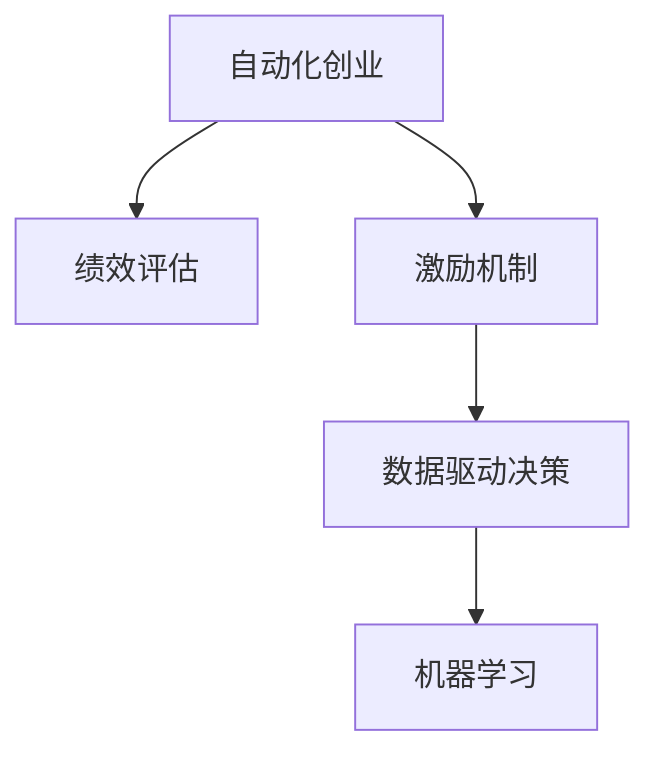

                 

# 自动化创业中的绩效评估与激励

> 关键词：自动化创业, 绩效评估, 激励机制, 机器学习, 人力资源管理, 数据驱动决策

## 1. 背景介绍

在当今快速发展的商业环境中，自动化技术已经深刻地改变了各行各业的生产方式和工作模式。自动化创业公司通过智能化系统优化流程，提高效率，降低成本，提升企业竞争力。然而，为了持续推动自动化系统的优化和升级，企业的绩效评估与激励机制至关重要。

自动化创业中的绩效评估与激励机制，不仅关系到员工的积极性和工作效果，还直接影响到企业的长期发展和竞争优势。因此，建立一套科学、公平、激励性强的绩效评估与激励体系，是每一个自动化创业公司不可忽视的任务。

本文将详细介绍自动化创业中的绩效评估与激励机制的原理、实施步骤、优缺点及应用领域，并通过数学模型和实际案例进行详细讲解，最后结合最新的研究趋势和挑战进行总结，以期为自动化创业公司提供实践指导。

## 2. 核心概念与联系

### 2.1 核心概念概述

为了更好地理解自动化创业中的绩效评估与激励机制，首先需要了解几个核心概念：

- **自动化创业**：指利用人工智能、机器学习等技术，优化企业流程、提升工作效率和决策水平的新型创业模式。常见的应用包括智能制造、智能客服、智能运营等。

- **绩效评估**：通过一系列指标对员工或团队的工作表现进行评估，以衡量其对企业的贡献。

- **激励机制**：根据员工的绩效表现，提供相应的物质或非物质奖励，激励其持续改进和提升。

- **数据驱动决策**：利用大数据和人工智能技术，分析企业运营数据，指导企业决策和运营。

- **机器学习**：通过算法和模型，从数据中学习和提取知识，用于预测、决策和优化。

这些概念之间的联系可以通过以下Mermaid流程图来展示：



该流程图展示了自动化创业、绩效评估、激励机制、数据驱动决策与机器学习之间的逻辑关系。

## 3. 核心算法原理 & 具体操作步骤

### 3.1 算法原理概述

自动化创业中的绩效评估与激励机制，本质上是通过数据和算法，科学地量化员工的工作表现，并根据评估结果，设计合理的激励措施。其核心算法原理包括：

- **关键绩效指标(KPIs)**：选择与企业目标和员工工作紧密相关的指标，如生产效率、客户满意度、质量控制等。

- **绩效评分模型**：基于历史数据和机器学习算法，计算员工或团队在每个KPI上的得分。

- **激励模型**：根据绩效评分，设计激励措施，如奖金、晋升、培训机会等。

### 3.2 算法步骤详解

以下是基于绩效评估与激励机制的核心算法步骤：

**Step 1: 定义关键绩效指标**
- 根据企业目标和业务需求，确定关键绩效指标(KPIs)，如生产效率、客户满意度、质量控制等。
- 定义每个KPI的具体衡量标准，如生产数量、客户投诉率、错误率等。

**Step 2: 数据收集与清洗**
- 收集与KPI相关的数据，如员工生产记录、客户反馈、质量检查报告等。
- 对数据进行清洗，去除异常值和噪声，确保数据的准确性和完整性。

**Step 3: 建立绩效评分模型**
- 使用机器学习算法（如回归分析、决策树、神经网络等）建立绩效评分模型。
- 使用历史数据训练模型，确保模型的准确性和稳定性。

**Step 4: 进行绩效评估**
- 将员工或团队的工作数据输入模型，计算每个KPI的得分。
- 根据得分，评估员工或团队的工作表现，生成绩效评估报告。

**Step 5: 设计激励机制**
- 根据绩效评估结果，设计合理的激励措施，如奖金、晋升、培训机会等。
- 确保激励措施的公平性和激励性，提升员工的满意度和积极性。

**Step 6: 实施与监控**
- 将激励措施具体落实，如发放奖金、安排培训课程等。
- 持续监控激励措施的效果，根据反馈进行调整和优化。

### 3.3 算法优缺点

基于绩效评估与激励机制的核心算法具有以下优点：
1. **数据驱动**：通过数据分析和机器学习算法，评估更加客观、准确。
2. **公平透明**：基于量化评分，减少了主观因素的影响，提高了评估的公平性和透明度。
3. **动态调整**：可以根据企业目标和员工表现动态调整KPI和激励措施，提升灵活性。

同时，该算法也存在以下缺点：
1. **复杂度高**：需要大量数据和复杂的算法，实施成本较高。
2. **数据质量要求高**：数据清洗和处理需要较高的技术水平和经验。
3. **缺乏弹性**：过分依赖模型，可能忽视员工的个性化需求和多样性。

### 3.4 算法应用领域

基于绩效评估与激励机制的核心算法，已经在自动化创业的多个领域得到广泛应用，例如：

- **智能制造**：通过生产效率和质量控制等KPI，评估生产线的优化效果，设计激励措施提升员工积极性。
- **智能客服**：根据客户满意度、问题解决率等指标，评估客服团队的表现，提供个性化的培训和奖励。
- **智能运营**：通过供应链效率和客户响应速度等指标，评估运营管理的优化效果，激励团队持续改进。

除了上述这些经典应用外，自动化创业中的绩效评估与激励机制还将在更多领域得到创新应用，如智能仓储、智能物流、智能广告等，为企业的数字化转型和智能化升级提供有力支持。

## 4. 数学模型和公式 & 详细讲解  
### 4.1 数学模型构建

在本节中，我们将基于回归分析模型构建自动化创业中的绩效评估与激励机制的数学模型。

假设企业有 $N$ 名员工，每个员工在 $K$ 个关键绩效指标 $X_k$ 上的得分分别为 $y_{ik}$，其中 $k \in \{1, 2, ..., K\}$，$i \in \{1, 2, ..., N\}$。目标是最小化员工绩效得分与真实得分的差异。

定义员工绩效评分的数学模型为：

$$
\min_{\theta} \sum_{i=1}^N \sum_{k=1}^K (y_{ik} - f_k(x_{ik};\theta))^2
$$

其中 $\theta$ 为模型参数，$f_k(x_{ik};\theta)$ 为第 $k$ 个关键绩效指标的预测函数。

### 4.2 公式推导过程

以下是关键绩效评分模型的推导过程：

- **线性回归模型**：最简单的预测函数是线性回归模型，其形式为：

$$
f_k(x_{ik};\theta) = \theta_0 + \theta_1 x_{ik,1} + \theta_2 x_{ik,2} + ... + \theta_d x_{ik,d}
$$

其中 $\theta_0, \theta_1, ..., \theta_d$ 为模型参数。

- **最小二乘估计**：将模型与真实值之间的差异最小化，得到模型参数的估计值。

$$
\min_{\theta} \sum_{i=1}^N \sum_{k=1}^K (y_{ik} - f_k(x_{ik};\theta))^2
$$

通过求导和求解，可以得到参数 $\theta$ 的估计值：

$$
\theta = (\sum_{i=1}^N \sum_{k=1}^K x_{ik} x_{ik}^T)^{-1} \sum_{i=1}^N \sum_{k=1}^K y_{ik} x_{ik}
$$

### 4.3 案例分析与讲解

假设某自动化创业公司有10名员工，每个员工的生产效率（单位时间生产数量）和质量控制（错误率）数据如下表所示：

| 员工编号 | 生产效率（单位/天） | 质量控制（错误率/%） |
|----------|--------------------|----------------------|
| 1        | 50                 | 2                    |
| 2        | 60                 | 1.5                  |
| ...      | ...                | ...                  |
| 10       | 45                 | 3                    |

使用上述线性回归模型进行预测，可以计算每个员工的绩效评分。假设有3个关键绩效指标 $X_1$（生产效率）、$X_2$（质量控制）和 $X_3$（客户满意度），每个指标占总评分的权重分别为0.4、0.3和0.3。

根据数据，可以计算得到每个员工的绩效评分 $S_i$：

$$
S_i = 0.4 \times f_{X_1}(x_{i1}) + 0.3 \times f_{X_2}(x_{i2}) + 0.3 \times f_{X_3}(x_{i3})
$$

其中 $f_{X_k}(x_{ik};\theta)$ 为第 $k$ 个关键绩效指标的预测函数，$x_{ik}$ 为员工 $i$ 在关键绩效指标 $X_k$ 上的实际表现。

通过上述公式，可以得到每个员工的绩效评分，并根据评分设计合理的激励措施。

## 5. 项目实践：代码实例和详细解释说明

### 5.1 开发环境搭建

在进行自动化创业中的绩效评估与激励机制的实践前，我们需要准备好开发环境。以下是使用Python进行Pandas和Scikit-learn开发的简单环境配置流程：

1. 安装Anaconda：从官网下载并安装Anaconda，用于创建独立的Python环境。

2. 创建并激活虚拟环境：
```bash
conda create -n performance-env python=3.8 
conda activate performance-env
```

3. 安装Pandas和Scikit-learn：
```bash
conda install pandas scikit-learn
```

4. 安装各类工具包：
```bash
pip install numpy matplotlib jupyter notebook ipython
```

完成上述步骤后，即可在`performance-env`环境中开始性能评估与激励机制的实践。

### 5.2 源代码详细实现

下面以生产效率和质量控制为例，给出使用Pandas和Scikit-learn进行员工绩效评估的Python代码实现。

首先，定义员工数据：

```python
import pandas as pd

# 员工数据
employees = pd.DataFrame({
    'EmployeeID': [1, 2, 3, 4, 5, 6, 7, 8, 9, 10],
    'ProductionEfficiency': [50, 60, 45, 55, 52, 58, 47, 50, 53, 48],
    'QualityControl': [2, 1.5, 3, 1.2, 2.5, 1.8, 2.8, 1.9, 2.2, 3]
})

# 定义关键绩效指标和权重
KPIs = ['ProductionEfficiency', 'QualityControl']
Weights = [0.4, 0.3]
```

然后，使用线性回归模型进行员工绩效评分计算：

```python
from sklearn.linear_model import LinearRegression
from sklearn.metrics import mean_squared_error

# 数据预处理
X = employees[KPIs].values.reshape(-1, len(KPIs))
y = employees['ProductionEfficiency'].values

# 建立线性回归模型
regressor = LinearRegression()
regressor.fit(X, y)

# 计算每个员工的绩效评分
scores = regressor.predict(X)
scores = pd.Series(scores, index=employees.index)

# 计算每个员工的激励措施（假设计算平均分数）
bonuses = scores.mean()
```

最后，评估激励措施的效果并进行可视化：

```python
import matplotlib.pyplot as plt

# 可视化绩效评分和激励措施
plt.figure(figsize=(10, 6))
plt.plot(scores, label='Performance Score')
plt.plot(bonuses, label='Bonus')
plt.legend()
plt.xlabel('Employee ID')
plt.ylabel('Score/Bonus')
plt.title('Performance Evaluation and Bonus')
plt.show()
```

以上就是使用Pandas和Scikit-learn进行员工绩效评估的完整代码实现。可以看到，Pandas和Scikit-learn提供了强大的数据处理和模型训练功能，使得绩效评估的代码实现变得简洁高效。

### 5.3 代码解读与分析

让我们再详细解读一下关键代码的实现细节：

**Pandas库**：
- `pd.DataFrame`：用于创建数据框，方便数据存储和操作。
- `values`属性：用于获取数据框的值。

**Scikit-learn库**：
- `LinearRegression`：用于建立线性回归模型。
- `mean_squared_error`：用于计算模型预测值与真实值之间的均方误差。

**可视化代码**：
- `matplotlib.pyplot`：用于绘制图表，可视化员工绩效评分和激励措施的效果。

**数据预处理**：
- `reshape`方法：将数据从二维数组转换为适合模型训练的格式。
- `fit`方法：用于训练线性回归模型。
- `predict`方法：用于计算模型的预测值。

可以看到，Pandas和Scikit-learn提供了丰富的功能和便捷的接口，使得数据预处理、模型训练和可视化等任务可以高效完成。开发者可以将更多精力放在业务逻辑的实现上，而不必过多关注底层细节。

## 6. 实际应用场景

### 6.1 智能制造

在智能制造领域，绩效评估与激励机制可以显著提升生产效率和产品质量。通过采集生产线上的各种数据（如设备运行状态、工人操作记录、产品质量检测等），建立绩效评分模型，实时监控和评估生产线的运行状态，及时发现和解决潜在问题，提升生产线的整体效率和质量。

具体应用中，可以设计多种KPI，如设备利用率、产品合格率、工人操作规范性等，并根据评分结果进行激励，如奖金、培训、晋升等，激励员工持续改进和提升。

### 6.2 智能客服

在智能客服领域，绩效评估与激励机制可以提升客服响应速度和质量。通过采集客服系统中的对话记录、客户反馈等数据，建立绩效评分模型，实时评估客服人员的响应速度、问题解决率、客户满意度等指标，根据评分结果进行激励，如奖金、表彰、培训等，激励客服人员提升服务质量，提升客户满意度。

具体应用中，可以设计多种KPI，如平均响应时间、客户满意度评分、问题解决率等，并根据评分结果进行激励，如奖金、表彰、培训等。

### 6.3 智能运营

在智能运营领域，绩效评估与激励机制可以优化运营效率和客户体验。通过采集运营系统中的订单处理记录、库存管理数据、客户反馈等，建立绩效评分模型，实时监控和评估运营管理的效率和效果，及时发现和解决运营中的问题，提升整体运营效率和客户满意度。

具体应用中，可以设计多种KPI，如订单处理速度、库存周转率、客户响应时间等，并根据评分结果进行激励，如奖金、培训、晋升等，激励运营团队持续改进和提升。

### 6.4 未来应用展望

随着自动化技术的不断进步，绩效评估与激励机制将在更多领域得到创新应用，如智能仓储、智能物流、智能广告等，为企业的数字化转型和智能化升级提供有力支持。

未来，绩效评估与激励机制可能会引入更多先进的技术和理念，如实时数据分析、人工智能辅助决策、区块链技术等，进一步提升评估和激励的效率和效果。同时，可能会引入更多元化的激励措施，如职业发展路径规划、员工职业成长计划等，提升员工的满意度和忠诚度。

## 7. 工具和资源推荐

### 7.1 学习资源推荐

为了帮助开发者系统掌握自动化创业中的绩效评估与激励机制的理论基础和实践技巧，这里推荐一些优质的学习资源：

1. **《绩效评估与激励机制》系列博文**：由绩效评估与激励机制专家撰写，深入浅出地介绍了绩效评估的基本概念、常用模型和算法等，适合初学者和从业者阅读。

2. **《数据科学和机器学习》课程**：斯坦福大学开设的优秀课程，涵盖数据分析、机器学习、绩效评估等前沿话题，帮助读者全面掌握相关知识。

3. **《绩效评估与激励机制》书籍**：介绍了绩效评估的基本原理、常用方法和实际应用案例，适合实践和理论并重的读者。

4. **Scikit-learn官方文档**：Scikit-learn的官方文档，提供了丰富的学习资源和样例代码，帮助读者深入理解线性回归、回归分析等算法。

5. **Kaggle竞赛**：参与Kaggle竞赛，可以积累实战经验，学习先进的数据处理和模型训练方法。

通过对这些资源的学习实践，相信你一定能够快速掌握自动化创业中的绩效评估与激励机制的精髓，并用于解决实际的业务问题。

### 7.2 开发工具推荐

高效的开发离不开优秀的工具支持。以下是几款用于自动化创业中的绩效评估与激励机制开发的常用工具：

1. **Pandas**：强大的数据处理和分析工具，适用于数据的清洗、整理和可视化。

2. **Scikit-learn**：机器学习和数据分析库，提供丰富的算法和模型，适用于性能评估和模型训练。

3. **Jupyter Notebook**：交互式开发环境，支持Python、R等多种编程语言，适用于数据分析和模型训练。

4. **TensorBoard**：TensorFlow配套的可视化工具，适用于模型的训练和监控。

5. **WealthFront**：实时数据分析和决策工具，适用于数据的实时监控和决策。

合理利用这些工具，可以显著提升自动化创业中绩效评估与激励机制的开发效率，加快创新迭代的步伐。

### 7.3 相关论文推荐

自动化创业中的绩效评估与激励机制的发展源于学界的持续研究。以下是几篇奠基性的相关论文，推荐阅读：

1. **《绩效评估和激励机制》**：介绍了绩效评估的基本原理、常用方法和实际应用案例，适合实践和理论并重的读者。

2. **《数据驱动的绩效评估与激励机制》**：利用大数据和机器学习技术，提高绩效评估的准确性和公平性，适合数据分析和机器学习从业者。

3. **《智能制造中的绩效评估与激励机制》**：介绍智能制造中的绩效评估与激励机制的实施方法和效果，适合智能制造领域的研究者和从业者。

这些论文代表了大语言模型微调技术的发展脉络。通过学习这些前沿成果，可以帮助研究者把握学科前进方向，激发更多的创新灵感。

## 8. 总结：未来发展趋势与挑战

### 8.1 研究成果总结

本文对自动化创业中的绩效评估与激励机制进行了全面系统的介绍。首先阐述了绩效评估与激励机制在自动化创业中的重要性，明确了其在提升工作效率、优化决策管理等方面的独特价值。其次，从原理到实践，详细讲解了绩效评估与激励机制的数学原理和关键步骤，给出了具体的代码实现。同时，本文还广泛探讨了绩效评估与激励机制在智能制造、智能客服、智能运营等多个行业领域的应用前景，展示了其广泛的应用潜力。此外，本文精选了绩效评估与激励机制的学习资源，力求为读者提供全方位的技术指引。

通过本文的系统梳理，可以看到，自动化创业中的绩效评估与激励机制正在成为企业数字化转型的重要工具，极大地提升了企业的运营效率和决策水平。未来，随着技术的不断演进，绩效评估与激励机制将会更加智能化、自动化，为企业带来更大的发展机遇。

### 8.2 未来发展趋势

展望未来，自动化创业中的绩效评估与激励机制将呈现以下几个发展趋势：

1. **智能化和自动化**：通过引入AI技术，如机器学习、自然语言处理等，提升绩效评估的准确性和效率。

2. **实时化和动态化**：利用实时数据分析技术，实时监控和调整绩效评分和激励措施，增强决策的灵活性和响应速度。

3. **多元化和个性化**：引入更多元化的激励措施，如职业发展路径规划、员工职业成长计划等，提升员工的满意度和忠诚度。

4. **全员化和透明化**：推动绩效评估与激励机制的全员化和透明化，增强员工的参与感和公平性。

5. **国际化**：引入国际化的绩效评估标准和激励措施，提升企业的全球竞争力。

这些趋势凸显了自动化创业中的绩效评估与激励机制的广阔前景。这些方向的探索发展，必将进一步提升企业的绩效评估水平，推动企业实现数字化转型和智能化升级。

### 8.3 面临的挑战

尽管自动化创业中的绩效评估与激励机制已经取得了一定的成果，但在迈向更加智能化、普适化应用的过程中，它仍面临着诸多挑战：

1. **数据质量瓶颈**：绩效评估依赖于高质量的数据，但数据的采集、清洗和处理往往需要较高的技术水平和成本。如何提升数据质量，是实现精准评估的关键。

2. **算法复杂性**：绩效评估中的算法复杂度高，需要较强的技术能力和计算资源支持。如何降低算法复杂度，提高模型的可解释性和可操作性，是提升评估效率的重要方向。

3. **激励机制设计**：绩效评估结果需要结合企业实际情况进行合理设计激励措施，但不同企业、不同岗位的激励需求存在差异。如何设计公平、有效的激励机制，需要更多实际经验和理论指导。

4. **企业文化和管理**：绩效评估与激励机制的实施需要与企业文化和管理方式相结合，但企业文化和管理方式的差异可能导致激励效果的差异。如何推动企业文化和管理方式的改进，以支持绩效评估与激励机制的实施，是一大挑战。

5. **员工心理和行为**：绩效评估与激励机制的实施，对员工的职业心理和行为可能产生影响，如激励过度、激励不足、激励不公平等。如何平衡激励与公平，需要更多实证研究和实践经验。

这些挑战需要通过技术创新、管理优化和实践积累，逐步克服和解决。唯有不断迭代和优化，才能实现自动化创业中绩效评估与激励机制的可持续发展。

### 8.4 研究展望

面对自动化创业中的绩效评估与激励机制所面临的挑战，未来的研究需要在以下几个方面寻求新的突破：

1. **大数据和人工智能**：利用大数据和人工智能技术，提升绩效评估的准确性和效率。

2. **实时监控和调整**：开发实时监控和调整系统，提高绩效评估的实时性和动态性。

3. **多元化和个性化**：设计多元化和个性化的激励措施，提升员工的满意度和忠诚度。

4. **企业文化和管理优化**：推动企业文化和管理方式的改进，支持绩效评估与激励机制的实施。

5. **实证研究和实践**：通过实证研究和实践积累，提升绩效评估与激励机制的科学性和有效性。

这些研究方向的探索，必将引领自动化创业中的绩效评估与激励机制迈向更高的台阶，为企业的数字化转型和智能化升级提供有力支持。面向未来，绩效评估与激励机制还需要与其他人工智能技术进行更深入的融合，如知识表示、因果推理、强化学习等，多路径协同发力，共同推动企业绩效管理的进步。

## 9. 附录：常见问题与解答

**Q1: 自动化创业中的绩效评估与激励机制如何与企业文化和管理方式相结合？**

A: 绩效评估与激励机制的实施需要与企业文化和管理方式相结合，才能达到预期的效果。以下是一些具体的建议：

1. **透明和公平**：绩效评估应保持透明和公平，确保所有员工都能理解评估标准和激励措施，避免产生不信任和抵触情绪。

2. **文化引导**：企业文化应鼓励积极、进取、创新的精神，激励员工不断提升自身能力和表现。

3. **反馈机制**：建立有效的反馈机制，及时向员工反馈绩效评估结果和激励措施，帮助员工提升自身表现。

4. **团队协作**：绩效评估应注重团队协作和合作，鼓励团队共同提升整体绩效。

5. **培训和晋升**：提供持续的培训和发展机会，帮助员工提升专业能力和职业素质，促进职业成长。

通过这些措施，可以更好地将绩效评估与激励机制与企业文化和管理方式相结合，提升企业的绩效评估水平和员工满意度。

**Q2: 自动化创业中的绩效评估与激励机制如何避免过拟合和偏见？**

A: 自动化创业中的绩效评估与激励机制，为了避免过拟合和偏见，可以采取以下措施：

1. **数据多样性**：使用多样化的数据源，确保数据的代表性和多样性，避免单一数据源的偏见。

2. **模型鲁棒性**：使用鲁棒性较强的模型，如决策树、随机森林等，避免单一模型过拟合。

3. **透明和可解释性**：选择可解释性强的模型，确保评估结果透明和可理解，避免模型的不可解释性。

4. **持续监控和调整**：定期监控绩效评估结果，及时发现和调整模型和激励措施，避免过拟合和偏见。

5. **多模型结合**：使用多个模型的综合评估结果，避免单一模型的过拟合和偏见。

通过这些措施，可以有效地避免过拟合和偏见，提升绩效评估与激励机制的准确性和公平性。

**Q3: 自动化创业中的绩效评估与激励机制如何与持续学习和职业发展相结合？**

A: 自动化创业中的绩效评估与激励机制，可以通过与持续学习和职业发展相结合，进一步提升员工的满意度和积极性。

1. **持续学习机会**：将绩效评估结果与持续学习机会相结合，根据员工的评估结果，提供针对性的培训和课程，帮助员工提升自身能力和素质。

2. **职业发展规划**：将绩效评估结果与职业发展规划相结合，根据员工的评估结果，制定个性化的职业发展规划，帮助员工实现职业成长。

3. **跨部门合作**：鼓励跨部门合作和交流，提升员工的团队合作能力和项目管理能力，促进职业发展。

4. **反馈和改进**：建立有效的反馈和改进机制，根据员工的职业发展规划和实际表现，及时调整激励措施和培训内容，确保职业发展的持续性和有效性。

通过这些措施，可以更好地将绩效评估与激励机制与持续学习和职业发展相结合，提升员工的满意度和职业发展水平。

**Q4: 自动化创业中的绩效评估与激励机制如何应对数据质量瓶颈？**

A: 自动化创业中的绩效评估与激励机制，应对数据质量瓶颈的措施主要包括：

1. **数据清洗和预处理**：在数据收集和处理阶段，进行严格的数据清洗和预处理，确保数据的准确性和完整性。

2. **数据多样化**：使用多样化的数据源，确保数据的代表性和多样性，避免单一数据源的偏见。

3. **数据采集自动化**：利用自动化工具和设备，提高数据采集的效率和准确性，减少人工干预和误差。

4. **数据监控和反馈**：建立数据监控和反馈机制，及时发现和解决数据质量问题，确保数据质量。

5. **数据标注和校验**：对于关键数据，进行严格的标注和校验，确保数据的准确性和一致性。

通过这些措施，可以有效地应对数据质量瓶颈，提升绩效评估与激励机制的准确性和可靠性。

**Q5: 自动化创业中的绩效评估与激励机制如何应对激励机制设计难题？**

A: 自动化创业中的绩效评估与激励机制，应对激励机制设计难题的措施主要包括：

1. **公平和透明**：设计公平和透明的激励机制，确保所有员工都能理解激励标准和规则，避免产生不信任和抵触情绪。

2. **多样化和个性化**：设计多样化和个性化的激励措施，根据不同岗位、不同层级的员工需求，提供个性化的激励方案。

3. **动态调整**：根据企业实际情况和员工表现，动态调整激励措施，确保激励机制的合理性和有效性。

4. **实证研究**：通过实证研究，评估激励措施的效果，及时调整和优化激励机制，确保激励效果的最大化。

5. **管理支持和推动**：高层管理支持和推动激励机制的实施，确保激励机制的顺利推进和落地。

通过这些措施，可以有效地应对激励机制设计难题，提升绩效评估与激励机制的公平性和有效性。

---

作者：禅与计算机程序设计艺术 / Zen and the Art of Computer Programming

