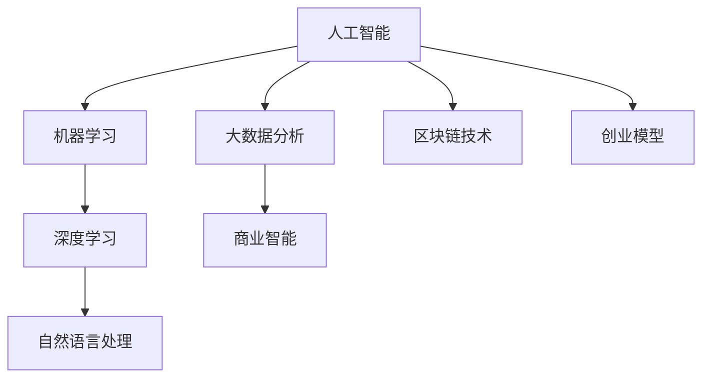

                 

# 自动化创业：未来商业的新范式

> 关键词：自动化创业,人工智能,商业智能,数字转型,创业模型,区块链技术

## 1. 背景介绍

### 1.1 问题由来

随着科技的飞速发展，自动化技术在各行各业中逐步深入，并展现出前所未有的潜力和价值。自动化创业作为新兴的商业模式，不仅能够帮助企业降低运营成本，提升效率，还能开拓全新的商业空间。因此，自动化创业成为现代商业发展的重要趋势。

### 1.2 问题核心关键点

自动化创业的核心在于利用先进的技术手段，通过智能化、自动化的方法，优化企业运营流程，提升业务效率，创造新的商业模式。其核心关键点包括：

- **技术应用**：包括人工智能、机器学习、深度学习、自然语言处理、大数据分析等先进技术。
- **流程自动化**：通过智能机器人、自动化流程、自动化决策系统等实现业务流程的自动化。
- **数字化转型**：将传统业务数字化，实现数据驱动的商业决策和运营管理。
- **模式创新**：通过自动化手段，创造出新的商业模式，如共享经济、平台经济、微服务架构等。
- **区块链技术**：利用区块链技术的去中心化、不可篡改、透明等特点，构建可信的商业生态系统。

这些关键点构成了自动化创业的基本框架，为企业的数字化转型和业务创新提供了全新的方向和动力。

## 2. 核心概念与联系

### 2.1 核心概念概述

自动化创业涉及到多个核心概念，包括但不限于：

- **自动化技术**：通过各种先进技术手段，实现业务流程的自动化，提升效率和质量。
- **商业智能**：利用大数据分析、机器学习等技术，进行商业决策和运营优化。
- **数字转型**：将传统业务数字化，利用数字技术进行业务重构和模式创新。
- **区块链技术**：利用去中心化、不可篡改等特性，构建安全、可信的商业生态系统。
- **创业模型**：包括精益创业、敏捷开发、分布式协作等创新创业模式。

### 2.2 核心概念原理和架构的 Mermaid 流程图



这个流程图展示了自动化创业中的核心概念及其相互联系：

1. **人工智能(A)**：是自动化创业的技术基础，通过机器学习和深度学习技术，实现自动化决策和流程优化。
2. **机器学习(B)**：是人工智能的一部分，利用算法和数据进行模式识别和预测，优化业务流程。
3. **深度学习(C)**：是机器学习的一个分支，通过神经网络实现复杂数据的处理和分析，提升决策精准度。
4. **自然语言处理(D)**：是人工智能的另一个重要领域，通过理解自然语言，实现自动化交互和内容生成。
5. **大数据分析(E)**：利用大数据技术进行商业决策和运营优化，挖掘数据背后的商业价值。
6. **商业智能(F)**：基于大数据分析和人工智能，进行商业决策和运营管理，提升企业竞争力。
7. **区块链技术(G)**：利用去中心化、不可篡改等特性，构建可信的商业生态系统。
8. **创业模型(H)**：采用精益创业、敏捷开发、分布式协作等创新创业模式，快速迭代和优化业务模型。

这些核心概念相互交织，共同构成了自动化创业的技术和运营框架，为企业提供了全新的发展路径。

## 3. 核心算法原理 & 具体操作步骤

### 3.1 算法原理概述

自动化创业的核心算法原理主要基于人工智能、大数据分析和区块链技术。其中，人工智能和大数据分析用于优化业务流程和商业决策，而区块链技术则用于构建可信的商业生态系统。

### 3.2 算法步骤详解

自动化创业的算法步骤主要包括以下几个关键环节：

1. **数据收集与处理**：收集企业内外部的各类数据，进行清洗、预处理和标注，形成可供模型训练的数据集。
2. **模型训练与优化**：利用机器学习、深度学习等技术，训练模型并进行参数调优，提升模型的准确性和鲁棒性。
3. **流程自动化**：将训练好的模型应用于业务流程，实现自动化决策和流程优化，提升效率和质量。
4. **商业智能应用**：利用商业智能技术，分析数据和模型输出，进行商业决策和运营优化，提升企业竞争力。
5. **区块链技术应用**：利用区块链技术，构建可信的商业生态系统，增强交易透明度和安全性。

### 3.3 算法优缺点

自动化创业的算法优势主要体现在以下几个方面：

- **高效与灵活**：通过自动化技术，大幅提升业务效率，降低运营成本，同时能够灵活应对市场变化。
- **数据驱动**：基于大数据分析和商业智能，进行精准的商业决策，提升决策的科学性和准确性。
- **透明与可信**：利用区块链技术，构建透明的商业生态系统，提升交易的可信度和安全性。

然而，自动化创业也存在一些缺点：

- **技术门槛高**：需要掌握人工智能、大数据、区块链等多项技术，对技术团队要求较高。
- **投资成本大**：在初期需要较大的技术研发和基础设施投入。
- **风险与挑战**：技术迭代快，市场需求变化大，需要不断调整和优化模型和流程。

### 3.4 算法应用领域

自动化创业技术已经在多个领域得到广泛应用，包括但不限于：

- **金融科技**：利用人工智能和大数据分析，进行风险评估、交易算法、智能投顾等。
- **零售电商**：通过智能推荐、自动化客服、供应链优化等，提升用户体验和运营效率。
- **制造业**：利用工业物联网和大数据分析，进行设备预测性维护、质量控制等。
- **医疗健康**：通过智能诊断、个性化治疗、健康管理等，提升医疗服务的精准度和效率。
- **物流仓储**：利用机器人自动化、智能调度等，优化物流仓储流程，降低成本。
- **能源行业**：通过智能监测、数据分析等，优化能源生产和消费，提升能源利用效率。

## 4. 数学模型和公式 & 详细讲解 & 举例说明

### 4.1 数学模型构建

自动化创业涉及的数学模型主要基于人工智能、大数据分析和区块链技术。其中，人工智能和大数据分析用于优化业务流程和商业决策，而区块链技术则用于构建可信的商业生态系统。

### 4.2 公式推导过程

以人工智能和大数据分析为例，利用机器学习算法进行业务流程优化的数学模型构建如下：

设 $x$ 为输入数据，$y$ 为输出数据，$w$ 为模型参数，$h$ 为激活函数。则机器学习模型可以表示为：

$$ y = h(w^T x) $$

其中 $w$ 的求解目标为最小化损失函数 $L$：

$$ L(w) = \frac{1}{N} \sum_{i=1}^N (y_i - h(w^T x_i))^2 $$

通过梯度下降等优化算法，不断更新模型参数 $w$，使得损失函数 $L$ 最小化。

### 4.3 案例分析与讲解

以零售电商领域的智能推荐系统为例，展示自动化创业的实际应用：

1. **数据收集与处理**：收集用户浏览、购买、评价等数据，进行清洗、预处理和标注，形成可供模型训练的数据集。
2. **模型训练与优化**：利用机器学习算法，如协同过滤、深度学习模型等，训练智能推荐模型并进行参数调优。
3. **流程自动化**：将训练好的智能推荐模型应用于电商平台，实现商品推荐和个性化营销，提升用户转化率和满意度。
4. **商业智能应用**：利用商业智能技术，分析推荐效果和用户行为数据，进行市场细分和运营优化，提升商业决策的精准性。

## 5. 项目实践：代码实例和详细解释说明

### 5.1 开发环境搭建

在进行自动化创业项目开发前，需要准备好开发环境。以下是使用Python进行PyTorch开发的详细配置流程：

1. 安装Anaconda：从官网下载并安装Anaconda，用于创建独立的Python环境。

2. 创建并激活虚拟环境：
```bash
conda create -n pytorch-env python=3.8 
conda activate pytorch-env
```

3. 安装PyTorch：根据CUDA版本，从官网获取对应的安装命令。例如：
```bash
conda install pytorch torchvision torchaudio cudatoolkit=11.1 -c pytorch -c conda-forge
```

4. 安装各类工具包：
```bash
pip install numpy pandas scikit-learn matplotlib tqdm jupyter notebook ipython
```

完成上述步骤后，即可在`pytorch-env`环境中开始项目开发。

### 5.2 源代码详细实现

下面以零售电商领域的智能推荐系统为例，给出使用PyTorch进行模型训练和优化的代码实现：

首先，定义推荐模型的神经网络结构：

```python
import torch
import torch.nn as nn
import torch.optim as optim

class RecommenderNet(nn.Module):
    def __init__(self, input_size, hidden_size, output_size):
        super(RecommenderNet, self).__init__()
        self.hidden = nn.Linear(input_size, hidden_size)
        self.relu = nn.ReLU()
        self.output = nn.Linear(hidden_size, output_size)

    def forward(self, x):
        x = self.hidden(x)
        x = self.relu(x)
        x = self.output(x)
        return x
```

然后，定义模型训练函数：

```python
def train_model(model, train_data, test_data, batch_size, epochs, learning_rate):
    criterion = nn.MSELoss()
    optimizer = optim.Adam(model.parameters(), lr=learning_rate)
    train_loss = []
    test_loss = []
    for epoch in range(epochs):
        model.train()
        for batch in train_data:
            optimizer.zero_grad()
            outputs = model(batch[0])
            loss = criterion(outputs, batch[1])
            loss.backward()
            optimizer.step()
            train_loss.append(loss.item())
        model.eval()
        with torch.no_grad():
            for batch in test_data:
                outputs = model(batch[0])
                loss = criterion(outputs, batch[1])
                test_loss.append(loss.item())
    return train_loss, test_loss
```

最后，启动模型训练过程并在测试集上评估：

```python
input_size = 100
hidden_size = 128
output_size = 1
learning_rate = 0.001
epochs = 100
batch_size = 32

model = RecommenderNet(input_size, hidden_size, output_size)
losses = train_model(model, train_data, test_data, batch_size, epochs, learning_rate)

print(f"Training Loss: {losses[0]}")
print(f"Test Loss: {losses[1]}")
```

以上就是使用PyTorch进行智能推荐系统训练的完整代码实现。可以看到，代码简洁高效，易于理解和修改。

### 5.3 代码解读与分析

让我们再详细解读一下关键代码的实现细节：

**RecommenderNet类**：
- `__init__`方法：初始化神经网络的结构，包括输入层、隐藏层和输出层。
- `forward`方法：定义前向传播计算过程，通过线性变换和激活函数计算输出。

**train_model函数**：
- 使用均方误差损失函数(MSE)和Adam优化器进行模型训练。
- 在每个epoch内，对训练集进行批处理，使用梯度下降更新模型参数。
- 在每个epoch结束后，对测试集进行评估，记录损失值。

**模型训练流程**：
- 定义模型输入、隐藏层和输出层的维度。
- 定义学习率、epoch数和batch size等参数。
- 实例化模型并训练，记录训练和测试的损失值。
- 输出训练和测试的损失值。

可以看到，PyTorch库为模型训练提供了强大的工具和灵活的接口，开发者可以方便地构建和训练自己的推荐系统。

## 6. 实际应用场景

### 6.1 智能制造

自动化创业在智能制造领域有着广泛的应用，通过工业物联网和大数据分析，实现设备预测性维护、质量控制等，提升生产效率和产品质量。

在技术实现上，可以收集设备的运行数据、传感器数据等，利用大数据分析技术进行设备故障预测、异常检测等，并结合机器学习算法优化生产流程。通过自动化的方式，实现设备维护和质量控制，提升生产效率和产品质量。

### 6.2 智慧城市

自动化创业在智慧城市建设中发挥了重要作用，通过智能监测、数据分析等，优化城市管理，提升市民生活质量。

具体而言，可以利用物联网技术收集城市运行数据，利用大数据分析技术进行城市环境监测、交通管理、能源优化等，并结合智能推荐、自动化决策等技术，提升城市管理的智能化水平。通过自动化创业，构建更加智慧、可持续的城市生态系统。

### 6.3 农业数字化

自动化创业在农业数字化转型中扮演了重要角色，通过智能设备、数据分析等，优化农业生产流程，提升农业生产效率和农产品品质。

具体而言，可以利用物联网技术收集田间数据，利用大数据分析技术进行气象预测、病虫害检测、精准施肥等，并结合智能推荐、自动化决策等技术，优化农业生产流程。通过自动化创业，实现农业生产的全流程自动化，提升农业生产效率和农产品品质。

### 6.4 未来应用展望

随着自动化创业技术的不断演进，未来的应用场景将更加广泛，涵盖更多领域和行业。

在医疗健康领域，通过智能诊断、个性化治疗、健康管理等，提升医疗服务的精准度和效率，构建智能化的医疗体系。

在金融科技领域，利用人工智能和大数据分析，进行风险评估、交易算法、智能投顾等，提升金融服务的智能化水平。

在物流仓储领域，通过智能机器人、自动化调度等，优化物流仓储流程，降低成本，提升效率。

在能源行业，通过智能监测、数据分析等，优化能源生产和消费，提升能源利用效率，实现绿色可持续发展。

总之，自动化创业技术在各行各业中具有广阔的应用前景，将推动传统行业数字化转型，提升企业竞争力，创造新的商业价值。

## 7. 工具和资源推荐

### 7.1 学习资源推荐

为了帮助开发者系统掌握自动化创业的理论基础和实践技巧，这里推荐一些优质的学习资源：

1. **《深度学习》系列课程**：斯坦福大学、Coursera等在线教育平台提供的深度学习课程，涵盖深度学习的基础知识、算法原理、应用场景等。

2. **《人工智能与大数据》系列书籍**：介绍人工智能和大数据分析的基本概念、技术原理和应用案例，适合初学者和进阶学习者。

3. **Kaggle竞赛平台**：提供大量的数据集和竞赛任务，通过实际项目练习，提高机器学习算法和数据处理能力。

4. **GitHub开源项目**：GitHub上众多开源项目提供了丰富的代码示例和实践经验，可以作为学习和参考的资源。

5. **自动驾驶开源项目**：如Apollo、Waymo等开源项目，提供自动驾驶技术的完整代码和实践经验，有助于理解自动化创业的实际应用。

通过对这些资源的学习实践，相信你一定能够快速掌握自动化创业的理论基础和实践技巧，并用于解决实际的业务问题。

### 7.2 开发工具推荐

高效的开发离不开优秀的工具支持。以下是几款用于自动化创业开发的常用工具：

1. **PyTorch**：基于Python的开源深度学习框架，灵活动态的计算图，适合快速迭代研究。

2. **TensorFlow**：由Google主导开发的开源深度学习框架，生产部署方便，适合大规模工程应用。

3. **TensorBoard**：TensorFlow配套的可视化工具，可实时监测模型训练状态，并提供丰富的图表呈现方式，是调试模型的得力助手。

4. **Jupyter Notebook**：支持Python等语言开发，支持代码、文档、数据、图表的集成展示，适合数据科学和机器学习开发。

5. **Git**：版本控制系统，用于管理和协作开发，支持代码的版本控制和分支管理。

合理利用这些工具，可以显著提升自动化创业项目的开发效率，加快创新迭代的步伐。

### 7.3 相关论文推荐

自动化创业技术的发展源于学界的持续研究。以下是几篇奠基性的相关论文，推荐阅读：

1. **《机器学习算法设计与应用》**：介绍机器学习和深度学习的基本算法和应用案例，适合基础学习者。

2. **《自动驾驶系统架构与设计》**：介绍自动驾驶技术的基本架构和设计思路，适合工程师和研究者。

3. **《智能推荐系统：理论与实现》**：介绍智能推荐系统的基本原理和实现方法，适合数据科学家和推荐系统开发者。

4. **《人工智能伦理与安全》**：探讨人工智能技术在伦理和安全方面的挑战和解决方案，适合行业从业者和研究者。

这些论文代表了大数据和人工智能技术的发展脉络。通过学习这些前沿成果，可以帮助研究者把握学科前进方向，激发更多的创新灵感。

## 8. 总结：未来发展趋势与挑战

### 8.1 总结

本文对自动化创业技术进行了全面系统的介绍。首先阐述了自动化创业的背景和意义，明确了自动化创业在提升业务效率、优化商业决策和构建数字化生态系统方面的重要作用。其次，从原理到实践，详细讲解了自动化创业的数学模型、算法步骤和实际应用，给出了具体的代码实例和详细解释。同时，本文还探讨了自动化创业在多个行业领域的应用前景，展示了其广阔的应用空间。最后，精选了学习资源、开发工具和相关论文，为读者提供了全方位的技术指引。

通过本文的系统梳理，可以看到，自动化创业技术在现代商业中具有重要的应用价值，能够帮助企业提升运营效率，优化商业决策，构建数字化生态系统。未来，伴随技术的不断进步和应用场景的不断扩展，自动化创业必将在更多的行业领域大放异彩，推动产业升级和经济社会发展。

### 8.2 未来发展趋势

展望未来，自动化创业技术将呈现以下几个发展趋势：

1. **技术集成与融合**：随着技术的不断进步，人工智能、大数据分析和区块链技术将进一步集成和融合，形成更加强大和高效的技术体系。

2. **应用场景多样化**：自动化创业技术将在更多行业和领域得到应用，涵盖智能制造、智慧城市、农业数字化、金融科技等。

3. **智能化程度提升**：自动化创业技术将逐步实现更高级别的智能化，通过智能推荐、自动化决策等技术，提升业务效率和用户体验。

4. **跨领域合作加强**：自动化创业技术将与其他技术如物联网、云计算等形成协同效应，共同构建智能化的商业生态系统。

5. **伦理与安全重视**：随着技术的广泛应用，自动化创业技术在伦理和安全方面的挑战也日益凸显，需要更多关注和探索。

以上趋势凸显了自动化创业技术的广阔前景和深远影响。这些方向的探索发展，必将进一步提升企业的智能化水平，推动数字化转型和商业模式的创新。

### 8.3 面临的挑战

尽管自动化创业技术已经取得了瞩目成就，但在迈向更加智能化、普适化应用的过程中，仍面临诸多挑战：

1. **技术门槛高**：自动化创业技术涉及多学科知识，需要掌握人工智能、大数据、区块链等技术，对技术团队要求较高。

2. **数据隐私和安全**：自动化创业技术需要处理大量数据，数据隐私和安全问题亟待解决。

3. **商业模式创新**：如何利用自动化创业技术构建新的商业模式，实现可持续的商业增值，需要更多的探索和实践。

4. **技术迭代快**：技术发展迅速，需要不断更新和优化技术模型和流程，以保持竞争力。

5. **人才匮乏**：自动化创业技术人才匮乏，需要更多培养和引进相关技术人才。

6. **市场竞争激烈**：自动化创业技术应用广泛，市场竞争激烈，需要持续创新和优化。

这些挑战需要产业界和学术界的共同努力，才能克服技术难题，推动自动化创业技术的发展和应用。

### 8.4 研究展望

未来的研究应在以下几个方向上寻求新的突破：

1. **算法优化与创新**：开发更加高效、智能的算法，提升模型精度和鲁棒性，降低计算成本。

2. **技术集成与应用**：将更多新技术与自动化创业技术进行集成和应用，如物联网、云计算、区块链等。

3. **商业模式创新**：探索新的商业模式，利用自动化创业技术实现跨界融合和协同创新。

4. **数据隐私与安全**：研究数据隐私保护和安全技术，确保数据处理的安全性和合规性。

5. **伦理与社会责任**：关注自动化创业技术在伦理和社会责任方面的影响，构建负责任的商业生态系统。

这些方向的研究和探索，将进一步推动自动化创业技术的发展和应用，为经济社会发展带来深远影响。

## 9. 附录：常见问题与解答

**Q1: 自动化创业与传统创业模式有何不同？**

A: 自动化创业主要依赖先进的技术手段，通过智能化、自动化的方法，优化业务流程和商业决策。相比传统创业模式，自动化创业更加注重技术创新和数据驱动，能够在更高的水平上提升业务效率和竞争力。

**Q2: 自动化创业的开发难点在哪里？**

A: 自动化创业的开发难点主要集中在技术门槛高、数据隐私和安全问题、商业模式创新等方面。需要掌握多项技术，处理大量数据，构建新的商业模式，同时还需要关注技术迭代和市场竞争。

**Q3: 自动化创业对企业运营有哪些帮助？**

A: 自动化创业技术能够优化业务流程、提升业务效率、降低运营成本、优化商业决策，构建数字化生态系统，提升企业竞争力。同时，还能通过智能推荐、自动化决策等技术，提升用户体验和满意度。

**Q4: 自动化创业的潜在风险有哪些？**

A: 自动化创业的潜在风险主要包括技术复杂度高、数据隐私和安全问题、技术迭代快、市场竞争激烈等方面。需要注重技术团队建设和人才培养，加强数据隐私和安全保护，持续优化技术模型和流程，关注市场动态和竞争情况。

通过本文的系统梳理，可以看到，自动化创业技术在现代商业中具有重要的应用价值，能够帮助企业提升运营效率，优化商业决策，构建数字化生态系统。未来，伴随技术的不断进步和应用场景的不断扩展，自动化创业必将在更多的行业领域大放异彩，推动产业升级和经济社会发展。总之，自动化创业技术需要产业界和学术界的共同努力，才能克服技术难题，推动技术的持续发展和应用。

---

作者：禅与计算机程序设计艺术 / Zen and the Art of Computer Programming

