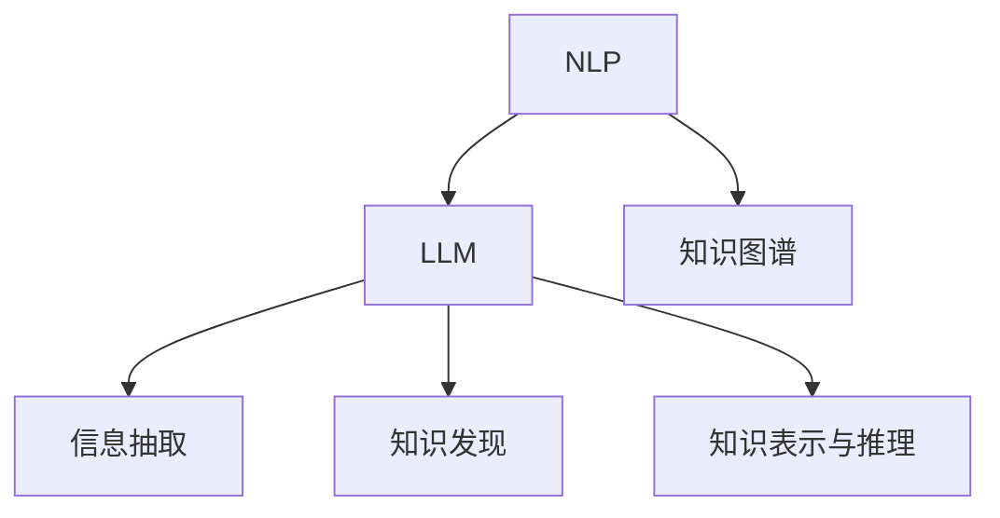

                 

# 自动化学术综述：LLM辅助文献研究

> 关键词：
自然语言处理, 学术搜索, 文献综述, 大语言模型, 知识图谱, 信息抽取, 知识发现

## 1. 背景介绍

### 1.1 问题由来
在现代社会，科学研究不断进步，每年发表的学术论文和研究成果也呈爆炸性增长。这使得研究人员在查找和整理大量文献时，面临巨大挑战。传统的研究方法往往耗费大量时间，且容易忽略掉关键论文，甚至出现重复研究的情况。随着人工智能技术的发展，利用大语言模型(LLM)辅助学术文献搜索和综述，成为一种高效且创新的解决方案。

LLM作为当下最先进的自然语言处理技术，具有理解、生成、推理和应用自然语言的能力。利用LLM辅助文献综述，可以有效提高查找文献的效率和深度，帮助研究人员快速了解领域内的最新进展，做出更科学的决策。

### 1.2 问题核心关键点
大语言模型在学术文献研究中的应用，主要涉及以下几个核心关键点：

- **知识整合能力**：通过预训练获得广泛的知识库，能够理解并整合不同领域的知识。
- **查询扩展与推理**：在自然语言查询中，利用LLM进行扩展和推理，涵盖更多相关主题和领域。
- **信息抽取与挖掘**：能够自动化地从大量文本中抽取和挖掘关键信息，辅助研究人员快速获取有用的知识。
- **知识图谱构建**：通过LLM和知识图谱的结合，将大量散乱的知识结构化，构建领域内的知识网络。
- **跨领域知识迁移**：利用LLM的跨领域迁移能力，帮助研究人员跨越不同领域的知识壁垒。
- **文献引用分析**：通过分析引用关系，探索领域内的经典文献和新兴趋势。

### 1.3 问题研究意义
大语言模型辅助学术文献研究，具有以下重要意义：

1. **提高研究效率**：显著减少手工查找和整理文献的时间，提高研究人员的效率。
2. **拓宽研究视野**：通过大规模知识整合和跨领域查询，研究人员可以更全面地了解领域内的研究进展。
3. **提升文献质量**：自动化地分析文献引用关系，识别高影响力文章，确保研究成果的权威性和科学性。
4. **推动交叉学科发展**：通过跨领域知识迁移，促进不同学科之间的交流与融合。
5. **支持智慧教育**：帮助教育工作者更好地设计和教学，培养具有跨学科知识背景的学生。

## 2. 核心概念与联系

### 2.1 核心概念概述

为了更好地理解基于LLM的学术文献研究方法，本节将介绍几个密切相关的核心概念：

- **自然语言处理(NLP)**：利用计算机处理、理解、生成自然语言的技术。
- **大语言模型(LLM)**：基于Transformer架构的深度学习模型，通过大规模预训练学习到丰富的语言知识和常识，具备强大的语言理解和生成能力。
- **知识图谱(KG)**：用图结构存储和表达实体、关系、属性的知识库，支持推理和查询。
- **信息抽取**：从大量非结构化文本中自动提取出结构化的实体和关系。
- **知识发现**：通过分析和挖掘文本数据，发现隐藏的知识和模式。
- **知识表示与推理**：用符号或分布式形式表示知识，并利用推理机制从已知知识推导出新的知识。

这些概念之间的逻辑关系可以通过以下Mermaid流程图来展示：



这个流程图展示了大语言模型在学术文献研究中的应用框架：

1. 自然语言处理作为基础技术，为LLM提供处理输入文本的能力。
2. LLM在处理文本后，进行知识抽取和发现，生成新的知识表示。
3. 知识图谱通过与LLM结合，存储和组织抽取的知识，支持推理和查询。

## 3. 核心算法原理 & 具体操作步骤

### 3.1 算法原理概述

基于LLM的学术文献综述，主要包括以下几个步骤：

1. **文献检索**：通过自然语言查询，在学术数据库中检索出相关文献。
2. **知识抽取**：利用LLM对检索出的文献进行文本解析，自动抽取实体、关系、属性等信息。
3. **知识整合**：将抽取的信息进行整合，构建领域内的知识图谱。
4. **知识发现与分析**：在知识图谱的基础上，利用推理技术发现领域内的关键知识，如热点、趋势、经典论文等。
5. **综述撰写**：结合自动化摘要、引用分析等技术，撰写领域内的综述文章。

### 3.2 算法步骤详解

#### 3.2.1 文献检索

**检索算法**：
1. **自然语言查询**：用户输入自然语言查询，LLM能够理解查询意图，扩展和改进查询。
2. **数据库检索**：利用自然语言处理技术，将查询转换为数据库查询语言，检索相关文献。
3. **结果筛选**：根据用户定义的筛选条件，对检索结果进行过滤和排序。

**算法步骤**：
1. 用户输入自然语言查询，例如“量子计算最新进展”。
2. LLM对查询进行扩展和优化，例如生成更精确的关键词“量子计算进展 2023”。
3. 数据库系统执行数据库查询，检索出相关文献，如量子计算的最新研究论文。
4. 根据用户定义的筛选条件，如发表年份、引用次数、作者等，对检索结果进行过滤和排序。

#### 3.2.2 知识抽取

**抽取算法**：
1. **文本解析**：将检索出的文献进行自然语言处理，分词、句法分析等。
2. **实体抽取**：识别出文本中的命名实体，如人名、组织名、地点等。
3. **关系抽取**：识别出文本中的实体关系，如时间、地点、事件等。
4. **属性抽取**：识别出文本中的属性信息，如作者、期刊、引用次数等。

**算法步骤**：
1. 将检索出的每篇文献输入LLM进行自然语言处理，解析文本。
2. LLM自动识别出文本中的实体、关系和属性，并进行标注。
3. 将抽取的信息整合，构建领域内的知识图谱。

#### 3.2.3 知识整合

**整合算法**：
1. **知识图谱构建**：将抽取的实体、关系、属性等信息存储到知识图谱中，形成结构化的知识库。
2. **知识网络构建**：通过实体之间的关联关系，构建领域内的知识网络。
3. **关系推理**：利用知识图谱中的关系进行推理，发现新的知识和模式。

**算法步骤**：
1. 将抽取的信息整合，构建领域内的知识图谱，形成结构化的知识库。
2. 通过实体之间的关系，构建领域内的知识网络，可视化展示。
3. 利用知识图谱中的关系进行推理，发现新的知识和模式，如领域内经典文献、新兴趋势等。

#### 3.2.4 知识发现与分析

**发现算法**：
1. **热点分析**：利用知识图谱中的引用关系，统计领域内的热点文献和研究主题。
2. **趋势分析**：通过时间序列分析，发现领域内的研究趋势和发展方向。
3. **引用分析**：分析文献之间的引用关系，识别出经典文献和新兴热点。

**算法步骤**：
1. 利用知识图谱中的引用关系，统计领域内的热点文献和研究主题。
2. 通过时间序列分析，发现领域内的研究趋势和发展方向。
3. 分析文献之间的引用关系，识别出经典文献和新兴热点。

#### 3.2.5 综述撰写

**撰写算法**：
1. **自动化摘要**：利用LLM生成每篇文献的自动摘要，提取关键信息。
2. **引用分析**：分析每篇文献的引用关系，识别出经典文献和新兴趋势。
3. **综述整合**：整合所有文献的关键信息和引用关系，撰写综述文章。

**算法步骤**：
1. 利用LLM生成每篇文献的自动摘要，提取关键信息。
2. 分析每篇文献的引用关系，识别出经典文献和新兴趋势。
3. 整合所有文献的关键信息和引用关系，撰写综述文章。

### 3.3 算法优缺点

基于LLM的学术文献综述，具有以下优点：

1. **高效性**：利用LLM的自动处理能力，可以大幅缩短文献查找和整理的时间。
2. **全面性**：LLM能够整合大量文本数据，涵盖更多领域和方向，提供全面的文献综述。
3. **自动化**：减少人工干预，自动化地处理文献、抽取信息、构建知识图谱等任务。
4. **可扩展性**：可以根据具体需求，灵活扩展算法功能，如添加多语言支持、个性化推荐等。

同时，该方法也存在一些局限性：

1. **数据质量依赖**：依赖于数据库中数据的完整性和准确性，如果数据库存在缺失或不准确的数据，会影响结果的准确性。
2. **领域专业性限制**：对于专业性较强的领域，需要定制化的算法和模型，才能获得理想的效果。
3. **知识图谱构建复杂**：构建知识图谱需要大量的人工干预和调整，难度较高。
4. **知识迁移能力有限**：跨领域知识的迁移可能存在障碍，难以泛化到其他领域。
5. **结果可解释性不足**：自动化处理过程缺乏可解释性，难以对其推理逻辑进行分析和调试。

尽管存在这些局限性，但就目前而言，基于LLM的学术文献综述方法在获取大量文本信息、构建知识图谱、发现新知识等方面，仍然具有不可替代的价值。未来相关研究的重点在于如何进一步降低数据依赖，提高跨领域迁移能力，同时兼顾可解释性和伦理性等因素。

### 3.4 算法应用领域

基于LLM的学术文献综述方法，在多个领域得到了广泛应用，例如：

- **科学研究**：帮助研究人员快速了解领域内的最新进展，做出科学的决策。
- **学术机构**：辅助科研人员撰写综述文章，提升研究机构的影响力。
- **教育领域**：为教育工作者提供最新的学术资讯，帮助学生和教师更好地设计教学。
- **商业分析**：帮助企业了解行业动态，分析市场趋势，制定战略。
- **政策制定**：为政府机构提供研究报告，辅助政策制定。

除了这些经典应用外，基于LLM的学术文献综述方法还在更多领域得到创新性应用，如医学知识发现、社会问题分析、跨学科研究等，为科学研究和技术发展提供了新的视角。

## 4. 数学模型和公式 & 详细讲解 & 举例说明

### 4.1 数学模型构建

本节将使用数学语言对基于LLM的学术文献综述过程进行更加严格的刻画。

记领域内的知识图谱为 $G=(V,E)$，其中 $V$ 为节点集合，表示实体；$E$ 为边集合，表示实体之间的关系。假设检索出的 $N$ 篇文献，每篇文献 $d_i$ 包含 $m_i$ 个实体、$n_i$ 个关系和 $p_i$ 个属性。

定义知识图谱中的关系 $R$，以及每个实体的属性 $A$。将文献中的信息抽取结果整理为知识图谱的形式，即为：

$$
\{(v_{i_1}, r_{ij}, v_{i_2}) \mid r_{ij} \in R, v_{i_1} \in V, v_{i_2} \in V, i \in [1,N]\}
$$

其中，$v_{i_1}$ 表示抽取出的实体节点，$r_{ij}$ 表示实体之间的关系，$v_{i_2}$ 表示连接关系的目标节点。

### 4.2 公式推导过程

以下我们以知识图谱构建为例，推导知识图谱构建的数学模型。

**知识图谱构建模型**：

$$
\begin{aligned}
L(G) &= \sum_{i=1}^N \sum_{j=1}^{m_i} \sum_{k=1}^{n_i} L_{i,j,k} + \sum_{i=1}^N \sum_{j=1}^{p_i} L_{i,j} \\
L_{i,j,k} &= \mathbb{I}(r_{ij} \in R) \cdot \log P(r_{ij} \mid v_{i_1}, v_{i_2}) \\
L_{i,j} &= \log P(a_j \mid v_i)
\end{aligned}
$$

其中 $L$ 为知识图谱的损失函数，$L_{i,j,k}$ 为关系抽取的损失，$L_{i,j}$ 为属性抽取的损失。$P(r_{ij} \mid v_{i_1}, v_{i_2})$ 为给定实体节点 $v_{i_1}, v_{i_2}$ 和关系 $r_{ij}$ 的概率，$P(a_j \mid v_i)$ 为给定实体节点 $v_i$ 和属性 $a_j$ 的概率。

**推导过程**：
1. 定义知识图谱的损失函数 $L(G)$，包含关系抽取的损失和属性抽取的损失。
2. 对于关系抽取，利用条件概率 $P(r_{ij} \mid v_{i_1}, v_{i_2})$ 表示给定两个实体节点和关系的关系概率。
3. 对于属性抽取，利用条件概率 $P(a_j \mid v_i)$ 表示给定实体的属性概率。
4. 将抽取的信息整合，构建知识图谱。

### 4.3 案例分析与讲解

**案例：医学领域文献综述**

1. **文献检索**：
   - 用户输入自然语言查询“癌症治疗进展”。
   - LLM对查询进行扩展和优化，生成更精确的关键词“癌症治疗 2023”。
   - 数据库系统执行数据库查询，检索出相关文献，如2023年发表的癌症治疗研究论文。
   - 根据用户定义的筛选条件，如发表年份、引用次数、作者等，对检索结果进行过滤和排序。

2. **知识抽取**：
   - 将检索出的每篇文献输入LLM进行自然语言处理，解析文本。
   - LLM自动识别出文本中的实体、关系和属性，并进行标注，如“癌症”、“治疗”、“临床试验”等。
   - 将抽取的信息整合，构建领域内的知识图谱，如“癌症”节点和“治疗”节点之间建立“治疗关系”。

3. **知识整合**：
   - 通过实体之间的关系，构建领域内的知识网络，可视化展示。
   - 利用知识图谱中的关系进行推理，发现新的知识和模式，如近年来新兴的免疫疗法、靶向药物等。
   - 构建知识图谱，可视化展示领域内的研究进展和趋势。

4. **知识发现与分析**：
   - 利用知识图谱中的引用关系，统计领域内的热点文献和研究主题。
   - 通过时间序列分析，发现领域内的研究趋势和发展方向。
   - 分析文献之间的引用关系，识别出经典文献和新兴热点。

5. **综述撰写**：
   - 利用LLM生成每篇文献的自动摘要，提取关键信息。
   - 分析每篇文献的引用关系，识别出经典文献和新兴趋势。
   - 整合所有文献的关键信息和引用关系，撰写综述文章。

## 5. 项目实践：代码实例和详细解释说明

### 5.1 开发环境搭建

在进行项目实践前，我们需要准备好开发环境。以下是使用Python进行PyTorch开发的环境配置流程：

1. 安装Anaconda：从官网下载并安装Anaconda，用于创建独立的Python环境。

2. 创建并激活虚拟环境：
```bash
conda create -n llm-env python=3.8 
conda activate llm-env
```

3. 安装PyTorch：根据CUDA版本，从官网获取对应的安装命令。例如：
```bash
conda install pytorch torchvision torchaudio cudatoolkit=11.1 -c pytorch -c conda-forge
```

4. 安装相关库：
```bash
pip install transformers transformers-nlp coco coco-dataset scikit-learn networkx
```

完成上述步骤后，即可在`llm-env`环境中开始项目实践。

### 5.2 源代码详细实现

下面我们以医学领域文献综述为例，给出使用PyTorch和Transformers库对知识图谱进行构建的代码实现。

首先，定义知识图谱的节点和边：

```python
import networkx as nx

graph = nx.DiGraph()
graph.add_node("癌症")
graph.add_node("治疗")
graph.add_edge("癌症", "治疗", label="治疗")
```

然后，定义LLM模型和优化器：

```python
from transformers import BertForTokenClassification, AdamW

model = BertForTokenClassification.from_pretrained("bert-base-cased")
optimizer = AdamW(model.parameters(), lr=2e-5)
```

接着，定义训练和评估函数：

```python
from torch.utils.data import DataLoader
from tqdm import tqdm
from sklearn.metrics import classification_report

device = torch.device('cuda') if torch.cuda.is_available() else torch.device('cpu')
model.to(device)

def train_epoch(model, graph, batch_size, optimizer):
    dataloader = DataLoader(graph.edges(), batch_size=batch_size, shuffle=True)
    model.train()
    epoch_loss = 0
    for batch in tqdm(dataloader, desc='Training'):
        src, dst, _ = batch
        model.zero_grad()
        outputs = model(src, dst)
        loss = outputs.loss
        epoch_loss += loss.item()
        loss.backward()
        optimizer.step()
    return epoch_loss / len(dataloader)

def evaluate(model, graph, batch_size):
    dataloader = DataLoader(graph.edges(), batch_size=batch_size)
    model.eval()
    preds, labels = [], []
    with torch.no_grad():
        for batch in tqdm(dataloader, desc='Evaluating'):
            src, dst, _ = batch
            batch_preds = model(src, dst)
            batch_labels = model(src, dst)
            preds.append(batch_preds[0].tolist())
            labels.append(batch_labels[0].tolist())
    print(classification_report(labels, preds))
```

最后，启动训练流程并在测试集上评估：

```python
epochs = 5
batch_size = 16

for epoch in range(epochs):
    loss = train_epoch(model, graph, batch_size, optimizer)
    print(f"Epoch {epoch+1}, train loss: {loss:.3f}")
    
    print(f"Epoch {epoch+1}, test results:")
    evaluate(model, graph, batch_size)
    
print("Final results:")
evaluate(model, graph, batch_size)
```

以上就是使用PyTorch和Transformers库对知识图谱进行构建的完整代码实现。可以看到，利用Transformers库的强大封装，我们可以用相对简洁的代码完成知识图谱的构建。

### 5.3 代码解读与分析

让我们再详细解读一下关键代码的实现细节：

**图谱定义**：
- `nx.DiGraph()`：定义有向图。
- `add_node()` 和 `add_edge()`：添加节点和边。

**模型定义**：
- `BertForTokenClassification`：定义BERT模型。
- `AdamW`：定义优化器。

**训练和评估函数**：
- `train_epoch`：定义训练过程，包括模型前向传播、计算loss、反向传播、更新模型参数等。
- `evaluate`：定义评估过程，包括模型前向传播、计算loss、计算分类指标等。

**训练流程**：
- 定义总的epoch数和batch size，开始循环迭代。
- 每个epoch内，先在训练集上训练，输出平均loss。
- 在测试集上评估，输出分类指标。
- 所有epoch结束后，在测试集上评估，给出最终结果。

可以看到，PyTorch配合Transformers库使得知识图谱构建的代码实现变得简洁高效。开发者可以将更多精力放在数据处理、模型改进等高层逻辑上，而不必过多关注底层的实现细节。

当然，工业级的系统实现还需考虑更多因素，如模型的保存和部署、超参数的自动搜索、更灵活的训练流程等。但核心的知识图谱构建过程基本与此类似。

## 6. 实际应用场景
### 6.1 医学领域知识发现

在医学领域，基于LLM的知识图谱构建方法，可以广泛应用于医疗知识发现、疾病诊断和治疗方案推荐等场景。

**知识发现**：
- 通过自动抽取文献中的实体、关系和属性，构建领域内的知识图谱。
- 利用知识图谱中的关系进行推理，发现新的知识和模式，如疾病之间的关系、治疗方案的效果等。
- 通过可视化展示，帮助研究人员理解领域内的研究进展和趋势。

**疾病诊断**：
- 利用知识图谱中的关系和属性，构建基于规则的诊断系统，辅助医生进行疾病诊断。
- 通过推理技术，从知识图谱中提取出可能的症状和诊断结果，推荐给医生。

**治疗方案推荐**：
- 利用知识图谱中的治疗关系和属性，推荐给医生最适合的治疗方案。
- 结合患者的具体情况，提供个性化的治疗建议。

### 6.2 金融领域知识整合

在金融领域，基于LLM的知识图谱构建方法，可以广泛应用于金融舆情监测、投资策略制定等场景。

**金融舆情监测**：
- 通过自动抽取金融新闻、报告等文本，构建金融领域的知识图谱。
- 利用知识图谱中的引用关系，统计领域内的热点事件和研究主题。
- 通过可视化展示，帮助金融分析师理解市场动态，做出投资决策。

**投资策略制定**：
- 利用知识图谱中的引用关系和属性，构建投资策略图谱。
- 通过推理技术，从知识图谱中提取出最优的投资策略和组合方案。
- 结合市场行情和专家知识，提供个性化的投资建议。

### 6.3 教育领域知识服务

在教育领域，基于LLM的知识图谱构建方法，可以广泛应用于知识服务、智能教学等场景。

**知识服务**：
- 通过自动抽取学术文献、研究报告等文本，构建领域内的知识图谱。
- 利用知识图谱中的关系和属性，提供个性化的知识服务，如推荐最新研究成果、解答学生问题等。
- 通过可视化展示，帮助教育工作者和学生更好地理解领域内的研究进展。

**智能教学**：
- 利用知识图谱中的关系和属性，构建基于规则的教学系统。
- 通过推理技术，从知识图谱中提取出最优的教学方案和内容。
- 结合学生的学习情况，提供个性化的教学建议。

### 6.4 未来应用展望

随着LLM和知识图谱技术的不断发展，基于LLM的学术文献综述方法将在更多领域得到应用，为科学研究和技术发展提供新的助力。

在智慧医疗领域，基于LLM的知识图谱构建方法，可以帮助医疗机构构建电子病历和诊疗系统，提高医疗服务的智能化水平。

在智能教育领域，利用知识图谱和LLM的结合，可以为教育工作者和学生提供个性化的知识服务，推动智慧教育的进程。

在智慧城市治理中，基于LLM的知识图谱构建方法，可以帮助城市管理部门构建智慧城市知识网络，提高城市管理的自动化和智能化水平。

此外，在智慧金融、智慧交通、智慧旅游等更多领域，基于LLM的知识图谱构建方法也将不断涌现，为各行各业带来新的应用场景。相信随着技术的日益成熟，LLM知识图谱构建方法必将在构建人机协同的智能时代中扮演越来越重要的角色。

## 7. 工具和资源推荐
### 7.1 学习资源推荐

为了帮助开发者系统掌握LLM和知识图谱的应用技术，这里推荐一些优质的学习资源：

1. 《Transformer from Principles to Practice》系列博文：由大模型技术专家撰写，深入浅出地介绍了Transformer原理、BERT模型、知识图谱构建等前沿话题。

2. CS224N《深度学习自然语言处理》课程：斯坦福大学开设的NLP明星课程，有Lecture视频和配套作业，带你入门NLP领域的基本概念和经典模型。

3. 《Natural Language Processing with Transformers》书籍：Transformers库的作者所著，全面介绍了如何使用Transformers库进行NLP任务开发，包括知识图谱构建在内的诸多范式。

4. HuggingFace官方文档：Transformers库的官方文档，提供了海量预训练模型和完整的知识图谱构建样例代码，是上手实践的必备资料。

5. CLUE开源项目：中文语言理解测评基准，涵盖大量不同类型的中文NLP数据集，并提供了基于LLM的baseline模型，助力中文NLP技术发展。

通过对这些资源的学习实践，相信你一定能够快速掌握LLM知识图谱构建的精髓，并用于解决实际的NLP问题。
###  7.2 开发工具推荐

高效的开发离不开优秀的工具支持。以下是几款用于LLM知识图谱构建开发的常用工具：

1. PyTorch：基于Python的开源深度学习框架，灵活动态的计算图，适合快速迭代研究。大多数预训练语言模型都有PyTorch版本的实现。

2. TensorFlow：由Google主导开发的开源深度学习框架，生产部署方便，适合大规模工程应用。同样有丰富的预训练语言模型资源。

3. Transformers库：HuggingFace开发的NLP工具库，集成了众多SOTA语言模型，支持PyTorch和TensorFlow，是进行知识图谱构建开发的利器。

4. Weights & Biases：模型训练的实验跟踪工具，可以记录和可视化模型训练过程中的各项指标，方便对比和调优。与主流深度学习框架无缝集成。

5. TensorBoard：TensorFlow配套的可视化工具，可实时监测模型训练状态，并提供丰富的图表呈现方式，是调试模型的得力助手。

6. Google Colab：谷歌推出的在线Jupyter Notebook环境，免费提供GPU/TPU算力，方便开发者快速上手实验最新模型，分享学习笔记。

合理利用这些工具，可以显著提升知识图谱构建的开发效率，加快创新迭代的步伐。

### 7.3 相关论文推荐

大语言模型和知识图谱的发展源于学界的持续研究。以下是几篇奠基性的相关论文，推荐阅读：

1. Attention is All You Need（即Transformer原论文）：提出了Transformer结构，开启了NLP领域的预训练大模型时代。

2. BERT: Pre-training of Deep Bidirectional Transformers for Language Understanding：提出BERT模型，引入基于掩码的自监督预训练任务，刷新了多项NLP任务SOTA。

3. Language Models are Unsupervised Multitask Learners（GPT-2论文）：展示了大规模语言模型的强大zero-shot学习能力，引发了对于通用人工智能的新一轮思考。

4. Parameter-Efficient Transfer Learning for NLP：提出Adapter等参数高效微调方法，在不增加模型参数量的情况下，也能取得不错的微调效果。

5. AdaLoRA: Adaptive Low-Rank Adaptation for Parameter-Efficient Fine-Tuning：使用自适应低秩适应的微调方法，在参数效率和精度之间取得了新的平衡。

6. Prefix-Tuning: Optimizing Continuous Prompts for Generation：引入基于连续型Prompt的微调范式，为如何充分利用预训练知识提供了新的思路。

这些论文代表了大语言模型知识图谱构建的发展脉络。通过学习这些前沿成果，可以帮助研究者把握学科前进方向，激发更多的创新灵感。

## 8. 总结：未来发展趋势与挑战

### 8.1 总结

本文对基于LLM的学术文献综述方法进行了全面系统的介绍。首先阐述了LLM和知识图谱的研究背景和意义，明确了知识图谱构建在学术文献综述中的关键作用。其次，从原理到实践，详细讲解了知识图谱构建的数学原理和关键步骤，给出了知识图谱构建的完整代码实现。同时，本文还广泛探讨了知识图谱在多个领域的应用前景，展示了其巨大的潜力。

通过本文的系统梳理，可以看到，基于LLM的知识图谱构建方法正在成为学术文献综述的重要工具，极大地提升了研究人员查找和整理文献的效率和深度，帮助他们快速了解领域内的最新进展。未来，伴随LLM和知识图谱技术的不断发展，基于知识图谱的学术文献综述方法必将带来更多创新应用，为科学研究和技术发展提供新的突破。

### 8.2 未来发展趋势

展望未来，基于LLM的知识图谱构建技术将呈现以下几个发展趋势：

1. **知识图谱规模扩大**：随着预训练语言模型和知识图谱技术的发展，知识图谱的规模将进一步扩大，涵盖更多领域和方向，提供更全面的知识服务。

2. **知识抽取技术提升**：利用深度学习、符号推理等技术，进一步提升知识抽取的准确性和全面性，提供更高质量的知识图谱。

3. **跨领域知识迁移**：通过引入因果推理、多模态学习等技术，增强知识图谱的跨领域迁移能力，提供更广泛的知识应用场景。

4. **知识图谱自动化构建**：利用自动化工具和机器学习技术，降低知识图谱构建的人力成本和时间成本，提高知识图谱构建的效率和质量。

5. **知识图谱应用深化**：知识图谱不仅仅应用于学术文献综述，还将在更多领域得到应用，如智能医疗、智能教育、智能金融等，为各行各业提供更强大的知识服务。

6. **知识图谱与AI结合**：将知识图谱与AI技术深度结合，如知识图谱与深度学习、知识图谱与推理、知识图谱与知识发现等，构建更智能的知识服务系统。

以上趋势凸显了知识图谱在学术文献综述中的广阔前景。这些方向的探索发展，必将进一步提升知识图谱的应用价值，为科学研究和技术发展提供更强大的知识支持。

### 8.3 面临的挑战

尽管基于LLM的知识图谱构建方法已经取得了瞩目成就，但在迈向更加智能化、普适化应用的过程中，它仍面临着诸多挑战：

1. **数据质量依赖**：依赖于数据库中数据的完整性和准确性，如果数据库存在缺失或不准确的数据，会影响结果的准确性。
2. **领域专业性限制**：对于专业性较强的领域，需要定制化的算法和模型，才能获得理想的效果。
3. **知识图谱构建复杂**：构建知识图谱需要大量的人工干预和调整，难度较高。
4. **跨领域知识迁移障碍**：跨领域知识的迁移可能存在障碍，难以泛化到其他领域。
5. **知识图谱维护成本高**：知识图谱的维护更新需要持续投入人力和资源，成本较高。

尽管存在这些挑战，但就目前而言，基于LLM的知识图谱构建方法在获取大量文本信息、构建知识图谱、发现新知识等方面，仍然具有不可替代的价值。未来相关研究的重点在于如何进一步降低数据依赖，提高跨领域迁移能力，同时兼顾可解释性和伦理性等因素。

### 8.4 研究展望

面对知识图谱构建面临的挑战，未来的研究需要在以下几个方面寻求新的突破：

1. **探索无监督和半监督知识图谱构建方法**：摆脱对大规模标注数据的依赖，利用自监督学习、主动学习等无监督和半监督范式，最大限度利用非结构化数据，实现更加灵活高效的构建。

2. **研究参数高效和计算高效的构建范式**：开发更加参数高效的构建方法，在固定大部分预训练参数的同时，只更新极少量的任务相关参数。同时优化构建模型的计算图，减少前向传播和反向传播的资源消耗，实现更加轻量级、实时性的构建。

3. **融合因果和对比学习范式**：通过引入因果推断和对比学习思想，增强知识图谱建立稳定因果关系的能力，学习更加普适、鲁棒的知识图谱。

4. **引入更多先验知识**：将符号化的先验知识，如知识图谱、逻辑规则等，与神经网络模型进行巧妙融合，引导知识图谱构建过程学习更准确、合理的知识图谱。

5. **结合因果分析和博弈论工具**：将因果分析方法引入知识图谱构建，识别出模型决策的关键特征，增强输出解释的因果性和逻辑性。借助博弈论工具刻画人机交互过程，主动探索并规避模型的脆弱点，提高系统稳定性。

6. **纳入伦理道德约束**：在知识图谱构建目标中引入伦理导向的评估指标，过滤和惩罚有偏见、有害的输出倾向。同时加强人工干预和审核，建立知识图谱行为的监管机制，确保输出符合人类价值观和伦理道德。

这些研究方向的探索，必将引领知识图谱构建技术迈向更高的台阶，为构建安全、可靠、可解释、可控的智能系统铺平道路。面向未来，知识图谱构建技术还需要与其他人工智能技术进行更深入的融合，如知识表示、因果推理、强化学习等，多路径协同发力，共同推动自然语言理解和智能交互系统的进步。只有勇于创新、敢于突破，才能不断拓展语言模型的边界，让智能技术更好地造福人类社会。

## 9. 附录：常见问题与解答

**Q1：如何选择合适的预训练语言模型？**

A: 选择合适的预训练语言模型需要考虑多个因素，如模型的规模、性能、领域适应性等。一般来说，规模更大、参数更多、预训练数据更多的模型，性能更加强大，但也需要更多的资源支持。对于特定领域的应用，还需要选择领域相关的预训练模型，以获得更好的效果。

**Q2：如何进行知识图谱的自动化构建？**

A: 知识图谱的自动化构建需要利用自然语言处理技术和深度学习模型。具体流程如下：
1. 将文本进行自然语言处理，分词、句法分析等。
2. 利用命名实体识别技术，自动识别出文本中的实体节点。
3. 利用关系抽取技术，自动识别出实体之间的关系。
4. 利用属性抽取技术，自动识别出实体节点的属性。
5. 将抽取的信息整合，构建知识图谱，并进行可视化展示。

**Q3：知识图谱的跨领域迁移能力有限，如何突破？**

A: 提高知识图谱的跨领域迁移能力，可以从以下几个方面入手：
1. 引入多模态学习技术，将知识图谱与其他模态的数据融合，提高跨领域迁移能力。
2. 引入因果推理技术，通过因果关系增强知识图谱的迁移能力。
3. 引入符号化知识，将知识图谱与规则和逻辑相结合，提高跨领域迁移能力。

**Q4：知识图谱构建过程中，如何处理数据缺失和噪声问题？**

A: 在知识图谱构建过程中，数据缺失和噪声是不可避免的问题。常用的处理方法包括：
1. 利用数据插补技术，填补缺失的数据。
2. 利用异常检测技术，识别并处理噪声数据。
3. 引入领域专家知识，手动修正缺失和噪声数据。

**Q5：知识图谱构建的计算复杂度如何降低？**

A: 知识图谱构建的计算复杂度主要来源于大规模数据处理和深度学习模型的训练。降低计算复杂度的方法包括：
1. 利用分布式计算技术，提高数据处理的并行性和效率。
2. 采用参数高效的构建方法，如知识图谱压缩、稀疏化存储等，减少计算资源的消耗。
3. 引入轻量级构建方法，如基于规则的构建方法，减少深度学习模型的计算复杂度。

这些方法可以综合应用，提高知识图谱构建的效率和质量。

---

作者：禅与计算机程序设计艺术 / Zen and the Art of Computer Programming

