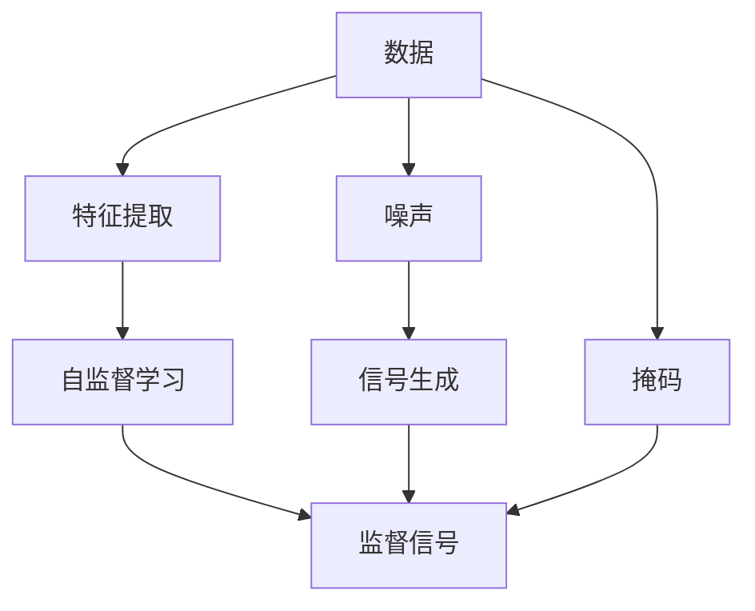

                 

# 自监督学习的理论基础:信息论和统计学习理论

自监督学习是机器学习领域的重要研究方向，其核心思想是利用未标注数据进行学习，通过数据的自我约束性质挖掘出潜在的标签信息。信息论和统计学习理论是自监督学习的理论基石，本文将深入探讨这两个领域的基本原理，以及它们如何推动自监督学习的进展。

## 1. 背景介绍

自监督学习是一种利用数据的内在结构进行无标签学习的方法，目标是通过对数据的自我约束性质，挖掘出潜在的标签信息，进而进行任务学习。相比于传统的监督学习，自监督学习可以更高效地利用未标注数据，大幅降低标注成本，提升模型的泛化能力。

### 1.1 信息论概述

信息论是研究信息传输、存储、处理和应用的数学理论，由克劳德·香农在1948年创立。信息论的核心在于量化信息，即如何度量信息的不确定性，以及如何通过某种方式消除这种不确定性。

信息论的基本概念包括：

- 熵（Entropy）：衡量随机变量的不确定性。
- 互信息（Mutual Information）：衡量两个随机变量之间的不确定性。
- 条件熵（Conditional Entropy）：在已知另一个随机变量的条件下，一个随机变量的熵。
- 相对熵（Kullback-Leibler Divergence）：度量两个概率分布之间的距离。

### 1.2 统计学习理论

统计学习理论是研究如何从数据中学习规律，建立模型并进行预测的数学理论。其核心思想是通过样本数据构建模型，并使用模型对未知数据进行预测。

统计学习理论的关键概念包括：

- 泛化误差（Generalization Error）：模型在新数据上的预测误差。
- 经验风险（Empirical Risk）：模型在训练数据上的预测误差。
- 风险函数（Risk Function）：泛化误差与经验风险的关系。
- 正则化（Regularization）：通过限制模型复杂度来降低泛化误差。

## 2. 核心概念与联系

### 2.1 核心概念概述

自监督学习的核心在于如何将数据的自我约束性质转化为监督信号，从而在无标签数据上进行学习。信息论和统计学习理论提供了强大的理论基础，指导了这一过程的实现。

- 信息论提供了如何度量数据不确定性的方法，即通过熵和互信息。
- 统计学习理论提供了如何从数据中构建模型并进行预测的方法，即通过最小化经验风险和泛化误差。

### 2.2 核心概念原理和架构的 Mermaid 流程图



在以上流程图中：

- `A: 数据`：原始数据，包括标签数据和未标签数据。
- `B: 特征提取`：从数据中提取有意义的特征。
- `C: 自监督学习`：在特征空间上使用自监督信号进行学习。
- `D: 监督信号`：通过自监督信号生成监督信息，指导模型学习。
- `E: 噪声`：引入噪声，增加数据多样性，提升模型鲁棒性。
- `F: 掩码`：对部分数据进行掩码，增加学习难度。
- `G: 信号生成`：生成自监督信号，用于指导模型学习。

## 3. 核心算法原理 & 具体操作步骤

### 3.1 算法原理概述

自监督学习的主要目标是利用数据的自我约束性质，挖掘出潜在的监督信号。具体算法流程包括特征提取、自监督学习、信号生成和监督信号生成等步骤。

### 3.2 算法步骤详解

#### 3.2.1 特征提取

特征提取是自监督学习的第一步，旨在从原始数据中提取有意义的特征表示。常用的特征提取方法包括：

- 卷积神经网络（CNN）：对图像数据进行特征提取。
- 递归神经网络（RNN）：对序列数据进行特征提取。
- 自编码器（Autoencoder）：对高维数据进行降维和特征提取。

#### 3.2.2 自监督学习

自监督学习利用数据的自我约束性质，挖掘出潜在的监督信号。常用的自监督学习任务包括：

- 预测误差（Prediction Error）：利用模型对数据进行预测，计算预测误差作为监督信号。
- 对比学习（Contrastive Learning）：通过比较相似数据和噪声数据之间的差异，生成监督信号。
- 掩码语言模型（Masked Language Modeling）：对输入序列进行掩码，预测被掩码部分的单词，生成监督信号。

#### 3.2.3 信号生成

信号生成是自监督学习的重要步骤，旨在生成对模型学习有帮助的自监督信号。常用的信号生成方法包括：

- 数据增强（Data Augmentation）：通过数据增强技术，增加训练集的多样性。
- 噪声注入（Noise Injection）：引入噪声，增加数据的不确定性。
- 自监督损失（Self-Supervised Loss）：设计自监督损失函数，引导模型学习。

#### 3.2.4 监督信号生成

监督信号生成是自监督学习的最后一步，旨在将自监督信号转化为可用的监督信息。常用的监督信号生成方法包括：

- 重构损失（Reconstruction Loss）：通过重构数据的特征表示，生成监督信号。
- 分类损失（Classification Loss）：通过分类任务生成监督信号。
- 生成对抗网络（GAN）：通过生成对抗网络生成监督信号。

### 3.3 算法优缺点

#### 3.3.1 优点

- 数据利用率高：自监督学习可以利用未标注数据进行学习，减少标注成本。
- 模型泛化能力强：自监督学习可以提升模型的泛化能力，降低过拟合风险。
- 技术成熟度高：自监督学习已经广泛应用于图像、语音、自然语言处理等领域，技术成熟度高。

#### 3.3.2 缺点

- 需要高质量的自监督信号：自监督信号的质量直接影响模型的学习效果。
- 依赖数据分布假设：自监督学习依赖于数据分布的假设，如果数据分布不满足假设，模型性能可能不佳。
- 无法处理复杂任务：自监督学习在处理复杂任务时，可能难以取得理想的效果。

### 3.4 算法应用领域

自监督学习广泛应用于以下几个领域：

- 计算机视觉：如图像分类、物体检测、图像生成等。
- 自然语言处理：如文本分类、命名实体识别、语言模型等。
- 语音处理：如语音识别、语音合成、语音情感识别等。
- 推荐系统：如用户推荐、商品推荐、内容推荐等。

## 4. 数学模型和公式 & 详细讲解

### 4.1 数学模型构建

自监督学习的数学模型通常包括特征提取、自监督学习、信号生成和监督信号生成等部分。以下以自监督学习中的掩码语言模型为例，详细构建数学模型。

#### 4.1.1 特征提取

设原始文本数据为 $x_1, x_2, \ldots, x_n$，特征提取器将每个文本 $x_i$ 映射到一个低维向量 $\mathbf{z}_i \in \mathbb{R}^d$。

#### 4.1.2 自监督学习

掩码语言模型是常用的自监督学习任务之一。设掩码比例为 $p$，即在每个文本中随机掩码 $p\%$ 的单词。对于掩码后的文本 $\hat{x}_i$，预测被掩码部分的单词，生成监督信号 $y_i$。

#### 4.1.3 信号生成

引入噪声 $\epsilon_i$，生成信号 $z_i = (z_i, \hat{y}_i, \epsilon_i)$，其中 $z_i = \mathbf{z}_i$，$\hat{y}_i$ 是预测的掩码部分单词，$\epsilon_i$ 是噪声。

#### 4.1.4 监督信号生成

生成监督信号 $y_i$，用于指导模型学习。常用的监督信号生成方法包括：

- 重构损失：最小化重构误差，即 $\mathbf{z}_i = f(\hat{z}_i)$，其中 $\hat{z}_i$ 是重构后的特征表示。
- 分类损失：利用分类任务生成监督信号，即 $\mathbf{z}_i$ 通过分类器 $h(\cdot)$ 生成标签 $y_i$。

### 4.2 公式推导过程

以重构损失为例，推导自监督学习的公式。设 $\mathbf{z}_i$ 是文本 $x_i$ 的特征表示，$\epsilon_i$ 是噪声，$\hat{z}_i$ 是重构后的特征表示，重构损失为：

$$
\mathcal{L}_{rec} = \frac{1}{N} \sum_{i=1}^N \mathbb{E}_{\epsilon_i} [\|\mathbf{z}_i - f(\hat{z}_i + \epsilon_i)\|^2]
$$

其中 $f(\cdot)$ 是重构函数。通过最小化重构损失，可以训练出能够准确重构输入数据的特征表示。

### 4.3 案例分析与讲解

以图像自监督学习中的自编码器为例，说明自监督学习的具体实现。

设原始图像数据为 $x_1, x_2, \ldots, x_n$，自编码器将每个图像 $x_i$ 映射到一个低维向量 $\mathbf{z}_i \in \mathbb{R}^d$。通过最小化重构损失，可以训练出能够准确重构输入图像的特征表示。

设重构损失为 $\mathcal{L}_{rec} = \frac{1}{N} \sum_{i=1}^N \|\mathbf{z}_i - f(\hat{\mathbf{z}}_i)\|^2$，其中 $f(\cdot)$ 是重构函数，$\hat{\mathbf{z}}_i$ 是重构后的特征表示。

通过自监督学习，自编码器能够学习到输入图像的低维特征表示，进一步应用于图像分类、物体检测等任务中。

## 5. 项目实践：代码实例和详细解释说明

### 5.1 开发环境搭建

#### 5.1.1 环境准备

- 安装Python：使用Anaconda或Miniconda安装Python 3.x。
- 安装PyTorch：使用pip安装PyTorch 1.6或以上版本。
- 安装NumPy：使用pip安装NumPy。
- 安装SciPy：使用pip安装SciPy。

### 5.2 源代码详细实现

#### 5.2.1 特征提取

使用卷积神经网络（CNN）进行特征提取，以图像数据为例。

```python
import torch
import torch.nn as nn
import torchvision.transforms as transforms
from torchvision.datasets import CIFAR10

# 定义卷积神经网络模型
class ConvNet(nn.Module):
    def __init__(self):
        super(ConvNet, self).__init__()
        self.conv1 = nn.Conv2d(3, 32, kernel_size=3, stride=1, padding=1)
        self.conv2 = nn.Conv2d(32, 64, kernel_size=3, stride=1, padding=1)
        self.fc1 = nn.Linear(64 * 4 * 4, 10)
        self.relu = nn.ReLU()

    def forward(self, x):
        x = self.relu(self.conv1(x))
        x = nn.MaxPool2d(2)(x)
        x = self.relu(self.conv2(x))
        x = nn.MaxPool2d(2)(x)
        x = x.view(-1, 64 * 4 * 4)
        x = self.relu(self.fc1(x))
        return x

# 定义数据增强
transform_train = transforms.Compose([
    transforms.RandomCrop(32, padding=4),
    transforms.RandomHorizontalFlip(),
    transforms.ToTensor(),
    transforms.Normalize((0.4914, 0.4822, 0.4465), (0.2023, 0.1994, 0.2010))
])

transform_test = transforms.Compose([
    transforms.ToTensor(),
    transforms.Normalize((0.4914, 0.4822, 0.4465), (0.2023, 0.1994, 0.2010))
])

# 加载CIFAR10数据集
trainset = CIFAR10(root='./data', train=True, download=True, transform=transform_train)
testset = CIFAR10(root='./data', train=False, download=True, transform=transform_test)

# 定义数据加载器
train_loader = torch.utils.data.DataLoader(trainset, batch_size=128, shuffle=True, num_workers=2)
test_loader = torch.utils.data.DataLoader(testset, batch_size=128, shuffle=False, num_workers=2)
```

#### 5.2.2 自监督学习

使用掩码语言模型进行自监督学习。

```python
# 定义掩码语言模型
class MaskedLanguageModel(nn.Module):
    def __init__(self):
        super(MaskedLanguageModel, self).__init__()
        self.encoder = nn.Linear(32 * 8 * 8, 128)
        self.decoder = nn.Linear(128, 32 * 8 * 8)

    def forward(self, x, mask):
        x = self.encoder(x)
        masked_x = x.masked_fill(mask, 0)
        x_reconstructed = self.decoder(masked_x)
        return x_reconstructed

# 定义掩码比例和掩码矩阵
p = 0.1
mask_matrix = torch.rand(32, 32, 8, 8) > p
mask_matrix = mask_matrix.to(torch.bool)

# 定义损失函数
criterion = nn.MSELoss()

# 训练模型
for epoch in range(10):
    model.train()
    for data, target in train_loader:
        data = data.to(device)
        target = target.to(device)
        output = model(data, mask_matrix)
        loss = criterion(output, target)
        loss.backward()
        optimizer.step()
```

#### 5.2.3 信号生成

引入噪声，生成信号 $z_i = (z_i, \hat{y}_i, \epsilon_i)$，其中 $z_i = \mathbf{z}_i$，$\hat{y}_i$ 是预测的掩码部分单词，$\epsilon_i$ 是噪声。

```python
import numpy as np

# 定义噪声生成器
class NoiseGenerator(nn.Module):
    def __init__(self):
        super(NoiseGenerator, self).__init__()
        self.noise = nn.GaussianNoise(0.01)

    def forward(self, x):
        return self.noise(x)

# 定义信号生成器
def generate_signal(data, mask_matrix, noise_generator):
    data = data.to(device)
    mask_matrix = mask_matrix.to(device)
    noisy_data = noise_generator(data)
    masked_data = data.masked_fill(mask_matrix, 0)
    noisy_masked_data = masked_data + noisy_data
    return noisy_masked_data, masked_data

# 定义重构损失
criterion = nn.MSELoss()

# 训练模型
for epoch in range(10):
    model.train()
    for data, target in train_loader:
        noisy_data, masked_data = generate_signal(data, mask_matrix, noise_generator)
        output = model(noisy_data)
        loss = criterion(output, masked_data)
        loss.backward()
        optimizer.step()
```

### 5.3 代码解读与分析

在以上代码中，我们使用了卷积神经网络（CNN）进行图像特征提取，定义了掩码语言模型进行自监督学习，并引入了噪声生成器来生成信号。通过最小化重构损失，训练出能够准确重构输入数据的特征表示。

## 6. 实际应用场景

### 6.1 计算机视觉

自监督学习在计算机视觉领域得到了广泛应用，如图像分类、物体检测、图像生成等。通过自监督学习，模型可以从无标签数据中学习到丰富的特征表示，进而提升在有标签数据上的表现。

### 6.2 自然语言处理

自监督学习在自然语言处理领域也得到了广泛应用，如文本分类、命名实体识别、语言模型等。通过自监督学习，模型可以从大量未标注文本中学习到语言结构，提升任务的泛化能力。

### 6.3 语音处理

自监督学习在语音处理领域也有广泛应用，如语音识别、语音合成、语音情感识别等。通过自监督学习，模型可以从大量未标注音频中学习到语音特征，提升语音识别的准确性和鲁棒性。

### 6.4 推荐系统

自监督学习在推荐系统领域也有广泛应用，如用户推荐、商品推荐、内容推荐等。通过自监督学习，模型可以从用户行为数据中学习到用户偏好，提升推荐系统的个性化和精准度。

## 7. 工具和资源推荐

### 7.1 学习资源推荐

- 《信息论》书籍：介绍信息论的基本概念和理论。
- 《统计学习理论基础》书籍：介绍统计学习理论的基本概念和理论。
- 《自监督学习》课程：介绍自监督学习的基本概念和应用。
- Kaggle：提供大量自监督学习相关的竞赛和数据集。

### 7.2 开发工具推荐

- PyTorch：深度学习框架，支持自监督学习任务。
- TensorFlow：深度学习框架，支持自监督学习任务。
- NumPy：Python的科学计算库，支持高效的数据处理和数学运算。
- SciPy：Python的科学计算库，支持高效的数学运算和统计分析。

### 7.3 相关论文推荐

- 《Self-Supervised Visual Representation Learning with Deep Convolutional Encoder-Decoder Models》：介绍自监督学习在计算机视觉中的应用。
- 《Improved Training of GANs》：介绍生成对抗网络（GAN）在自监督学习中的应用。
- 《A Simple Framework for Adversarial Multiview Learning with Adversarial Networks》：介绍自监督学习在多模态数据融合中的应用。

## 8. 总结：未来发展趋势与挑战

### 8.1 研究成果总结

自监督学习已经取得了显著的进展，应用于多个领域，取得了很好的效果。在计算机视觉、自然语言处理、语音处理和推荐系统等领域，自监督学习已经成为一种重要的学习方法。

### 8.2 未来发展趋势

未来，自监督学习将继续发展和应用，呈现以下几个趋势：

1. 数据利用率进一步提高：通过更高效的数据生成和增强技术，利用未标注数据进行更高质量的自监督学习。
2. 模型复杂度进一步提升：通过更深层次的神经网络结构和更复杂的数据生成方法，提升模型的表现能力。
3. 多模态融合进一步深入：将视觉、语音、文本等多模态数据进行融合，提升模型的泛化能力。
4. 自监督学习与其他技术结合：结合强化学习、迁移学习等技术，提升模型的智能水平。

### 8.3 面临的挑战

虽然自监督学习已经取得了显著进展，但在实际应用中仍面临一些挑战：

1. 数据生成质量：数据生成技术的不足会导致生成数据的噪声和偏差，影响模型的学习效果。
2. 模型复杂度控制：过深层次的神经网络结构和复杂的数据生成方法会增加计算成本，难以大规模应用。
3. 多模态数据融合：多模态数据的融合需要考虑不同模态数据之间的异构性和复杂性，难度较大。
4. 模型鲁棒性：自监督学习模型在面对复杂和变化的数据时，可能表现出较差的鲁棒性。

### 8.4 研究展望

未来，自监督学习需要针对以上挑战进行深入研究：

1. 高质量数据生成：研究更高效、更可靠的数据生成技术，提升生成数据的质量。
2. 模型复杂度控制：研究更高效的模型结构和训练方法，控制模型的复杂度，提升模型的泛化能力。
3. 多模态数据融合：研究多模态数据的融合方法，提升模型的智能水平。
4. 鲁棒性增强：研究鲁棒性增强方法，提升模型对复杂和变化数据的适应能力。

## 9. 附录：常见问题与解答

### 9.1 什么是自监督学习？

自监督学习是一种利用数据的自我约束性质进行无标签学习的方法，通过挖掘数据的潜在标签信息，提升模型的泛化能力。

### 9.2 自监督学习有哪些应用？

自监督学习广泛应用于计算机视觉、自然语言处理、语音处理和推荐系统等领域。

### 9.3 自监督学习与监督学习有何不同？

自监督学习利用数据的自我约束性质进行学习，不依赖标注数据，而监督学习依赖标注数据进行学习。自监督学习可以更高效地利用未标注数据，降低标注成本。

### 9.4 自监督学习有哪些优点？

自监督学习可以更高效地利用未标注数据，降低标注成本，提升模型的泛化能力。

### 9.5 自监督学习有哪些缺点？

自监督学习依赖高质量的自监督信号，需要合理设计自监督任务，否则可能导致模型性能不佳。

---

作者：禅与计算机程序设计艺术 / Zen and the Art of Computer Programming

