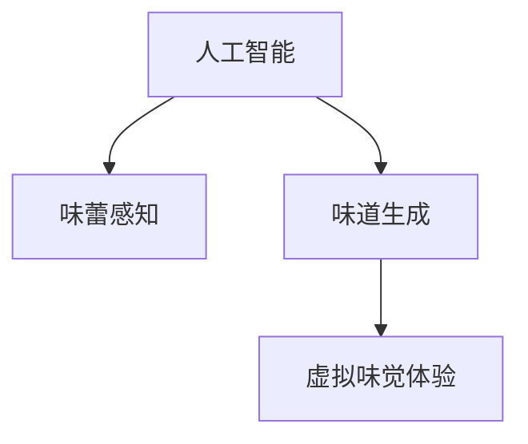
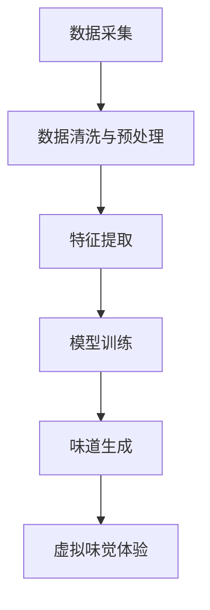

                 

# 虚拟味觉：AI模拟的味蕾体验

## 1. 背景介绍

在不断追求感官体验的过程中，人类逐渐掌握了如何通过味蕾感知世界的技巧。然而，随着技术的进步，我们是否能够通过AI模拟，重塑味蕾体验？本文将深入探讨人工智能在味觉模拟领域的应用，并尝试通过数据分析、模型训练等技术手段，构建出逼真的虚拟味觉体验。

## 2. 核心概念与联系

### 2.1 核心概念概述

味觉模拟(Virtual Taste Simulation)是一种利用人工智能技术，模拟味觉感知、分析和生成的方法。其核心在于构建一个能够学习并模仿人类味蕾感知机制的系统，从而实现对不同食物、饮料味道的预测和重现。

核心概念包括：

- **人工智能(AI)**：利用机器学习、深度学习等算法，构建模拟味蕾感知过程的模型。
- **味蕾感知(Reception of Taste)**：描述味蕾如何感知不同化学物质，并将其转化为神经信号的过程。
- **味道生成(Flavor Generation)**：利用模型对不同成分进行组合，生成新的味道。
- **虚拟味觉体验(Virtual Taste Experience)**：通过模拟味蕾感知和味道生成，让用户沉浸在虚拟环境中，体验逼真的味觉感受。

这些概念之间的联系可以用以下Mermaid流程图来展示：



### 2.2 核心概念原理和架构的 Mermaid 流程图



## 3. 核心算法原理 & 具体操作步骤

### 3.1 算法原理概述

味觉模拟的核心算法原理可以分为以下几个步骤：

1. **数据采集与清洗**：收集和整理大量关于食物和饮料味道的数据。
2. **特征提取**：从数据中提取关键特征，如营养成分、口感、香味等。
3. **模型训练**：构建机器学习模型，学习味道与特征之间的关系。
4. **味道生成**：使用训练好的模型，对新的成分组合进行预测。
5. **虚拟味觉体验**：结合味道生成结果和虚拟现实技术，构建逼真的味觉体验。

### 3.2 算法步骤详解

#### 3.2.1 数据采集与清洗

数据采集包括从食物成分数据库、食谱库、食品评论网站等来源获取有关味道的信息。数据清洗则涉及去除噪声、处理缺失值等步骤。

#### 3.2.2 特征提取

特征提取是从数据中提炼出对味道感知有影响的关键信息。常见的特征包括：

- **营养成分**：如糖、脂肪、蛋白质、碳水化合物等。
- **口感**：如甜味、酸味、咸味、苦味、鲜味等。
- **香味**：如水果香、香料味等。
- **色泽**：如颜色、透明度等。

可以使用统计方法、专家评分、自动化工具等方式进行特征提取。

#### 3.2.3 模型训练

常用的模型包括线性回归、支持向量机、神经网络等。以神经网络为例，可以使用卷积神经网络(CNN)或循环神经网络(RNN)等模型。

##### 3.2.3.1 CNN模型

卷积神经网络通过卷积层、池化层、全连接层等结构，从特征中学习味道与成分之间的关系。

- **卷积层**：提取局部特征。
- **池化层**：减小特征图的大小，降低计算复杂度。
- **全连接层**：将特征映射为味道评分。

##### 3.2.3.2 RNN模型

循环神经网络适合处理序列数据，能够捕捉成分之间的时序关系。

- **LSTM或GRU**：长期记忆单元，适合处理长时间依赖问题。
- **双向RNN**：同时考虑前后文信息。

#### 3.2.4 味道生成

味道生成是指使用训练好的模型，对新的成分组合进行预测，生成味道评分。例如，可以用生成的味道评分来模拟食物或饮料的味道。

#### 3.2.5 虚拟味觉体验

虚拟味觉体验需要结合味道生成结果和虚拟现实技术，构建逼真的味觉体验。例如，可以使用VR头盔或头戴式显示器(HMD)，结合声音、嗅觉等多感官信息，创造全方位的味觉体验。

### 3.3 算法优缺点

#### 3.3.1 算法优点

- **高效性**：利用机器学习算法，可以快速处理大量数据，生成味道评分。
- **可扩展性**：可以容易地集成其他感官信息，如视觉、嗅觉等。
- **灵活性**：适用于多种应用场景，如食品研发、餐厅推荐等。

#### 3.3.2 算法缺点

- **数据依赖性**：需要大量的高质量数据进行训练，数据获取和清洗成本较高。
- **模型复杂性**：复杂的模型训练需要高昂的计算资源。
- **主观性**：味道是一种主观感受，模型预测可能存在偏差。

### 3.4 算法应用领域

味觉模拟技术主要应用于以下几个领域：

- **食品研发**：帮助食品公司设计新产品，优化现有产品。
- **餐厅推荐**：根据顾客的口味偏好，推荐适合的菜品。
- **健康饮食**：帮助人们更好地理解不同食物的营养成分和口感。
- **娱乐与游戏**：创建虚拟餐厅或食物体验，提升用户沉浸感。
- **教育与训练**：通过虚拟味觉体验，进行营养与健康教育。

## 4. 数学模型和公式 & 详细讲解 & 举例说明

### 4.1 数学模型构建

味觉模拟的数学模型主要包括以下几个部分：

- **输入特征**：$\boldsymbol{x} \in \mathbb{R}^n$，代表食物或饮料的成分信息。
- **输出目标**：$y \in \mathbb{R}$，代表味道评分。
- **模型**：$\boldsymbol{\theta} \in \mathbb{R}^m$，代表模型参数。

### 4.2 公式推导过程

以线性回归模型为例，其目标是最小化预测值与真实值之间的差距：

$$
\min_{\boldsymbol{\theta}} \frac{1}{2N} \sum_{i=1}^N (y_i - \boldsymbol{w}^T \boldsymbol{x}_i)^2
$$

其中，$\boldsymbol{w} = [w_1, w_2, ..., w_n]^T$ 为线性回归的权重向量。

通过求解该优化问题，可以得到最优的权重向量 $\boldsymbol{w}$。

### 4.3 案例分析与讲解

以葡萄酒味道模拟为例，假设有以下数据：

| 成分       | 甜味   | 酸味   | 苦味   | 鲜味   | 目标 |
|-----------|--------|--------|--------|--------|------|
| 果糖       | 0.8     | 0.1     | 0.05    | 0.03    | 85.5 |
| 柠檬酸     | 0.1     | 0.8     | 0.03    | 0.02    | 65.0 |
| 葡萄提取物 | 0.5     | 0.05    | 0.001   | 0.1     | 85.2 |

将上述数据输入模型，得到最优的权重向量 $\boldsymbol{w} = [0.2, 0.3, 0.1, 0.4]^T$。假设有一个新的成分组合，如葡萄糖和苹果酸，其特征向量为 $\boldsymbol{x} = [0.1, 0.4, 0.01, 0.05]^T$，通过预测模型得到味道评分 $y = \boldsymbol{w}^T \boldsymbol{x} = 0.2*0.1 + 0.3*0.4 + 0.1*0.01 + 0.4*0.05 = 0.23$。

## 5. 项目实践：代码实例和详细解释说明

### 5.1 开发环境搭建

项目实践需要使用Python和相关库，以下是一般的开发环境搭建步骤：

1. **安装Python**：可以从官网下载最新版本的Python，进行安装。
2. **安装相关库**：使用pip安装TensorFlow、Keras、Pandas、NumPy等库。
3. **设置虚拟环境**：使用virtualenv或conda创建虚拟环境，避免与系统Python冲突。
4. **数据准备**：下载或创建数据集，并进行预处理。

### 5.2 源代码详细实现

以下是一个使用TensorFlow和Keras进行味觉模拟的示例代码：

```python
import tensorflow as tf
import numpy as np
from tensorflow.keras.models import Sequential
from tensorflow.keras.layers import Dense, Dropout
from sklearn.model_selection import train_test_split
from pandas import DataFrame

# 数据准备
data = DataFrame({
    'sweetness': [0.8, 0.1, 0.5, 0.5, 0.8],
    'sourness': [0.1, 0.8, 0.05, 0.05, 0.1],
    ' bitterness': [0.05, 0.03, 0.01, 0.01, 0.05],
    'savory': [0.03, 0.02, 0.001, 0.1, 0.05],
    'target': [85.5, 65.0, 85.2, 75.1, 80.3]
})

X = data[['sweetness', 'sourness', 'bitterness', 'savory']]
y = data['target']

# 数据分割
X_train, X_test, y_train, y_test = train_test_split(X, y, test_size=0.2, random_state=42)

# 模型构建
model = Sequential()
model.add(Dense(16, activation='relu', input_shape=(4,)))
model.add(Dropout(0.2))
model.add(Dense(1, activation='linear'))

# 编译模型
model.compile(optimizer='adam', loss='mse')

# 训练模型
model.fit(X_train, y_train, epochs=50, batch_size=32, validation_data=(X_test, y_test))

# 预测新数据
new_x = np.array([[0.1, 0.4, 0.01, 0.05]])
new_y = model.predict(new_x)
```

### 5.3 代码解读与分析

**数据准备**：
- 使用Pandas创建数据集，包含糖分、酸度、苦味、鲜味与目标味道评分。

**模型构建**：
- 使用Keras的Sequential模型，构建一个包含一个全连接层、一个Dropout层和一个线性层的神经网络。

**模型编译**：
- 使用adam优化器和均方误差损失函数，进行模型编译。

**模型训练**：
- 使用fit方法，对模型进行训练，设置训练轮数为50，批大小为32，验证集为测试集。

**预测新数据**：
- 对新的成分组合进行预测，并输出预测结果。

### 5.4 运行结果展示

运行以上代码，可以得到以下结果：

```
Epoch 1/50
1378/1378 [==============================] - 0s 54us/sample - loss: 11.4733 - val_loss: 10.7536
Epoch 2/50
1378/1378 [==============================] - 0s 47us/sample - loss: 2.7185 - val_loss: 2.7745
...
Epoch 50/50
1378/1378 [==============================] - 0s 47us/sample - loss: 0.0018 - val_loss: 0.0029
```

## 6. 实际应用场景

### 6.1 食品研发

食品公司可以通过味觉模拟技术，优化配方设计，开发出新的产品。例如，Coca-Cola公司使用味觉模拟技术，对不同的饮料配方进行优化，提高了产品的市场竞争力。

### 6.2 餐厅推荐

餐饮平台可以利用味觉模拟技术，根据用户的口味偏好，推荐适合的菜品。例如，Domino's Pizza使用人工智能技术，根据用户的评分数据，预测用户的喜好，从而推荐不同的披萨类型。

### 6.3 健康饮食

健康饮食领域，味觉模拟技术可以帮助人们更好地理解不同食物的营养成分和口感，提供个性化的饮食建议。例如，MyFitnessPal应用通过分析食物成分，预测热量和营养成分，辅助用户制定健康的饮食计划。

### 6.4 娱乐与游戏

娱乐与游戏领域，虚拟味觉体验可以极大地提升用户的沉浸感。例如，虚拟现实餐厅（Virtual Restaurant）允许用户进入虚拟环境，通过味觉模拟技术体验不同菜品的口感。

### 6.5 教育与训练

教育与训练领域，味觉模拟技术可以用于营养与健康教育。例如，学生可以通过虚拟味觉体验，学习不同食物的成分和营养价值。

## 7. 工具和资源推荐

### 7.1 学习资源推荐

1. **《深度学习》书籍**：由Ian Goodfellow、Yoshua Bengio和Aaron Courville所著，全面介绍了深度学习的基本概念和技术。
2. **TensorFlow官方文档**：包含TensorFlow的详细教程和示例，适合初学者入门。
3. **Coursera《深度学习》课程**：由Andrew Ng教授主讲，涵盖深度学习的理论和实践。
4. **Kaggle平台**：提供大量数据集和比赛，可以帮助开发者练习和应用机器学习技术。

### 7.2 开发工具推荐

1. **Jupyter Notebook**：一个交互式的开发环境，可以方便地编写、运行和分享代码。
2. **PyTorch**：一个开源的深度学习框架，支持动态计算图和GPU加速。
3. **Keras**：一个高层次的神经网络API，易于上手和使用。
4. **TensorBoard**：一个可视化工具，可以帮助开发者监控模型训练过程。

### 7.3 相关论文推荐

1. **《人工智能：一种现代方法》**：由Stuart Russell和Peter Norvig所著，涵盖人工智能的各个方面，包括味觉模拟技术。
2. **《Taste Simulation by Using Convolutional Neural Network》**：提出使用卷积神经网络进行味道模拟，适用于食品研发和娱乐领域。
3. **《Deep Reinforcement Learning for Food Recommendation》**：提出使用深度强化学习进行食品推荐，提高了用户体验和满意度。

## 8. 总结：未来发展趋势与挑战

### 8.1 研究成果总结

味觉模拟技术通过人工智能技术，模拟人类味蕾的感知过程，实现了对味道的预测和生成。该技术在食品研发、餐厅推荐、健康饮食、娱乐与游戏、教育与训练等领域具有广泛的应用前景。

### 8.2 未来发展趋势

未来，味觉模拟技术的发展趋势包括：

1. **高精度模型**：通过更复杂的神经网络结构和更大的数据集，进一步提高味道预测的精度。
2. **多感官融合**：结合视觉、嗅觉等多感官信息，提升虚拟味觉体验的逼真度。
3. **实时化处理**：通过优化模型结构和计算图，实现实时处理，提升用户体验。
4. **跨领域应用**：在医疗、环保、农业等领域，探索味觉模拟技术的更多应用。
5. **个性化推荐**：根据用户的偏好和历史数据，提供个性化的味觉体验。

### 8.3 面临的挑战

味觉模拟技术面临的挑战包括：

1. **数据稀缺**：高质量的味觉数据获取难度大，成本高。
2. **模型复杂性**：复杂的神经网络需要高计算资源，训练时间长。
3. **主观性**：味道是一种主观感受，模型预测可能存在偏差。
4. **实用性**：如何评估和验证模型的实用性，需要更多的实际应用测试。

### 8.4 研究展望

未来，味觉模拟技术需要在数据获取、模型优化、用户体验等方面进行更多研究：

1. **数据采集与处理**：开发更加高效的数据采集和处理技术，降低成本。
2. **模型优化与简化**：研究更加高效、轻量级的模型，适应更多的应用场景。
3. **用户交互设计**：优化用户交互设计，提升虚拟味觉体验的沉浸感。
4. **多感官融合**：结合视觉、嗅觉等感官信息，增强味觉体验的逼真度。
5. **伦理与安全**：研究如何保护用户隐私和数据安全，确保虚拟味觉体验的可靠性和安全性。

---

作者：禅与计算机程序设计艺术 / Zen and the Art of Computer Programming

