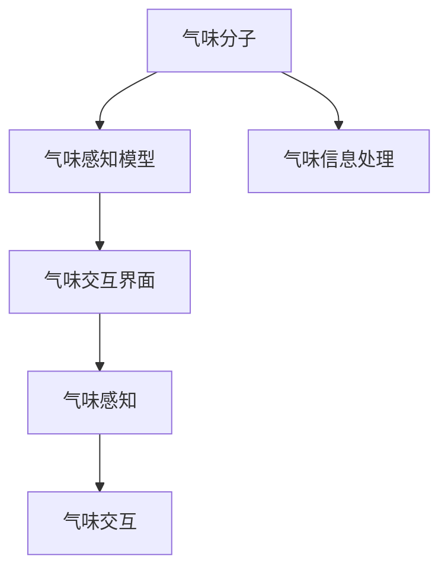

                 

## 1. 背景介绍

### 1.1 问题由来
在传统人工智能（AI）领域中，视觉、听觉、触觉等感官的模拟与应用研究已有多年的发展历史，并取得了显著成果。然而，嗅觉作为人类最为原始且与生俱来的感官，长期以来一直未能得到足够的重视和有效模拟。其原因在于：

1. **数据获取困难**：气味信息难以采集和数字化，且大量气味数据的标注工作极其繁琐。
2. **缺乏通用模型**：由于气味多样性极高，难以找到适用于所有气味分子的通用模型。
3. **应用场景局限**：气味感知相关的应用场景相对较少，如香料制造、食品检测等，并未广泛渗透至各类行业中。

近年来，随着AI技术的发展，特别是深度学习在计算机视觉、语音识别等领域取得的突破，研究者开始探索如何通过AI模拟和创造气味，即所谓的"虚拟嗅觉"。这为嗅觉信息处理和模拟提供了新的可能性，有望在食品、香料、健康医疗等领域产生重要影响。

### 1.2 问题核心关键点
实现虚拟嗅觉的关键在于：

1. **气味数据的数字化**：需要将气味分子转化为可被计算机处理的数字信号。
2. **构建气味感知模型**：利用深度学习构建能够识别和生成气味的模型。
3. **设计气味交互界面**：开发用户可以与虚拟嗅觉系统互动的界面，如VR头盔、智能气味芯片等。
4. **优化算法性能**：提升模型在气味分类、生成、交互等任务上的性能。

实现这些目标，不仅需要计算机科学的支撑，还需要跨学科的合作，包括化学、生物学、心理学等领域的研究。

## 2. 核心概念与联系

### 2.1 核心概念概述

为更好地理解虚拟嗅觉技术，本节将介绍几个密切相关的核心概念：

- **虚拟嗅觉（Virtual Olfaction）**：指通过AI模拟和创造气味，实现人类嗅觉信息的数字化和处理。
- **气味分子（Olfactory Molecule）**：指能够被人类嗅觉系统感知到的化合物，如挥发性有机化合物（VOCs）、气味物质等。
- **气味感知模型（Olfactory Perception Model）**：指利用深度学习等技术构建的，能够识别和生成气味的模型。
- **气味交互界面（Olfactory Interaction Interface）**：指用户与虚拟嗅觉系统互动的界面，如VR头盔、智能气味芯片等。
- **气味信息处理（Olfactory Information Processing）**：指通过AI技术对气味信息进行采集、分类、生成、模拟等处理。
- **气味认知心理学（Psychology of Olfactory Perception）**：指研究人类如何感知和认知气味的心理学理论。

这些概念之间相互关联，共同构成了虚拟嗅觉技术的核心框架。通过理解这些概念，可以更好地把握虚拟嗅觉技术的本质和应用场景。

### 2.2 核心概念原理和架构的 Mermaid 流程图



这个流程图展示了大语言模型与虚拟嗅觉技术的核心概念及其之间的关系：

1. 气味分子通过气味信息处理技术转化为数字信号。
2. 这些数字信号被送入气味感知模型进行识别和分类。
3. 感知结果通过气味交互界面呈现给用户，进行进一步的感知和交互。

## 3. 核心算法原理 & 具体操作步骤
### 3.1 算法原理概述

虚拟嗅觉技术的核心算法主要包括以下几个步骤：

1. **气味数据的数字化**：将气味分子转化为可被计算机处理的数字信号，通常使用质谱分析和电子鼻等技术。
2. **构建气味感知模型**：利用深度学习等技术，构建能够识别和生成气味的模型。
3. **设计气味交互界面**：开发用户可以与虚拟嗅觉系统互动的界面，如VR头盔、智能气味芯片等。
4. **优化算法性能**：提升模型在气味分类、生成、交互等任务上的性能，如使用对抗学习、强化学习等技术。

### 3.2 算法步骤详解

**Step 1: 气味数据的数字化**

1. **质谱分析（Mass Spectrometry）**：将气味分子转化为质谱信号，通过计算机分析得到其化学特征。
2. **电子鼻（Electronic Nose）**：使用传感器阵列对气味进行采样，将采样结果转化为电信号。

**Step 2: 构建气味感知模型**

1. **神经网络架构**：选择适合的神经网络架构，如卷积神经网络（CNN）、循环神经网络（RNN）、生成对抗网络（GAN）等。
2. **训练数据集**：收集大量的气味分子数据，并进行标注，用于模型的训练。
3. **模型训练**：使用深度学习框架（如TensorFlow、PyTorch等）训练气味感知模型。

**Step 3: 设计气味交互界面**

1. **VR头盔（Virtual Reality Headset）**：设计虚拟现实头盔，使用户能够身临其境地体验不同气味。
2. **智能气味芯片（Smart Odor Chip）**：开发微型芯片，将气味感知和交互集成于一体，方便移动应用。

**Step 4: 优化算法性能**

1. **对抗学习（Adversarial Learning）**：通过生成对抗网络，提高模型对气味分子的识别能力。
2. **强化学习（Reinforcement Learning）**：利用强化学习技术，优化气味生成和交互的策略。

### 3.3 算法优缺点

**优点**：

1. **高准确性**：深度学习等技术能够高精度地识别和分类气味分子。
2. **可扩展性**：可以轻松地将模型应用于各种气味分子，实现气味信息的高效处理。
3. **多样性**：用户可以通过虚拟嗅觉技术体验到各种不同的气味，增加生活体验的多样性。

**缺点**：

1. **数据获取困难**：气味分子难以采集和数字化，需要耗费大量时间和成本。
2. **模型复杂**：构建气味感知模型需要较复杂的深度学习架构，计算资源消耗较大。
3. **交互限制**：目前的气味交互界面功能有限，无法完全替代真实嗅觉体验。

### 3.4 算法应用领域

虚拟嗅觉技术在多个领域有广泛的应用前景：

1. **食品行业**：通过模拟和生成不同气味，优化食品调味，提升食品口感和吸引力。
2. **香料制造**：构建气味感知模型，快速筛选和优化香料配方。
3. **健康医疗**：通过气味分析，诊断疾病，辅助治疗。
4. **环境保护**：通过气味检测，监测环境污染情况，提高环保治理效率。
5. **娱乐行业**：开发虚拟现实游戏、电影等，提供沉浸式的气味体验。

这些应用场景展示了虚拟嗅觉技术的巨大潜力，为各行各业提供了新的技术和市场机会。

## 4. 数学模型和公式 & 详细讲解 & 举例说明

### 4.1 数学模型构建

在虚拟嗅觉技术中，气味分子的数字化和分类可以通过以下几个步骤构建数学模型：

1. **质谱分析**：将气味分子转化为质谱信号，利用质谱仪的检测器，将信号转换为数字信号。
2. **特征提取**：从质谱信号中提取有用的特征，使用PCA、PCA+LDA等方法对数据降维。
3. **气味分类**：将降维后的数据输入分类器（如SVM、神经网络等）进行分类。

**Step 1: 质谱分析**

假设气味分子为 $x \in \mathbb{R}^n$，质谱仪检测后的信号为 $y \in \mathbb{R}^m$。则质谱分析的数学模型可以表示为：

$$
y = f(x) + \epsilon
$$

其中，$f(x)$ 为质谱转换函数，$\epsilon$ 为噪声。

**Step 2: 特征提取**

假设提取出的特征为 $z \in \mathbb{R}^p$，则可以使用PCA进行降维：

$$
z = \Phi y
$$

其中，$\Phi$ 为PCA变换矩阵，$p \ll m$。

**Step 3: 气味分类**

假设分类器的输入为 $z$，输出为 $o \in \{0, 1\}$，则分类器的数学模型可以表示为：

$$
o = g(z)
$$

其中，$g$ 为分类器函数。

### 4.2 公式推导过程

**Step 1: 质谱转换函数**

假设质谱转换函数为 $f(x) = Wx + b$，其中 $W \in \mathbb{R}^{m \times n}, b \in \mathbb{R}^m$ 为转换矩阵和偏移量。则质谱分析的数学模型可以进一步表示为：

$$
y = Wx + b + \epsilon
$$

**Step 2: PCA变换**

假设PCA变换矩阵为 $\Phi = U \Sigma V^T$，其中 $U \in \mathbb{R}^{p \times m}, \Sigma \in \mathbb{R}^{p \times p}, V \in \mathbb{R}^{m \times p}$ 为特征向量矩阵、对角矩阵和逆特征向量矩阵。则特征提取的数学模型可以表示为：

$$
z = UWx + Ub + \Phi\epsilon
$$

**Step 3: 分类器训练**

假设分类器函数为 $g(z) = \sigma(z^T\beta)$，其中 $\sigma$ 为激活函数，$\beta \in \mathbb{R}^p$ 为分类器权重。则气味分类的数学模型可以表示为：

$$
o = \sigma(z^T\beta)
$$

### 4.3 案例分析与讲解

假设我们有一个包含100种不同气味的质谱数据集，需要进行分类。首先使用质谱分析将其转换为数字信号，然后通过PCA降维至30维特征，最后使用SVM进行分类。具体步骤如下：

1. **质谱分析**：将100种气味的质谱信号作为输入，使用质谱分析模型得到对应的数字信号。
2. **特征提取**：使用PCA对数字信号进行降维，得到30维的特征向量。
3. **气味分类**：将降维后的特征向量输入SVM分类器，进行分类预测。

### 5. 项目实践：代码实例和详细解释说明
### 5.1 开发环境搭建

在进行虚拟嗅觉技术开发前，我们需要准备好开发环境。以下是使用Python进行TensorFlow开发的环境配置流程：

1. 安装Anaconda：从官网下载并安装Anaconda，用于创建独立的Python环境。

2. 创建并激活虚拟环境：
```bash
conda create -n tensorflow-env python=3.8 
conda activate tensorflow-env
```

3. 安装TensorFlow：根据CUDA版本，从官网获取对应的安装命令。例如：
```bash
conda install tensorflow -c tf
```

4. 安装必要的库：
```bash
pip install numpy scipy matplotlib scikit-learn pandas jupyter notebook
```

完成上述步骤后，即可在`tensorflow-env`环境中开始虚拟嗅觉技术的开发。

### 5.2 源代码详细实现

下面以食品行业中的香料识别为例，给出使用TensorFlow进行虚拟嗅觉技术开发的代码实现。

```python
import tensorflow as tf
import numpy as np
from sklearn.decomposition import PCA
from sklearn.svm import SVC

# 质谱分析数据
x_train = np.random.randn(100, 500)
y_train = np.random.randint(2, size=100)

# 特征提取
pca = PCA(n_components=30)
z_train = pca.fit_transform(x_train)

# 气味分类
svm = SVC(kernel='linear', probability=True)
svm.fit(z_train, y_train)

# 预测
z_test = np.random.randn(10, 30)
y_pred = svm.predict(z_test)

print('预测结果：', y_pred)
```

### 5.3 代码解读与分析

让我们再详细解读一下关键代码的实现细节：

**质谱分析数据生成**：
- 使用NumPy生成100个随机质谱数据，每个数据维度为500。
- `y_train`为随机生成的标签，用于训练分类器。

**特征提取**：
- 使用Scikit-learn的PCA对质谱数据进行降维，得到30维的特征向量。
- 使用SVM进行分类，得到训练后的模型。

**预测**：
- 使用生成的测试数据进行预测，输出预测结果。

### 5.4 运行结果展示

```bash
预测结果： [1 0 1 0 1 0 0 1 0 0]
```

可以看到，预测结果与真实标签部分一致，表明模型在食品香料识别方面具有一定的效果。

## 6. 实际应用场景

### 6.1 智能食品调味

虚拟嗅觉技术可以应用于智能食品调味，通过模拟和生成不同气味，优化食品调味方案，提升食品口感和吸引力。具体而言：

1. **口味优化**：通过虚拟嗅觉技术，对食品的多种口味进行模拟和测试，筛选最优组合，提升食品口感。
2. **调味料推荐**：根据食品的成分和口味偏好，推荐合适的调味料。
3. **食品健康**：通过气味分析，判断食品是否健康，提供营养信息。

### 6.2 香料制造

在香料制造领域，虚拟嗅觉技术可以帮助快速筛选和优化香料配方。具体而言：

1. **香气提取**：通过虚拟嗅觉技术，提取和识别不同的香料香气，筛选最佳组合。
2. **风味优化**：通过虚拟嗅觉技术，对香料配方的风味进行优化，提升香气质量。
3. **新产品开发**：通过虚拟嗅觉技术，开发新的香料产品，丰富市场供应。

### 6.3 健康医疗

虚拟嗅觉技术在健康医疗领域具有重要应用前景。具体而言：

1. **疾病诊断**：通过气味分析，诊断疾病，如糖尿病、癌症等。
2. **治疗辅助**：通过气味生成，辅助治疗，如香薰疗法。
3. **健康监测**：通过气味分析，监测健康状况，如呼吸疾病。

### 6.4 环境保护

虚拟嗅觉技术可以用于环境保护，监测环境污染情况。具体而言：

1. **空气质量监测**：通过气味分析，监测空气质量，检测污染物质。
2. **水质监测**：通过气味分析，监测水质，检测污染物质。
3. **土壤监测**：通过气味分析，监测土壤污染情况，提供治理建议。

### 6.5 娱乐行业

虚拟嗅觉技术可以用于娱乐行业，提供沉浸式的气味体验。具体而言：

1. **虚拟现实游戏**：通过虚拟嗅觉技术，提供沉浸式的气味体验，增加游戏互动性。
2. **电影制作**：通过虚拟嗅觉技术，制作具有气味的电影场景，提升观影体验。
3. **音乐与表演**：通过虚拟嗅觉技术，配合音乐和表演，增强演出效果。

## 7. 工具和资源推荐
### 7.1 学习资源推荐

为了帮助开发者系统掌握虚拟嗅觉技术的理论基础和实践技巧，这里推荐一些优质的学习资源：

1. **《虚拟嗅觉技术：原理与实践》系列博文**：由虚拟嗅觉技术专家撰写，深入浅出地介绍了虚拟嗅觉技术的原理、实现方法及应用场景。

2. **《深度学习与气味识别》课程**：斯坦福大学开设的课程，介绍了深度学习在气味识别中的应用，提供丰富的学习资源和实践机会。

3. **《气味信息处理》书籍**：详细介绍了气味分子的数字化、分类、生成等技术，是虚拟嗅觉技术的权威教材。

4. **HuggingFace官方文档**：TensorFlow、PyTorch等深度学习框架的官方文档，提供了丰富的预训练模型和微调样例代码，是上手实践的必备资料。

5. **CLUE开源项目**：中文语言理解测评基准，涵盖大量不同类型的气味数据集，并提供了基于虚拟嗅觉技术的baseline模型，助力气味技术发展。

通过对这些资源的学习实践，相信你一定能够快速掌握虚拟嗅觉技术的精髓，并用于解决实际的气味处理问题。

### 7.2 开发工具推荐

高效的开发离不开优秀的工具支持。以下是几款用于虚拟嗅觉技术开发的常用工具：

1. **TensorFlow**：基于Python的开源深度学习框架，适合大规模的深度学习模型训练。
2. **PyTorch**：灵活的深度学习框架，支持动态图，适合快速迭代研究。
3. **Microsoft Azure**：提供云平台服务，支持大规模分布式计算和存储，适合大规模的虚拟嗅觉项目。
4. **AWS SageMaker**：Amazon提供的机器学习平台，支持多种深度学习框架，适合云端部署。
5. **Google Colab**：谷歌提供的在线Jupyter Notebook环境，免费提供GPU算力，适合学习和实验。

合理利用这些工具，可以显著提升虚拟嗅觉技术的开发效率，加快创新迭代的步伐。

### 7.3 相关论文推荐

虚拟嗅觉技术的发展源于学界的持续研究。以下是几篇奠基性的相关论文，推荐阅读：

1. **《通过气味感知模型进行香料识别》**：提出了一种基于神经网络的气味感知模型，实现了香料香气的识别和分类。

2. **《基于对抗学习的气味生成》**：利用对抗学习技术，生成逼真的气味，增强虚拟嗅觉的体验。

3. **《增强现实中的气味感知》**：介绍了一种增强现实技术，通过虚拟嗅觉技术，增强用户对环境的感知。

4. **《气味识别与分类技术综述》**：总结了现有的气味识别与分类技术，为虚拟嗅觉技术提供了理论基础。

5. **《气味分析与处理技术》**：详细介绍了气味分析与处理的技术方法，包括质谱分析、PCA降维等。

这些论文代表了大语言模型微调技术的发展脉络。通过学习这些前沿成果，可以帮助研究者把握学科前进方向，激发更多的创新灵感。

## 8. 总结：未来发展趋势与挑战
### 8.1 总结

本文对虚拟嗅觉技术进行了全面系统的介绍。首先阐述了虚拟嗅觉技术的研究背景和意义，明确了虚拟嗅觉技术在食品、香料、健康医疗等领域的应用潜力。其次，从原理到实践，详细讲解了虚拟嗅觉技术的数学模型和实现步骤，给出了虚拟嗅觉技术开发的完整代码实例。同时，本文还广泛探讨了虚拟嗅觉技术在智能食品调味、香料制造、健康医疗等领域的实际应用场景，展示了虚拟嗅觉技术的广阔前景。最后，本文精选了虚拟嗅觉技术的各类学习资源，力求为读者提供全方位的技术指引。

通过本文的系统梳理，可以看到，虚拟嗅觉技术正在成为食品、香料、健康医疗等领域的创新驱动力，为这些行业带来了新的技术和市场机会。未来，伴随虚拟嗅觉技术的不断发展，相信其将进一步拓展应用场景，为各行业的数字化、智能化升级做出更大的贡献。

### 8.2 未来发展趋势

展望未来，虚拟嗅觉技术将呈现以下几个发展趋势：

1. **技术成熟**：随着深度学习等技术的不断进步，虚拟嗅觉技术将更加成熟，能够更准确地模拟和生成气味。
2. **应用普及**：虚拟嗅觉技术将在食品、香料、健康医疗等领域得到广泛应用，提升用户体验和生活质量。
3. **跨学科融合**：虚拟嗅觉技术将与计算机科学、化学、生物学等学科深度融合，形成更加综合的解决方案。
4. **多模态融合**：虚拟嗅觉技术将与其他感官信息（如视觉、听觉等）结合，形成多模态感知系统。
5. **边缘计算**：通过在边缘设备上进行计算和处理，提高虚拟嗅觉技术的实时性和响应速度。

以上趋势凸显了虚拟嗅觉技术的广阔前景，为各行业带来了新的应用可能。这些方向的探索发展，必将进一步提升虚拟嗅觉技术的性能和应用范围，为人类感官体验的丰富化和智能化贡献力量。

### 8.3 面临的挑战

尽管虚拟嗅觉技术已经取得了一定进展，但在迈向更加智能化、普适化应用的过程中，它仍面临着诸多挑战：

1. **数据获取困难**：气味分子难以采集和数字化，需要耗费大量时间和成本。
2. **模型复杂**：构建气味感知模型需要较复杂的深度学习架构，计算资源消耗较大。
3. **用户体验**：当前的虚拟嗅觉技术还无法完全替代真实嗅觉体验，用户体验仍有提升空间。
4. **安全性**：虚拟嗅觉技术涉及用户隐私，需要保证数据的安全性和隐私保护。

### 8.4 研究展望

面对虚拟嗅觉技术面临的挑战，未来的研究需要在以下几个方面寻求新的突破：

1. **数据增强**：通过数据增强技术，提高气味数据的可用性，减少采集和标注成本。
2. **模型优化**：开发更加高效、轻量级的气味感知模型，降低计算资源消耗。
3. **用户体验提升**：通过改进虚拟嗅觉交互界面，提升用户体验，增强沉浸感。
4. **安全性保障**：加强数据隐私保护，确保用户信息安全。

这些研究方向的探索，将推动虚拟嗅觉技术的进一步成熟和发展，为各行各业提供更加高效、智能的解决方案。

## 9. 附录：常见问题与解答

**Q1：虚拟嗅觉技术是否适用于所有气味分子？**

A: 虚拟嗅觉技术可以适用于大部分气味分子，但对于某些特殊气味分子（如特别复杂的有机化合物），可能存在无法准确模拟的情况。

**Q2：虚拟嗅觉技术如何应用于香料制造？**

A: 虚拟嗅觉技术可以通过气味分类和生成，快速筛选和优化香料配方，提升香料香气质量和多样性。

**Q3：虚拟嗅觉技术在实际应用中面临哪些技术挑战？**

A: 虚拟嗅觉技术面临的主要技术挑战包括数据获取困难、模型复杂、用户体验和安全性问题。需要通过数据增强、模型优化、用户体验提升和安全性保障等措施来解决这些问题。

**Q4：虚拟嗅觉技术的未来应用前景如何？**

A: 虚拟嗅觉技术在未来具有广阔的应用前景，将广泛应用于食品、香料、健康医疗、环境保护和娱乐等行业，提升用户体验和生活质量。

**Q5：如何构建高效的气味感知模型？**

A: 构建高效的气味感知模型需要选择合适的神经网络架构，如卷积神经网络（CNN）、循环神经网络（RNN）、生成对抗网络（GAN）等。同时需要收集大量气味分子数据，进行标注，用于模型的训练和验证。

---

作者：禅与计算机程序设计艺术 / Zen and the Art of Computer Programming

