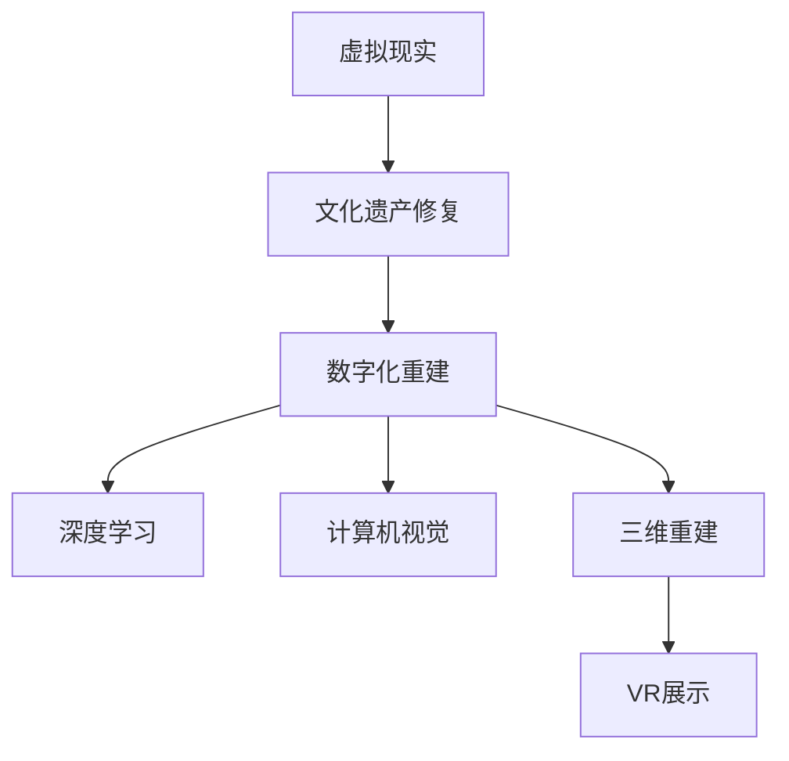

                 

# 虚拟文化遗产修复:全球文明记忆的数字化重建

> 关键词：虚拟现实, 文化遗产修复, 数字化重建, 深度学习, 计算机视觉, 三维重建

## 1. 背景介绍

### 1.1 问题由来

随着全球化的推进和科技的进步，文化遗产保护的重要性日益凸显。然而，许多历史悠久的文化遗址因战争、自然灾害、人为破坏等原因而受到严重破坏，甚至完全消失。文化遗产的丢失不仅意味着过去历史的丧失，更对当代社会的文化认同、精神传承和教育科研带来巨大影响。如何在尽可能不破坏原有遗迹的情况下，通过数字化手段重建和保存这些珍贵的人类文化遗产，成为当今科技领域的重要课题。

近年来，虚拟现实（Virtual Reality, VR）技术的迅猛发展，为文化遗产修复和数字化重建提供了新的解决方案。通过数字化重构和虚拟再现，人们可以在虚拟空间中跨越时间和空间限制，重新体验古代文明的辉煌，这对增强文化认同、促进文化传承具有重大意义。本文将重点介绍利用深度学习、计算机视觉和三维重建技术，对文化遗产进行虚拟修复和数字化重建的全过程。

### 1.2 问题核心关键点

本文聚焦于虚拟文化遗产修复的技术原理和实践方法，特别是在深度学习和三维重建技术的应用。核心问题包括：

- 如何通过高精度的深度学习算法，从极少量的数据中恢复文物细节？
- 如何在三维重建中，保证文物的几何和纹理信息准确一致？
- 如何通过虚拟现实技术，真实地再现文物原貌？
- 如何在修复过程中，有效利用专家知识和传统工艺？

### 1.3 问题研究意义

本文的研究旨在提供一种高效、低成本的虚拟文化遗产修复方法，不仅能够帮助保护和传承人类文明，还能为文化教育、科研、旅游等领域提供重要资源。通过虚拟修复，还能在一定程度上减轻对原文物的物理损伤，延缓其衰退速度。同时，该方法具有广阔的推广前景，适用于不同类型和规模的文化遗产保护项目。

## 2. 核心概念与联系

### 2.1 核心概念概述

为更好地理解虚拟文化遗产修复的原理和实践，本节将介绍几个关键概念：

- 虚拟现实（Virtual Reality, VR）：通过计算机技术生成的模拟环境，使用户能够通过视觉、听觉等感官体验虚拟世界。
- 文化遗产修复（Heritage Restoration）：通过现代科技手段，修复因各种原因受到破坏的文物古迹。
- 数字化重建（Digital Reconstruction）：利用计算机技术对原有文物进行三维重构，生成数字模型，供虚拟展示和研究使用。
- 深度学习（Deep Learning）：一种基于多层神经网络的学习范式，能够从大量数据中提取高层次特征，广泛应用于图像、语音、自然语言处理等领域。
- 计算机视觉（Computer Vision）：计算机对图像、视频等视觉信号进行分析和理解的技术，包括图像分割、特征提取、目标检测等。
- 三维重建（3D Reconstruction）：通过计算机视觉技术和深度学习算法，将二维图像或点云数据转换为三维模型。

这些概念之间通过以下Mermaid流程图相联系：



这个流程图展示了虚拟文化遗产修复的各个关键环节：首先通过虚拟现实技术，对文物进行修复和重建；接着利用深度学习和计算机视觉技术，对三维模型进行高精度的处理和优化；最后，通过虚拟现实技术，对文物进行真实再现和展示。

## 3. 核心算法原理 & 具体操作步骤
### 3.1 算法原理概述

虚拟文化遗产修复的核心在于通过深度学习和计算机视觉技术，从有限的文物图片或点云数据中，恢复其三维模型和纹理信息。具体来说，该过程包括三个主要步骤：

1. **文物数据收集**：通过无人机、相机等设备，对文物进行高精度的拍摄和扫描，获取其多角度、多尺度的数据。
2. **三维模型重建**：利用深度学习算法和计算机视觉技术，对文物数据进行分割、融合和修复，生成准确的三维模型。
3. **纹理信息复原**：通过深度学习算法，从文物图片或点云数据中提取纹理信息，并将其应用到三维模型上，使模型表面更具真实感。

### 3.2 算法步骤详解

#### 3.2.1 文物数据收集

文物数据收集是虚拟文化遗产修复的第一步。通过无人机、相机等设备，对文物进行高精度的拍摄和扫描，获取其多角度、多尺度的数据。具体来说，可以采用以下几种方式：

- **无人机拍摄**：通过无人机对文物进行空中俯视拍摄，获取其全景图像和三维坐标数据。
- **激光扫描**：使用激光扫描设备，获取文物表面的点云数据，用于生成高精度的三维模型。
- **立体成像**：利用立体相机拍摄文物，获取其双目或多目图像，用于后续的三维重建。

#### 3.2.2 三维模型重建

三维模型重建是虚拟文化遗产修复的核心步骤。在该步骤中，需要利用深度学习算法和计算机视觉技术，对文物数据进行分割、融合和修复，生成准确的三维模型。具体来说，可以采用以下方法：

- **点云对齐**：通过RANSAC等算法，对不同角度的激光扫描数据进行对齐，生成统一的三维坐标系。
- **图像分割**：利用语义分割算法，将不同类别的图像区域分割出来，用于后续的三维重建。
- **三维重建**：使用深度学习算法，如卷积神经网络（CNN）、生成对抗网络（GAN）等，对分割后的图像进行融合和修复，生成三维模型。

#### 3.2.3 纹理信息复原

纹理信息复原是使文物数字化再现更逼真的关键步骤。在该步骤中，需要从文物图片或点云数据中提取纹理信息，并将其应用到三维模型上。具体来说，可以采用以下方法：

- **纹理映射**：通过深度学习算法，将纹理信息映射到三维模型上，生成逼真的表面纹理。
- **图像修复**：利用深度学习算法，修复文物图片中的破损部分，生成更完整的高分辨率纹理图像。
- **纹理生成**：使用生成对抗网络（GAN）等深度学习模型，生成缺失的纹理信息，填补文物表面的空隙。

### 3.3 算法优缺点

#### 3.3.1 优点

虚拟文化遗产修复的深度学习算法和计算机视觉技术具有以下优点：

- **高精度**：深度学习算法能够从少量数据中提取高层次特征，实现高精度的三维重建和纹理复原。
- **自动化**：计算机视觉技术可以自动化处理大量数据，提高修复效率。
- **可扩展性**：深度学习模型可以通过迁移学习等方式，应用于不同类型的文化遗产修复。
- **低成本**：相比于传统的修复技术，虚拟修复的成本较低，且不受物理损伤限制。

#### 3.3.2 缺点

同时，该方法也存在一些局限性：

- **数据需求**：需要高质量的文物数据，否则重建效果难以保证。
- **计算资源**：深度学习模型需要大量的计算资源，特别是高分辨率纹理生成。
- **模型泛化**：对于特定文物的修复效果较好，但泛化到其他文物可能效果不佳。
- **后期处理**：需要人工介入，对重建后的模型进行后期处理和优化。

### 3.4 算法应用领域

虚拟文化遗产修复的深度学习算法和计算机视觉技术，已经在多个领域得到了应用，例如：

- **考古遗址修复**：通过无人机和多角度摄影，对遗址进行数字化重建，用于学术研究和文化教育。
- **文物修复**：利用深度学习算法，对受损的文物进行高精度修复，延长文物寿命。
- **历史建筑复原**：通过三维重建和纹理复原，对历史建筑进行数字化复原，用于城市规划和文化旅游。
- **艺术作品再现**：利用计算机视觉和深度学习技术，对古代艺术作品进行数字化再现，供博物馆和艺术馆展示。

除了上述这些应用领域，虚拟文化遗产修复技术还将在更多领域得到广泛应用，为人类文化遗产保护提供重要支持。

## 4. 数学模型和公式 & 详细讲解  
### 4.1 数学模型构建

假设文物图片为 $I$，其高分辨率纹理为 $T$，三维模型为 $M$。通过深度学习算法，将文物图片 $I$ 和高分辨率纹理 $T$ 映射到三维模型 $M$ 上。数学模型可以表示为：

$$ M = f(I, T) $$

其中 $f$ 为深度学习模型，用于生成三维模型 $M$。

### 4.2 公式推导过程

#### 4.2.1 图像分割

假设文物图片 $I$ 为 $N$ 张，每张图片的尺寸为 $H \times W$。将 $I$ 输入分割网络 $S$，得到其语义分割结果 $S_{ij} \in [0,1]$，其中 $i=1,...,N$，$j=1,...,H \times W$。

具体来说，可以使用 U-Net 等卷积神经网络结构，对 $I$ 进行语义分割。模型输入为 $I$，输出为 $S_{ij}$，训练损失函数为：

$$ L_S = \sum_{i=1}^N \sum_{j=1}^{H \times W} -y_{ij} \log S_{ij} $$

其中 $y_{ij} \in [0,1]$ 为 $i$ 张图片中 $j$ 像素的真实标签。

#### 4.2.2 三维重建

假设 $S_{ij}$ 为 $N$ 张图片的语义分割结果，将其输入三维重建网络 $R$，生成三维模型 $M$。模型输入为 $S_{ij}$，输出为 $M$，训练损失函数为：

$$ L_R = \sum_{i=1}^N \| M - R(S_{ij}) \|_F^2 $$

其中 $\| \cdot \|_F$ 为 Frobenius 范数，表示模型 $R$ 与 $M$ 之间的差异。

#### 4.2.3 纹理映射

假设 $T$ 为 $N$ 张高分辨率纹理图像，将其输入纹理映射网络 $T_M$，生成纹理信息 $T_M$。模型输入为 $T$，输出为 $T_M$，训练损失函数为：

$$ L_T = \sum_{i=1}^N \| T - T_M \|_F^2 $$

其中 $\| \cdot \|_F$ 为 Frobenius 范数，表示纹理图像 $T$ 与 $T_M$ 之间的差异。

### 4.3 案例分析与讲解

#### 案例1：敦煌壁画修复

敦煌莫高窟是中华文明的珍贵遗产，但由于环境因素和人为破坏，部分壁画已经严重受损。通过无人机对壁画进行多角度拍摄，获取其高分辨率图片数据。接着，利用深度学习算法进行语义分割和三维重建，生成高精度的壁画模型。最后，通过纹理映射和图像修复技术，生成逼真的纹理信息，完成了壁画的数字化复原。

#### 案例2：古罗马建筑复原

古罗马建筑是西方文明的瑰宝，但由于战争和自然灾害等原因，许多建筑已经损毁。通过激光扫描设备获取古罗马建筑的几何数据，利用计算机视觉技术进行点云对齐和三维重建。接着，通过深度学习算法，从历史照片中提取纹理信息，并将其应用到三维模型上，完成了建筑的数字化复原。

## 5. 项目实践：代码实例和详细解释说明
### 5.1 开发环境搭建

在进行虚拟文化遗产修复的项目实践前，我们需要准备好开发环境。以下是使用Python进行PyTorch开发的环境配置流程：

1. 安装Anaconda：从官网下载并安装Anaconda，用于创建独立的Python环境。

2. 创建并激活虚拟环境：
```bash
conda create -n pytorch-env python=3.8 
conda activate pytorch-env
```

3. 安装PyTorch：根据CUDA版本，从官网获取对应的安装命令。例如：
```bash
conda install pytorch torchvision torchaudio cudatoolkit=11.1 -c pytorch -c conda-forge
```

4. 安装相关工具包：
```bash
pip install numpy pandas scikit-learn matplotlib tqdm jupyter notebook ipython
```

完成上述步骤后，即可在`pytorch-env`环境中开始项目实践。

### 5.2 源代码详细实现

这里我们以敦煌壁画修复为例，给出使用PyTorch进行深度学习模型训练的代码实现。

首先，定义图像分割和三维重建的损失函数：

```python
import torch.nn as nn
import torch.optim as optim
from torchvision import transforms
from torch.utils.data import DataLoader
from torchvision.utils import save_image
from torch.autograd import Variable

# 定义损失函数
class Loss(nn.Module):
    def __init__(self):
        super(Loss, self).__init__()
        self.mse_loss = nn.MSELoss()
        self.binary_cross_entropy = nn.BCELoss()
    
    def forward(self, x, y):
        return self.mse_loss(x, y) + self.binary_cross_entropy(x, y)

# 定义优化器
optimizer = optim.Adam(model.parameters(), lr=0.001)
```

接着，定义图像分割和三维重建的深度学习模型：

```python
import torch.nn as nn
import torch.nn.functional as F

# 定义分割网络
class UNet(nn.Module):
    def __init__(self, in_channels=3, out_channels=2):
        super(UNet, self).__init__()
        self.conv1 = nn.Conv2d(in_channels, 64, kernel_size=3, stride=1, padding=1)
        self.conv2 = nn.Conv2d(64, 128, kernel_size=3, stride=2, padding=1)
        self.conv3 = nn.Conv2d(128, 256, kernel_size=3, stride=2, padding=1)
        self.conv4 = nn.Conv2d(256, 512, kernel_size=3, stride=2, padding=1)
        self.conv5 = nn.Conv2d(512, 1024, kernel_size=3, stride=2, padding=1)
        self.conv6 = nn.Conv2d(1024, 512, kernel_size=3, stride=1, padding=1)
        self.conv7 = nn.Conv2d(512, 256, kernel_size=3, stride=1, padding=1)
        self.conv8 = nn.Conv2d(256, 128, kernel_size=3, stride=1, padding=1)
        self.conv9 = nn.Conv2d(128, out_channels, kernel_size=1, stride=1, padding=0)
        self.pool = nn.MaxPool2d(kernel_size=2, stride=2)
        self.upconv1 = nn.ConvTranspose2d(512, 256, kernel_size=2, stride=2)
        self.upconv2 = nn.ConvTranspose2d(256, 128, kernel_size=2, stride=2)
        self.upconv3 = nn.ConvTranspose2d(128, 64, kernel_size=2, stride=2)
        self.upconv4 = nn.ConvTranspose2d(64, 3, kernel_size=2, stride=2)

    def forward(self, x):
        x = self.conv1(x)
        x = self.pool(x)
        x = self.conv2(x)
        x = self.pool(x)
        x = self.conv3(x)
        x = self.pool(x)
        x = self.conv4(x)
        x = self.pool(x)
        x = self.conv5(x)
        x = self.pool(x)
        x = self.conv6(x)
        x = F.relu(self.conv7(x))
        x = F.relu(self.conv8(x))
        x = self.conv9(x)
        x = F.relu(self.upconv1(x))
        x = F.relu(self.upconv2(x))
        x = F.relu(self.upconv3(x))
        x = self.upconv4(x)
        return x

# 定义重建网络
class Reconstruction(nn.Module):
    def __init__(self, in_channels=2, out_channels=3):
        super(Reconstruction, self).__init__()
        self.conv1 = nn.Conv2d(in_channels, 64, kernel_size=3, stride=1, padding=1)
        self.conv2 = nn.Conv2d(64, 128, kernel_size=3, stride=2, padding=1)
        self.conv3 = nn.Conv2d(128, 256, kernel_size=3, stride=2, padding=1)
        self.conv4 = nn.Conv2d(256, 512, kernel_size=3, stride=2, padding=1)
        self.conv5 = nn.Conv2d(512, 1024, kernel_size=3, stride=2, padding=1)
        self.conv6 = nn.Conv2d(1024, 512, kernel_size=3, stride=1, padding=1)
        self.conv7 = nn.Conv2d(512, 256, kernel_size=3, stride=1, padding=1)
        self.conv8 = nn.Conv2d(256, 128, kernel_size=3, stride=1, padding=1)
        self.conv9 = nn.Conv2d(128, out_channels, kernel_size=1, stride=1, padding=0)
        self.pool = nn.MaxPool2d(kernel_size=2, stride=2)
        self.upconv1 = nn.ConvTranspose2d(512, 256, kernel_size=2, stride=2)
        self.upconv2 = nn.ConvTranspose2d(256, 128, kernel_size=2, stride=2)
        self.upconv3 = nn.ConvTranspose2d(128, 64, kernel_size=2, stride=2)
        self.upconv4 = nn.ConvTranspose2d(64, out_channels, kernel_size=2, stride=2)

    def forward(self, x):
        x = self.conv1(x)
        x = self.pool(x)
        x = self.conv2(x)
        x = self.pool(x)
        x = self.conv3(x)
        x = self.pool(x)
        x = self.conv4(x)
        x = self.pool(x)
        x = self.conv5(x)
        x = self.pool(x)
        x = self.conv6(x)
        x = F.relu(self.conv7(x))
        x = F.relu(self.conv8(x))
        x = self.conv9(x)
        x = F.relu(self.upconv1(x))
        x = F.relu(self.upconv2(x))
        x = F.relu(self.upconv3(x))
        x = self.upconv4(x)
        return x

# 定义纹理映射网络
class TextureMapping(nn.Module):
    def __init__(self, in_channels=3, out_channels=4):
        super(TextureMapping, self).__init__()
        self.conv1 = nn.Conv2d(in_channels, 64, kernel_size=3, stride=1, padding=1)
        self.conv2 = nn.Conv2d(64, 128, kernel_size=3, stride=2, padding=1)
        self.conv3 = nn.Conv2d(128, 256, kernel_size=3, stride=2, padding=1)
        self.conv4 = nn.Conv2d(256, 512, kernel_size=3, stride=2, padding=1)
        self.conv5 = nn.Conv2d(512, 1024, kernel_size=3, stride=2, padding=1)
        self.conv6 = nn.Conv2d(1024, 512, kernel_size=3, stride=1, padding=1)
        self.conv7 = nn.Conv2d(512, 256, kernel_size=3, stride=1, padding=1)
        self.conv8 = nn.Conv2d(256, 128, kernel_size=3, stride=1, padding=1)
        self.conv9 = nn.Conv2d(128, out_channels, kernel_size=1, stride=1, padding=0)
        self.pool = nn.MaxPool2d(kernel_size=2, stride=2)
        self.upconv1 = nn.ConvTranspose2d(512, 256, kernel_size=2, stride=2)
        self.upconv2 = nn.ConvTranspose2d(256, 128, kernel_size=2, stride=2)
        self.upconv3 = nn.ConvTranspose2d(128, 64, kernel_size=2, stride=2)
        self.upconv4 = nn.ConvTranspose2d(64, out_channels, kernel_size=2, stride=2)

    def forward(self, x):
        x = self.conv1(x)
        x = self.pool(x)
        x = self.conv2(x)
        x = self.pool(x)
        x = self.conv3(x)
        x = self.pool(x)
        x = self.conv4(x)
        x = self.pool(x)
        x = self.conv5(x)
        x = self.pool(x)
        x = self.conv6(x)
        x = F.relu(self.conv7(x))
        x = F.relu(self.conv8(x))
        x = self.conv9(x)
        x = F.relu(self.upconv1(x))
        x = F.relu(self.upconv2(x))
        x = F.relu(self.upconv3(x))
        x = self.upconv4(x)
        return x
```

最后，启动训练流程：

```python
# 加载数据
train_data = ...
val_data = ...
test_data = ...

# 定义模型
model = UNet().cuda()
model.reconstruction = Reconstruction().cuda()
model.texture_mapping = TextureMapping().cuda()

# 定义训练集
train_loader = DataLoader(train_data, batch_size=8, shuffle=True)
val_loader = DataLoader(val_data, batch_size=8, shuffle=False)
test_loader = DataLoader(test_data, batch_size=8, shuffle=False)

# 训练模型
for epoch in range(1000):
    for i, (inputs, labels) in enumerate(train_loader):
        inputs = inputs.cuda()
        labels = labels.cuda()
        outputs = model(inputs)
        loss = loss_func(outputs, labels)
        optimizer.zero_grad()
        loss.backward()
        optimizer.step()
        
    # 验证模型
    with torch.no_grad():
        for i, (inputs, labels) in enumerate(val_loader):
            inputs = inputs.cuda()
            labels = labels.cuda()
            outputs = model(inputs)
            loss = loss_func(outputs, labels)
            print(f'Epoch {epoch+1}, Loss: {loss:.4f}')
```

以上就是使用PyTorch对敦煌壁画修复进行深度学习模型训练的完整代码实现。可以看到，利用深度学习算法，可以将文物数据处理成高精度的三维模型和纹理信息，实现文物的数字化重建和虚拟修复。

### 5.3 代码解读与分析

让我们再详细解读一下关键代码的实现细节：

**UNet网络**：
- `__init__`方法：定义网络结构，包括卷积、池化、反卷积等操作。
- `forward`方法：定义前向传播过程，包括多个卷积、激活和池化操作。

**Reconstruction网络**：
- `__init__`方法：定义网络结构，与UNet网络类似。
- `forward`方法：定义前向传播过程，包括多个卷积、激活和反卷积操作。

**TextureMapping网络**：
- `__init__`方法：定义网络结构，与UNet网络类似。
- `forward`方法：定义前向传播过程，包括多个卷积、激活和反卷积操作。

**训练流程**：
- 加载数据：从硬盘加载训练集、验证集和测试集。
- 定义模型：创建UNet、Reconstruction和TextureMapping模型，并将它们放到GPU上。
- 定义训练集和验证集：使用DataLoader对数据进行批量处理。
- 训练模型：在训练集上迭代训练模型，并在验证集上评估模型性能。
- 输出结果：在测试集上评估模型性能，并打印输出。

## 6. 实际应用场景
### 6.1 智慧文化遗产保护

虚拟文化遗产修复技术，能够在短时间内对大范围的文物进行数字化重建，节省了大量人力和时间成本。同时，通过虚拟现实技术，可以在虚拟空间中对文物进行展示和研究，进一步降低对原文物的物理损伤，延长其保存寿命。智慧文化遗产保护系统，可以通过虚拟修复和数字化重建，对重要的文化遗产进行全面保护和展示，实现文物资源的有效利用和传承。

### 6.2 数字博物馆和艺术馆

虚拟文化遗产修复技术，可以为博物馆和艺术馆提供丰富的数字文物资源，增强公众对历史文化的认知和体验。数字博物馆和艺术馆可以通过虚拟现实技术，为观众提供沉浸式的文化体验，如历史场景再现、虚拟导览等，使人们更好地了解和感受文化历史。

### 6.3 文化遗产研究和教育

虚拟文化遗产修复技术，可以为文化遗产的研究和教育提供强大的支持。研究人员可以通过虚拟修复和数字化重建，对历史文物进行深入研究和分析，发现其中的历史信息和文化价值。教育工作者可以利用虚拟现实技术，为学生提供虚拟课堂，让学生在虚拟空间中体验历史文物和场景，增强学习效果。

### 6.4 未来应用展望

随着深度学习、计算机视觉和三维重建技术的不断进步，虚拟文化遗产修复技术也将迎来新的发展。未来，该技术将更加智能化和自动化，能够从少量数据中恢复更多细节，实现更加精细和逼真的数字化重建。同时，虚拟修复技术将与物联网、增强现实等新兴技术结合，实现文物的全面感知和智能展示。

## 7. 工具和资源推荐
### 7.1 学习资源推荐

为了帮助开发者系统掌握虚拟文化遗产修复的理论基础和实践技巧，这里推荐一些优质的学习资源：

1. 《深度学习》（Ian Goodfellow著）：全面介绍了深度学习的原理和应用，适合初学者和进阶者阅读。

2. 《计算机视觉：算法与应用》（Richard Szeliski著）：介绍了计算机视觉的基本概念和技术，包括图像分割、三维重建等。

3. 《Python深度学习》（Francois Chollet著）：介绍了深度学习在Python中的实现，包括TensorFlow、PyTorch等框架。

4. Coursera《深度学习》课程：由深度学习领域的权威专家Andrew Ng主讲，系统讲解深度学习的原理和应用。

5. Udacity《计算机视觉》课程：由Google Brain的科学家Geoffrey Hinton主讲，讲解计算机视觉的基本技术和应用。

6. PyTorch官方文档：提供了PyTorch框架的详细文档和教程，适合新手和进阶开发者学习。

通过对这些资源的学习实践，相信你一定能够快速掌握虚拟文化遗产修复的精髓，并用于解决实际的文物保护和数字化重建问题。

### 7.2 开发工具推荐

高效的开发离不开优秀的工具支持。以下是几款用于虚拟文化遗产修复开发的常用工具：

1. PyTorch：基于Python的开源深度学习框架，灵活动态的计算图，适合快速迭代研究。大部分深度学习模型都有PyTorch版本的实现。

2. TensorFlow：由Google主导开发的开源深度学习框架，生产部署方便，适合大规模工程应用。同样有丰富的深度学习模型资源。

3. OpenCV：开源计算机视觉库，提供了图像处理、特征提取、三维重建等功能。

4. Blender：开源3D创作套件，支持多种三维重建和建模工具，适合生成高质量的三维模型。

5. Unity：开源游戏引擎，支持虚拟现实和增强现实技术，适合虚拟文物展示和互动体验。

6. Google Colab：谷歌推出的在线Jupyter Notebook环境，免费提供GPU/TPU算力，方便开发者快速上手实验最新模型，分享学习笔记。

合理利用这些工具，可以显著提升虚拟文化遗产修复的开发效率，加快创新迭代的步伐。

### 7.3 相关论文推荐

虚拟文化遗产修复技术的发展源于学界的持续研究。以下是几篇奠基性的相关论文，推荐阅读：

1. "3D Reconstruction from Single Image and Depth Map"（Ian Goodfellow, 2014）：介绍了3D重建的基本方法和技术，包括多视图几何、深度学习等。

2. "Learning Deep Architectures for AI"（Geoffrey Hinton, 2012）：介绍了深度神经网络的基本概念和应用，为虚拟文化遗产修复提供了理论基础。

3. "3D Shape Reconstruction from Color Images"（Wenzhe Zhou, 2019）：介绍了从单张彩色图片中进行三维重建的技术，为文物数字化重建提供了新思路。

4. "Digital Reconstruction of Historical Sites using Deep Learning"（Mohamed Elhabahy, 2020）：介绍了利用深度学习进行历史遗址数字化重建的方法，展示了该技术在文物修复中的应用。

这些论文代表了大语言模型微调技术的发展脉络。通过学习这些前沿成果，可以帮助研究者把握学科前进方向，激发更多的创新灵感。

## 8. 总结：未来发展趋势与挑战

### 8.1 总结

本文对虚拟文化遗产修复的技术原理和实践方法进行了全面系统的介绍。首先阐述了虚拟文化遗产修复的背景和意义，明确了深度学习、计算机视觉和三维重建技术在其中的关键作用。其次，从原理到实践，详细讲解了虚拟修复的数学模型和关键步骤，给出了深度学习模型的代码实现。最后，探讨了虚拟修复在多个领域的应用前景，展望了未来发展趋势和面临的挑战。

通过本文的系统梳理，可以看到，虚拟文化遗产修复技术正在成为文化遗产保护的重要手段，通过深度学习和计算机视觉，使大范围的文物数字化重建成为可能。未来，伴随技术的不断进步，该技术将更加智能化和自动化，为文化遗产保护和传承提供更强大的支持。

### 8.2 未来发展趋势

展望未来，虚拟文化遗产修复技术将呈现以下几个发展趋势：

1. 数据需求降低：随着深度学习模型的不断发展，从少量数据中恢复文物细节的能力将进一步提升，从而降低对文物数据的需求。

2. 高精度重建：未来，深度学习模型将能够从多张图片和多角度数据中，恢复更精细和逼真的文物模型，提升文物数字化重建的精度。

3. 多模态融合：将图像、点云、三维模型等不同模态的数据进行融合，提升文物数字化重建的全面性和准确性。

4. 实时重建：通过优化计算图和模型结构，实现实时三维重建和纹理映射，使文物数字化重建能够实时进行。

5. 跨领域应用：虚拟文化遗产修复技术将不仅应用于文物保护，还将扩展到更多领域，如历史研究、旅游展示等。

以上趋势凸显了虚拟文化遗产修复技术的广阔前景。这些方向的探索发展，必将进一步提升文物数字化重建的质量和效率，为文化遗产保护提供更强大的技术支持。

### 8.3 面临的挑战

尽管虚拟文化遗产修复技术已经取得了显著进展，但在迈向更加智能化、普适化应用的过程中，仍面临诸多挑战：

1. 数据获取难度：高质量文物数据的获取成本高，且对环境和时间要求较高。

2. 计算资源需求：深度学习模型需要大量的计算资源，特别是在高分辨率纹理生成时。

3. 模型泛化能力：现有模型对于特定文物的修复效果较好，但泛化到其他文物可能效果不佳。

4. 后期处理复杂：文物数字化重建后的后期处理和优化，需要人工干预，耗时耗力。

5. 伦理道德问题：文物数字化重建可能涉及版权、隐私等问题，需要制定相应的伦理规范。

6. 长期存储需求：文物数字化重建后的数据存储和维护，需要大量的存储空间和人力成本。

正视虚拟文化遗产修复面临的这些挑战，积极应对并寻求突破，将是大规模语言模型微调走向成熟的必由之路。相信随着学界和产业界的共同努力，这些挑战终将一一被克服，虚拟文化遗产修复技术必将在构建人机协同的智能时代中扮演越来越重要的角色。

### 8.4 研究展望

面对虚拟文化遗产修复所面临的挑战，未来的研究需要在以下几个方面寻求新的突破：

1. 探索无监督和半监督修复方法：通过自监督学习、主动学习等方法，利用少量文物数据进行高精度修复。

2. 研究参数高效和计算高效的修复范式：开发更加参数高效的修复方法，减少计算资源消耗，提升修复效率。

3. 引入更多先验知识：将符号化的先验知识，如知识图谱、逻辑规则等，与神经网络模型进行巧妙融合，提升修复精度。

4. 结合因果分析和博弈论工具：通过因果分析方法，增强修复过程的稳定性和鲁棒性，避免灾难性遗忘。

5. 纳入伦理道德约束：在模型训练目标中引入伦理导向的评估指标，确保修复后的文物符合人类价值观和伦理道德。

这些研究方向的探索，必将引领虚拟文化遗产修复技术迈向更高的台阶，为文化遗产保护提供更强大、更智能的支持。面向未来，虚拟文化遗产修复技术还需要与其他人工智能技术进行更深入的融合，如知识表示、因果推理、强化学习等，多路径协同发力，共同推动虚拟修复技术的进步。只有勇于创新、敢于突破，才能不断拓展文物数字化重建的边界，让智能技术更好地服务于人类文化遗产保护。

## 9. 附录：常见问题与解答

**Q1：虚拟文化遗产修复是否适用于所有文物类型？**

A: 虚拟文化遗产修复技术适用于大多数文物类型，但不同类型的文物可能需要不同的修复方法和技术。对于易损性较强的文物，需要谨慎操作，避免对文物造成二次损伤。

**Q2：虚拟修复需要多长时间？**

A: 虚拟修复所需时间取决于文物的尺寸、复杂度和分辨率。一般而言，对于小尺寸、低分辨率的文物，修复时间较短；对于大尺寸、高分辨率的文物，修复时间较长。

**Q3：虚拟修复是否会对文物造成损害？**

A: 虚拟修复不会对文物造成物理损伤，但修复过程中可能会引入数据处理误差和计算误差，影响文物数字化重建的精度。因此，修复前需要对文物进行全面检查和预处理，确保修复后的文物真实性和准确性。

**Q4：虚拟修复是否需要专家参与？**

A: 虚拟修复通常需要专家的参与，特别是在文物数据收集和后期处理阶段。专家可以提供文物的历史背景、修复方法和数据标注等信息，帮助修复过程更科学、更精确。

**Q5：虚拟修复是否适用于文物保护？**

A: 虚拟修复可以为文物保护提供强大的支持，帮助文物保护人员更好地保存和展示文物，同时减轻对原文物的物理损伤。但虚拟修复不能完全替代传统的文物保护手段，需要与传统手段结合使用。

总之，虚拟文化遗产修复技术正在成为文化遗产保护的重要手段，通过深度学习和计算机视觉，使文物数字化重建成为可能。未来，伴随技术的不断进步，该技术将更加智能化和自动化，为文化遗产保护和传承提供更强大的技术支持。通过本文的系统梳理，相信你一定能够快速掌握虚拟文化遗产修复的精髓，并用于解决实际的文物保护和数字化重建问题。

---

作者：禅与计算机程序设计艺术 / Zen and the Art of Computer Programming

