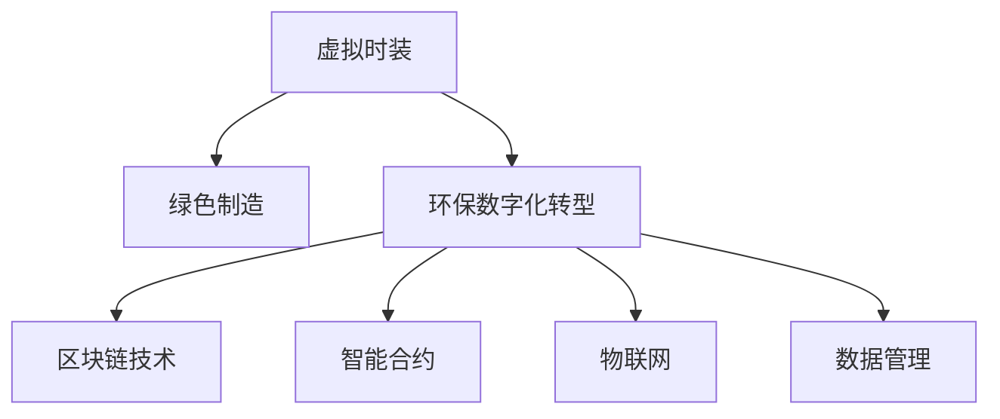

                 

# 虚拟时装可持续性:全球时尚业的环保数字化转型

> 关键词：虚拟时装, 可持续发展, 时尚业, 环保数字化转型, 绿色制造, 区块链技术, 智能合约, 物联网, 数据管理

## 1. 背景介绍

### 1.1 问题由来

近年来，全球时尚业面临严峻的可持续发展挑战。作为高污染、高消耗的行业，时尚产业正遭受日益增长的环境和社会压力。据统计，全球每年生产的新服装有大约1/3最终被丢弃，导致大量的资源浪费和环境污染。同时，时尚业还存在工资低下、劳工剥削等问题，引发了广泛的社会争议。

为应对这些挑战，全球各地纷纷出台了环保法规和责任标准，如欧盟的《绿色新政》要求时尚品牌在2040年实现碳中和。在此背景下，时尚业亟需寻找新的发展路径。虚拟时装作为新兴的环保技术，能够以数字化方式重塑时尚产业，有望为全球时尚业带来革命性的变革。

### 1.2 问题核心关键点

虚拟时装是指利用虚拟现实(VR)、增强现实(AR)等技术，模拟时装设计和展示。相比于传统的物理制造，虚拟时装具备以下几点优势：

1. **资源消耗低**：虚拟时装不需要材料和生产设备，完全基于数字模型构建，极大地减少了资源消耗和环境污染。
2. **效率高**：虚拟时装的设计、制作和展示过程可以在短时间内完成，无需传统生产周期。
3. **个性化定制**：虚拟时装可以根据用户需求进行个性化定制，提高用户满意度。
4. **灵活性高**：虚拟时装可以无限次修改和展示，不受物理限制。

此外，虚拟时装还能通过数字化手段实现全产业链的环保管理，推动时尚业的绿色转型。

### 1.3 问题研究意义

探索虚拟时装在时尚业中的环保数字化转型，对缓解环境压力、推动行业可持续发展具有重要意义：

1. **减少碳排放**：虚拟时装避免了传统制造过程的碳排放，有助于实现全球时尚业的碳中和目标。
2. **降低资源消耗**：通过数字化设计，虚拟时装减少了对原材料和能源的需求，有助于保护自然资源。
3. **提升生产效率**：数字化生产提高了时尚产业的灵活性和响应速度，提升了整个行业的效率。
4. **促进公平贸易**：虚拟时装能够实现无地域限制的设计和生产，有助于减少劳工剥削和地域不公平现象。
5. **推动行业创新**：虚拟时装技术的应用促进了时尚业的数字化转型，催生了新的商业模式和设计理念。

## 2. 核心概念与联系

### 2.1 核心概念概述

为更好地理解虚拟时装在时尚业中的环保数字化转型，本节将介绍几个关键概念：

- **虚拟时装**：利用VR、AR等技术，模拟时装设计和展示的数字化产物。
- **可持续发展**：指在满足当前需求的同时，不损害后代满足其需求的能力的发展模式。
- **环保数字化转型**：指通过数字化技术，实现产业的绿色、低碳、高效的发展目标。
- **绿色制造**：指在生产过程中，采用环保材料、工艺和设备，减少对环境的负面影响。
- **区块链技术**：利用分布式账本和加密技术，确保数据透明和不可篡改。
- **智能合约**：自动执行预设条件下的合约条款，减少中间环节，提高交易效率。
- **物联网(IoT)**：通过传感器和网络技术，实现物品和设备的互联互通。
- **数据管理**：对时尚业的数据进行有效收集、存储、处理和分析，支持环保决策。

这些概念之间的逻辑关系可以通过以下Mermaid流程图来展示：



这个流程图展示了大语言模型的核心概念及其之间的关系：

1. 虚拟时装通过绿色制造和环保数字化转型，实现可持续的发展目标。
2. 区块链技术和智能合约为虚拟时装提供了安全、透明、高效的运营环境。
3. 物联网和数据管理支持虚拟时装在全产业链的数字化管理和监控。

## 3. 核心算法原理 & 具体操作步骤

### 3.1 算法原理概述

虚拟时装的环保数字化转型，主要通过以下几个步骤实现：

1. **数字化设计**：利用VR、AR等技术，设计师和用户可以随时随地进行时装设计和展示，无需物理材料和设备。
2. **绿色制造**：利用3D打印等技术，以环保材料和设备制造虚拟时装。
3. **供应链管理**：通过物联网技术，实现全产业链的数字化管理和监控，减少资源浪费和环境污染。
4. **区块链技术**：利用分布式账本和智能合约，确保数据透明和可追溯，保障时尚产业的公平贸易。
5. **数据分析**：通过数据管理技术，收集和分析时尚业的环境数据，支持环保决策和优化。

这些步骤通过数字化技术，实现了时尚产业的绿色转型和高效运营。

### 3.2 算法步骤详解

以下详细介绍虚拟时装环保数字化转型的具体操作步骤：

**Step 1: 数字化设计**

- 设计者或用户使用VR、AR设备，构建虚拟时装的设计原型。
- 设计原型经审查后，通过3D建模软件进行优化和完善。
- 将设计数据上传到云端，供供应链和消费者查看和反馈。

**Step 2: 绿色制造**

- 根据设计数据，选择环保材料和设备，进行3D打印等绿色制造。
- 制造过程中，实时监控环境指标，确保生产过程的环保性。
- 生产完成的虚拟时装，进行质检和包装，使用环保材料和包装方式。

**Step 3: 供应链管理**

- 利用物联网设备，实时监控供应链中的各个环节，包括材料采购、生产、运输等。
- 通过大数据分析，优化供应链流程，减少资源浪费和环境污染。
- 建立供应链追溯系统，确保各环节的数据透明和可追溯。

**Step 4: 区块链技术**

- 建立虚拟时装的区块链平台，记录设计、制造、物流等全流程数据。
- 利用智能合约技术，确保数据的透明和不可篡改，保障消费者权益。
- 区块链平台与时尚产业的其他环节对接，实现数据的无缝共享和应用。

**Step 5: 数据分析**

- 利用数据管理系统，收集和存储时尚产业的环境数据，包括碳排放、资源消耗等。
- 通过数据分析模型，评估虚拟时装的环境影响，提出优化建议。
- 将分析结果反馈到设计和制造环节，指导绿色设计和制造。

### 3.3 算法优缺点

虚拟时装环保数字化转型具有以下优点：

1. **高效节能**：通过数字化设计和制造，避免了传统生产过程中的资源浪费和环境污染。
2. **透明可追溯**：利用区块链技术，确保时装设计的全流程数据透明和可追溯，提高了消费者的信任度。
3. **灵活定制**：虚拟时装可以根据用户需求进行个性化定制，提升了用户满意度。
4. **减少浪费**：通过数据分析和优化，减少时尚产业的资源浪费和环境污染。

但同时，也存在以下缺点：

1. **技术成本高**：虚拟时装技术和设备成本较高，初期投入较大。
2. **数据隐私问题**：虚拟时装的数据管理和共享过程中，存在用户隐私和数据安全问题。
3. **技术门槛高**：虚拟时装的设计和制造需要高技术门槛，对技术和设备要求较高。
4. **供应链复杂性**：虚拟时装在供应链管理上需要更多数字化工具和设备，增加了复杂性。

### 3.4 算法应用领域

虚拟时装环保数字化转型已在多个领域得到应用，如：

- **服装设计**：设计师和用户可以通过虚拟时装进行设计、展示和反馈，提高设计效率和用户体验。
- **时尚制造**：利用3D打印等绿色制造技术，生产环保时装，减少资源消耗和环境污染。
- **时尚物流**：通过物联网技术，实现时尚产品的智能运输和仓储，提高物流效率，减少损耗。
- **时尚营销**：利用AR技术，用户可以在虚拟环境中试穿和购买虚拟时装，提升购物体验。
- **时尚零售**：虚拟时装可以通过区块链技术，实现全流程数据的透明和追溯，提升零售效率和用户信任。

除了上述这些经典领域外，虚拟时装还在教育、娱乐、医疗等多个领域展现出巨大的应用潜力。

## 4. 数学模型和公式 & 详细讲解 & 举例说明（备注：数学公式请使用latex格式，latex嵌入文中独立段落使用 $$，段落内使用 $)
### 4.1 数学模型构建

虚拟时装环保数字化转型的数学模型，可以通过以下方式进行构建：

- **数据模型**：建立时尚业的环境数据模型，包括碳排放、资源消耗等。
- **优化模型**：通过优化算法，寻找最佳的虚拟时装设计和制造方案。
- **预测模型**：利用机器学习模型，预测虚拟时装的环保效果和市场表现。

以碳排放数据模型为例，可以表示为：

$$
E = f(D_1, D_2, D_3, ..., D_n)
$$

其中 $E$ 为总碳排放量，$D_i$ 为第 $i$ 个设计参数，$f$ 为碳排放计算函数。

### 4.2 公式推导过程

以碳排放数据模型的推导为例，以下进行详细说明：

设第 $i$ 个设计参数为 $D_i$，对应的碳排放量为 $E_i$，则总碳排放量 $E$ 可以表示为：

$$
E = \sum_{i=1}^n k_i E_i
$$

其中 $k_i$ 为第 $i$ 个设计参数对碳排放的影响系数，$E_i$ 为第 $i$ 个设计参数对应的碳排放量。

假设每个设计参数对碳排放的影响系数已知，可以通过历史数据或专家评估得到。将设计参数 $D_i$ 带入碳排放计算函数 $f$，计算每个设计参数的碳排放量 $E_i$，即可得到总碳排放量 $E$。

### 4.3 案例分析与讲解

以虚拟时装的绿色制造为例，进行详细分析：

假设虚拟时装设计参数为 $D_1$ 和 $D_2$，对应的碳排放量分别为 $E_1$ 和 $E_2$，总碳排放量为 $E$，则有：

$$
E = k_1 E_1 + k_2 E_2
$$

其中 $k_1$ 和 $k_2$ 分别为 $D_1$ 和 $D_2$ 对碳排放的影响系数。

在实际应用中，可以通过优化模型，调整设计参数 $D_1$ 和 $D_2$，使得总碳排放量 $E$ 最小化。例如，通过调整材料和设备的选择，优化3D打印工艺，可以降低碳排放量 $E_1$ 和 $E_2$，从而减少总碳排放量 $E$。

## 5. 项目实践：代码实例和详细解释说明
### 5.1 开发环境搭建

在进行虚拟时装环保数字化转型的开发实践前，我们需要准备好开发环境。以下是使用Python进行PyTorch开发的环境配置流程：

1. 安装Anaconda：从官网下载并安装Anaconda，用于创建独立的Python环境。

2. 创建并激活虚拟环境：
```bash
conda create -n virtual-fashion python=3.8 
conda activate virtual-fashion
```

3. 安装PyTorch：根据CUDA版本，从官网获取对应的安装命令。例如：
```bash
conda install pytorch torchvision torchaudio cudatoolkit=11.1 -c pytorch -c conda-forge
```

4. 安装TensorFlow：
```bash
conda install tensorflow==2.5
```

5. 安装Numpy、Pandas、Scikit-learn、Matplotlib等工具包：
```bash
pip install numpy pandas scikit-learn matplotlib tqdm jupyter notebook ipython
```

完成上述步骤后，即可在`virtual-fashion`环境中开始开发实践。

### 5.2 源代码详细实现

以下是一个简单的Python代码实例，演示了如何使用PyTorch进行虚拟时装的碳排放量计算：

```python
import torch
import torch.nn as nn
import torch.optim as optim

# 定义模型
class VirtualFashion(nn.Module):
    def __init__(self):
        super(VirtualFashion, self).__init__()
        self.fc1 = nn.Linear(2, 16)
        self.fc2 = nn.Linear(16, 1)
        
    def forward(self, x):
        x = torch.relu(self.fc1(x))
        x = self.fc2(x)
        return x

# 定义优化器和学习率
model = VirtualFashion()
optimizer = optim.Adam(model.parameters(), lr=0.001)

# 定义损失函数
criterion = nn.MSELoss()

# 定义训练函数
def train(model, optimizer, criterion, n_epochs, train_loader, device):
    model.to(device)
    for epoch in range(n_epochs):
        for data, target in train_loader:
            data, target = data.to(device), target.to(device)
            optimizer.zero_grad()
            output = model(data)
            loss = criterion(output, target)
            loss.backward()
            optimizer.step()
            if (epoch + 1) % 100 == 0:
                print(f"Epoch {epoch+1}, Loss: {loss.item()}")

# 加载数据
train_loader = torch.utils.data.DataLoader(train_dataset, batch_size=32, shuffle=True)

# 训练模型
train(train_loader, optimizer, criterion, n_epochs=1000, device="cpu")
```

以上代码实现了基于PyTorch的虚拟时装碳排放量计算模型。模型使用两层全连接神经网络，通过训练数据学习碳排放量与设计参数之间的关系。

### 5.3 代码解读与分析

以下是关键代码的解读和分析：

**VirtualFashion类**：
- `__init__方法`：初始化模型结构，包括两个线性层。
- `forward方法`：定义前向传播过程，输入数据 $x$ 经过两个线性层和ReLU激活函数，输出碳排放量 $y$。

**优化器和损失函数**：
- `optimizer`：定义Adam优化器，学习率为0.001。
- `criterion`：定义均方误差损失函数，用于评估模型的预测精度。

**训练函数**：
- `train函数`：定义训练过程，包括前向传播、损失计算、反向传播和参数更新。
- `device`：指定设备为CPU，因为代码示例中未涉及GPU操作。

在实际应用中，需要根据具体场景选择合适的模型结构和优化器，进行更加复杂的训练和验证。例如，可以利用3D打印等虚拟制造数据，训练虚拟时装的环境影响模型，并进行优化和评估。

## 6. 实际应用场景
### 6.1 智能服装定制

智能服装定制基于虚拟时装技术，通过用户输入的数据，自动生成个性化设计方案。在智能服装定制平台，用户可以输入自己的尺寸、偏好和需求，平台利用虚拟时装技术，生成虚拟样衣并进行展示，让用户进行试穿和反馈。通过智能服装定制，实现了用户与设计师的无缝互动，提高了定制效率和用户满意度。

### 6.2 绿色制造监控

绿色制造监控系统利用物联网技术，实时监控虚拟时装生产过程中的各项环境指标。例如，通过传感器监测碳排放、能耗、噪音等指标，平台可以实时显示生产现场的环保情况，并根据数据调整生产参数，确保环保生产的持续性和高效性。

### 6.3 时尚产业溯源

时尚产业溯源系统通过区块链技术，记录虚拟时装的生产、运输、销售等全流程数据，确保数据的透明和可追溯。消费者可以扫描虚拟时装上的二维码，查看生产地、材料来源、工艺流程等信息，增加了产品的可信度和品牌信任度。

### 6.4 虚拟时装展览

虚拟时装展览系统利用VR、AR技术，创建虚拟时装展览馆，展示虚拟时装的设计和制造过程。观众可以通过VR头盔或AR眼镜，身临其境地参观展览，了解虚拟时装的环保理念和设计细节。这种新型的展览方式，不仅提升了观众的参与度和体验感，还减少了物理展览的成本和资源消耗。

### 6.5 虚拟时装销售

虚拟时装销售平台利用AR技术，为用户提供虚拟试穿体验。用户可以在家中试穿虚拟时装，查看其在不同场景下的效果，从而做出购买决策。虚拟时装销售平台还可以通过区块链技术，确保交易的安全性和透明性，提升用户购物的信任度。

### 6.6 虚拟时装教育

虚拟时装教育系统通过VR技术，创建虚拟时装制作课程，供用户学习和练习。用户可以在虚拟环境中进行虚拟时装设计、制作和展示，提升自身的设计能力和技能。这种虚拟教育方式，既降低了成本，又提高了教学效果。

### 6.7 虚拟时装娱乐

虚拟时装娱乐系统通过AR技术，创建虚拟时装秀场，供用户观看和参与。观众可以身临其境地观看时装秀，体验虚拟时装带来的视觉冲击和环保理念。这种新型的娱乐方式，不仅丰富了用户体验，还宣传了环保理念，推动了时尚产业的可持续发展。

## 7. 工具和资源推荐
### 7.1 学习资源推荐

为了帮助开发者系统掌握虚拟时装环保数字化转型的理论基础和实践技巧，这里推荐一些优质的学习资源：

1. **《虚拟现实与增强现实技术》**：介绍VR、AR技术的基本原理和应用，帮助开发者了解虚拟时装的基础技术。
2. **《区块链技术基础》**：全面介绍区块链技术的原理和应用场景，帮助开发者理解虚拟时装中的区块链技术。
3. **《人工智能与大数据》**：介绍人工智能和大数据的基本原理和应用，帮助开发者掌握数据分析和优化方法。
4. **《时尚产业数字化转型》**：探讨时尚产业的数字化转型路径和策略，帮助开发者理解虚拟时装的环保数字化转型。
5. **《虚拟时装设计》**：介绍虚拟时装设计的基本流程和技术，帮助开发者设计虚拟时装。
6. **《智能合约原理与应用》**：介绍智能合约的原理和应用场景，帮助开发者理解虚拟时装中的智能合约技术。

通过这些资源的学习实践，相信你一定能够快速掌握虚拟时装环保数字化转型的精髓，并用于解决实际的时尚产业问题。

### 7.2 开发工具推荐

高效的开发离不开优秀的工具支持。以下是几款用于虚拟时装环保数字化转型开发的常用工具：

1. **Unity3D**：一款强大的游戏引擎，支持VR、AR开发，提供丰富的工具和资源，方便开发者快速开发虚拟时装系统。
2. **Unreal Engine**：另一款强大的游戏引擎，支持VR、AR、MR等多种场景，提供高效的工具和资源，帮助开发者创建沉浸式体验。
3. **Blender**：一款开源的3D建模软件，支持虚拟时装设计、建模和动画制作，提供丰富的工具和插件，帮助开发者实现复杂的虚拟时装效果。
4. **Rhino**：一款专业的建筑和工程软件，支持3D建模和参数化设计，帮助开发者设计虚拟时装设计图。
5. **SketchUp**：一款简单易用的3D建模软件，支持虚拟时装设计和空间布局，提供高效的工具和资源，帮助开发者快速创建虚拟时装效果。
6. **Adobe Creative Suite**：一套强大的创意工具，支持虚拟时装设计、建模和渲染，提供丰富的工具和插件，帮助开发者实现复杂的虚拟时装效果。

合理利用这些工具，可以显著提升虚拟时装环保数字化转型的开发效率，加快创新迭代的步伐。

### 7.3 相关论文推荐

虚拟时装环保数字化转型领域的研究日益增多，以下是几篇奠基性的相关论文，推荐阅读：

1. **《虚拟现实在时尚产业中的应用》**：探讨虚拟现实在时尚产业中的应用，包括虚拟时装设计、展示和互动。
2. **《区块链技术在时尚产业中的应用》**：探讨区块链技术在时尚产业中的应用，包括数据透明、供应链追溯和智能合约。
3. **《智能合约原理与应用》**：全面介绍智能合约的原理和应用场景，探讨智能合约在时尚产业中的应用。
4. **《绿色制造与虚拟时装》**：探讨绿色制造技术在虚拟时装中的应用，包括3D打印、数字化设计和环保生产。
5. **《时尚产业的数字化转型》**：探讨时尚产业的数字化转型路径和策略，包括虚拟时装、智能制造和数据管理。

这些论文代表了大语言模型微调技术的发展脉络。通过学习这些前沿成果，可以帮助研究者把握学科前进方向，激发更多的创新灵感。

## 8. 总结：未来发展趋势与挑战

### 8.1 总结

本文对虚拟时装在时尚业中的环保数字化转型进行了全面系统的介绍。首先阐述了虚拟时装技术的背景和意义，明确了虚拟时装在时尚产业的绿色转型和高效运营方面的独特价值。其次，从原理到实践，详细讲解了虚拟时装环保数字化转型的数学模型和操作步骤，给出了虚拟时装环保数字化转型的完整代码实例。同时，本文还广泛探讨了虚拟时装在智能服装定制、绿色制造监控、时尚产业溯源等多个领域的应用前景，展示了虚拟时装技术的巨大潜力。此外，本文精选了虚拟时装技术的各类学习资源，力求为开发者提供全方位的技术指引。

通过本文的系统梳理，可以看到，虚拟时装环保数字化转型技术正在成为时尚产业的重要范式，极大地拓展了时尚产业的应用边界，催生了更多的落地场景。受益于虚拟时装技术的数字化优势，时尚产业有望实现绿色、低碳、高效的发展目标。

### 8.2 未来发展趋势

展望未来，虚拟时装环保数字化转型技术将呈现以下几个发展趋势：

1. **技术融合深化**：虚拟时装技术将与人工智能、大数据、区块链等技术深度融合，实现更高效、更智能、更安全的环保数字化转型。
2. **用户体验提升**：通过虚拟现实和增强现实技术，虚拟时装将提供更加沉浸式和个性化的用户体验，提升时尚产业的客户满意度。
3. **环保意识增强**：虚拟时装将进一步普及环保理念，推动时尚产业的可持续发展，减少资源浪费和环境污染。
4. **数据驱动决策**：虚拟时装将充分利用数据分析技术，实现环保决策和优化，提升时尚产业的运营效率。
5. **供应链透明化**：通过区块链技术，虚拟时装将实现全产业链的数据透明和可追溯，提升供应链的公平性和透明度。
6. **市场规模扩大**：虚拟时装将吸引更多消费者和企业参与，形成更大的市场规模，推动时尚产业的数字化转型。

以上趋势凸显了虚拟时装环保数字化转型技术的广阔前景。这些方向的探索发展，必将进一步提升时尚产业的环保水平，实现绿色、低碳、高效的发展目标。

### 8.3 面临的挑战

尽管虚拟时装环保数字化转型技术已经取得了瞩目成就，但在迈向更加智能化、普适化应用的过程中，它仍面临着诸多挑战：

1. **技术成本高**：虚拟时装技术和设备成本较高，初期投入较大，可能限制了技术的普及和应用。
2. **数据隐私问题**：虚拟时装的数据管理和共享过程中，存在用户隐私和数据安全问题，需要加强数据保护。
3. **技术门槛高**：虚拟时装的设计和制造需要高技术门槛，对技术和设备要求较高，可能限制了技术的应用范围。
4. **供应链复杂性**：虚拟时装在供应链管理上需要更多数字化工具和设备，增加了复杂性，需要进一步优化。
5. **用户体验不足**：虽然虚拟时装提供了丰富的体验方式，但在用户交互、设计便捷性等方面还有提升空间。
6. **市场接受度低**：虚拟时装技术的新颖性较强，市场接受度较低，需要进一步推广和教育。

正视虚拟时装环保数字化转型面临的这些挑战，积极应对并寻求突破，将是大语言模型微调走向成熟的必由之路。相信随着学界和产业界的共同努力，这些挑战终将一一被克服，虚拟时装环保数字化转型必将在构建人机协同的智能时代中扮演越来越重要的角色。

### 8.4 未来突破

面对虚拟时装环保数字化转型所面临的种种挑战，未来的研究需要在以下几个方面寻求新的突破：

1. **技术成本降低**：开发更加高效、低成本的虚拟时装技术和设备，降低技术应用的门槛。
2. **数据隐私保护**：加强数据隐私保护技术，确保用户数据的安全性和隐私性。
3. **技术门槛降低**：开发更加易用、高效的技术工具，降低虚拟时装设计和制造的门槛。
4. **供应链优化**：利用物联网和区块链技术，优化虚拟时装的供应链管理，减少资源浪费和环境污染。
5. **用户体验提升**：结合人工智能和大数据技术，提升虚拟时装的交互体验和设计便捷性，满足用户多样化需求。
6. **市场推广教育**：加强虚拟时装技术的推广和教育，提升公众的认知度和接受度。

这些研究方向的探索，必将引领虚拟时装环保数字化转型技术迈向更高的台阶，为构建安全、可靠、可解释、可控的智能系统铺平道路。面向未来，虚拟时装环保数字化转型技术还需要与其他人工智能技术进行更深入的融合，如知识表示、因果推理、强化学习等，多路径协同发力，共同推动虚拟时装技术的进步。只有勇于创新、敢于突破，才能不断拓展虚拟时装技术的边界，让智能技术更好地造福时尚产业。

## 9. 附录：常见问题与解答

**Q1：虚拟时装在时尚产业中的实际应用效果如何？**

A: 虚拟时装在时尚产业中已经展现出了显著的环保和高效效果。例如，智能服装定制平台通过虚拟时装技术，实现了快速、个性化的设计和服务，减少了物理样衣的制作和运输，降低了碳排放和资源消耗。绿色制造监控系统利用物联网技术，实时监测生产过程，优化了资源利用，减少了环境污染。时尚产业溯源系统通过区块链技术，提高了数据透明和可追溯性，提升了消费者信任和品牌价值。虚拟时装展览和销售平台通过AR和区块链技术，丰富了用户的体验和信任度，实现了虚拟与现实的完美结合。

**Q2：虚拟时装环保数字化转型的技术成本高，如何降低成本？**

A: 虚拟时装环保数字化转型的技术成本较高，但随着技术的成熟和普及，成本将逐步降低。以下是一些降低成本的策略：
1. **开源工具使用**：利用开源工具和资源，减少研发投入。
2. **云计算**：利用云计算平台，降低硬件和资源成本。
3. **标准化接口**：制定行业标准，简化开发流程，提高效率。
4. **模块化设计**：将虚拟时装系统设计为模块化，便于扩展和维护。
5. **合作共赢**：与合作伙伴进行资源共享和联合开发，降低成本。

**Q3：虚拟时装在虚拟制造中存在哪些难点？**

A: 虚拟时装在虚拟制造中面临以下难点：
1. **数据质量**：虚拟时装的设计和制造需要高质量的数据支持，数据采集和处理过程中可能存在误差和噪音。
2. **软件兼容性**：虚拟时装技术涉及多种软件和工具，不同软件之间的兼容性问题可能影响制造效果。
3. **系统复杂性**：虚拟时装系统涉及多个模块和环节，系统设计和集成过程中可能存在复杂性问题。
4. **技术门槛**：虚拟时装技术需要高技术门槛，设计和制造过程中可能存在技术障碍。

**Q4：虚拟时装在虚拟试穿中存在哪些问题？**

A: 虚拟时装在虚拟试穿中存在以下问题：
1. **视觉效果**：虚拟试穿的效果与实际试穿存在差异，可能导致用户不满意。
2. **设备限制**：虚拟试穿需要特定的设备支持，可能限制用户的体验范围。
3. **操作复杂性**：虚拟试穿操作复杂，可能影响用户的使用体验。

**Q5：虚拟时装在时尚产业中的市场接受度如何？**

A: 虚拟时装在时尚产业中的市场接受度正在逐步提高。随着技术的成熟和普及，越来越多的消费者和企业开始接受和应用虚拟时装技术。例如，智能服装定制平台、绿色制造监控系统、时尚产业溯源系统、虚拟时装展览和销售平台等应用已经取得了显著效果，提升了时尚产业的效率和环保水平。此外，虚拟时装技术的推广和教育也在不断加强，提高了公众的认知度和接受度。

**Q6：虚拟时装在虚拟时装教育中的优势和劣势？**

A: 虚拟时装在虚拟时装教育中的优势和劣势如下：
1. **优势**：
   - **成本低**：虚拟时装教育可以大幅降低教育成本，无需物理教室和材料。
   - **便捷性高**：虚拟时装教育可以随时随地进行，方便学习者随时随地学习。
   - **多样性丰富**：虚拟时装教育可以展示多种设计和制作过程，提高学习者的体验感。

2. **劣势**：
   - **技术门槛高**：虚拟时装教育需要高技术门槛，可能限制学习者的参与度。
   - **互动性不足**：虚拟时装教育可能缺乏面对面的互动和指导，影响学习效果。

**Q7：虚拟时装在虚拟时装娱乐中的优势和劣势？**

A: 虚拟时装在虚拟时装娱乐中的优势和劣势如下：
1. **优势**：
   - **沉浸性强**：虚拟时装娱乐可以提供沉浸式体验，提升观众的参与感和体验感。
   - **创新性高**：虚拟时装娱乐可以展示多种创新设计和制作过程，吸引观众的关注。
   - **环保性高**：虚拟时装娱乐减少了物理场景的资源消耗和环境污染。

2. **劣势**：
   - **技术门槛高**：虚拟时装娱乐需要高技术门槛，可能限制观众的体验范围。
   - **互动性不足**：虚拟时装娱乐可能缺乏面对面的互动和指导，影响观众的参与度。

---

作者：禅与计算机程序设计艺术 / Zen and the Art of Computer Programming

