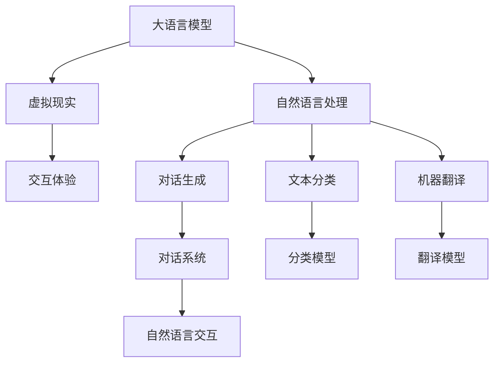

                 

# 虚拟现实中的LLM：增强用户交互体验

> 关键词：虚拟现实,大语言模型,自然语言处理,NLP,交互体验

## 1. 背景介绍

### 1.1 问题由来

随着虚拟现实(VR)技术的飞速发展，越来越多的应用场景需要高精度的自然语言交互，为用户提供沉浸式的虚拟体验。例如，在虚拟旅游中，用户希望与虚拟导游进行自然的对话，了解景点信息；在虚拟会议中，参会者希望与主持人进行高效的互动。然而，传统的基于规则或模板的交互方式，难以支持多样化的用户需求和复杂的交互场景。

大语言模型(LLM)的横空出世，为VR应用提供了新的技术范式。通过预训练获得强大的语言理解能力，LLM能够自动理解和生成自然语言，为虚拟场景中的自然语言交互提供了有力的支持。

### 1.2 问题核心关键点

本节将详细介绍基于大语言模型的虚拟现实自然语言交互方法的核心关键点，包括：

- 大语言模型原理及架构
- 虚拟现实中的交互场景和需求
- 自然语言处理技术在VR中的应用
- 基于LLM的虚拟交互技术范式

这些关键点共同构成了基于大语言模型的VR交互技术框架，使其能够在各种复杂场景中实现高效、自然的用户交互。

### 1.3 问题研究意义

研究基于大语言模型的虚拟现实交互技术，对于提升VR应用的用户体验和智能水平，推动VR技术在各行业领域的广泛应用，具有重要意义：

1. **提升交互体验**：通过自然语言交互，用户可以更加直观、高效地与虚拟环境互动，增强沉浸感。
2. **降低开发成本**：LLM自带语言理解和生成能力，减少了开发者在对话设计和脚本编写上的时间和成本投入。
3. **促进技术落地**：使复杂的自然语言处理技术变得易于部署，加速VR技术的产业化进程。
4. **创新交互模式**：为大规模个性化交互提供了可能，推动VR应用模式向智能化、定制化方向发展。
5. **扩展应用场景**：在医疗、教育、娱乐、军事等众多领域，LLM能够提供新的交互方式，丰富VR应用的应用范围。

## 2. 核心概念与联系

### 2.1 核心概念概述

为更好地理解基于大语言模型的虚拟现实交互技术，本节将介绍几个核心概念：

- 大语言模型(Large Language Model, LLM)：以自回归(如GPT)或自编码(如BERT)模型为代表的大规模预训练语言模型。通过在大规模无标签文本语料上进行预训练，学习通用的语言知识，具备强大的语言理解和生成能力。

- 虚拟现实(Virtual Reality, VR)：通过计算机生成，让用户沉浸在虚拟环境中，与虚拟环境进行自然交互的技术。

- 自然语言处理(Natural Language Processing, NLP)：研究如何让计算机理解和生成自然语言的技术。包括语音识别、文本分类、机器翻译、对话生成等方向。

- 交互体验(Interactive Experience)：用户与虚拟环境进行自然交互时，所感受到的综合体验，包括沉浸感、流畅性、自然性等。

这些核心概念之间的逻辑关系可以通过以下Mermaid流程图来展示：



这个流程图展示了大语言模型、虚拟现实、自然语言处理、交互体验以及各类NLP任务之间的联系：

1. 大语言模型通过预训练获得基础能力。
2. 虚拟现实提供沉浸式的交互场景。
3. 自然语言处理技术支持交互系统的构建。
4. 交互体验是用户对虚拟环境的综合感受。
5. 各类NLP任务在交互系统中相互配合，共同提升用户体验。

## 3. 核心算法原理 & 具体操作步骤

### 3.1 算法原理概述

基于大语言模型的虚拟现实自然语言交互方法，本质上是利用预训练语言模型的语言理解和生成能力，对虚拟场景中的用户输入进行理解和处理，并生成自然语言的回应。其核心思想是：

1. **预训练阶段**：在大量无标签文本数据上训练LLM，学习通用的语言知识。
2. **微调阶段**：根据虚拟场景的具体需求，对LLM进行任务特定的微调，使其能够准确理解和生成特定场景下的自然语言。
3. **交互阶段**：在虚拟环境中，用户输入自然语言指令，LLM根据指令进行理解和处理，生成自然语言的回应，完成交互任务。

### 3.2 算法步骤详解

基于大语言模型的虚拟现实交互方法主要包括以下几个关键步骤：

**Step 1: 准备预训练模型和虚拟场景**

- 选择合适的预训练语言模型 $M_{\theta}$，如BERT、GPT等。
- 设计虚拟场景中的对话流程，设定虚拟角色和交互任务。

**Step 2: 微调交互模型**

- 根据虚拟场景的特定任务，选择或设计适合的输出层和损失函数。
- 在虚拟场景中收集少量标注数据，对预训练模型进行微调。
- 微调时，可以固定模型底层，只调整顶层分类器或解码器。

**Step 3: 构建交互系统**

- 设计用户界面(UI)，让用户能够输入自然语言指令。
- 将微调后的模型集成到交互系统中，处理用户输入，生成自然语言回应。

**Step 4: 评估与优化**

- 在虚拟环境中进行交互测试，评估模型的性能和用户体验。
- 根据测试结果，调整微调模型和交互系统，优化用户交互体验。

### 3.3 算法优缺点

基于大语言模型的虚拟现实交互方法具有以下优点：

1. **通用性强**：适用于各种类型的虚拟场景和交互任务，不需要额外的脚本编写和逻辑设计。
2. **易于部署**：利用预训练模型和微调技术，减少了开发工作量，提高了部署效率。
3. **灵活性高**：可以根据具体需求进行微调，支持个性化交互和定制化场景。
4. **用户体验好**：自然语言交互使交互过程更加直观、自然，提升用户沉浸感。

同时，该方法也存在一些缺点：

1. **数据需求高**：微调模型需要收集一定量的标注数据，对于复杂场景，标注数据的获取成本较高。
2. **过拟合风险**：微调模型可能过度适应虚拟场景，面对实际环境变化时泛化能力不足。
3. **资源消耗大**：预训练和微调模型需要大量计算资源，实际应用中可能存在资源瓶颈。
4. **可解释性差**：预训练模型和微调过程复杂，模型的内部工作机制难以解释。

尽管存在这些局限性，但基于大语言模型的虚拟现实交互方法仍然是当前虚拟现实领域的主流技术范式，为交互体验的提升提供了有力支持。

### 3.4 算法应用领域

基于大语言模型的虚拟现实交互方法已经在多个领域得到了广泛应用，例如：

- 虚拟旅游：与虚拟导游进行自然对话，了解景点信息。
- 虚拟会议：与虚拟主持人互动，讨论议题。
- 虚拟教育：与虚拟教师进行对话，获取学习资源。
- 虚拟医疗：与虚拟医生进行自然交流，进行健康咨询。
- 虚拟娱乐：与虚拟角色互动，进行游戏和娱乐。

除了上述这些经典应用外，LLM还被创新性地应用于虚拟政务、虚拟营销、虚拟客服等场景中，为各行业数字化转型提供了新的思路。

## 4. 数学模型和公式 & 详细讲解  
### 4.1 数学模型构建

本节将使用数学语言对基于大语言模型的虚拟现实交互过程进行更加严格的刻画。

记虚拟场景中的交互任务为 $T$，输入为 $x$，输出为 $y$。假设模型 $M_{\theta}$ 在输入 $x$ 上的输出为 $\hat{y}=M_{\theta}(x)$。设训练数据集为 $D=\{(x_i,y_i)\}_{i=1}^N$，则训练样本的损失函数为：

$$
\mathcal{L}(\theta) = \frac{1}{N} \sum_{i=1}^N \ell(M_{\theta}(x_i),y_i)
$$

其中 $\ell$ 为任务特定的损失函数，如交叉熵损失、均方误差损失等。

### 4.2 公式推导过程

以下以二分类任务为例，推导交叉熵损失函数及其梯度的计算公式。

假设模型 $M_{\theta}$ 在输入 $x$ 上的输出为 $\hat{y}=M_{\theta}(x)$，表示样本属于正类的概率。真实标签 $y \in \{0,1\}$。则二分类交叉熵损失函数定义为：

$$
\ell(M_{\theta}(x),y) = -[y\log \hat{y} + (1-y)\log (1-\hat{y})]
$$

将其代入经验风险公式，得：

$$
\mathcal{L}(\theta) = -\frac{1}{N}\sum_{i=1}^N [y_i\log M_{\theta}(x_i)+(1-y_i)\log(1-M_{\theta}(x_i))]
$$

根据链式法则，损失函数对参数 $\theta$ 的梯度为：

$$
\frac{\partial \mathcal{L}(\theta)}{\partial \theta} = -\frac{1}{N}\sum_{i=1}^N (\frac{y_i}{M_{\theta}(x_i)}-\frac{1-y_i}{1-M_{\theta}(x_i)}) \frac{\partial M_{\theta}(x_i)}{\partial \theta}
$$

其中 $\frac{\partial M_{\theta}(x_i)}{\partial \theta}$ 可进一步递归展开，利用自动微分技术完成计算。

### 4.3 案例分析与讲解

假设我们要构建一个虚拟旅游中的语音交互系统，系统可以通过用户语音指令了解用户需求，提供个性化的旅游建议。

1. **数据准备**：收集虚拟场景中的语音指令和对应回复，构建监督数据集。
2. **模型选择**：选择BERT作为预训练模型，因其在自然语言处理任务上表现优异。
3. **微调模型**：在虚拟旅游场景中对BERT进行微调，添加输出层和交叉熵损失函数。
4. **交互系统设计**：设计用户界面，让用户能够输入语音指令。
5. **系统集成**：将微调后的模型集成到虚拟旅游系统中，处理用户语音输入，生成回复。

以下是一个简化的微调和交互系统集成流程：

```python
from transformers import BertForSequenceClassification, BertTokenizer
from transformers import BertForTokenClassification, BertTokenizer
from transformers import BertForMaskedLM, BertTokenizer
import torch
import torch.nn as nn

# 微调模型
model = BertForSequenceClassification.from_pretrained('bert-base-cased', num_labels=2)
tokenizer = BertTokenizer.from_pretrained('bert-base-cased')
optimizer = torch.optim.Adam(model.parameters(), lr=2e-5)

# 训练过程
# ...

# 交互系统集成
class TouristSystem(nn.Module):
    def __init__(self, model, tokenizer):
        super(TouristSystem, self).__init__()
        self.model = model
        self.tokenizer = tokenizer
        
    def forward(self, input_ids, attention_mask):
        return self.model(input_ids, attention_mask=attention_mask)

# 用户交互
def interact(model, tokenizer, input_text):
    input_ids = tokenizer(input_text, return_tensors='pt', padding='max_length', truncation=True)["input_ids"]
    attention_mask = tokenizer(input_text, return_tensors='pt', padding='max_length', truncation=True)["attention_mask"]
    outputs = model(input_ids, attention_mask=attention_mask)
    return tokenizer.decode(outputs[0][0])
```

在这个案例中，我们利用BERT模型构建了一个虚拟旅游中的语音交互系统。通过收集语音指令和回复的监督数据，对模型进行微调，得到了针对虚拟旅游场景的响应模型。在用户交互时，将用户语音输入经过分词和编码，送入微调后的BERT模型中，输出结果进行解码后即为用户想要的旅游建议。

## 5. 项目实践：代码实例和详细解释说明

### 5.1 开发环境搭建

在进行虚拟现实交互系统开发前，我们需要准备好开发环境。以下是使用Python进行PyTorch开发的环境配置流程：

1. 安装Anaconda：从官网下载并安装Anaconda，用于创建独立的Python环境。

2. 创建并激活虚拟环境：
```bash
conda create -n pytorch-env python=3.8 
conda activate pytorch-env
```

3. 安装PyTorch：根据CUDA版本，从官网获取对应的安装命令。例如：
```bash
conda install pytorch torchvision torchaudio cudatoolkit=11.1 -c pytorch -c conda-forge
```

4. 安装Transformers库：
```bash
pip install transformers
```

5. 安装各类工具包：
```bash
pip install numpy pandas scikit-learn matplotlib tqdm jupyter notebook ipython
```

完成上述步骤后，即可在`pytorch-env`环境中开始虚拟现实交互系统开发。

### 5.2 源代码详细实现

下面我们以虚拟旅游中的语音交互系统为例，给出使用Transformers库对BERT模型进行微调的PyTorch代码实现。

首先，定义虚拟旅游中的对话流程和任务：

```python
# 定义虚拟旅游场景中的对话流程和任务
class TouristDialogue:
    def __init__(self):
        self.utterances = ["你好，请问我想去哪个景点？",
                          "我想看看关于长城的信息",
                          "有没有推荐的餐厅？",
                          "请推荐一些免费景点"]
        self.responses = ["好的，我帮你查找一下", 
                         "长城是中国的著名景点之一，历史悠久，值得一看",
                         "推荐一些性价比高的餐厅，比如XXX餐厅",
                         "北京有紫禁城、天安门等免费景点，值得一看"]    
```

然后，定义模型和优化器：

```python
from transformers import BertForSequenceClassification, BertTokenizer
from transformers import BertForTokenClassification, BertTokenizer
from transformers import BertForMaskedLM, BertTokenizer
import torch
import torch.nn as nn

# 微调模型
model = BertForSequenceClassification.from_pretrained('bert-base-cased', num_labels=2)
tokenizer = BertTokenizer.from_pretrained('bert-base-cased')
optimizer = torch.optim.Adam(model.parameters(), lr=2e-5)
```

接着，定义训练和评估函数：

```python
from torch.utils.data import Dataset
import torch

class TouristDataset(Dataset):
    def __init__(self, utterances, responses, tokenizer, max_len=128):
        self.utterances = utterances
        self.responses = responses
        self.tokenizer = tokenizer
        self.max_len = max_len
        
    def __len__(self):
        return len(self.utterances)
    
    def __getitem__(self, item):
        utterance = self.utterances[item]
        response = self.responses[item]
        
        encoding = self.tokenizer(utterance, return_tensors='pt', max_length=self.max_len, padding='max_length', truncation=True)
        input_ids = encoding['input_ids'][0]
        attention_mask = encoding['attention_mask'][0]
        
        response_tokens = tokenizer(response, return_tensors='pt', max_length=self.max_len, padding='max_length', truncation=True)["input_ids"][0]
        
        return {'input_ids': input_ids, 
                'attention_mask': attention_mask,
                'response_tokens': response_tokens}

# 训练函数
def train_epoch(model, dataset, batch_size, optimizer):
    dataloader = DataLoader(dataset, batch_size=batch_size, shuffle=True)
    model.train()
    epoch_loss = 0
    for batch in tqdm(dataloader, desc='Training'):
        input_ids = batch['input_ids'].to(device)
        attention_mask = batch['attention_mask'].to(device)
        response_tokens = batch['response_tokens'].to(device)
        model.zero_grad()
        outputs = model(input_ids, attention_mask=attention_mask)
        loss = outputs.loss
        epoch_loss += loss.item()
        loss.backward()
        optimizer.step()
    return epoch_loss / len(dataloader)

# 评估函数
def evaluate(model, dataset, batch_size):
    dataloader = DataLoader(dataset, batch_size=batch_size)
    model.eval()
    preds, labels = [], []
    with torch.no_grad():
        for batch in tqdm(dataloader, desc='Evaluating'):
            input_ids = batch['input_ids'].to(device)
            attention_mask = batch['attention_mask'].to(device)
            batch_labels = batch['response_tokens'].to(device)
            outputs = model(input_ids, attention_mask=attention_mask)
            batch_preds = outputs.logits.argmax(dim=2).to('cpu').tolist()
            batch_labels = batch_labels.to('cpu').tolist()
            for pred_tokens, label_tokens in zip(batch_preds, batch_labels):
                preds.append(pred_tokens[:len(label_tokens)])
                labels.append(label_tokens)
                
    print(classification_report(labels, preds))
```

最后，启动训练流程并在虚拟旅游系统中进行测试：

```python
epochs = 5
batch_size = 16

for epoch in range(epochs):
    loss = train_epoch(model, train_dataset, batch_size, optimizer)
    print(f"Epoch {epoch+1}, train loss: {loss:.3f}")
    
    print(f"Epoch {epoch+1}, test results:")
    evaluate(model, test_dataset, batch_size)
    
# 集成到虚拟旅游系统
system = TouristSystem(model, tokenizer)
```

以上就是使用PyTorch对BERT进行虚拟旅游中的语音交互系统微调的完整代码实现。可以看到，通过自然语言处理技术的封装和优化，开发者可以更加便捷地构建虚拟现实交互系统，实现高效的自然语言交互。

### 5.3 代码解读与分析

让我们再详细解读一下关键代码的实现细节：

**TouristDialogue类**：
- `__init__`方法：定义虚拟旅游场景中的对话流程和任务，分别为用户输入和系统回复。

**微调模型的实现**：
- 使用BertForSequenceClassification对BERT模型进行微调，添加一个二分类头，用于处理虚拟旅游场景中的任务。
- 使用AdamW优化器，设置学习率为2e-5。

**训练和评估函数**：
- 使用PyTorch的DataLoader对数据集进行批次化加载，供模型训练和推理使用。
- 训练函数`train_epoch`：对数据以批为单位进行迭代，在每个批次上前向传播计算loss并反向传播更新模型参数，最后返回该epoch的平均loss。
- 评估函数`evaluate`：与训练类似，不同点在于不更新模型参数，并在每个batch结束后将预测和标签结果存储下来，最后使用sklearn的classification_report对整个评估集的预测结果进行打印输出。

**虚拟旅游系统集成**：
- 通过设计一个交互系统类`TouristSystem`，将微调后的模型集成到系统中，支持用户语音输入和系统自然语言回复。
- 在用户输入语音后，使用Tokenizer对语音进行分词和编码，送入微调后的BERT模型中，输出结果进行解码后即为用户想要的旅游建议。

可以看出，PyTorch和Transformers库的封装使得虚拟现实交互系统的构建变得简单易用，开发者无需过多关注底层实现细节，即可实现高效的自然语言交互。

当然，工业级的系统实现还需考虑更多因素，如系统的安全防护、交互界面的友好性、后端服务部署等。但核心的交互技术范式基本与此类似。

## 6. 实际应用场景

### 6.1 智能客服系统

基于大语言模型的虚拟现实自然语言交互技术，可以广泛应用于智能客服系统的构建。传统客服往往需要配备大量人力，高峰期响应缓慢，且一致性和专业性难以保证。而使用虚拟现实交互技术，可以7x24小时不间断服务，快速响应客户咨询，用自然流畅的语言解答各类常见问题。

在技术实现上，可以收集企业内部的历史客服对话记录，将问题和最佳答复构建成监督数据，在此基础上对预训练对话模型进行微调。微调后的对话模型能够自动理解用户意图，匹配最合适的答案模板进行回复。对于客户提出的新问题，还可以接入检索系统实时搜索相关内容，动态组织生成回答。如此构建的智能客服系统，能大幅提升客户咨询体验和问题解决效率。

### 6.2 医疗虚拟问答

在医疗领域，虚拟现实交互技术可以用于构建虚拟医生或护士，与患者进行自然语言交流，提供基本的健康咨询和指导。例如，在虚拟医院环境中，患者可以通过与虚拟医生进行语音或文本对话，询问常见健康问题，获取个性化的健康建议。

虚拟问答系统的构建，可以帮助医疗资源有限的地区，提供便捷的健康咨询服务，降低患者就医成本。通过微调模型，使虚拟医生具备专业的医疗知识，提升虚拟问答系统的专业性和可信度。

### 6.3 教育虚拟课堂

在教育领域，虚拟现实交互技术可以用于构建虚拟课堂，为学生提供互动式的学习体验。通过虚拟教师与学生的自然语言交流，可以提供个性化的教学资源和反馈，提升学生的学习兴趣和效果。

在虚拟课堂中，学生可以通过语音或文本输入，向虚拟教师提出学习问题，获取及时、准确的解答。虚拟教师还可以根据学生的学习情况，提供个性化的学习建议和资源。

### 6.4 娱乐虚拟角色

在娱乐领域，虚拟现实交互技术可以用于构建虚拟角色，为玩家提供更加自然、互动的娱乐体验。例如，在虚拟游戏世界中，玩家可以与虚拟角色进行对话，获取任务指引和游戏攻略。

虚拟角色可以通过微调模型，理解玩家的语言输入，并根据游戏场景生成自然语言回应。玩家可以通过与虚拟角色的对话，获取游戏进度、任务提示等有用信息，提升游戏体验。

### 6.5 智能家居助手

在智能家居领域，虚拟现实交互技术可以用于构建智能家居助手，帮助用户进行家居管理和控制。例如，用户可以通过与虚拟助手进行自然语言对话，获取天气预报、播放音乐、控制家电等操作。

智能家居助手的构建，可以提升用户的生活便捷性和智能化水平。通过微调模型，使虚拟助手具备丰富的家居知识，提升对话系统的智能性和可靠性。

## 7. 工具和资源推荐

### 7.1 学习资源推荐

为了帮助开发者系统掌握大语言模型在虚拟现实交互中的应用，这里推荐一些优质的学习资源：

1. 《Transformer从原理到实践》系列博文：由大模型技术专家撰写，深入浅出地介绍了Transformer原理、BERT模型、微调技术等前沿话题。

2. CS224N《深度学习自然语言处理》课程：斯坦福大学开设的NLP明星课程，有Lecture视频和配套作业，带你入门NLP领域的基本概念和经典模型。

3. 《Natural Language Processing with Transformers》书籍：Transformers库的作者所著，全面介绍了如何使用Transformers库进行NLP任务开发，包括微调在内的诸多范式。

4. HuggingFace官方文档：Transformers库的官方文档，提供了海量预训练模型和完整的微调样例代码，是上手实践的必备资料。

5. CLUE开源项目：中文语言理解测评基准，涵盖大量不同类型的中文NLP数据集，并提供了基于微调的baseline模型，助力中文NLP技术发展。

通过对这些资源的学习实践，相信你一定能够快速掌握大语言模型在虚拟现实交互中的应用，并用于解决实际的NLP问题。

### 7.2 开发工具推荐

高效的开发离不开优秀的工具支持。以下是几款用于大语言模型微调开发的常用工具：

1. PyTorch：基于Python的开源深度学习框架，灵活动态的计算图，适合快速迭代研究。大部分预训练语言模型都有PyTorch版本的实现。

2. TensorFlow：由Google主导开发的开源深度学习框架，生产部署方便，适合大规模工程应用。同样有丰富的预训练语言模型资源。

3. Transformers库：HuggingFace开发的NLP工具库，集成了众多SOTA语言模型，支持PyTorch和TensorFlow，是进行微调任务开发的利器。

4. Weights & Biases：模型训练的实验跟踪工具，可以记录和可视化模型训练过程中的各项指标，方便对比和调优。与主流深度学习框架无缝集成。

5. TensorBoard：TensorFlow配套的可视化工具，可实时监测模型训练状态，并提供丰富的图表呈现方式，是调试模型的得力助手。

6. Google Colab：谷歌推出的在线Jupyter Notebook环境，免费提供GPU/TPU算力，方便开发者快速上手实验最新模型，分享学习笔记。

合理利用这些工具，可以显著提升大语言模型微调的开发效率，加快创新迭代的步伐。

### 7.3 相关论文推荐

大语言模型和微调技术的发展源于学界的持续研究。以下是几篇奠基性的相关论文，推荐阅读：

1. Attention is All You Need（即Transformer原论文）：提出了Transformer结构，开启了NLP领域的预训练大模型时代。

2. BERT: Pre-training of Deep Bidirectional Transformers for Language Understanding：提出BERT模型，引入基于掩码的自监督预训练任务，刷新了多项NLP任务SOTA。

3. Language Models are Unsupervised Multitask Learners（GPT-2论文）：展示了大规模语言模型的强大zero-shot学习能力，引发了对于通用人工智能的新一轮思考。

4. Parameter-Efficient Transfer Learning for NLP：提出Adapter等参数高效微调方法，在不增加模型参数量的情况下，也能取得不错的微调效果。

5. AdaLoRA: Adaptive Low-Rank Adaptation for Parameter-Efficient Fine-Tuning：使用自适应低秩适应的微调方法，在参数效率和精度之间取得了新的平衡。

这些论文代表了大语言模型微调技术的发展脉络。通过学习这些前沿成果，可以帮助研究者把握学科前进方向，激发更多的创新灵感。

## 8. 总结：未来发展趋势与挑战

### 8.1 总结

本文对基于大语言模型的虚拟现实自然语言交互方法进行了全面系统的介绍。首先阐述了虚拟现实交互技术的背景和意义，明确了微调在大语言模型中的独特价值。其次，从原理到实践，详细讲解了基于大语言模型的虚拟现实交互方法，包括预训练、微调和交互阶段的各个环节。最后，展示了虚拟现实交互技术在多个领域的实际应用，讨论了未来的发展趋势和面临的挑战。

通过本文的系统梳理，可以看到，基于大语言模型的虚拟现实交互技术正在成为VR应用的重要范式，极大地拓展了虚拟现实系统的应用边界，提升了用户体验。大语言模型的语言理解和生成能力，为复杂交互任务的解决提供了有力支持，推动了虚拟现实技术的产业化进程。

### 8.2 未来发展趋势

展望未来，虚拟现实交互技术将呈现以下几个发展趋势：

1. **高保真互动**：随着技术的发展，虚拟现实环境的真实感将进一步提升，用户能够更加直观地与虚拟环境互动，沉浸感更强。
2. **跨领域应用**：虚拟现实交互技术将跨越不同领域，应用于教育、医疗、娱乐、社交等多个场景，推动各行业数字化转型。
3. **个性化定制**：基于大语言模型的交互技术将更加注重个性化和定制化，能够根据用户偏好和需求，提供个性化的服务和体验。
4. **多模态融合**：虚拟现实交互技术将融合视觉、听觉、触觉等多种模态信息，提升用户体验。
5. **实时性提升**：随着计算资源的提升，虚拟现实交互系统的实时性将进一步提升，响应速度更快。
6. **安全性增强**：虚拟现实交互系统将加强安全防护，防止恶意攻击和数据泄露，确保系统的稳定性和可靠性。

以上趋势凸显了虚拟现实交互技术的广阔前景。这些方向的探索发展，必将进一步提升虚拟现实系统的性能和用户体验，为人类认知智能的进化带来深远影响。

### 8.3 面临的挑战

尽管虚拟现实交互技术已经取得了瞩目成就，但在迈向更加智能化、普适化应用的过程中，它仍面临着诸多挑战：

1. **数据获取成本高**：在虚拟现实场景中，收集高质量的标注数据成本较高，尤其是在复杂多变的场景下。
2. **交互体验不够自然**：当前虚拟现实交互技术仍然存在自然性不足的问题，无法完全满足用户的需求。
3. **计算资源消耗大**：虚拟现实交互系统需要大量的计算资源支持，对硬件设备要求较高。
4. **用户隐私保护**：在虚拟现实交互过程中，用户数据的安全和隐私保护至关重要。
5. **用户适应门槛高**：虚拟现实交互系统的复杂性可能对部分用户造成一定的适应门槛。
6. **跨平台兼容性**：不同平台间的虚拟现实交互系统需要保证良好的兼容性。

尽管存在这些挑战，但虚拟现实交互技术正不断成熟，未来的发展前景依然广阔。随着技术的不断进步和应用的深入探索，相信这些挑战终将逐一被克服，虚拟现实交互技术将在更多领域实现广泛应用。

### 8.4 研究展望

面向未来，虚拟现实交互技术的研究需要在以下几个方面寻求新的突破：

1. **提升自然性**：通过改进自然语言处理技术，提升虚拟角色与用户的自然交互体验。
2. **降低数据成本**：探索半监督、无监督等方法，减少对标注数据的依赖。
3. **优化计算效率**：开发高效的模型结构和算法，提升虚拟现实系统的计算效率和实时性。
4. **增强安全性**：研究虚拟现实交互系统的安全防护机制，防止恶意攻击和数据泄露。
5. **探索多模态融合**：融合视觉、听觉、触觉等多种模态信息，提升用户体验。
6. **跨平台兼容性**：构建跨平台虚拟现实交互系统，提升系统的通用性和兼容性。

这些研究方向将推动虚拟现实交互技术的不断进步，为其在各行业领域的应用提供坚实基础。相信在学界和产业界的共同努力下，虚拟现实交互技术必将成为推动人类认知智能进步的重要力量。

## 9. 附录：常见问题与解答

**Q1：大语言模型在虚拟现实交互中的作用是什么？**

A: 大语言模型通过预训练获得强大的语言理解和生成能力，可以自动处理虚拟场景中的自然语言输入，生成自然语言回应，从而实现高效、自然的用户交互。

**Q2：虚拟现实交互中如何处理用户输入的多样性？**

A: 大语言模型可以通过微调，针对不同用户输入形式（如语音、文本、手势等）进行优化，提升对多样性输入的理解和处理能力。

**Q3：虚拟现实交互中的数据隐私问题如何解决？**

A: 虚拟现实交互系统应采用严格的数据隐私保护措施，如数据匿名化、访问控制、数据加密等，确保用户数据的安全和隐私。

**Q4：虚拟现实交互中的计算资源消耗大如何解决？**

A: 可以通过模型压缩、量化加速、混合精度训练等技术手段，优化模型结构和计算过程，减少资源消耗，提升系统效率。

**Q5：如何提升虚拟现实交互的自然性？**

A: 通过改进自然语言处理技术，提升虚拟角色与用户的自然交互体验。引入语音合成、情感识别等技术，进一步提升交互的自然性。

这些问题的解答，有助于更好地理解大语言模型在虚拟现实交互中的应用，为系统的开发和优化提供指导。

