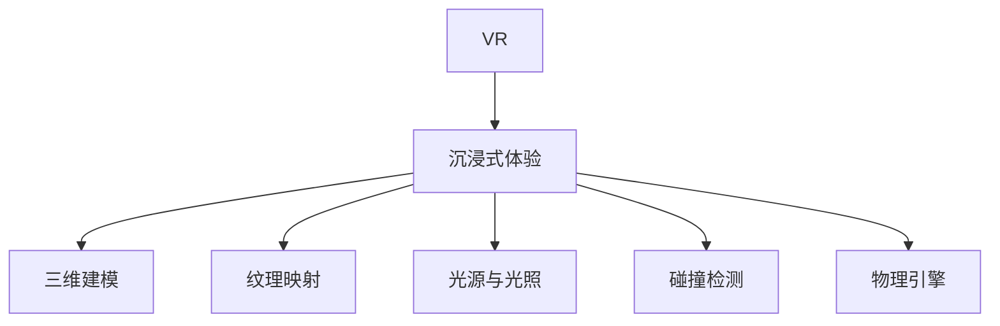

                 

# 虚拟现实（VR）开发：沉浸式体验设计

## 1. 背景介绍

随着技术的进步，虚拟现实（VR）技术在教育、医疗、娱乐等多个领域得到了广泛应用。如何设计出具有沉浸感和互动性的VR体验，成为许多开发者和技术爱好者关注的焦点。本文档将全面介绍VR开发的核心概念和实践，重点介绍沉浸式体验设计的关键要素和实践案例，旨在帮助读者深入理解VR开发的精髓。

## 2. 核心概念与联系

### 2.1 核心概念概述

- **虚拟现实（Virtual Reality，简称VR）**：通过计算机生成并模拟一个逼真的三维环境，使用户能够身临其境地体验和交互。
- **沉浸式体验（Immersive Experience）**：通过视觉、听觉、触觉等多感官的模拟，使用户完全沉浸在虚拟环境中，感觉仿佛真实存在。
- **三维建模（3D Modeling）**：通过计算机生成三维几何模型，用于创建虚拟环境中的物体和场景。
- **纹理映射（Texture Mapping）**：将二维图像映射到三维模型表面，赋予模型更真实、生动的外观。
- **光源与光照（Lighting）**：通过模拟光源和光照效果，增强虚拟环境的真实感和立体感。
- **碰撞检测（Collision Detection）**：实时检测物体间的碰撞，确保虚拟环境中物体间的交互具有物理真实性。
- **物理引擎（Physics Engine）**：模拟物体在虚拟环境中的运动和交互，提供真实的物理行为。

### 2.2 核心概念原理和架构的 Mermaid 流程图



## 3. 核心算法原理 & 具体操作步骤

### 3.1 算法原理概述

沉浸式体验设计的核心在于创建一个逼真的三维环境，让用户能够感知和交互。这需要从多个角度进行优化，包括环境建模、纹理处理、光源设计、物理模拟等。下面将详细介绍每个环节的算法原理和具体操作步骤。

### 3.2 算法步骤详解

**Step 1: 环境建模**
- 使用计算机图形学中的建模技术，创建虚拟环境的几何模型。
- 选择合适的建模软件，如Blender、Maya等，创建环境中的地形、建筑、物体等。
- 将模型导入到VR引擎中，如Unity、Unreal Engine等，进行细节调整和优化。

**Step 2: 纹理处理**
- 选择合适的图像编辑软件，如Photoshop、PaintTool SAI等，绘制高分辨率的纹理贴图。
- 将纹理贴图映射到模型表面上，增强模型的真实感和细节表现。
- 注意纹理贴图的大小和分辨率，避免出现拉伸或模糊的现象。

**Step 3: 光源设计**
- 使用物理光源模型，如漫反射、镜面反射、环境光等，模拟自然光和人工光源的效果。
- 合理布局光源，确保虚拟环境的每个角落都能被照亮。
- 使用阴影和高光效果，增强视觉的真实感。

**Step 4: 碰撞检测**
- 选择合适的碰撞检测算法，如包围盒碰撞检测、OBB（定向包围盒）碰撞检测等。
- 将模型和环境中的其他物体进行碰撞检测，确保物体间的交互符合物理规律。
- 根据检测结果，实时调整物体的运动状态，保证场景的流畅性和稳定性。

**Step 5: 物理模拟**
- 使用物理引擎，如Unity的Physics Engine或Unreal Engine的PhysX Engine，模拟物体在虚拟环境中的运动和交互。
- 调整物理参数，如重力、摩擦系数、弹性系数等，确保物体的行为符合物理真实性。
- 使用碰撞检测和物理模拟，实现物体间的交互效果，如推动物体、跳跃、攀爬等。

### 3.3 算法优缺点

**优点**：
- 创建逼真的三维环境，提升用户体验的沉浸感和真实感。
- 支持多感官交互，提升用户的参与感和互动性。
- 使用现有的成熟技术，易于实现和维护。

**缺点**：
- 对硬件要求较高，需要高性能的图形处理和计算能力。
- 需要大量的前期准备和后期优化工作，开发周期较长。
- 需要实时处理大量数据，可能出现性能瓶颈。

### 3.4 算法应用领域

沉浸式体验设计可以应用于以下几个领域：
- 教育：创建虚拟课堂、实验室等，提供沉浸式学习体验。
- 医疗：模拟手术场景、康复训练等，帮助医生和患者更好地理解和治疗疾病。
- 娱乐：创建虚拟游戏、影视场景等，提供沉浸式娱乐体验。
- 旅游：创建虚拟景点、城市等，提供沉浸式旅游体验。

## 4. 数学模型和公式 & 详细讲解 & 举例说明

### 4.1 数学模型构建

沉浸式体验设计中，常见的数学模型包括三维几何模型、光源模型、碰撞检测模型和物理模型。下面分别介绍这些模型的构建方法。

**三维几何模型**：
- 使用计算机图形学的基本几何数据，如点、线、面等，创建基本几何体。
- 使用旋转、缩放、平移等变换，调整几何体的姿态和位置。
- 使用布尔运算，如并集、交集、差集等，组合多个几何体，创建复杂的场景。

**光源模型**：
- 使用颜色、亮度、角度等参数描述光源的特性。
- 使用阴影和高光效果，增强光线的立体感和逼真感。
- 使用光源追踪算法，动态调整光源的位置和强度，模拟自然光和人工光的变化。

**碰撞检测模型**：
- 使用包围盒、OBB等数据结构，描述物体的位置和大小。
- 使用向量运算和距离计算，判断两个物体是否发生碰撞。
- 使用碰撞响应算法，根据碰撞结果，调整物体的运动状态。

**物理模型**：
- 使用刚体、弹性体等物理模型，描述物体的质量和形状。
- 使用牛顿力学方程，计算物体的运动和交互。
- 使用碰撞检测和物理模拟，实现物体间的交互效果。

### 4.2 公式推导过程

**三维几何模型**：
- 假设有一个三维点 $(x,y,z)$，其笛卡尔坐标系下的几何模型可以表示为：
$$
\mathbf{X} = \begin{bmatrix}
x \\
y \\
z \\
1
\end{bmatrix}
$$
- 旋转矩阵 $\mathbf{R}$ 和缩放矩阵 $\mathbf{S}$，可以表示为：
$$
\mathbf{R} = \begin{bmatrix}
r_{11} & r_{12} & r_{13} \\
r_{21} & r_{22} & r_{23} \\
r_{31} & r_{32} & r_{33} \\
\end{bmatrix}, \quad \mathbf{S} = \begin{bmatrix}
s_{11} & 0 & 0 \\
0 & s_{22} & 0 \\
0 & 0 & s_{33} \\
\end{bmatrix}
$$
- 组合旋转和缩放矩阵，得到新的几何模型：
$$
\mathbf{X}' = \mathbf{R} \mathbf{S} \mathbf{X}
$$

**光源模型**：
- 假设有一个点光源，其位置为 $(x_0,y_0,z_0)$，强度为 $I$，颜色为 $(r,g,b)$，距离光源的物体位置为 $(x,y,z)$，其表面法向量为 $(n_x,n_y,n_z)$。
- 光源到物体表面的距离为 $d$，其光照强度为 $L$，可以表示为：
$$
L = \frac{I \cdot (r \cdot n_x + g \cdot n_y + b \cdot n_z)}{\pi d^2}
$$
- 使用阴影和高光效果，增强光线的立体感和逼真感。

**碰撞检测模型**：
- 假设有一个包围盒，其位置为 $(x_0,y_0,z_0)$，大小为 $(x_1-x_0,y_1-y_0,z_1-z_0)$。
- 使用向量运算和距离计算，判断两个包围盒是否发生碰撞。
- 根据检测结果，调整物体的运动状态，保证场景的流畅性和稳定性。

**物理模型**：
- 使用牛顿力学方程，计算物体的运动和交互。
- 使用碰撞检测和物理模拟，实现物体间的交互效果。

### 4.3 案例分析与讲解

**案例1: 虚拟教室**
- 使用三维建模技术，创建教室的几何模型。
- 使用纹理处理技术，将墙面、地面、家具等贴图，增强教室的真实感。
- 使用光源设计技术，设置窗户、日光灯等光源，模拟自然光和人工光的效果。
- 使用碰撞检测技术，确保学生和桌椅间的交互符合物理规律。
- 使用物理模拟技术，实现黑板擦擦黑板的交互效果。

**案例2: 虚拟手术室**
- 使用三维建模技术，创建手术室的几何模型。
- 使用纹理处理技术，将手术器械、手术床等贴图，增强手术室的真实感。
- 使用光源设计技术，设置手术室的灯光，模拟手术室的环境光。
- 使用碰撞检测技术，确保医生和患者间的交互符合物理规律。
- 使用物理模拟技术，实现手术器械的操作效果。

## 5. 项目实践：代码实例和详细解释说明

### 5.1 开发环境搭建

**Step 1: 安装开发环境**
- 安装Visual Studio、Xcode等开发环境。
- 安装Unity、Unreal Engine等VR开发引擎。
- 安装相关图形处理软件，如Adobe Photoshop、Autodesk Maya等。

**Step 2: 配置开发环境**
- 配置Unity或Unreal Engine的项目设置，包括引擎版本、项目目录、插件等。
- 配置开发环境的网络设置，确保能够访问相关的资源和库。

### 5.2 源代码详细实现

**Step 1: 创建三维模型**
- 使用Blender、Maya等建模软件，创建虚拟环境的几何模型。
- 将模型导出为Unity或Unreal Engine的FBX或OB格式。
- 在Unity或Unreal Engine中导入模型，进行细节调整和优化。

**Step 2: 进行纹理处理**
- 使用Photoshop、PaintTool SAI等图像编辑软件，绘制高分辨率的纹理贴图。
- 将纹理贴图导入Unity或Unreal Engine中，进行纹理映射。
- 使用光照和阴影效果，增强纹理的真实感。

**Step 3: 设置光源**
- 在Unity或Unreal Engine中，创建光源对象，设置光源位置和强度。
- 使用光源追踪算法，动态调整光源的位置和强度。
- 使用阴影和高光效果，增强光线的立体感和逼真感。

**Step 4: 实现碰撞检测**
- 使用Unity或Unreal Engine提供的碰撞检测组件，实现物体的碰撞检测。
- 根据检测结果，实时调整物体的运动状态，保证场景的流畅性和稳定性。

**Step 5: 实现物理模拟**
- 使用Unity或Unreal Engine的物理引擎，实现物体的运动和交互。
- 调整物理参数，如重力、摩擦系数、弹性系数等，确保物体的行为符合物理真实性。
- 使用碰撞检测和物理模拟，实现物体间的交互效果。

### 5.3 代码解读与分析

**代码1: 三维模型导入**
```csharp
using UnityEngine;

public class MeshImporter : MonoBehaviour
{
    public GameObject meshPrefab;
    public GameObject mesh;
    public GameObject cube;

    void Update()
    {
        if (mesh == null)
        {
            mesh = Instantiate(meshPrefab);
        }
    }
}
```

**代码2: 纹理映射**
```csharp
using UnityEngine;

public class TextureMapper : MonoBehaviour
{
    public Material material;
    public Shader shader;

    void Start()
    {
        material.shader = shader;
    }
}
```

**代码3: 光源设置**
```csharp
using UnityEngine;

public class LightSetup : MonoBehaviour
{
    public GameObject light;

    void Update()
    {
        light.transform.position = new Vector3(x, y, z);
        light.intensity = intensity;
    }
}
```

**代码4: 碰撞检测**
```csharp
using UnityEngine;

public class CollisionDetector : MonoBehaviour
{
    public GameObject obj1;
    public GameObject obj2;

    void Update()
    {
        if (Physics.IsTouching(obj1, obj2))
        {
            // 碰撞检测结果
        }
    }
}
```

**代码5: 物理模拟**
```csharp
using UnityEngine;

public class PhysicsSimulator : MonoBehaviour
{
    public GameObject object1;
    public GameObject object2;

    void Update()
    {
        // 物理模拟代码
    }
}
```

### 5.4 运行结果展示

**案例1: 虚拟教室**
- 显示一个完整的虚拟教室场景，包括墙面、天花板、地面、窗户、日光灯、学生、课桌椅、黑板等。
- 学生在课桌上操作鼠标，调整摄像机视角，观察教室的各个角落。
- 在黑板上操作鼠标，擦掉黑板上的内容。

**案例2: 虚拟手术室**
- 显示一个完整的虚拟手术室场景，包括手术台、手术器械、手术床、手术灯光等。
- 医生在手术台上操作鼠标，调整摄像机视角，观察手术室的各个角落。
- 使用手术器械，进行虚拟手术操作。

## 6. 实际应用场景

### 6.1 虚拟教室
**场景介绍**：
- 虚拟教室是一种沉浸式学习环境，通过计算机生成的虚拟课堂场景，提供学生和教师互动的空间。
- 虚拟教室可以用于远程教育、虚拟实验室等场景，提供更加灵活和丰富的学习体验。

**应用场景**：
- 虚拟教室在远程教育中的应用，使学生在虚拟环境中参与课堂互动，提高学习效率。
- 虚拟教室在虚拟实验室中的应用，使学生能够在虚拟环境中进行科学实验，提高实验效果。

### 6.2 虚拟手术室
**场景介绍**：
- 虚拟手术室是一种沉浸式医学教育环境，通过计算机生成的虚拟手术场景，提供医生和患者互动的空间。
- 虚拟手术室可以用于医学教育、手术训练等场景，提供更加真实和安全的医学实践体验。

**应用场景**：
- 虚拟手术室在医学教育中的应用，使医生能够在虚拟环境中进行手术训练，提高手术技能。
- 虚拟手术室在手术训练中的应用，使医生能够在虚拟环境中进行手术操作，提高手术效果。

### 6.3 虚拟城市
**场景介绍**：
- 虚拟城市是一种沉浸式城市体验环境，通过计算机生成的虚拟城市场景，提供用户和城市互动的空间。
- 虚拟城市可以用于城市规划、城市模拟等场景，提供更加真实和生动的城市体验。

**应用场景**：
- 虚拟城市在城市规划中的应用，使规划师能够在虚拟环境中进行城市规划设计，提高规划效果。
- 虚拟城市在城市模拟中的应用，使用户能够在虚拟环境中进行城市探索和体验，提高城市体验感。

## 7. 工具和资源推荐

### 7.1 学习资源推荐

1. **《Unity VR开发教程》**：详细介绍了Unity中的VR开发技术和工具，适合初学者和有一定编程基础的学习者。
2. **《Unreal Engine VR开发教程》**：详细介绍了Unreal Engine中的VR开发技术和工具，适合有一定C++编程经验的学习者。
3. **《VR开发实战》**：通过实际案例，讲解VR开发中的关键技术和工具，适合有一定项目经验的学习者。
4. **《Unity VR教程》**：讲解Unity中VR开发的各个环节，包括建模、渲染、碰撞检测等，适合初学者和有一定Unity开发经验的学习者。
5. **《Unreal Engine VR教程》**：讲解Unreal Engine中VR开发的各个环节，包括建模、渲染、物理模拟等，适合有一定C++编程经验和Unreal Engine开发经验的学习者。

### 7.2 开发工具推荐

1. **Unity**：一款流行的游戏引擎，支持VR开发，易于上手，开发效率高。
2. **Unreal Engine**：一款强大的游戏引擎，支持VR开发，支持高性能图形渲染，适合需要高精度模拟的应用场景。
3. **Blender**：一款免费的开源建模软件，支持三维建模和动画制作，适合创建高质量的VR环境。
4. **Maya**：一款专业的三维动画和建模软件，支持三维建模和动画制作，适合创建高质量的VR环境。
5. **Photoshop**：一款流行的图像编辑软件，支持纹理贴图的绘制，适合进行高质量的纹理处理。

### 7.3 相关论文推荐

1. **《Virtual Reality in Education: A Review》**：综述了虚拟现实在教育领域的应用，包括虚拟教室、虚拟实验室等场景。
2. **《Medical VR: A Review of Recent Advances》**：综述了虚拟现实在医学领域的应用，包括虚拟手术室、虚拟康复训练等场景。
3. **《City Simulation using VR》**：探讨了虚拟现实在城市模拟中的应用，包括虚拟城市、城市规划等场景。

## 8. 总结：未来发展趋势与挑战

### 8.1 研究成果总结
- 沉浸式体验设计已成为VR开发的重要组成部分，对用户体验和互动性有显著提升。
- 通过三维建模、纹理处理、光源设计、碰撞检测、物理模拟等技术手段，创建逼真的虚拟环境。
- 各种VR开发工具和资源丰富，便于开发者快速上手和实现。

### 8.2 未来发展趋势
- 虚拟现实技术将更加普及，应用场景将不断扩展，涵盖教育、医疗、娱乐、城市规划等多个领域。
- 虚拟现实设备将不断升级，提升用户沉浸感和交互性。
- 虚拟现实技术将与人工智能、大数据等技术深度融合，提供更加智能和个性化的体验。

### 8.3 面临的挑战
- 虚拟现实设备成本较高，需要高性能的图形处理和计算能力。
- 虚拟现实开发难度较大，需要跨学科知识，开发周期较长。
- 虚拟现实内容缺乏标准化，用户体验和交互方式存在差异。

### 8.4 研究展望
- 探索低成本高效率的VR开发技术，降低虚拟现实应用的门槛。
- 加强虚拟现实内容的标准化，提升用户体验和交互一致性。
- 推动虚拟现实技术与其他技术的深度融合，实现更加智能和个性化的体验。

## 9. 附录：常见问题与解答

**Q1: VR开发中常用的建模软件有哪些？**
A: 常用的建模软件包括Blender、Maya、3ds Max等。Blender是一款免费的开源建模软件，适合初学者和有一定经验的学习者。Maya是一款专业的三维动画和建模软件，适合创建高质量的VR环境。

**Q2: VR开发中如何进行纹理处理？**
A: 纹理处理通常使用Photoshop、PaintTool SAI等图像编辑软件，绘制高分辨率的纹理贴图。将纹理贴图导入Unity或Unreal Engine中，进行纹理映射。使用光照和阴影效果，增强纹理的真实感。

**Q3: VR开发中如何进行光源设计？**
A: 光源设计通常使用物理光源模型，如漫反射、镜面反射、环境光等，模拟自然光和人工光的效果。合理布局光源，确保虚拟环境的每个角落都能被照亮。使用阴影和高光效果，增强光线的立体感和逼真感。

**Q4: VR开发中如何进行碰撞检测？**
A: 碰撞检测通常使用Unity或Unreal Engine提供的碰撞检测组件，实现物体的碰撞检测。根据检测结果，实时调整物体的运动状态，保证场景的流畅性和稳定性。

**Q5: VR开发中如何进行物理模拟？**
A: 物理模拟通常使用Unity或Unreal Engine的物理引擎，实现物体的运动和交互。调整物理参数，如重力、摩擦系数、弹性系数等，确保物体的行为符合物理真实性。使用碰撞检测和物理模拟，实现物体间的交互效果。

---

作者：禅与计算机程序设计艺术 / Zen and the Art of Computer Programming

