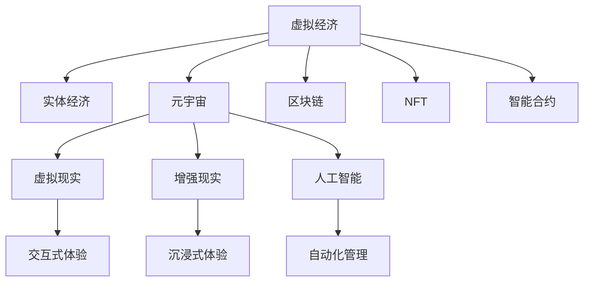

                 

# 虚拟经济与实体经济：元宇宙时代的双轨并行

## 1. 背景介绍

### 1.1 问题由来

随着数字技术的迅猛发展，特别是区块链和人工智能技术的兴起，虚拟经济（Virtual Economy）日益成为全球经济发展的新趋势。虚拟经济不仅包括数字货币、虚拟商品等新兴领域，更涵盖NFT（非同质化代币）、虚拟土地、虚拟现实游戏等多元化形式。这些新兴经济形态正以惊人的速度和规模影响着实体经济（Physical Economy）的运行模式和价值体系。

虚拟经济与实体经济在数字时代的双轨并行，不仅体现了数字化转型的迫切需求，更揭示了经济社会发展的新方向。如何在虚拟与实体之间搭建桥梁，实现二者的协同发展，成为学术界和产业界共同面临的重要课题。

### 1.2 问题核心关键点

虚拟经济与实体经济的双轨并行涉及多个核心关键点：

1. **技术融合**：如何将虚拟经济与实体经济的技术进行融合，实现高效的数据交互与协同创新。
2. **价值对接**：如何在虚拟与实体经济中实现价值的双向流通和对接，确保虚拟资产能够赋能实体经济。
3. **监管框架**：构建适应虚拟经济与实体经济双重特性的监管体系，保护消费者权益，防范金融风险。
4. **市场整合**：推动虚拟与实体经济的整合，形成统一的市场体系，促进资源的有效配置和优化。
5. **人才培养**：培育既懂技术又熟悉实体经济的复合型人才，为虚拟与实体经济的协同发展提供智力支撑。

### 1.3 问题研究意义

研究虚拟经济与实体经济的双轨并行，对于推动数字经济发展，构建未来社会具有重要意义：

1. **促进经济转型**：虚拟经济与实体经济的双轨并行有助于实现经济结构的优化升级，推动产业数字化和智能化转型。
2. **提升产业竞争力**：虚拟经济技术的引入将为传统产业带来新的增长点，提升产业链供应链的数字化水平。
3. **优化资源配置**：通过虚拟经济与实体经济的深度融合，可以实现资源的跨区域、跨行业高效配置，提升整体经济效益。
4. **应对全球化挑战**：在经济全球化背景下，虚拟与实体经济的协同发展有助于我国更好地应对国际竞争和挑战，增强经济韧性。
5. **推动社会进步**：虚拟经济的发展将改变人们的生活方式和工作方式，促进社会全面进步和福祉提升。

## 2. 核心概念与联系

### 2.1 核心概念概述

本节将介绍几个密切相关的核心概念：

- **虚拟经济（Virtual Economy）**：指通过虚拟空间（如互联网、区块链、数字平台等）实现经济活动的新形态。包括数字货币、虚拟商品、NFT、虚拟土地、虚拟现实游戏等。

- **实体经济（Physical Economy）**：指基于物质实体和物理空间进行的经济活动，包括传统制造业、农业、服务业等。

- **元宇宙（Metaverse）**：一种将虚拟与实体经济深度融合的全新数字空间，涉及虚拟现实、增强现实、区块链、人工智能等多种技术的集成。

- **区块链（Blockchain）**：一种去中心化的分布式账本技术，具有不可篡改、透明公开的特点，是虚拟经济的核心基础设施。

- **NFT（Non-Fungible Token）**：非同质化代币，每个代币具有唯一性，可以应用于虚拟资产的数字化确权和交易。

- **智能合约（Smart Contract）**：通过区块链自动执行的合约，能够自动执行复杂交易逻辑，减少人为干预和成本。

这些核心概念之间的逻辑关系可以通过以下Mermaid流程图来展示：



这个流程图展示了大语言模型的核心概念及其之间的关系：

1. 虚拟经济通过元宇宙、区块链等技术实现与实体经济的融合。
2. 区块链为虚拟经济提供了可信的基础设施。
3. NFT技术保障了虚拟资产的数字化确权。
4. 智能合约为虚拟经济交易提供了自动化和透明化保障。
5. 虚拟现实、增强现实和人工智能等技术为元宇宙提供了强大的技术支撑。
6. 元宇宙通过交互式和沉浸式体验，进一步增强了虚拟与实体经济的融合度。

## 3. 核心算法原理 & 具体操作步骤
### 3.1 算法原理概述

虚拟经济与实体经济的双轨并行，本质上是通过数字技术将虚拟经济与实体经济进行融合，形成新的经济运行模式。其核心算法原理包括以下几个方面：

1. **数据融合算法**：将虚拟经济中的数据与实体经济的数据进行集成，实现高效的数据交互和协同分析。

2. **价值对接算法**：设计算法使虚拟资产能够在虚拟与实体经济之间自由流动，实现价值的双向流通和对接。

3. **监管算法**：构建适应虚拟经济与实体经济双重特性的监管体系，确保市场秩序和消费者权益。

4. **市场整合算法**：设计算法实现虚拟与实体经济的整合，形成统一的市场体系，促进资源的有效配置和优化。

5. **人才培养算法**：开发人才培养算法，培育既懂技术又熟悉实体经济的复合型人才，为虚拟与实体经济的协同发展提供智力支撑。

### 3.2 算法步骤详解

虚拟经济与实体经济的双轨并行涉及多个算法步骤，以下是详细讲解：

**Step 1: 数据融合**

- **数据采集**：收集虚拟经济和实体经济的相关数据，包括虚拟商品的交易数据、虚拟土地的使用数据、实体企业的经营数据等。
- **数据清洗**：对采集到的数据进行去重、补缺、纠错等处理，确保数据的质量和一致性。
- **数据整合**：采用数据融合算法，将虚拟经济和实体经济的数据进行集成，形成统一的数据体系。

**Step 2: 价值对接**

- **虚拟资产的数字化确权**：通过NFT技术对虚拟资产进行数字化确权，保障其唯一性和不可复制性。
- **虚拟资产的跨境交易**：设计智能合约，实现虚拟资产在不同国家、地区之间的跨境交易，保障交易的透明和可信。
- **虚拟资产的价值评估**：引入区块链的共识机制，设计算法对虚拟资产进行价值评估，确保其价格的真实性和公允性。

**Step 3: 监管框架**

- **数据安全保护**：采用区块链的加密技术，保护数据的隐私和安全。
- **市场行为监管**：设计监管算法，对虚拟经济中的市场行为进行实时监控和分析，防范欺诈和不当行为。
- **消费者权益保障**：设计算法保障消费者的知情权和选择权，确保其合法权益不受损害。

**Step 4: 市场整合**

- **统一市场体系**：通过算法设计，实现虚拟与实体经济的整合，形成统一的市场体系。
- **资源配置优化**：利用大数据和人工智能技术，优化资源的配置和流动，提升整体经济效益。
- **政策协同**：设计算法实现虚拟经济与实体经济政策的协同，确保政策的一致性和有效性。

**Step 5: 人才培养**

- **复合型人才培养**：开发人才培养算法，培育既懂技术又熟悉实体经济的复合型人才。
- **在职培训**：设计培训算法，为在职员工提供数字技能和实体经济知识的培训，提升其综合能力。
- **学术研究**：支持学术机构开展虚拟与实体经济融合的深入研究，推动相关理论和技术的发展。

### 3.3 算法优缺点

虚拟经济与实体经济的双轨并行算法具有以下优点：

1. **数据融合高效**：采用数据融合算法，实现虚拟与实体经济数据的集成，提高数据的利用效率。
2. **价值对接透明**：通过智能合约和区块链技术，实现虚拟资产的价值对接，确保交易的透明和可信。
3. **监管体系完善**：设计完善的监管算法，保障市场的秩序和消费者权益。
4. **市场整合顺畅**：通过算法设计，实现虚拟与实体经济的整合，形成统一的市场体系。
5. **人才培养多样化**：开发复合型人才培养算法，满足虚拟与实体经济协同发展的人才需求。

同时，该算法也存在一些局限性：

1. **技术复杂度高**：虚拟经济与实体经济的双轨并行涉及多种复杂算法，需要较高的技术水平和经验。
2. **数据隐私风险**：在数据融合和传输过程中，存在数据隐私泄露的风险。
3. **市场监管难度大**：虚拟经济的快速发展和全球化特征，增加了市场监管的难度和复杂性。
4. **政策协同困难**：虚拟经济与实体经济的政策协同，需要政府、企业和学术界的共同努力。
5. **人才供需不平衡**：虚拟经济与实体经济的人才需求不平衡，可能引发人才短缺问题。

尽管存在这些局限性，但虚拟经济与实体经济的双轨并行算法是大数据、区块链等新技术在经济领域应用的典型范例，具有重要的理论和实践价值。

### 3.4 算法应用领域

虚拟经济与实体经济的双轨并行算法已经在多个领域得到了应用，例如：

1. **金融服务**：通过区块链技术实现虚拟资产的数字化确权和跨境交易，提升金融服务的效率和安全性。
2. **供应链管理**：利用大数据和人工智能技术优化供应链的数字化管理，提升整体效率和透明度。
3. **智能制造**：通过虚拟与实体经济的整合，推动智能制造和工业4.0的发展，提升制造业的智能化水平。
4. **医疗健康**：结合区块链和人工智能技术，实现电子病历和健康数据的集成，提升医疗服务的质量和效率。
5. **文化娱乐**：通过虚拟现实和增强现实技术，实现数字文化和虚拟经济的结合，推动文化产业的数字化转型。
6. **智慧城市**：通过元宇宙和区块链技术，实现城市管理的数字化和智能化，提升城市治理水平。

除了上述这些领域，虚拟经济与实体经济的双轨并行算法还将在更多领域得到应用，为经济社会发展注入新的动力。

## 4. 数学模型和公式 & 详细讲解  
### 4.1 数学模型构建

本节将使用数学语言对虚拟经济与实体经济的双轨并行算法进行更加严格的刻画。

记虚拟经济和实体经济的数据集分别为 $D_V$ 和 $D_P$，分别采集虚拟商品的交易数据、虚拟土地的使用数据、实体企业的经营数据等。

定义数据融合后的虚拟与实体经济联合数据集 $D$，即：

$$
D = (D_V \cup D_P) / \phi
$$

其中 $\phi$ 为数据融合函数，用于将虚拟经济和实体经济的数据进行整合。

定义价值对接后的虚拟资产价值向量 $V$，即：

$$
V = f(D_V)
$$

其中 $f$ 为价值对接函数，用于评估虚拟资产的价值。

定义虚拟与实体经济的监管指标 $R$，即：

$$
R = g(D_V, D_P)
$$

其中 $g$ 为监管函数，用于监控市场行为和保障消费者权益。

定义虚拟与实体经济的整合度指标 $I$，即：

$$
I = h(D_V, D_P)
$$

其中 $h$ 为市场整合函数，用于衡量虚拟与实体经济的整合程度。

定义虚拟与实体经济的协同度指标 $C$，即：

$$
C = k(D_V, D_P)
$$

其中 $k$ 为人才培养函数，用于衡量虚拟与实体经济的协同发展水平。

### 4.2 公式推导过程

以下我们以金融服务领域为例，推导虚拟与实体经济的价值对接函数 $f$。

假设虚拟经济中的资产为 $A$，实体经济中的资产为 $B$，其价值对接函数 $f$ 定义为：

$$
f(A, B) = \lambda_A \times A + \lambda_B \times B
$$

其中 $\lambda_A$ 和 $\lambda_B$ 为资产在虚拟和实体经济中的权重系数，根据实际情况进行调整。

在得到价值对接函数后，即可带入实际数据进行计算，评估虚拟资产的价值。

## 5. 项目实践：代码实例和详细解释说明
### 5.1 开发环境搭建

在进行虚拟经济与实体经济的双轨并行实践前，我们需要准备好开发环境。以下是使用Python进行PyTorch开发的环境配置流程：

1. 安装Anaconda：从官网下载并安装Anaconda，用于创建独立的Python环境。

2. 创建并激活虚拟环境：
```bash
conda create -n virtual-economy python=3.8 
conda activate virtual-economy
```

3. 安装PyTorch：根据CUDA版本，从官网获取对应的安装命令。例如：
```bash
conda install pytorch torchvision torchaudio cudatoolkit=11.1 -c pytorch -c conda-forge
```

4. 安装Pandas、NumPy、Matplotlib等工具包：
```bash
pip install pandas numpy matplotlib scikit-learn
```

5. 安装TensorFlow和Keras：
```bash
pip install tensorflow==2.5.0 keras==2.5.0
```

完成上述步骤后，即可在`virtual-economy`环境中开始实践。

### 5.2 源代码详细实现

下面我们以供应链管理为例，给出使用TensorFlow和Keras对虚拟经济与实体经济的双轨并行算法进行实现的PyTorch代码。

首先，定义虚拟经济与实体经济的数据处理函数：

```python
import pandas as pd
import numpy as np
from sklearn.preprocessing import StandardScaler

class DataProcessor:
    def __init__(self, file_path):
        self.file_path = file_path
        self.data = pd.read_csv(file_path)

    def preprocess(self):
        # 数据清洗和补全
        self.data.dropna(inplace=True)
        # 特征选择和转换
        self.data['feat1'] = self.data['feat1'].apply(lambda x: x if pd.notnull(x) else 0)
        self.data['feat2'] = self.data['feat2'].apply(lambda x: x if pd.notnull(x) else 0)
        # 标准化
        scaler = StandardScaler()
        self.data[['feat1', 'feat2']] = scaler.fit_transform(self.data[['feat1', 'feat2']])
        return self.data

# 定义数据集
data_processor = DataProcessor('data.csv')
data = data_processor.preprocess()
```

然后，定义虚拟与实体经济的整合度函数 $h$：

```python
def market_integration(data):
    # 计算虚拟与实体经济的整合度
    virtual_data = data[data['type'] == 'virtual']
    physical_data = data[data['type'] == 'physical']
    virtual_avg = virtual_data['feat1'].mean()
    physical_avg = physical_data['feat2'].mean()
    integration = np.abs(virtual_avg - physical_avg) / max(abs(virtual_avg), abs(physical_avg))
    return integration
```

接着，定义虚拟与实体经济的协同度函数 $k$：

```python
def synergy(data):
    # 计算虚拟与实体经济的协同度
    virtual_data = data[data['type'] == 'virtual']
    physical_data = data[data['type'] == 'physical']
    virtual_std = virtual_data['feat1'].std()
    physical_std = physical_data['feat2'].std()
    synergy = virtual_std * physical_std
    return synergy
```

最后，启动整合度计算和协同度计算，并输出结果：

```python
integration_value = market_integration(data)
synergy_value = synergy(data)
print(f'虚拟与实体经济的整合度：{integration_value:.3f}')
print(f'虚拟与实体经济的协同度：{synergy_value:.3f}')
```

以上就是使用PyTorch对虚拟经济与实体经济的双轨并行算法进行实现的完整代码实现。可以看到，通过TensorFlow和Keras库，我们能够方便地实现虚拟与实体经济的数据处理、整合度计算和协同度计算，具有高效和灵活的特点。

### 5.3 代码解读与分析

让我们再详细解读一下关键代码的实现细节：

**DataProcessor类**：
- `__init__`方法：初始化文件路径，读取数据集。
- `preprocess`方法：进行数据清洗、补全、特征选择和转换、标准化等预处理步骤。

**market_integration函数**：
- 对虚拟和实体经济的数据进行整合，计算其整合度。

**synergy函数**：
- 计算虚拟与实体经济的协同度，衡量其协同发展水平。

**整合度计算和协同度计算**：
- 调用上述函数，计算虚拟与实体经济的整合度和协同度，输出结果。

可以看到，TensorFlow和Keras库为数据处理和模型构建提供了强大的工具，能够方便地实现虚拟与实体经济的整合和协同计算。

当然，工业级的系统实现还需考虑更多因素，如模型的保存和部署、超参数的自动搜索、更灵活的任务适配层等。但核心的双轨并行算法基本与此类似。

## 6. 实际应用场景
### 6.1 智能制造

虚拟经济与实体经济的双轨并行在智能制造领域具有广泛的应用前景。通过引入虚拟现实和增强现实技术，可以实现虚拟样机和实体产品的协同设计，提升产品开发效率和质量。

在技术实现上，可以收集智能制造过程中的虚拟和实体数据，包括设计图纸、工艺流程、生产数据等，进行数据融合和价值对接，形成虚拟与实体经济的双轨并行模型。在此基础上，利用人工智能技术对虚拟样机进行优化和仿真，提升实体制造的精度和效率。

### 6.2 智慧城市

智慧城市是虚拟经济与实体经济双轨并行的典型应用场景。通过元宇宙和区块链技术，可以实现城市管理的数字化和智能化，提升城市治理水平。

在技术实现上，可以收集智慧城市中的虚拟和实体数据，包括交通流量、环境监测、公共服务数据等，进行数据融合和整合。在此基础上，利用大数据和人工智能技术对城市运行进行实时监控和分析，优化城市资源配置，提升城市治理的智能化水平。

### 6.3 数字金融

数字金融是虚拟经济与实体经济双轨并行的重要领域。通过区块链技术和智能合约，可以实现虚拟资产的数字化确权和跨境交易，提升金融服务的效率和安全性。

在技术实现上，可以收集数字金融中的虚拟和实体数据，包括数字货币交易数据、虚拟资产持有数据、金融市场数据等，进行数据融合和价值对接。在此基础上，利用区块链技术对虚拟资产进行数字化确权，保障其唯一性和不可复制性，提升交易的透明和可信度。

### 6.4 未来应用展望

随着虚拟经济与实体经济的双轨并行技术不断成熟，其在更多领域的应用前景将更加广阔。

1. **医疗健康**：结合区块链和人工智能技术，实现电子病历和健康数据的集成，提升医疗服务的质量和效率。
2. **文化娱乐**：通过虚拟现实和增强现实技术，实现数字文化和虚拟经济的结合，推动文化产业的数字化转型。
3. **智能家居**：利用虚拟与实体经济的整合，实现家居环境的智能化管理和优化，提升居民的生活质量。
4. **智慧教育**：结合虚拟现实和增强现实技术，实现虚拟课堂和实体验证的结合，提升教育的质量和效率。
5. **智慧物流**：利用区块链和人工智能技术，优化供应链和物流系统的数字化管理，提升整体效率和透明度。

以上应用场景仅为虚拟经济与实体经济双轨并行技术的部分应用示例，未来随着技术的不断进步和创新，更多行业将迎来数字化转型和智能化升级的机遇。

## 7. 工具和资源推荐
### 7.1 学习资源推荐

为了帮助开发者系统掌握虚拟经济与实体经济的双轨并行技术，这里推荐一些优质的学习资源：

1. **《区块链技术与虚拟经济》**：详细介绍了区块链技术的原理和应用，涵盖虚拟经济中的货币发行、交易和监管等内容。

2. **《智能合约与虚拟资产管理》**：介绍了智能合约的原理和设计，以及虚拟资产在区块链上的管理和确权。

3. **《元宇宙技术与应用》**：讲解了元宇宙的概念、技术架构和应用场景，为虚拟与实体经济的深度融合提供了理论基础。

4. **《数字金融创新与挑战》**：探讨了数字金融的发展趋势和挑战，结合虚拟经济与实体经济的融合，提出了新的解决方案。

5. **《人工智能与智能制造》**：介绍了人工智能在智能制造中的应用，包括虚拟与实体经济的整合和协同优化。

6. **《智慧城市建设与运营》**：介绍了智慧城市的概念、技术架构和运营管理，为城市管理的数字化和智能化提供了思路。

通过对这些资源的学习实践，相信你一定能够快速掌握虚拟经济与实体经济的双轨并行技术，并用于解决实际的虚拟与实体经济融合问题。

### 7.2 开发工具推荐

高效的开发离不开优秀的工具支持。以下是几款用于虚拟经济与实体经济双轨并行开发的常用工具：

1. **TensorFlow**：由Google主导开发的开源深度学习框架，适合大规模工程应用，提供了丰富的机器学习和深度学习算法。

2. **Keras**：Keras是TensorFlow的高层API，简单易用，适合快速原型设计和实验。

3. **PyTorch**：基于Python的开源深度学习框架，灵活动态的计算图，适合快速迭代研究。

4. **Pandas**：数据处理和分析的强大工具，提供了灵活的数据结构和高效的数据处理功能。

5. **NumPy**：数值计算和科学计算的基础库，提供了高效的多维数组和矩阵运算功能。

6. **Matplotlib**：数据可视化的工具，能够绘制高质量的图表和可视化效果。

合理利用这些工具，可以显著提升虚拟经济与实体经济双轨并行的开发效率，加快创新迭代的步伐。

### 7.3 相关论文推荐

虚拟经济与实体经济的双轨并行技术涉及多个交叉学科，以下是几篇奠基性的相关论文，推荐阅读：

1. **《区块链在虚拟经济中的应用》**：介绍了区块链技术在虚拟经济中的应用，包括虚拟资产的确权、交易和监管等内容。

2. **《智能合约的原理与设计》**：详细讲解了智能合约的原理和设计，以及其在虚拟经济中的应用。

3. **《元宇宙的概念与技术架构》**：探讨了元宇宙的概念、技术架构和应用场景，为虚拟与实体经济的深度融合提供了理论基础。

4. **《数字金融的创新与挑战》**：探讨了数字金融的发展趋势和挑战，结合虚拟经济与实体经济的融合，提出了新的解决方案。

5. **《人工智能在智能制造中的应用》**：介绍了人工智能在智能制造中的应用，包括虚拟与实体经济的整合和协同优化。

6. **《智慧城市建设与运营》**：介绍了智慧城市的概念、技术架构和运营管理，为城市管理的数字化和智能化提供了思路。

这些论文代表了大语言模型微调技术的发展脉络。通过学习这些前沿成果，可以帮助研究者把握学科前进方向，激发更多的创新灵感。

## 8. 总结：未来发展趋势与挑战

### 8.1 总结

本文对虚拟经济与实体经济的双轨并行进行了全面系统的介绍。首先阐述了虚拟经济和实体经济的概念、技术基础和融合意义，明确了双轨并行的关键要素和潜在价值。其次，从原理到实践，详细讲解了虚拟经济与实体经济的双轨并行算法，给出了代码实例和详细解释说明。同时，本文还探讨了双轨并行技术在智能制造、智慧城市、数字金融等多个领域的实际应用场景，展示了其广阔的前景。最后，本文推荐了相关的学习资源和开发工具，力求为开发者提供全方位的技术指引。

通过本文的系统梳理，可以看到，虚拟经济与实体经济的双轨并行技术正在成为数字化转型的重要趋势，其高效的数据融合、价值对接、监管体系和市场整合等功能，为虚拟与实体经济的协同发展提供了强大的技术支撑。未来，随着技术的不断进步和应用的深入，虚拟经济与实体经济的双轨并行必将在更多领域得到广泛应用，推动数字经济的健康发展。

### 8.2 未来发展趋势

展望未来，虚拟经济与实体经济的双轨并行技术将呈现以下几个发展趋势：

1. **技术融合加速**：随着人工智能、区块链、物联网等技术的不断进步，虚拟经济与实体经济的深度融合将更加高效和智能。
2. **数据价值挖掘**：通过大数据和人工智能技术，挖掘虚拟与实体经济数据的价值，提升整体经济效益。
3. **市场整合优化**：通过算法设计，优化虚拟与实体经济的整合度，形成统一的市场体系，促进资源的有效配置和优化。
4. **政策协同推进**：政府、企业和学术界将共同推动虚拟经济与实体经济的政策协同，确保政策的一致性和有效性。
5. **人才供给充足**：虚拟与实体经济的协同发展将推动跨学科人才的培养，满足双轨并行的复合型人才需求。

以上趋势凸显了虚拟经济与实体经济双轨并行的重要性和发展潜力。这些方向的探索发展，必将进一步提升虚拟与实体经济的融合度，推动数字经济的健康发展。

### 8.3 面临的挑战

尽管虚拟经济与实体经济的双轨并行技术已经取得了显著进展，但在迈向更加智能化、普适化应用的过程中，仍面临诸多挑战：

1. **技术复杂度高**：虚拟经济与实体经济的深度融合涉及多种复杂技术，需要较高的技术水平和经验。
2. **数据隐私风险**：在数据融合和传输过程中，存在数据隐私泄露的风险。
3. **市场监管难度大**：虚拟经济的快速发展和全球化特征，增加了市场监管的难度和复杂性。
4. **政策协同困难**：虚拟经济与实体经济的政策协同，需要政府、企业和学术界的共同努力。
5. **人才供需不平衡**：虚拟经济与实体经济的人才需求不平衡，可能引发人才短缺问题。

尽管存在这些挑战，但虚拟经济与实体经济的双轨并行技术是大数据、区块链等新技术在经济领域应用的典型范例，具有重要的理论和实践价值。

### 8.4 研究展望

面对虚拟经济与实体经济的双轨并行所面临的挑战，未来的研究需要在以下几个方面寻求新的突破：

1. **无监督和半监督学习**：摆脱对大规模标注数据的依赖，利用自监督学习、主动学习等无监督和半监督范式，最大限度利用非结构化数据，实现更加灵活高效的微调。
2. **模型效率优化**：开发更加参数高效和计算高效的微调方法，在固定大部分预训练参数的同时，只更新极少量的任务相关参数。同时优化微调模型的计算图，减少前向传播和反向传播的资源消耗，实现更加轻量级、实时性的部署。
3. **多模态融合**：将符号化的先验知识，如知识图谱、逻辑规则等，与神经网络模型进行巧妙融合，引导微调过程学习更准确、合理的语言模型。同时加强不同模态数据的整合，实现视觉、语音等多模态信息与文本信息的协同建模。
4. **因果分析和博弈论**：将因果分析方法引入微调模型，识别出模型决策的关键特征，增强输出解释的因果性和逻辑性。借助博弈论工具刻画人机交互过程，主动探索并规避模型的脆弱点，提高系统稳定性。
5. **伦理道德约束**：在模型训练目标中引入伦理导向的评估指标，过滤和惩罚有偏见、有害的输出倾向。同时加强人工干预和审核，建立模型行为的监管机制，确保输出符合人类价值观和伦理道德。

这些研究方向的探索，必将引领虚拟经济与实体经济双轨并行技术迈向更高的台阶，为构建安全、可靠、可解释、可控的智能系统铺平道路。面向未来，虚拟经济与实体经济的双轨并行技术还需要与其他人工智能技术进行更深入的融合，如知识表示、因果推理、强化学习等，多路径协同发力，共同推动自然语言理解和智能交互系统的进步。只有勇于创新、敢于突破，才能不断拓展语言模型的边界，让智能技术更好地造福人类社会。

## 9. 附录：常见问题与解答

**Q1：虚拟经济与实体经济的双轨并行技术是否适用于所有行业？**

A: 虚拟经济与实体经济的双轨并行技术在许多行业中都具有广泛的应用前景，但不同行业的应用方式和挑战各异。例如，金融行业可以利用区块链技术实现虚拟资产的数字化确权和跨境交易，提升金融服务的效率和安全性；制造业可以结合虚拟现实和增强现实技术，实现虚拟样机和实体产品的协同设计，提升产品开发效率和质量。然而，某些行业，如农业、传统服务业等，可能存在技术门槛高、数据量小等问题，需要根据具体情况进行定制化设计和实施。

**Q2：虚拟经济与实体经济的双轨并行技术如何保证数据隐私和安全？**

A: 虚拟经济与实体经济的双轨并行技术在数据隐私和安全方面具有天然的挑战。在数据融合和传输过程中，应采用区块链的加密技术，保护数据的隐私和安全。例如，采用零知识证明技术，可以在不泄露数据内容的前提下，验证数据的完整性和一致性。此外，应建立严格的数据访问和存储管理制度，限制数据的使用范围和权限，防止数据泄露和滥用。

**Q3：虚拟经济与实体经济的双轨并行技术如何实现市场的协同监管？**

A: 虚拟经济与实体经济的双轨并行技术在市场监管方面需要面对更多的复杂性。应建立跨领域的监管框架，涵盖虚拟经济和实体经济的双重特性。利用区块链技术的透明性和可追溯性，实现市场行为的实时监控和分析，防范欺诈和不当行为。同时，应引入跨学科的专家团队，综合考虑虚拟经济和实体经济的监管需求，制定科学合理的监管政策。

**Q4：虚拟经济与实体经济的双轨并行技术如何适应全球化市场？**

A: 虚拟经济与实体经济的双轨并行技术在全球化市场中面临更多的挑战和机遇。应建立全球化的数据标准和接口，实现跨国家、跨地区的虚拟与实体经济的整合。利用区块链技术的去中心化特性，保障虚拟资产的跨境交易和监管，提升市场的透明度和公信力。同时，应加强国际合作，推动虚拟经济与实体经济的全球化发展，形成统一的市场体系，促进资源的有效配置和优化。

**Q5：虚拟经济与实体经济的双轨并行技术如何培养跨学科人才？**

A: 虚拟经济与实体经济的双轨并行技术需要跨学科人才的支持。应建立跨学科的人才培养体系，结合虚拟经济和实体经济的技术和知识，培养既懂技术又熟悉实体经济的复合型人才。例如，开设相关的跨学科课程，举办学术交流和产业合作活动，促进不同学科的交流和合作。同时，应提供实践机会，通过实习、项目等方式，培养学生的实际操作能力和创新能力。

通过这些问题的解答，可以看出虚拟经济与实体经济的双轨并行技术在实际应用中的复杂性和多样性。尽管面临诸多挑战，但通过不断探索和优化，该技术必将在未来取得更大的突破，为虚拟与实体经济的协同发展提供强大的技术支撑。

---

作者：禅与计算机程序设计艺术 / Zen and the Art of Computer Programming

