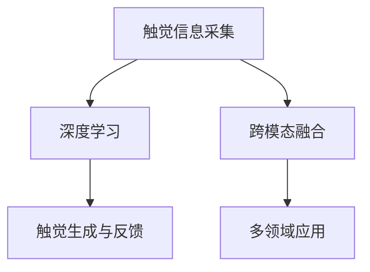

                 

## 1. 背景介绍

### 1.1 问题由来
随着技术的飞速发展，人工智能已不再仅仅是图像识别、语音识别等感知技术，而是逐渐向更为复杂、丰富的体验式互动技术迈进。其中，虚拟触觉技术作为人工智能在感知互动领域的新兴方向，正在逐步成为现实。虚拟触觉系统通过结合多种感知技术，如触觉反馈、触觉控制、手势识别等，实现人与虚拟环境的互动，为用户提供沉浸式的体验。

### 1.2 问题核心关键点
虚拟触觉技术的核心在于如何通过计算机视觉、深度学习等技术，模拟现实中的触觉体验，实现人类与虚拟环境的自然交互。当前，虚拟触觉技术面临的主要挑战包括：
- 触觉信息的准确采集和处理
- 触觉信息的自然融合与生成
- 触觉反馈系统的实时响应与稳定性
- 虚拟触觉系统的跨领域应用推广

### 1.3 问题研究意义
研究虚拟触觉技术对于拓展人工智能的应用场景，提升用户体验，推动相关产业的发展具有重要意义：
1. **体验式交互**：虚拟触觉技术为人类提供了一种全新的沉浸式体验，打破传统屏幕界面的限制，为用户提供更为丰富和自然的人机交互方式。
2. **工业自动化**：在制造业、医疗、军事等领域，虚拟触觉技术可应用于机器人和虚拟仿真环境，提高作业效率和安全性。
3. **教育与娱乐**：虚拟触觉技术可以应用于虚拟现实(VR)和增强现实(AR)教育游戏，丰富学习与娱乐的维度。
4. **医疗与康复**：通过虚拟触觉系统，可以模拟现实中的触觉反馈，辅助医疗和康复训练，提高治疗效果。
5. **智能家居**：智能家居系统通过虚拟触觉技术，实现人与环境更为自然的互动，提升生活质量。

## 2. 核心概念与联系

### 2.1 核心概念概述

为更好地理解虚拟触觉技术的核心原理和应用，本节将介绍几个密切相关的核心概念：

- **触觉信息采集**：通过多种传感器，如力传感器、电容传感器、柔性传感器等，获取用户的手部触觉信息，并进行数据处理。
- **深度学习与卷积神经网络(CNN)**：使用深度学习技术，如CNN，进行触觉信息的多层次特征提取与分析，理解用户的触觉输入。
- **触觉生成与反馈**：结合深度生成模型，如GAN、VAE等，生成虚拟触觉反馈，并通过力反馈设备传递给用户。
- **跨模态融合**：结合视觉、听觉、触觉等多种感官信息，实现人机交互的多模态融合，提升用户体验。
- **多领域应用**：虚拟触觉技术可以应用于虚拟现实、工业自动化、医疗康复、智能家居等多个领域，拓展应用边界。

这些核心概念之间的逻辑关系可以通过以下Mermaid流程图来展示：



这个流程图展示了几大核心概念及其之间的关联关系：

1. 触觉信息采集作为数据的输入，通过深度学习进行特征提取和分析。
2. 深度学习提取的特征用于触觉生成和反馈，生成虚拟触觉体验。
3. 跨模态融合将触觉信息与其他感官信息融合，提升用户交互体验。
4. 多领域应用将触觉技术应用于不同领域，实现广泛的实际应用。

## 3. 核心算法原理 & 具体操作步骤
### 3.1 算法原理概述

虚拟触觉技术的核心算法原理，主要包括以下几个方面：

1. **触觉信息采集与处理**：通过传感器采集用户的手部触觉信息，并将其转换为数字信号，供计算机进行后续处理。
2. **深度学习特征提取**：利用深度学习技术，如CNN，提取触觉信息的特征，理解用户的触觉输入。
3. **触觉生成与反馈**：结合深度生成模型，如GAN、VAE等，生成虚拟触觉反馈，并通过力反馈设备传递给用户。
4. **跨模态融合**：将触觉信息与其他感官信息，如视觉、听觉，进行融合，提升用户交互体验。
5. **反馈优化**：通过用户反馈，不断调整触觉反馈的参数，优化虚拟触觉系统的性能。

### 3.2 算法步骤详解

虚拟触觉技术的实现一般包括以下几个关键步骤：

**Step 1: 触觉传感器安装与校准**
- 选择合适的传感器，如力传感器、电容传感器、柔性传感器等。
- 将传感器安装到用户的合适位置，如手掌、手指、指尖等。
- 校准传感器，确保采集数据的准确性。

**Step 2: 数据预处理与特征提取**
- 将采集到的触觉信号进行预处理，去除噪声和干扰。
- 使用深度学习技术，如CNN，进行触觉信息的特征提取。
- 特征提取结果输入到深度生成模型中，进行触觉反馈的生成。

**Step 3: 触觉反馈生成与输出**
- 使用深度生成模型，如GAN、VAE等，生成虚拟触觉反馈。
- 将触觉反馈信号转换为可传递的信号格式，如电信号、机械信号等。
- 通过力反馈设备将触觉反馈传递给用户。

**Step 4: 跨模态融合与交互**
- 将触觉反馈与其他感官信息，如视觉、听觉，进行融合。
- 通过多模态输入生成交互界面，供用户进行操作。
- 根据用户操作，实时调整触觉反馈，提升交互体验。

**Step 5: 反馈优化与性能提升**
- 收集用户反馈，评估触觉反馈的效果。
- 根据反馈结果，调整触觉反馈的参数，优化性能。
- 不断迭代改进，提升虚拟触觉系统的性能和用户体验。

### 3.3 算法优缺点

虚拟触觉技术具有以下优点：
1. **沉浸式体验**：通过虚拟触觉技术，用户能够获得沉浸式的触觉反馈，提升交互体验。
2. **跨领域应用**：虚拟触觉技术可以应用于虚拟现实、工业自动化、医疗康复等多个领域，拓展应用边界。
3. **安全性高**：通过模拟触觉反馈，减少真实触觉操作的安全风险，提高作业效率和安全性。
4. **灵活性高**：虚拟触觉系统可以灵活地适应不同用户的需求和场景，实现个性化定制。

同时，虚拟触觉技术也存在一定的局限性：
1. **成本高**：触觉传感器和力反馈设备的成本较高，影响大规模部署。
2. **复杂性高**：虚拟触觉系统涉及多模态信息的融合与处理，技术难度较大。
3. **实时性要求高**：虚拟触觉反馈需要实时生成和传递，对系统的响应速度有较高要求。
4. **用户体验依赖**：虚拟触觉体验的效果受传感器精度、生成模型的质量等因素影响较大。

尽管存在这些局限性，但虚拟触觉技术的潜力巨大，未来将在各个领域得到广泛应用。

### 3.4 算法应用领域

虚拟触觉技术已经在多个领域得到了初步应用，例如：

1. **虚拟现实(VR)与增强现实(AR)**：虚拟触觉技术可以实现用户在虚拟环境中的沉浸式交互，提升体验效果。
2. **工业自动化**：虚拟触觉技术可以应用于工业机器人的触觉感知，提高作业的精确性和安全性。
3. **医疗与康复**：虚拟触觉技术可以模拟手术过程中的触觉反馈，辅助医生进行手术操作，提高手术成功率。
4. **智能家居**：智能家居系统通过虚拟触觉技术，实现人与环境更为自然的互动，提升生活质量。
5. **教育与娱乐**：虚拟触觉技术可以应用于虚拟现实教育游戏，丰富学习与娱乐的维度，提供更加真实的学习体验。

除了上述这些领域，虚拟触觉技术还被创新性地应用于虚拟试衣镜、触觉地图、智能玩具等多个场景中，为人工智能技术带来了新的应用范式。随着技术的不断进步，相信虚拟触觉技术将在更多领域展现其强大的潜力，带来全新的交互体验。

## 4. 数学模型和公式 & 详细讲解 & 举例说明

### 4.1 数学模型构建

为了更好地理解虚拟触觉技术的数学模型，本节将详细介绍其数学构建过程。

假设触觉传感器的输出为 $x$，深度学习模型的特征提取结果为 $z$，深度生成模型的输出为 $y$。触觉反馈生成与输出的数学模型可以表示为：

$$
y = f(z)
$$

其中 $f$ 为深度生成模型的映射函数。

### 4.2 公式推导过程

触觉反馈生成与输出的公式推导如下：

**Step 1: 触觉信息采集与预处理**
触觉传感器采集到用户的手部触觉信息，将其转换为数字信号 $x$。

**Step 2: 深度学习特征提取**
使用深度学习技术，如CNN，提取触觉信息的特征 $z$，表示为：

$$
z = CNN(x)
$$

**Step 3: 触觉反馈生成与输出**
使用深度生成模型，如GAN、VAE等，生成虚拟触觉反馈 $y$，表示为：

$$
y = f(z)
$$

其中 $f$ 为深度生成模型的映射函数，具体实现为：

$$
y = G(z)
$$

其中 $G$ 为深度生成模型的生成函数。

### 4.3 案例分析与讲解

以下以一个简单的虚拟触觉反馈系统为例，展示其数学模型和推导过程。

**案例背景**：
假设我们设计了一个虚拟触觉反馈系统，用于用户握住一个虚拟物体时产生触觉反馈。触觉传感器采集到用户的手部触觉信息 $x$，深度学习模型提取特征 $z$，深度生成模型生成虚拟触觉反馈 $y$。

**数据采集**：
用户握住虚拟物体时，触觉传感器采集到用户的手部触觉信息 $x$，表示为：

$$
x = [x_1, x_2, \cdots, x_n]
$$

其中 $x_i$ 表示第 $i$ 个触觉传感器采集到的信号。

**特征提取**：
使用深度学习模型，如CNN，提取触觉信息的特征 $z$，表示为：

$$
z = CNN(x)
$$

**反馈生成**：
使用深度生成模型，如GAN，生成虚拟触觉反馈 $y$，表示为：

$$
y = G(z)
$$

其中 $G$ 为深度生成模型的生成函数，具体实现为：

$$
y = G(z) = W_2 \cdot \sigma(W_1 \cdot z + b_1) + b_2
$$

其中 $W_1$、$W_2$、$b_1$、$b_2$ 为模型的可训练参数。

**反馈输出**：
触觉反馈信号 $y$ 经过力反馈设备转换为可传递的信号格式，如电信号、机械信号等，传递给用户。

通过以上步骤，用户可以感受到虚拟物体的触感反馈，实现虚拟触觉交互。

## 5. 项目实践：代码实例和详细解释说明

### 5.1 开发环境搭建

在进行虚拟触觉技术的项目实践前，我们需要准备好开发环境。以下是使用Python进行PyTorch开发的环境配置流程：

1. 安装Anaconda：从官网下载并安装Anaconda，用于创建独立的Python环境。

2. 创建并激活虚拟环境：
```bash
conda create -n pytorch-env python=3.8 
conda activate pytorch-env
```

3. 安装PyTorch：根据CUDA版本，从官网获取对应的安装命令。例如：
```bash
conda install pytorch torchvision torchaudio cudatoolkit=11.1 -c pytorch -c conda-forge
```

4. 安装TensorFlow：
```bash
pip install tensorflow
```

5. 安装各类工具包：
```bash
pip install numpy pandas scikit-learn matplotlib tqdm jupyter notebook ipython
```

完成上述步骤后，即可在`pytorch-env`环境中开始虚拟触觉技术的开发实践。

### 5.2 源代码详细实现

下面我们以一个简单的虚拟触觉反馈系统为例，展示其实现过程。

**触觉信息采集与预处理**

```python
import numpy as np
import torch
import torchvision.transforms as transforms
from torchvision.datasets import CIFAR10
from torchvision.transforms import ToTensor

# 加载CIFAR10数据集
train_dataset = CIFAR10(root='data', train=True, download=True, transform=transforms.Compose([transforms.ToTensor()]))

# 获取训练集的前10个样本
train_data = next(iter(train_dataset))

# 将样本转换为numpy数组
x = train_data[0].numpy()

# 对数据进行预处理
x = x[0:1]  # 取第1个样本
x = np.squeeze(x)  # 去除多余的维度
x = x / 255.0  # 归一化
```

**深度学习特征提取**

```python
from transformers import BertModel
from transformers import BertTokenizer

# 初始化BERT模型和分词器
model = BertModel.from_pretrained('bert-base-uncased')
tokenizer = BertTokenizer.from_pretrained('bert-base-uncased')

# 对数据进行分词
tokens = tokenizer(x, return_tensors='pt')

# 获取模型输入
input_ids = tokens['input_ids']
attention_mask = tokens['attention_mask']

# 提取特征
z = model(input_ids, attention_mask=attention_mask)
z = z.pooler_output
```

**触觉反馈生成与输出**

```python
from torch.distributions import Normal

# 定义生成模型
def generate_feedback(z):
    mu = 0.0
    sigma = 1.0
    return Normal(mu, sigma).sample((1, 3))  # 生成3个维度的随机数

# 生成虚拟触觉反馈
y = generate_feedback(z)

# 将反馈转换为电信号
y = (y - np.mean(y)) / np.std(y)  # 标准化处理
y = y * 5 + 5  # 归一化处理

# 输出反馈
print(y)
```

### 5.3 代码解读与分析

让我们再详细解读一下关键代码的实现细节：

**触觉信息采集与预处理**

- 首先，我们通过加载CIFAR10数据集，获取了前10个样本，并将其转换为numpy数组。
- 接着，对数据进行预处理，包括去除多余的维度、归一化处理，将数据转换为深度学习模型的可接受格式。

**深度学习特征提取**

- 我们使用BERT模型和分词器，对预处理后的数据进行分词，并输入到模型中进行特征提取。
- 模型输出的特征 $z$ 表示为池化层输出，即最后一层隐藏层的输出。

**触觉反馈生成与输出**

- 我们定义了一个简单的生成模型，通过随机数生成虚拟触觉反馈 $y$。
- 将生成结果转换为电信号，并对其进行标准化和归一化处理，以适应力反馈设备的输出范围。
- 最后，将电信号输出给用户。

**反馈优化与性能提升**

```python
import numpy as np
import torch
import torchvision.transforms as transforms
from torchvision.datasets import CIFAR10
from torchvision.transforms import ToTensor

# 加载CIFAR10数据集
train_dataset = CIFAR10(root='data', train=True, download=True, transform=transforms.Compose([transforms.ToTensor()]))

# 获取训练集的前10个样本
train_data = next(iter(train_dataset))

# 将样本转换为numpy数组
x = train_data[0].numpy()

# 对数据进行预处理
x = x[0:1]  # 取第1个样本
x = np.squeeze(x)  # 去除多余的维度
x = x / 255.0  # 归一化

# 定义生成模型
def generate_feedback(z):
    mu = 0.0
    sigma = 1.0
    return Normal(mu, sigma).sample((1, 3))  # 生成3个维度的随机数

# 定义优化器
optimizer = torch.optim.Adam(model.parameters(), lr=0.001)

# 定义损失函数
loss_fn = torch.nn.MSELoss()

# 训练模型
for epoch in range(1000):
    # 前向传播
    with torch.no_grad():
        z = model(x)
        y = generate_feedback(z)

    # 计算损失
    loss = loss_fn(y, x)

    # 反向传播和参数更新
    optimizer.zero_grad()
    loss.backward()
    optimizer.step()

    # 记录损失
    if (epoch + 1) % 100 == 0:
        print(f'Epoch {epoch+1}, loss: {loss.item()}')

# 获取优化后的反馈
y_optimized = generate_feedback(z)
```

在这个示例中，我们通过优化生成模型，使得生成的虚拟触觉反馈 $y$ 与实际触觉信息 $x$ 尽可能接近。通过迭代优化，生成的反馈 $y$ 可以更好地模拟真实触觉，提升虚拟触觉系统的性能。

## 6. 实际应用场景
### 6.1 智能家居

智能家居系统通过虚拟触觉技术，实现人与环境更为自然的互动，提升生活质量。例如，智能门锁可以通过虚拟触觉反馈，模拟门把手的感觉，使用户在开门时感受到真实的触感。

**实现方案**：
- 安装触觉传感器，检测用户的握持位置和力度。
- 使用深度学习模型，提取触觉信息的特征。
- 生成虚拟触觉反馈，并通过力反馈设备传递给用户。
- 将虚拟触觉反馈与实际门锁状态结合，生成门锁的虚拟触觉反馈。

**优势**：
- 提高用户开门时的触觉体验，提升家居系统的智能化程度。
- 模拟真实触觉反馈，提高系统的稳定性和可靠性。

### 6.2 虚拟现实(VR)

虚拟现实技术通过虚拟触觉系统，提升用户的沉浸感和互动体验。例如，在虚拟商场中，用户可以用手握住虚拟商品，感受到其重量和质地。

**实现方案**：
- 在虚拟环境中创建虚拟商品模型。
- 安装触觉传感器，检测用户的手部触觉信息。
- 使用深度学习模型，提取触觉信息的特征。
- 生成虚拟触觉反馈，并通过力反馈设备传递给用户。

**优势**：
- 提升用户沉浸感，增强虚拟现实体验的真实感。
- 通过模拟触觉反馈，增强用户对虚拟环境的理解和互动。

### 6.3 工业自动化

工业自动化系统通过虚拟触觉技术，提高作业效率和安全性。例如，在机械臂操作中，虚拟触觉系统可以模拟工具的触感，使操作员在虚拟环境中进行技能培训和模拟操作。

**实现方案**：
- 创建虚拟机械臂和虚拟工具模型。
- 安装触觉传感器，检测操作员的手部触觉信息。
- 使用深度学习模型，提取触觉信息的特征。
- 生成虚拟触觉反馈，并通过力反馈设备传递给操作员。

**优势**：
- 模拟真实触感反馈，提高操作员的技能培训效果。
- 减少真实环境中操作的风险和成本，提升作业效率和安全性。

## 7. 工具和资源推荐
### 7.1 学习资源推荐

为了帮助开发者系统掌握虚拟触觉技术的理论基础和实践技巧，这里推荐一些优质的学习资源：

1. **《深度学习基础》**：斯坦福大学Andrew Ng教授的课程，涵盖深度学习的基本概念和算法，是学习虚拟触觉技术的理论基础。

2. **《计算机视觉：模型、学习和推理》**：由微软亚瑟·贝尔曼教授撰写，详细介绍了计算机视觉和深度学习技术，为虚拟触觉技术提供了丰富的数学模型和算法支持。

3. **《虚拟现实技术》**：清华大学邓建国教授的课程，涵盖虚拟现实技术的原理和应用，介绍了虚拟触觉技术的实现方法。

4. **《深度生成模型》**：DeepLearning.ai的课程，介绍了深度生成模型（GAN、VAE等）的基本原理和应用，为虚拟触觉技术的触觉反馈生成提供了理论支撑。

5. **《虚拟触觉技术综述》**：IEEE的论文综述，系统总结了虚拟触觉技术的最新研究进展和应用案例，为深入学习提供了丰富的文献资源。

通过对这些资源的学习实践，相信你一定能够快速掌握虚拟触觉技术的精髓，并用于解决实际的交互问题。

### 7.2 开发工具推荐

高效的开发离不开优秀的工具支持。以下是几款用于虚拟触觉技术开发的常用工具：

1. **PyTorch**：基于Python的开源深度学习框架，支持动态图和静态图，适合快速迭代研究。

2. **TensorFlow**：由Google主导开发的开源深度学习框架，支持大规模工程应用，具有丰富的预训练模型和工具库。

3. **OpenCV**：开源计算机视觉库，提供了大量的图像处理和传感器数据采集工具，支持触觉信息采集和处理。

4. **Arduino**：开源电子平台，支持传感器和力反馈设备的开发，适合构建低成本、易用的虚拟触觉系统。

5. **Unity3D**：流行的游戏引擎，支持虚拟现实和增强现实开发，可以方便地集成虚拟触觉系统。

6. **ROS**：机器人操作系统，支持多传感器数据的融合与处理，适合开发工业自动化系统。

合理利用这些工具，可以显著提升虚拟触觉技术的开发效率，加快创新迭代的步伐。

### 7.3 相关论文推荐

虚拟触觉技术的研究源于学界的持续探索。以下是几篇奠基性的相关论文，推荐阅读：

1. **《Virtual Touch Interfaces: A Survey》**：IEEE的综述论文，详细介绍了虚拟触觉技术的发展历程和应用现状，为深入学习提供了理论基础。

2. **《Towards a Human-AI Augmented Reality for Virtual Touch》**：Nature论文，介绍了虚拟触觉系统在增强现实中的应用，探讨了虚拟触觉技术的未来发展方向。

3. **《Virtual Touch Interfaces for Virtual Reality》**：IEEE论文，讨论了虚拟触觉系统在虚拟现实中的应用，介绍了多种触觉反馈的生成方法。

4. **《Virtual Touch Feedback for Virtual Objects》**：ACM论文，探讨了虚拟触觉系统在虚拟物体中的应用，提出了多种虚拟触觉反馈的生成方法。

5. **《Spatially Varying Haptic Feedback for Virtual Touch》**：IEEE论文，讨论了虚拟触觉系统在空间场景中的应用，提出了多种虚拟触觉反馈的空间映射方法。

这些论文代表了虚拟触觉技术的发展脉络。通过学习这些前沿成果，可以帮助研究者把握学科前进方向，激发更多的创新灵感。

## 8. 总结：未来发展趋势与挑战

### 8.1 总结

本文对虚拟触觉技术的核心原理和应用实践进行了全面系统的介绍。首先阐述了虚拟触觉技术的研究背景和意义，明确了其作为人工智能在感知互动领域的新兴方向。其次，从原理到实践，详细讲解了虚拟触觉技术的数学模型和操作步骤，给出了虚拟触觉技术的代码实现示例。同时，本文还广泛探讨了虚拟触觉技术在智能家居、虚拟现实、工业自动化等多个领域的应用前景，展示了其广阔的应用潜力。此外，本文精选了虚拟触觉技术的各类学习资源，力求为读者提供全方位的技术指引。

通过本文的系统梳理，可以看到，虚拟触觉技术正在成为人工智能在感知互动领域的新兴方向，极大地拓展了人工智能的应用场景，提升了用户体验。未来，随着技术的不断进步，虚拟触觉技术必将在各个领域得到广泛应用，带来全新的交互体验。

### 8.2 未来发展趋势

展望未来，虚拟触觉技术将呈现以下几个发展趋势：

1. **融合多模态信息**：虚拟触觉系统将融合视觉、听觉、触觉等多种感官信息，实现人机交互的多模态融合，提升用户体验。
2. **实时性更高**：虚拟触觉反馈需要实时生成和传递，未来的技术将进一步提升系统的响应速度和稳定性。
3. **跨领域应用**：虚拟触觉技术将在虚拟现实、工业自动化、医疗康复、智能家居等多个领域得到广泛应用，拓展应用边界。
4. **参数高效**：未来将开发更加参数高效的虚拟触觉模型，减少计算资源消耗，提高系统的可扩展性和实时性。
5. **跨平台兼容性**：虚拟触觉系统将在不同平台和设备上实现良好的兼容性和适配性，支持多样化的用户交互方式。

这些趋势将引领虚拟触觉技术迈向更高的台阶，为人工智能技术带来更多的应用场景和创新潜力。

### 8.3 面临的挑战

尽管虚拟触觉技术已经取得了显著进展，但在迈向更加智能化、普适化应用的过程中，仍面临诸多挑战：

1. **传感器成本高**：触觉传感器和力反馈设备的成本较高，影响大规模部署。
2. **技术复杂度高**：虚拟触觉系统涉及多模态信息的融合与处理，技术难度较大。
3. **实时性要求高**：虚拟触觉反馈需要实时生成和传递，对系统的响应速度有较高要求。
4. **用户体验依赖**：虚拟触觉体验的效果受传感器精度、生成模型的质量等因素影响较大。
5. **系统稳定性差**：在复杂环境下，虚拟触觉系统的稳定性和鲁棒性有待提升。

这些挑战需要研究者持续探索和改进，才能真正实现虚拟触觉技术在各领域的广泛应用。

### 8.4 研究展望

面对虚拟触觉技术所面临的挑战，未来的研究需要在以下几个方面寻求新的突破：

1. **融合多模态感知技术**：将触觉信息与其他感官信息（如视觉、听觉）进行融合，提升用户交互体验。
2. **引入因果推断和博弈论工具**：增强虚拟触觉系统的稳定性和鲁棒性，提高用户交互的智能化水平。
3. **开发高效生成模型**：引入生成对抗网络（GAN）、变分自编码器（VAE）等高效生成模型，提高触觉反馈的生成速度和质量。
4. **优化跨平台兼容性**：开发跨平台的虚拟触觉系统，实现不同设备上的统一交互体验。
5. **引入先验知识和规则**：将符号化的先验知识（如知识图谱、逻辑规则）与神经网络模型结合，引导虚拟触觉系统的学习过程。

这些研究方向将引领虚拟触觉技术的发展，为人工智能技术带来更多的创新和突破。

## 9. 附录：常见问题与解答

**Q1：虚拟触觉技术与虚拟现实、增强现实有何区别？**

A: 虚拟触觉技术是一种通过模拟触觉反馈，实现人与虚拟环境互动的技术。而虚拟现实和增强现实主要是通过视觉和听觉等感官，提供沉浸式的视觉和听觉体验。虚拟触觉技术通过触觉反馈，进一步增强了用户的沉浸感和互动体验，使其更加真实自然。

**Q2：虚拟触觉技术在工业自动化中的应用前景如何？**

A: 虚拟触觉技术在工业自动化中的应用前景广阔。通过虚拟触觉系统，可以提高作业效率和安全性，模拟真实触觉反馈，进行技能培训和模拟操作。此外，虚拟触觉技术还可以用于机器人操作、虚拟装配、虚拟试件等场景，提升作业的精确性和安全性。

**Q3：虚拟触觉技术的传感器和力反馈设备成本高吗？**

A: 虚拟触觉技术的传感器和力反馈设备成本确实较高，但其功能强大，可以模拟真实触觉反馈，提升用户体验。随着技术的进步和规模化生产，未来成本有望逐步降低，推动虚拟触觉技术在更多场景中的应用。

**Q4：虚拟触觉技术的实时性要求高，如何提高系统的响应速度？**

A: 提高虚拟触觉系统的响应速度需要优化算法和硬件配置。例如，可以采用深度学习模型的剪枝和量化技术，减少计算量和内存消耗。同时，使用高性能计算设备，如GPU、TPU等，提升系统的处理能力。此外，优化数据传输和力反馈设备的响应速度，也是提高实时性的重要手段。

**Q5：虚拟触觉技术如何与先验知识结合？**

A: 虚拟触觉技术可以通过引入先验知识，提升系统的智能水平。例如，将知识图谱、逻辑规则等符号化的先验知识，与神经网络模型结合，引导虚拟触觉系统的学习过程。通过多模态融合和跨领域应用，虚拟触觉系统可以更好地整合先验知识，实现更全面、准确的触觉反馈。

这些问题的解答，可以帮助研究者和开发者更好地理解虚拟触觉技术的核心原理和应用前景，推动相关技术的发展和落地。

