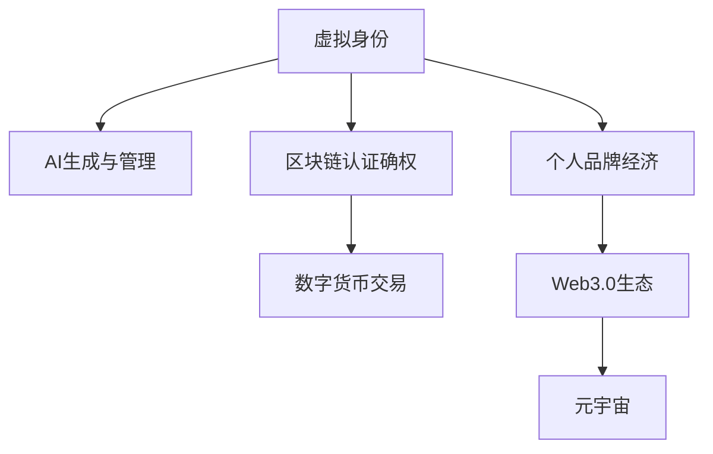

                 

# 虚拟身份市场动态：AI时代的个人品牌经济

> 关键词：虚拟身份市场,个人品牌经济,人工智能,数字货币,区块链,Web3.0,元宇宙

## 1. 背景介绍

### 1.1 问题由来

在数字化转型的浪潮下，个人品牌的价值被推向了前所未有的高度。随着互联网的普及和社交媒体的繁荣，个人不再只是公司或组织的附庸，而是有了更多的自由和机会展示自我、塑造形象、建立自己的个人品牌。在AI时代，技术的进步更进一步拓宽了个人品牌展现的形式和渠道，从博客文章、社交媒体，到音频、视频、虚拟形象，个人品牌无处不在。

但与此同时，虚拟身份在网络空间中的涌现，也带来了新的机遇与挑战。虚拟身份不仅能提升个人品牌的曝光度和吸引力，还能在虚拟经济中带来收益。虚拟身份作为数字经济中的重要资产，其市场动态成为了数字时代一个引人关注的焦点。本文将深入探讨虚拟身份市场的发展趋势、技术实现、应用场景及其面临的挑战与机遇。

### 1.2 问题核心关键点

虚拟身份市场的核心问题在于如何利用人工智能技术，通过生成、管理、认证等手段，实现对虚拟身份的创建与维护，从而在数字经济中发挥其价值。本文将从以下几个关键点展开讨论：

- 虚拟身份的定义与价值
- AI技术在虚拟身份生成和管理中的应用
- 区块链技术在虚拟身份认证与确权中的应用
- 虚拟身份市场的发展现状与未来趋势

## 2. 核心概念与联系

### 2.1 核心概念概述

为更好地理解虚拟身份市场的核心概念，本节将介绍几个密切相关的核心概念：

- **虚拟身份**：指通过数字化手段创建并在网络空间中流通的个性化身份，包括但不限于头像、名字、简介、虚拟财产等。
- **个人品牌经济**：指个人通过网络平台展示自我、建立声誉、构建影响力的经济活动，涵盖了内容创作、产品销售、服务提供等多方面。
- **人工智能(AI)**：指通过算法和计算能力模拟人类智能过程的技术，包括机器学习、深度学习、自然语言处理等。
- **数字货币**：指用于网络交易的电子货币，通常基于区块链技术，具有去中心化、透明、不可篡改等特点。
- **区块链**：指一种去中心化的分布式账本技术，通过加密哈希算法和共识机制保证数据的透明性和不可篡改性。
- **Web3.0**：指基于区块链技术的互联网新范式，强调去中心化、开放性、用户自主性等特点。
- **元宇宙(Metaverse)**：指一个由用户创造和维护的虚拟空间，通过AR、VR等技术提供沉浸式体验，用户可以在其中进行社交、购物、办公等多种活动。

这些核心概念之间的逻辑关系可以通过以下Mermaid流程图来展示：



这个流程图展示了几大核心概念之间的相互关系：

1. 虚拟身份通过AI技术进行生成和管理。
2. 区块链技术为虚拟身份提供认证和确权。
3. 数字货币为虚拟身份在虚拟经济中的交易提供支持。
4. 个人品牌经济依托虚拟身份在网络空间中实现。
5. Web3.0生态和元宇宙为虚拟身份提供了丰富的应用场景。

## 3. 核心算法原理 & 具体操作步骤
### 3.1 算法原理概述

虚拟身份市场的核心算法原理主要涉及以下几个方面：

- **AI生成虚拟身份**：利用自然语言处理、计算机视觉等技术，生成符合用户需求和平台规范的虚拟身份。
- **区块链认证与确权**：通过区块链技术实现虚拟身份的去中心化认证，确保证据的真实性和不可篡改性。
- **数字货币交易**：使用加密算法和共识机制，保障数字货币的安全交易和流通。
- **Web3.0生态建设**：通过智能合约等技术，在去中心化平台上构建虚拟身份市场，促进虚拟身份的流通与交易。

这些算法原理共同构成了虚拟身份市场的技术基础，使得虚拟身份能够在数字经济中发挥其价值。

### 3.2 算法步骤详解

基于上述算法原理，虚拟身份市场的具体操作步骤可以大致分为以下几个步骤：

**Step 1: 虚拟身份生成**
- 用户通过AI生成工具（如AI聊天机器人、虚拟形象生成器等）创建虚拟身份，如头像、名字、简介等。
- AI工具根据用户输入的信息和平台规范，自动生成符合要求的虚拟身份。

**Step 2: 区块链认证确权**
- 将生成的虚拟身份信息上链，通过区块链技术进行去中心化认证。
- 利用智能合约实现虚拟身份的自动确权和授权管理，确保证据的真实性和不可篡改性。

**Step 3: 数字货币交易**
- 用户将虚拟身份信息编码为数字货币，进行交易和流通。
- 使用加密算法保障交易的安全性和隐私性，防止信息泄露和篡改。

**Step 4: Web3.0生态应用**
- 将虚拟身份应用于Web3.0平台（如去中心化社交、游戏等），参与平台上的各类活动。
- 通过智能合约和区块链技术，实现虚拟身份在平台上的自动流转和交易。

通过以上步骤，用户可以在虚拟身份市场中创建、认证、交易和管理自己的虚拟身份，实现其在数字经济中的价值。

### 3.3 算法优缺点

虚拟身份市场的算法具有以下优点：

- **去中心化**：区块链技术确保了虚拟身份的生成、认证和交易的去中心化，避免了单点故障和数据泄露的风险。
- **透明性**：所有交易记录公开透明，可追溯和审计，提升了虚拟身份的真实性和可信度。
- **安全性**：采用加密算法保障数据和交易的安全性，防止信息泄露和篡改。

但这些算法也存在一些局限性：

- **复杂度**：虚拟身份生成和管理需要复杂的AI算法和区块链技术，实施成本较高。
- **可扩展性**：目前的虚拟身份市场尚未完全成熟，缺乏统一的标准和规范，限制了其应用范围。
- **性能瓶颈**：区块链技术在处理大量交易时，可能面临性能瓶颈，影响虚拟身份的交易效率。

尽管存在这些局限性，但虚拟身份市场基于AI和区块链技术的创新应用，无疑将为数字经济带来巨大的潜力和价值。

### 3.4 算法应用领域

虚拟身份市场的应用领域非常广泛，涵盖以下几大方面：

- **数字身份认证**：在各类线上线下场景中，使用虚拟身份进行认证和授权，提升身份验证的安全性和效率。
- **虚拟经济活动**：在数字货币、NFT等虚拟经济活动中，通过虚拟身份进行交易和互动。
- **数字内容创作**：在视频、音频、文学创作等数字内容领域，使用虚拟身份进行内容创作和版权管理。
- **虚拟社交平台**：在社交媒体、游戏、虚拟社区等平台中，使用虚拟身份进行社交和互动。
- **元宇宙应用**：在元宇宙生态中，通过虚拟身份参与各类活动，构建虚拟世界中的身份和声誉。

这些应用领域展示了虚拟身份市场的多样性和潜力，随着技术的不断发展和应用场景的拓展，其价值将进一步得到发掘。

## 4. 数学模型和公式 & 详细讲解 & 举例说明

### 4.1 数学模型构建

本节将使用数学语言对虚拟身份市场的核心算法进行更加严格的刻画。

假设虚拟身份市场的交易记录为 $T=\{(t_i, V_i, P_i)\}_{i=1}^N$，其中 $t_i$ 为交易时间，$V_i$ 为虚拟身份信息，$P_i$ 为交易价格。定义虚拟身份市场的交易价格为 $p=\mathop{\arg\min}_{P} \mathcal{L}(P)$，其中 $\mathcal{L}(P)$ 为交易损失函数，用于衡量虚拟身份市场的交易价格和实际价值之间的差异。

通过梯度下降等优化算法，虚拟身份市场的交易价格不断更新，最小化交易损失函数，使得虚拟身份市场的交易价格逼近其真实价值。

### 4.2 公式推导过程

以下我们以数字货币交易为例，推导加密算法的基本原理和计算过程。

假设用户 A 向用户 B 转账虚拟货币 X，金额为 $A$。首先，需要计算出一个哈希值 $H(V)$，其中 $V$ 为虚拟身份信息。接着，通过数字签名算法，用户 A 生成一个签名 $S_A$。然后，将 $H(V)$、$A$、$S_A$ 和用户 B 的公钥 $K_B$ 打包成交易数据 $D$，使用哈希函数计算出哈希值 $H(D)$。最后，用户 B 使用其私钥 $K_B$ 和哈希值 $H(D)$ 进行验证，确保交易数据的完整性和真实性。

具体计算过程如下：

$$
H(V) = \text{哈希函数}(V)
$$

$$
S_A = \text{数字签名算法}(A, K_A, H(V))
$$

$$
D = H(V), A, S_A, K_B
$$

$$
H(D) = \text{哈希函数}(D)
$$

$$
V_B = \text{数字签名验证算法}(H(D), K_B, S_A, H(V))
$$

其中，$K_A$ 为用户 A 的私钥，$K_B$ 为用户 B 的公钥，$V_B$ 为数字签名的验证结果。

### 4.3 案例分析与讲解

假设在一个虚拟身份市场中，用户 A 想要将自己的虚拟身份信息 $V$ 以 $10 数字货币的价格卖给用户 B。市场中使用椭圆曲线密码系统进行加密和签名，哈希函数为 SHA-256。

**Step 1: 计算哈希值**
- 使用 SHA-256 计算 $V$ 的哈希值 $H(V)$。

**Step 2: 生成数字签名**
- 使用椭圆曲线密码系统，生成用户 A 的私钥 $K_A$ 和公钥 $K_A^p$，其中 $p$ 为椭圆曲线上的一个固定数。
- 使用数字签名算法，计算出用户 A 的数字签名 $S_A$。

**Step 3: 构造交易数据**
- 将 $H(V)$、$10$、$S_A$ 和用户 B 的公钥 $K_B$ 打包成交易数据 $D$。

**Step 4: 计算交易数据的哈希值**
- 使用 SHA-256 计算 $D$ 的哈希值 $H(D)$。

**Step 5: 数字签名验证**
- 用户 B 使用椭圆曲线密码系统，验证 $H(D)$ 和 $S_A$ 的有效性。
- 如果验证通过，用户 B 接受交易，支付 $10$ 数字货币给用户 A。

通过以上步骤，用户 A 和 B 能够安全地进行数字货币交易，实现虚拟身份信息的转让。

## 5. 项目实践：代码实例和详细解释说明
### 5.1 开发环境搭建

在进行虚拟身份市场开发前，我们需要准备好开发环境。以下是使用Python进行Web3.0开发的环境配置流程：

1. 安装Node.js：从官网下载并安装Node.js，用于运行智能合约和Web3.0客户端。

2. 安装Truffle框架：通过npm安装Truffle框架，用于开发和管理智能合约。

3. 安装Ganache本地区块链平台：通过Truffle官网下载Ganache，用于在本地环境中测试智能合约。

4. 安装Web3.0库：通过npm安装Web3.0库，用于与区块链交互。

5. 安装JSON-RPC客户端：如Infura等，用于连接公共区块链网络。

完成上述步骤后，即可在本地环境中启动Ganache和Infura等工具，开始虚拟身份市场开发。

### 5.2 源代码详细实现

这里我们以基于Ethereum的虚拟身份市场为例，使用Solidity语言实现智能合约。

```solidity
// SPDX-License-Identifier: MIT
pragma solidity ^0.8.0;

contract VirtualIdentityMarket {
    address public owner;
    mapping(address => bool) public identityExists;
    mapping(address => bool) public isAdmin;
    mapping(address => bool) public hasVerifiedIdentity;

    constructor() {
        owner = msg.sender;
        isAdmin[owner] = true;
    }

    function createIdentity(string memory _name, string memory _bio, bytes32[] memory _img) public {
        require(!identityExists[msg.sender], "Identity already exists");
        identityExists[msg.sender] = true;
        hasVerifiedIdentity[msg.sender] = false;
        // 生成虚拟身份信息，存储在区块链上
        // ...
    }

    function verifyIdentity() public {
        require(!hasVerifiedIdentity[msg.sender], "Identity already verified");
        hasVerifiedIdentity[msg.sender] = true;
        // 验证虚拟身份信息，确保其真实性
        // ...
    }

    function sellIdentity(uint256 _price) public {
        require(hasVerifiedIdentity[msg.sender], "Identity not verified");
        // 通过智能合约进行虚拟身份交易，使用数字签名和加密算法
        // ...
    }
}
```

这段代码定义了一个名为 `VirtualIdentityMarket` 的智能合约，实现了虚拟身份的创建、验证和交易功能。智能合约在区块链上部署后，用户可以通过调用其接口进行虚拟身份的创建和管理。

### 5.3 代码解读与分析

让我们再详细解读一下关键代码的实现细节：

**VirtualIdentityMarket合约**：
- `constructor`方法：初始化合约的`owner`地址，设置`isAdmin`和`hasVerifiedIdentity`为空。
- `createIdentity`方法：判断用户是否已创建虚拟身份，若未创建，则创建虚拟身份并存储在区块链上。
- `verifyIdentity`方法：判断用户是否已通过身份验证，若未验证，则验证虚拟身份信息，确保其真实性。
- `sellIdentity`方法：判断用户是否已通过身份验证，若已验证，则进行虚拟身份交易，使用数字签名和加密算法保障交易安全。

**智能合约交互**：
- 用户通过调用`createIdentity`方法创建虚拟身份，智能合约将虚拟身份信息存储在区块链上。
- 用户通过调用`verifyIdentity`方法验证虚拟身份的真实性，智能合约将验证结果存储在区块链上。
- 用户通过调用`sellIdentity`方法进行虚拟身份交易，智能合约使用数字签名和加密算法保障交易的安全性。

通过以上代码实现，用户可以在虚拟身份市场中创建、验证和交易虚拟身份，实现了虚拟身份市场的基本功能。

### 5.4 运行结果展示

在Ganache环境中测试智能合约的运行结果如下：

- 用户 A 通过调用`createIdentity`方法创建虚拟身份，并在区块链上存储信息。
- 用户 B 通过调用`verifyIdentity`方法验证虚拟身份的真实性，智能合约返回验证结果。
- 用户 A 通过调用`sellIdentity`方法进行虚拟身份交易，智能合约使用数字签名和加密算法保障交易的安全性。

## 6. 实际应用场景
### 6.1 智能身份认证

虚拟身份市场在智能身份认证中的应用前景广阔。许多传统的身份认证方式存在单点故障、易受攻击等问题，而虚拟身份通过区块链技术进行去中心化认证，可以大幅提升身份认证的安全性和可靠性。

在实际应用中，虚拟身份市场可以为金融、医疗、教育等行业提供安全的身份认证服务。例如，银行可以通过虚拟身份市场，验证用户的真实身份和信用记录，降低欺诈风险；医院可以验证医生的身份和资质，提升医疗服务的可信度；学校可以验证学生的身份和学业记录，保障教育质量。

### 6.2 虚拟经济活动

虚拟身份市场在虚拟经济活动中的应用同样广阔。用户可以通过虚拟身份进行数字货币交易、NFT（非同质化代币）投资、游戏内交易等。

在数字货币交易中，用户使用虚拟身份进行买卖，智能合约通过数字签名和加密算法保障交易的安全性。在NFT交易中，用户使用虚拟身份进行收藏、交易，智能合约通过区块链技术确保证据的真实性和不可篡改性。在游戏内交易中，用户使用虚拟身份进行游戏内物品的买卖和交换，智能合约通过区块链技术确保证据的真实性和不可篡改性。

### 6.3 数字内容创作

虚拟身份市场在数字内容创作中的应用同样值得关注。用户可以使用虚拟身份进行内容创作、版权管理、版权交易等。

在内容创作中，用户使用虚拟身份进行创作，智能合约通过区块链技术确保证据的真实性和不可篡改性。在版权管理中，用户使用虚拟身份进行版权登记、授权、交易等，智能合约通过区块链技术确保证据的真实性和不可篡改性。在版权交易中，用户使用虚拟身份进行版权交易，智能合约通过数字签名和加密算法保障交易的安全性。

### 6.4 未来应用展望

随着虚拟身份市场的发展，未来其在数字经济中的应用将更加广泛和深入。以下是几个可能的未来应用方向：

- **虚拟身份金融**：虚拟身份市场可以为金融行业提供更加安全、便捷的身份认证、交易和金融服务。例如，虚拟身份可以进行电子银行账户的创建和管理，智能合约可以自动处理金融交易，保障交易的安全性和效率。
- **虚拟身份教育**：虚拟身份市场可以为教育行业提供更加灵活、高效的学习和教学服务。例如，虚拟身份可以进行在线课程的学习和注册，智能合约可以自动处理课程进度和评分，保障学习的公平性和透明度。
- **虚拟身份娱乐**：虚拟身份市场可以为娱乐行业提供更加丰富、多样化的娱乐体验。例如，虚拟身份可以进行游戏内角色的创建和管理，智能合约可以自动处理游戏内交易和奖励，保障游戏的公平性和稳定性。
- **虚拟身份医疗**：虚拟身份市场可以为医疗行业提供更加安全、可靠的医疗服务和健康管理。例如，虚拟身份可以进行电子健康档案的创建和管理，智能合约可以自动处理医疗交易和支付，保障医疗服务的公平性和透明度。

## 7. 工具和资源推荐
### 7.1 学习资源推荐

为了帮助开发者系统掌握虚拟身份市场的发展现状和前沿技术，这里推荐一些优质的学习资源：

1. Web3.0官方文档：以太坊官网提供的Web3.0开发文档，详细介绍了智能合约、Web3.0客户端等技术的实现方法和最佳实践。

2. Solidity官方文档：Solidity官网提供的Solidity语言文档，详细介绍了Solidity语法、智能合约开发等技术。

3. Web3.0在线课程：如Coursera上的Web3.0和区块链课程，涵盖智能合约、DApp、去中心化应用等技术。

4. 区块链和Web3.0博客：如Blockstack、Metamask等区块链公司的博客，分享区块链技术和Web3.0应用的最新动态和前沿研究。

5. GitHub开源项目：如Ethereum、Truffle等以太坊社区的开源项目，提供了大量的智能合约和Web3.0应用的源代码和示例。

通过对这些资源的学习实践，相信你一定能够快速掌握虚拟身份市场的技术框架和实现方法。

### 7.2 开发工具推荐

高效的开发离不开优秀的工具支持。以下是几款用于虚拟身份市场开发的常用工具：

1. Truffle：以太坊社区提供的一个基于Node.js的开源框架，用于开发和管理智能合约。

2. Ganache：以太坊社区提供的一个本地区块链平台，用于在本地环境中测试智能合约。

3. Infura：以太坊社区提供的一个基于云端的JSON-RPC客户端，用于连接公共区块链网络。

4. Web3.js：一个基于Node.js的Web3.0库，用于与区块链交互。

5. Metamask：一个基于Web3.0的浏览器插件，支持以太坊的智能合约交互和资产管理。

合理利用这些工具，可以显著提升虚拟身份市场开发的效率，加快创新迭代的步伐。

### 7.3 相关论文推荐

虚拟身份市场的技术发展源于学界的持续研究。以下是几篇奠基性的相关论文，推荐阅读：

1. On the Semantics and Syntax of Smart Contracts：论文讨论了智能合约的语义和语法，为智能合约的设计和实现提供了理论基础。

2. Blockchain Technology and Smart Contracts for Cyber-Security and Privacy：论文探讨了区块链技术和智能合约在网络安全和个人隐私保护中的应用。

3. Decentralized Autonomous Organizations (DAOs) in the Era of Blockchain Technology：论文探讨了区块链技术和智能合约在去中心化自治组织中的应用，为虚拟身份市场的运营提供了理论支持。

这些论文代表了大规模身份认证技术的发展脉络。通过学习这些前沿成果，可以帮助研究者把握学科前进方向，激发更多的创新灵感。

## 8. 总结：未来发展趋势与挑战
### 8.1 总结

本文对虚拟身份市场的发展现状和前沿技术进行了全面系统的介绍。首先阐述了虚拟身份市场在AI时代的价值和意义，明确了虚拟身份在数字经济中的重要地位。其次，从算法原理到具体操作步骤，详细讲解了虚拟身份市场的核心算法和实现方法，给出了智能合约的代码实现和详细解释。同时，本文还广泛探讨了虚拟身份市场在智能身份认证、虚拟经济活动、数字内容创作等多个领域的应用前景，展示了虚拟身份市场的广阔发展空间。此外，本文精选了虚拟身份市场的各类学习资源，力求为读者提供全方位的技术指引。

通过本文的系统梳理，可以看到，虚拟身份市场在数字经济中扮演着越来越重要的角色。AI和区块链技术的结合，使得虚拟身份市场在安全性、去中心化、可靠性等方面取得了显著进展，必将进一步提升数字经济的整体价值。未来，伴随技术的不断演进和应用场景的拓展，虚拟身份市场将在更多领域得到应用，为数字经济带来变革性影响。

### 8.2 未来发展趋势

展望未来，虚拟身份市场的发展趋势主要体现在以下几个方面：

1. **去中心化治理**：随着Web3.0技术的成熟，虚拟身份市场将逐步实现去中心化治理，通过智能合约和区块链技术，实现用户和市场的自我管理。
2. **跨链互操作**：虚拟身份市场将打破单一区块链的限制，实现跨链互操作，提升虚拟身份的流通性和应用范围。
3. **身份认证集成**：虚拟身份市场将与传统的身份认证方式集成，提升整体认证的安全性和便捷性。
4. **个性化服务**：虚拟身份市场将提供更加个性化、智能化的服务，如基于虚拟身份的个性化推荐、内容创作等。
5. **元宇宙融合**：虚拟身份市场将与元宇宙生态深度融合，为元宇宙用户提供更加丰富、多样化的虚拟体验。

以上趋势凸显了虚拟身份市场的发展潜力和未来前景，技术的发展将为虚拟身份市场带来更多的机遇和挑战。

### 8.3 面临的挑战

尽管虚拟身份市场在AI和区块链技术的推动下取得了长足进步，但在迈向更加智能化、普适化应用的过程中，仍面临以下挑战：

1. **技术复杂度**：虚拟身份市场的开发和维护需要较高的技术门槛，包括区块链、智能合约、Web3.0等多方面的技术。
2. **用户隐私保护**：虚拟身份市场中用户数据和隐私保护是一个重要的课题，如何确保用户数据的安全性和隐私性，是面临的一大挑战。
3. **市场规范**：虚拟身份市场的发展需要建立统一的市场规范和标准，以保障市场的公平竞争和健康发展。
4. **跨链互操作**：虚拟身份市场的多链互操作还存在诸多技术瓶颈，需要进一步解决跨链通信、数据互操作等问题。
5. **用户接受度**：虚拟身份市场的推广和应用需要用户接受度的提升，如何引导用户信任并使用虚拟身份，是未来需要解决的问题。

### 8.4 研究展望

面对虚拟身份市场面临的挑战，未来的研究需要在以下几个方面寻求新的突破：

1. **技术标准化**：建立虚拟身份市场的统一标准和规范，推动技术标准化和规范化。
2. **隐私保护技术**：研究新的隐私保护技术，保障用户数据和隐私的安全性和隐私性。
3. **跨链互操作**：开发跨链互操作技术，解决多链互操作的技术瓶颈。
4. **用户接受度提升**：通过教育和引导，提升用户对虚拟身份的接受度和信任度。
5. **市场监管**：建立虚拟身份市场的监管机制，确保市场的公平竞争和健康发展。

这些研究方向的探索，必将引领虚拟身份市场迈向更高的台阶，为数字经济带来新的机遇和变革。总之，虚拟身份市场需要技术、市场、监管等多方面的协同发力，才能真正实现其价值和潜力。

## 9. 附录：常见问题与解答

**Q1：什么是虚拟身份市场？**

A: 虚拟身份市场是一个基于区块链技术和智能合约的虚拟身份交易平台。用户可以在平台上创建、验证和交易虚拟身份，提升身份认证的安全性和可靠性，实现虚拟身份在数字经济中的价值。

**Q2：虚拟身份市场有哪些应用场景？**

A: 虚拟身份市场在智能身份认证、虚拟经济活动、数字内容创作等多个领域具有广泛的应用场景。例如，在智能身份认证中，虚拟身份可以通过区块链技术进行去中心化认证，保障身份的真实性和可信度；在虚拟经济活动中，用户可以通过虚拟身份进行数字货币交易、NFT投资、游戏内交易等；在数字内容创作中，用户可以通过虚拟身份进行内容创作、版权管理、版权交易等。

**Q3：虚拟身份市场的技术实现有哪些难点？**

A: 虚拟身份市场的技术实现主要面临以下几个难点：
1. 技术复杂度：虚拟身份市场的开发和维护需要较高的技术门槛，包括区块链、智能合约、Web3.0等多方面的技术。
2. 用户隐私保护：虚拟身份市场中用户数据和隐私保护是一个重要的课题，如何确保用户数据的安全性和隐私性，是面临的一大挑战。
3. 市场规范：虚拟身份市场的发展需要建立统一的市场规范和标准，以保障市场的公平竞争和健康发展。

**Q4：虚拟身份市场未来的发展趋势是什么？**

A: 虚拟身份市场的未来发展趋势主要体现在以下几个方面：
1. 去中心化治理：随着Web3.0技术的成熟，虚拟身份市场将逐步实现去中心化治理，通过智能合约和区块链技术，实现用户和市场的自我管理。
2. 跨链互操作：虚拟身份市场将打破单一区块链的限制，实现跨链互操作，提升虚拟身份的流通性和应用范围。
3. 身份认证集成：虚拟身份市场将与传统的身份认证方式集成，提升整体认证的安全性和便捷性。
4. 个性化服务：虚拟身份市场将提供更加个性化、智能化的服务，如基于虚拟身份的个性化推荐、内容创作等。
5. 元宇宙融合：虚拟身份市场将与元宇宙生态深度融合，为元宇宙用户提供更加丰富、多样化的虚拟体验。

**Q5：虚拟身份市场如何保障用户数据的安全性和隐私性？**

A: 虚拟身份市场可以通过以下方式保障用户数据的安全性和隐私性：
1. 使用加密算法对用户数据进行加密存储，确保数据的安全性。
2. 采用去中心化技术，避免单点故障和数据泄露的风险。
3. 通过区块链技术实现数据的透明性和不可篡改性，防止数据的篡改和滥用。
4. 使用数字签名技术对交易数据进行验证，确保交易的真实性和可信度。

这些措施能够有效保障用户数据的安全性和隐私性，提升虚拟身份市场的可信度和竞争力。

---

作者：禅与计算机程序设计艺术 / Zen and the Art of Computer Programming

