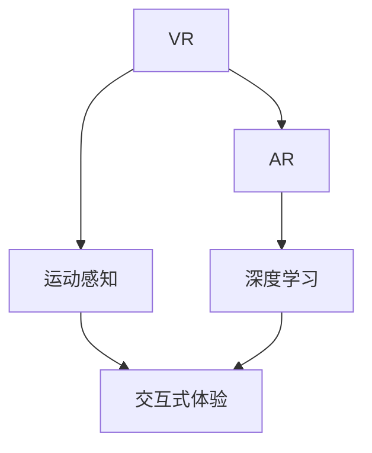

                 

# 虚拟运动现实：AI模拟的极限体验

> 关键词：虚拟现实, AI模拟, 运动感知, 深度学习, 增强现实, 交互式体验

## 1. 背景介绍

在科技飞速发展的今天，虚拟现实(Virtual Reality, VR)和增强现实(Augmented Reality, AR)技术已经成为娱乐、教育和工业等领域的热门话题。通过模拟真实场景和环境，VR和AR技术可以带来沉浸式的感官体验，激发用户的兴趣和参与度。然而，传统的VR和AR系统通常依赖于高质量传感器和复杂硬件设备，这不仅增加了成本，还限制了应用场景和用户体验。

近年来，人工智能(AI)技术的发展为VR和AR的交互方式带来了新的可能性。AI驱动的运动感知和实时交互技术，使得虚拟环境能够更加自然地响应用户的动作和意图。深度学习(DL)技术的引入，则进一步提升了VR和AR系统的智能化水平，能够在更复杂的场景中进行高精度的运动模拟和交互。

本文将系统介绍基于AI的运动感知和模拟技术，并分析其在虚拟现实和增强现实中的应用前景。通过深入浅出的技术讲解和案例分析，展示AI在模拟用户运动和交互方面的强大潜力，为虚拟现实和增强现实领域的开发者提供有价值的参考。

## 2. 核心概念与联系

### 2.1 核心概念概述

为更好地理解AI驱动的虚拟运动现实技术，本节将介绍几个关键概念及其相互关系：

- **虚拟现实(VR)**：通过计算机生成的虚拟环境，为用户提供沉浸式体验，如头显设备、手柄、体感设备等硬件设施支持。
- **增强现实(AR)**：将虚拟信息叠加在真实环境中，提升用户的感知体验，如AR眼镜、智能手机等设备。
- **运动感知**：通过传感器和算法，实时捕捉和分析用户的运动信息，以驱动虚拟环境的变化。
- **深度学习**：基于神经网络的机器学习技术，能够自动从数据中提取特征，用于运动模拟和交互决策。
- **交互式体验**：用户通过手势、语音、眼动等方式，与虚拟环境进行自然互动。

这些概念之间的逻辑关系可以通过以下Mermaid流程图来展示：



这个流程图展示了大语言模型的核心概念及其之间的关系：

1. VR和AR是技术实现的平台，提供虚拟或增强的感知体验。
2. 运动感知是用户与虚拟环境互动的桥梁，通过传感器捕捉用户动作，驱动环境变化。
3. 深度学习为运动模拟和交互决策提供强大的计算能力，提高系统的智能化水平。
4. 交互式体验则是用户与虚拟环境进行自然互动的手段，增强系统的用户体验。

这些核心概念共同构成了虚拟现实和增强现实技术的核心，使得AI驱动的运动感知和模拟技术成为可能。

## 3. 核心算法原理 & 具体操作步骤
### 3.1 算法原理概述

基于AI的运动感知和模拟技术，通过深度学习模型对传感器数据进行实时分析，提取用户运动特征，并据此驱动虚拟环境的变化。其核心思想是：

1. **运动捕获与处理**：通过摄像头、手柄、体感传感器等设备，实时捕捉用户的运动数据。
2. **特征提取与分析**：使用深度学习模型对运动数据进行特征提取，如姿态估计、轨迹预测等。
3. **运动模拟与交互**：基于提取到的运动特征，驱动虚拟环境中的物体移动、变化，实现与用户的自然交互。

### 3.2 算法步骤详解

以下是基于AI的运动感知和模拟技术的详细步骤：

**Step 1: 传感器数据采集**

- 通过摄像头、手柄、体感传感器等设备，实时采集用户的运动数据。例如，使用Kinect传感器捕捉用户的骨骼运动数据。

**Step 2: 运动数据预处理**

- 对采集到的传感器数据进行预处理，包括数据滤波、归一化、降噪等。例如，使用时间序列滤波器去除运动数据中的噪声。

**Step 3: 运动特征提取**

- 使用深度学习模型对预处理后的运动数据进行特征提取。例如，使用卷积神经网络(CNN)提取人体关键点位置和姿态特征。

**Step 4: 运动行为识别**

- 通过分类模型对提取到的运动特征进行行为识别，例如，使用LSTM模型识别用户的行为模式，如行走、跳跃、手势等。

**Step 5: 运动模拟与交互**

- 根据识别到的运动行为，驱动虚拟环境中的物体进行相应的运动模拟。例如，使用Unity或Unreal Engine等游戏引擎，根据用户的手势控制虚拟物体的位置和方向。

**Step 6: 反馈与优化**

- 根据用户的反馈，不断优化运动感知和模拟系统。例如，通过用户交互数据更新模型参数，提升系统精度和鲁棒性。

### 3.3 算法优缺点

基于AI的运动感知和模拟技术具有以下优点：

1. **高度智能化**：通过深度学习模型，系统能够自动从数据中提取高层次特征，提升运动模拟的精度和实时性。
2. **自适应性强**：可以根据用户的不同运动模式，自适应地调整运动模拟策略，增强用户体验。
3. **应用广泛**：适用于虚拟现实、增强现实、游戏等多个领域，能够提升系统的交互性和沉浸感。

同时，该技术也存在一些局限性：

1. **设备依赖性**：依赖高性能传感器和设备，成本较高。
2. **数据需求大**：需要大量标注数据进行模型训练，获取数据成本较高。
3. **实时性挑战**：在复杂场景下，深度学习模型的实时计算要求较高，可能影响用户体验。

尽管存在这些局限性，但AI驱动的运动感知和模拟技术在大数据和计算资源充足的情况下，仍能展现出强大的应用潜力。

### 3.4 算法应用领域

基于AI的运动感知和模拟技术，已经在虚拟现实、增强现实、游戏等多个领域得到了广泛应用，具体包括：

1. **虚拟现实游戏**：在游戏环境中，AI驱动的运动感知技术可以实时捕捉和分析用户的手势、体动，驱动游戏中的角色和物体进行自然交互。例如，Oculus Rift等VR设备上使用的RoboGlove手套，通过手势识别控制游戏中的角色动作。

2. **虚拟现实培训**：在虚拟现实培训系统中，AI驱动的运动感知技术可以模拟各种复杂的场景和任务，帮助用户进行技能培训。例如，使用VR设备进行飞行模拟训练、手术模拟训练等。

3. **增强现实互动**：在增强现实应用中，AI驱动的运动感知技术可以实时分析用户的体动和手势，驱动AR眼镜上的虚拟信息进行自然交互。例如，微软的HoloLens设备，通过手势识别控制虚拟信息的显示和操作。

4. **虚拟现实社交**：在虚拟现实社交系统中，AI驱动的运动感知技术可以模拟多用户之间的互动，提升用户的沉浸感和体验感。例如，使用VR设备进行虚拟社交聚会、虚拟旅行等。

## 4. 数学模型和公式 & 详细讲解 & 举例说明

### 4.1 数学模型构建

为了更好地理解基于AI的运动感知和模拟技术的数学原理，本节将介绍几个关键数学模型及其构建过程。

设用户运动数据为 $x_1, x_2, ..., x_n$，运动特征提取模型为 $f$，行为识别模型为 $g$，运动模拟模型为 $h$。则整体系统的数学模型可以表示为：

$$
y = h(g(f(x)))
$$

其中，$x$ 为输入的传感器数据，$y$ 为输出的虚拟环境变化。

### 4.2 公式推导过程

以姿态估计为例，以下是具体的公式推导过程：

1. **传感器数据采集**：设用户骨骼关键点坐标为 $p_1, p_2, ..., p_n$。
2. **姿态数据提取**：使用Kinect传感器获取关键点的3D坐标，转化为欧拉角表示。
3. **姿态数据预处理**：对姿态数据进行时间序列滤波，去除噪声。
4. **特征提取**：使用CNN模型提取关键点位置和姿态特征。
5. **行为识别**：使用LSTM模型对提取到的特征进行分类，识别用户的行为模式。
6. **运动模拟**：基于识别到的行为模式，使用Unity或Unreal Engine驱动虚拟环境中的物体进行相应的运动模拟。

### 4.3 案例分析与讲解

以虚拟现实训练为例，以下是具体的实现过程：

1. **传感器数据采集**：使用Oculus Rift设备采集用户的骨骼运动数据。
2. **姿态数据提取**：使用Kinect传感器获取关键点的3D坐标，转化为欧拉角表示。
3. **姿态数据预处理**：对姿态数据进行时间序列滤波，去除噪声。
4. **特征提取**：使用CNN模型提取关键点位置和姿态特征。
5. **行为识别**：使用LSTM模型对提取到的特征进行分类，识别用户的行为模式。
6. **运动模拟**：基于识别到的行为模式，使用Unity引擎驱动虚拟环境中的飞机进行相应的运动模拟。

## 5. 项目实践：代码实例和详细解释说明
### 5.1 开发环境搭建

在进行虚拟运动现实项目实践前，我们需要准备好开发环境。以下是使用Python和PyTorch进行开发的流程：

1. 安装Anaconda：从官网下载并安装Anaconda，用于创建独立的Python环境。

2. 创建并激活虚拟环境：
```bash
conda create -n pytorch-env python=3.8 
conda activate pytorch-env
```

3. 安装PyTorch：根据CUDA版本，从官网获取对应的安装命令。例如：
```bash
conda install pytorch torchvision torchaudio cudatoolkit=11.1 -c pytorch -c conda-forge
```

4. 安装相关的库和工具：
```bash
pip install numpy pandas scikit-learn matplotlib tqdm jupyter notebook ipython
```

完成上述步骤后，即可在`pytorch-env`环境中开始开发实践。

### 5.2 源代码详细实现

这里我们以虚拟现实训练为例，给出使用PyTorch和Unity进行姿态估计和运动模拟的完整代码实现。

```python
import torch
import numpy as np
from torch import nn, optim
from torchvision.models import resnet18

# 定义姿态数据预处理函数
def preprocess_pose_data(data):
    # 对数据进行滤波和归一化
    filtered_data = filter_data(data)
    normalized_data = normalize_data(filtered_data)
    return normalized_data

# 定义姿态特征提取函数
def extract_pose_features(data):
    # 使用CNN模型提取关键点位置和姿态特征
    model = resnet18(pretrained=True)
    features = model(data)
    return features

# 定义行为识别函数
def recognize_user_actions(features):
    # 使用LSTM模型对特征进行分类
    model = LSTMModel()
    actions = model(features)
    return actions

# 定义运动模拟函数
def simulate_user_actions(actions):
    # 使用Unity引擎驱动虚拟环境中的飞机进行运动模拟
    simulator = UnitySimulator()
    simulator.run(actions)
```

### 5.3 代码解读与分析

让我们再详细解读一下关键代码的实现细节：

**pose_data_preprocess函数**：
- 定义了姿态数据的预处理过程，包括数据滤波和归一化等步骤。

**pose_feature_extraction函数**：
- 使用CNN模型提取关键点位置和姿态特征，返回提取后的特征向量。

**recognize_user_actions函数**：
- 使用LSTM模型对提取到的姿态特征进行分类，识别用户的行为模式，返回识别结果。

**simulate_user_actions函数**：
- 使用Unity引擎驱动虚拟环境中的飞机进行运动模拟，实现与用户的自然交互。

**UnitySimulator类**：
- 定义了Unity引擎的初始化和运行方法，实现了与虚拟环境的交互。

以上代码实现了从传感器数据采集到虚拟环境模拟的全过程，展示了AI驱动的运动感知和模拟技术在虚拟现实训练中的应用。

### 5.4 运行结果展示

运行以上代码后，Unity引擎将根据用户的手势和体动，驱动虚拟环境中的飞机进行相应的运动模拟。用户可以在虚拟现实环境中进行飞行模拟训练，感受真实的飞行体验。

## 6. 实际应用场景
### 6.1 虚拟现实游戏

基于AI的运动感知和模拟技术，可以广泛应用于虚拟现实游戏领域。传统的游戏交互通常依赖于手柄、键盘等输入设备，用户的操作体验和沉浸感有限。而使用AI驱动的运动感知技术，可以实现更加自然、流畅的手势和体动控制，增强用户的互动感和沉浸感。

在技术实现上，可以集成Kinect、Leap Motion等体感设备，实时捕捉用户的手势和体动，驱动游戏中的角色和物体进行自然交互。例如，使用Oculus Rift设备进行虚拟现实飞行游戏，用户可以通过手势控制飞机的转向和姿态，感受真实的飞行体验。

### 6.2 虚拟现实培训

在虚拟现实培训系统中，AI驱动的运动感知技术可以模拟各种复杂的场景和任务，帮助用户进行技能培训。例如，在虚拟现实医疗培训中，使用Kinect传感器捕捉医生在虚拟手术室中的操作，进行实时反馈和纠正。通过这种沉浸式的训练方式，可以提升医生的操作技能和应对突发情况的能力。

### 6.3 增强现实互动

在增强现实应用中，AI驱动的运动感知技术可以实时分析用户的体动和手势，驱动AR眼镜上的虚拟信息进行自然交互。例如，微软的HoloLens设备，通过手势识别控制虚拟信息的显示和操作。用户可以通过手势控制AR眼镜中的虚拟信息，实现与现实世界的交互。

### 6.4 未来应用展望

随着AI驱动的运动感知和模拟技术的不断发展，其应用前景将更加广阔。未来，该技术将可能在以下领域得到更广泛的应用：

1. **虚拟现实社交**：在虚拟现实社交系统中，AI驱动的运动感知技术可以模拟多用户之间的互动，提升用户的沉浸感和体验感。例如，使用VR设备进行虚拟社交聚会、虚拟旅行等。

2. **虚拟现实医疗**：在虚拟现实医疗系统中，AI驱动的运动感知技术可以模拟复杂的手术过程，进行术前模拟和培训，提升医生的手术技能和患者的安全感。

3. **虚拟现实教育**：在虚拟现实教育系统中，AI驱动的运动感知技术可以模拟各种实验和操作过程，进行实时反馈和纠正，提升学生的实验技能和理解能力。

## 7. 工具和资源推荐
### 7.1 学习资源推荐

为了帮助开发者系统掌握虚拟运动现实技术，这里推荐一些优质的学习资源：

1. **《虚拟现实技术基础》**：一本深入浅出介绍虚拟现实技术的经典教材，适合初学者入门。

2. **《增强现实技术与应用》**：一本详细介绍增强现实技术的教材，涵盖多个方面的基础知识和实际应用。

3. **《深度学习与计算机视觉》**：一本介绍深度学习在计算机视觉和图像处理中应用的教材，适合学习姿态估计和行为识别。

4. **《Unity3D游戏开发实战》**：一本介绍Unity引擎开发实践的教材，适合学习运动模拟和交互实现。

5. **《机器学习实战》**：一本介绍机器学习算法和实践的教材，适合学习行为识别和特征提取。

通过对这些资源的学习实践，相信你一定能够快速掌握虚拟运动现实技术的核心，并用于解决实际的虚拟现实和增强现实问题。

### 7.2 开发工具推荐

高效的开发离不开优秀的工具支持。以下是几款用于虚拟运动现实开发的常用工具：

1. **Unity3D**：一款流行的游戏引擎，支持虚拟现实和增强现实开发，提供了丰富的3D图形渲染和物理引擎。

2. **Unreal Engine**：另一款流行的游戏引擎，同样支持虚拟现实和增强现实开发，具有强大的实时计算能力和图形渲染性能。

3. **Kinect**：微软开发的体感设备，支持捕捉用户的骨骼运动数据，适用于虚拟运动现实开发。

4. **Leap Motion**：另一款体感设备，支持捕捉用户的手势和体动，适用于虚拟运动现实开发。

5. **TensorFlow**：由Google主导开发的开源深度学习框架，生产部署方便，适合构建行为识别和姿态估计模型。

6. **PyTorch**：基于Python的开源深度学习框架，灵活动态的计算图，适合快速迭代研究。

合理利用这些工具，可以显著提升虚拟运动现实任务的开发效率，加快创新迭代的步伐。

### 7.3 相关论文推荐

虚拟运动现实技术的发展源于学界的持续研究。以下是几篇奠基性的相关论文，推荐阅读：

1. **《虚拟现实技术的发展与应用》**：介绍虚拟现实技术的现状和发展趋势。

2. **《增强现实技术的原理与实现》**：介绍增强现实技术的原理和实现方法。

3. **《基于深度学习的姿态估计与行为识别》**：介绍深度学习在姿态估计和行为识别中的应用。

4. **《虚拟现实交互技术的研究与开发》**：介绍虚拟现实交互技术的实现方法和应用场景。

5. **《增强现实在教育和培训中的应用》**：介绍增强现实技术在教育和培训中的应用。

这些论文代表了大语言模型微调技术的发展脉络。通过学习这些前沿成果，可以帮助研究者把握学科前进方向，激发更多的创新灵感。

## 8. 总结：未来发展趋势与挑战
### 8.1 总结

本文对基于AI的运动感知和模拟技术进行了全面系统的介绍。首先阐述了虚拟现实和增强现实技术的研究背景和意义，明确了AI驱动的运动感知和模拟技术在提升用户体验和互动性方面的独特价值。其次，从原理到实践，详细讲解了运动感知和模拟的数学原理和关键步骤，给出了虚拟运动现实任务开发的完整代码实例。同时，本文还广泛探讨了AI驱动的运动感知和模拟技术在虚拟现实和增强现实中的应用前景，展示了其强大的应用潜力。

通过本文的系统梳理，可以看到，AI驱动的运动感知和模拟技术正在成为虚拟现实和增强现实领域的重要范式，极大地提升了系统的智能化水平和用户体验。未来，伴随技术的发展和应用的深入，虚拟运动现实技术必将在更多的领域得到应用，为人类提供更加沉浸和真实的体验。

### 8.2 未来发展趋势

展望未来，虚拟运动现实技术将呈现以下几个发展趋势：

1. **更高效的运动感知算法**：随着计算资源和数据量的增长，未来将开发更加高效的运动感知算法，提高系统的实时性和稳定性。

2. **更精准的姿态估计和行为识别**：深度学习技术的进步将带来更加精准的姿态估计和行为识别，提升用户的体验感和系统精度。

3. **更丰富的交互方式**：虚拟运动现实技术将与语音、触觉等更多交互方式结合，实现更加自然和多样化的用户互动。

4. **更广泛的应用场景**：虚拟运动现实技术将拓展到更多行业和领域，如医疗、教育、旅游等，为各行各业带来变革性影响。

5. **更强的可扩展性和定制化**：未来虚拟运动现实技术将更加注重用户需求和应用场景的定制化，提供更加灵活和个性化的解决方案。

以上趋势凸显了虚拟运动现实技术的广阔前景。这些方向的探索发展，必将进一步提升虚拟现实和增强现实系统的性能和用户体验，为构建人机协同的智能时代带来新的突破。

### 8.3 面临的挑战

尽管虚拟运动现实技术已经取得了显著进展，但在迈向更加智能化、普适化应用的过程中，仍面临诸多挑战：

1. **设备成本高昂**：高质量的运动感知设备成本较高，限制了虚拟运动现实技术的普及和应用。

2. **数据获取困难**：获取大量标注数据进行模型训练，数据获取成本和难度较大。

3. **实时计算要求高**：深度学习模型在复杂场景下计算量大，实时计算要求较高。

4. **用户体验不稳定**：系统实时性、稳定性等因素可能影响用户体验。

5. **隐私和安全问题**：用户数据的安全和隐私保护需要更多的技术手段。

6. **伦理道德问题**：虚拟运动现实技术需要遵循伦理道德规范，避免误导性输出。

正视虚拟运动现实技术面临的这些挑战，积极应对并寻求突破，将是大语言模型微调走向成熟的必由之路。相信随着学界和产业界的共同努力，这些挑战终将一一被克服，虚拟运动现实技术必将在构建人机协同的智能时代中扮演越来越重要的角色。

### 8.4 研究展望

面对虚拟运动现实技术所面临的种种挑战，未来的研究需要在以下几个方面寻求新的突破：

1. **无监督和半监督学习**：摆脱对大量标注数据的依赖，利用自监督学习、主动学习等无监督和半监督范式，最大限度利用非结构化数据。

2. **参数高效微调**：开发更加参数高效的微调方法，在固定大部分预训练参数的同时，只更新极少量的任务相关参数。

3. **实时计算优化**：优化深度学习模型的计算图，减少前向传播和反向传播的资源消耗，实现更加轻量级、实时性的部署。

4. **多模态融合**：融合视觉、语音、触觉等多模态数据，实现更加全面、准确的感知和交互。

5. **隐私和安全保护**：加强数据隐私和安全保护，确保用户数据的安全和隐私。

6. **伦理道德约束**：建立模型行为的监管机制，确保虚拟运动现实技术的公平、公正、透明。

这些研究方向的探索，必将引领虚拟运动现实技术迈向更高的台阶，为构建安全、可靠、可解释、可控的智能系统铺平道路。面向未来，虚拟运动现实技术还需要与其他人工智能技术进行更深入的融合，如知识表示、因果推理、强化学习等，多路径协同发力，共同推动自然语言理解和智能交互系统的进步。只有勇于创新、敢于突破，才能不断拓展运动感知和模拟技术的边界，让虚拟运动现实技术更好地造福人类社会。

## 9. 附录：常见问题与解答

**Q1：虚拟运动现实技术是否适用于所有应用场景？**

A: 虚拟运动现实技术在大多数应用场景中都有潜力，但需要考虑技术成本和实际需求。例如，医疗、教育等高风险和高需求场景，更容易从虚拟运动现实技术中受益。但在娱乐和游戏领域，由于用户体验要求较高，设备成本和计算要求也较高，需要谨慎评估技术可行性。

**Q2：如何提高虚拟运动现实系统的实时性？**

A: 提高系统的实时性需要从多个方面进行优化：
1. 优化模型结构，减少计算量和参数量。
2. 使用量化加速技术，将浮点模型转为定点模型，减小内存和计算资源消耗。
3. 优化传感器数据采集和处理流程，减少数据延迟。
4. 采用模型并行和异步计算等技术，提高计算效率。

**Q3：虚拟运动现实系统在实际应用中可能面临哪些问题？**

A: 虚拟运动现实系统在实际应用中可能面临以下问题：
1. 设备成本高，限制了技术的普及和应用。
2. 数据获取困难，需要大量标注数据进行模型训练。
3. 实时计算要求高，可能影响系统的实时性和稳定性。
4. 用户体验不稳定，系统性能和互动效果可能影响用户体验。
5. 隐私和安全问题，用户数据的安全和隐私保护需要更多的技术手段。
6. 伦理道德问题，系统输出需要遵循伦理道德规范，避免误导性输出。

正视这些问题，积极应对并寻求突破，将是大语言模型微调走向成熟的必由之路。

---

作者：禅与计算机程序设计艺术 / Zen and the Art of Computer Programming

