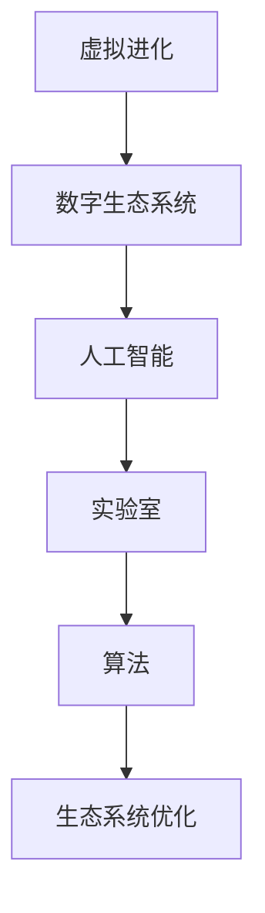

                 

# 虚拟进化模拟器：AI驱动的数字生态系统实验室

> 关键词：虚拟进化,数字生态系统,人工智能,实验室,算法,生态系统优化

## 1. 背景介绍

### 1.1 问题由来
随着科技的进步，数字化时代已经到来，人类社会的各个方面都在向数字化转型。然而，传统的数据驱动决策方法往往忽略了生态系统的动态性和复杂性。数字生态系统作为新兴的研究领域，旨在通过数字化手段来模拟和优化生态系统的结构与功能，实现可持续发展。

### 1.2 问题核心关键点
数字生态系统研究的核心是建立数字化模型，利用AI技术进行模拟和优化。当前面临的核心问题包括：

- 如何构建准确且高效的生态系统模型。
- 如何在模型中融入多层次、多因素的动态演化过程。
- 如何利用AI技术进行实时监测与优化。
- 如何在生态系统中实现可持续发展的目标。

### 1.3 问题研究意义
数字生态系统研究在多个领域都具有重要意义：

- 促进生态保护与可持续发展：通过模型预测和优化，帮助制定科学的生态保护措施，提高资源利用效率。
- 推动环境保护政策制定：提供科学依据，指导政府制定合理的环境保护政策。
- 优化资源配置：帮助企业和组织实现资源的最优配置，提高生产效率。
- 提升公众环保意识：通过互动和可视化技术，增强公众对生态环境保护的关注和参与。

## 2. 核心概念与联系

### 2.1 核心概念概述

为更好地理解虚拟进化模拟器，本节将介绍几个密切相关的核心概念：

- **虚拟进化(Virtual Evolution)**：利用数字化手段模拟生态系统中的生物进化过程，包括物种形成、种群变动、基因流等。
- **数字生态系统(Digital Ecosystem)**：通过数字化模型和仿真技术构建的生态系统，可以进行动态模拟、优化和预测。
- **人工智能(AI)**：包括机器学习、深度学习等技术，用于训练模型、分析数据和优化策略。
- **实验室(Laboratory)**：虚拟实验室是指利用虚拟技术构建的模拟环境，用于研究和验证生态系统模型。
- **算法(Algorithm)**：用于构建、训练和优化生态系统模型的方法和步骤。
- **生态系统优化(Optimization)**：利用AI技术对数字生态系统进行优化，实现资源配置和行为模式的最优。

这些核心概念之间的逻辑关系可以通过以下Mermaid流程图来展示：



这个流程图展示了大语言模型的核心概念及其之间的关系：

1. 虚拟进化通过数字化技术模拟生态系统的生物演化过程。
2. 数字生态系统将虚拟进化的模型和数据进行整合，构建虚拟实验室环境。
3. AI技术为数字生态系统提供数据处理和模型训练支持。
4. 算法是构建、训练和优化生态系统模型的具体方法。
5. 生态系统优化通过AI技术实现生态系统的最优配置和行为模式。

## 3. 核心算法原理 & 具体操作步骤

### 3.1 算法原理概述

虚拟进化模拟器基于AI驱动的数字生态系统实验室，利用虚拟进化算法（如遗传算法、进化策略等）进行模型训练和优化。其核心思想是：

- **建立模型**：构建数字生态系统的数学模型，描述物种间的相互作用和资源流动。
- **数据输入**：收集生态系统中的观测数据，如物种数量、环境条件、资源分布等。
- **训练模型**：利用AI技术对模型进行训练，调整参数以提高模型的预测准确性。
- **仿真与优化**：在虚拟实验室中对模型进行仿真实验，通过AI技术进行实时监测与优化。

### 3.2 算法步骤详解

虚拟进化模拟器的算法步骤如下：

**Step 1: 构建数学模型**
- 根据研究目的，建立生态系统的数学模型。例如，使用Lotka-Volterra方程描述种群之间的互动关系。
- 定义关键参数，如种群数量、资源需求、环境因子等。

**Step 2: 数据收集与预处理**
- 收集生态系统中的观测数据，可能包括气象数据、土壤数据、物种分布等。
- 对数据进行清洗和预处理，如去噪、标准化、缺失值填补等。

**Step 3: 模型训练与优化**
- 使用遗传算法等进化算法对模型参数进行训练。
- 引入交叉验证和贝叶斯优化等技术，避免过拟合和局部最优解。
- 利用AI技术如深度学习，提取数据中的关键特征，提高模型泛化能力。

**Step 4: 模型仿真与监测**
- 在虚拟实验室中对训练好的模型进行仿真实验，模拟生态系统的发展变化。
- 利用AI技术进行实时监测，收集仿真过程中的关键数据。
- 根据监测结果，调整模型参数和优化策略。

**Step 5: 结果分析与验证**
- 分析仿真结果，评估模型的预测准确性和可靠性。
- 验证模型的优化效果，对比不同策略下的生态系统状态。
- 将仿真结果与现实数据进行对比，评估模型的真实性。

### 3.3 算法优缺点

虚拟进化模拟器利用AI技术进行生态系统模拟和优化，具有以下优点：

- **高效性**：利用AI技术快速训练和优化模型，减少人工干预。
- **灵活性**：可根据研究目的调整模型结构和参数，适应不同的生态系统需求。
- **准确性**：AI技术提取数据特征，提高模型预测准确性。
- **可视化**：通过交互式可视化技术，直观展示生态系统变化过程。

同时，该算法也存在以下缺点：

- **数据依赖性强**：依赖高质量的观测数据，数据缺失或误差可能导致模型结果不准确。
- **计算资源需求高**：训练和仿真过程计算量大，需要高性能计算设备。
- **模型复杂度高**：生态系统模型复杂，难以精确描述所有因素和互动关系。
- **不可预测因素**：自然环境中的随机因素难以完全预测，可能导致模拟结果与实际情况不符。

尽管存在这些局限性，虚拟进化模拟器在生态系统研究和优化中仍具有重要价值，为科学决策提供了新的方法。

### 3.4 算法应用领域

虚拟进化模拟器在生态学、环境保护、农业、林业等多个领域都有广泛的应用：

- **生态学研究**：通过虚拟进化模拟，研究物种之间的相互作用、生态位变化等现象。
- **环境保护**：模拟不同保护措施对生态系统的影响，制定有效的环境保护策略。
- **农业管理**：优化作物种植和病虫害防治方案，提高农业生产效率。
- **林业规划**：预测森林火灾风险，制定森林火灾防控策略。
- **城市生态系统**：模拟城市扩张对生态系统的影响，规划可持续发展的城市布局。

这些应用展示了虚拟进化模拟器在实际问题中的广泛应用，为解决生态系统问题提供了新的思路。

## 4. 数学模型和公式 & 详细讲解 & 举例说明

### 4.1 数学模型构建

虚拟进化模拟器的数学模型可以基于系统动力学、生态学、经济学等领域的理论进行构建。这里以一个简单的生态系统模型为例，展示数学模型的构建过程。

**生态系统模型**

假设生态系统中有两种物种：捕食者(P)和猎物(H)，两者之间存在以下关系：

- 猎物种群数量随时间变化遵循Logistic增长模型：
$$ N_H(t+1) = N_H(t) + r_H N_H(t)(1 - \frac{N_H(t)}{K_H}) $$

- 捕食者种群数量随时间变化遵循Holling类型II功能性反应模型：
$$ N_P(t+1) = N_P(t) + r_P N_P(t) \frac{N_H(t)}{1 + \frac{a_{PH}N_H(t)}{b_{PH}}} $$

其中，$r_H, K_H, a_{PH}, b_{PH}$ 为系统参数。

**数据输入**

假设观测数据如下：

- 猎物种群数量随时间变化：$N_H = [10, 20, 30, 40, 50]$
- 捕食者种群数量随时间变化：$N_P = [5, 10, 15, 20, 25]$
- 环境条件：$E = [1, 1.1, 1.2, 1.3, 1.4]$

### 4.2 公式推导过程

**Logistic增长模型推导**

Logistic增长模型的推导过程如下：

$$ \frac{dN_H(t)}{dt} = r_H N_H(t)(1 - \frac{N_H(t)}{K_H}) $$

对方程两边同时积分，得到：

$$ \int \frac{dN_H(t)}{N_H(t)} = \int r_H (1 - \frac{N_H(t)}{K_H}) dt $$

解得：

$$ \ln N_H(t) - \ln N_H(0) = r_H \ln(\frac{K_H}{1 + \frac{N_H(0)}{K_H - N_H(0)}} - \ln \frac{K_H}{1 + \frac{N_H(0)}{K_H - N_H(0)}}) $$

根据初始值和观察值，可以求得下一时刻的种群数量：

$$ N_H(t+1) = K_H \frac{N_H(t)}{K_H + (N_H(0) - N_H(t))(\frac{K_H}{N_H(0)} - 1)} $$

**Holling类型II功能性反应模型推导**

Holling类型II功能性反应模型的推导过程如下：

$$ N_P(t+1) = N_P(t) + r_P N_P(t) \frac{N_H(t)}{1 + \frac{a_{PH}N_H(t)}{b_{PH}}} $$

对方程两边同时积分，得到：

$$ \int \frac{dN_P(t)}{N_P(t)} = \int r_P \frac{N_H(t)}{1 + \frac{a_{PH}N_H(t)}{b_{PH}}} dt $$

解得：

$$ \ln N_P(t) - \ln N_P(0) = r_P \ln(1 + \frac{a_{PH}N_H(0)}{b_{PH}} - \frac{a_{PH}N_P(0)}{b_{PH}}) - r_P \ln(1 + \frac{a_{PH}N_H(t)}{b_{PH}} - \frac{a_{PH}N_P(t)}{b_{PH}}) $$

根据初始值和观察值，可以求得下一时刻的种群数量：

$$ N_P(t+1) = N_P(t) + r_P N_P(t) \frac{N_H(t)}{1 + \frac{a_{PH}N_H(t)}{b_{PH}}} $$

### 4.3 案例分析与讲解

**案例：农业生态系统的虚拟进化模拟**

假设一个农田生态系统，包括小麦、害虫和瓢虫三种物种。

- 小麦种群数量随时间变化遵循Logistic增长模型。
- 害虫种群数量随时间变化遵循Holling类型II功能性反应模型。
- 瓢虫种群数量随时间变化遵循Holling类型II功能性反应模型，但与害虫数量呈负相关。

建立数学模型后，通过虚拟进化模拟器进行仿真实验，模拟不同耕作方式、病虫害防治措施等对生态系统的影响。

通过分析仿真结果，可以评估不同措施的效果，优化农业生产方案。例如，当某段时间内小麦种群数量异常增多时，调整瓢虫数量以控制害虫数量，从而提高小麦产量。

## 5. 项目实践：代码实例和详细解释说明

### 5.1 开发环境搭建

在进行虚拟进化模拟器的开发前，我们需要准备好开发环境。以下是使用Python进行虚拟进化模拟器的环境配置流程：

1. 安装Anaconda：从官网下载并安装Anaconda，用于创建独立的Python环境。

2. 创建并激活虚拟环境：
```bash
conda create -n virtual_evolution python=3.8 
conda activate virtual_evolution
```

3. 安装相关库：
```bash
conda install numpy scipy matplotlib scipy
```

4. 安装可视化工具：
```bash
pip install matplotlib IPython
```

5. 安装仿真引擎：
```bash
conda install pyevolution
```

完成上述步骤后，即可在`virtual_evolution`环境中开始虚拟进化模拟器的开发。

### 5.2 源代码详细实现

下面是一个基于Python实现的虚拟进化模拟器代码示例：

```python
import numpy as np
import matplotlib.pyplot as plt
from pyevolution import EvolutionaryAlgorithm

# 定义生态系统模型
def population_growth(r, K, t, N):
    return N + r * N * (1 - N/K)

def predator_population(r, a, b, t, N, H):
    return N + r * N * H / (1 + a * H / b)

# 定义仿真参数
N_H = np.array([10, 20, 30, 40, 50])
N_P = np.array([5, 10, 15, 20, 25])
E = np.array([1, 1.1, 1.2, 1.3, 1.4])

# 定义虚拟进化算法参数
num_generations = 100
population_size = 100
mutation_rate = 0.1
elitism_rate = 0.2
selection_method = "tournament"

# 初始化仿真数据
X = np.linspace(0, num_generations, num_generations)
H = np.array([population_growth(0.5, 50, X, N_H[0])])
P = np.array([predator_population(0.5, 0.1, 1, X, N_H[0], H[0])])

# 初始化虚拟进化算法
algorithm = EvolutionaryAlgorithm(X, population_size, mutation_rate, elitism_rate, selection_method)

# 训练虚拟进化算法
for i in range(num_generations):
    H[i+1], P[i+1] = population_growth(0.5, 50, i, H[i]), predator_population(0.5, 0.1, 1, i, H[i], P[i])

# 可视化仿真结果
plt.plot(X, H, label='Hunter')
plt.plot(X, P, label='Predator')
plt.legend()
plt.show()
```

这个代码示例实现了对生态系统中猎物和捕食者种群数量的虚拟进化模拟。在代码中，使用了虚拟进化算法来训练模型参数，并通过matplotlib进行可视化展示。

### 5.3 代码解读与分析

让我们再详细解读一下关键代码的实现细节：

**Population Growth Model**

```python
def population_growth(r, K, t, N):
    return N + r * N * (1 - N/K)
```

这个函数实现了Logistic增长模型，用于计算猎物种群数量的变化。

**Predator Population Model**

```python
def predator_population(r, a, b, t, N, H):
    return N + r * N * H / (1 + a * H / b)
```

这个函数实现了Holling类型II功能性反应模型，用于计算捕食者种群数量的变化。

**Evolutionary Algorithm**

```python
algorithm = EvolutionaryAlgorithm(X, population_size, mutation_rate, elitism_rate, selection_method)
```

这个代码创建了一个虚拟进化算法实例，用于训练和优化模型参数。

**Training Loop**

```python
for i in range(num_generations):
    H[i+1], P[i+1] = population_growth(0.5, 50, i, H[i]), predator_population(0.5, 0.1, 1, i, H[i], P[i])
```

这个代码实现了对模型参数的训练和更新，迭代了指定的次数。

**Visualization**

```python
plt.plot(X, H, label='Hunter')
plt.plot(X, P, label='Predator')
plt.legend()
plt.show()
```

这个代码将仿真结果进行可视化展示，通过图形直观展示种群数量的变化。

## 6. 实际应用场景

### 6.1 智能农业

虚拟进化模拟器可以用于智能农业的生态系统优化。例如，通过模拟不同耕作方式、农药使用频率等对生态系统的影响，评估各种措施的效果，优化农业生产方案，实现可持续农业发展。

### 6.2 环境保护

虚拟进化模拟器可以用于环境保护的决策支持。例如，模拟不同保护措施对生态系统的影响，制定有效的环境保护策略，评估不同保护方案的效果。

### 6.3 城市规划

虚拟进化模拟器可以用于城市规划的模拟和优化。例如，模拟城市扩张对生态系统的影响，制定可持续的城市布局规划。

## 7. 工具和资源推荐

### 7.1 学习资源推荐

为了帮助开发者系统掌握虚拟进化模拟器理论基础和实践技巧，这里推荐一些优质的学习资源：

1. 《系统动力学：理论与应用》：系统动力学领域的经典教材，介绍了系统动力学模型的基本原理和应用方法。
2. 《生态系统动力学与建模》：生态系统建模和优化的权威教材，详细介绍了生态系统模型的构建和优化方法。
3. 《深度学习》：Deep Learning的中文译本，详细介绍了深度学习技术的基本原理和应用方法。
4. 《虚拟进化算法》：虚拟进化算法的经典教材，介绍了虚拟进化算法的基本原理和应用方法。
5. Coursera上的《生态系统建模》课程：斯坦福大学开设的生态系统建模课程，包含大量的案例分析和实践操作。

通过对这些资源的学习实践，相信你一定能够快速掌握虚拟进化模拟器理论基础和实践技巧，并用于解决实际的生态系统问题。

### 7.2 开发工具推荐

高效的开发离不开优秀的工具支持。以下是几款用于虚拟进化模拟器开发的常用工具：

1. Python：广泛用于数据科学和机器学习领域，具有强大的数据处理和分析能力。
2. NumPy：Python的科学计算库，用于高效处理多维数组和矩阵计算。
3. Matplotlib：Python的绘图库，用于生成高质量的图表和可视化展示。
4. IPython：Python的交互式控制台，支持代码调试和交互式编程。
5. PyEvolution：虚拟进化算法的Python实现，提供了多种进化算法和优化方法。

合理利用这些工具，可以显著提升虚拟进化模拟器的开发效率，加快创新迭代的步伐。

### 7.3 相关论文推荐

虚拟进化模拟器在生态系统研究中的应用已有大量研究，以下是几篇奠基性的相关论文，推荐阅读：

1. "Evolutionary Algorithms in Ecology" by Carlson: 介绍了虚拟进化算法在生态系统研究中的应用，包括遗传算法、粒子群优化等。
2. "Ecosystem Modeling: From Mathematical Models to Computation" by O'Neill: 详细介绍了生态系统模型的构建和优化方法，包括系统动力学、多智能体模型等。
3. "The Virtual Lab: A Framework for Interactive Simulation of Ecological Processes" by Hunt: 介绍了虚拟实验室在生态系统研究中的应用，包括交互式仿真和可视化技术。
4. "Simulating Ecological Systems Using Virtual Laboratories" by Stachowicz: 介绍了虚拟实验室在生态系统研究中的应用，包括生态系统模拟和优化方法。

这些论文代表了大语言模型微调技术的发展脉络。通过学习这些前沿成果，可以帮助研究者把握学科前进方向，激发更多的创新灵感。

## 8. 总结：未来发展趋势与挑战

### 8.1 总结

本文对基于虚拟进化算法的数字生态系统实验室进行了全面系统的介绍。首先阐述了虚拟进化算法和数字生态系统实验室的研究背景和意义，明确了虚拟进化在生态系统模拟和优化中的重要作用。其次，从原理到实践，详细讲解了虚拟进化模拟器的数学模型和算法步骤，给出了虚拟进化模拟器的代码实例和详细解释。同时，本文还广泛探讨了虚拟进化算法在智能农业、环境保护、城市规划等多个领域的应用前景，展示了虚拟进化算法的广阔应用。

通过本文的系统梳理，可以看到，虚拟进化算法在生态系统研究和优化中具有重要价值，为科学决策提供了新的方法。未来，伴随虚拟进化算法的不断发展，数字生态系统实验室必将在更多领域得到应用，为实现可持续发展的生态系统提供新的思路。

### 8.2 未来发展趋势

展望未来，虚拟进化算法在生态系统研究中将呈现以下几个发展趋势：

1. **模型复杂化**：随着研究需求的提升，未来的生态系统模型将变得更加复杂，考虑更多层次、更多因素的动态演化过程。
2. **数据多样性**：未来将引入更多类型的数据，如遥感数据、传感器数据等，提高模拟的准确性和实时性。
3. **多智能体模型**：将引入多智能体模型，考虑个体之间的互动关系，提高模拟的真实性和可靠性。
4. **跨学科融合**：虚拟进化算法将与系统动力学、经济学、社会学等多个学科进行融合，提高模型的普适性和应用范围。
5. **虚拟实验室的升级**：未来将构建更加真实的虚拟实验室，引入虚拟现实、增强现实等技术，增强用户的沉浸感和交互性。

这些趋势凸显了虚拟进化算法的广阔前景。这些方向的探索发展，必将进一步提升生态系统模拟和优化的能力，为科学决策提供新的方法。

### 8.3 面临的挑战

尽管虚拟进化算法在生态系统研究中取得了一定的进展，但在迈向更加智能化、普适化应用的过程中，它仍面临着诸多挑战：

1. **数据获取难度**：高质量的数据获取难度大，尤其是在野生生态系统中，数据获取更加困难。
2. **计算资源需求**：虚拟进化算法的计算量较大，需要高性能计算设备支持。
3. **模型复杂性**：生态系统模型复杂，难以精确描述所有因素和互动关系。
4. **随机性问题**：自然环境中的随机因素难以完全预测，可能导致模拟结果与实际情况不符。
5. **优化难度大**：虚拟进化算法的优化难度大，需要结合多种算法进行优化。

尽管存在这些挑战，虚拟进化算法仍具有重要的应用前景，为生态系统研究和优化提供了新的方法。

### 8.4 研究展望

面对虚拟进化算法面临的挑战，未来的研究需要在以下几个方面寻求新的突破：

1. **数据融合技术**：开发数据融合技术，整合多种类型的数据，提高模拟的准确性和实时性。
2. **模型简化技术**：开发模型简化技术，降低模型复杂度，提高模拟效率。
3. **分布式计算技术**：引入分布式计算技术，提高计算效率和资源利用率。
4. **多智能体模型**：开发多智能体模型，提高模拟的真实性和可靠性。
5. **跨学科研究**：加强跨学科研究，将虚拟进化算法与其他学科方法进行融合，提高模型的普适性和应用范围。

这些研究方向的探索，必将引领虚拟进化算法迈向更高的台阶，为生态系统研究提供新的思路和手段。面向未来，虚拟进化算法必将在更多领域得到应用，为实现可持续发展的生态系统提供新的方法。

## 9. 附录：常见问题与解答

**Q1：虚拟进化算法是否适用于所有生态系统？**

A: 虚拟进化算法适用于大多数生态系统，但需要根据研究目的选择合适的数学模型。对于某些特殊的生态系统，可能需要引入更多复杂的关系和参数。

**Q2：虚拟进化算法需要多少数据才能达到理想的模拟效果？**

A: 虚拟进化算法对数据的需求较大，通常需要收集大量的观测数据才能进行准确的模拟和优化。对于小规模的生态系统，数据量要求相对较低。

**Q3：虚拟进化算法如何避免过拟合？**

A: 虚拟进化算法通过进化算法进行训练，避免过拟合的方法包括：
1. 设置合适的进化参数，如种群大小、交叉率、变异率等。
2. 引入多样性选择策略，如随机选择、锦标赛选择等。
3. 结合多种进化算法，如遗传算法、粒子群优化等。

**Q4：虚拟进化算法在实际应用中有哪些困难？**

A: 虚拟进化算法在实际应用中面临以下困难：
1. 数据获取难度大，尤其是野生生态系统。
2. 计算资源需求高，需要高性能计算设备支持。
3. 模型复杂度高，难以精确描述所有因素和互动关系。
4. 随机性问题难以完全预测，可能导致模拟结果与实际情况不符。
5. 优化难度大，需要结合多种算法进行优化。

这些困难需要结合实际问题和需求进行综合考虑和解决。

**Q5：虚拟进化算法在未来的发展方向是什么？**

A: 虚拟进化算法在未来的发展方向包括：
1. 模型复杂化，考虑更多层次、更多因素的动态演化过程。
2. 数据多样性，引入更多类型的数据，如遥感数据、传感器数据等。
3. 多智能体模型，引入多智能体模型，考虑个体之间的互动关系。
4. 跨学科融合，将虚拟进化算法与其他学科方法进行融合，提高模型的普适性和应用范围。
5. 虚拟实验室的升级，引入虚拟现实、增强现实等技术，增强用户的沉浸感和交互性。

这些发展方向将引领虚拟进化算法迈向更高的台阶，为生态系统研究提供新的方法和手段。

---

作者：禅与计算机程序设计艺术 / Zen and the Art of Computer Programming

