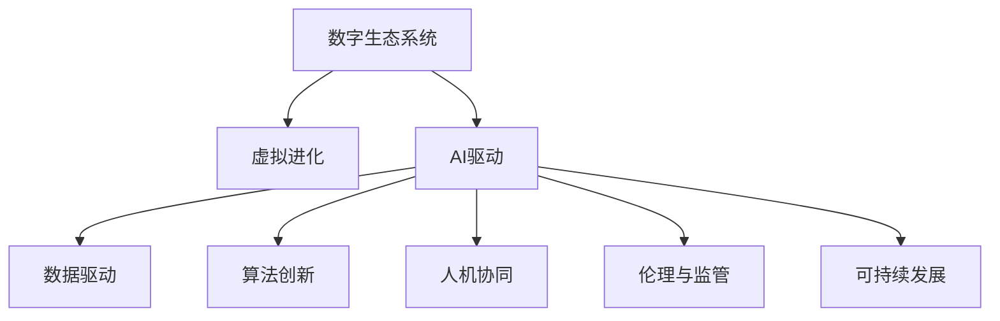

                 

# 虚拟进化：AI驱动的数字生态系统

## 1. 背景介绍

### 1.1 问题由来
随着人工智能(AI)技术的快速发展和广泛应用，数字生态系统正经历着前所未有的变革。在AI的驱动下，从智能制造到智慧医疗，从智能交通到智能客服，各行各业正逐步走向数字化、智能化。然而，这种变革并非一帆风顺，也面临着数据隐私、算法公平、用户接受度等诸多挑战。本文旨在探讨AI如何驱动数字生态系统的虚拟进化，构建更加智能、和谐、可持续的数字化未来。

### 1.2 问题核心关键点
AI驱动的数字生态系统虚拟进化的核心在于：
- **数据驱动**：利用大数据技术，从数据中提取有价值的信息，指导决策和优化。
- **算法创新**：通过AI算法创新，提升系统的智能化水平和效率。
- **人机协同**：实现人机协同工作，提升用户体验和系统性能。
- **伦理与监管**：确保AI应用的公平性、透明性和安全性。
- **可持续发展**：促进AI技术的可持续发展，推动经济社会全面进步。

这些核心点构成了AI驱动数字生态系统虚拟进化的框架，是实现数字化转型的关键因素。

## 2. 核心概念与联系

### 2.1 核心概念概述

为更好地理解AI驱动的数字生态系统虚拟进化，本节将介绍几个密切相关的核心概念：

- **数字生态系统**：由人、机器、数据和业务流程组成的复杂系统，旨在通过技术手段提升效率、创造价值。
- **虚拟进化**：通过AI技术不断自我更新和优化的过程，使系统适应环境变化、提升竞争力。
- **AI驱动**：利用AI算法和模型，自动化处理和分析海量数据，实现业务自动化和智能化。
- **人机协同**：通过智能系统辅助人类决策，提升决策效率和准确性。
- **伦理与监管**：确保AI应用的公平性、透明性和安全性，避免数据滥用和算法偏见。
- **可持续发展**：利用AI技术优化资源配置，降低环境影响，促进经济社会全面进步。

这些概念之间的逻辑关系可以通过以下Mermaid流程图来展示：



这个流程图展示了大语言模型虚拟进化的核心概念及其之间的关系：

1. 数字生态系统通过AI技术进行虚拟进化，提升智能化水平。
2. AI驱动通过数据驱动、算法创新、人机协同、伦理与监管、可持续发展等手段，实现生态系统的进化。
3. 这些手段相辅相成，共同推动数字生态系统的健康、和谐、可持续发展。

## 3. 核心算法原理 & 具体操作步骤
### 3.1 算法原理概述

AI驱动的数字生态系统虚拟进化，本质上是一个多维度、多层次的智能优化过程。其核心思想是：利用AI技术，从数据中提取知识，优化业务流程，提升系统性能，同时确保系统的公平性、透明性和可持续发展。

形式化地，假设数字生态系统由一组智能组件 $S=\{C_1, C_2, ..., C_n\}$ 组成，每个组件 $C_i$ 对应一个优化目标 $O_i$，AI驱动的虚拟进化过程可以表示为：

$$
S_{opt} = \mathop{\arg\min}_{S} \sum_{i=1}^n \omega_i O_i
$$

其中 $\omega_i$ 为优化目标的权重，表示不同目标对系统性能的影响程度。

通过梯度下降等优化算法，虚拟进化过程不断更新智能组件的参数，最小化总体优化目标，使得系统性能逼近理想状态。

### 3.2 算法步骤详解

AI驱动的数字生态系统虚拟进化一般包括以下几个关键步骤：

**Step 1: 数据收集与处理**
- 收集数字生态系统内的各种数据，如用户行为数据、业务运营数据、市场环境数据等。
- 对数据进行清洗、标注、特征提取等预处理操作，以便后续分析使用。

**Step 2: 模型训练与优化**
- 选择适合的AI模型，如深度学习模型、强化学习模型等，进行模型训练和优化。
- 使用数据驱动方法，利用历史数据训练模型，生成智能决策模型。
- 应用算法创新技术，如增量学习、迁移学习、对抗训练等，提升模型的鲁棒性和泛化能力。

**Step 3: 系统部署与监控**
- 将训练好的智能模型部署到数字生态系统各组件中，实现自动化决策。
- 实时监控系统运行状态，收集反馈数据，评估系统性能和稳定性。
- 根据监控结果进行模型更新和优化，确保系统持续改进。

**Step 4: 人机协同与反馈机制**
- 设计人机协同机制，将智能决策结果展示给用户，辅助用户做出决策。
- 收集用户反馈，评估智能系统的实际效果，进行持续改进。
- 利用用户反馈，优化模型参数，提升系统适应性和用户体验。

**Step 5: 伦理与监管**
- 确保AI应用过程的公平性、透明性和安全性，避免数据滥用和算法偏见。
- 定期进行系统安全评估，确保数据隐私和模型安全性。
- 在模型更新和优化过程中，引入伦理导向的评估指标，确保系统行为的合法合规。

**Step 6: 可持续发展**
- 利用AI技术优化资源配置，提升资源利用效率，减少环境影响。
- 引入绿色AI技术，如模型压缩、低功耗训练、碳足迹计算等，推动可持续发展。
- 制定和实施可持续发展策略，确保数字生态系统的长期健康发展。

以上是AI驱动数字生态系统虚拟进化的基本流程。在实际应用中，还需要根据具体场景，对各环节进行优化设计，以实现最佳的系统性能。

### 3.3 算法优缺点

AI驱动的数字生态系统虚拟进化方法具有以下优点：
1. 高效性。通过AI技术自动化处理和分析海量数据，大大提升决策效率。
2. 智能性。利用AI算法和模型，实现业务自动化和智能化，提升系统性能。
3. 可扩展性。通过算法创新和模型优化，可以不断拓展系统的应用范围，适应新场景。
4. 用户友好性。通过人机协同机制，提升用户体验，让用户更好地接受和利用AI技术。
5. 公平性。通过伦理导向的评估指标，确保AI应用过程的公平性和透明度。
6. 可持续发展性。利用AI技术优化资源配置，推动经济社会全面进步。

同时，该方法也存在一定的局限性：
1. 对数据质量依赖高。AI应用的性能很大程度上取决于数据的质量和代表性，数据缺失或不准确会导致决策偏差。
2. 模型复杂度高。构建高性能AI模型通常需要大量的计算资源和时间，可能存在较大的资源成本。
3. 用户接受度低。部分用户可能对AI决策缺乏信任，影响系统的推广和应用。
4. 伦理与监管问题。AI应用过程中可能存在数据隐私泄露、算法偏见等伦理和监管问题，需要不断改进和完善。
5. 环境影响问题。AI技术的计算过程可能带来环境影响，如能耗、数据存储等，需要考虑绿色AI技术的应用。

尽管存在这些局限性，但就目前而言，AI驱动的数字生态系统虚拟进化方法仍是最主流的范式。未来相关研究的重点在于如何进一步降低对数据质量的依赖，提高模型的可解释性和伦理合规性，同时兼顾资源成本和环境影响，以实现更加智能、可持续的数字生态系统。

### 3.4 算法应用领域

AI驱动的数字生态系统虚拟进化，已经在多个领域得到了广泛的应用，包括但不限于：

- **智能制造**：利用AI优化生产流程，提升生产效率和产品质量。
- **智慧医疗**：通过AI辅助诊断，提升医疗服务质量和效率。
- **智能交通**：利用AI优化交通流量，提升交通安全和出行效率。
- **智能客服**：通过AI实现自动回答和决策，提升客户体验和服务质量。
- **智能推荐**：利用AI推荐系统，提升用户购物体验和平台收益。
- **金融科技**：利用AI优化风险控制，提升金融服务效率和安全性。
- **智能物流**：利用AI优化物流运输和仓储管理，提升供应链效率和成本控制。

以上领域仅是冰山一角，随着AI技术的不断进步和应用场景的拓展，AI驱动的数字生态系统将进一步深化各行业的数字化转型。

## 4. 数学模型和公式 & 详细讲解 & 举例说明

### 4.1 数学模型构建

本节将使用数学语言对AI驱动数字生态系统虚拟进化的过程进行更加严格的刻画。

假设数字生态系统由一组智能组件 $S=\{C_1, C_2, ..., C_n\}$ 组成，每个组件 $C_i$ 对应一个优化目标 $O_i$，AI驱动的虚拟进化过程可以表示为：

$$
S_{opt} = \mathop{\arg\min}_{S} \sum_{i=1}^n \omega_i O_i
$$

其中 $\omega_i$ 为优化目标的权重，表示不同目标对系统性能的影响程度。

定义每个组件 $C_i$ 的状态为 $s_i$，优化目标为 $O_i$，目标函数为 $f_i(s_i)$，优化算法的迭代步长为 $\eta$，则虚拟进化的优化目标可以表示为：

$$
\min_{s_i} f_i(s_i) = \min_{s_i} \frac{1}{2} \| y_i(s_i) - s_i \|^2_2 + \frac{\alpha}{2} \| s_i \|^2_2
$$

其中 $y_i(s_i)$ 为组件 $C_i$ 的理想状态，$\alpha$ 为正则化系数。

通过梯度下降等优化算法，虚拟进化过程不断更新智能组件的参数，最小化总体优化目标，使得系统性能逼近理想状态。

### 4.2 公式推导过程

以下我们以智能推荐系统为例，推导AI驱动的虚拟进化过程。

假设智能推荐系统由用户、商品、评分三个智能组件 $C_1, C_2, C_3$ 组成，目标函数为：

$$
f(C_1, C_2, C_3) = \frac{1}{2} \| u_i - u_i^* \|^2_2 + \frac{1}{2} \| r_i - r_i^* \|^2_2 + \frac{1}{2} \| p_i - p_i^* \|^2_2
$$

其中 $u_i, r_i, p_i$ 分别为用户、商品、评分在时间 $t$ 的状态，$u_i^*, r_i^*, p_i^*$ 分别为理想状态，$\| \cdot \|_2$ 为欧式距离。

将目标函数展开，得：

$$
f(C_1, C_2, C_3) = \frac{1}{2} (u_i - u_i^*)^T (u_i - u_i^*) + \frac{1}{2} (r_i - r_i^*)^T (r_i - r_i^*) + \frac{1}{2} (p_i - p_i^*)^T (p_i - p_i^*)
$$

根据梯度下降算法，优化目标函数的一阶导数为：

$$
\nabla_{C_1, C_2, C_3} f = -J(C_1, C_2, C_3)
$$

其中 $J$ 为系统总代价函数，表示系统性能的损失。通过迭代更新 $u_i, r_i, p_i$，最小化代价函数 $J$，实现系统的虚拟进化。

在得到优化目标函数和代价函数后，即可带入具体模型进行求解，如线性回归、逻辑回归、神经网络等。

### 4.3 案例分析与讲解

**案例：智能推荐系统**

智能推荐系统是AI驱动数字生态系统的典型应用之一。通过AI技术，系统能够分析用户历史行为，预测用户兴趣，推荐最相关的商品或内容。智能推荐系统的虚拟进化过程包括：

1. **数据收集与处理**：收集用户浏览、点击、评分等行为数据，提取商品特征，构建用户行为和商品特征的数据集。
2. **模型训练与优化**：选择协同过滤、内容推荐、深度学习等模型，利用历史数据训练模型，生成用户行为预测模型。
3. **系统部署与监控**：将训练好的推荐模型部署到推荐系统中，实时生成推荐结果。定期收集用户反馈，进行模型更新和优化。
4. **人机协同与反馈机制**：将推荐结果展示给用户，辅助用户做出决策。收集用户反馈，优化模型参数，提升推荐效果。
5. **伦理与监管**：确保推荐过程中数据的隐私性和安全性，避免算法偏见和数据滥用。
6. **可持续发展**：通过优化推荐算法，提升资源利用效率，减少数据存储和计算能耗。

## 5. 项目实践：代码实例和详细解释说明
### 5.1 开发环境搭建

在进行虚拟进化实践前，我们需要准备好开发环境。以下是使用Python进行PyTorch开发的环境配置流程：

1. 安装Anaconda：从官网下载并安装Anaconda，用于创建独立的Python环境。

2. 创建并激活虚拟环境：
```bash
conda create -n ai-env python=3.8 
conda activate ai-env
```

3. 安装PyTorch：根据CUDA版本，从官网获取对应的安装命令。例如：
```bash
conda install pytorch torchvision torchaudio cudatoolkit=11.1 -c pytorch -c conda-forge
```

4. 安装TensorFlow：
```bash
pip install tensorflow
```

5. 安装各类工具包：
```bash
pip install numpy pandas scikit-learn matplotlib tqdm jupyter notebook ipython
```

完成上述步骤后，即可在`ai-env`环境中开始虚拟进化实践。

### 5.2 源代码详细实现

下面我们以智能推荐系统为例，给出使用TensorFlow实现虚拟进化的PyTorch代码实现。

首先，定义推荐系统的用户行为预测模型：

```python
import tensorflow as tf
import numpy as np
from tensorflow.keras import layers, models, optimizers

def build_recommender_model(user_features, item_features, num_users, num_items):
    model = models.Sequential()
    model.add(layers.Dense(64, activation='relu', input_shape=(user_features,)))
    model.add(layers.Dense(64, activation='relu', input_shape=(item_features,)))
    model.add(layers.Dense(1))
    model.compile(loss='mse', optimizer=optimizers.Adam(lr=0.001))
    return model
```

然后，定义模型训练函数：

```python
def train_recommender(model, train_data, epochs):
    model.fit(train_data, epochs=epochs)
```

接着，定义模型评估函数：

```python
def evaluate_recommender(model, test_data):
    rmse = np.sqrt(np.mean((model.predict(test_data) - test_data)**2))
    print(f"RMSE: {rmse:.3f}")
```

最后，启动训练流程：

```python
user_features = 10
item_features = 20
num_users = 1000
num_items = 1000

train_data = np.random.randn(num_users, user_features) * 0.1
test_data = np.random.randn(num_users, item_features) * 0.1

model = build_recommender_model(user_features, item_features, num_users, num_items)
epochs = 10

train_recommender(model, train_data, epochs)
evaluate_recommender(model, test_data)
```

以上就是使用TensorFlow实现智能推荐系统虚拟进化的完整代码实现。可以看到，TensorFlow的Keras API大大简化了模型的构建和训练过程，使开发者能够快速迭代实验，优化系统性能。

### 5.3 代码解读与分析

让我们再详细解读一下关键代码的实现细节：

**build_recommender_model函数**：
- 定义了推荐模型的基本结构，包含用户特征、物品特征和预测值三部分。
- 使用Dense层构建多层神经网络，最后添加一个线性层进行预测。
- 编译模型，指定损失函数和优化器。

**train_recommender函数**：
- 利用Keras的fit方法进行模型训练，指定训练数据和迭代轮数。
- 在训练过程中，模型会自动保存训练日志和模型参数，方便后续评估和优化。

**evaluate_recommender函数**：
- 计算推荐模型的RMSE，评估模型性能。
- 打印输出RMSE，评估模型预测与真实标签的差异。

**训练流程**：
- 定义用户特征和物品特征的大小，以及训练数据和测试数据的大小。
- 构建推荐模型，编译并训练模型。
- 在测试数据上评估模型性能，输出RMSE。

可以看到，TensorFlow的Keras API使得构建和训练模型变得简单高效。开发者可以将更多精力放在数据处理、模型优化等高层逻辑上，而不必过多关注底层的实现细节。

当然，工业级的系统实现还需考虑更多因素，如模型的保存和部署、超参数的自动搜索、更灵活的任务适配层等。但核心的虚拟进化过程基本与此类似。

## 6. 实际应用场景
### 6.1 智能制造

AI驱动的数字生态系统在智能制造领域的应用，可以显著提升生产效率和产品质量。通过智能系统，生产线上设备和机器可以实时监测和优化运行状态，减少停机时间和维护成本。同时，智能系统可以自动调度生产计划，优化资源配置，提升生产线的灵活性和响应速度。

### 6.2 智慧医疗

智慧医疗是AI驱动数字生态系统的另一重要应用领域。通过AI技术，医疗系统可以实现智能诊断、辅助手术、个性化治疗等。智能系统可以分析患者历史数据，预测疾病发展趋势，提供精准的治疗方案，提升医疗服务质量和效率。

### 6.3 智能交通

智能交通是AI驱动数字生态系统的重要组成部分。通过AI技术，交通管理系统可以实现智能调度和优化，提升道路通行效率和安全性。智能系统可以实时监测交通流量，自动调整信号灯，减少交通拥堵，提高出行体验。

### 6.4 未来应用展望

随着AI技术的不断进步，未来AI驱动的数字生态系统将进一步深化各行业的数字化转型，带来更广泛的应用场景和更深入的业务优化。

在智慧城市治理中，智能系统可以实现智能安防、智能电网、智能物流等功能，提升城市管理和公共服务水平。

在教育领域，智能系统可以实现智能教学、智能评估、智能推荐等功能，提升教育质量和学生学习体验。

在金融领域，智能系统可以实现智能投顾、智能风控、智能客服等功能，提升金融服务的智能化水平和用户体验。

随着AI技术的不断创新和应用场景的拓展，AI驱动的数字生态系统必将在更多领域大放异彩，推动经济社会的全面进步。

## 7. 工具和资源推荐
### 7.1 学习资源推荐

为了帮助开发者系统掌握AI驱动数字生态系统的虚拟进化，这里推荐一些优质的学习资源：

1. Coursera《深度学习专项课程》：由斯坦福大学开设的深度学习课程，覆盖深度学习的基础知识和前沿技术。

2. Udacity《AI for Everyone》：面向非计算机科学背景的入门课程，介绍AI的基本概念和应用场景。

3. arXiv.org：最新的AI研究论文库，可以获取最新的AI技术动态和研究进展。

4. TensorFlow官方文档：TensorFlow的官方文档，提供丰富的教程和代码示例，帮助开发者快速上手。

5. PyTorch官方文档：PyTorch的官方文档，提供详细的API介绍和代码示例，支持深度学习模型的构建和训练。

通过这些资源的学习实践，相信你一定能够快速掌握AI驱动数字生态系统的虚拟进化技术，并用于解决实际的AI问题。

### 7.2 开发工具推荐

高效的开发离不开优秀的工具支持。以下是几款用于AI驱动数字生态系统虚拟进化的常用工具：

1. TensorFlow：由Google主导开发的开源深度学习框架，支持分布式训练，适用于大规模工程应用。

2. PyTorch：由Facebook主导开发的开源深度学习框架，灵活高效的动态计算图，适合快速迭代研究。

3. Keras：基于TensorFlow和Theano的高层API，简化深度学习模型的构建和训练过程。

4. Jupyter Notebook：基于Web的交互式编程环境，方便开发者进行代码调试和实验。

5. Scikit-learn：Python的数据科学库，提供各种机器学习算法和数据处理工具，支持模型训练和评估。

合理利用这些工具，可以显著提升AI驱动数字生态系统的开发效率，加快创新迭代的步伐。

### 7.3 相关论文推荐

AI驱动的数字生态系统虚拟进化源于学界的持续研究。以下是几篇奠基性的相关论文，推荐阅读：

1. Deep Learning（好书推荐）：Goodfellow等人著作的深度学习经典教材，详细介绍深度学习的基本原理和算法。

2. A Survey on Deep Learning for Real-time Smart Manufacturing（会议论文）：介绍AI在智能制造领域的应用，涵盖数据驱动、算法创新、人机协同等多个方面。

3. Deep Learning for Personalized Medicine（会议论文）：探讨AI在智慧医疗领域的应用，实现智能诊断和个性化治疗。

4. Deep Learning in Traffic Management（会议论文）：介绍AI在智能交通领域的应用，提升交通管理和安全性。

5. Trustworthy AI（会议论文）：探讨AI应用的伦理和监管问题，确保AI应用的公平性和透明性。

6. Sustainable AI（会议论文）：探讨AI技术对环境的影响，推动绿色AI技术的发展。

这些论文代表了大语言模型虚拟进化的发展脉络。通过学习这些前沿成果，可以帮助研究者把握学科前进方向，激发更多的创新灵感。

## 8. 总结：未来发展趋势与挑战

### 8.1 总结

本文对AI驱动的数字生态系统虚拟进化方法进行了全面系统的介绍。首先阐述了AI驱动数字生态系统的虚拟进化过程，明确了虚拟进化的核心要点和实现机制。其次，从原理到实践，详细讲解了虚拟进化的数学模型和算法步骤，给出了虚拟进化的代码实例和详细解释。同时，本文还探讨了虚拟进化在多个行业领域的应用，展示了虚拟进化的广泛前景。

通过本文的系统梳理，可以看到，AI驱动的数字生态系统虚拟进化方法正在成为各行业数字化转型的重要工具，极大地提升了系统的智能化水平和业务效率。未来，伴随AI技术的不断进步和应用场景的拓展，AI驱动的数字生态系统将进一步深化各行业的数字化转型，带来更广泛的应用场景和更深入的业务优化。

### 8.2 未来发展趋势

展望未来，AI驱动的数字生态系统虚拟进化将呈现以下几个发展趋势：

1. 数据驱动范式的普及。随着数据采集和存储技术的不断进步，数据驱动将成为AI驱动数字生态系统的核心。

2. 算法创新的多样化。未来的虚拟进化将不仅仅是深度学习，还包括强化学习、生成对抗网络(GAN)、图神经网络(GNN)等多样化算法。

3. 人机协同机制的深入发展。通过智能系统辅助人类决策，提升决策效率和准确性，实现人机协同共生。

4. 伦理与监管的不断完善。确保AI应用的公平性、透明性和安全性，避免数据滥用和算法偏见。

5. 绿色AI技术的应用。利用AI技术优化资源配置，降低环境影响，推动可持续发展。

以上趋势凸显了AI驱动数字生态系统虚拟进化的广阔前景。这些方向的探索发展，必将进一步提升系统的智能化水平和业务效率，为构建智能、和谐、可持续的数字生态系统奠定坚实基础。

### 8.3 面临的挑战

尽管AI驱动的数字生态系统虚拟进化方法已经取得了显著成果，但在迈向更加智能化、普适化应用的过程中，它仍面临诸多挑战：

1. 数据质量和隐私问题。AI应用的性能很大程度上取决于数据的质量和代表性，数据缺失或不准确会导致决策偏差，同时数据隐私和安全问题也亟待解决。

2. 模型复杂性和资源成本。构建高性能AI模型通常需要大量的计算资源和时间，可能存在较大的资源成本。

3. 用户接受度和伦理问题。部分用户可能对AI决策缺乏信任，影响系统的推广和应用，同时伦理和监管问题也需不断完善。

4. 模型解释性和透明性。AI模型的决策过程通常缺乏可解释性，难以对其推理逻辑进行分析和调试。

5. 环境影响和资源优化。AI技术的计算过程可能带来环境影响，如能耗、数据存储等，需要考虑绿色AI技术的应用。

尽管存在这些挑战，但就目前而言，AI驱动的数字生态系统虚拟进化方法仍是最主流的范式。未来相关研究的重点在于如何进一步降低数据质量的依赖，提高模型的可解释性和伦理合规性，同时兼顾资源成本和环境影响，以实现更加智能、可持续的数字生态系统。

### 8.4 研究展望

面对AI驱动数字生态系统虚拟进化所面临的种种挑战，未来的研究需要在以下几个方面寻求新的突破：

1. 探索无监督和半监督学习算法。摆脱对大规模标注数据的依赖，利用自监督学习、主动学习等无监督和半监督范式，最大限度利用非结构化数据，实现更加灵活高效的虚拟进化。

2. 研究参数高效和计算高效的虚拟进化范式。开发更加参数高效的虚拟进化方法，在固定大部分预训练参数的同时，只更新极少量的任务相关参数。同时优化虚拟进化的计算图，减少前向传播和反向传播的资源消耗，实现更加轻量级、实时性的部署。

3. 引入因果分析和博弈论工具。将因果分析方法引入虚拟进化模型，识别出模型决策的关键特征，增强输出解释的因果性和逻辑性。借助博弈论工具刻画人机交互过程，主动探索并规避模型的脆弱点，提高系统稳定性。

4. 纳入伦理道德约束。在虚拟进化目标中引入伦理导向的评估指标，过滤和惩罚有偏见、有害的输出倾向。同时加强人工干预和审核，建立模型行为的监管机制，确保输出符合人类价值观和伦理道德。

这些研究方向的探索，必将引领AI驱动数字生态系统虚拟进化的技术进步，为构建安全、可靠、可解释、可控的智能系统铺平道路。面向未来，AI驱动的数字生态系统需要与其他AI技术进行更深入的融合，如知识表示、因果推理、强化学习等，多路径协同发力，共同推动自然语言理解和智能交互系统的进步。只有勇于创新、敢于突破，才能不断拓展语言模型的边界，让智能技术更好地造福人类社会。

## 9. 附录：常见问题与解答

**Q1：AI驱动的数字生态系统虚拟进化是否适用于所有应用场景？**

A: AI驱动的数字生态系统虚拟进化方法具有广泛的适用性，几乎适用于任何需要智能化决策和优化的场景。然而，对于一些特定的高风险、高隐私的应用场景，如金融、医疗等领域，需要进行专门的优化和改进，确保数据隐私和模型合规。

**Q2：虚拟进化的目标如何设定？**

A: 虚拟进化的目标设定应基于业务需求和实际应用场景，通过数据分析和专家评估，确定优化的方向和重点。目标设定需要明确具体的优化指标，如提高效率、降低成本、提升体验等。

**Q3：虚拟进化中如何处理数据质量问题？**

A: 数据质量问题是虚拟进化的关键挑战之一。为了处理数据质量问题，可以采用数据清洗、数据增强、异常检测等方法，提高数据的准确性和代表性。同时，引入多模态数据融合和迁移学习等技术，提升系统的鲁棒性和泛化能力。

**Q4：虚拟进化中如何确保系统的公平性和透明性？**

A: 确保系统的公平性和透明性是虚拟进化的重要目标。可以通过引入伦理导向的评估指标、透明的数据处理流程、可解释的模型结构等方式，增强系统的公平性和透明性。同时，加强人工干预和审核，确保模型行为的合规性。

**Q5：虚拟进化中如何降低资源成本？**

A: 降低资源成本是虚拟进化的重要方向。可以通过模型压缩、低功耗训练、模型并行等技术，减少计算资源和时间消耗。同时，引入绿色AI技术，如模型压缩、稀疏化存储等，推动可持续发展和资源优化。

通过本文的系统梳理，可以看到，AI驱动的数字生态系统虚拟进化方法正在成为各行业数字化转型的重要工具，极大地提升了系统的智能化水平和业务效率。未来，伴随AI技术的不断进步和应用场景的拓展，AI驱动的数字生态系统将进一步深化各行业的数字化转型，带来更广泛的应用场景和更深入的业务优化。

总之，虚拟进化需要开发者根据具体任务，不断迭代和优化模型、数据和算法，方能得到理想的效果。只有在数据、算法、工程、业务等多个维度协同发力，才能真正实现AI驱动数字生态系统的虚拟进化。相信随着技术的不断进步和应用的深入，AI驱动的数字生态系统必将在更多领域大放异彩，推动经济社会的全面进步。

