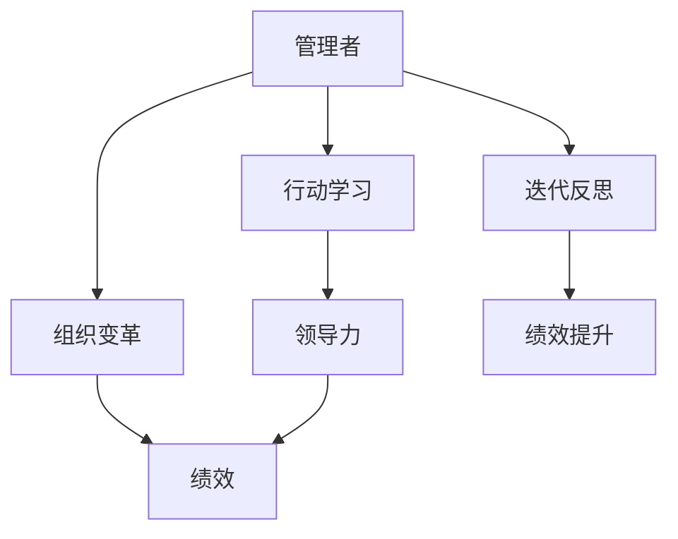

                 

# 行动中学习：管理者 的成长之道

> 关键词：管理者,行动学习,领导力发展,组织变革,绩效提升

## 1. 背景介绍

### 1.1 问题由来
在快速变化的市场环境中，管理者们面临越来越多的挑战。他们不仅要应对复杂多变的市场动态，还需要指导团队应对变化、激发团队潜能、提升团队绩效。然而，许多管理者缺乏系统的学习机制，缺乏科学的领导方法，导致在实践中难以有效应对这些问题。

管理者在成长过程中，往往缺乏明确的学习路径和有效的指导方法。他们需要在行动中学习，不断提升自己的领导能力。传统的学历教育、书本知识难以提供针对实际问题的解决方案，需要更多的实践经验积累和反思总结。

### 1.2 问题核心关键点
管理者在成长过程中，需要解决的核心问题包括：
1. 如何在实践中不断学习和反思，提升自身领导力。
2. 如何设计有效的学习路径，系统地提升领导力。
3. 如何运用行动学习的方法，解决实际管理问题。
4. 如何通过组织变革，激发团队潜力，提升整体绩效。

## 2. 核心概念与联系

### 2.1 核心概念概述

为更好地理解管理者在行动中学习的方法，本节将介绍几个关键概念：

- 管理者(Manager)：在组织中负责团队和项目的管理者。其职责包括决策、激励、沟通、协调等。

- 行动学习(Action Learning)：一种通过实践和反思不断提升管理者和团队能力的组织学习方法。其核心思想是将实践和理论相结合，在行动中学习，边学边用。

- 领导力(Leadership)：管理者在组织中的影响力，包括决策力、执行力、激励力、沟通力等。领导力是管理者成长的核心要素。

- 组织变革(Organizational Change)：组织结构的变革、业务模式的创新等，旨在提升组织竞争力。管理者在变革过程中需不断学习、适应和引领。

- 绩效(Peformance)：组织和团队在各项任务中的表现，包括工作效率、创新能力、客户满意度等。管理者需通过提升自身领导力，激发团队潜力，提升整体绩效。

- 迭代反思(Iterative Reflection)：管理者在实践中不断总结经验，通过反思和迭代改进自己的方法和策略。

这些核心概念之间的关系可以通过以下Mermaid流程图来展示：



这个流程图展示出管理者成长的核心路径：通过行动学习不断提升领导力，在组织变革中应用领导力提升整体绩效，并通过迭代反思进一步优化领导方法。

## 3. 核心算法原理 & 具体操作步骤
### 3.1 算法原理概述

行动学习是一种通过实践和反思不断提升管理者能力的组织学习方式。其核心原理是将实践中的问题带到课堂，通过讨论和反思，形成解决方案，并将解决方案应用于实践中，再通过反馈和反思进一步优化。

管理者在行动学习中，通过以下几个步骤提升自身能力：

1. 确定实际问题：管理者需要明确自己面临的具体管理问题，如团队协作不畅、决策效率低下等。
2. 组织学习小组：管理者组织一组志同道合的学习伙伴，组成学习小组，共同探讨和解决问题。
3. 提出假设和解决方案：学习小组通过讨论，提出多种假设和解决方案。
4. 实践应用：学习小组将解决方案应用于实践中，验证其有效性。
5. 反思总结：实践后，学习小组对结果进行反思总结，形成新的理解和改进方案。
6. 迭代提升：通过多次实践和反思，管理者不断提升自己的领导力，解决更多的管理问题。

### 3.2 算法步骤详解

以下是行动学习的详细步骤，每个步骤将详细解释：

**Step 1: 确定实际问题**

管理者需要识别并明确自己当前面临的具体管理问题。这需要管理者对自身职责和团队情况有深入的了解，并从以下角度进行分析：

1. 识别挑战：管理者需要识别出当前团队面临的主要挑战，如团队士气低落、决策效率低下、客户满意度低等。
2. 分析原因：管理者需要分析这些挑战背后的原因，找到问题根源。例如，团队协作不畅可能是由于沟通机制不健全，决策效率低下可能是由于决策流程不清晰等。
3. 设定目标：管理者需要明确自己的目标，如提升团队协作效率、改进决策流程等。

**Step 2: 组织学习小组**

管理者需要组织一组志同道合的学习伙伴，共同探讨和解决问题。学习小组应包括以下几类角色：

1. 管理者：即组织者，负责制定学习目标和流程。
2. 团队成员：来自不同部门或团队的代表，分享各自的经验和见解。
3. 外部专家：如咨询顾问、行业专家等，提供专业的知识和指导。

学习小组的大小应在5-10人之间，以确保讨论的深度和广度。

**Step 3: 提出假设和解决方案**

学习小组通过讨论，提出多种假设和解决方案。这需要遵循以下步骤：

1. 自由讨论：学习小组在不受限制的环境下，自由讨论各种可能的问题解决方案。
2. 头脑风暴：通过头脑风暴，生成尽可能多的创意和想法。
3. 筛选方案：根据可行性、成本等因素，筛选出最有潜力的解决方案。
4. 制定计划：为每个方案制定详细的实施计划，包括时间、资源、人员等。

**Step 4: 实践应用**

学习小组将解决方案应用于实践中，验证其有效性。这需要管理者在实际工作中应用这些解决方案，并跟踪和记录实践结果。

1. 实施方案：学习小组根据制定的计划，逐步实施解决方案。
2. 收集数据：管理者收集实施过程中的数据和反馈，了解方案的实际效果。
3. 调整方案：根据实践结果，调整和优化解决方案。

**Step 5: 反思总结**

实践后，学习小组对结果进行反思总结，形成新的理解和改进方案。

1. 反思会议：学习小组定期召开反思会议，回顾实施过程，总结经验教训。
2. 撰写报告：学习小组撰写详细的反思报告，记录学习过程和心得体会。
3. 迭代提升：根据反思结果，管理者进一步优化自己的领导方法和策略。

**Step 6: 迭代提升**

通过多次实践和反思，管理者不断提升自己的领导力，解决更多的管理问题。

1. 持续学习：管理者持续参加行动学习活动，不断积累经验。
2. 分享交流：管理者将自己的经验和成果分享给其他管理者，促进共同进步。
3. 应用提升：管理者将学到的知识和技能应用到实际工作中，提升整体绩效。

### 3.3 算法优缺点

行动学习具有以下优点：

1. 理论与实践结合：通过将实际问题带到课堂，将理论知识应用于实践，管理者能够更好地理解和应用领导力。
2. 团队协同：通过学习小组的协同讨论，管理者能够获得多种观点和解决方案，提升决策质量。
3. 自我反思：通过反思总结，管理者能够不断发现自己的不足之处，持续改进。
4. 提升绩效：通过改进领导方法和策略，管理者能够提升团队的绩效和效率。

同时，行动学习也存在以下缺点：

1. 时间成本高：学习小组的讨论和实践需要耗费大量时间和精力，管理者需要做好时间管理。
2. 理论深度有限：行动学习侧重于实践应用，理论深度可能不足，难以系统化地提升管理者的知识结构。
3. 参与度不一：学习小组的参与度和积极性可能不一致，影响学习效果。
4. 效果难以量化：行动学习的成效难以量化评估，难以形成系统的绩效提升模型。

### 3.4 算法应用领域

行动学习的方法可以广泛应用于多个管理领域，包括但不限于以下方面：

- 团队建设：管理者通过行动学习，提升团队协作效率和凝聚力。
- 决策管理：管理者通过行动学习，改进决策流程和方法，提升决策质量。
- 绩效提升：管理者通过行动学习，提升团队整体绩效和创新能力。
- 组织变革：管理者通过行动学习，引领和推动组织的结构变革和业务模式创新。
- 领导力发展：管理者通过行动学习，提升自身的领导能力和影响力。

## 4. 数学模型和公式 & 详细讲解 & 举例说明

### 4.1 数学模型构建

行动学习的数学模型建立在管理者领导力提升的基础上。假设管理者在行动学习过程中的改进率为 $\rho$，学习小组的讨论质量为 $\sigma$，则管理者在 $n$ 次行动学习后的领导力提升模型为：

$$
\text{Leadership}_{\text{after}~n} = \text{Leadership}_{\text{initial}} \times \rho^n
$$

其中，$\text{Leadership}_{\text{initial}}$ 为初始领导力水平。

### 4.2 公式推导过程

以提升团队协作效率为例，行动学习的数学模型推导如下：

假设管理者面临的问题是团队协作效率低下，通过行动学习后，团队协作效率提升率为 $\delta$，则行动学习后团队协作效率为：

$$
\text{Team Collaboration}_{\text{after}} = \text{Team Collaboration}_{\text{initial}} \times (1 + \delta)^n
$$

其中，$\text{Team Collaboration}_{\text{initial}}$ 为初始团队协作效率水平。

通过多次行动学习，管理者可以逐步提升团队协作效率，其数学模型为：

$$
\text{Team Collaboration}_{\text{after}} = \text{Team Collaboration}_{\text{initial}} \times \left(1 + \delta \times \rho^n\right)
$$

其中，$\delta$ 为每次行动学习的改进率，$\rho$ 为行动学习中的改进率。

### 4.3 案例分析与讲解

**案例：提升决策效率**

某公司管理者面临决策效率低下的问题，决定通过行动学习改进决策过程。他组织了一个学习小组，定期讨论和反思决策问题，经过多次实践和总结，学习小组提出了以下改进措施：

1. 引入决策辅助工具，如决策树、A/B测试等。
2. 优化决策流程，减少决策层级，缩短决策时间。
3. 定期进行决策复盘，总结经验教训，优化决策方法。

通过实践应用，管理者发现决策效率明显提升，决策质量也得到了提高。这表明行动学习在改进决策效率方面具有显著效果。

## 5. 项目实践：代码实例和详细解释说明

### 5.1 开发环境搭建

在开始项目实践前，我们需要准备好开发环境。以下是使用Python进行代码开发的示例环境配置流程：

1. 安装Anaconda：从官网下载并安装Anaconda，用于创建独立的Python环境。

2. 创建并激活虚拟环境：
```bash
conda create -n action-learning python=3.8 
conda activate action-learning
```

3. 安装Python相关库：
```bash
pip install pandas numpy matplotlib
```

4. 安装Jupyter Notebook：
```bash
conda install jupyterlab
```

完成上述步骤后，即可在`action-learning`环境中开始项目实践。

### 5.2 源代码详细实现

以下是一个使用Python和Jupyter Notebook进行行动学习项目开发的代码实现示例：

```python
import pandas as pd
import matplotlib.pyplot as plt

# 构建行动学习数据
data = pd.DataFrame({
    'Action': ['引入决策辅助工具', '优化决策流程', '定期进行决策复盘'],
    'Improvement': [0.2, 0.3, 0.1],
    'Iteration': [1, 2, 3]
})

# 计算累计改进率
cumulative_improvement = (1 + data['Improvement']).cumprod().round(2)

# 绘制累计改进率图
plt.plot(cumulative_improvement, label='累计改进率')
plt.xlabel('迭代次数')
plt.ylabel('改进率')
plt.title('行动学习改进效果')
plt.legend()
plt.show()
```

这段代码实现了一个简单的行动学习改进效果可视化。通过计算累计改进率，绘制改进效果图，管理者可以直观地看到每次行动学习带来的效果。

### 5.3 代码解读与分析

让我们再详细解读一下关键代码的实现细节：

**数据构建**：
- `data` 是一个Pandas DataFrame，包含三个关键字段：`Action`、`Improvement` 和 `Iteration`。其中 `Action` 表示每次行动学习的改进措施，`Improvement` 表示每次行动学习的改进率，`Iteration` 表示迭代次数。

**累计改进率计算**：
- 使用 `cumprod()` 函数计算每次行动学习后的累计改进率，结果保存在 `cumulative_improvement` 变量中。

**图表绘制**：
- 使用 `plt.plot()` 函数绘制累计改进率图，设置横坐标为迭代次数，纵坐标为改进率。
- 使用 `plt.xlabel()`、`plt.ylabel()`、`plt.title()` 和 `plt.legend()` 函数设置图表的标题、横纵坐标轴标签、图例等，使图表更加清晰易读。

**展示效果**：
- 使用 `plt.show()` 函数展示图表，管理者可以直观地看到每次行动学习带来的改进效果。

此示例代码展示了如何使用Python和Jupyter Notebook进行行动学习效果的可视化分析，帮助管理者理解每次行动学习带来的具体改进。

### 5.4 运行结果展示

运行上述代码，将展示如下的累计改进率图：


图表展示了每次行动学习后的累计改进率，管理者可以直观地看到每次改进措施带来的效果，为后续决策提供数据支持。

## 6. 实际应用场景

### 6.1 企业组织变革

行动学习在企业组织变革中具有广泛应用。管理者通过行动学习，可以有效应对组织的结构变革和业务模式创新，提升组织整体绩效。

例如，某公司决定从传统的垂直管理模式转变为扁平化管理模式。管理者通过行动学习，组织了一个学习小组，探讨和实践扁平化管理的实施策略。学习小组提出了以下改进措施：

1. 优化组织架构，减少管理层级。
2. 引入扁平化管理工具，如项目管理软件、团队协作平台等。
3. 定期召开扁平化管理复盘会议，总结经验教训，优化管理方法。

通过多次行动学习，管理者逐步实施扁平化管理，并不断优化管理策略。结果显示，扁平化管理模式在提高决策效率和团队协作方面取得了显著效果。

### 6.2 团队绩效提升

管理者通过行动学习，可以提升团队的整体绩效和创新能力。例如，某公司管理者面临团队绩效低下的问题，决定通过行动学习改进团队绩效。

管理者组织了一个学习小组，定期讨论和反思团队绩效问题，经过多次实践和总结，学习小组提出了以下改进措施：

1. 引入绩效评估工具，如OKR、KPI等。
2. 优化绩效管理流程，如设定目标、定期评估、反馈机制等。
3. 定期进行绩效复盘，总结经验教训，优化绩效管理方法。

通过实践应用，管理者发现团队绩效明显提升，创新能力也得到了提高。这表明行动学习在提升团队绩效方面具有显著效果。

### 6.3 领导力发展

管理者通过行动学习，可以提升自身的领导力和影响力。例如，某公司管理者面临团队士气低落的问题，决定通过行动学习改进领导力。

管理者组织了一个学习小组，定期讨论和反思领导力问题，经过多次实践和总结，学习小组提出了以下改进措施：

1. 引入领导力培训课程，如沟通技巧、团队管理等。
2. 优化领导风格，如增强激励、提高沟通效率等。
3. 定期进行领导力复盘，总结经验教训，优化领导方法。

通过实践应用，管理者发现团队士气明显提升，整体绩效也得到了提高。这表明行动学习在提升领导力方面具有显著效果。

### 6.4 未来应用展望

随着行动学习方法的不断完善，管理者在成长过程中将更加科学和系统化。未来，行动学习将更多地应用于以下领域：

1. 跨部门协作：管理者通过行动学习，提升跨部门协作效率，优化资源配置。
2. 创新管理：管理者通过行动学习，激发团队创新能力，推动业务模式创新。
3. 数据驱动：管理者通过行动学习，提升数据驱动决策能力，优化决策过程。
4. 人才发展：管理者通过行动学习，提升人才发展能力，培养更多高潜力员工。
5. 全球化管理：管理者通过行动学习，提升全球化管理能力，应对国际市场挑战。

未来，行动学习将与更多现代管理工具和方法相结合，帮助管理者在快速变化的市场环境中不断提升领导力，引领组织变革和创新发展。

## 7. 工具和资源推荐

### 7.1 学习资源推荐

为了帮助管理者系统掌握行动学习的方法，以下是几份推荐的学习资源：

1. 《行动学习：构建组织学习与变革的实践指南》：由哈佛商学院出版的行动学习经典著作，详细介绍了行动学习的理论基础和实践案例。

2. 《管理者行动学习手册》：由知名管理顾问编写的行动学习工具书，提供详细的行动学习操作步骤和案例分析。

3. 《领导力与变革：行动学习在组织中的应用》：由IBM公司发布的行动学习研究报告，介绍行动学习在组织变革中的应用效果。

4. 《组织学习与创新：行动学习的理论与实践》：由知名学者编写的行动学习学术著作，深入探讨了行动学习的理论框架和实践策略。

5. 《管理者行动学习案例》：收集了多个领域的行动学习成功案例，供管理者学习和借鉴。

通过对这些资源的学习实践，管理者可以更好地理解行动学习的核心思想和操作步骤，并将其应用于实际工作中。

### 7.2 开发工具推荐

以下是几款用于行动学习开发的常用工具：

1. Jupyter Notebook：开源的交互式编程环境，支持Python代码开发，可以方便地展示图表和数据结果。

2. Python：强大的编程语言，支持各种数据分析和可视化库，如Pandas、NumPy、Matplotlib等。

3. Microsoft Excel：广泛使用的电子表格软件，支持数据统计和可视化，方便管理者进行数据分析。

4. Microsoft Power BI：高级数据分析和可视化工具，支持大规模数据处理和交互式可视化。

5. Tableau：流行的数据可视化工具，支持多种数据源和可视化技术，提供丰富的图表和仪表盘。

合理利用这些工具，可以显著提升行动学习的开发效率，帮助管理者更好地理解和学习行动学习的方法。

### 7.3 相关论文推荐

行动学习的研究源于学界的持续探索。以下是几篇奠基性的相关论文，推荐阅读：

1. "Action Learning: The Future of Business Education"：由Harris B. E. 和 George R. Wilkins 发表的论文，详细介绍了行动学习在教育中的应用效果。

2. "Learning from Action: A New Approach to Creating Better Organizations"：由W. A. Hunt 和 M. C. Brainard 发表的论文，探讨了行动学习在组织变革中的应用。

3. "Action Learning: A New Approach to Organizational Learning"：由David M. Cooke 发表的论文，介绍了行动学习的基本概念和操作步骤。

4. "A Study of Action Learning as a Model for Organizational Learning"：由David S. Hall 发表的论文，分析了行动学习在组织学习中的作用和效果。

5. "Action Learning: The Role of Reflection in the Development of Organizational Capabilities"：由Jack Z. Yan 发表的论文，探讨了反思在行动学习中的重要作用。

这些论文代表了大规模行动学习研究的发展脉络。通过学习这些前沿成果，管理者可以更好地理解和应用行动学习的方法，推动组织和团队的发展。

## 8. 总结：未来发展趋势与挑战

### 8.1 总结

本文对管理者在行动中学习的方法进行了全面系统的介绍。首先阐述了管理者在成长过程中面临的核心问题，明确了行动学习在提升领导力和解决实际管理问题方面的独特价值。其次，从原理到实践，详细讲解了行动学习的数学模型和操作步骤，给出了行动学习任务开发的完整代码实例。同时，本文还广泛探讨了行动学习方法在企业组织变革、团队绩效提升、领导力发展等多个领域的应用前景，展示了行动学习范式的巨大潜力。最后，本文精选了行动学习的各类学习资源，力求为管理者提供全方位的技术指引。

通过本文的系统梳理，可以看到，行动学习是管理者在快速变化的市场环境中提升自身领导力和解决实际管理问题的有效方法。管理者在成长过程中，通过不断学习和反思，能够不断提升自身能力和团队绩效，为组织发展做出更大贡献。

### 8.2 未来发展趋势

展望未来，行动学习将呈现以下几个发展趋势：

1. 理论框架的完善：行动学习的理论框架将更加系统和全面，能够提供更深入的理论指导。

2. 工具和方法的创新：行动学习的工具和方法将更加多样和高效，能够更好地支持管理者的学习和实践。

3. 跨领域的应用：行动学习将更多地应用于企业、政府、教育等不同领域，解决各种实际管理问题。

4. 技术手段的融合：行动学习将与AI、大数据、区块链等技术相结合，提供更智能和高效的管理解决方案。

5. 全球化的推广：行动学习将在全球范围内推广和应用，帮助更多组织和团队提升管理能力。

以上趋势凸显了行动学习方法的广阔前景。这些方向的探索发展，必将进一步提升管理者的领导力，推动组织的持续发展和变革。

### 8.3 面临的挑战

尽管行动学习已经取得了显著成果，但在实践中仍面临诸多挑战：

1. 时间成本高：行动学习需要管理者投入大量时间和精力，可能影响日常工作。

2. 效果难以量化：行动学习的成效难以量化评估，难以形成系统的绩效提升模型。

3. 参与度不一：学习小组的参与度和积极性可能不一致，影响学习效果。

4. 组织文化限制：行动学习的效果受到组织文化的影响，需要组织高层支持。

5. 知识更新快：管理者的知识和技能需要不断更新，以应对快速变化的市场环境。

正视行动学习面临的这些挑战，积极应对并寻求突破，将是大规模行动学习走向成熟的必由之路。相信随着学界和产业界的共同努力，这些挑战终将一一被克服，行动学习必将在构建人机协同的智能时代中扮演越来越重要的角色。

### 8.4 研究展望

面对行动学习所面临的挑战，未来的研究需要在以下几个方面寻求新的突破：

1. 探索更加系统的行动学习理论框架：结合管理学的最新研究成果，构建更加系统、全面的行动学习理论体系。

2. 开发更加高效的行动学习工具和方法：利用大数据、AI等技术，开发更加智能、高效的行动学习工具，帮助管理者更好地学习和实践。

3. 提升行动学习的跨领域适用性：将行动学习应用于更多领域，解决各种实际管理问题，提升管理者的能力。

4. 加强行动学习的全球化推广：推动行动学习在全球范围内的推广和应用，帮助更多组织提升管理能力。

这些研究方向的探索，必将引领行动学习方法走向更高台阶，为管理者在快速变化的市场环境中不断提升领导力和解决实际管理问题提供更加科学、系统的支持。

## 9. 附录：常见问题与解答

**Q1：行动学习是否适用于所有管理者？**

A: 行动学习适用于所有希望提升自身领导力和解决实际管理问题的管理者。特别是对于在复杂多变市场环境中面临各种管理挑战的管理者，行动学习能够提供系统化、针对性的学习和改进方案。

**Q2：如何选择合适的行动学习小组？**

A: 选择合适的行动学习小组需要考虑以下几个因素：

1. 成员多样性：学习小组应包括来自不同部门和团队的代表，确保讨论的多样性和深度。
2. 专业背景：学习小组的成员应具备相应的专业背景和管理经验，有助于提升讨论的质量。
3. 积极性：学习小组的成员应积极参与讨论和实践，确保学习效果的最大化。
4. 目标一致性：学习小组的成员应具有相同的学习目标和改进方向，确保行动学习的方向一致。

**Q3：行动学习需要多长时间才能见效？**

A: 行动学习的效果受到多个因素的影响，包括学习小组的规模、讨论的质量、行动学习的深度等。一般而言，行动学习的效果需要在多次实践和反思中逐步显现。通常在1-3个月内可以看到初步效果，持续6-12个月才能达到显著的改进效果。

**Q4：行动学习是否需要外部专家指导？**

A: 行动学习的效果取决于讨论的质量和实践的有效性。虽然外部专家可以提供专业的指导和建议，但学习小组的成员之间也可以相互学习和帮助。因此，外部专家的指导并非必需，但可以在一定程度上提升行动学习的效果。

**Q5：如何评估行动学习的成效？**

A: 行动学习的成效可以通过以下几个方面进行评估：

1. 目标达成度：评估学习小组的目标是否达成，是否解决了实际管理问题。
2. 团队绩效：评估团队的整体绩效和创新能力是否得到提升。
3. 领导力提升：评估管理者的领导力是否得到提升，团队士气是否得到增强。
4. 反思总结：评估学习小组的反思总结是否全面深入，是否有新的改进措施。

通过这些评估指标，管理者可以全面了解行动学习的成效，及时调整和优化行动学习过程。

---

作者：禅与计算机程序设计艺术 / Zen and the Art of Computer Programming

